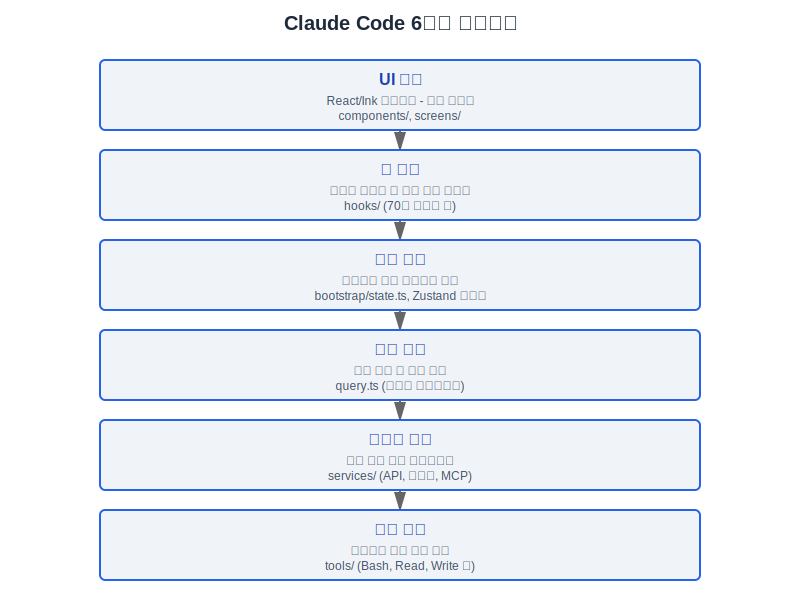
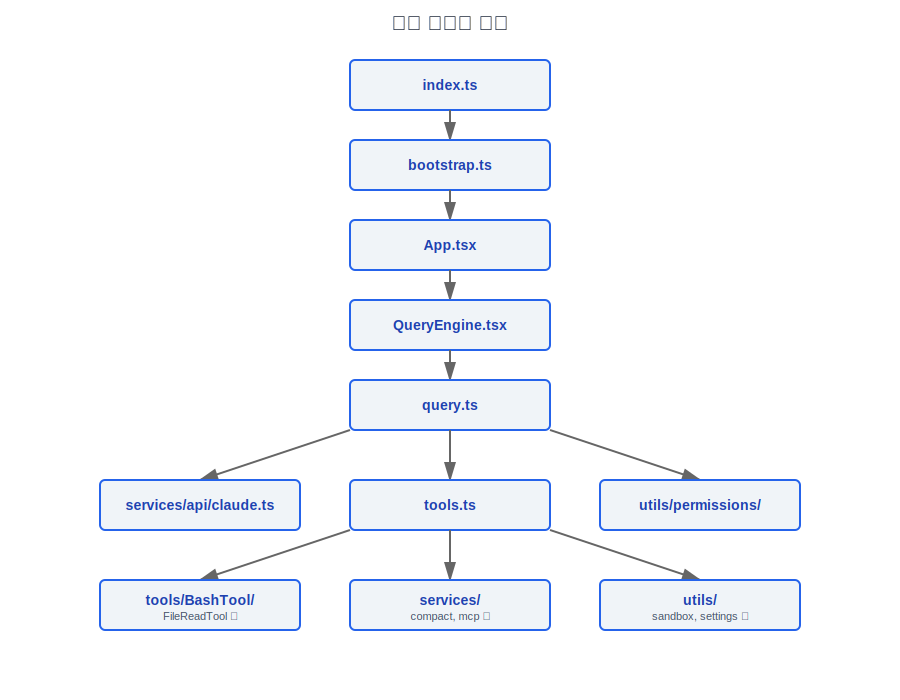

# 시스템 총람 - Claude Code v2.1.88

> 1884개의 TypeScript 소스 파일에 대한 역공학 분석을 기반으로 합니다.
> 빌드: 2026-03-30T21:59:52Z

---

## 1. 핵심 통계

| 항목 | 수량 |
|-----------|-------|
| TypeScript 소스 파일 (.ts/.tsx) | 1884 |
| 내장 도구(Tools) | 40+ |
| React 훅(Hooks) | 70+ |
| 슬래시 커맨드 | 87+ (101개 커맨드 디렉터리) |
| 백그라운드 서비스(Services) | 13 |
| 내장 스킬(Skills) | 17 |
| 훅(Hooks) 이벤트 타입 | 13 |
| 권한 모드(Permission Modes) | 6 (default/plan/acceptEdits/bypassPermissions/dontAsk/auto) + 1 내부 (bubble) |
| API 백엔드(Backends) | 4 (Anthropic/Bedrock/Vertex/Foundry) |
| MCP(Model Context Protocol) 전송 프로토콜 | 4 (stdio/sse/streamable-http/local) |

---

## 2. 소스 트리 구조

```
claudecode/sourcecode/src/
├── QueryEngine.ts          # SDK/print 모드 쿼리 엔진(Query Engine) 진입점 (ask() 생성기)
├── Task.ts                 # 백그라운드 작업 기본 클래스 정의
├── Tool.ts                 # 도구 타입 인터페이스 + ToolUseContext (792줄)
├── commands.ts             # 커맨드 레지스트리 + getSlashCommandToolSkills()
├── context.ts              # 전역 Context 팩토리
├── cost-tracker.ts         # 비용 추적 (getModelUsage/getTotalCost)
├── costHook.ts             # 비용 변경 훅(Hooks)
├── dialogLaunchers.tsx     # 다이얼로그 런처
├── history.ts              # 세션 히스토리 관리
├── ink.ts                  # Ink 렌더링 엔진 진입점
├── interactiveHelpers.tsx  # 대화형 UI 헬퍼 컴포넌트
├── main.tsx                # 애플리케이션 메인 진입점 (REPL 모드)
├── projectOnboardingState.ts # 프로젝트 온보딩 상태
├── query.ts                # 핵심 쿼리 루프 (1729줄) — 비동기 생성기
├── replLauncher.tsx        # REPL 런처
├── setup.ts                # 초기화 설정
├── tasks.ts                # 작업 시스템 진입점
├── tools.ts                # 도구 등록 테이블 (getAllBaseTools/getTools/assembleToolPool)
│
├── assistant/              # 어시스턴트 메시지 처리
├── bootstrap/              # 시작 부트스트랩 (state.ts 싱글톤 상태, growthbook 초기화)
├── bridge/                 # 브리지 프로토콜 (IDE 양방향 통신, 33개 파일)
├── buddy/                  # 반려 펫 시스템 (PRNG + 스프라이트 렌더링)
├── cli/                    # CLI 진입점 및 인수 파싱
├── commands/               # 87개 이상의 슬래시 커맨드 구현 (101개 서브디렉터리)
│   ├── add-dir/
│   ├── clear/
│   ├── commit.ts
│   ├── compact/
│   ├── config/
│   ├── ... (총 101개 디렉터리/파일)
│
├── components/             # React/Ink UI 컴포넌트 라이브러리
├── constants/              # 전역 상수 (betas, oauth, xml 태그, querySource)
├── context/                # 컨텍스트 관리 (알림, 프로바이더)
├── coordinator/            # 코디네이터(Coordinator) 모드 (멀티 워커 오케스트레이션)
├── entrypoints/            # 복수 진입점 (SDK, print, headless, HFI)
├── hooks/                  # React 훅(Hooks) (70개 이상)
│   ├── useCanUseTool.tsx   # 핵심 권한 결정 훅(Hooks)
│   ├── useTextInput.ts     # 텍스트 입력
│   ├── useVimInput.ts      # Vim 모드 입력
│   ├── useVoice.ts         # 음성 입력
│   ├── toolPermission/     # 도구 권한 UI 서브시스템
│   ├── notifs/             # 알림 서브시스템
│   └── ... (85개 이상의 파일)
│
├── ink/                    # Ink 렌더링 엔진 확장
├── keybindings/            # 키바인딩 시스템 (50개 이상의 액션, 코드 지원)
├── memdir/                 # 메모리 디렉터리 시스템 (CLAUDE.md 읽기 및 관리)
├── migrations/             # 데이터 마이그레이션
├── moreright/              # 우측 패널 확장
├── native-ts/              # 네이티브 TypeScript 모듈 (FFI 브리징)
├── outputStyles/           # 출력 스타일 시스템 (마크다운 프론트매터)
├── plugins/                # 플러그인(Plugin) 시스템 진입점
├── query/                  # 쿼리 서브모듈
│   ├── config.ts           # QueryConfig 타입 (sessionId + gates)
│   ├── deps.ts             # QueryDeps 의존성 주입 (callModel/microcompact/autocompact/uuid)
│   ├── stopHooks.ts        # 정지 훅(Hooks) 처리 (handleStopHooks)
│   └── tokenBudget.ts      # 토큰 예산 추적 (BudgetTracker)
│
├── remote/                 # 원격 세션 (CCR WebSocket)
├── schemas/                # Zod 유효성 검사 스키마
├── screens/                # 전체 화면 뷰 컴포넌트
├── server/                 # 내장 서버 (LSP, Bridge)
├── services/               # 백그라운드 서비스 계층 (13개 서브시스템)
│   ├── analytics/          # 텔레메트리 분석 (GrowthBook + Statsig + OTel)
│   ├── api/                # API 클라이언트 (client.ts/claude.ts/withRetry.ts/errors.ts/logging.ts)
│   ├── autoDream/          # 자동 드림 (세션 간 자율 작업)
│   ├── compact/            # 컨텍스트 압축 (micro/auto/reactive/snip)
│   ├── extractMemories/    # 메모리 추출 서비스
│   ├── lsp/                # LSP 통합 (JSON-RPC)
│   ├── mcp/                # MCP(Model Context Protocol) 프로토콜 구현 (설정/전송/인증/지연 로딩)
│   ├── oauth/              # OAuth 인증 (PKCE 플로우)
│   ├── plugins/            # 플러그인(Plugin) 서비스
│   ├── policyLimits/       # 정책 제한
│   ├── remoteManagedSettings/ # 원격 관리 설정
│   ├── settingsSync/       # 설정 동기화
│   ├── teamMemorySync/     # 팀 메모리 동기화
│   ├── tips/               # 팁 서비스
│   ├── tokenEstimation.ts  # 토큰 추정
│   ├── toolUseSummary/     # 도구 사용 요약 생성
│   ├── tools/              # 도구 오케스트레이션 계층 (StreamingToolExecutor/toolExecution/toolOrchestration)
│   ├── AgentSummary/       # 에이전트 요약
│   ├── MagicDocs/          # 매직 문서
│   ├── PromptSuggestion/   # 프롬프트 제안
│   ├── SessionMemory/      # 세션 메모리
│   └── voice.ts            # 음성 서비스
│
├── skills/                 # 스킬(Skills) 시스템
│   ├── bundled/            # 17개 내장 스킬(Skills)
│   │   ├── claudeApi.ts
│   │   ├── claudeApiContent.ts
│   │   ├── claudeInChrome.ts
│   │   ├── debug.ts
│   │   ├── keybindings.ts
│   │   ├── loop.ts
│   │   ├── loremIpsum.ts
│   │   ├── remember.ts
│   │   ├── scheduleRemoteAgents.ts
│   │   ├── simplify.ts
│   │   ├── skillify.ts
│   │   ├── stuck.ts
│   │   ├── updateConfig.ts
│   │   ├── verify.ts
│   │   ├── verifyContent.ts
│   │   ├── batch.ts
│   │   └── index.ts
│   ├── bundledSkills.ts
│   ├── loadSkillsDir.ts
│   └── mcpSkillBuilders.ts
│
├── state/                  # 상태 관리(State Management) (AppState + Zustand 스토어)
├── tasks/                  # 작업 시스템 구현
├── tools/                  # 도구 구현 (40개 이상의 도구)
│   ├── AgentTool/          # 서브 에이전트 도구
│   ├── AskUserQuestionTool/# 사용자 상호작용 도구
│   ├── BashTool/           # 셸 실행
│   ├── BriefTool/          # 간략 도구
│   ├── ConfigTool/         # 설정 도구 (ant 전용)
│   ├── EnterPlanModeTool/  # 플랜 모드 진입
│   ├── EnterWorktreeTool/  # 워크트리 진입
│   ├── ExitPlanModeTool/   # 플랜 모드 종료
│   ├── ExitWorktreeTool/   # 워크트리 종료
│   ├── FileEditTool/       # 파일 편집 (정밀 교체)
│   ├── FileReadTool/       # 파일 읽기
│   ├── FileWriteTool/      # 파일 쓰기
│   ├── GlobTool/           # 파일 패턴 검색
│   ├── GrepTool/           # 내용 검색 (ripgrep)
│   ├── LSPTool/            # LSP 도구
│   ├── ListMcpResourcesTool/ # MCP 리소스 목록
│   ├── MCPTool/            # MCP(Model Context Protocol) 도구 브리징
│   ├── McpAuthTool/        # MCP 인증
│   ├── NotebookEditTool/   # 노트북 편집
│   ├── PowerShellTool/     # PowerShell (Windows)
│   ├── REPLTool/           # REPL 도구 (ant 전용)
│   ├── ReadMcpResourceTool/# MCP 리소스 읽기
│   ├── RemoteTriggerTool/  # 원격 트리거
│   ├── ScheduleCronTool/   # 크론 스케줄링 (Create/Delete/List)
│   ├── SendMessageTool/    # 메시지 전송
│   ├── SkillTool/          # 스킬(Skills) 실행
│   ├── SleepTool/          # 슬립 도구
│   ├── SyntheticOutputTool/# 합성 출력
│   ├── TaskCreateTool/     # 작업 생성
│   ├── TaskGetTool/        # 작업 조회
│   ├── TaskListTool/       # 작업 목록
│   ├── TaskOutputTool/     # 작업 출력
│   ├── TaskStopTool/       # 작업 정지
│   ├── TaskUpdateTool/     # 작업 업데이트
│   ├── TeamCreateTool/     # 팀 생성
│   ├── TeamDeleteTool/     # 팀 삭제
│   ├── TodoWriteTool/      # 할 일 작성
│   ├── ToolSearchTool/     # 도구 검색 (지연 로딩 지원)
│   ├── WebFetchTool/       # 웹 가져오기
│   ├── WebSearchTool/      # 웹 검색
│   ├── shared/             # 공유 도구 인프라
│   ├── testing/            # 테스트 도구
│   └── utils.ts            # 도구 유틸리티 함수
│
├── types/                  # 타입 정의
│   ├── message.ts          # 완전한 메시지 타입
│   ├── permissions.ts      # 권한 타입 (PermissionMode/Rule/Behavior)
│   ├── hooks.ts            # 훅(Hooks) 타입
│   ├── tools.ts            # 도구 진행 타입
│   ├── ids.ts              # ID 타입 (AgentId/SessionId)
│   └── utils.ts            # 유틸리티 타입 (DeepImmutable)
│
├── upstreamproxy/          # 업스트림 프록시
├── utils/                  # 유틸리티 함수 라이브러리 (가장 큰 서브디렉터리)
│   ├── permissions/        # 권한 구현 (24개 파일)
│   ├── hooks/              # 훅(Hooks) 유틸리티 함수
│   ├── model/              # 모델 선택 및 라우팅
│   ├── memory/             # 메모리 관리
│   ├── settings/           # 설정 로딩
│   ├── shell/              # 셸 유틸리티
│   ├── sandbox/            # 샌드박스(Sandbox) 시스템
│   ├── telemetry/          # 텔레메트리 유틸리티
│   ├── messages.ts         # 메시지 구성 및 정규화
│   ├── tokens.ts           # 토큰 카운팅
│   ├── context.ts          # 컨텍스트 창 계산
│   ├── config.ts           # 설정 관리
│   └── ... (100개 이상의 파일)
│
└── vim/                    # Vim 모드 구현 (완전한 상태 머신)
└── voice/                  # 음성 시스템
```

---

## 3. 계층 아키텍처



### 설계 철학: 왜 MVC 대신 6계층 아키텍처인가

전통적인 CLI 도구는 일반적으로 MVC 또는 단순한 Controller→Service 2계층 모델을 사용합니다. Claude Code의 6계층 (UI→훅스→상태→쿼리→서비스→도구)은 과도한 엔지니어링처럼 보일 수 있지만, 각 계층은 특정 엔지니어링 제약 때문에 존재합니다:

1. **UI와 훅스의 분리** — UI 계층은 순수 렌더링 (React/Ink 컴포넌트)이고, 훅스 계층은 사이드 이펙트와 상태 로직을 캡슐화합니다. 이를 통해 70개 이상의 훅스가 서로 다른 UI 컴포넌트에 의해 조합 및 재사용될 수 있으며, 컴포넌트 트리에 로직을 내장시키지 않아도 됩니다. 근거: `hooks/useCanUseTool.tsx`는 권한 요청 UI, 도구 실행 흐름, 자동 모드 분류기의 세 가지 완전히 다른 시나리오에서 호출됩니다.

2. **상태와 쿼리의 분리** — 상태 계층 (`bootstrap/state.ts` 전역 싱글톤 + Zustand 스토어)은 프로세스 수준의 라이프사이클 상태를 관리하고, 쿼리 계층 (`query.ts` 비동기 생성기)은 단일 대화 턴에 대한 임시 상태를 관리합니다. 합쳐지면 프로세스 수준 상태 (`totalCostUSD`, `sessionId` 등)와 턴 수준 상태 (`messages`, `turnCount` 등)의 라이프사이클이 혼동되어 상태 누수로 이어질 수 있습니다.

3. **서비스와 도구의 분리** — 서비스는 상태 없는 기능 제공자 (API 클라이언트, 압축 알고리즘, MCP 프로토콜)이고, 도구는 정체성이 있는 실행 단위 (이름, 설명, 권한 요구사항 포함)입니다. 분리를 통해 동일한 서비스 (예: `services/api/claude.ts`)가 쿼리 엔진에 의해 직접 호출되거나 도구에 의해 간접적으로 호출될 수 있으며, 도구는 API 세부 사항을 이해할 필요가 없습니다.

핵심 인사이트: 이것은 계층화를 위한 계층화가 아니라 **라이프사이클 관리**의 필요성입니다. 6계층은 프로세스 수준 (상태/인프라), 세션 수준 (UI/훅스), 턴 수준 (쿼리/서비스/도구)의 3가지 서로 다른 라이프사이클에 해당합니다. MVC는 "프레젠테이션"과 "로직"만 구분하며 이 다단계 라이프사이클을 표현할 수 없습니다.

### 설계 철학: 왜 CLI에 React/Ink를 사용하는가

Claude Code의 터미널 출력은 전통적인 선형 텍스트 스트림이 아닙니다. 동시에 여러 동적으로 업데이트되는 영역을 가집니다:

- **메시지 스트림 영역** — 모델 응답이 토큰 단위로 스트리밍됩니다 (`components/Messages.tsx`)
- **도구 진행 영역** — 동시 도구 실행의 실시간 상태 (`components/Spinner.tsx`, 도구 진행 이벤트)
- **입력 박스 영역** — 도구 실행 중 권한 확인 다이얼로그가 팝업될 수 있습니다 (`components/PromptInput/`)
- **상태 바 영역** — 토큰 사용량, 비용, 모델 정보가 지속적으로 업데이트됩니다 (`components/StatusLine.tsx`, `components/Stats.tsx`)
- **전체 화면 오버레이** — 설정, 컨텍스트 시각화, 세션 복구 전체 화면 뷰 (`screens/`)

전통적인 `console.log` + ANSI 이스케이프 시퀀스로 구현한다면, 개발자는 각 영역의 줄 위치를 수동으로 추적하고, 중첩 새로고침을 처리하고, 커서 상태를 관리해야 합니다 — 본질적으로 UI 프레임워크를 재발명하는 것입니다. React의 선언적 모델은 이 복잡성을 조화 알고리즘에 캡슐화합니다: 각 컴포넌트는 "지금 어떻게 보여야 하는지"만 선언하고, Ink 엔진이 자동으로 최소한의 터미널 업데이트를 계산합니다.

근거: `src/components/`는 50개 이상의 컴포넌트 파일을 포함하고, `src/screens/`는 전체 화면 뷰 컴포넌트를, `src/hooks/`는 70개 이상의 React 훅스를 포함합니다 — 이 규모의 UI 복잡성은 명령형 방식으로 유지하면 재앙이 될 것입니다. Ink는 이 문제를 프론트엔드 엔지니어에게 친숙한 React 컴포넌트 개발로 줄여줍니다.

---

## 4. 모듈 의존성 그래프

### 4.1 핵심 의존성 체인



### 4.2 도구 시스템(Tool System) 의존성

```
tools.ts (등록 테이블)
  ├─→ Tool.ts (도구 타입 인터페이스 + ToolUseContext)
  ├─→ tools/AgentTool/      ← 서브 에이전트 생성, 재귀적으로 query 호출
  ├─→ tools/BashTool/       ← 셸 커맨드 실행
  ├─→ tools/SkillTool/      ← 스킬(Skills) 실행 (포크 에이전트)
  ├─→ tools/FileEditTool/   ← 정밀 파일 편집
  ├─→ tools/FileReadTool/   ← 파일 읽기
  ├─→ tools/FileWriteTool/  ← 파일 쓰기
  ├─→ tools/GlobTool/       ← 파일 검색
  ├─→ tools/GrepTool/       ← 내용 검색
  ├─→ tools/MCPTool/        ← MCP(Model Context Protocol) 도구 브리징
  ├─→ tools/WebFetchTool/   ← 웹 가져오기
  ├─→ tools/WebSearchTool/  ← 웹 검색
  └─→ tools/ToolSearchTool/ ← 도구 지연 검색
```

### 4.3 권한 시스템 의존성

```
hooks/useCanUseTool.tsx (권한 결정 진입점)
  └─→ utils/permissions/permissions.ts (canUseTool 파이프라인)
        ├─→ utils/permissions/PermissionRule.ts (규칙 타입)
        ├─→ utils/permissions/PermissionMode.ts (모드 정의)
        ├─→ utils/permissions/yoloClassifier.ts (자동 모드 분류기)
        ├─→ utils/permissions/bashClassifier.ts (Bash 커맨드 분류)
        ├─→ utils/permissions/pathValidation.ts (경로 안전성)
        ├─→ utils/permissions/dangerousPatterns.ts (위험 패턴 감지)
        ├─→ utils/permissions/shellRuleMatching.ts (셸 규칙 매칭)
        └─→ utils/sandbox/sandbox-adapter.ts (샌드박스(Sandbox) 실행)
```

### 4.4 서비스 계층 내부 의존성

```
services/
  ├─→ api/ ←── query.ts, QueryEngine.ts, services/compact/
  │     client.ts ← claude.ts ← withRetry.ts
  │     errors.ts ← claude.ts, withRetry.ts, query.ts
  │     logging.ts ← claude.ts
  │
  ├─→ compact/ ←── query.ts
  │     microCompact.ts ← autoCompact.ts ← compact.ts
  │     autoCompact.ts → api/claude.ts (getMaxOutputTokensForModel)
  │     compact.ts → api/claude.ts (queryModelWithStreaming)
  │
  ├─→ tools/ ←── query.ts
  │     toolOrchestration.ts → toolExecution.ts → Tool.ts
  │     StreamingToolExecutor.ts → toolExecution.ts
  │     toolHooks.ts → utils/hooks.ts
  │
  ├─→ mcp/ ←── tools/MCPTool, tools.ts (assembleToolPool)
  ├─→ analytics/ ←── 거의 모든 모듈 (logEvent 전역 호출)
  └─→ oauth/ ←── services/api/client.ts, utils/auth.ts
```

### 4.5 계층 간 핵심 경로

| 경로 | 흐름 |
|------|------|
| 사용자 입력 → 모델 응답 | `useTextInput` → `processUserInput` → `query()` → `claude.ts` → API |
| 도구 실행 | `query()` → `toolOrchestration` → `toolExecution` → `canUseTool` → tool.execute() |
| 컨텍스트 압축 | `query()` → `microcompact` → `autocompact` → API (또는 413에서 `reactiveCompact`) |
| 권한 결정 | `toolExecution` → `canUseTool` → 규칙 → 분류기 → 사용자 프롬프트 |
| MCP 브리징 | `tools.ts` → `assembleToolPool` → MCP 클라이언트 → MCPTool.execute() |
| 스킬(Skills) 실행 | `SkillTool` → `runForkedAgent` → 새 `query()` 인스턴스 |
| 서브 에이전트 | `AgentTool` → `createSubagentContext` → 새 `query()` 인스턴스 |

---

## 5. 진입점 매트릭스

| 진입점 | 파일 | 목적 |
|-------------|------|---------|
| REPL (대화형) | `main.tsx` → `replLauncher.tsx` | 터미널 대화형 세션 |
| Print (비대화형) | `entrypoints/print/` | 단일 쿼리 후 종료 |
| SDK | `entrypoints/sdk/` → `QueryEngine.ts` | 프로그래밍 방식 API |
| Headless | `entrypoints/headless/` | UI 없이 백그라운드 실행 |
| HFI (Human-Friendly Interface) | `entrypoints/hfi/` | 웹 친화적 인터페이스 |
| Bridge | `bridge/` | IDE 양방향 통신 |
| CLI | `cli/` | 커맨드라인 인수 파싱 |

---

## 6. 빌드 및 런타임 기능

### 6.1 기능 플래그 (컴파일 타임)

`feature('FLAG_NAME')`을 사용하여 컴파일 타임 기능 게이팅을 수행합니다 (Bun 번들러 트리 쉐이킹). 비활성화된 코드 경로는 빌드 시 완전히 제거됩니다:

- `REACTIVE_COMPACT` — 반응형 압축 (413 트리거)
- `CONTEXT_COLLAPSE` — 컨텍스트 축소
- `HISTORY_SNIP` — 히스토리 잘라내기
- `TOKEN_BUDGET` — 토큰 예산
- `EXTRACT_MEMORIES` — 메모리 추출
- `TEMPLATES` — 템플릿/작업 분류
- `EXPERIMENTAL_SKILL_SEARCH` — 스킬(Skills) 검색
- `TRANSCRIPT_CLASSIFIER` — 트랜스크립트 분류기 (자동 모드)
- `COORDINATOR_MODE` — 코디네이터(Coordinator) 모드
- `BASH_CLASSIFIER` — Bash 커맨드 분류기 (ant 전용)
- `CACHED_MICROCOMPACT` — 캐시된 마이크로컴팩트(Compact)
- `BG_SESSIONS` — 백그라운드 세션
- `PROACTIVE` / `KAIROS` — 능동적 에이전트
- `AGENT_TRIGGERS` / `AGENT_TRIGGERS_REMOTE` — 에이전트 트리거
- `MONITOR_TOOL` — 모니터 도구
- `OVERFLOW_TEST_TOOL` — 오버플로우 테스트
- `TERMINAL_PANEL` — 터미널 패널
- `WEB_BROWSER_TOOL` — 웹 브라우저 도구
- `UDS_INBOX` — Unix Domain Socket 인박스
- `WORKFLOW_SCRIPTS` — 워크플로우 스크립트

#### 왜 기능 플래그가 컴파일 타임 트리 쉐이킹을 사용하는가

Claude Code의 `feature('FLAG_NAME')`은 런타임 `if (config.featureEnabled('FLAG_NAME'))` 체크가 아닙니다 — Bun 번들러 (`from 'bun:bundle'`)의 컴파일 타임 매크로로, 비활성화된 코드 경로가 빌드 시 완전히 제거됩니다. 전체 코드베이스에서 196개 파일이 `feature()` 호출을 사용합니다.

이 선택은 보안과 유연성 사이의 명확한 트레이드오프를 만듭니다:

**보안 (컴파일 타임 제거의 핵심 장점):**
- 코드가 존재하지 않으면 = 악용될 수 없습니다. 예를 들어, `BASH_CLASSIFIER` (ant 전용)가 런타임에만 체크된다면 리버스 엔지니어링으로 분류기 로직을 여전히 찾을 수 있습니다. 컴파일 타임 제거 후에는 이 코드가 외부 빌드에 물리적으로 존재하지 않습니다.
- 공격 표면 감소: `OVERFLOW_TEST_TOOL`, `MONITOR_TOOL` 같은 디버그 도구는 프로덕션 빌드에서 완전히 제거되어 환경 변수 인젝션으로 활성화하는 것이 불가능합니다.

**유연성의 비용:**
- 기능 플래그를 변경하려면 재빌드 및 릴리스가 필요합니다 — LaunchDarkly처럼 실시간으로 원격에서 토글할 수 없습니다.
- 이것이 `QueryConfig` (`src/query/config.ts`)가 의도적으로 `feature()` 게이팅을 제외하고 런타임 변수 statsig/env 상태만 포함하는 이유입니다: 컴파일 타임과 런타임 게이팅은 두 가지 독립적인 시스템입니다.

**구현 세부사항:** `feature()` 호출은 `if` 조건이나 삼항 표현식에서만 나타날 수 있으며 (`src/query.ts:796` 주석: "feature() only works in if/ternary conditions (bun:bundle...)"), 번들러가 데드 코드 분기를 올바르게 식별하고 제거할 수 있습니다. 조건부 `require()` 패턴 (예: `const reactiveCompact = feature('REACTIVE_COMPACT') ? require(...) : null`, `src/query.ts:15-17`)은 전체 모듈 의존성 트리를 빌드에서 제외합니다.

### 6.2 환경 변수 게이팅

- `USER_TYPE=ant` — Anthropic 내부 직원 기능
- `CLAUDE_CODE_SIMPLE=true` — 단순화 모드 (Bash/Read/Edit만)
- `CLAUDE_CODE_DISABLE_FAST_MODE` — 패스트 모드 비활성화
- `NODE_ENV=test` — 테스트 환경 (TestingPermissionTool 활성화)
- `CLAUDE_CODE_VERIFY_PLAN=true` — 플랜 검증 도구

---

## 7. 데이터 흐름 개요

```
사용자 입력
    │
    ▼
processUserInput() ─── 커맨드 감지 ──→ 슬래시 커맨드 처리
    │
    ▼
query() 비동기 생성기 (while true 루프)
    │
    ├─→ 1단계: 컨텍스트 준비
    │     ├── applyToolResultBudget (20KB 초과 도구 결과를 디스크에 저장)
    │     ├── snipCompact (히스토리 잘라내기)
    │     ├── microcompact (도구 결과 압축, COMPACTABLE_TOOLS)
    │     ├── contextCollapse (컨텍스트 축소)
    │     └── autoCompact (자동 압축, 13K 버퍼)
    │
    ├─→ 2단계: API 호출
    │     ├── 시스템 프롬프트 조립 (systemPrompt + userContext + systemContext)
    │     ├── queryModelWithStreaming → getAnthropicClient
    │     └── 스트리밍(Streaming) 수신 (스트리밍 이벤트 → 메시지)
    │
    ├─→ 3단계: 도구 실행
    │     ├── partitionToolCalls (동시/직렬 배치)
    │     ├── runToolUse (권한 → 실행 → 결과)
    │     └── StreamingToolExecutor (스트리밍 도구 동시성)
    │
    ├─→ 4단계: 정지 훅스
    │     ├── executeStopHooks
    │     ├── executeExtractMemories
    │     ├── executePromptSuggestion
    │     ├── executeAutoDream
    │     └── cleanupComputerUseAfterTurn
    │
    └─→ 5단계: 계속/종료 결정
          ├── needsFollowUp → 루프 계속 (tool_use 블록 존재)
          ├── 토큰 예산 → 계속 또는 정지
          └── 9가지 종료 이유 중 하나 → Terminal 반환
```

### 설계 철학: 왜 핵심이 비동기 생성기인가

`query()` 함수 (`src/query.ts:219`)는 `async function*`으로 선언됩니다 — 이는 임의적인 문법 선택이 아니라 전체 시스템의 아키텍처 스타일의 초석입니다. 비동기 생성기는 동시에 네 가지 핵심 문제를 해결합니다:

1. **스트리밍 푸시** — LLM은 토큰 단위로 콘텐츠를 생성합니다. 생성기는 `yield`를 통해 `StreamEvent`, `Message` 및 기타 이벤트를 호출자에게 푸시합니다. 호출자는 완전한 응답을 기다리지 않고 실시간으로 렌더링할 수 있습니다. 이를 통해 REPL 모드, SDK 모드, Headless 모드가 동일한 생성기를 사용하지만 다르게 소비할 수 있습니다.

2. **백프레셔 제어** — 호출자는 `for await...of`를 통해 자신의 속도로 이벤트를 소비합니다. UI 렌더링이 API 수신 속도보다 느리면, 생성기가 자연스럽게 `yield` 지점에서 일시 정지하여 메모리 오버플로우를 방지합니다. 이것은 EventEmitter 패턴 (`on('data')` 콜백)보다 훨씬 안전합니다.

3. **타입 안전한 다형적 반환** — 생성기의 `yield` 타입 (`StreamEvent | Message | ...`)과 `return` 타입 (`Terminal`)이 별개입니다. `yield`는 중간 이벤트를 푸시하고, `return`은 종료 이유에만 사용됩니다. 이것은 EventEmitter의 문자열 이벤트 이름보다 더 타입 안전하며, TypeScript 컴파일러가 모든 이벤트 처리 경로를 완전히 체크합니다.

4. **우아한 취소** — 호출자는 `generator.return()`을 통해 즉시 루프를 종료할 수 있으며, 생성기 내부의 `using` 선언 (예: `pendingMemoryPrefetch`)이 자동으로 처리됩니다. 이것은 `AbortController`보다 더 세밀합니다 — `AbortController`는 fetch 요청만 취소할 수 있지만, 생성기는 어떤 `yield` 지점에서도 정지할 수 있습니다.

이 선택은 멀리까지 파급 효과를 미칩니다: 핵심이 생성기이기 때문에, 정지 훅스 (`stopHooks.ts`)도 생성기로 설계되었고 (UI에 진행 이벤트를 yield해야 함); `QueryEngine.ask()`도 생성기입니다; 심지어 서브 에이전트 (`AgentTool`)도 중첩 생성기를 통해 실행됩니다. 전체 시스템이 생성기 합성의 파이프라인 아키텍처를 형성합니다.

### 설계 철학: 왜 단일 통합 진입점 대신 7개의 진입점인가

7개의 진입점 (REPL/Print/SDK/Headless/HFI/Bridge/CLI)은 하나의 일반 진입점으로 통합될 수 있을 것처럼 보이지만, 근본적으로 다른 배포 시나리오를 해결합니다:

| 진입점 | 핵심 차이점 | 통합하지 않는 이유 |
|-------------|-----------------|-----------------|
| **REPL** (`main.tsx`) | 완전한 Ink 렌더링 + 대화형 입력 루프 | React 컴포넌트 트리, 키바인딩 시스템, Vim 모드 필요 |
| **Print** (`entrypoints/print/`) | 단일 쿼리 후 종료 | UI 루프 없음, stdout/파일로 출력, `gracefulShutdown` 필요 |
| **SDK** (`entrypoints/sdk/`) | 프로그래밍 방식 API | CLI 인수 파싱 없음, 터미널 출력이 아닌 구조화된 데이터 반환 |
| **Headless** (`entrypoints/headless/`) | UI 없이 백그라운드 실행 | 터미널 의존성 없음, CI/CD에 적합 |
| **HFI** (`entrypoints/hfi/`) | 웹 친화적 인터페이스 | HTTP 프로토콜, 터미널 렌더링이 아닌 JSON 직렬화 |
| **Bridge** (`bridge/`, 33개 파일) | IDE 양방향 통신 | LSP 프로토콜, 장기 연결 + 양방향 메시지 유지 필요 |
| **CLI** (`cli/`) | 커맨드라인 인수 파싱 | Commander.js 설정, 다른 진입점의 라우팅 계층 |

통합 진입점의 비용은 대규모 조건 분기가 될 것입니다 — 각 진입점은 I/O 모델 (대화형/배치/스트리밍/양방향), 라이프사이클 관리 (상주/단일/온디맨드), 출력 형식 (터미널/JSON/LSP)에 대해 완전히 다른 요구사항을 가집니다. 별도의 진입점을 통해 각 시나리오가 필요한 모듈만 로드할 수 있으며, 하위 쿼리 엔진 및 서비스 계층은 공유합니다.

근거: `src/main.tsx`의 1번 줄에는 REPL 전용 시작 최적화인 임포트 사이드 이펙트 (`profileCheckpoint`/`startMdmRawRead`/`startKeychainPrefetch`)가 있으며, SDK 진입점은 이것을 필요로 하지 않고 실행해서도 안 됩니다. `CLAUDE_CODE_ENTRYPOINT` 환경 변수 (`src/interactiveHelpers.tsx`)는 공유 코드에서 호출 소스를 구분하기 위해 정확히 10개의 값을 가집니다.

---

## 엔지니어링 실천 가이드

### 새 서브시스템 추가 체크리스트

Claude Code에 완전히 새로운 서브시스템을 추가해야 한다면 (예: 새 도구 카테고리, 새 서비스 모듈), 다음 단계를 따르십시오:

1. **`tools/`에 도구 디렉터리 생성** — 예: `tools/MyNewTool/`, `Tool` 인터페이스 구현 (`src/Tool.ts` 참조)
2. **`tools.ts`에 등록** — `getAllBaseTools()`의 적절한 위치에 도구 참조 추가; 기능 플래그 게이팅이 필요하면 조건부 스프레드 `...(feature('MY_FLAG') ? [MyNewTool] : [])` 사용
3. **권한 규칙 추가** — 도구가 파일시스템이나 네트워크 작업을 포함한다면, `utils/permissions/`에 해당 권한 체크 로직 추가; `dangerousPatterns.ts` 업데이트 (필요한 경우)
4. **테스트 추가** — 도구 테스트, 권한 테스트, 통합 테스트
5. **문서 업데이트** — 아키텍처 문서에 새 서브시스템에 대한 설계 결정 사항 기록

**주요 체크포인트**:
- 새 도구는 반드시 `isEnabled()`를 구현해야 합니다 — 도구가 도구 풀에 나타나지 않아야 할 때 false 반환
- 새 도구는 반드시 `isConcurrencySafe()`를 구현해야 합니다 — 확실하지 않으면 보수적으로 false 반환
- 새 도구가 UI 상호작용이 필요하다면, `ToolUseContext` 콜백 (`setToolJSX`, `addNotification` 등)을 사용하고, UI 모듈을 직접 임포트하지 마십시오

### 계층 간 디버깅 팁

| 디버깅 시나리오 | 조치 |
|---------------------|--------|
| **완전한 로그 체인 보기** | `--debug`로 시작, 모든 계층 로그가 stderr로 출력됨 |
| **직렬 실행 강제** | `CLAUDE_CODE_MAX_TOOL_USE_CONCURRENCY=1` 설정, 동시성 유발 비결정성 제거, 동시성 버그 위치 파악 |
| **완전한 API 호출 체인 추적** | `dumpPrompts` 출력 확인 (`services/api/dumpPrompts.ts`에서 활성화), API에 전송된 완전한 메시지 보기 |
| **쿼리 루프 상태 변화 추적** | `query.ts`의 `state = { ... }` 계속 사이트에 중단점 설정, `transition.reason` 필드에 집중 |
| **기능 플래그 상태 확인** | `feature()`는 컴파일 타임 매크로입니다 — 기능이 "사라졌다면", 런타임 환경 변수가 아닌 빌드 설정에 해당 플래그가 포함되어 있는지 확인 |

### 성능 분석 진입점

- **Perfetto 트레이스**: OTel 트레이싱이 활성화된 경우 (`initializeTelemetryAfterTrust()` 이후), API 지연 시간, 도구 실행 시간, 압축 기간을 포함한 완전한 호출 체인을 Perfetto를 통해 볼 수 있습니다
- **시작 성능 체크포인트**: `startupProfiler.ts`의 `profileCheckpoint()` 계측이 `main_tsx_entry`부터 `REPL` 렌더링까지 완전한 시작 체인을 커버합니다
- **FPS 지표**: UI 렌더링 성능은 `FpsMetrics`를 통해 모니터링됩니다. Ink 렌더링 엔진 프레임 레이트 저하에 주의하십시오
- **토큰 추정**: `services/tokenEstimation.ts`는 컨텍스트 창 사용 효율성 진단을 위한 토큰 카운팅을 제공합니다

### 일반적인 아키텍처 함정

1. **도구 계층에서 UI 계층에 직접 접근하지 마십시오** — 도구는 `ToolUseContext` 콜백 (`setToolJSX`, `addNotification`, `sendOSNotification`)을 통해 UI와 통신합니다. UI 컴포넌트를 직접 임포트하면 Headless/SDK 모드 호환성이 깨집니다 (이 모드들은 React 런타임이 없습니다).

2. **서비스 계층에서 대화형 환경을 가정하지 마십시오** — 서비스는 headless 모드, SDK 모드, 또는 CI 환경에서 실행될 수 있습니다. 사용자 입력이 필요할 때는 `isNonInteractiveSession`을 확인하고, UI 피드백이 필요할 때는 `shouldAvoidPermissionPrompts`를 확인하십시오.

3. **컴파일 타임 플래그와 런타임 플래그를 혼동하지 마십시오** — `feature('FLAG_NAME')`은 Bun 번들러의 컴파일 타임 매크로로, 빌드 후에는 불변합니다; `QueryConfig.gates` statsig/env 게이팅은 런타임 변수입니다. 잘못된 수준에서 플래그를 확인하면 "분명히 환경 변수를 설정했는데 기능이 작동하지 않는다"는 혼란이 발생합니다.

4. **전역 싱글톤 초기화가 완료되기 전에 상태에 접근하지 마십시오** — `bootstrap/state.ts`의 `getBootstrapState()`를 `init()` 완료 전에 호출하면 undefined 또는 초기 값을 얻습니다. 코드가 `init()` 체인 이후에 실행되도록 보장하십시오.

5. **쿼리 루프를 우회하여 API를 직접 호출하지 마십시오** — `services/api/claude.ts`의 `queryModelWithStreaming()`은 `withRetry.ts`의 재시도/폴백/쿨다운 로직과 조율해야 합니다. SDK를 직접 호출하면 모든 오류 복구 메커니즘을 건너뜁니다.


---

[색인](../README_KO.md) | [시작 및 초기화 →](../02-启动与初始化/initialization-ko.md)
