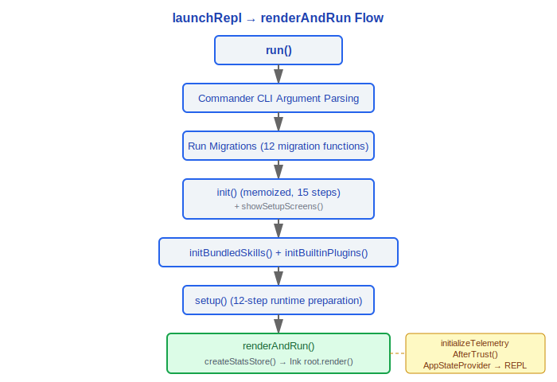
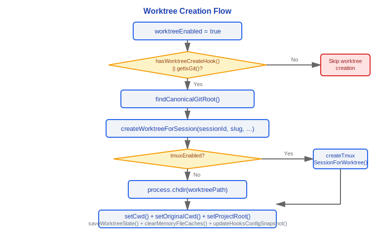

# Startup and Initialization

> Claude Code v2.1.88 startup flow panorama: the complete initialization chain from process entry to REPL rendering.

---

## 1. main.tsx Entry Point (src/main.tsx)

main.tsx is the physical entry point of the entire application. At the top of the file, three parallel prefetch operations are triggered during module evaluation phase through **import side effects**:

```
profileCheckpoint('main_tsx_entry')   // Mark process startup moment
startMdmRawRead()                     // Start MDM subprocess (plutil/reg query)
startKeychainPrefetch()               // macOS Keychain dual-channel parallel read (OAuth + legacy API key)
```

These three operations complete in parallel during the subsequent ~135ms import chain execution, which is a key design for startup performance optimization.

### 1.1 eagerLoadSettings()

Before calling `run()`, CLI arguments are pre-parsed via `eagerParseCliFlag`:

```typescript
function eagerLoadSettings(): void {
  profileCheckpoint('eagerLoadSettings_start')
  // Parse --settings flag to ensure correct settings file is loaded before init()
  const settingsFile = eagerParseCliFlag('--settings')
  if (settingsFile) loadSettingsFromFlag(settingsFile)

  // Parse --setting-sources flag to control which config sources to load
  const settingSourcesArg = eagerParseCliFlag('--setting-sources')
  if (settingSourcesArg !== undefined) loadSettingSourcesFromFlag(settingSourcesArg)
  profileCheckpoint('eagerLoadSettings_end')
}
```

### 1.2 initializeEntrypoint()

Sets the `CLAUDE_CODE_ENTRYPOINT` environment variable based on runtime mode to globally distinguish invocation source:

| ENTRYPOINT Value | Trigger Condition |
|---|---|
| `cli` | Interactive terminal direct execution |
| `sdk-cli` | Non-interactive mode (-p/--print, --init-only, --sdk-url, non-TTY) |
| `sdk-ts` | TypeScript SDK preset |
| `sdk-py` | Python SDK preset |
| `mcp` | `claude mcp serve` command |
| `claude-code-github-action` | CLAUDE_CODE_ACTION environment variable |
| `claude-vscode` | VSCode extension preset |
| `claude-desktop` | Claude Desktop app preset |
| `local-agent` | Local Agent mode launcher preset |
| `remote` | Remote session mode |

Priority: Already set environment variable > mcp serve detection > GitHub Action detection > interactive/non-interactive inference.

---

## 2. init() Function (src/entrypoints/init.ts)

`init()` is wrapped with lodash `memoize` to ensure it executes only once during the entire process lifecycle. Internally, it executes the following **15 initialization steps** in sequence:

| Step | Operation | Description |
|---|---|---|
| 1 | `enableConfigs()` | Validate and enable config system, parse settings.json / .claude.json |
| 2 | `applySafeConfigEnvironmentVariables()` | Apply only safe environment variables before Trust dialog |
| 3 | `applyExtraCACertsFromConfig()` | Read NODE_EXTRA_CA_CERTS from settings.json, inject before first TLS handshake |
| 4 | `setupGracefulShutdown()` | Register SIGINT/SIGTERM handlers to ensure data flush on exit |
| 5 | `initialize1PEventLogging()` | Async initialize first-party event logging (OpenTelemetry sdk-logs) |
| 6 | `populateOAuthAccountInfoIfNeeded()` | Async populate OAuth account info (VSCode extension login scenario) |
| 7 | `initJetBrainsDetection()` | Async detect JetBrains IDE environment |
| 8 | `detectCurrentRepository()` | Async identify GitHub repository (for gitDiff PR links) |
| 9 | `initializeRemoteManagedSettingsLoadingPromise()` / `initializePolicyLimitsLoadingPromise()` | Conditionally initialize remote managed settings and policy limits loading promises |
| 10 | `recordFirstStartTime()` | Record first startup time |
| 11 | `configureGlobalMTLS()` | Configure global mTLS settings |
| 12 | `configureGlobalAgents()` | Configure global HTTP proxy |
| 13 | `preconnectAnthropicApi()` | Preconnect to Anthropic API (TCP+TLS handshake ~100-200ms overlaps with subsequent operations) |
| 14 | `setShellIfWindows()` | Set git-bash on Windows environment |
| 15 | `ensureScratchpadDir()` | Conditionally create scratchpad directory (requires tengu_scratch gate) |

Exception handling: If config parsing fails (`ConfigParseError`), in interactive mode an `InvalidConfigDialog` is shown; in non-interactive mode, it writes to stderr and exits.

### Design Philosophy: Why Initialization Order Cannot Be Arbitrarily Adjusted

The 15-step sequence in `init()` is not arbitrary but a strict dependency chain. Key constraints include:

1. **`enableConfigs()` must be first** — All subsequent steps (environment variable injection, TLS config, OAuth) depend on the config system. If config parsing fails, `ConfigParseError` must be caught before any network operations.

2. **`applySafeConfigEnvironmentVariables()` before Trust dialog** — Proxy settings and CA certificate paths are "safe" environment variables that must be injected before the first TLS handshake (step 3 `applyExtraCACertsFromConfig` follows immediately). But "unsafe" environment variables (potentially from untrusted project configs) must wait until Trust is established.

3. **Network configuration (mTLS→proxy→preconnect) must be ordered** — `configureGlobalMTLS()` sets client certificates, `configureGlobalAgents()` configures HTTP proxy—both must complete before `preconnectAnthropicApi()`, otherwise the preconnect TCP+TLS handshake will use incorrect network configuration. The ~100-200ms preconnect overlaps with subsequent operations, which is key to startup performance optimization.

4. **GrowthBook reinitializes after Trust** — In `showSetupScreens()`, immediately after the Trust dialog completes, `resetGrowthBook()` + `initializeGrowthBook()` are called (`src/interactiveHelpers.tsx:149-150`), because GrowthBook's feature gating needs to include authentication headers to determine user identity. The GrowthBook instance before Trust may have used incomplete identity information.

5. **MCP server approval after GrowthBook** — `handleMcpjsonServerApprovals()` needs GrowthBook gating to determine which MCP features are available, so it must execute after GrowthBook reinitialization.

This dependency chain explains why `init()` is wrapped with `memoize` (`src/entrypoints/init.ts:57`)—it ensures that even if called multiple times, it executes only once, avoiding indeterminate behavior from repeated network configuration and TLS setup.

### Key: CCR Upstream Proxy

When `CLAUDE_CODE_REMOTE=1`, init() also starts a local CONNECT relay proxy:

```typescript
if (isEnvTruthy(process.env.CLAUDE_CODE_REMOTE)) {
  const { initUpstreamProxy, getUpstreamProxyEnv } = await import('../upstreamproxy/upstreamproxy.js')
  const { registerUpstreamProxyEnvFn } = await import('../utils/subprocessEnv.js')
  registerUpstreamProxyEnvFn(getUpstreamProxyEnv)
  await initUpstreamProxy()
}
```

---

## 3. showSetupScreens / TrustDialog (src/interactiveHelpers.tsx)

After init() completes and before REPL starts, the setup screens flow executes in interactive mode:

1. **GrowthBook initialization** — `initializeGrowthBook()` loads feature gating
2. **Trust dialog** — `checkHasTrustDialogAccepted()` checks trust status; shown on first run or when running from home directory
3. **Onboarding flow** — `completeOnboarding()` marks completion and writes `hasCompletedOnboarding: true`
4. **MCP server approval** — `handleMcpjsonServerApprovals()` handles project-level MCP server trust
5. **CLAUDE.md external includes warning** — `shouldShowClaudeMdExternalIncludesWarning()` detects external file references
6. **API Key validation** — Validates authentication credentials validity
7. **Settings change dialog** — Detects and applies settings changes

Session-level trust for the Trust dialog (home directory scenario) is recorded in Bootstrap State via `setSessionTrustAccepted(true)`, not persisted to disk.

### Design Philosophy: Why Bootstrap Is a Global Singleton

`bootstrap/state.ts` stores the entire process state in a module-level `const STATE: State = getInitialState()` (`src/bootstrap/state.ts:429`), accessed through 100+ exported getter/setter functions. The source code has three warning comments marking the sensitivity of this design:

- `// DO NOT ADD MORE STATE HERE - BE JUDICIOUS WITH GLOBAL STATE` (line 31)
- `// ALSO HERE - THINK THRICE BEFORE MODIFYING` (line 259)
- `// AND ESPECIALLY HERE` (line 428)

Global singletons are typically viewed as an anti-pattern, but in Claude Code's scenario it is reasonable:

1. **Initialization state written once, read globally** — Fields like `sessionId`, `originalCwd`, `projectRoot`, `isInteractive` are set at startup and never change. 70+ hooks and 40+ tools all need to access these values. If dependency injection were used instead, every hook and tool function signature would need an additional `bootstrapState` parameter, which in a codebase of 1884 source files means thousands of modifications.

2. **No concurrency risk** — Node.js's single-threaded model guarantees that the `STATE` object won't be concurrently modified. This is fundamentally different from global singletons in multi-threaded languages—no locks needed, no race conditions.

3. **Testable** — The `resetStateForTests()` function (`src/bootstrap/state.ts:919`) restores initial state in test environments, guarded by `process.env.NODE_ENV !== 'test'` to prevent production misuse.

4. **Accumulator for runtime metrics** — Metric values like `totalCostUSD`, `totalAPIDuration`, `totalLinesAdded` need to accumulate across multiple query loops throughout the entire process lifecycle. They don't belong to any single query or session, and can only be stored at the process level.

Trade-off: This design sacrifices module testability and composability (implicit state coupling) in exchange for lightweight state access ubiquitous throughout the codebase. This is a pragmatic choice between "architectural purity" and "engineering reality of 1884 files."

---

## 4. applyConfigEnvironmentVariables (src/utils/managedEnv.ts)

Two-phase environment variable injection design:

- **`applySafeConfigEnvironmentVariables()`** — Called before Trust dialog, only injects variables not involving security (like proxy settings, CA certificate paths)
- **`applyConfigEnvironmentVariables()`** — Called after Trust is established, injects all configured environment variables, including remote managed settings

The second phase is triggered by remote settings loading completion in `initializeTelemetryAfterTrust`:

```typescript
export function initializeTelemetryAfterTrust(): void {
  if (isEligibleForRemoteManagedSettings()) {
    void waitForRemoteManagedSettingsToLoad().then(async () => {
      applyConfigEnvironmentVariables()  // Reapply to include remote settings
      await doInitializeTelemetry()
    })
  } else {
    void doInitializeTelemetry()
  }
}
```

---

## 5. initializeTelemetryAfterTrust (src/entrypoints/init.ts)

Telemetry initialization executes only after Trust is established, with the `telemetryInitialized` flag preventing duplicate initialization:


---

## 6. launchRepl → renderAndRun

The `run()` function in main.tsx, after completing all CLI argument parsing and configuration, finally calls `renderAndRun` (from interactiveHelpers.tsx):



`launchRepl()` is the actual REPL launcher (src/replLauncher.tsx), responsible for building the initial AppState and calling renderAndRun.

---

## 7. setup.ts — 12 Major Steps (src/setup.ts)

The `setup()` function executes runtime environment preparation before REPL rendering, receiving parameters like `cwd`, `permissionMode`, `worktreeEnabled`:

| Step | Operation | Description |
|---|---|---|
| 1 | **Node version check** | `process.version` must be >= 18, otherwise `process.exit(1)` |
| 2 | **Custom Session ID** | When `customSessionId` parameter exists, call `switchSession()` |
| 3 | **UDS message server** | Start Unix Domain Socket message server when `feature('UDS_INBOX')` is enabled |
| 4 | **Teammate snapshot** | Capture teammate mode snapshot when `isAgentSwarmsEnabled()` |
| 5 | **Terminal backup restore** | Check and restore interrupted settings backup for iTerm2 / Terminal.app |
| 6 | **setCwd()** | Set working directory (must be called before code depending on cwd) |
| 7 | **Hooks snapshot** | `captureHooksConfigSnapshot()` + `initializeFileChangedWatcher()` |
| 8 | **Worktree creation** | Create git worktree when `worktreeEnabled`, optional tmux session |
| 9 | **Background task registration** | `initSessionMemory()`, `initContextCollapse()`, `lockCurrentVersion()` |
| 10 | **Prefetch** | `getCommands()`, `loadPluginHooks()`, commit attribution registration, team memory observer |
| 11 | **Security validation** | Reject `bypassPermissions` mode in non-sandbox environments (Docker/Bubblewrap) or with network access |
| 12 | **tengu_exit logging** | Read cost/duration/token metrics from last session in projectConfig and log |

### Worktree Flow Details



---

## 8. Authentication Resolution Chain — 6-Level Priority (src/utils/auth.ts)

`getAuthTokenSource()` is the core of authentication resolution, returning a `{ source, key }` tuple:

| Priority | Source | Description |
|---|---|---|
| 1 | **File Descriptor (FD)** | `getApiKeyFromFileDescriptor()` — SDK passes OAuth token or API key via FD |
| 2 | **Environment variable** | `ANTHROPIC_API_KEY` environment variable |
| 3 | **API Key Helper** | `getApiKeyFromApiKeyHelperCached()` — External helper program (like 1Password CLI) |
| 4 | **Config file / macOS Keychain** | `getApiKeyFromConfigOrMacOSKeychain()` — apiKey in .claude.json or legacy key in macOS Keychain |
| 5 | **OAuth Token** | Token obtained through OAuth flow (supports auto-refresh) |
| 6 | **Bedrock/Vertex credentials** | AWS Bedrock (`prefetchAwsCredentialsAndBedRockInfoIfSafe`) or GCP Vertex (`prefetchGcpCredentialsIfSafe`) cloud provider credentials |

API Key Helper mechanism:

```typescript
export async function getApiKeyFromApiKeyHelper(
  isNonInteractiveSession: boolean
): Promise<string | null> {
  // Read command from apiKeyHelper field in settings.json
  // Execute external command to get API key
  // Result is cached to avoid repeated execution
}
```

`prefetchApiKeyFromApiKeyHelperIfSafe()` prefetches at the end of setup(), executing only when Trust is already confirmed.

---

## 9. Startup Timing Diagram


---

## 10. Performance Analysis Checkpoints

Key checkpoints are embedded in the startup process via `profileCheckpoint()` for `startupProfiler.ts` to generate performance reports:

```typescript
const PHASE_MARKERS = {
  settings_time: ['eagerLoadSettings_start', 'eagerLoadSettings_end'],
  init_time: ['init_function_start', 'init_function_end'],
  // ... more checkpoints
}
```

Key time intervals:
- `main_tsx_entry` → `main_before_run`: Module loading + CLI parsing + settings loading
- `init_function_start` → `init_function_end`: Core initialization
- `init_safe_env_vars_applied` → `init_network_configured`: Network stack configuration
- `setup_before_prefetch` → `setup_after_prefetch`: Prefetch phase

---

## Engineering Practice Guide

### Debugging Startup Failures

Startup failures typically manifest as silent process exits or uncaught exceptions. Troubleshooting steps:

1. **Start with `--debug`** — All initialization step logs output to stderr, showing which step failed
2. **Check init() chain** — The 15 steps of `init()` are wrapped with `memoize` to ensure single execution. If any step throws an exception, all subsequent steps won't execute. First locate which step failed:
   - Steps 1-3 failure (config/env vars/CA certs) → Check if config file format is valid (`settings.json`, `.claude.json`)
   - Steps 11-13 failure (mTLS/proxy/preconnect) → Check network config, proxy settings, certificate paths
   - Step 14 failure (Windows shell) → Check if git-bash is installed
3. **ConfigParseError in interactive mode** — Config parsing failure shows `InvalidConfigDialog`; non-interactive mode writes to stderr then exits. If you see blank exit, check if running in non-interactive mode with config file syntax errors
4. **Bootstrap singleton issues** — `init()` failure causes Bootstrap singleton incomplete initialization, all subsequent operations (including `setup()`, `showSetupScreens()`) will fail due to unready dependencies. **Always start troubleshooting from init()**

### Adding New Initialization Steps

If you need to add new steps to the startup flow (e.g., new service preconnect, new config loading):

1. **Determine dependencies** — What does your step depend on? If it depends on network connection, must be placed after `configureGlobalMTLS()` + `configureGlobalAgents()`; if it depends on config system, must be after `enableConfigs()`
2. **Determine if Trust is needed** — If the step involves unsafe environment variables or user identity, should be placed after `showSetupScreens()` (after Trust dialog completes)
3. **Consider async parallelism** — Multiple steps in `init()` are async-started but not awaited (like `populateOAuthAccountInfoIfNeeded()`, `detectCurrentRepository()`). If your step is time-consuming but doesn't block subsequent steps, consider adopting the same pattern
4. **Add profileCheckpoint** — Add `profileCheckpoint('your_step_start')` / `profileCheckpoint('your_step_end')` before and after the step for performance analysis

**Key constraints**:
- `init()` is memoized, cannot call itself internally
- Don't add GrowthBook-dependent steps in `init()`—GrowthBook reinitializes in `showSetupScreens()` after Trust dialog
- If the new step might fail, consider whether it should be fatal (block startup) or soft-fail (log warning and continue)

### Feature Flag Debugging

Compile-time flags (`feature()` macro) and runtime flags are two independent systems:

| Type | Check Method | Modification Method |
|------|----------|----------|
| Compile-time (`feature()`) | View flag list in build config | Modify build config then rebuild |
| Runtime (statsig/env) | Check environment variables or GrowthBook state | Set environment variables or modify remote config |

**If a feature "disappeared"**:
1. First check if it's a compile-time flag—`feature()` calls are tree-shaken at build time; if flag is not enabled, code physically doesn't exist in build artifacts
2. Then check runtime flags—gate controls in `QueryConfig.gates`, environment variables, GrowthBook feature gates
3. Finally check if `isEnabled()` returns false—tool's `isEnabled()` may depend on runtime conditions

### Common Pitfalls

1. **Don't access `getBootstrapState()` before Bootstrap singleton initialization completes** — You'll get undefined or initial values. Getter functions in `bootstrap/state.ts` won't error when called before `init()` completes, but return initial state, potentially causing subtle bugs (like `sessionId` being empty string)

2. **Don't assume `showSetupScreens()` always executes** — In non-interactive mode (SDK, print, headless), the setup screens flow is skipped. If your logic depends on Trust dialog results, need to check `isInteractive` state

3. **Don't add network-requiring steps in `setup()`** — Network configuration in `setup()` is already completed in `init()`, but some steps in `setup()` (like Worktree creation) may change working directory. If your step needs network and depends on CWD, pay attention to execution order

4. **Don't ignore migration steps** — 12 migration functions execute in `run()` before `init()`. If you modify data formats, need to add corresponding migration to ensure old data compatibility


---

[← System Overview](../01-系统总览/system-overview-en.md) | [Index](../README_EN.md) | [Query Engine →](../03-查询引擎/query-engine-en.md)
