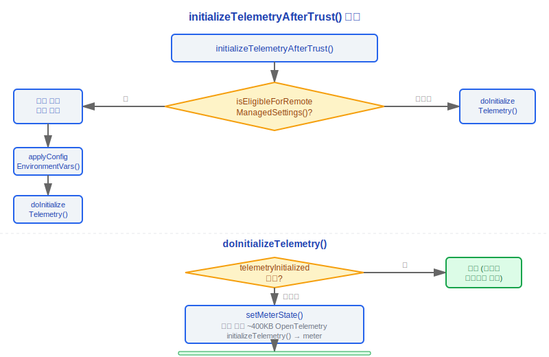
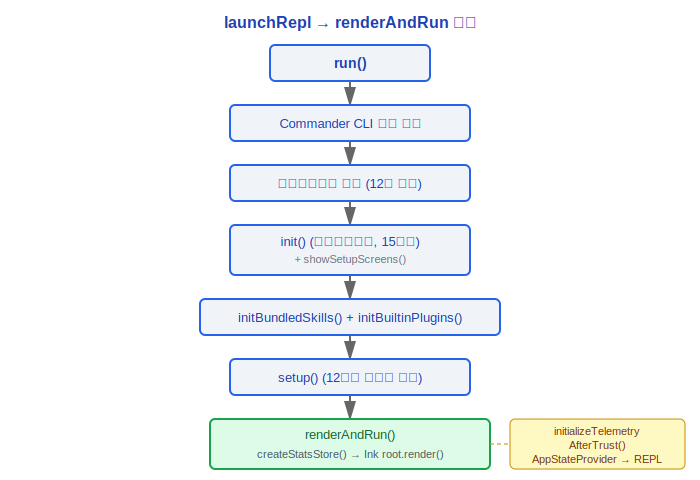
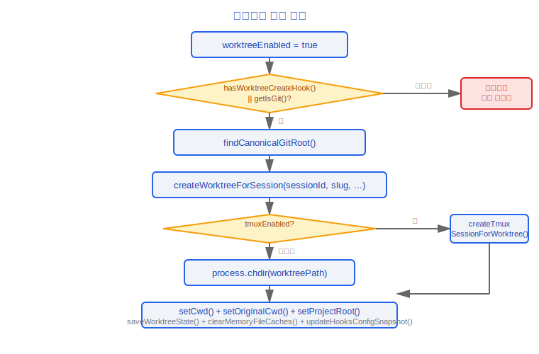
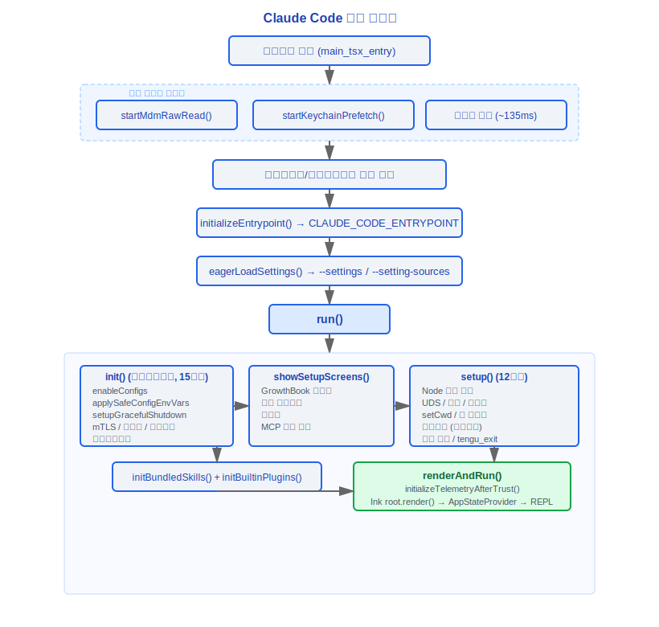

# 시작 및 초기화

> Claude Code v2.1.88 시작 흐름 파노라마: 프로세스 진입점부터 REPL 렌더링까지의 완전한 초기화 체인.

---

## 1. main.tsx 진입점 (src/main.tsx)

main.tsx는 전체 애플리케이션의 물리적 진입점입니다. 파일 상단에서는 **임포트 사이드 이펙트**를 통해 모듈 평가 단계에서 세 가지 병렬 프리페치 작업이 트리거됩니다:

```
profileCheckpoint('main_tsx_entry')   // 프로세스 시작 시점 기록
startMdmRawRead()                     // MDM 서브프로세스 시작 (plutil/reg query)
startKeychainPrefetch()               // macOS 키체인 이중 채널 병렬 읽기 (OAuth + 레거시 API 키)
```

이 세 가지 작업은 이후 ~135ms 임포트 체인 실행 중에 병렬로 완료되며, 시작 성능 최적화를 위한 핵심 설계입니다.

### 1.1 eagerLoadSettings()

`run()`을 호출하기 전에, CLI 인수가 `eagerParseCliFlag`를 통해 미리 파싱됩니다:

```typescript
function eagerLoadSettings(): void {
  profileCheckpoint('eagerLoadSettings_start')
  // init() 전에 올바른 설정 파일이 로드되도록 --settings 플래그 파싱
  const settingsFile = eagerParseCliFlag('--settings')
  if (settingsFile) loadSettingsFromFlag(settingsFile)

  // 어떤 설정 소스를 로드할지 제어하기 위해 --setting-sources 플래그 파싱
  const settingSourcesArg = eagerParseCliFlag('--setting-sources')
  if (settingSourcesArg !== undefined) loadSettingSourcesFromFlag(settingSourcesArg)
  profileCheckpoint('eagerLoadSettings_end')
}
```

### 1.2 initializeEntrypoint()

런타임 모드에 따라 `CLAUDE_CODE_ENTRYPOINT` 환경 변수를 설정하여 전역적으로 호출 소스를 구분합니다:

| ENTRYPOINT 값 | 트리거 조건 |
|---|---|
| `cli` | 대화형 터미널 직접 실행 |
| `sdk-cli` | 비대화형 모드 (-p/--print, --init-only, --sdk-url, non-TTY) |
| `sdk-ts` | TypeScript SDK 사전 설정 |
| `sdk-py` | Python SDK 사전 설정 |
| `mcp` | `claude mcp serve` 커맨드 |
| `claude-code-github-action` | CLAUDE_CODE_ACTION 환경 변수 |
| `claude-vscode` | VSCode 익스텐션 사전 설정 |
| `claude-desktop` | Claude Desktop 앱 사전 설정 |
| `local-agent` | 로컬 에이전트 모드 런처 사전 설정 |
| `remote` | 원격 세션 모드 |

우선순위: 이미 설정된 환경 변수 > mcp serve 감지 > GitHub Action 감지 > 대화형/비대화형 추론.

---

## 2. init() 함수 (src/entrypoints/init.ts)

`init()`은 전체 프로세스 라이프사이클 동안 단 한 번만 실행되도록 lodash `memoize`로 래핑되어 있습니다. 내부적으로 다음 **15개 초기화 단계**를 순서대로 실행합니다:

| 단계 | 작업 | 설명 |
|---|---|---|
| 1 | `enableConfigs()` | 설정 시스템 유효성 검사 및 활성화, settings.json / .claude.json 파싱 |
| 2 | `applySafeConfigEnvironmentVariables()` | 신뢰 다이얼로그 전에 안전한 환경 변수만 적용 |
| 3 | `applyExtraCACertsFromConfig()` | settings.json에서 NODE_EXTRA_CA_CERTS 읽기, 첫 번째 TLS 핸드셰이크 전에 주입 |
| 4 | `setupGracefulShutdown()` | SIGINT/SIGTERM 핸들러 등록, 종료 시 데이터 플러시 보장 |
| 5 | `initialize1PEventLogging()` | 비동기적으로 1파티 이벤트 로깅 초기화 (OpenTelemetry sdk-logs) |
| 6 | `populateOAuthAccountInfoIfNeeded()` | 비동기적으로 OAuth 계정 정보 채우기 (VSCode 익스텐션 로그인 시나리오) |
| 7 | `initJetBrainsDetection()` | 비동기적으로 JetBrains IDE 환경 감지 |
| 8 | `detectCurrentRepository()` | 비동기적으로 GitHub 저장소 식별 (gitDiff PR 링크용) |
| 9 | `initializeRemoteManagedSettingsLoadingPromise()` / `initializePolicyLimitsLoadingPromise()` | 조건부로 원격 관리 설정 및 정책 제한 로딩 프로미스 초기화 |
| 10 | `recordFirstStartTime()` | 첫 번째 시작 시간 기록 |
| 11 | `configureGlobalMTLS()` | 전역 mTLS 설정 구성 |
| 12 | `configureGlobalAgents()` | 전역 HTTP 프록시 구성 |
| 13 | `preconnectAnthropicApi()` | Anthropic API 사전 연결 (TCP+TLS 핸드셰이크 ~100-200ms, 이후 작업과 겹침) |
| 14 | `setShellIfWindows()` | Windows 환경에서 git-bash 설정 |
| 15 | `ensureScratchpadDir()` | 조건부로 스크래치패드 디렉터리 생성 (tengu_scratch 게이트 필요) |

예외 처리: 설정 파싱이 실패하는 경우 (`ConfigParseError`), 대화형 모드에서는 `InvalidConfigDialog`가 표시됩니다; 비대화형 모드에서는 stderr에 쓰고 종료합니다.

### 설계 철학: 왜 초기화 순서를 임의로 조정할 수 없는가

`init()`의 15단계 순서는 임의적이지 않으며 엄격한 의존성 체인입니다. 주요 제약사항은 다음과 같습니다:

1. **`enableConfigs()`가 반드시 먼저여야 함** — 이후의 모든 단계 (환경 변수 주입, TLS 설정, OAuth)는 설정 시스템에 의존합니다. 설정 파싱이 실패하면, 어떤 네트워크 작업 전에 `ConfigParseError`를 반드시 잡아야 합니다.

2. **신뢰 다이얼로그 전에 `applySafeConfigEnvironmentVariables()`** — 프록시 설정과 CA 인증서 경로는 첫 번째 TLS 핸드셰이크 전에 주입되어야 하는 "안전한" 환경 변수입니다 (단계 3 `applyExtraCACertsFromConfig`가 바로 뒤따릅니다). 그러나 "안전하지 않은" 환경 변수 (잠재적으로 신뢰할 수 없는 프로젝트 설정에서 온)는 신뢰가 확립될 때까지 기다려야 합니다.

3. **네트워크 설정 (mTLS→프록시→사전 연결)은 순서가 있어야 함** — `configureGlobalMTLS()`는 클라이언트 인증서를 설정하고, `configureGlobalAgents()`는 HTTP 프록시를 구성합니다 — 둘 다 `preconnectAnthropicApi()` 전에 완료되어야 합니다. 그렇지 않으면 사전 연결 TCP+TLS 핸드셰이크가 잘못된 네트워크 설정을 사용하게 됩니다. ~100-200ms 사전 연결은 이후 작업과 겹치는데, 이것이 시작 성능 최적화의 핵심입니다.

4. **신뢰 이후 GrowthBook 재초기화** — `showSetupScreens()`에서 신뢰 다이얼로그가 완료된 직후, `resetGrowthBook()` + `initializeGrowthBook()`이 호출됩니다 (`src/interactiveHelpers.tsx:149-150`). GrowthBook의 기능 게이팅이 사용자 신원을 결정하기 위해 인증 헤더를 포함해야 하기 때문입니다. 신뢰 전의 GrowthBook 인스턴스는 불완전한 신원 정보를 사용했을 수 있습니다.

5. **GrowthBook 이후 MCP 서버 승인** — `handleMcpjsonServerApprovals()`는 어떤 MCP 기능이 사용 가능한지 결정하기 위해 GrowthBook 게이팅이 필요하므로, GrowthBook 재초기화 이후에 실행되어야 합니다.

이 의존성 체인이 `init()`이 `memoize`로 래핑된 이유를 설명합니다 (`src/entrypoints/init.ts:57`) — 여러 번 호출되더라도 한 번만 실행되도록 보장하여, 반복적인 네트워크 설정 및 TLS 설정으로 인한 비결정적 동작을 방지합니다.

### 핵심: CCR 업스트림 프록시

`CLAUDE_CODE_REMOTE=1`일 때, init()은 로컬 CONNECT 릴레이 프록시도 시작합니다:

```typescript
if (isEnvTruthy(process.env.CLAUDE_CODE_REMOTE)) {
  const { initUpstreamProxy, getUpstreamProxyEnv } = await import('../upstreamproxy/upstreamproxy.js')
  const { registerUpstreamProxyEnvFn } = await import('../utils/subprocessEnv.js')
  registerUpstreamProxyEnvFn(getUpstreamProxyEnv)
  await initUpstreamProxy()
}
```

---

## 3. showSetupScreens / TrustDialog (src/interactiveHelpers.tsx)

init() 완료 후 REPL 시작 전에, 대화형 모드에서 설정 화면 흐름이 실행됩니다:

1. **GrowthBook 초기화** — `initializeGrowthBook()`이 기능 게이팅 로드
2. **신뢰 다이얼로그** — `checkHasTrustDialogAccepted()`가 신뢰 상태 확인; 첫 번째 실행 또는 홈 디렉터리에서 실행할 때 표시됨
3. **온보딩 흐름** — `completeOnboarding()`이 완료를 표시하고 `hasCompletedOnboarding: true`를 씀
4. **MCP 서버 승인** — `handleMcpjsonServerApprovals()`가 프로젝트 수준 MCP 서버 신뢰 처리
5. **CLAUDE.md 외부 포함 경고** — `shouldShowClaudeMdExternalIncludesWarning()`이 외부 파일 참조 감지
6. **API 키 유효성 검사** — 인증 자격 증명 유효성 검사
7. **설정 변경 다이얼로그** — 설정 변경 사항 감지 및 적용

신뢰 다이얼로그의 세션 수준 신뢰 (홈 디렉터리 시나리오)는 Bootstrap 상태에 `setSessionTrustAccepted(true)`를 통해 기록되며, 디스크에 저장되지 않습니다.

### 설계 철학: 왜 Bootstrap이 전역 싱글톤인가

`bootstrap/state.ts`는 모듈 수준 `const STATE: State = getInitialState()` (`src/bootstrap/state.ts:429`)에 전체 프로세스 상태를 저장하며, 100개 이상의 내보내진 getter/setter 함수를 통해 접근합니다. 소스 코드에는 이 설계의 민감성을 표시하는 세 가지 경고 주석이 있습니다:

- `// DO NOT ADD MORE STATE HERE - BE JUDICIOUS WITH GLOBAL STATE` (31번 줄)
- `// ALSO HERE - THINK THRICE BEFORE MODIFYING` (259번 줄)
- `// AND ESPECIALLY HERE` (428번 줄)

전역 싱글톤은 일반적으로 안티패턴으로 여겨지지만, Claude Code의 시나리오에서는 합리적입니다:

1. **초기화 상태는 한 번 쓰고 전역적으로 읽음** — `sessionId`, `originalCwd`, `projectRoot`, `isInteractive` 같은 필드는 시작 시 설정되고 절대 변경되지 않습니다. 70개 이상의 훅스와 40개 이상의 도구 모두가 이 값에 접근해야 합니다. 대신 의존성 주입을 사용한다면, 모든 훅스와 도구 함수 시그니처에 추가 `bootstrapState` 매개변수가 필요하며, 1884개 소스 파일의 코드베이스에서 수천 번의 수정이 필요합니다.

2. **동시성 위험 없음** — Node.js의 단일 스레드 모델은 `STATE` 객체가 동시에 수정되지 않음을 보장합니다. 이것은 멀티 스레드 언어의 전역 싱글톤과 근본적으로 다릅니다 — 잠금 필요 없음, 경쟁 조건 없음.

3. **테스트 가능** — `resetStateForTests()` 함수 (`src/bootstrap/state.ts:919`)가 테스트 환경에서 초기 상태를 복원하며, `process.env.NODE_ENV !== 'test'`로 프로덕션 오용을 방지합니다.

4. **런타임 지표의 누산기** — `totalCostUSD`, `totalAPIDuration`, `totalLinesAdded` 같은 지표 값은 전체 프로세스 라이프사이클에 걸쳐 여러 쿼리 루프에서 축적되어야 합니다. 이것들은 어떤 단일 쿼리나 세션에 속하지 않으며, 프로세스 수준에서만 저장될 수 있습니다.

트레이드오프: 이 설계는 모듈 테스트 가능성과 조합 가능성 (암묵적 상태 결합)을 희생하여 코드베이스 전체에 편재하는 경량 상태 접근을 얻습니다. 이것은 "아키텍처 순수성"과 "1884개 파일의 엔지니어링 현실" 사이의 실용적인 선택입니다.

---

## 4. applyConfigEnvironmentVariables (src/utils/managedEnv.ts)

2단계 환경 변수 주입 설계:

- **`applySafeConfigEnvironmentVariables()`** — 신뢰 다이얼로그 전에 호출, 보안과 관련 없는 변수만 주입 (예: 프록시 설정, CA 인증서 경로)
- **`applyConfigEnvironmentVariables()`** — 신뢰가 확립된 후에 호출, 원격 관리 설정을 포함한 모든 설정된 환경 변수 주입

두 번째 단계는 `initializeTelemetryAfterTrust`에서 원격 설정 로딩 완료에 의해 트리거됩니다:

```typescript
export function initializeTelemetryAfterTrust(): void {
  if (isEligibleForRemoteManagedSettings()) {
    void waitForRemoteManagedSettingsToLoad().then(async () => {
      applyConfigEnvironmentVariables()  // 원격 설정 포함하여 재적용
      await doInitializeTelemetry()
    })
  } else {
    void doInitializeTelemetry()
  }
}
```

---

## 5. initializeTelemetryAfterTrust (src/entrypoints/init.ts)

텔레메트리 초기화는 신뢰가 확립된 후에만 실행되며, `telemetryInitialized` 플래그가 중복 초기화를 방지합니다:



---

## 6. launchRepl → renderAndRun

main.tsx의 `run()` 함수는 모든 CLI 인수 파싱 및 설정을 완료한 후 마침내 `renderAndRun` (interactiveHelpers.tsx에서)을 호출합니다:



`launchRepl()`은 실제 REPL 런처 (src/replLauncher.tsx)로, 초기 AppState를 빌드하고 renderAndRun을 호출하는 역할을 합니다.

---

## 7. setup.ts — 12개 주요 단계 (src/setup.ts)

`setup()` 함수는 REPL 렌더링 전에 런타임 환경 준비를 실행하며, `cwd`, `permissionMode`, `worktreeEnabled` 같은 매개변수를 받습니다:

| 단계 | 작업 | 설명 |
|---|---|---|
| 1 | **Node 버전 확인** | `process.version`은 18 이상이어야 하며, 그렇지 않으면 `process.exit(1)` |
| 2 | **사용자 정의 세션 ID** | `customSessionId` 매개변수가 있을 때 `switchSession()` 호출 |
| 3 | **UDS 메시지 서버** | `feature('UDS_INBOX')`가 활성화될 때 Unix Domain Socket 메시지 서버 시작 |
| 4 | **팀원 스냅샷** | `isAgentSwarmsEnabled()`일 때 팀원 모드 스냅샷 캡처 |
| 5 | **터미널 백업 복원** | iTerm2 / Terminal.app의 중단된 설정 백업 확인 및 복원 |
| 6 | **setCwd()** | 작업 디렉터리 설정 (cwd에 의존하는 코드 전에 호출되어야 함) |
| 7 | **훅스 스냅샷** | `captureHooksConfigSnapshot()` + `initializeFileChangedWatcher()` |
| 8 | **워크트리 생성** | `worktreeEnabled`일 때 git 워크트리 생성, 선택적 tmux 세션 |
| 9 | **백그라운드 작업 등록** | `initSessionMemory()`, `initContextCollapse()`, `lockCurrentVersion()` |
| 10 | **프리페치** | `getCommands()`, `loadPluginHooks()`, 커밋 어트리뷰션 등록, 팀 메모리 옵저버 |
| 11 | **보안 유효성 검사** | 비샌드박스 환경 (Docker/Bubblewrap) 또는 네트워크 접근이 있는 경우 `bypassPermissions` 모드 거부 |
| 12 | **tengu_exit 로깅** | projectConfig에서 마지막 세션의 비용/기간/토큰 지표를 읽고 로깅 |

### 워크트리 흐름 세부사항



---

## 8. 인증 해결 체인 — 6단계 우선순위 (src/utils/auth.ts)

`getAuthTokenSource()`는 인증 해결의 핵심으로, `{ source, key }` 튜플을 반환합니다:

| 우선순위 | 소스 | 설명 |
|---|---|---|
| 1 | **파일 디스크립터 (FD)** | `getApiKeyFromFileDescriptor()` — SDK가 FD를 통해 OAuth 토큰 또는 API 키 전달 |
| 2 | **환경 변수** | `ANTHROPIC_API_KEY` 환경 변수 |
| 3 | **API Key Helper** | `getApiKeyFromApiKeyHelperCached()` — 외부 헬퍼 프로그램 (예: 1Password CLI) |
| 4 | **설정 파일 / macOS 키체인** | `getApiKeyFromConfigOrMacOSKeychain()` — .claude.json의 apiKey 또는 macOS 키체인의 레거시 키 |
| 5 | **OAuth 토큰** | OAuth 흐름을 통해 얻은 토큰 (자동 갱신 지원) |
| 6 | **Bedrock/Vertex 자격 증명** | AWS Bedrock (`prefetchAwsCredentialsAndBedRockInfoIfSafe`) 또는 GCP Vertex (`prefetchGcpCredentialsIfSafe`) 클라우드 공급자 자격 증명 |

API Key Helper 메커니즘:

```typescript
export async function getApiKeyFromApiKeyHelper(
  isNonInteractiveSession: boolean
): Promise<string | null> {
  // settings.json의 apiKeyHelper 필드에서 커맨드 읽기
  // 외부 커맨드를 실행하여 API 키 얻기
  // 결과는 반복 실행을 피하기 위해 캐시됨
}
```

`prefetchApiKeyFromApiKeyHelperIfSafe()`는 setup() 끝에서 프리페치하며, 신뢰가 이미 확인된 경우에만 실행됩니다.

---

## 9. 시작 타이밍 다이어그램



---

## 10. 성능 분석 체크포인트

주요 체크포인트는 `profileCheckpoint()`를 통해 시작 프로세스에 내장되어 `startupProfiler.ts`가 성능 보고서를 생성합니다:

```typescript
const PHASE_MARKERS = {
  settings_time: ['eagerLoadSettings_start', 'eagerLoadSettings_end'],
  init_time: ['init_function_start', 'init_function_end'],
  // ... 더 많은 체크포인트
}
```

주요 시간 구간:
- `main_tsx_entry` → `main_before_run`: 모듈 로딩 + CLI 파싱 + 설정 로딩
- `init_function_start` → `init_function_end`: 핵심 초기화
- `init_safe_env_vars_applied` → `init_network_configured`: 네트워크 스택 설정
- `setup_before_prefetch` → `setup_after_prefetch`: 프리페치 단계

---

## 엔지니어링 실천 가이드

### 시작 실패 디버깅

시작 실패는 일반적으로 조용한 프로세스 종료 또는 잡히지 않은 예외로 나타납니다. 문제 해결 단계:

1. **`--debug`로 시작** — 모든 초기화 단계 로그가 stderr로 출력되어 어느 단계가 실패했는지 표시됩니다
2. **init() 체인 확인** — `init()`의 15단계는 단일 실행을 보장하는 `memoize`로 래핑되어 있습니다. 어떤 단계에서 예외가 발생하면 이후 모든 단계가 실행되지 않습니다. 먼저 어느 단계가 실패했는지 찾아보십시오:
   - 1-3단계 실패 (설정/env 변수/CA 인증서) → 설정 파일 형식이 유효한지 확인 (`settings.json`, `.claude.json`)
   - 11-13단계 실패 (mTLS/프록시/사전 연결) → 네트워크 설정, 프록시 설정, 인증서 경로 확인
   - 14단계 실패 (Windows 셸) → git-bash가 설치되어 있는지 확인
3. **대화형 모드의 ConfigParseError** — 설정 파싱 실패 시 `InvalidConfigDialog`가 표시됩니다; 비대화형 모드는 stderr에 쓴 후 종료합니다. 빈 종료가 보인다면, 설정 파일 구문 오류와 함께 비대화형 모드로 실행 중인지 확인하십시오
4. **Bootstrap 싱글톤 문제** — `init()` 실패는 Bootstrap 싱글톤을 불완전하게 초기화하게 하며, 이후 모든 작업 (`setup()`, `showSetupScreens()` 포함)이 준비되지 않은 의존성으로 인해 실패합니다. **항상 init()에서 문제 해결을 시작하십시오**

### 새 초기화 단계 추가

시작 흐름에 새 단계를 추가해야 한다면 (예: 새 서비스 사전 연결, 새 설정 로딩):

1. **의존성 결정** — 단계가 무엇에 의존하는가? 네트워크 연결에 의존한다면 `configureGlobalMTLS()` + `configureGlobalAgents()` 이후에 위치해야 하고; 설정 시스템에 의존한다면 `enableConfigs()` 이후여야 합니다
2. **신뢰 필요 여부 결정** — 단계가 안전하지 않은 환경 변수나 사용자 신원을 포함한다면 `showSetupScreens()` 이후 (신뢰 다이얼로그 완료 이후)에 위치해야 합니다
3. **비동기 병렬성 고려** — `init()`의 여러 단계는 비동기적으로 시작되지만 awaiting하지 않습니다 (`populateOAuthAccountInfoIfNeeded()`, `detectCurrentRepository()` 등). 단계가 시간이 오래 걸리지만 이후 단계를 차단하지 않는다면 동일한 패턴을 채택하는 것을 고려하십시오
4. **profileCheckpoint 추가** — 단계 전후에 `profileCheckpoint('your_step_start')` / `profileCheckpoint('your_step_end')`를 추가하여 성능 분석을 위한 계측을 합니다

**주요 제약사항**:
- `init()`은 메모이즈되어 있으며, 내부에서 자신을 호출할 수 없습니다
- `init()`에 GrowthBook 의존 단계를 추가하지 마십시오 — GrowthBook은 신뢰 다이얼로그 이후 `showSetupScreens()`에서 재초기화됩니다
- 새 단계가 실패할 수 있다면, 치명적이어야 하는지 (시작 차단) 아니면 소프트 실패여야 하는지 (경고 로그 후 계속) 고려하십시오

### 기능 플래그 디버깅

컴파일 타임 플래그 (`feature()` 매크로)와 런타임 플래그는 두 가지 독립적인 시스템입니다:

| 유형 | 확인 방법 | 수정 방법 |
|------|----------|----------|
| 컴파일 타임 (`feature()`) | 빌드 설정에서 플래그 목록 확인 | 빌드 설정 수정 후 재빌드 |
| 런타임 (statsig/env) | 환경 변수 또는 GrowthBook 상태 확인 | 환경 변수 설정 또는 원격 설정 수정 |

**기능이 "사라졌다면"**:
1. 먼저 컴파일 타임 플래그인지 확인 — `feature()` 호출은 빌드 타임에 트리 쉐이킹됩니다; 플래그가 활성화되지 않으면 코드가 빌드 아티팩트에 물리적으로 존재하지 않습니다
2. 그 다음 런타임 플래그 확인 — `QueryConfig.gates`의 게이트 컨트롤, 환경 변수, GrowthBook 기능 게이트
3. 마지막으로 `isEnabled()`가 false를 반환하는지 확인 — 도구의 `isEnabled()`가 런타임 조건에 의존할 수 있습니다

### 일반적인 함정

1. **Bootstrap 싱글톤 초기화가 완료되기 전에 `getBootstrapState()`에 접근하지 마십시오** — undefined 또는 초기 값을 얻게 됩니다. `bootstrap/state.ts`의 getter 함수는 `init()` 완료 전에 호출해도 에러가 발생하지 않지만 초기 상태를 반환하여, `sessionId`가 빈 문자열인 것과 같은 미묘한 버그를 일으킬 수 있습니다

2. **`showSetupScreens()`가 항상 실행된다고 가정하지 마십시오** — 비대화형 모드 (SDK, print, headless)에서는 설정 화면 흐름이 건너뜁니다. 로직이 신뢰 다이얼로그 결과에 의존한다면 `isInteractive` 상태를 확인해야 합니다

3. **`setup()`에서 네트워크가 필요한 단계를 추가하지 마십시오** — `setup()`의 네트워크 설정은 이미 `init()`에서 완료되었지만, `setup()`의 일부 단계 (워크트리 생성 등)는 작업 디렉터리를 변경할 수 있습니다. 단계가 네트워크가 필요하고 CWD에 의존한다면 실행 순서에 주의하십시오

4. **마이그레이션 단계를 무시하지 마십시오** — 12개의 마이그레이션 함수가 `run()`에서 `init()` 전에 실행됩니다. 데이터 형식을 수정한다면 이전 데이터 호환성을 보장하기 위해 해당 마이그레이션을 추가해야 합니다


---

[← 시스템 총람](../01-系统总览/system-overview-ko.md) | [색인](../README_KO.md) | [쿼리 엔진 →](../03-查询引擎/query-engine-ko.md)
