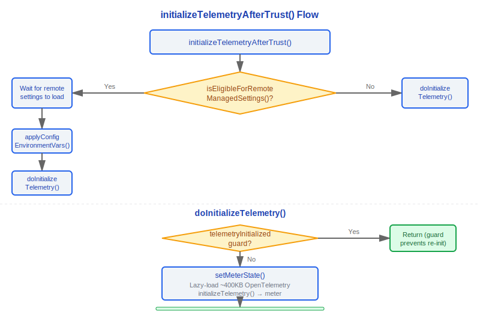
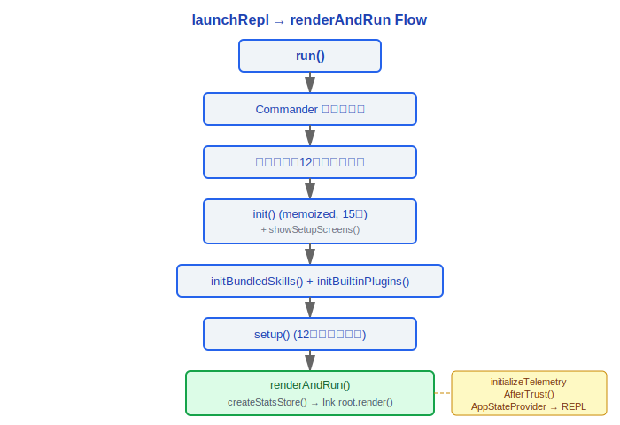
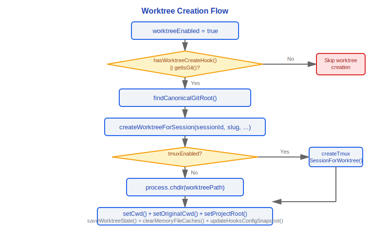
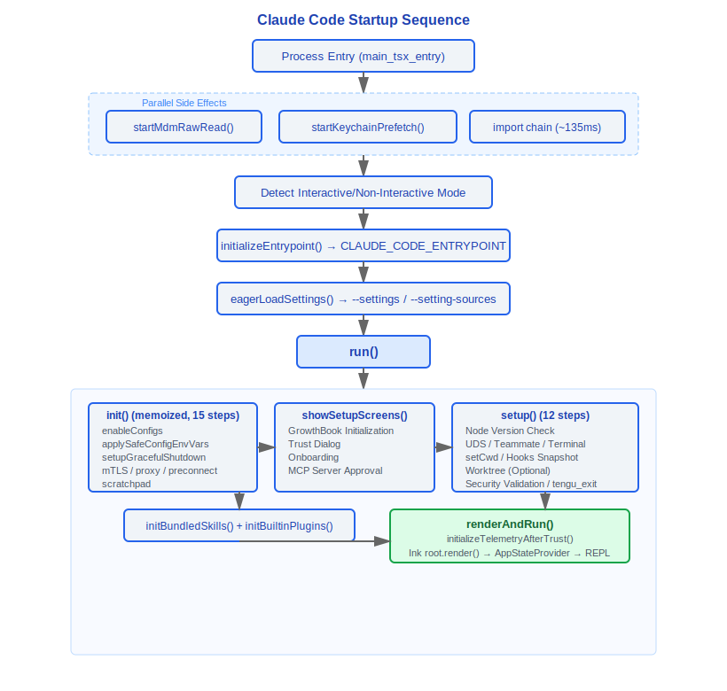

# 启动与初始化

> Claude Code v2.1.88 启动流程全景：从进程入口到 REPL 渲染的完整初始化链路。

---

## 1. main.tsx 入口 (src/main.tsx)

main.tsx 是整个应用的物理入口点，文件顶部通过 **import 副作用** 在模块求值阶段即触发三项并行预取：

```
profileCheckpoint('main_tsx_entry')   // 标记进程启动时刻
startMdmRawRead()                     // 启动 MDM 子进程（plutil/reg query）
startKeychainPrefetch()               // macOS 钥匙串双通道并行读取（OAuth + 旧版 API key）
```

这三项操作在后续 ~135ms 的 import 链执行期间并行完成，是启动性能优化的关键设计。

### 1.1 eagerLoadSettings()

在 `run()` 调用前通过 `eagerParseCliFlag` 预解析 CLI 参数：

```typescript
function eagerLoadSettings(): void {
  profileCheckpoint('eagerLoadSettings_start')
  // 解析 --settings 标志，确保在 init() 之前加载正确的设置文件
  const settingsFile = eagerParseCliFlag('--settings')
  if (settingsFile) loadSettingsFromFlag(settingsFile)

  // 解析 --setting-sources 标志，控制加载哪些配置源
  const settingSourcesArg = eagerParseCliFlag('--setting-sources')
  if (settingSourcesArg !== undefined) loadSettingSourcesFromFlag(settingSourcesArg)
  profileCheckpoint('eagerLoadSettings_end')
}
```

### 1.2 initializeEntrypoint()

根据运行模式设置 `CLAUDE_CODE_ENTRYPOINT` 环境变量，用于全局区分调用来源：

| ENTRYPOINT 值 | 触发条件 |
|---|---|
| `cli` | 交互式终端直接运行 |
| `sdk-cli` | 非交互模式（-p/--print、--init-only、--sdk-url、非 TTY） |
| `sdk-ts` | TypeScript SDK 预设 |
| `sdk-py` | Python SDK 预设 |
| `mcp` | `claude mcp serve` 命令 |
| `claude-code-github-action` | CLAUDE_CODE_ACTION 环境变量 |
| `claude-vscode` | VSCode 扩展预设 |
| `claude-desktop` | Claude Desktop 应用预设 |
| `local-agent` | 本地 Agent 模式启动器预设 |
| `remote` | 远程会话模式 |

优先级：已设置的环境变量 > mcp serve 检测 > GitHub Action 检测 > 交互/非交互推断。

---

## 2. init() 函数 (src/entrypoints/init.ts)

`init()` 通过 lodash `memoize` 包装，确保整个进程生命周期内仅执行一次。内部按顺序执行以下 **15 步初始化**：

| 步骤 | 操作 | 说明 |
|---|---|---|
| 1 | `enableConfigs()` | 验证并启用配置系统，解析 settings.json / .claude.json |
| 2 | `applySafeConfigEnvironmentVariables()` | 在 Trust 对话框前仅应用安全的环境变量 |
| 3 | `applyExtraCACertsFromConfig()` | 从 settings.json 读取 NODE_EXTRA_CA_CERTS，在首次 TLS 握手前注入 |
| 4 | `setupGracefulShutdown()` | 注册 SIGINT/SIGTERM 处理器，确保退出时 flush 数据 |
| 5 | `initialize1PEventLogging()` | 异步初始化第一方事件日志（OpenTelemetry sdk-logs） |
| 6 | `populateOAuthAccountInfoIfNeeded()` | 异步填充 OAuth 账户信息（VSCode 扩展登录场景） |
| 7 | `initJetBrainsDetection()` | 异步检测 JetBrains IDE 环境 |
| 8 | `detectCurrentRepository()` | 异步识别 GitHub 仓库（用于 gitDiff PR 链接） |
| 9 | `initializeRemoteManagedSettingsLoadingPromise()` / `initializePolicyLimitsLoadingPromise()` | 条件性初始化远程托管设置和策略限制的加载 Promise |
| 10 | `recordFirstStartTime()` | 记录首次启动时间 |
| 11 | `configureGlobalMTLS()` | 配置全局 mTLS 设置 |
| 12 | `configureGlobalAgents()` | 配置全局 HTTP 代理 |
| 13 | `preconnectAnthropicApi()` | 预连接 Anthropic API（TCP+TLS 握手 ~100-200ms 与后续操作重叠） |
| 14 | `setShellIfWindows()` | Windows 环境设置 git-bash |
| 15 | `ensureScratchpadDir()` | 条件性创建 scratchpad 目录（需 tengu_scratch gate） |

异常处理：如果配置解析失败（`ConfigParseError`），在交互模式下弹出 `InvalidConfigDialog`，非交互模式写入 stderr 后退出。

### 设计理念：为什么初始化顺序不能随意调整

`init()` 的 15 步顺序不是任意排列，而是一条严格的依赖链。关键约束包括：

1. **`enableConfigs()` 必须最先** — 所有后续步骤（环境变量注入、TLS 配置、OAuth）都依赖配置系统。如果配置解析失败，`ConfigParseError` 必须在任何网络操作之前被捕获。

2. **`applySafeConfigEnvironmentVariables()` 在 Trust 对话框之前** — 代理设置和 CA 证书路径属于"安全"环境变量，必须在首次 TLS 握手前注入（步骤 3 `applyExtraCACertsFromConfig` 紧随其后）。但"不安全"的环境变量（可能来自不受信任的项目配置）必须等到 Trust 建立后才能应用。

3. **网络配置 (mTLS→proxy→preconnect) 必须有序** — `configureGlobalMTLS()` 设置客户端证书，`configureGlobalAgents()` 配置 HTTP 代理——两者必须在 `preconnectAnthropicApi()` 之前完成，否则预连接的 TCP+TLS 握手会使用错误的网络配置。preconnect 的 ~100-200ms 与后续操作重叠，是启动性能优化的关键。

4. **GrowthBook 在 Trust 之后重新初始化** — `showSetupScreens()` 中，Trust 对话框完成后立即调用 `resetGrowthBook()` + `initializeGrowthBook()`（`src/interactiveHelpers.tsx:149-150`），因为 GrowthBook 的特性门控需要包含认证头信息来确定用户身份。Trust 之前的 GrowthBook 实例可能使用了不完整的身份信息。

5. **MCP 服务器审批在 GrowthBook 之后** — `handleMcpjsonServerApprovals()` 需要 GrowthBook 门控来判断哪些 MCP 特性可用，所以必须在 GrowthBook 重新初始化之后执行。

这条依赖链解释了为什么 `init()` 使用 `memoize` 包装（`src/entrypoints/init.ts:57`）——它确保即使被多次调用也只执行一次，避免重复的网络配置和 TLS 设置导致不确定行为。

### 关键：CCR 上游代理

当 `CLAUDE_CODE_REMOTE=1` 时，init() 还会启动本地 CONNECT 中继代理：

```typescript
if (isEnvTruthy(process.env.CLAUDE_CODE_REMOTE)) {
  const { initUpstreamProxy, getUpstreamProxyEnv } = await import('../upstreamproxy/upstreamproxy.js')
  const { registerUpstreamProxyEnvFn } = await import('../utils/subprocessEnv.js')
  registerUpstreamProxyEnvFn(getUpstreamProxyEnv)
  await initUpstreamProxy()
}
```

---

## 3. showSetupScreens / TrustDialog (src/interactiveHelpers.tsx)

在 init() 完成后、REPL 启动前，交互模式下执行设置屏幕流程：

1. **GrowthBook 初始化** — `initializeGrowthBook()` 加载特性门控
2. **Trust 对话框** — `checkHasTrustDialogAccepted()` 检查信任状态；首次运行或家目录运行时弹出
3. **Onboarding 流程** — `completeOnboarding()` 标记完成并写入 `hasCompletedOnboarding: true`
4. **MCP 服务器审批** — `handleMcpjsonServerApprovals()` 处理项目级 MCP 服务器信任
5. **CLAUDE.md 外部包含警告** — `shouldShowClaudeMdExternalIncludesWarning()` 检测外部文件引用
6. **API Key 验证** — 验证认证凭据有效性
7. **设置变更对话框** — 检测并应用设置变更

Trust 对话框的会话级信任（家目录场景）通过 `setSessionTrustAccepted(true)` 记录在 Bootstrap State 中，不持久化到磁盘。

### 设计理念：为什么 Bootstrap 是全局单例

`bootstrap/state.ts` 将整个进程的状态存储在模块级 `const STATE: State = getInitialState()` 中（`src/bootstrap/state.ts:429`），通过 100+ 个导出的 getter/setter 函数访问。源码中有三处警告注释标记了这个设计的敏感性：

- `// DO NOT ADD MORE STATE HERE - BE JUDICIOUS WITH GLOBAL STATE`（line 31）
- `// ALSO HERE - THINK THRICE BEFORE MODIFYING`（line 259）
- `// AND ESPECIALLY HERE`（line 428）

全局单例通常被视为反模式，但在 Claude Code 的场景中它是合理的：

1. **初始化状态一次写入、全局读取** — `sessionId`、`originalCwd`、`projectRoot`、`isInteractive` 等字段在启动时设置后不再改变。70+ 个 hooks 和 40+ 个 tools 都需要访问这些值。如果改用依赖注入，每个 hook 和 tool 的函数签名都需要增加一个 `bootstrapState` 参数，这在 1884 个源文件的代码库中意味着数千处修改。

2. **无并发风险** — Node.js 单线程模型保证了 `STATE` 对象不会被并发修改。这与多线程语言中的全局单例有本质区别——不需要锁、不存在竞态条件。

3. **测试可控** — `resetStateForTests()` 函数（`src/bootstrap/state.ts:919`）在测试环境中恢复初始状态，并通过 `process.env.NODE_ENV !== 'test'` 守卫防止生产环境误调用。

4. **运行时度量的累积器** — `totalCostUSD`、`totalAPIDuration`、`totalLinesAdded` 等度量值需要在整个进程生命周期内跨越多个 query 循环累积。它们不属于任何单个 query 或 session，只能存储在进程级。

权衡：这个设计牺牲了模块的可测试性和可组合性（状态隐式耦合），换取了整个代码库中无处不在的轻量级状态访问。这是一个在"架构纯洁性"和"1884 个文件的工程现实"之间做出的务实选择。

---

## 4. applyConfigEnvironmentVariables (src/utils/managedEnv.ts)

两阶段环境变量注入设计：

- **`applySafeConfigEnvironmentVariables()`** — Trust 对话框前调用，仅注入不涉及安全的变量（如代理设置、CA 证书路径）
- **`applyConfigEnvironmentVariables()`** — Trust 建立后调用，注入所有配置的环境变量，包括远程托管设置

第二阶段在 `initializeTelemetryAfterTrust` 中由远程设置加载完成后触发：

```typescript
export function initializeTelemetryAfterTrust(): void {
  if (isEligibleForRemoteManagedSettings()) {
    void waitForRemoteManagedSettingsToLoad().then(async () => {
      applyConfigEnvironmentVariables()  // 重新应用以包含远程设置
      await doInitializeTelemetry()
    })
  } else {
    void doInitializeTelemetry()
  }
}
```

---

## 5. initializeTelemetryAfterTrust (src/entrypoints/init.ts)

遥测初始化仅在 Trust 建立后执行，通过 `telemetryInitialized` 标志防止重复初始化：



---

## 6. launchRepl → renderAndRun

main.tsx 中的 `run()` 函数在完成所有 CLI 参数解析和配置后，最终调用 `renderAndRun`（来自 interactiveHelpers.tsx）：



`launchRepl()` 是实际的 REPL 启动器（src/replLauncher.tsx），负责构建初始 AppState 并调用 renderAndRun。

---

## 7. setup.ts — 12 大步骤 (src/setup.ts)

`setup()` 函数在 REPL 渲染前执行运行时环境准备，接收 `cwd`、`permissionMode`、`worktreeEnabled` 等参数：

| 步骤 | 操作 | 说明 |
|---|---|---|
| 1 | **Node 版本检查** | `process.version` 必须 >= 18，否则 `process.exit(1)` |
| 2 | **自定义 Session ID** | `customSessionId` 参数存在时调用 `switchSession()` |
| 3 | **UDS 消息服务器** | `feature('UDS_INBOX')` 启用时启动 Unix Domain Socket 消息服务器 |
| 4 | **Teammate 快照** | `isAgentSwarmsEnabled()` 时捕获 teammate 模式快照 |
| 5 | **终端备份恢复** | 检查并恢复 iTerm2 / Terminal.app 被中断的设置备份 |
| 6 | **setCwd()** | 设置工作目录（必须在依赖 cwd 的代码前调用） |
| 7 | **Hooks 快照** | `captureHooksConfigSnapshot()` + `initializeFileChangedWatcher()` |
| 8 | **Worktree 创建** | `worktreeEnabled` 时创建 git worktree，可选 tmux 会话 |
| 9 | **后台任务注册** | `initSessionMemory()`、`initContextCollapse()`、`lockCurrentVersion()` |
| 10 | **预取** | `getCommands()`、`loadPluginHooks()`、提交归因注册、团队内存观察器 |
| 11 | **安全校验** | `bypassPermissions` 模式在非沙箱环境（Docker/Bubblewrap）或有网络访问时拒绝 |
| 12 | **tengu_exit 日志** | 从 projectConfig 读取上次会话的成本/时长/token 指标并记录 |

### Worktree 流程细节



---

## 8. 认证解析链 — 6 级优先级 (src/utils/auth.ts)

`getAuthTokenSource()` 是认证解析的核心，返回 `{ source, key }` 元组：

| 优先级 | 来源 | 说明 |
|---|---|---|
| 1 | **File Descriptor (FD)** | `getApiKeyFromFileDescriptor()` — SDK 通过 FD 传递 OAuth token 或 API key |
| 2 | **环境变量** | `ANTHROPIC_API_KEY` 环境变量 |
| 3 | **API Key Helper** | `getApiKeyFromApiKeyHelperCached()` — 外部辅助程序（如 1Password CLI） |
| 4 | **配置文件 / macOS 钥匙串** | `getApiKeyFromConfigOrMacOSKeychain()` — .claude.json 中的 apiKey 或 macOS Keychain 中的旧版密钥 |
| 5 | **OAuth Token** | 通过 OAuth 流程获取的令牌（支持自动刷新） |
| 6 | **Bedrock/Vertex 凭据** | AWS Bedrock（`prefetchAwsCredentialsAndBedRockInfoIfSafe`）或 GCP Vertex（`prefetchGcpCredentialsIfSafe`）的云服务商凭据 |

API Key Helper 机制：

```typescript
export async function getApiKeyFromApiKeyHelper(
  isNonInteractiveSession: boolean
): Promise<string | null> {
  // 从 settings.json 的 apiKeyHelper 字段读取命令
  // 执行外部命令获取 API key
  // 结果缓存，避免重复执行
}
```

`prefetchApiKeyFromApiKeyHelperIfSafe()` 在 setup() 末尾预取，仅在 Trust 已确认时执行。

---

## 9. 启动时序图



---

## 10. 性能分析检查点

启动过程中通过 `profileCheckpoint()` 埋入关键检查点，用于 `startupProfiler.ts` 生成性能报告：

```typescript
const PHASE_MARKERS = {
  settings_time: ['eagerLoadSettings_start', 'eagerLoadSettings_end'],
  init_time: ['init_function_start', 'init_function_end'],
  // ... 更多检查点
}
```

关键耗时区间：
- `main_tsx_entry` → `main_before_run`：模块加载 + CLI 解析 + 设置加载
- `init_function_start` → `init_function_end`：核心初始化
- `init_safe_env_vars_applied` → `init_network_configured`：网络栈配置
- `setup_before_prefetch` → `setup_after_prefetch`：预取阶段

---

## 工程实践指南

### 调试启动失败

启动失败通常表现为进程静默退出或抛出未捕获异常。排查步骤：

1. **使用 `--debug` 启动** — 所有初始化步骤的日志输出到 stderr，可以看到哪一步失败
2. **检查 init() 链** — `init()` 的 15 步通过 `memoize` 包装确保只执行一次。如果某一步抛出异常，后续所有步骤都不会执行。首先定位是哪一步失败：
   - 步骤 1-3 失败（配置/环境变量/CA 证书）→ 检查配置文件格式是否合法（`settings.json`、`.claude.json`）
   - 步骤 11-13 失败（mTLS/proxy/preconnect）→ 检查网络配置、代理设置、证书路径
   - 步骤 14 失败（Windows shell）→ 检查 git-bash 是否安装
3. **交互模式的 ConfigParseError** — 配置解析失败时会弹出 `InvalidConfigDialog`；非交互模式直接写入 stderr 后退出。如果看到空白退出，检查是否在非交互模式下运行且配置文件有语法错误
4. **Bootstrap 单例问题** — `init()` 失败会导致 Bootstrap 单例未完成初始化，所有后续操作（包括 `setup()`、`showSetupScreens()`）都会因依赖未就绪而失败。**永远从 init() 开始排查**

### 添加新的初始化步骤

如果需要在启动流程中添加新步骤（例如新的服务预连接、新的配置加载）：

1. **确定依赖关系** — 你的步骤依赖什么？如果依赖网络连接，必须放在 `configureGlobalMTLS()` + `configureGlobalAgents()` 之后；如果依赖配置系统，必须放在 `enableConfigs()` 之后
2. **确定是否需要 Trust** — 如果步骤涉及不安全的环境变量或用户身份，应放在 `showSetupScreens()` 之后（Trust 对话框完成后）
3. **考虑异步并行** — `init()` 中多个步骤是异步启动但不 await 的（如 `populateOAuthAccountInfoIfNeeded()`、`detectCurrentRepository()`），如果你的步骤耗时长但不阻塞后续步骤，考虑采用同样的模式
4. **添加 profileCheckpoint** — 在步骤前后添加 `profileCheckpoint('your_step_start')` / `profileCheckpoint('your_step_end')`，用于性能分析

**关键约束**：
- `init()` 是 memoized 的，不能在其内部调用自身
- 不要在 `init()` 中添加依赖 GrowthBook 的步骤——GrowthBook 在 `showSetupScreens()` 中 Trust 对话框之后才重新初始化
- 如果新步骤可能失败，考虑是否应该 fatal（阻止启动）还是 soft-fail（记录警告后继续）

### Feature Flag 调试

编译时 flag（`feature()` 宏）和运行时 flag 是两套独立系统：

| 类型 | 检查方式 | 修改方式 |
|------|----------|----------|
| 编译时 (`feature()`) | 查看构建配置中的 flag 列表 | 修改构建配置后重新构建 |
| 运行时 (statsig/env) | 检查环境变量或 GrowthBook 状态 | 设置环境变量或修改远程配置 |

**如果功能"消失了"**：
1. 先检查是否是编译时 flag——`feature()` 调用在构建时被 tree-shake，如果 flag 未启用，代码物理上不存在于构建产物中
2. 再检查运行时 flag——`QueryConfig.gates` 中的门控、环境变量、GrowthBook feature gate
3. 最后检查是否是 `isEnabled()` 返回 false——工具的 `isEnabled()` 可能依赖运行时条件

### 常见陷阱

1. **不要在 Bootstrap 单例初始化完成前访问 `getBootstrapState()`** — 会得到 undefined 或初始值。`bootstrap/state.ts` 中的 getter 函数在 `init()` 完成前调用不会报错，但返回的是初始状态，可能导致微妙的 bug（如 `sessionId` 为空字符串）

2. **不要假设 `showSetupScreens()` 总会执行** — 在非交互模式（SDK、print、headless）中，设置屏幕流程被跳过。如果你的逻辑依赖 Trust 对话框的结果，需要检查 `isInteractive` 状态

3. **不要在 `setup()` 中添加需要网络的步骤** — `setup()` 中的网络配置已经在 `init()` 中完成，但 `setup()` 的某些步骤（如 Worktree 创建）可能改变工作目录。如果你的步骤需要网络且依赖 CWD，注意执行顺序

4. **不要忽略迁移步骤** — `run()` 中在 `init()` 之前执行 12 个迁移函数。如果你修改了数据格式，需要添加对应的迁移确保旧数据兼容


---

[← 系统总览](../01-系统总览/system-overview.md) | [目录](../README.md) | [查询引擎 →](../03-查询引擎/query-engine.md)
