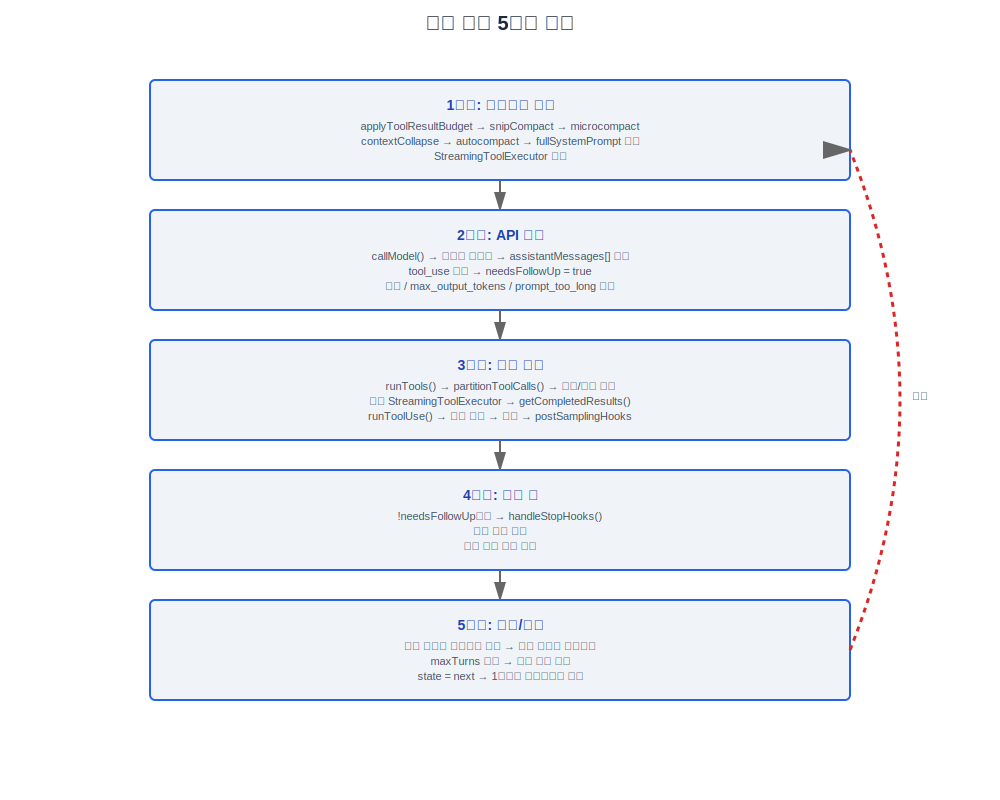

# 쿼리 엔진(Query Engine)

> 소스 파일: `src/query.ts` (1729줄), `src/QueryEngine.ts`, `src/query/*.ts`

---

## 1. 아키텍처 개요

쿼리 엔진(Query Engine)은 Claude Code의 핵심 런타임으로, "사용자 입력 → 모델 호출 → 도구 실행 → 결과 반환"의 완전한 사이클을 관리합니다. **비동기 생성기** 아키텍처로, `yield`를 통해 호출자에게 스트리밍 이벤트를 푸시하고 `return`을 통해 종료 이유를 반환합니다.

```
QueryEngine.ts (SDK/print 진입점)
  └─→ query.ts::query() (비동기 생성기 래퍼)
        └─→ queryLoop() (while(true) 메인 루프)
              ├── 1단계: 컨텍스트 준비 (압축 파이프라인)
              ├── 2단계: API 호출 (스트리밍 수신)
              ├── 3단계: 도구 실행 (동시/직렬 오케스트레이션)
              ├── 4단계: 정지 훅스 (턴 후 처리)
              └── 5단계: 계속/종료 결정
```

---

## 2. query() — 핵심 비동기 생성기

### 2.1 파일 위치 및 시그니처

```typescript
// src/query.ts, 219번 줄
export async function* query(
  params: QueryParams,
): AsyncGenerator<
  | StreamEvent
  | RequestStartEvent
  | Message
  | TombstoneMessage
  | ToolUseSummaryMessage,
  Terminal  // 반환 타입 — 종료 이유
>
```

### 2.2 QueryParams 타입 — 전체 필드

```typescript
// src/query.ts, 181번 줄
export type QueryParams = {
  messages: Message[]                // 메시지 히스토리 배열
  systemPrompt: SystemPrompt         // 시스템 프롬프트
  userContext: { [k: string]: string } // 사용자 컨텍스트 (키-값으로 프롬프트에 주입)
  systemContext: { [k: string]: string } // 시스템 컨텍스트
  canUseTool: CanUseToolFn           // 권한 체크 함수
  toolUseContext: ToolUseContext      // 도구 실행 컨텍스트 (40개 이상의 속성)
  fallbackModel?: string             // 폴백 모델
  querySource: QuerySource           // 쿼리 소스 식별자
  maxOutputTokensOverride?: number   // 최대 출력 토큰 재정의
  maxTurns?: number                  // 최대 턴 수 제한
  skipCacheWrite?: boolean           // 캐시 쓰기 건너뛰기
  taskBudget?: { total: number }     // API task_budget (output_config.task_budget)
  deps?: QueryDeps                   // 의존성 주입 (테스트용)
}
```

### 2.3 State 타입 — 가변 루프 상태

각 루프 반복은 상태를 구조 분해하여 베어 네임 접근을 제공합니다; 계속 사이트는 `state = { ... }`로 배치 할당을 사용합니다.

```typescript
// src/query.ts, 204번 줄
type State = {
  messages: Message[]                           // 현재 메시지 목록
  toolUseContext: ToolUseContext                 // 현재 도구 컨텍스트
  autoCompactTracking: AutoCompactTrackingState | undefined  // 컴팩트(Compact) 추적
  maxOutputTokensRecoveryCount: number          // max_output_tokens 복구 횟수
  hasAttemptedReactiveCompact: boolean          // 반응형 컴팩트 시도 여부
  maxOutputTokensOverride: number | undefined   // 출력 토큰 재정의
  pendingToolUseSummary: Promise<ToolUseSummaryMessage | null> | undefined  // 대기 중인 요약
  stopHookActive: boolean | undefined           // 정지 훅이 활성화되어 있는지 여부
  turnCount: number                             // 현재 턴 수
  transition: Continue | undefined              // 마지막 반복의 계속 이유
}
```

상태 초기화:

```typescript
let state: State = {
  messages: params.messages,
  toolUseContext: params.toolUseContext,
  maxOutputTokensOverride: params.maxOutputTokensOverride,
  autoCompactTracking: undefined,
  stopHookActive: undefined,
  maxOutputTokensRecoveryCount: 0,
  hasAttemptedReactiveCompact: false,
  turnCount: 1,
  pendingToolUseSummary: undefined,
  transition: undefined,
}
```

### 설계 철학: 왜 비동기 함수 대신 비동기 생성기인가

`query()`의 반환 타입은 `AsyncGenerator<StreamEvent | ... , Terminal>`이며, 단순한 `Promise<Terminal>`이 아닙니다. 이 선택이 전체 시스템 아키텍처에 영향을 미치는 이유는 다음과 같습니다:

**스트리밍(Streaming) 출력** — LLM은 토큰 단위로 콘텐츠를 생성합니다. 비동기 함수는 완료 후에만 반환할 수 있어 사용자가 수 초에서 수십 초의 공백을 기다려야 합니다. 생성기의 `yield`는 각 `StreamEvent`를 실시간으로 UI에 푸시하여 글자 단위 렌더링을 가능하게 합니다.

**백프레셔 제어** — 호출자는 `for await...of`를 통해 자신의 속도로 생성기를 소비합니다. UI 렌더링 병목으로 소비가 느려지면, 생성기가 자연스럽게 `yield` 지점에서 일시 정지하여 API 응답 버퍼의 무한 성장을 방지합니다. 이것은 EventEmitter 패턴보다 훨씬 안전합니다 (푸셔가 소비자가 따라올 수 있는지 알지 못함).

**스트림 중간 취소** — `generator.return()`은 어떤 `yield` 지점에서도 루프를 우아하게 종료할 수 있습니다. `query.ts`는 `using` 선언 (예: `using pendingMemoryPrefetch = startRelevantMemoryPrefetch(...)`, 약 301번 줄)을 사용하여 취소 시 리소스가 자동으로 처리되도록 합니다. 이것은 `AbortController`보다 더 세밀합니다: `AbortController`는 네트워크 요청만 취소할 수 있지만, 생성기는 어떤 단계에서도 정지할 수 있습니다 — 도구 실행, 정지 훅스, 컨텍스트 압축 등.

**다중 타입 이벤트 + 타입 안전한 종료** — 생성기의 `yield` 타입은 `StreamEvent | RequestStartEvent | Message | TombstoneMessage | ToolUseSummaryMessage` (중간 이벤트)이고, `return` 타입은 `Terminal` (종료 이유)입니다. TypeScript 컴파일러가 두 타입 경로를 완전히 체크할 수 있어 EventEmitter의 문자열 이벤트 이름 + `any` 페이로드보다 훨씬 안전합니다.

**암묵적 상태 머신** — 코드 실행 위치 자체가 "현재 상태"를 인코딩합니다. 루프의 5단계 + 여러 `continue` 사이트는 서로 다른 상태 전이에 해당하지만, 명시적인 상태 열거형이나 switch-case 매트릭스가 필요 없습니다. 아래 "왜 명시적 상태 머신 대신 while(true)인가"를 참조하십시오.

### 설계 철학: 왜 State가 가변인가

`State` 타입 (`src/query.ts:204`)은 `while(true)` 루프 본문 내에서 구조 분해되고 수정되고 재할당됩니다 — 이것은 Redux 스타일 불변성이 아닌 가변 상태 패턴입니다. 이유:

1. **동시성 없음** — `state`는 `queryLoop` 함수 내에서만 보입니다. Node.js 단일 스레딩은 다른 코드에 의해 동시에 수정되지 않음을 보장합니다. 불변성이 해결하는 핵심 문제 (경쟁 조건 방지)가 여기서는 존재하지 않습니다.

2. **보일러플레이트 코드** — 1729줄 루프 본문에는 7개의 `state = { ... }` 계속 사이트가 있습니다 (약 289번 줄 주석: "Loop-local (not on State) to avoid touching the 7 continue sites"). 불변 패턴을 사용하면 각 사이트에서 전체 상태 객체를 깊이 복사해야 하며, 실제 이점 없이 대규모 보일러플레이트가 추가됩니다.

3. **명확한 상태 전이 지점** — 계속 사이트에서의 배치 재할당 `state = { ...next }`는 명확하고 grep 가능한 상태 전이 마커를 제공합니다. 각 `continue`에는 `transition: { reason: '...' }` (예: `'reactive_compact_retry'`, `'max_output_tokens_escalate'`, `'token_budget_continuation'`)이 동반되어 상태 전이 이유가 테스트 가능합니다 (약 215번 줄 주석: "Lets tests assert recovery paths fired without inspecting message contents").

### 설계 철학: 왜 QueryDeps가 의존성 주입을 사용하는가

`QueryDeps` (`src/query/deps.ts`)는 4개의 의존성 (`callModel`, `microcompact`, `autocompact`, `uuid`)만 가지고 있어 소박해 보입니다. 그러나 소스 코드 주석 (`src/query/deps.ts:9-12`)이 직접 동기를 설명합니다:

> "I/O dependencies for query(). Passing a `deps` override into QueryParams lets tests inject fakes directly instead of spyOn-per-module — the most common mocks (callModel, autocompact) are each spied in 6-8 test files today with module-import-and-spy boilerplate."

이것은 "아키텍처 순수성"을 위한 것이 아니라, 구체적인 테스트 유지 관리 문제를 해결하기 위한 것입니다: 이전에는 `callModel`과 `autocompact`가 각각 6-8개의 테스트 파일에서 `spyOn`을 통해 모킹되었습니다. 모듈 수준 모킹은 테스트 간 간섭을 일으킵니다 (한 테스트의 스파이가 제대로 복원되지 않으면 이후 테스트에 영향을 미침). `QueryDeps`는 함수 매개변수를 통해 의존성을 전달하여 각 테스트가 자체 가짜 인스턴스를 생성하고 공유 모의 상태 문제를 완전히 제거할 수 있습니다.

주석에는 또한 "Scope is intentionally narrow (4 deps) to prove the pattern." — 현재는 최소 실행 가능한 솔루션이며, 향후 PR에서 `runTools`, `handleStopHooks` 등의 의존성을 점차적으로 추가할 수 있습니다.

### 설계 철학: 왜 9개의 종료 이유인가

9개의 `Terminal` 이유는 과도한 엔지니어링이 아닙니다 — 각각은 서로 다른 UI 표시 및 후속 처리 경로에 해당합니다:

| 종료 이유 | UI 동작 차이 |
|----------|------------|
| `completed` | 결과 표시, 정지 훅스 실행 (메모리 추출, 제안 프롬프트) |
| `aborted_streaming` | 부분 메시지 정리, `StreamingToolExecutor`의 대기 중인 결과 폐기 |
| `aborted_tools` | 각 미완료 `tool_use` 블록에 대한 중단 메시지 생성 (`yieldMissingToolResultBlocks`) |
| `prompt_too_long` | 압축 제안 트리거, `reactiveCompact` 실행 가능성 |
| `model_error` | 오류 패널 표시, `executeStopFailureHooks` 호출 |
| `image_error` | 특정 이미지 크기/형식 오류 프롬프트 |
| `blocking_limit` | auto-compact가 OFF일 때 하드 제한 알림 |
| `hook_stopped` / `stop_hook_prevented` | 서로 다른 정지 훅 차단 모드 — 전자는 `preventContinuation`, 후자는 `blockingErrors` |
| `max_turns` | SDK 호출자의 예산 관리를 위한 `turnCount` 포함 |

"성공/실패/취소" 세 가지로 단순화하면, SDK 호출자가 "모델이 작업이 완료되었다고 생각함"과 "토큰 소진으로 인한 강제 정지"를 구분할 수 없게 됩니다 — 이 두 경우는 자동화된 워크플로우에서 완전히 다른 처리 전략이 필요합니다.

### 설계 철학: 왜 명시적 상태 머신 대신 while(true)인가

`queryLoop`는 `enum State { PREPARING, CALLING_API, EXECUTING_TOOLS, ... }` + `switch(state)` 대신 `while(true)` + `continue` + `return`을 사용합니다. 1729줄 루프 본문의 경우 이것이 더 나은 선택입니다:

1. **생성기의 일시 정지 지점이 암묵적 상태** — 코드 실행이 2단계 (API 호출)에 도달할 때, "현재 API 호출 단계에 있음" 상태 정보가 이미 프로그램 카운터에 인코딩되어 있습니다. 명시적 상태 열거형은 코드 위치로 이미 전달된 정보를 중복해서 표현합니다.

2. **상태 전이 매트릭스 폭발** — 5단계 + 7개 계속 사이트는 최소 35개의 가능한 상태 전이 조합을 의미합니다. 명시적 상태 머신은 각 전이의 합법성을 정의해야 하며, 선형 `if-continue` 흐름보다 훨씬 나쁜 가독성의 대규모 switch-case 매트릭스를 생성합니다.

3. **복구 경로가 선형** — `reactive_compact_retry`, `max_output_tokens_escalate`, `fallback` 같은 복구 경로는 모두 "상태 수정, 루프 헤드로 점프"입니다. 선형 코드에서 이것은 `state = next; continue` — 명확하고 국소적입니다. 명시적 상태 머신에서는 "2단계에서 1단계로", "4단계에서 1단계로"에 대한 전이 로직을 별도로 작성해야 합니다.

---

## 3. queryLoop() — while(true) 메인 루프 구조

### 3.1 루프 진입

```typescript
// src/query.ts, 241번 줄
async function* queryLoop(
  params: QueryParams,
  consumedCommandUuids: string[],
): AsyncGenerator<...>
```

### 3.2 불변 매개변수 구조 분해

루프 시작 시, 루프 라이프사이클 동안 재할당되지 않는 불변 매개변수가 추출됩니다:

```typescript
const {
  systemPrompt,
  userContext,
  systemContext,
  canUseTool,
  fallbackModel,
  querySource,
  maxTurns,
  skipCacheWrite,
} = params
const deps = params.deps ?? productionDeps()
```

### 3.3 루프 반복별 상태 구조 분해

```typescript
while (true) {
  let { toolUseContext } = state  // toolUseContext는 반복 내에서 재할당될 수 있음
  const {
    messages,
    autoCompactTracking,
    maxOutputTokensRecoveryCount,
    hasAttemptedReactiveCompact,
    maxOutputTokensOverride,
    pendingToolUseSummary,
    stopHookActive,
    turnCount,
  } = state
  // ... 반복 본문
}
```

### 3.4 5단계 루프 흐름



#### 1단계: 컨텍스트 준비

1. **applyToolResultBudget** — 20KB를 초과하는 도구 결과를 디스크에 저장
2. **snipCompact** (기능 `HISTORY_SNIP`) — 히스토리 잘라내기
3. **microcompact** — 마이크로 압축 (API 호출 없음, 순수 로컬 작업)
4. **contextCollapse** (기능 `CONTEXT_COLLAPSE`) — 컨텍스트 축소
5. **autocompact** — 자동 압축 (요약 생성을 위한 API 호출 발생 가능)
6. `fullSystemPrompt` 조립
7. `StreamingToolExecutor` 생성 (streamingToolExecution 게이트가 활성화된 경우)

#### 2단계: API 호출

1. `deps.callModel()` 호출 (즉, `queryModelWithStreaming`)
2. 스트림 수신 이벤트, `assistantMessages[]` 빌드
3. `tool_use` 블록 감지 → `needsFollowUp = true` 설정
4. 스트리밍 폴백 처리 (FallbackTriggeredError)
5. max_output_tokens 복구 처리 (MAX_OUTPUT_TOKENS_RECOVERY_LIMIT = 3)
6. prompt_too_long / reactiveCompact 처리

#### 3단계: 도구 실행

1. **비스트리밍 경로**: `runTools()` → `partitionToolCalls()` → 동시/직렬 배치
2. **스트리밍 경로**: `StreamingToolExecutor` → `getCompletedResults()` + `getRemainingResults()`
3. 각 도구: `runToolUse()` → 권한 체크 → 실행 → 결과 처리
4. `postSamplingHooks` 실행

#### 4단계: 정지 훅스

1. `needsFollowUp`이 없는 경우 (모델이 도구 호출을 요청하지 않음), 정지 결정 진입
2. `handleStopHooks()` 호출 → 다양한 정지 훅스 실행
3. 토큰 예산 체크 (활성화된 경우)
4. 정지 훅스가 `blockingErrors` 또는 `preventContinuation`을 반환하면 계속할지 결정

#### 5단계: 계속/종료

1. 도구 결과가 메시지 목록에 추가됨
2. 첨부 메시지 가져오기 (메모리, 커맨드 큐, 스킬 검색)
3. `maxTurns` 제한 체크
4. 다음 `State` 객체 조립
5. `state = next` → `while(true)` 헤드로 돌아감

### 3.5 상태 재할당 사이트

루프 내에 여러 `state = { ... }` 계속 사이트가 있으며, 각각은 다른 계속 이유를 나타냅니다:

- **next_turn** — 일반 도구 결과 후속 루프 (약 1715번 줄)
- **reactive_compact** — 413으로 트리거된 반응형 컴팩트(Compact) 후 재시도
- **max_output_tokens_recovery** — 출력 토큰 소진 후 복구 재시도
- **fallback** — 스트리밍 저하 후 폴백 모델로 재시도
- **prompt_too_long_retry** — 프롬프트가 너무 긴 오류 후 재시도

---

## 4. 9가지 종료 이유 (Terminal Reasons)

| 이유 | 설명 | 트리거 조건 |
|------|------|----------|
| `completed` | 정상 완료 | 모델이 도구 호출을 요청하지 않음, 정지 훅스에 차단 오류 없음 |
| `aborted_streaming` | 스트리밍 중 중단 | 스트리밍(Streaming) 단계에서 사용자 중단 (Ctrl+C) |
| `aborted_tools` | 도구 실행 중 중단 | 도구 실행 단계에서 사용자 중단 (Ctrl+C) |
| `model_error` | 모델 오류 | API가 복구 불가능한 오류 반환 |
| `image_error` | 이미지 오류 | 이미지 크기/형식 오류 |
| `prompt_too_long` | 프롬프트가 너무 긴 경우 | 413 오류이고 압축으로 복구 불가 |
| `blocking_limit` | 차단 제한 | 하드 토큰 제한 도달 (auto-compact가 OFF일 때) |
| `hook_stopped` | 훅에 의해 방지됨 | 정지 훅이 명시적으로 계속을 방지함 |
| `stop_hook_prevented` | 정지 훅에 의해 방지됨 | 정지 훅의 blockingErrors |
| `max_turns` | 최대 턴 수 | maxTurns 제한에 도달 |

---

## 5. QueryEngine.ts — SDK/Print 진입점

### 5.1 위치 및 역할

`QueryEngine.ts`는 `query()`의 상위 레이어 래퍼로, SDK 및 print 모드에 더 높은 수준의 API를 제공합니다.

### 5.2 QueryEngineConfig

```typescript
// QueryEngine.ts 생성자 매개변수에서 추론
{
  sessionId: SessionId
  model: string
  tools: Tools
  commands: Command[]
  mcpClients: MCPServerConnection[]
  mcpResources: Record<string, ServerResource[]>
  agentDefinitions: AgentDefinitionsResult
  thinkingConfig: ThinkingConfig
  permissionMode: PermissionMode
  // ... 더 많은 설정
}
```

### 5.3 ask() 생성기

`ask()` 메서드는 사용자 입력부터 모델 응답까지의 완전한 사이클을 캡슐화합니다:

1. **processUserInput** — 사용자 입력 전처리 (커맨드 감지, 첨부 파일 처리)
2. **fetchSystemPromptParts** — 시스템 프롬프트 조립 (CLAUDE.md, MCP 지시사항, 에이전트 정의 등)
3. **query()** 호출 — 핵심 루프 시작
4. **이벤트 디스패치** — 생성기 이벤트를 SDK 호환 메시지 형식으로 변환
5. **사용량 추적** — API 사용량 누산 (accumulateUsage/updateUsage)
6. **세션 기록** — recordTranscript, flushSessionStorage

### 5.4 주요 동작

- 취소를 위한 `AbortController` 자동 생성
- 세션 지속성 체크 (`isSessionPersistenceDisabled`)
- 파일 히스토리 스냅샷 (`fileHistoryMakeSnapshot`)
- 오류 복구 (`categorizeRetryableAPIError`가 분류 후 재시도 또는 종료 결정)

---

## 6. QueryConfig — 불변 쿼리 설정

각 `query()` 호출 진입 시 한 번 동결되며, 루프 전체에서 변경되지 않습니다.

```typescript
// src/query/config.ts
export type QueryConfig = {
  sessionId: SessionId

  gates: {
    streamingToolExecution: boolean  // tengu_streaming_tool_execution2 게이트
    emitToolUseSummaries: boolean    // CLAUDE_CODE_EMIT_TOOL_USE_SUMMARIES 환경 변수
    isAnt: boolean                   // USER_TYPE === 'ant'
    fastModeEnabled: boolean         // !CLAUDE_CODE_DISABLE_FAST_MODE
  }
}
```

**설계 결정**: 의도적으로 `feature()` 게이트 (컴파일 타임 트리 쉐이킹 경계)를 제외하고, 런타임 변수 statsig/env 상태만 포함합니다. 이렇게 하면 QueryConfig가 순수 데이터가 되어 향후 순수 함수 리듀서로 추출하기 편리합니다: `(state, event, config) => state`.

---

## 7. QueryDeps — 의존성 주입

```typescript
// src/query/deps.ts
export type QueryDeps = {
  callModel: typeof queryModelWithStreaming    // 모델 호출
  microcompact: typeof microcompactMessages   // 마이크로 압축
  autocompact: typeof autoCompactIfNeeded     // 자동 압축
  uuid: () => string                          // UUID 생성
}

// 프로덕션 팩토리
export function productionDeps(): QueryDeps {
  return {
    callModel: queryModelWithStreaming,
    microcompact: microcompactMessages,
    autocompact: autoCompactIfNeeded,
    uuid: randomUUID,
  }
}
```

**설계 의도**: `params.deps`를 통해 재정의를 전달함으로써, 테스트는 모듈 수준 모의를 위한 `spyOn` 없이 직접 가짜 구현을 주입할 수 있습니다 (이전에는 callModel과 autocompact가 각각 6-8개의 테스트 파일에서 스파이되었습니다).

---

## 8. 토큰 예산 — 토큰 예산 추적

### 8.1 파일 위치

`src/query/tokenBudget.ts` (93줄)

### 8.2 BudgetTracker 타입

```typescript
export type BudgetTracker = {
  continuationCount: number       // 계속 횟수
  lastDeltaTokens: number         // 마지막 체크의 델타 토큰
  lastGlobalTurnTokens: number    // 마지막 체크의 전역 턴 토큰
  startedAt: number               // 시작 타임스탬프
}
```

### 8.3 checkTokenBudget 결정 로직

```typescript
export function checkTokenBudget(
  tracker: BudgetTracker,
  agentId: string | undefined,  // 서브 에이전트는 예산 체크 건너뜀
  budget: number | null,
  globalTurnTokens: number,
): TokenBudgetDecision
```

**결정 규칙**:

1. **건너뛰기 조건**: `agentId`가 존재 (서브 에이전트) 또는 `budget`이 null/비양수 → `stop` 반환
2. **비율 계산**: `pct = turnTokens / budget * 100`
3. **델타 계산**: `deltaSinceLastCheck = globalTurnTokens - tracker.lastGlobalTurnTokens`
4. **감소 감지**: `continuationCount >= 3`이고 연속 두 번의 `delta < 500` (DIMINISHING_THRESHOLD) → `isDiminishing = true`
5. **계속 조건**: 감소하지 않고 `turnTokens < budget * 0.9` (COMPLETION_THRESHOLD=90%) → `continue`
6. **정지 조건**: 감소 또는 이미 계속 횟수 있음 → `stop` (완료 이벤트 포함)

### 8.4 토큰 예산 결정 타입

```typescript
type ContinueDecision = {
  action: 'continue'
  nudgeMessage: string        // 프롬프트 메시지 (백분율, 사용/총)
  continuationCount: number
  pct: number
  turnTokens: number
  budget: number
}

type StopDecision = {
  action: 'stop'
  completionEvent: {          // null은 예산 시스템에 참여하지 않음을 의미
    continuationCount: number
    pct: number
    turnTokens: number
    budget: number
    diminishingReturns: boolean
    durationMs: number
  } | null
}
```

### 설계 철학: 왜 수확 체감 감지가 필요한가

`checkTokenBudget()` (`src/query/tokenBudget.ts:45`)는 루프를 계속할지 결정할 때 토큰 사용 비율만 체크하는 것이 아니라 "수확 체감"도 감지합니다 — `continuationCount >= 3`이고 연속 두 번의 반복에서 `delta < 500 tokens` (`DIMINISHING_THRESHOLD`)이면 강제 종료합니다.

이 메커니즘은 모델이 무한 루프에 빠지는 것을 방지합니다: 모델이 3번 연속으로 500 토큰 미만을 생성하면, 작업을 실질적으로 진행하는 것이 아니라 반복하고 있음을 나타냅니다 (예: 같은 코드를 반복적으로 수정하고 취소). 이 감지가 없으면 반복에 갇힌 모델이 토큰 예산이 완전히 소진될 때까지 API 할당량을 계속 소비하며, 실제 출력은 없습니다.

수확 체감 감지는 비율 임계값 (`COMPLETION_THRESHOLD = 0.9`, 즉 90%)과 함께 작동합니다: 정상적으로 진행 중인 작업에서는 90% 예산에 도달한 후 모델이 정지하고; 비정상적인 반복에서는 연속적으로 낮은 출력 후 모델이 조기에 정지합니다. `completionEvent`의 `diminishingReturns: boolean` 필드는 호출자가 이 두 가지 정지 이유를 구분할 수 있게 합니다.

---

## 9. 정지 훅스 — 정지 훅 처리

### 9.1 파일 위치

`src/query/stopHooks.ts`

### 9.2 handleStopHooks() 시그니처

```typescript
export async function* handleStopHooks(
  messagesForQuery: Message[],
  assistantMessages: AssistantMessage[],
  systemPrompt: SystemPrompt,
  userContext: { [k: string]: string },
  systemContext: { [k: string]: string },
  toolUseContext: ToolUseContext,
  querySource: QuerySource,
  stopHookActive?: boolean,
): AsyncGenerator<..., StopHookResult>
```

### 9.3 반환 타입

```typescript
type StopHookResult = {
  blockingErrors: Message[]        // 차단 오류 메시지
  preventContinuation: boolean     // 계속을 방지할지 여부
}
```

### 9.4 실행되는 훅스

`handleStopHooks`는 다음 작업을 순서대로 실행합니다:

1. **saveCacheSafeParams** — 캐시 안전 매개변수 저장 (메인 스레드 쿼리만)
2. **템플릿 작업 분류** (기능 `TEMPLATES`) — 작업 유형 분류
3. **executeStopHooks** — 사용자가 설정한 `stop` 이벤트 훅스 실행
4. **executeTaskCompletedHooks / executeTeammateIdleHooks** — 작업/팀 훅스
5. **executeExtractMemories** (기능 `EXTRACT_MEMORIES`) — CLAUDE.md에 메모리 자동 추출
6. **executePromptSuggestion** — 다음 단계 제안 프롬프트 생성
7. **executeAutoDream** — 자동 드림 (세션 간 자율 작업)
8. **cleanupComputerUseAfterTurn** — 컴퓨터 사용 리소스 정리

### 9.5 stopHookActive 플래그

정지 훅스가 `blockingErrors`를 반환하면, `stopHookActive`가 `true`로 설정되어 이후 루프 반복에서 정지 훅스가 다시 실행되는 것을 방지합니다 (무한 재귀 방지).

### 설계 철학: 왜 정지 훅스가 일반 함수 대신 생성기인가

`handleStopHooks()`의 시그니처는 `async function*` (`src/query/stopHooks.ts:65`)으로, `AsyncGenerator<StreamEvent | ... , StopHookResult>`를 반환합니다 — `query()` 자체가 생성기인 것처럼. 이것은 스타일 일관성을 위한 것이 아니라, 정지 훅스 내에서 실행되는 작업 자체가 스트리밍 통신을 필요로 하기 때문입니다:

1. **`executeExtractMemories`** — API를 호출하여 대화에서 메모리를 추출하고 CLAUDE.md에 씁니다. UI에 진행 이벤트를 푸시해야 하는 비동기 작업입니다.
2. **`executePromptSuggestion`** — API를 호출하여 다음 단계 제안 프롬프트를 생성합니다.
3. **`executeStopHooks`** — 사용자가 설정한 `stop` 이벤트 훅스를 실행합니다. 각 훅은 외부 커맨드 실행일 수 있으며, `yield`를 통해 `HookProgress` 이벤트를 푸시해야 합니다 (`toolUseID`, `command`, `promptText` 포함, `src/query/stopHooks.ts:200-214`).
4. **`executeAutoDream`** — 자동 드림 백그라운드 작업 시작.

`handleStopHooks`가 일반 `async` 함수였다면, 이러한 중간 진행 이벤트가 호출자 (`query()`의 생성기)에게 전달될 수 없었고, UI는 정지 훅 실행 중에 완전히 응답하지 않게 됩니다. 생성기 중첩 (`yield* handleStopHooks(...)`)을 통해 정지 훅 진행 이벤트가 최외각 소비자에게 투명하게 버블업됩니다.

---

## 10. 쿼리 체인 추적 — 쿼리 체인 추적

### 10.1 타입 정의

```typescript
// src/Tool.ts, 90번 줄
export type QueryChainTracking = {
  chainId: string   // UUID, 전체 사용자 턴 (모든 도구 호출 라운드 포함) 동안 일정하게 유지
  depth: number     // 각 재귀/서브 에이전트 호출마다 증가
}
```

### 10.2 초기화 및 증가

```typescript
// query.ts, 각 루프 반복 헤드에서
const queryTracking = toolUseContext.queryTracking
  ? {
      chainId: toolUseContext.queryTracking.chainId,
      depth: toolUseContext.queryTracking.depth + 1,
    }
  : {
      chainId: deps.uuid(),  // 첫 번째 호출 시 새 UUID 생성
      depth: 0,
    }
```

### 10.3 사용

- **텔레메트리 상관 관계**: `queryChainId`와 `queryDepth`가 모든 `logEvent` 호출에 전달되어, 분석에서 동일한 턴의 여러 API 요청을 상관시킵니다
- **서브 에이전트 추적**: AgentTool이 서브 에이전트를 생성할 때 depth를 증가시키고 `queryTracking`을 전달합니다
- **분석 패널**: chainId로 집계하면 사용자 요청에 의해 트리거된 완전한 API 호출 체인이 표시됩니다

---

## 11. 크로스 턴 영속 상태

다음 상태는 `while(true)` 루프의 여러 반복에 걸쳐 영속됩니다:

| 상태 | 저장 위치 | 목적 |
|------|----------|------|
| `messages` | `State.messages` | 완전한 메시지 히스토리 (도구 결과 포함), 각 반복마다 추가됨 |
| `toolUseContext` | `State.toolUseContext` | 도구 컨텍스트 (readFileState LRU 캐시 포함) |
| `autoCompactTracking` | `State.autoCompactTracking` | 컴팩트(Compact) 상태 (압축 여부, 턴 카운터, 연속 실패 수) |
| `taskBudgetRemaining` | 루프 로컬 변수 | task_budget 남은 양 (압축 경계를 가로질러 누산됨) |
| `pendingToolUseSummary` | `State.pendingToolUseSummary` | 비동기 도구 요약 프로미스 |
| `budgetTracker` | 루프 로컬 변수 | 토큰 예산 추적기 (continuationCount/lastDelta) |
| `taskBudgetRemaining` | 루프 로컬 변수 | 작업 예산 남은 토큰 (압축을 가로질러 누산됨) |

### 11.1 압축 경계를 가로질러 taskBudget 추적

```typescript
// 압축 발생 시 압축 전 최종 컨텍스트 창 캡처
if (params.taskBudget) {
  const preCompactContext =
    finalContextTokensFromLastResponse(messagesForQuery)
  taskBudgetRemaining = Math.max(
    0,
    (taskBudgetRemaining ?? params.taskBudget.total) - preCompactContext,
  )
}
```

---

## 12. 오류 복구 메커니즘

### 12.1 max_output_tokens 복구

- 제한: `MAX_OUTPUT_TOKENS_RECOVERY_LIMIT = 3`번
- 트리거: 어시스턴트 메시지의 `apiError === 'max_output_tokens'`
- 동작: `maxOutputTokensRecoveryCount` 증가, 어시스턴트 메시지를 부분 결과로 추가, 루프 계속

### 12.2 반응형 컴팩트(Compact) (413 복구)

- 트리거: prompt_too_long API 오류 (413)
- 제한: 루프 반복당 한 번만 시도 (`hasAttemptedReactiveCompact`)
- 동작: 현재 메시지를 압축하고 압축된 메시지로 재시도
- 게이트: `feature('REACTIVE_COMPACT')`

### 12.3 스트리밍(Streaming) 폴백

- 트리거: 스트리밍 중 `FallbackTriggeredError` 발생
- 동작: StreamingToolExecutor의 대기 중인 결과 폐기, fallbackModel로 재시도
- 참고: 복구 루프 중 보류된 max_output_tokens 메시지는 SDK 호출자에게 누출되지 않습니다

### 12.4 사고 규칙

코드 주석에 문서화된 세 가지 규칙 ("The rules of thinking"):

1. thinking/redacted_thinking 블록을 포함하는 메시지는 `max_thinking_length > 0`이 있는 쿼리에 속해야 합니다
2. 사고 블록은 메시지의 마지막 블록이어서는 안 됩니다
3. 사고 블록은 전체 어시스턴트 궤적 (이후의 tool_result 및 어시스턴트 메시지 포함)에서 변경되지 않아야 합니다

---

## 엔지니어링 실천 가이드

### 쿼리 루프 디버깅

`query.ts`의 `while(true)` 루프는 전체 시스템의 런타임 핵심입니다. 디버깅 시 다음 주요 지점에 집중하십시오:

1. **`state = { ... }` 사이트에 중단점 설정** — 각 `continue` 사이트는 상태 전이이며, `transition.reason` 필드가 루프가 재시작되는 이유를 알려줍니다 (예: `'reactive_compact_retry'`, `'max_output_tokens_escalate'`, `'fallback'`)
2. **State 변경 추적** — 루프 헤드에서 `const { messages, ... } = state` 구조 분해 지점에 중단점을 설정하고, `messages` 배열 길이 변화, `turnCount` 증가 등을 각 반복마다 관찰합니다
3. **`needsFollowUp` 확인** — 이 플래그는 루프가 계속될지 결정합니다 (3단계에서 `tool_use` 블록이 감지될 때 true로 설정). 루프가 예상치 못하게 정지하거나 정지하지 않는다면 이 플래그를 확인하십시오
4. **QueryDeps 주입으로 디버깅** — `params.deps`를 통해 커스텀 `callModel`/`autocompact`/`microcompact`를 주입하여, 소스 코드를 수정하지 않고 중간 상태를 가로채고 검사할 수 있습니다

### 새 종료 이유 추가

새 `Terminal` 이유를 추가해야 한다면 (예: 새 오류 유형 또는 정지 조건):

1. **`Terminal` 타입에 새 이유 추가** — `query.ts`의 `Terminal` 타입 정의 수정
2. **`queryLoop()`에 해당 `return` 조건 추가** — 적절한 단계에서 `return { reason: 'your_new_reason', ... }` 추가
3. **UI에 해당 표시 로직 추가** — 다른 종료 이유는 다른 UI 표시가 있으므로 (오류 패널, 제안 프롬프트 등), 생성기를 소비하는 코드에서 새 이유를 처리해야 합니다
4. **SDK/QueryEngine에서 처리** — `QueryEngine.ts`의 `ask()` 메서드가 새 이유를 SDK 응답으로 변환하는 방법을 알아야 합니다
5. **테스트 추가** — 새 종료 이유를 트리거하는 조건 경로를 커버합니다

### 새 단계 추가

`while(true)` 루프에 새 단계를 삽입할 때:

1. **위치 결정** — 5단계의 순서에는 의존성이 있습니다: 컨텍스트 준비 → API 호출 → 도구 실행 → 정지 훅스 → 계속/종료. 새 단계는 논리적으로 올바른 위치에 삽입되어야 합니다
2. **계속 사이트 주의** — 새 단계를 삽입하면 기존 7개의 `state = { ... }; continue` 사이트에 영향을 줄 수 있습니다. 새 단계가 예상치 못한 위치에서 건너뛰어지지 않도록 하십시오
3. **생성기 의미론 유지** — 새 단계가 진행 상황을 호출자에게 보고해야 한다면 `yield`를 사용하여 이벤트를 푸시하고; 루프를 종료해야 한다면 `return Terminal`을 사용합니다
4. **`using` 선언에 미치는 영향 고려** — `query.ts`는 리소스 관리를 위해 `using` 선언을 사용하므로 (예: `pendingMemoryPrefetch`), 새 단계가 자동 리소스 해제를 방해하지 않도록 하십시오

### 컨텍스트 압축 문제 디버깅

모델 동작이 비정상적이고 압축이 의심될 때:

1. **자동 압축 비활성화** — `CLAUDE_CODE_DISABLE_AUTO_COMPACT=true` 설정, 문제가 사라지는지 확인
2. **압축 트리거 조건 확인** — `autocompact`는 컨텍스트가 창 제한에 가까워질 때 트리거됩니다 (13K 버퍼 예약). 자주 트리거된다면 메시지 히스토리가 너무 빠르게 증가하고 있을 수 있습니다
3. **압축 후 메시지 확인** — 압축 후 `messagesForQuery`는 새 배열이며 (`state.messages`에 대한 참조가 아님), 내용이 상당히 줄어들 수 있습니다. 모델이 이전 컨텍스트를 "잊는다면" 압축이 너무 공격적인지 확인하십시오
4. **`autoCompactTracking` 확인** — `State.autoCompactTracking`은 압축 여부, 연속 실패 수 등을 기록하며 압축 동작 진단에 사용할 수 있습니다

### 토큰 예산 디버깅

모델이 조기에 정지하거나 정지가 지연될 때:

1. **`checkTokenBudget` 결정 데이터 출력** — 다음 필드에 집중하십시오:
   - `pct` — 현재 토큰 사용 비율 (예산 대비)
   - `delta` (즉, `deltaSinceLastCheck`) — 마지막 체크 이후 새 토큰
   - `continuationCount` — 이미 만들어진 계속 횟수
   - `isDiminishing` — 수확 체감 감지 여부 (`continuationCount >= 3`이고 연속 두 번의 `delta < 500`)
2. **`COMPLETION_THRESHOLD` 확인** — 기본값 0.9 (90%), 이 비율에 도달 후 정지. 더 많은 예산 활용이 필요하다면 이 값을 조정합니다
3. **`DIMINISHING_THRESHOLD` 확인** — 기본값 500 토큰. 모델이 의미 있지만 출력이 적은 작업을 하고 있다면 (예: 코드를 반복적으로 미세 조정), 수확 체감으로 잘못 판단될 수 있습니다

### 일반적인 함정

1. **생성기 외부에서 State를 수정하지 마십시오** — `State`는 `queryLoop` 함수 내에서만 보이며, `continue` 사이트에서의 배치 할당을 통해서만 업데이트됩니다. 콜백이나 도구 실행에서 State를 수정하면 정의되지 않은 동작이 발생합니다

2. **`messagesForQuery`와 `state.messages`가 동일한 참조라고 가정하지 마십시오** — 압축 (autocompact/reactiveCompact) 후에는 새 배열이 생성됩니다. 압축 후에도 이전 `messages` 참조를 유지하고 있다면 오래된 데이터를 작업하는 것입니다

3. **폴백 전에 `StreamingToolExecutor`의 `discard()`를 반드시 호출해야 합니다** — 스트리밍 저하 (`FallbackTriggeredError`) 중에는 먼저 `discard()`를 호출하여 대기 중인 결과를 폐기해야 합니다. 그렇지 않으면 이전 모델의 부분 결과가 새 모델의 컨텍스트에 누출됩니다

4. **2단계 (API 호출)와 3단계 (도구 실행) 사이에 긴 작업을 삽입하지 마십시오** — 이 간격에서 `assistantMessages`는 이미 생성되었지만 도구는 아직 실행되지 않았으며, 이 시점의 메시지 상태는 불완전합니다

5. **`stopHookActive`가 정지 훅 재귀를 방지합니다** — 정지 훅스가 `blockingErrors`를 반환한 후 `stopHookActive`가 true로 설정되어, 다음 루프 반복에서 정지 훅스가 다시 실행되는 것을 방지합니다. 코드가 정지 훅 실행에 의존한다면, 이 플래그가 훅이 건너뛰어지는 원인이 될 수 있음에 주의하십시오

6. **토큰 예산의 `completionEvent`는 null일 수 있습니다** — `StopDecision.completionEvent`가 null이면 쿼리가 예산 시스템에 참여하지 않았음을 의미합니다 (예: 서브 에이전트 쿼리). null 값에 대해 속성 접근을 호출하지 마십시오


---

[← 시작 및 초기화](../02-启动与初始化/initialization-ko.md) | [색인](../README_KO.md) | [API 클라이언트 →](../04-API客户端/api-client-ko.md)
