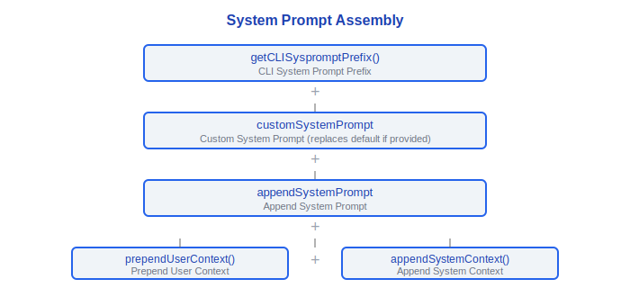

# API Client - API Client Layer

> Source files: `src/services/api/client.ts` (389 lines), `src/services/api/claude.ts` (3419 lines),
> `src/services/api/withRetry.ts` (822 lines), `src/services/api/errors.ts` (1207 lines),
> `src/services/api/logging.ts` (788 lines)

---

## 1. Architecture Overview

The API client layer is responsible for all communication with the Claude API, including multi-backend routing, streaming, error handling, retry strategies, and logging.


---

## 2. client.ts — Client Factory (389 lines)

### 2.1 getAnthropicClient() Factory

```typescript
export async function getAnthropicClient({
  apiKey,
  maxRetries,
  model,
  fetchOverride,
  source,
}: {
  apiKey?: string
  maxRetries: number
  model?: string
  fetchOverride?: ClientOptions['fetch']
  source?: string
}): Promise<Anthropic>
```

### 2.2 Four Backends

| Backend | Trigger Condition | Authentication Method |
|------|----------|----------|
| **Anthropic Direct** | Default (ANTHROPIC_API_KEY or OAuth) | API Key / OAuth Token |
| **AWS Bedrock** | `CLAUDE_CODE_USE_BEDROCK=true` | AWS credentials (IAM/STS) |
| **Google Vertex AI** | `CLAUDE_CODE_USE_VERTEX=true` | GCP credentials (google-auth-library) |
| **Azure Foundry** | `ANTHROPIC_FOUNDRY_RESOURCE` or `ANTHROPIC_FOUNDRY_BASE_URL` | API Key / DefaultAzureCredential |

#### Design Philosophy: Why 4 backends instead of a unified API?

- **Enterprise Compliance Driven**: Anthropic Direct is the default path; Bedrock/Vertex/Foundry meet enterprise compliance requirements (data doesn't leave AWS/GCP/Azure). Many enterprise customers' security policies require API calls to stay within cloud boundaries, and these three backends are direct mappings of market demands.
- **Classic Strategy Pattern Application**: The abstraction layer `getAnthropicClient()` makes upper-layer code (like `claude.ts::queryModelWithStreaming()`) completely unaware of backend differences. In the source code, `getAnthropicClient()` selects backends based on environment variables (`CLAUDE_CODE_USE_BEDROCK`/`CLAUDE_CODE_USE_VERTEX`/`ANTHROPIC_FOUNDRY_RESOURCE`), returning a unified `Anthropic` SDK instance. Upper layers only call `client.beta.messages.stream(params)`, without needing to know which cloud is underneath.
- **Authentication Complexity Isolation**: Each backend has completely different authentication methods—API Key, IAM/STS, GCP OAuth (`google-auth-library`), Azure DefaultAzureCredential. Without unification at the factory layer, authentication logic would propagate upward and pollute query logic. Source code evidence: `getAnthropicClient()` at `client.ts:88` internally handles all authentication differences, including OAuth token refresh (`checkAndRefreshOAuthTokenIfNeeded`), API Key Helper (`getApiKeyFromApiKeyHelper`), AWS region routing, etc.
- **Extensibility**: Adding new backends only requires adding a branch in the factory function, without affecting the 3400+ lines of core logic in `claude.ts`.

### 2.3 Backend Environment Variable Matrix

**Anthropic Direct**:
- `ANTHROPIC_API_KEY` — API key
- OAuth tokens via `getClaudeAIOAuthTokens()`

**AWS Bedrock**:
- AWS credentials via aws-sdk defaults
- `AWS_REGION` / `AWS_DEFAULT_REGION` — Region (default us-east-1)
- `ANTHROPIC_SMALL_FAST_MODEL_AWS_REGION` — Small model region override

**Google Vertex AI**:
- `ANTHROPIC_VERTEX_PROJECT_ID` — GCP project ID
- `CLOUD_ML_REGION` — Default region
- Model-specific region variables:
  - `VERTEX_REGION_CLAUDE_3_5_HAIKU`
  - `VERTEX_REGION_CLAUDE_HAIKU_4_5`
  - `VERTEX_REGION_CLAUDE_3_5_SONNET`
  - `VERTEX_REGION_CLAUDE_3_7_SONNET`
- Region priority: model-specific env → CLOUD_ML_REGION → config default → us-east5

**Azure Foundry**:
- `ANTHROPIC_FOUNDRY_RESOURCE` — Azure resource name
- `ANTHROPIC_FOUNDRY_BASE_URL` — Full base URL
- `ANTHROPIC_FOUNDRY_API_KEY` — API Key
- DefaultAzureCredential fallback

### 2.4 Common Features

- **User-Agent**: `getUserAgent()` generates standard UA string
- **Proxy Support**: `getProxyFetchOptions()` handles HTTP/HTTPS proxies
- **OAuth Refresh**: Automatically detects OAuth token expiration and refreshes (`checkAndRefreshOAuthTokenIfNeeded`)
- **API Key Helper**: Supports external helper programs to obtain keys (`getApiKeyFromApiKeyHelper`)
- **Debug Logging**: Enables SDK verbose logging to stderr when `isDebugToStdErr()` is true

---

## 3. claude.ts — Core API Calls (3419 lines)

### 3.1 queryModelWithStreaming() — Complete Signature

This is the most critical function in the entire system, responsible for converting internal message formats to API requests and handling streaming responses.

```typescript
export async function* queryModelWithStreaming(
  messages: Message[],
  systemPrompt: SystemPrompt,
  tools: Tools,
  model: string,
  permissionContext: ToolPermissionContext,
  options: {
    thinkingConfig: ThinkingConfig
    queryTracking?: QueryChainTracking
    mcpClients?: MCPServerConnection[]
    mcpResources?: Record<string, ServerResource[]>
    agentDefinitions?: AgentDefinitionsResult
    maxOutputTokensOverride?: number
    skipCacheWrite?: boolean
    taskBudget?: { total: number; remaining?: number }
    querySource?: QuerySource
    fetchOverride?: ClientOptions['fetch']
    customSystemPrompt?: string
    appendSystemPrompt?: string
    agentId?: string
    outputConfig?: BetaOutputConfig
  },
): AsyncGenerator<StreamEvent | AssistantMessage | SystemAPIErrorMessage>
```

### 3.2 Message Normalization 6-Step Pipeline

Before sending API requests, messages go through 6 normalization steps:

1. **normalizeMessagesForAPI** — Filter system messages, local command messages, normalize message format
2. **stripAdvisorBlocks** — Remove advisor blocks
3. **stripCallerFieldFromAssistantMessage** — Remove caller field from assistant messages
4. **stripToolReferenceBlocksFromUserMessage** — Remove tool reference blocks from user messages
5. **ensureToolResultPairing** — Ensure each tool_use has a corresponding tool_result
6. **stripSignatureBlocks** — Remove signature blocks
7. **normalizeContentFromAPI** — Normalize API response content

#### Design Philosophy: Why does message normalization need a multi-step pipeline instead of one-shot processing?

Each step solves an independent problem domain, and there are causal dependencies between steps:

- **`reorderAttachmentsForAPI`** (source code `messages.ts:1481`): Bedrock requires attachments before reference text—this is a backend protocol constraint, unrelated to message content.
- **`stripAdvisorBlocks`**: Internal feature blocks (like advisor-injected guidance content) should not be sent to the API—this is a security boundary, preventing internal implementation details from leaking into model context.
- **`ensureToolResultPairing`**: API protocol requires each `tool_use` to have a corresponding `tool_result`, otherwise returns 400 error—this is a hard protocol constraint of Claude API.
- **`filterOrphanedThinkingOnlyMessages`** (source code `messages.ts:2307-2310` comments): Compaction may sever the association between thinking blocks and body, producing orphaned pure-thinking assistant messages. Source code comments explicitly state this is a side-effect fix for "compaction slicing away intervening messages".
- **`mergeAdjacentUserMessages`** (source code `messages.ts:2327-2338`): Previous filtering steps (like removing virtual messages, orphaned thinking filtering) may produce consecutive user messages, violating API's user/assistant alternation rule—this is a fix for side effects of prior steps.

Source code comments at `messages.ts:2318-2320` frankly admit the fragility of this design: "These multi-pass normalizations are inherently fragile -- each pass can create conditions a prior pass was meant to handle." But the benefit of pipeline design is that each step can be independently tested and evolved, and adding new steps (like `smooshSystemReminderSiblings`) doesn't affect existing steps.

### 3.3 System Prompt Assembly

System prompts are assembled from multiple layers:



### 3.4 Betas Management

```typescript
const betas = getMergedBetas(
  getModelBetas(model),                    // Model-specific betas
  getBedrockExtraBodyParamsBetas(),        // Bedrock extra parameters
  sdkBetas,                                // SDK-passed betas
)
```

Common betas:
- `interleaved-thinking-2025-05-14` — Interleaved thinking
- `output-128k-2025-02-19` — 128K output
- `task-budgets-2026-03-13` — Task budgets
- `prompt-caching-2024-07-31` — Prompt caching
- `pdfs-2024-09-25` — PDF support
- `tool-search-2025-04-15` — Tool search
- `afk-mode-2025-03-13` — AFK mode

### 3.5 Cache Control (Prompt Caching)

```typescript
export function getCacheControl(
  scope?: CacheScope,
): { type: 'ephemeral'; ttl?: number } | undefined
```

- **TTL**: 1 hour (`3600` seconds) — For eligible users
- **Condition**: `isFirstPartyAnthropicBaseUrl()` and not third-party gateway
- **Scope**: `'global'` scope option for cross-user caching (when system prompts are consistent)
- **Cache Strategy**: `GlobalCacheStrategy = 'tool_based' | 'system_prompt' | 'none'`

### 3.6 Request Parameters

```typescript
const requestParams: BetaMessageStreamParams = {
  model,                          // Model identifier
  messages,                       // Normalized message list
  system,                         // Assembled system prompt
  tools,                          // Tool definition list (toolToAPISchema)
  max_tokens,                     // Maximum output tokens
  thinking,                       // Thinking configuration (type + budget_tokens)
  betas,                          // Beta feature list
  speed,                          // Speed configuration (effort level)
  output_config,                  // Output configuration (task_budget, etc.)
  stream: true,                   // Always streaming
  metadata: {                     // Metadata
    user_id,                      // User ID
  },
  headers: {                      // Custom headers
    'anthropic-attribution': ..., // Attribution header
  },
}
```

### 3.7 getMaxOutputTokensForModel()

```typescript
export function getMaxOutputTokensForModel(model: string): number
```

- Opus models: `CAPPED_DEFAULT_MAX_TOKENS` (typically 16384)
- Sonnet models (1M experiment): May get higher limits
- Other models: Return default values based on model configuration
- Environment variable override: `CLAUDE_CODE_MAX_OUTPUT_TOKENS`
- Minimum floor: `FLOOR_OUTPUT_TOKENS = 3000`

---

## 4. withRetry.ts — Retry Engine (822 lines)

### 4.1 Constants

```typescript
const DEFAULT_MAX_RETRIES = 10       // Default maximum retry count
const MAX_529_RETRIES = 3            // Maximum retry count for 529 overload errors
export const BASE_DELAY_MS = 500     // Base delay 500ms
const FLOOR_OUTPUT_TOKENS = 3000     // Output token minimum floor
```

### 4.2 Persistent Retry (ant-only)

```typescript
const PERSISTENT_MAX_BACKOFF_MS = 5 * 60 * 1000       // 5 minutes maximum backoff
const PERSISTENT_RESET_CAP_MS = 6 * 60 * 60 * 1000    // 6 hours reset cap
const HEARTBEAT_INTERVAL_MS = 30_000                    // 30 seconds heartbeat interval
```

Enabled condition: `CLAUDE_CODE_UNATTENDED_RETRY` environment variable (ant-only unattended sessions).

### 4.3 Retry Strategy for Each Error Type

| Error Type | HTTP Code | Retry Strategy | Max Count | Notes |
|----------|---------|----------|----------|------|
| **429 Rate Limit** | 429 | Exponential backoff + `retry-after` header | DEFAULT_MAX_RETRIES (10) | Read `retry-after` header |
| **529 Overloaded** | 529 | Exponential backoff | MAX_529_RETRIES (3) | Only foreground query sources retry |
| **Connection Error** | N/A | Exponential backoff | DEFAULT_MAX_RETRIES (10) | APIConnectionError, timeout |
| **401 Auth Error** | 401 | Retry after token refresh | 1-2 times | OAuth/AWS/GCP credential refresh |
| **413 Too Long** | 413 | No retry (handled by reactiveCompact) | 0 | prompt_too_long |
| **500 Server** | 500 | Exponential backoff | DEFAULT_MAX_RETRIES | Server internal error |
| **Other 4xx** | 4xx | No retry | 0 | Client error |

### 4.4 529 Foreground Query Source Whitelist

Only the following query sources will retry 529:

```typescript
const FOREGROUND_529_RETRY_SOURCES = new Set<QuerySource>([
  'repl_main_thread',
  'repl_main_thread:outputStyle:custom',
  'repl_main_thread:outputStyle:Explanatory',
  'repl_main_thread:outputStyle:Learning',
  'sdk',
  'agent:custom', 'agent:default', 'agent:builtin',
  'compact',
  'hook_agent', 'hook_prompt',
  'verification_agent',
  'side_question',
  'auto_mode',
  ...(feature('BASH_CLASSIFIER') ? ['bash_classifier'] : []),
])
```

Design principle: Background tasks (summaries, titles, suggestions, classifiers) don't retry 529 during capacity cascades, because each retry produces 3-10x gateway amplification, and users don't see these failures.

#### Design Philosophy: Why are 529 and 429 treated differently?

- **Different Semantics**: 429 = user quota exhausted, waiting won't improve the current quota window; 529 = server temporarily overloaded, brief waiting may restore service.
- **Limited Retries**: 529 only retries 3 times (`MAX_529_RETRIES`), because persistent overload indicates systemic issues, and infinite retries only exacerbate load. Source code `withRetry.ts:54` defines this constant, and `withRetry.ts:335` checks `consecutive529Errors >= MAX_529_RETRIES` before giving up.
- **Foreground Priority**: Background tasks don't retry 529 (controlled by `FOREGROUND_529_RETRY_SOURCES` whitelist). Source code comments at `withRetry.ts:57-61` explicitly explain why: "during a capacity cascade each retry is 3-10x gateway amplification, and the user never sees those fail anyway. New sources default to no-retry -- add here only if the user is waiting on the result." This is a classic **cascade failure protection** pattern—during system overload, only pay the retry cost for user-visible foreground requests, background tasks fail silently to reduce server pressure.

### 4.5 Special Error Types

```typescript
export class CannotRetryError extends Error
// Indicates error is not retryable, should be returned to caller immediately

export class FallbackTriggeredError extends Error
// Indicates model downgrade should be triggered (e.g., from Opus to Sonnet)
```

#### Design Philosophy: Why is persistent retry ant-only?

- **Unattended Semantics**: CI/background tasks need "never give up" semantics—tasks may queue for hours, and failing mid-way due to temporary overload is unacceptable. Source code comments at `withRetry.ts:91-93`: "CLAUDE_CODE_UNATTENDED_RETRY: for unattended sessions (ant-only). Retries 429/529 indefinitely with higher backoff and periodic keep-alive yields so the host environment does not mark the session idle mid-wait."
- **Not Exposed Externally**: Exposing this feature would lead to user abuse (configuring never-give-up retries), and during server overload, many clients continuously retrying would exacerbate server pressure, forming a positive feedback death spiral.
- **30-second Heartbeat**: `HEARTBEAT_INTERVAL_MS = 30_000` (source code `withRetry.ts:98`) ensures connections aren't marked idle and killed by the host environment during long waits. Heartbeat is implemented via yield `SystemAPIErrorMessage`—this is a temporary solution, source code comments mark a TODO for a dedicated keep-alive channel.
- **6-hour Reset**: `PERSISTENT_RESET_CAP_MS = 6 * 60 * 60 * 1000` (source code `withRetry.ts:97`) prevents backoff time from growing indefinitely, resetting the backoff timer after 6 hours to avoid unreasonably long waits after service recovery.

#### Design Philosophy: Why is gateway detection important?

- **Cache Compatibility**: Third-party gateways (LiteLLM/Helicone/Portkey, etc.) may not support Prompt Caching TTL. In source code, `getCacheControl()` checks `isFirstPartyAnthropicBaseUrl()`, only setting TTL=3600s for direct Anthropic connections. Requests through gateways may ignore or incorrectly handle cache headers.
- **Error Message Customization**: Gateways may modify response formats or add their own error wrapping, error parsing logic needs to know if the response went through a gateway to correctly extract original error information.
- **Telemetry Differentiation**: `logging.ts:274` and `logging.ts:641` detect gateway type via `detectGateway()` and record in telemetry, used to diagnose issues like "cache hit rate suddenly dropped because user switched gateways". Detection is based on response header prefixes (like `x-litellm-*`, `helicone-*`) and hostname suffixes (like `*.databricks.com`), a non-invasive passive detection method.

### 4.6 Fast Mode Integration

- **Fast Mode Cooldown**: 429/529 triggers `triggerFastModeCooldown`, temporarily switches back to standard model
- **Overage Rejection**: When API returns overage rejection, `handleFastModeOverageRejection`
- **isFastModeCooldown**: Check if in cooldown period

### 4.7 Backoff Strategy

```typescript
// Base delay: BASE_DELAY_MS * 2^attempt
// Jitter: ±50% randomization
// 429 special: Use retry-after header value (if available)
// Persistent mode: Maximum backoff 5 minutes, reset after 6 hours
```

---

## 5. errors.ts — Error Classification (1207 lines)

### 5.1 classifyAPIError()

```typescript
export function classifyAPIError(error: unknown): APIErrorClassification
```

Classification dimensions:
- **isRetryable**: Whether retryable
- **isRateLimit**: Whether rate limit
- **isOverloaded**: Whether overloaded
- **isAuthError**: Whether authentication error
- **isPromptTooLong**: Whether prompt too long
- **isMediaSizeError**: Whether media size error
- **category**: Error category (`rate_limit`/`overloaded`/`auth`/`prompt_too_long`/`connection`/`server`/`client`/`unknown`)

### 5.2 parsePromptTooLongTokenCounts()

```typescript
export function parsePromptTooLongTokenCounts(rawMessage: string): {
  actualTokens: number | undefined
  limitTokens: number | undefined
}
```

Parse token counts from API error messages: `"prompt is too long: 137500 tokens > 135000 maximum"` → `{ actualTokens: 137500, limitTokens: 135000 }`

Fault-tolerant design: Supports SDK prefix wrapping, JSON envelopes, case differences (Vertex returns different formats).

### 5.3 isMediaSizeError()

Detect image/PDF size limit errors:
- `API_PDF_MAX_PAGES` — PDF maximum pages
- `PDF_TARGET_RAW_SIZE` — PDF target raw size
- `ImageSizeError` / `ImageResizeError` — Image size/resize errors

### 5.4 Rate Limit Message Handling

```typescript
export function getRateLimitErrorMessage(limits: ClaudeAILimits): string
```

- Read Claude.ai subscription limits
- Generate user-friendly messages based on quota status (extracted from headers/errors)
- Distinguish Pro/Team/Enterprise subscription tiers

### 5.5 REPEATED_529_ERROR_MESSAGE

Special message displayed when 529 error retries are exhausted:

```typescript
export const REPEATED_529_ERROR_MESSAGE = '...'
```

### 5.6 categorizeRetryableAPIError()

Used for QueryEngine-level error classification, deciding whether to retry the entire query:

```typescript
export function categorizeRetryableAPIError(error: unknown): {
  shouldRetry: boolean
  errorMessage: string
  userMessage?: string
}
```

---

## 6. logging.ts — API Logging and Telemetry (788 lines)

### 6.1 logAPIQuery()

Logged before API request is sent:
- Request parameters (model, message count, tool count)
- Token estimation
- Query source

### 6.2 logAPISuccessAndDuration()

Logged after API response succeeds:
- Duration (ms)
- Usage (input/output/cache tokens)
- Stop reason (stop_reason)
- Actual model used
- Gateway detection

### 6.3 Usage Tracking

```typescript
export type NonNullableUsage = {
  input_tokens: number
  output_tokens: number
  cache_creation_input_tokens: number
  cache_read_input_tokens: number
}

export const EMPTY_USAGE: NonNullableUsage = {
  input_tokens: 0,
  output_tokens: 0,
  cache_creation_input_tokens: 0,
  cache_read_input_tokens: 0,
}
```

### 6.4 GlobalCacheStrategy

```typescript
export type GlobalCacheStrategy = 'tool_based' | 'system_prompt' | 'none'
```

- `tool_based`: Set cache_control on tool definitions
- `system_prompt`: Set cache_control on last block of system prompt
- `none`: Don't set cache control

### 6.5 Gateway Detection Fingerprints

The system automatically detects AI gateway proxies through response headers:

```typescript
type KnownGateway =
  | 'litellm'
  | 'helicone'
  | 'portkey'
  | 'cloudflare-ai-gateway'
  | 'kong'
  | 'braintrust'
  | 'databricks'
```

Detection methods:

| Gateway | Detection Method | Header Prefix |
|------|----------|----------|
| LiteLLM | Response headers | `x-litellm-*` |
| Helicone | Response headers | `helicone-*` |
| Portkey | Response headers | `x-portkey-*` |
| Cloudflare AI Gateway | Response headers | `cf-aig-*` |
| Kong | Response headers | `x-kong-*` |
| Braintrust | Response headers | `x-bt-*` |
| Databricks | Hostname suffix | `*.databricks.com` |

Gateway detection is used for:
- Telemetry tagging (distinguish direct vs gateway)
- Cache control decisions (third-party gateways may not support TTL caching)
- Error message customization

---

## 7. Complete API Call Flow


---

## 8. Other Files in API Directory

| File | Lines | Purpose |
|------|------|------|
| `dumpPrompts.ts` | - | Request dump (for debugging, creates closure once per query session) |
| `emptyUsage.ts` | - | Empty Usage constant |
| `errorUtils.ts` | - | Error formatting utilities (`formatAPIError`, `extractConnectionErrorDetails`) |
| `filesApi.ts` | - | File API (upload/download) |
| `firstTokenDate.ts` | - | First token date tracking |
| `grove.ts` | - | Grove API integration |
| `metricsOptOut.ts` | - | Telemetry opt-out |
| `overageCreditGrant.ts` | - | Overage credit grant |
| `promptCacheBreakDetection.ts` | - | Cache break detection (compaction/micro-compaction notification) |
| `referral.ts` | - | Referral system |
| `sessionIngress.ts` | - | Session ingress tracking |
| `ultrareviewQuota.ts` | - | Ultra review quota |
| `usage.ts` | - | Usage API |
| `adminRequests.ts` | - | Admin requests |
| `bootstrap.ts` | - | API layer bootstrap |

---

## Engineering Practice Guide

### Debugging API Calls

When API call behavior is abnormal (unexpected errors, wrong response format, cache misses, etc.):

1. **Enable debug logging** — When `isDebugToStdErr()` is true, SDK verbose logs output to stderr, including complete request and response headers
2. **Check `dumpPrompts` output** — `services/api/dumpPrompts.ts` can dump the complete message list for each request, used to confirm if content sent to API matches expectations
3. **Check message normalization** — If API returns 400 error, print message state after each step of `normalizeMessagesForAPI` to locate which step introduced the problem (like consecutive user messages, missing tool_result, etc.)
4. **Check request parameters** — Set breakpoint at `requestParams` construction in `queryModelWithStreaming()` to confirm `model`, `max_tokens`, `thinking`, `betas` and other parameters are correct

### Adding New API Backend

If you need to support a new cloud provider or API gateway:

1. **Add new branch in `client.ts`'s `getAnthropicClient()`** — Triggered based on environment variable (like `CLAUDE_CODE_USE_NEWBACKEND=true`)
2. **Implement authentication logic** — Each backend has different authentication methods (API Key, OAuth, IAM, etc.), handle authentication differences inside factory function
3. **Add corresponding environment variables** — Reference existing backend environment variable naming conventions (like `ANTHROPIC_*` prefix)
4. **Handle region routing** (if needed) — Vertex's region routing depends on model (`VERTEX_REGION_CLAUDE_*` variables), new backends may have similar needs
5. **Register betas** — If new backend needs specific beta features, register in `getMergedBetas()`
6. **Add gateway detection** (if needed) — Add new backend's response header pattern in gateway detection fingerprints in `logging.ts`

**Key principle**: Upper-layer code (`claude.ts`) should not be aware of backend differences. `getAnthropicClient()` returns a unified `Anthropic` SDK instance, all backend-specific logic is encapsulated inside the factory.

### Debugging 429/529 Errors

Distinguish two overload scenarios and adopt different strategies:

| Error Code | Meaning | Diagnostic Method | Handling Recommendation |
|--------|------|----------|----------|
| **429** | User quota exhausted | Check `retry-after` header; check subscription tier (Pro/Team/Enterprise) | Wait for quota window reset, or upgrade subscription |
| **529** | Server temporarily overloaded | Check if foreground query (`FOREGROUND_529_RETRY_SOURCES`); check `consecutive529Errors` count | Retry up to 3 times then give up; background tasks don't retry |

**Further debugging**:
- Check if `FOREGROUND_529_RETRY_SOURCES` contains your `querySource` — If not in whitelist, 529 won't retry
- Check Fast Mode Cooldown — 429/529 may trigger `triggerFastModeCooldown`, temporarily switching back to standard model
- Persistent retry (ant-only) — `CLAUDE_CODE_UNATTENDED_RETRY` enables infinite retry, but only for internal unattended sessions

### Message Normalization Debugging

In the 6-step message normalization pipeline, each step may introduce problems or fix side effects of prior steps:

1. **`normalizeMessagesForAPI`** — Filter system messages, local command messages
2. **`stripAdvisorBlocks`** — Remove advisor blocks (security boundary)
3. **`ensureToolResultPairing`** — Ensure tool_use/tool_result pairing (API protocol requirement)
4. **`filterOrphanedThinkingOnlyMessages`** — Remove orphaned thinking messages after compaction
5. **`mergeAdjacentUserMessages`** — Merge consecutive user messages that prior steps may have produced
6. **`stripSignatureBlocks`** — Remove signature blocks

**Debugging tip**: Print summary of `messages.length` and `messages.map(m => m.role)` after each step to quickly locate which step changed message structure. If API returns "messages: roles must alternate" error, focus on steps 4 and 5.

### Cache Debugging

When cache hit rate is lower than expected:

1. **Check `getCacheControl()` return value** — Only direct Anthropic connections (`isFirstPartyAnthropicBaseUrl()`) set TTL=3600s; requests through third-party gateways don't set TTL
2. **Check `GlobalCacheStrategy`** — `'tool_based'` (set cache_control on tool definitions), `'system_prompt'` (set on last block of system prompt), `'none'`
3. **Check gateway detection** — `detectGateway()` detects gateway type through response headers; if using LiteLLM/Helicone or other gateways, cache control may be modified or ignored by gateway
4. **Check cache break detection** — `promptCacheBreakDetection.ts` detects if compaction/micro-compaction broke cache. Frequent compaction causes cache prefix changes, reducing hit rate

### Common Pitfalls

1. **Don't bypass `withRetry` to call API directly** — retry/fallback/cooldown/heartbeat logic is all in `withRetry.ts`. Directly calling `client.beta.messages.stream()` skips all error recovery mechanisms, failing directly on 429/529/connection errors

2. **When adding new beta features, ensure registration in `getMergedBetas`** — `betas` list is merged through `getMergedBetas()` combining model-specific betas, Bedrock extra parameters, and SDK betas. If new beta isn't registered, API will ignore corresponding functionality

3. **Vertex's region routing depends on model** — Different models may route to different regions (`VERTEX_REGION_CLAUDE_3_5_HAIKU` vs `VERTEX_REGION_CLAUDE_3_7_SONNET`), need to confirm region configuration when adding new model support

4. **Don't assume OAuth tokens are always valid** — `checkAndRefreshOAuthTokenIfNeeded()` checks token expiration before each API call. If custom code caches `Anthropic` client instance, token may expire after long time

5. **413 errors don't retry in `withRetry`** — `prompt_too_long` errors are handled by `reactiveCompact` in `query.ts`. `withRetry` only does network-layer retries, semantic-layer errors (like context too long) need upper-layer handling

6. **`CannotRetryError` immediately terminates retry loop** — If your error handling code throws `CannotRetryError`, `withRetry` will immediately stop retrying and return error to caller. Only use when confirmed unrecoverable


---

[← Query Engine](../03-查询引擎/query-engine-en.md) | [Index](../README_EN.md) | [Tool System →](../05-工具系统/tool-system-en.md)
