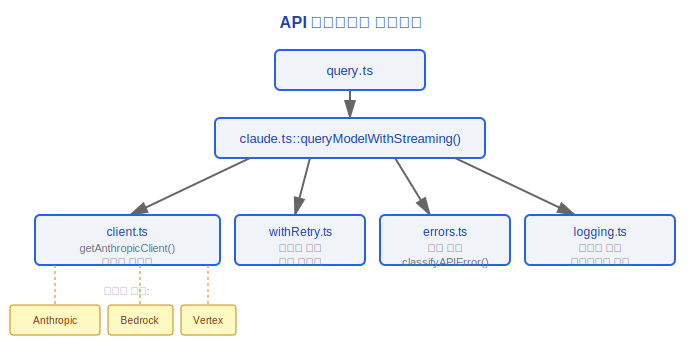
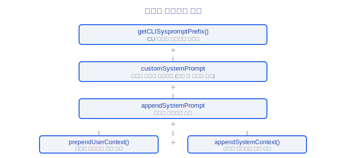
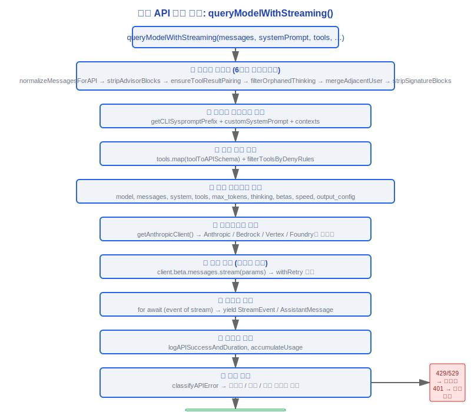

# API 클라이언트 계층

> 소스 파일: `src/services/api/client.ts` (389줄), `src/services/api/claude.ts` (3419줄),
> `src/services/api/withRetry.ts` (822줄), `src/services/api/errors.ts` (1207줄),
> `src/services/api/logging.ts` (788줄)

---

## 1. 아키텍처 개요

API 클라이언트 계층은 멀티 백엔드 라우팅, 스트리밍(Streaming), 오류 처리, 재시도 전략, 로깅을 포함하여 Claude API와의 모든 통신을 담당합니다.



---

## 2. client.ts — 클라이언트 팩토리 (389줄)

### 2.1 getAnthropicClient() 팩토리

```typescript
export async function getAnthropicClient({
  apiKey,
  maxRetries,
  model,
  fetchOverride,
  source,
}: {
  apiKey?: string
  maxRetries: number
  model?: string
  fetchOverride?: ClientOptions['fetch']
  source?: string
}): Promise<Anthropic>
```

### 2.2 4개 백엔드

| 백엔드 | 트리거 조건 | 인증 방법 |
|------|----------|----------|
| **Anthropic Direct** | 기본값 (ANTHROPIC_API_KEY 또는 OAuth) | API 키 / OAuth 토큰 |
| **AWS Bedrock** | `CLAUDE_CODE_USE_BEDROCK=true` | AWS 자격 증명 (IAM/STS) |
| **Google Vertex AI** | `CLAUDE_CODE_USE_VERTEX=true` | GCP 자격 증명 (google-auth-library) |
| **Azure Foundry** | `ANTHROPIC_FOUNDRY_RESOURCE` 또는 `ANTHROPIC_FOUNDRY_BASE_URL` | API 키 / DefaultAzureCredential |

#### 설계 철학: 왜 통합 API 대신 4개의 백엔드인가?

- **엔터프라이즈 컴플라이언스 주도**: Anthropic Direct는 기본 경로입니다; Bedrock/Vertex/Foundry는 엔터프라이즈 컴플라이언스 요구사항 (데이터가 AWS/GCP/Azure를 벗어나지 않음)을 충족합니다. 많은 엔터프라이즈 고객의 보안 정책은 API 호출이 클라우드 경계 내에 머물러야 하며, 이 세 가지 백엔드는 시장 수요의 직접적인 매핑입니다.
- **클래식 전략 패턴 적용**: 추상화 계층 `getAnthropicClient()`는 상위 레이어 코드 (예: `claude.ts::queryModelWithStreaming()`)가 백엔드 차이를 완전히 인식하지 못하게 합니다. 소스 코드에서 `getAnthropicClient()`는 환경 변수 (`CLAUDE_CODE_USE_BEDROCK`/`CLAUDE_CODE_USE_VERTEX`/`ANTHROPIC_FOUNDRY_RESOURCE`)를 기반으로 백엔드를 선택하고, 통합된 `Anthropic` SDK 인스턴스를 반환합니다. 상위 레이어는 `client.beta.messages.stream(params)`만 호출하며, 아래에 어떤 클라우드가 있는지 알 필요가 없습니다.
- **인증 복잡성 격리**: 각 백엔드는 완전히 다른 인증 방법을 가집니다 — API 키, IAM/STS, GCP OAuth (`google-auth-library`), Azure DefaultAzureCredential. 팩토리 레이어에서 통합하지 않으면, 인증 로직이 상위로 전파되어 쿼리 로직을 오염시킵니다. 소스 코드 근거: `getAnthropicClient()`는 `client.ts:88`에서 내부적으로 모든 인증 차이를 처리합니다 (OAuth 토큰 갱신 `checkAndRefreshOAuthTokenIfNeeded`, API Key Helper `getApiKeyFromApiKeyHelper`, AWS 리전 라우팅 등 포함).
- **확장성**: 새 백엔드를 추가하려면 팩토리 함수에 분기만 추가하면 되며, `claude.ts`의 3400줄 이상의 핵심 로직에 영향을 미치지 않습니다.

### 2.3 백엔드 환경 변수 매트릭스

**Anthropic Direct**:
- `ANTHROPIC_API_KEY` — API 키
- `getClaudeAIOAuthTokens()`를 통한 OAuth 토큰

**AWS Bedrock**:
- aws-sdk 기본값을 통한 AWS 자격 증명
- `AWS_REGION` / `AWS_DEFAULT_REGION` — 리전 (기본값 us-east-1)
- `ANTHROPIC_SMALL_FAST_MODEL_AWS_REGION` — 소형 모델 리전 재정의

**Google Vertex AI**:
- `ANTHROPIC_VERTEX_PROJECT_ID` — GCP 프로젝트 ID
- `CLOUD_ML_REGION` — 기본 리전
- 모델별 리전 변수:
  - `VERTEX_REGION_CLAUDE_3_5_HAIKU`
  - `VERTEX_REGION_CLAUDE_HAIKU_4_5`
  - `VERTEX_REGION_CLAUDE_3_5_SONNET`
  - `VERTEX_REGION_CLAUDE_3_7_SONNET`
- 리전 우선순위: 모델별 env → CLOUD_ML_REGION → 설정 기본값 → us-east5

**Azure Foundry**:
- `ANTHROPIC_FOUNDRY_RESOURCE` — Azure 리소스 이름
- `ANTHROPIC_FOUNDRY_BASE_URL` — 전체 기본 URL
- `ANTHROPIC_FOUNDRY_API_KEY` — API 키
- DefaultAzureCredential 폴백

### 2.4 공통 기능

- **User-Agent**: `getUserAgent()`가 표준 UA 문자열 생성
- **프록시 지원**: `getProxyFetchOptions()`가 HTTP/HTTPS 프록시 처리
- **OAuth 갱신**: OAuth 토큰 만료 자동 감지 및 갱신 (`checkAndRefreshOAuthTokenIfNeeded`)
- **API Key Helper**: 외부 헬퍼 프로그램을 통한 키 획득 지원 (`getApiKeyFromApiKeyHelper`)
- **디버그 로깅**: `isDebugToStdErr()`가 true일 때 SDK 상세 로그를 stderr로 활성화

---

## 3. claude.ts — 핵심 API 호출 (3419줄)

### 3.1 queryModelWithStreaming() — 완전한 시그니처

이것은 전체 시스템에서 가장 중요한 함수로, 내부 메시지 형식을 API 요청으로 변환하고 스트리밍 응답을 처리합니다.

```typescript
export async function* queryModelWithStreaming(
  messages: Message[],
  systemPrompt: SystemPrompt,
  tools: Tools,
  model: string,
  permissionContext: ToolPermissionContext,
  options: {
    thinkingConfig: ThinkingConfig
    queryTracking?: QueryChainTracking
    mcpClients?: MCPServerConnection[]
    mcpResources?: Record<string, ServerResource[]>
    agentDefinitions?: AgentDefinitionsResult
    maxOutputTokensOverride?: number
    skipCacheWrite?: boolean
    taskBudget?: { total: number; remaining?: number }
    querySource?: QuerySource
    fetchOverride?: ClientOptions['fetch']
    customSystemPrompt?: string
    appendSystemPrompt?: string
    agentId?: string
    outputConfig?: BetaOutputConfig
  },
): AsyncGenerator<StreamEvent | AssistantMessage | SystemAPIErrorMessage>
```

### 3.2 메시지 정규화 6단계 파이프라인

API 요청을 보내기 전에 메시지는 6단계 정규화를 거칩니다:

1. **normalizeMessagesForAPI** — 시스템 메시지 필터링, 로컬 커맨드 메시지, 메시지 형식 정규화
2. **stripAdvisorBlocks** — 어드바이저 블록 제거
3. **stripCallerFieldFromAssistantMessage** — 어시스턴트 메시지에서 caller 필드 제거
4. **stripToolReferenceBlocksFromUserMessage** — 사용자 메시지에서 도구 참조 블록 제거
5. **ensureToolResultPairing** — 각 tool_use에 해당하는 tool_result가 있는지 확인
6. **stripSignatureBlocks** — 서명 블록 제거
7. **normalizeContentFromAPI** — API 응답 콘텐츠 정규화

#### 설계 철학: 왜 메시지 정규화에 단일 처리 대신 다단계 파이프라인이 필요한가?

각 단계는 독립적인 문제 도메인을 해결하며, 단계 간에는 인과적 의존성이 있습니다:

- **`reorderAttachmentsForAPI`** (소스 코드 `messages.ts:1481`): Bedrock은 참조 텍스트 전에 첨부 파일이 필요합니다 — 이것은 메시지 콘텐츠와 무관한 백엔드 프로토콜 제약입니다.
- **`stripAdvisorBlocks`**: 내부 기능 블록 (예: 어드바이저 주입 지침 콘텐츠)은 API에 전송되어서는 안 됩니다 — 이것은 내부 구현 세부 사항이 모델 컨텍스트에 누출되는 것을 방지하는 보안 경계입니다.
- **`ensureToolResultPairing`**: API 프로토콜은 각 `tool_use`에 해당하는 `tool_result`가 있어야 하며, 그렇지 않으면 400 오류를 반환합니다 — 이것은 Claude API의 하드 프로토콜 제약입니다.
- **`filterOrphanedThinkingOnlyMessages`** (소스 코드 `messages.ts:2307-2310` 주석): 압축은 사고 블록과 본문 사이의 연결을 끊어, 고아 순수 사고 어시스턴트 메시지를 생성할 수 있습니다. 소스 코드 주석은 이것이 "압축이 개입 메시지를 잘라낼 때의 부작용 수정"임을 명시합니다.
- **`mergeAdjacentUserMessages`** (소스 코드 `messages.ts:2327-2338`): 이전 필터링 단계 (가상 메시지 제거, 고아 사고 필터링 등)는 연속적인 사용자 메시지를 생성할 수 있으며, 이는 API의 사용자/어시스턴트 교대 규칙을 위반합니다 — 이것은 이전 단계의 부작용 수정입니다.

소스 코드 주석 `messages.ts:2318-2320`은 이 설계의 취약성을 솔직하게 인정합니다: "These multi-pass normalizations are inherently fragile -- each pass can create conditions a prior pass was meant to handle." 그러나 파이프라인 설계의 이점은 각 단계를 독립적으로 테스트하고 발전시킬 수 있으며, 새 단계 추가 (예: `smooshSystemReminderSiblings`)가 기존 단계에 영향을 미치지 않는다는 것입니다.

### 3.3 시스템 프롬프트 조립

시스템 프롬프트는 여러 레이어에서 조립됩니다:



### 3.4 Betas 관리

```typescript
const betas = getMergedBetas(
  getModelBetas(model),                    // 모델별 베타
  getBedrockExtraBodyParamsBetas(),        // Bedrock 추가 매개변수
  sdkBetas,                                // SDK에서 전달된 베타
)
```

일반적인 베타:
- `interleaved-thinking-2025-05-14` — 인터리브 사고
- `output-128k-2025-02-19` — 128K 출력
- `task-budgets-2026-03-13` — 작업 예산
- `prompt-caching-2024-07-31` — 프롬프트 캐싱
- `pdfs-2024-09-25` — PDF 지원
- `tool-search-2025-04-15` — 도구 검색
- `afk-mode-2025-03-13` — AFK 모드

### 3.5 캐시 제어 (프롬프트 캐싱)

```typescript
export function getCacheControl(
  scope?: CacheScope,
): { type: 'ephemeral'; ttl?: number } | undefined
```

- **TTL**: 1시간 (`3600`초) — 적격 사용자용
- **조건**: `isFirstPartyAnthropicBaseUrl()`이고 서드파티 게이트웨이가 아닌 경우
- **범위**: 사용자 간 캐싱을 위한 `'global'` 범위 옵션 (시스템 프롬프트가 일관적일 때)
- **캐시 전략**: `GlobalCacheStrategy = 'tool_based' | 'system_prompt' | 'none'`

### 3.6 요청 매개변수

```typescript
const requestParams: BetaMessageStreamParams = {
  model,                          // 모델 식별자
  messages,                       // 정규화된 메시지 목록
  system,                         // 조립된 시스템 프롬프트
  tools,                          // 도구 정의 목록 (toolToAPISchema)
  max_tokens,                     // 최대 출력 토큰
  thinking,                       // 사고 설정 (type + budget_tokens)
  betas,                          // 베타 기능 목록
  speed,                          // 속도 설정 (노력 수준)
  output_config,                  // 출력 설정 (task_budget 등)
  stream: true,                   // 항상 스트리밍
  metadata: {                     // 메타데이터
    user_id,                      // 사용자 ID
  },
  headers: {                      // 커스텀 헤더
    'anthropic-attribution': ..., // 어트리뷰션 헤더
  },
}
```

### 3.7 getMaxOutputTokensForModel()

```typescript
export function getMaxOutputTokensForModel(model: string): number
```

- Opus 모델: `CAPPED_DEFAULT_MAX_TOKENS` (일반적으로 16384)
- Sonnet 모델 (1M 실험): 더 높은 제한을 얻을 수 있음
- 기타 모델: 모델 설정을 기반으로 기본값 반환
- 환경 변수 재정의: `CLAUDE_CODE_MAX_OUTPUT_TOKENS`
- 최소 하한: `FLOOR_OUTPUT_TOKENS = 3000`

---

## 4. withRetry.ts — 재시도 엔진 (822줄)

### 4.1 상수

```typescript
const DEFAULT_MAX_RETRIES = 10       // 기본 최대 재시도 횟수
const MAX_529_RETRIES = 3            // 529 과부하 오류 최대 재시도 횟수
export const BASE_DELAY_MS = 500     // 기본 지연 500ms
const FLOOR_OUTPUT_TOKENS = 3000     // 출력 토큰 최소 하한
```

### 4.2 영속적 재시도 (ant 전용)

```typescript
const PERSISTENT_MAX_BACKOFF_MS = 5 * 60 * 1000       // 5분 최대 백오프
const PERSISTENT_RESET_CAP_MS = 6 * 60 * 60 * 1000    // 6시간 재설정 상한
const HEARTBEAT_INTERVAL_MS = 30_000                    // 30초 하트비트 간격
```

활성화 조건: `CLAUDE_CODE_UNATTENDED_RETRY` 환경 변수 (ant 전용 무인 세션).

### 4.3 오류 유형별 재시도 전략

| 오류 유형 | HTTP 코드 | 재시도 전략 | 최대 횟수 | 비고 |
|----------|---------|----------|----------|------|
| **429 속도 제한** | 429 | 지수 백오프 + `retry-after` 헤더 | DEFAULT_MAX_RETRIES (10) | `retry-after` 헤더 읽기 |
| **529 과부하** | 529 | 지수 백오프 | MAX_529_RETRIES (3) | 포그라운드 쿼리 소스만 재시도 |
| **연결 오류** | N/A | 지수 백오프 | DEFAULT_MAX_RETRIES (10) | APIConnectionError, 타임아웃 |
| **401 인증 오류** | 401 | 토큰 갱신 후 재시도 | 1-2회 | OAuth/AWS/GCP 자격 증명 갱신 |
| **413 너무 긴 경우** | 413 | 재시도 없음 (reactiveCompact로 처리) | 0 | prompt_too_long |
| **500 서버 오류** | 500 | 지수 백오프 | DEFAULT_MAX_RETRIES | 서버 내부 오류 |
| **기타 4xx** | 4xx | 재시도 없음 | 0 | 클라이언트 오류 |

### 4.4 529 포그라운드 쿼리 소스 화이트리스트

다음 쿼리 소스만 529를 재시도합니다:

```typescript
const FOREGROUND_529_RETRY_SOURCES = new Set<QuerySource>([
  'repl_main_thread',
  'repl_main_thread:outputStyle:custom',
  'repl_main_thread:outputStyle:Explanatory',
  'repl_main_thread:outputStyle:Learning',
  'sdk',
  'agent:custom', 'agent:default', 'agent:builtin',
  'compact',
  'hook_agent', 'hook_prompt',
  'verification_agent',
  'side_question',
  'auto_mode',
  ...(feature('BASH_CLASSIFIER') ? ['bash_classifier'] : []),
])
```

설계 원칙: 백그라운드 작업 (요약, 제목, 제안, 분류기)은 용량 캐스케이드 중에 529를 재시도하지 않습니다. 각 재시도는 3-10배의 게이트웨이 증폭을 생성하며, 사용자는 이러한 실패를 보지 못합니다.

#### 설계 철학: 왜 529와 429가 다르게 처리되는가?

- **다른 의미론**: 429 = 사용자 할당량 소진, 기다려도 현재 할당량 창이 개선되지 않습니다; 529 = 서버 일시적 과부하, 잠깐 기다리면 서비스가 복구될 수 있습니다.
- **제한된 재시도**: 529는 3번만 재시도합니다 (`MAX_529_RETRIES`). 지속적인 과부하는 시스템적 문제를 나타내며, 무한 재시도는 부하를 악화시킬 뿐입니다. 소스 코드 `withRetry.ts:54`가 이 상수를 정의하고, `withRetry.ts:335`가 포기하기 전에 `consecutive529Errors >= MAX_529_RETRIES`를 체크합니다.
- **포그라운드 우선**: 백그라운드 작업은 529를 재시도하지 않습니다 (`FOREGROUND_529_RETRY_SOURCES` 화이트리스트로 제어). 소스 코드 주석 `withRetry.ts:57-61`이 명시적으로 설명합니다: "during a capacity cascade each retry is 3-10x gateway amplification, and the user never sees those fail anyway. New sources default to no-retry -- add here only if the user is waiting on the result." 이것은 클래식 **캐스케이드 실패 보호** 패턴입니다 — 시스템 과부하 중에는 사용자 가시적 포그라운드 요청에만 재시도 비용을 지불하고, 백그라운드 작업은 조용히 실패하여 서버 압력을 줄입니다.

### 4.5 특수 오류 타입

```typescript
export class CannotRetryError extends Error
// 오류가 재시도 불가능하며, 즉시 호출자에게 반환되어야 함을 나타냄

export class FallbackTriggeredError extends Error
// 모델 다운그레이드가 트리거되어야 함을 나타냄 (예: Opus에서 Sonnet으로)
```

#### 설계 철학: 왜 영속적 재시도가 ant 전용인가?

- **무인 의미론**: CI/백그라운드 작업은 "절대 포기하지 않는" 의미론이 필요합니다 — 작업이 몇 시간 동안 대기할 수 있으며, 일시적 과부하로 인해 중간에 실패하는 것은 허용되지 않습니다. 소스 코드 주석 `withRetry.ts:91-93`: "CLAUDE_CODE_UNATTENDED_RETRY: for unattended sessions (ant-only). Retries 429/529 indefinitely with higher backoff and periodic keep-alive yields so the host environment does not mark the session idle mid-wait."
- **외부에 노출되지 않음**: 이 기능을 노출하면 사용자 남용으로 이어질 것이며 (절대 포기하지 않는 재시도 설정), 서버 과부하 중에 많은 클라이언트가 지속적으로 재시도하면 서버 압력을 악화시켜 양의 피드백 사망 나선을 형성합니다.
- **30초 하트비트**: `HEARTBEAT_INTERVAL_MS = 30_000` (소스 코드 `withRetry.ts:98`)은 장기 대기 중에 호스트 환경이 연결을 유휴로 표시하고 종료하지 않도록 합니다. 하트비트는 `SystemAPIErrorMessage` yield를 통해 구현됩니다 — 이것은 임시 솔루션으로, 소스 코드 주석은 전용 연결 유지 채널에 대한 TODO를 표시합니다.
- **6시간 재설정**: `PERSISTENT_RESET_CAP_MS = 6 * 60 * 60 * 1000` (소스 코드 `withRetry.ts:97`)은 백오프 시간이 무한히 증가하는 것을 방지하며, 6시간 후 백오프 타이머를 재설정하여 서비스 복구 후 비합리적으로 긴 대기를 피합니다.

#### 설계 철학: 왜 게이트웨이 감지가 중요한가?

- **캐시 호환성**: 서드파티 게이트웨이 (LiteLLM/Helicone/Portkey 등)는 프롬프트 캐싱 TTL을 지원하지 않을 수 있습니다. 소스 코드에서 `getCacheControl()`은 `isFirstPartyAnthropicBaseUrl()`을 체크하여 직접 Anthropic 연결에만 TTL=3600s를 설정합니다. 게이트웨이를 통한 요청은 캐시 헤더를 무시하거나 잘못 처리할 수 있습니다.
- **오류 메시지 커스터마이징**: 게이트웨이는 응답 형식을 수정하거나 자체 오류 래핑을 추가할 수 있으며, 오류 파싱 로직은 원래 오류 정보를 올바르게 추출하기 위해 응답이 게이트웨이를 거쳤는지 알아야 합니다.
- **텔레메트리 구분**: `logging.ts:274`와 `logging.ts:641`은 `detectGateway()`를 통해 게이트웨이 유형을 감지하고 텔레메트리에 기록합니다. "사용자가 게이트웨이를 전환하면서 캐시 적중률이 갑자기 떨어졌다"는 문제 진단에 사용됩니다. 감지는 응답 헤더 접두사 (예: `x-litellm-*`, `helicone-*`)와 호스트명 접미사 (예: `*.databricks.com`)를 기반으로 하는 비침습적 수동 감지 방법입니다.

### 4.6 패스트 모드 통합

- **패스트 모드 쿨다운**: 429/529가 `triggerFastModeCooldown`을 트리거하여 일시적으로 표준 모델로 전환
- **초과 거부**: API가 초과 거부를 반환할 때 `handleFastModeOverageRejection`
- **isFastModeCooldown**: 쿨다운 기간 중인지 확인

### 4.7 백오프 전략

```typescript
// 기본 지연: BASE_DELAY_MS * 2^attempt
// 지터: ±50% 무작위화
// 429 특별: retry-after 헤더 값 사용 (가능한 경우)
// 영속적 모드: 최대 백오프 5분, 6시간 후 재설정
```

---

## 5. errors.ts — 오류 분류 (1207줄)

### 5.1 classifyAPIError()

```typescript
export function classifyAPIError(error: unknown): APIErrorClassification
```

분류 차원:
- **isRetryable**: 재시도 가능 여부
- **isRateLimit**: 속도 제한 여부
- **isOverloaded**: 과부하 여부
- **isAuthError**: 인증 오류 여부
- **isPromptTooLong**: 프롬프트 너무 긴 경우 여부
- **isMediaSizeError**: 미디어 크기 오류 여부
- **category**: 오류 카테고리 (`rate_limit`/`overloaded`/`auth`/`prompt_too_long`/`connection`/`server`/`client`/`unknown`)

### 5.2 parsePromptTooLongTokenCounts()

```typescript
export function parsePromptTooLongTokenCounts(rawMessage: string): {
  actualTokens: number | undefined
  limitTokens: number | undefined
}
```

API 오류 메시지에서 토큰 수 파싱: `"prompt is too long: 137500 tokens > 135000 maximum"` → `{ actualTokens: 137500, limitTokens: 135000 }`

내결함성 설계: SDK 접두사 래핑, JSON 봉투, 대소문자 차이 지원 (Vertex는 다른 형식 반환).

### 5.3 isMediaSizeError()

이미지/PDF 크기 제한 오류 감지:
- `API_PDF_MAX_PAGES` — PDF 최대 페이지
- `PDF_TARGET_RAW_SIZE` — PDF 대상 원시 크기
- `ImageSizeError` / `ImageResizeError` — 이미지 크기/리사이즈 오류

### 5.4 속도 제한 메시지 처리

```typescript
export function getRateLimitErrorMessage(limits: ClaudeAILimits): string
```

- Claude.ai 구독 제한 읽기
- 할당량 상태에 따른 사용자 친화적 메시지 생성 (헤더/오류에서 추출)
- Pro/Team/Enterprise 구독 등급 구분

### 5.5 REPEATED_529_ERROR_MESSAGE

529 오류 재시도가 소진될 때 표시되는 특수 메시지:

```typescript
export const REPEATED_529_ERROR_MESSAGE = '...'
```

### 5.6 categorizeRetryableAPIError()

QueryEngine 수준 오류 분류에 사용되며, 전체 쿼리를 재시도할지 결정합니다:

```typescript
export function categorizeRetryableAPIError(error: unknown): {
  shouldRetry: boolean
  errorMessage: string
  userMessage?: string
}
```

---

## 6. logging.ts — API 로깅 및 텔레메트리 (788줄)

### 6.1 logAPIQuery()

API 요청이 전송되기 전에 기록됩니다:
- 요청 매개변수 (모델, 메시지 수, 도구 수)
- 토큰 추정
- 쿼리 소스

### 6.2 logAPISuccessAndDuration()

API 응답 성공 후 기록됩니다:
- 기간 (ms)
- 사용량 (입력/출력/캐시 토큰)
- 정지 이유 (stop_reason)
- 실제 사용된 모델
- 게이트웨이 감지

### 6.3 사용량 추적

```typescript
export type NonNullableUsage = {
  input_tokens: number
  output_tokens: number
  cache_creation_input_tokens: number
  cache_read_input_tokens: number
}

export const EMPTY_USAGE: NonNullableUsage = {
  input_tokens: 0,
  output_tokens: 0,
  cache_creation_input_tokens: 0,
  cache_read_input_tokens: 0,
}
```

### 6.4 GlobalCacheStrategy

```typescript
export type GlobalCacheStrategy = 'tool_based' | 'system_prompt' | 'none'
```

- `tool_based`: 도구 정의에 cache_control 설정
- `system_prompt`: 시스템 프롬프트의 마지막 블록에 cache_control 설정
- `none`: 캐시 제어 설정하지 않음

### 6.5 게이트웨이 감지 지문

시스템은 응답 헤더를 통해 AI 게이트웨이 프록시를 자동으로 감지합니다:

```typescript
type KnownGateway =
  | 'litellm'
  | 'helicone'
  | 'portkey'
  | 'cloudflare-ai-gateway'
  | 'kong'
  | 'braintrust'
  | 'databricks'
```

감지 방법:

| 게이트웨이 | 감지 방법 | 헤더 접두사 |
|------|----------|----------|
| LiteLLM | 응답 헤더 | `x-litellm-*` |
| Helicone | 응답 헤더 | `helicone-*` |
| Portkey | 응답 헤더 | `x-portkey-*` |
| Cloudflare AI Gateway | 응답 헤더 | `cf-aig-*` |
| Kong | 응답 헤더 | `x-kong-*` |
| Braintrust | 응답 헤더 | `x-bt-*` |
| Databricks | 호스트명 접미사 | `*.databricks.com` |

게이트웨이 감지 용도:
- 텔레메트리 태깅 (직접 연결 vs 게이트웨이 구분)
- 캐시 제어 결정 (서드파티 게이트웨이는 TTL 캐싱을 지원하지 않을 수 있음)
- 오류 메시지 커스터마이징

---

## 7. 완전한 API 호출 흐름



---

## 8. API 디렉터리의 기타 파일

| 파일 | 줄 수 | 목적 |
|------|------|------|
| `dumpPrompts.ts` | - | 요청 덤프 (디버깅용, 쿼리 세션당 한 번 클로저 생성) |
| `emptyUsage.ts` | - | 빈 Usage 상수 |
| `errorUtils.ts` | - | 오류 포맷팅 유틸리티 (`formatAPIError`, `extractConnectionErrorDetails`) |
| `filesApi.ts` | - | 파일 API (업로드/다운로드) |
| `firstTokenDate.ts` | - | 첫 번째 토큰 날짜 추적 |
| `grove.ts` | - | Grove API 통합 |
| `metricsOptOut.ts` | - | 텔레메트리 옵트아웃 |
| `overageCreditGrant.ts` | - | 초과 크레딧 부여 |
| `promptCacheBreakDetection.ts` | - | 캐시 중단 감지 (압축/마이크로 압축 알림) |
| `referral.ts` | - | 리퍼럴 시스템 |
| `sessionIngress.ts` | - | 세션 인그레스 추적 |
| `ultrareviewQuota.ts` | - | 울트라 리뷰 할당량 |
| `usage.ts` | - | 사용량 API |
| `adminRequests.ts` | - | 관리자 요청 |
| `bootstrap.ts` | - | API 레이어 부트스트랩 |

---

## 엔지니어링 실천 가이드

### API 호출 디버깅

API 호출 동작이 비정상적일 때 (예상치 못한 오류, 잘못된 응답 형식, 캐시 미스 등):

1. **디버그 로깅 활성화** — `isDebugToStdErr()`가 true일 때, SDK 상세 로그가 stderr로 출력되며 완전한 요청 및 응답 헤더가 포함됩니다
2. **`dumpPrompts` 출력 확인** — `services/api/dumpPrompts.ts`는 각 요청의 완전한 메시지 목록을 덤프하여, API에 전송된 내용이 기대와 일치하는지 확인하는 데 사용됩니다
3. **메시지 정규화 확인** — API가 400 오류를 반환한다면, `normalizeMessagesForAPI`의 각 단계 후 메시지 상태를 출력하여 어느 단계에서 문제가 발생했는지 찾아보십시오 (연속 사용자 메시지, tool_result 누락 등)
4. **요청 매개변수 확인** — `queryModelWithStreaming()`의 `requestParams` 구성에 중단점을 설정하여 `model`, `max_tokens`, `thinking`, `betas` 등의 매개변수가 올바른지 확인하십시오

### 새 API 백엔드 추가

새로운 클라우드 제공자나 API 게이트웨이를 지원해야 한다면:

1. **`client.ts`의 `getAnthropicClient()`에 새 분기 추가** — 환경 변수를 기반으로 트리거 (예: `CLAUDE_CODE_USE_NEWBACKEND=true`)
2. **인증 로직 구현** — 각 백엔드는 다른 인증 방법을 가집니다 (API 키, OAuth, IAM 등). 팩토리 함수 내에서 인증 차이를 처리하십시오
3. **해당 환경 변수 추가** — 기존 백엔드 환경 변수 명명 규칙 참조 (예: `ANTHROPIC_*` 접두사)
4. **리전 라우팅 처리** (필요한 경우) — Vertex의 리전 라우팅은 모델에 의존합니다 (`VERTEX_REGION_CLAUDE_*` 변수). 새 백엔드도 유사한 요구사항이 있을 수 있습니다
5. **베타 등록** — 새 백엔드에 특정 베타 기능이 필요하다면 `getMergedBetas()`에 등록하십시오
6. **게이트웨이 감지 추가** (필요한 경우) — `logging.ts`의 게이트웨이 감지 지문에 새 백엔드의 응답 헤더 패턴 추가

**핵심 원칙**: 상위 레이어 코드 (`claude.ts`)는 백엔드 차이를 인식하지 않아야 합니다. `getAnthropicClient()`는 통합된 `Anthropic` SDK 인스턴스를 반환하며, 모든 백엔드별 로직이 팩토리 내부에 캡슐화됩니다.

### 429/529 오류 디버깅

두 가지 과부하 시나리오를 구분하고 다른 전략을 채택합니다:

| 오류 코드 | 의미 | 진단 방법 | 처리 권장 사항 |
|--------|------|----------|----------|
| **429** | 사용자 할당량 소진 | `retry-after` 헤더 확인; 구독 등급 확인 (Pro/Team/Enterprise) | 할당량 창 재설정을 기다리거나 구독 업그레이드 |
| **529** | 서버 일시적 과부하 | 포그라운드 쿼리 여부 확인 (`FOREGROUND_529_RETRY_SOURCES`); `consecutive529Errors` 횟수 확인 | 최대 3번 재시도 후 포기; 백그라운드 작업은 재시도 안 함 |

**추가 디버깅**:
- `FOREGROUND_529_RETRY_SOURCES`에 `querySource`가 포함되어 있는지 확인 — 화이트리스트에 없으면 529를 재시도하지 않습니다
- 패스트 모드 쿨다운 확인 — 429/529가 `triggerFastModeCooldown`을 트리거하여 일시적으로 표준 모델로 전환할 수 있습니다
- 영속적 재시도 (ant 전용) — `CLAUDE_CODE_UNATTENDED_RETRY`가 무한 재시도를 활성화하지만, 내부 무인 세션에만 사용됩니다

### 메시지 정규화 디버깅

6단계 메시지 정규화 파이프라인에서 각 단계는 이전 단계의 문제를 도입하거나 수정할 수 있습니다:

1. **`normalizeMessagesForAPI`** — 시스템 메시지, 로컬 커맨드 메시지 필터링
2. **`stripAdvisorBlocks`** — 어드바이저 블록 제거 (보안 경계)
3. **`ensureToolResultPairing`** — tool_use/tool_result 쌍 보장 (API 프로토콜 요구사항)
4. **`filterOrphanedThinkingOnlyMessages`** — 압축 후 고아 사고 메시지 제거
5. **`mergeAdjacentUserMessages`** — 이전 단계가 생성했을 수 있는 연속 사용자 메시지 병합
6. **`stripSignatureBlocks`** — 서명 블록 제거

**디버깅 팁**: 각 단계 후 `messages.length`와 `messages.map(m => m.role)`의 요약을 출력하여 어느 단계에서 메시지 구조가 변경되었는지 빠르게 찾아보십시오. API가 "messages: roles must alternate" 오류를 반환한다면 4단계와 5단계에 집중하십시오.

### 캐시 디버깅

캐시 적중률이 기대보다 낮을 때:

1. **`getCacheControl()` 반환값 확인** — 직접 Anthropic 연결 (`isFirstPartyAnthropicBaseUrl()`)만 TTL=3600s를 설정합니다; 서드파티 게이트웨이를 통한 요청은 TTL을 설정하지 않습니다
2. **`GlobalCacheStrategy` 확인** — `'tool_based'` (도구 정의에 cache_control 설정), `'system_prompt'` (시스템 프롬프트의 마지막 블록에 설정), `'none'`
3. **게이트웨이 감지 확인** — `detectGateway()`가 응답 헤더를 통해 게이트웨이 유형을 감지합니다; LiteLLM/Helicone 등의 게이트웨이를 사용하는 경우 캐시 제어가 게이트웨이에 의해 수정되거나 무시될 수 있습니다
4. **캐시 중단 감지 확인** — `promptCacheBreakDetection.ts`가 압축/마이크로 압축이 캐시를 중단했는지 감지합니다. 빈번한 압축은 캐시 접두사 변경을 유발하여 적중률을 낮춥니다

### 일반적인 함정

1. **`withRetry`를 우회하여 API를 직접 호출하지 마십시오** — 재시도/폴백/쿨다운/하트비트 로직이 모두 `withRetry.ts`에 있습니다. `client.beta.messages.stream()`을 직접 호출하면 모든 오류 복구 메커니즘을 건너뛰어 429/529/연결 오류에서 직접 실패합니다

2. **새 베타 기능을 추가할 때 `getMergedBetas`에 등록되었는지 확인하십시오** — `betas` 목록은 `getMergedBetas()`를 통해 모델별 베타, Bedrock 추가 매개변수, SDK 베타를 병합합니다. 새 베타가 등록되지 않으면 API가 해당 기능을 무시합니다

3. **Vertex의 리전 라우팅은 모델에 의존합니다** — 다른 모델이 다른 리전으로 라우팅될 수 있습니다 (`VERTEX_REGION_CLAUDE_3_5_HAIKU` vs `VERTEX_REGION_CLAUDE_3_7_SONNET`). 새 모델 지원을 추가할 때 리전 설정을 확인하십시오

4. **OAuth 토큰이 항상 유효하다고 가정하지 마십시오** — `checkAndRefreshOAuthTokenIfNeeded()`가 각 API 호출 전에 토큰 만료를 체크합니다. 커스텀 코드가 `Anthropic` 클라이언트 인스턴스를 캐시한다면, 오랜 시간 후에 토큰이 만료될 수 있습니다

5. **413 오류는 `withRetry`에서 재시도되지 않습니다** — `prompt_too_long` 오류는 `query.ts`의 `reactiveCompact`에 의해 처리됩니다. `withRetry`는 네트워크 레이어 재시도만 처리하며, 의미론적 레이어 오류 (컨텍스트 너무 긴 경우 등)는 상위 레이어에서 처리해야 합니다

6. **`CannotRetryError`는 즉시 재시도 루프를 종료합니다** — 오류 처리 코드가 `CannotRetryError`를 발생시키면 `withRetry`는 즉시 재시도를 중지하고 오류를 호출자에게 반환합니다. 복구 불가능하다고 확인된 경우에만 사용하십시오


---

[← 쿼리 엔진](../03-查询引擎/query-engine-ko.md) | [색인](../README_KO.md) | [도구 시스템 →](../05-工具系统/tool-system-ko.md)
