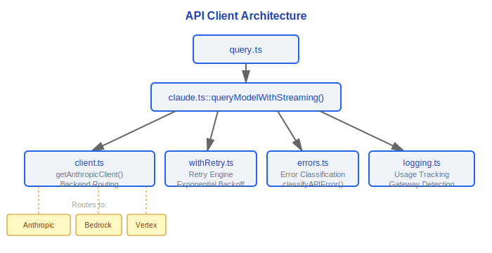
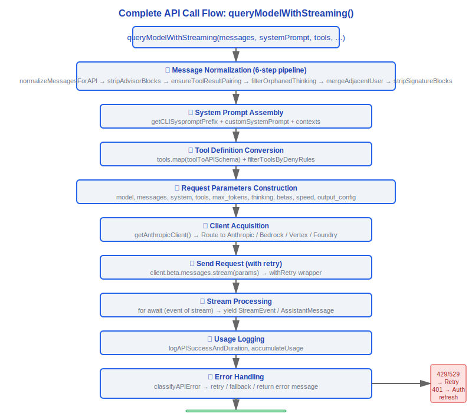

# API 客户端 - API Client Layer

> 源文件: `src/services/api/client.ts` (389 行), `src/services/api/claude.ts` (3419 行),
> `src/services/api/withRetry.ts` (822 行), `src/services/api/errors.ts` (1207 行),
> `src/services/api/logging.ts` (788 行)

---

## 1. 架构概览

API 客户端层负责与 Claude API 的所有通信，包括多后端路由、流式传输、错误处理、重试策略和日志记录。



---

## 2. client.ts — 客户端工厂 (389 行)

### 2.1 getAnthropicClient() 工厂

```typescript
export async function getAnthropicClient({
  apiKey,
  maxRetries,
  model,
  fetchOverride,
  source,
}: {
  apiKey?: string
  maxRetries: number
  model?: string
  fetchOverride?: ClientOptions['fetch']
  source?: string
}): Promise<Anthropic>
```

### 2.2 四种后端

| 后端 | 触发条件 | 认证方式 |
|------|----------|----------|
| **Anthropic Direct** | 默认（ANTHROPIC_API_KEY 或 OAuth） | API Key / OAuth Token |
| **AWS Bedrock** | `CLAUDE_CODE_USE_BEDROCK=true` | AWS credentials (IAM/STS) |
| **Google Vertex AI** | `CLAUDE_CODE_USE_VERTEX=true` | GCP credentials (google-auth-library) |
| **Azure Foundry** | `ANTHROPIC_FOUNDRY_RESOURCE` 或 `ANTHROPIC_FOUNDRY_BASE_URL` | API Key / DefaultAzureCredential |

#### 设计理念：为什么需要4种后端而不是统一API？

- **企业合规驱动**：Anthropic Direct 是默认路径；Bedrock/Vertex/Foundry 满足企业合规需求（数据不离开 AWS/GCP/Azure）。许多企业客户的安全策略要求 API 调用不出云边界，这三种后端是市场需求的直接映射。
- **策略模式的经典应用**：抽象层 `getAnthropicClient()` 让上层代码（如 `claude.ts::queryModelWithStreaming()`）完全不感知后端差异。源码中 `getAnthropicClient()` 根据环境变量（`CLAUDE_CODE_USE_BEDROCK`/`CLAUDE_CODE_USE_VERTEX`/`ANTHROPIC_FOUNDRY_RESOURCE`）选择后端，返回统一的 `Anthropic` SDK 实例。上层只调用 `client.beta.messages.stream(params)`，无需关心底层是哪个云。
- **认证复杂度隔离**：每种后端有完全不同的认证方式——API Key、IAM/STS、GCP OAuth (`google-auth-library`)、Azure DefaultAzureCredential。如果不在工厂层统一，认证逻辑会向上传播污染 query 逻辑。源码证据：`client.ts:88` 的 `getAnthropicClient()` 内部处理了所有认证差异，包括 OAuth token 刷新 (`checkAndRefreshOAuthTokenIfNeeded`)、API Key Helper (`getApiKeyFromApiKeyHelper`)、AWS region 路由等。
- **可扩展性**：新增后端只需在工厂函数中添加一个分支，不影响 `claude.ts` 中 3400+ 行的核心逻辑。

### 2.3 后端环境变量矩阵

**Anthropic Direct**:
- `ANTHROPIC_API_KEY` — API 密钥
- OAuth tokens via `getClaudeAIOAuthTokens()`

**AWS Bedrock**:
- AWS credentials via aws-sdk defaults
- `AWS_REGION` / `AWS_DEFAULT_REGION` — 区域（默认 us-east-1）
- `ANTHROPIC_SMALL_FAST_MODEL_AWS_REGION` — 小模型区域覆盖

**Google Vertex AI**:
- `ANTHROPIC_VERTEX_PROJECT_ID` — GCP 项目 ID
- `CLOUD_ML_REGION` — 默认区域
- Model-specific region variables:
  - `VERTEX_REGION_CLAUDE_3_5_HAIKU`
  - `VERTEX_REGION_CLAUDE_HAIKU_4_5`
  - `VERTEX_REGION_CLAUDE_3_5_SONNET`
  - `VERTEX_REGION_CLAUDE_3_7_SONNET`
- 区域优先级: model-specific env → CLOUD_ML_REGION → config default → us-east5

**Azure Foundry**:
- `ANTHROPIC_FOUNDRY_RESOURCE` — Azure 资源名
- `ANTHROPIC_FOUNDRY_BASE_URL` — 完整 base URL
- `ANTHROPIC_FOUNDRY_API_KEY` — API Key
- DefaultAzureCredential fallback

### 2.4 公共特性

- **User-Agent**: `getUserAgent()` 生成标准 UA 字符串
- **代理支持**: `getProxyFetchOptions()` 处理 HTTP/HTTPS 代理
- **OAuth 刷新**: 自动检测 OAuth token 过期并刷新 (`checkAndRefreshOAuthTokenIfNeeded`)
- **API Key Helper**: 支持外部 helper 程序获取密钥 (`getApiKeyFromApiKeyHelper`)
- **Debug 日志**: 当 `isDebugToStdErr()` 时启用 SDK 详细日志到 stderr

---

## 3. claude.ts — 核心 API 调用 (3419 行)

### 3.1 queryModelWithStreaming() — 完整签名

这是整个系统中最关键的函数，负责将内部消息格式转换为 API 请求并处理流式响应。

```typescript
export async function* queryModelWithStreaming(
  messages: Message[],
  systemPrompt: SystemPrompt,
  tools: Tools,
  model: string,
  permissionContext: ToolPermissionContext,
  options: {
    thinkingConfig: ThinkingConfig
    queryTracking?: QueryChainTracking
    mcpClients?: MCPServerConnection[]
    mcpResources?: Record<string, ServerResource[]>
    agentDefinitions?: AgentDefinitionsResult
    maxOutputTokensOverride?: number
    skipCacheWrite?: boolean
    taskBudget?: { total: number; remaining?: number }
    querySource?: QuerySource
    fetchOverride?: ClientOptions['fetch']
    customSystemPrompt?: string
    appendSystemPrompt?: string
    agentId?: string
    outputConfig?: BetaOutputConfig
  },
): AsyncGenerator<StreamEvent | AssistantMessage | SystemAPIErrorMessage>
```

### 3.2 消息标准化 6 步管线

在发送 API 请求前，消息经过 6 步标准化：

1. **normalizeMessagesForAPI** — 过滤系统消息、本地命令消息，标准化消息格式
2. **stripAdvisorBlocks** — 移除 advisor 块
3. **stripCallerFieldFromAssistantMessage** — 移除助手消息中的 caller 字段
4. **stripToolReferenceBlocksFromUserMessage** — 移除用户消息中的工具引用块
5. **ensureToolResultPairing** — 确保每个 tool_use 都有对应的 tool_result
6. **stripSignatureBlocks** — 移除签名块
7. **normalizeContentFromAPI** — API 响应内容标准化

#### 设计理念：为什么消息标准化需要多步管线而不是一步到位？

每步解决一个独立的问题域，且步骤间存在因果依赖关系：

- **`reorderAttachmentsForAPI`**（源码 `messages.ts:1481`）：Bedrock 要求附件在引用文本之前——这是后端协议约束，与消息内容无关。
- **`stripAdvisorBlocks`**：内部功能块（如 advisor 注入的指导内容）不应发给 API——这是安全边界，防止内部实现细节泄漏到模型上下文。
- **`ensureToolResultPairing`**：API 协议要求每个 `tool_use` 必须有对应的 `tool_result`，否则返回 400 错误——这是 Claude API 的硬性协议约束。
- **`filterOrphanedThinkingOnlyMessages`**（源码 `messages.ts:2307-2310` 注释）：压缩（compaction）可能切断 thinking 块与 body 的关联，产生孤立的纯 thinking 助手消息。源码注释明确指出这是"compaction slicing away intervening messages"的副作用修复。
- **`mergeAdjacentUserMessages`**（源码 `messages.ts:2327-2338`）：前面的过滤步骤（如移除虚拟消息、orphaned thinking 过滤）可能产生连续 user 消息，违反 API 的 user/assistant 交替规则——这是前序步骤副作用的修复。

源码 `messages.ts:2318-2320` 中的注释坦率承认了这种设计的脆弱性："These multi-pass normalizations are inherently fragile -- each pass can create conditions a prior pass was meant to handle."但管线设计的收益在于每步可以独立测试和演化，添加新步骤（如 `smooshSystemReminderSiblings`）不影响现有步骤。

### 3.3 系统提示组装

系统提示由多个层次组装：


### 3.4 Betas 管理

```typescript
const betas = getMergedBetas(
  getModelBetas(model),                    // 模型特定 betas
  getBedrockExtraBodyParamsBetas(),        // Bedrock 额外参数
  sdkBetas,                                // SDK 传入的 betas
)
```

常用 betas:
- `interleaved-thinking-2025-05-14` — 交错思维
- `output-128k-2025-02-19` — 128K 输出
- `task-budgets-2026-03-13` — 任务预算
- `prompt-caching-2024-07-31` — 提示缓存
- `pdfs-2024-09-25` — PDF 支持
- `tool-search-2025-04-15` — 工具搜索
- `afk-mode-2025-03-13` — AFK 模式

### 3.5 缓存控制 (Prompt Caching)

```typescript
export function getCacheControl(
  scope?: CacheScope,
): { type: 'ephemeral'; ttl?: number } | undefined
```

- **TTL**: 1 小时 (`3600` 秒) — 对符合条件的用户
- **条件**: `isFirstPartyAnthropicBaseUrl()` 且非第三方网关
- **Scope**: `'global'` scope 选项用于跨用户缓存（系统提示一致时）
- **缓存策略**: `GlobalCacheStrategy = 'tool_based' | 'system_prompt' | 'none'`

### 3.6 请求参数

```typescript
const requestParams: BetaMessageStreamParams = {
  model,                          // 模型标识
  messages,                       // 标准化后的消息列表
  system,                         // 组装后的系统提示
  tools,                          // 工具定义列表 (toolToAPISchema)
  max_tokens,                     // 最大输出 token
  thinking,                       // 思维配置 (type + budget_tokens)
  betas,                          // Beta 特性列表
  speed,                          // 速度配置（effort level）
  output_config,                  // 输出配置（task_budget 等）
  stream: true,                   // 始终流式传输
  metadata: {                     // 元数据
    user_id,                      // 用户 ID
  },
  headers: {                      // 自定义头部
    'anthropic-attribution': ..., // 归属头部
  },
}
```

### 3.7 getMaxOutputTokensForModel()

```typescript
export function getMaxOutputTokensForModel(model: string): number
```

- Opus 模型: `CAPPED_DEFAULT_MAX_TOKENS` (通常 16384)
- Sonnet 模型 (1M 实验): 可能获得更高限制
- 其他模型: 根据模型配置返回默认值
- 环境变量覆盖: `CLAUDE_CODE_MAX_OUTPUT_TOKENS`
- 最低保底: `FLOOR_OUTPUT_TOKENS = 3000`

---

## 4. withRetry.ts — 重试引擎 (822 行)

### 4.1 常量

```typescript
const DEFAULT_MAX_RETRIES = 10       // 默认最大重试次数
const MAX_529_RETRIES = 3            // 529 过载错误最大重试次数
export const BASE_DELAY_MS = 500     // 基础延迟 500ms
const FLOOR_OUTPUT_TOKENS = 3000     // 输出 token 最低保底
```

### 4.2 持久化重试 (ant-only)

```typescript
const PERSISTENT_MAX_BACKOFF_MS = 5 * 60 * 1000       // 5 分钟最大退避
const PERSISTENT_RESET_CAP_MS = 6 * 60 * 60 * 1000    // 6 小时重置上限
const HEARTBEAT_INTERVAL_MS = 30_000                    // 30 秒心跳间隔
```

启用条件: `CLAUDE_CODE_UNATTENDED_RETRY` 环境变量（ant-only 无人值守会话）。

### 4.3 每种错误类型的重试策略

| 错误类型 | HTTP 码 | 重试策略 | 最大次数 | 备注 |
|----------|---------|----------|----------|------|
| **429 Rate Limit** | 429 | 指数退避 + `retry-after` header | DEFAULT_MAX_RETRIES (10) | 读取 `retry-after` 头部 |
| **529 Overloaded** | 529 | 指数退避 | MAX_529_RETRIES (3) | 仅前台查询源重试 |
| **Connection Error** | N/A | 指数退避 | DEFAULT_MAX_RETRIES (10) | APIConnectionError, timeout |
| **401 Auth Error** | 401 | 刷新 token 后重试 | 1-2 次 | OAuth/AWS/GCP 凭证刷新 |
| **413 Too Long** | 413 | 不重试（交给 reactiveCompact） | 0 | prompt_too_long |
| **500 Server** | 500 | 指数退避 | DEFAULT_MAX_RETRIES | 服务器内部错误 |
| **其他 4xx** | 4xx | 不重试 | 0 | 客户端错误 |

### 4.4 529 前台查询源白名单

只有以下查询源才会重试 529：

```typescript
const FOREGROUND_529_RETRY_SOURCES = new Set<QuerySource>([
  'repl_main_thread',
  'repl_main_thread:outputStyle:custom',
  'repl_main_thread:outputStyle:Explanatory',
  'repl_main_thread:outputStyle:Learning',
  'sdk',
  'agent:custom', 'agent:default', 'agent:builtin',
  'compact',
  'hook_agent', 'hook_prompt',
  'verification_agent',
  'side_question',
  'auto_mode',
  ...(feature('BASH_CLASSIFIER') ? ['bash_classifier'] : []),
])
```

设计原则: 后台任务（摘要、标题、建议、分类器）在容量级联期间不重试 529，因为每次重试产生 3-10x 网关放大，且用户看不到这些失败。

#### 设计理念：为什么529和429区别对待？

- **语义不同**：429 = 用户配额用完，等待不会改善当前配额窗口的情况；529 = 服务器暂时过载，短暂等待就可能恢复。
- **有限重试**：529 只重试 3 次（`MAX_529_RETRIES`），因为持续过载意味着系统性问题，无限重试只会加剧负载。源码 `withRetry.ts:54` 定义了这个常量，`withRetry.ts:335` 处检查 `consecutive529Errors >= MAX_529_RETRIES` 后放弃。
- **前台优先**：后台任务不重试 529（通过 `FOREGROUND_529_RETRY_SOURCES` 白名单控制）。源码 `withRetry.ts:57-61` 的注释明确说明原因："during a capacity cascade each retry is 3-10x gateway amplification, and the user never sees those fail anyway. New sources default to no-retry -- add here only if the user is waiting on the result."这是**级联故障防护**的经典模式——在系统过载时，只为用户可见的前台请求付出重试代价，后台任务静默失败以减轻服务端压力。

### 4.5 特殊错误类型

```typescript
export class CannotRetryError extends Error
// 表示错误不可重试，应立即返回给调用方

export class FallbackTriggeredError extends Error
// 表示应触发模型降级（例如从 Opus 降级到 Sonnet）
```

#### 设计理念：为什么持久化重试(Persistent Retry)是ant-only？

- **无人值守语义**：CI/后台任务需要"永不放弃"语义——任务可能排队数小时，中途因暂时性过载而失败是不可接受的。源码 `withRetry.ts:91-93` 注释："CLAUDE_CODE_UNATTENDED_RETRY: for unattended sessions (ant-only). Retries 429/529 indefinitely with higher backoff and periodic keep-alive yields so the host environment does not mark the session idle mid-wait."
- **不对外暴露**：公开此功能会导致用户滥用（配置永不放弃的重试），在服务器过载期间大量客户端不断重试会加剧服务端压力，形成正反馈死循环。
- **30秒心跳**：`HEARTBEAT_INTERVAL_MS = 30_000`（源码 `withRetry.ts:98`）确保长时间等待期间连接不被主机环境判定为空闲而被杀死。心跳通过 yield `SystemAPIErrorMessage` 实现——这是一个临时方案，源码注释标注了 TODO 需要专用 keep-alive 通道。
- **6小时重置**：`PERSISTENT_RESET_CAP_MS = 6 * 60 * 60 * 1000`（源码 `withRetry.ts:97`）防止退避时间无限增长，6小时后重置退避计时器，避免在服务恢复后仍等待不合理的长时间。

#### 设计理念：为什么网关检测很重要？

- **缓存兼容性**：第三方网关（LiteLLM/Helicone/Portkey 等）可能不支持 Prompt Caching TTL。源码中 `getCacheControl()` 会检查 `isFirstPartyAnthropicBaseUrl()`，只有直连 Anthropic 才设置 TTL=3600s。经过网关的请求可能忽略或错误处理缓存头。
- **错误消息定制**：网关可能修改响应格式或添加自己的错误包装，错误解析逻辑需要知道响应是否经过了网关，以正确提取原始错误信息。
- **遥测区分**：`logging.ts:274` 和 `logging.ts:641` 处通过 `detectGateway()` 检测网关类型并记入遥测，用于诊断"缓存命中率突降是因为用户切换了网关"等问题。检测基于响应头前缀（如 `x-litellm-*`、`helicone-*`）和主机名后缀（如 `*.databricks.com`），这是一种无侵入的被动检测方式。

### 4.6 Fast Mode 集成

- **Fast Mode Cooldown**: 429/529 触发 `triggerFastModeCooldown`，临时切换回标准模型
- **Overage Rejection**: API 返回 overage 拒绝时 `handleFastModeOverageRejection`
- **isFastModeCooldown**: 检查是否在冷却期

### 4.7 退避策略

```typescript
// 基础延迟: BASE_DELAY_MS * 2^attempt
// 抖动: ±50% randomization
// 429 特殊: 使用 retry-after header 值（如果有）
// 持久化模式: 最大退避 5 分钟，6 小时后重置
```

---

## 5. errors.ts — 错误分类 (1207 行)

### 5.1 classifyAPIError()

```typescript
export function classifyAPIError(error: unknown): APIErrorClassification
```

分类维度:
- **isRetryable**: 是否可重试
- **isRateLimit**: 是否为限流
- **isOverloaded**: 是否为过载
- **isAuthError**: 是否为认证错误
- **isPromptTooLong**: 是否为提示过长
- **isMediaSizeError**: 是否为媒体大小错误
- **category**: 错误大类（`rate_limit`/`overloaded`/`auth`/`prompt_too_long`/`connection`/`server`/`client`/`unknown`）

### 5.2 parsePromptTooLongTokenCounts()

```typescript
export function parsePromptTooLongTokenCounts(rawMessage: string): {
  actualTokens: number | undefined
  limitTokens: number | undefined
}
```

解析 API 错误消息中的 token 数: `"prompt is too long: 137500 tokens > 135000 maximum"` → `{ actualTokens: 137500, limitTokens: 135000 }`

容错设计: 支持 SDK 前缀包装、JSON 信封、大小写差异 (Vertex 返回不同格式)。

### 5.3 isMediaSizeError()

检测图像/PDF 大小超限错误:
- `API_PDF_MAX_PAGES` — PDF 最大页数
- `PDF_TARGET_RAW_SIZE` — PDF 目标原始大小
- `ImageSizeError` / `ImageResizeError` — 图像尺寸/调整大小错误

### 5.4 限流消息处理

```typescript
export function getRateLimitErrorMessage(limits: ClaudeAILimits): string
```

- 读取 Claude.ai 订阅限制
- 根据 quota status (从 headers/error 中提取) 生成用户友好消息
- 区分 Pro/Team/Enterprise 订阅等级

### 5.5 REPEATED_529_ERROR_MESSAGE

当 529 错误重试用尽后显示的特殊消息:

```typescript
export const REPEATED_529_ERROR_MESSAGE = '...'
```

### 5.6 categorizeRetryableAPIError()

用于 QueryEngine 层级的错误分类，决定是否重试整个查询:

```typescript
export function categorizeRetryableAPIError(error: unknown): {
  shouldRetry: boolean
  errorMessage: string
  userMessage?: string
}
```

---

## 6. logging.ts — API 日志与遥测 (788 行)

### 6.1 logAPIQuery()

在 API 请求发送前记录:
- 请求参数（模型、消息数、工具数）
- Token 估算
- 查询来源

### 6.2 logAPISuccessAndDuration()

在 API 响应成功后记录:
- 持续时间 (ms)
- 使用量 (input/output/cache tokens)
- 停止原因 (stop_reason)
- 模型实际使用
- 网关检测

### 6.3 Usage 追踪

```typescript
export type NonNullableUsage = {
  input_tokens: number
  output_tokens: number
  cache_creation_input_tokens: number
  cache_read_input_tokens: number
}

export const EMPTY_USAGE: NonNullableUsage = {
  input_tokens: 0,
  output_tokens: 0,
  cache_creation_input_tokens: 0,
  cache_read_input_tokens: 0,
}
```

### 6.4 GlobalCacheStrategy

```typescript
export type GlobalCacheStrategy = 'tool_based' | 'system_prompt' | 'none'
```

- `tool_based`: 在工具定义上设置 cache_control
- `system_prompt`: 在系统提示最后一个 block 上设置 cache_control
- `none`: 不设置缓存控制

### 6.5 网关检测指纹

系统通过响应头自动检测 AI 网关代理:

```typescript
type KnownGateway =
  | 'litellm'
  | 'helicone'
  | 'portkey'
  | 'cloudflare-ai-gateway'
  | 'kong'
  | 'braintrust'
  | 'databricks'
```

检测方式:

| 网关 | 检测方式 | 头部前缀 |
|------|----------|----------|
| LiteLLM | 响应头 | `x-litellm-*` |
| Helicone | 响应头 | `helicone-*` |
| Portkey | 响应头 | `x-portkey-*` |
| Cloudflare AI Gateway | 响应头 | `cf-aig-*` |
| Kong | 响应头 | `x-kong-*` |
| Braintrust | 响应头 | `x-bt-*` |
| Databricks | 主机名后缀 | `*.databricks.com` |

网关检测用于:
- 遥测标记（区分直连 vs 网关）
- 缓存控制决策（第三方网关可能不支持 TTL 缓存）
- 错误消息定制

---

## 7. 完整 API 调用流程



---

## 8. API 目录其他文件

| 文件 | 行数 | 用途 |
|------|------|------|
| `dumpPrompts.ts` | - | 请求 dump（调试用，每次 query session 创建一次 closure） |
| `emptyUsage.ts` | - | 空 Usage 常量 |
| `errorUtils.ts` | - | 错误格式化工具（`formatAPIError`, `extractConnectionErrorDetails`） |
| `filesApi.ts` | - | 文件 API（上传/下载） |
| `firstTokenDate.ts` | - | 首 token 日期追踪 |
| `grove.ts` | - | Grove API 集成 |
| `metricsOptOut.ts` | - | 遥测 opt-out |
| `overageCreditGrant.ts` | - | 超额信用授予 |
| `promptCacheBreakDetection.ts` | - | 缓存中断检测（压缩/微压缩通知） |
| `referral.ts` | - | 推荐系统 |
| `sessionIngress.ts` | - | 会话入口追踪 |
| `ultrareviewQuota.ts` | - | Ultra review 配额 |
| `usage.ts` | - | 使用量 API |
| `adminRequests.ts` | - | 管理请求 |
| `bootstrap.ts` | - | API 层引导 |

---

## 工程实践指南

### 调试 API 调用

当 API 调用行为异常（返回意外错误、响应格式不对、缓存未命中等）时：

1. **启用 debug 日志** — `isDebugToStdErr()` 为 true 时，SDK 详细日志输出到 stderr，包括完整的请求头和响应头
2. **检查 `dumpPrompts` 输出** — `services/api/dumpPrompts.ts` 可以 dump 每次请求的完整消息列表，用于确认发送给 API 的内容是否符合预期
3. **检查消息标准化** — 如果 API 返回 400 错误，在 `normalizeMessagesForAPI` 的每步之后打印消息状态，定位哪一步引入了问题（如连续 user 消息、缺失 tool_result 等）
4. **检查请求参数** — 在 `queryModelWithStreaming()` 的 `requestParams` 构建处设断点，确认 `model`、`max_tokens`、`thinking`、`betas` 等参数正确

### 添加新的 API 后端

如果需要支持新的云服务商或 API 网关：

1. **在 `client.ts` 的 `getAnthropicClient()` 中添加新分支** — 基于环境变量（如 `CLAUDE_CODE_USE_NEWBACKEND=true`）触发
2. **实现认证逻辑** — 每种后端有不同的认证方式（API Key、OAuth、IAM 等），在工厂函数内部处理认证差异
3. **添加对应的环境变量** — 参考现有后端的环境变量命名规范（如 `ANTHROPIC_*` 前缀）
4. **处理区域路由**（如需要）— Vertex 的区域路由取决于模型（`VERTEX_REGION_CLAUDE_*` 变量），新后端可能有类似需求
5. **注册 betas** — 如果新后端需要特定的 beta 特性，在 `getMergedBetas()` 中注册
6. **添加网关检测**（如需要）— 在 `logging.ts` 的网关检测指纹中添加新后端的响应头模式

**关键原则**：上层代码（`claude.ts`）不应感知后端差异。`getAnthropicClient()` 返回统一的 `Anthropic` SDK 实例，所有后端特定逻辑封装在工厂内部。

### 调试 429/529 错误

区分两种过载场景并采取不同策略：

| 错误码 | 含义 | 诊断方法 | 处理建议 |
|--------|------|----------|----------|
| **429** | 用户配额用完 | 检查 `retry-after` header；检查订阅等级（Pro/Team/Enterprise） | 等待配额窗口重置，或升级订阅 |
| **529** | 服务器暂时过载 | 检查是否为前台查询（`FOREGROUND_529_RETRY_SOURCES`）；检查 `consecutive529Errors` 计数 | 最多重试 3 次后放弃；后台任务不重试 |

**进一步调试**：
- 检查 `FOREGROUND_529_RETRY_SOURCES` 是否包含你的 `querySource` — 如果不在白名单中，529 不会重试
- 检查 Fast Mode Cooldown — 429/529 可能触发 `triggerFastModeCooldown`，临时切换回标准模型
- 持久化重试（ant-only）— `CLAUDE_CODE_UNATTENDED_RETRY` 启用无限重试，但仅限内部无人值守会话

### 消息标准化调试

6 步消息标准化管线中，每步可能引入问题或修复前序步骤的副作用：

1. **`normalizeMessagesForAPI`** — 过滤系统消息、本地命令消息
2. **`stripAdvisorBlocks`** — 移除 advisor 块（安全边界）
3. **`ensureToolResultPairing`** — 确保 tool_use/tool_result 配对（API 协议要求）
4. **`filterOrphanedThinkingOnlyMessages`** — 移除压缩后的孤立 thinking 消息
5. **`mergeAdjacentUserMessages`** — 合并前序步骤可能产生的连续 user 消息
6. **`stripSignatureBlocks`** — 移除签名块

**调试技巧**：在每步之后打印 `messages.length` 和 `messages.map(m => m.role)` 的摘要，快速定位哪一步改变了消息结构。如果 API 返回 "messages: roles must alternate" 错误，重点检查步骤 4 和 5。

### 缓存调试

当缓存命中率低于预期时：

1. **检查 `getCacheControl()` 返回值** — 只有直连 Anthropic（`isFirstPartyAnthropicBaseUrl()`）时才设置 TTL=3600s；通过第三方网关的请求不设置 TTL
2. **检查 `GlobalCacheStrategy`** — `'tool_based'`（在工具定义上设置 cache_control）、`'system_prompt'`（在系统提示最后一个 block 上设置）、`'none'`
3. **检查网关检测** — `detectGateway()` 通过响应头检测网关类型；如果使用了 LiteLLM/Helicone 等网关，缓存控制可能被网关修改或忽略
4. **检查缓存中断检测** — `promptCacheBreakDetection.ts` 检测压缩/微压缩是否打断了缓存。频繁压缩会导致缓存前缀变化，降低命中率

### 常见陷阱

1. **不要绕过 `withRetry` 直接调用 API** — retry/fallback/cooldown/heartbeat 逻辑都在 `withRetry.ts` 中。直接调用 `client.beta.messages.stream()` 会跳过所有错误恢复机制，在 429/529/连接错误时直接失败

2. **新增 beta 特性时确保在 `getMergedBetas` 中注册** — `betas` 列表通过 `getMergedBetas()` 合并模型特定 betas、Bedrock 额外参数和 SDK betas。如果新 beta 没有注册，API 会忽略对应功能

3. **Vertex 的区域路由取决于模型** — 不同模型可能路由到不同区域（`VERTEX_REGION_CLAUDE_3_5_HAIKU` vs `VERTEX_REGION_CLAUDE_3_7_SONNET`），添加新模型支持时需要确认区域配置

4. **不要假设 OAuth token 永远有效** — `checkAndRefreshOAuthTokenIfNeeded()` 在每次 API 调用前检查 token 过期。如果自定义代码缓存了 `Anthropic` 客户端实例，长时间后 token 可能过期

5. **413 错误不在 `withRetry` 中重试** — `prompt_too_long` 错误交给 `query.ts` 中的 `reactiveCompact` 处理。`withRetry` 只做网络层重试，语义层错误（如上下文过长）需要上层处理

6. **`CannotRetryError` 立即终止重试循环** — 如果你的错误处理代码抛出 `CannotRetryError`，`withRetry` 会立即停止重试并将错误返回给调用方。只在确认不可恢复时使用


---

[← 查询引擎](../03-查询引擎/query-engine.md) | [目录](../README.md) | [工具系统 →](../05-工具系统/tool-system.md)
