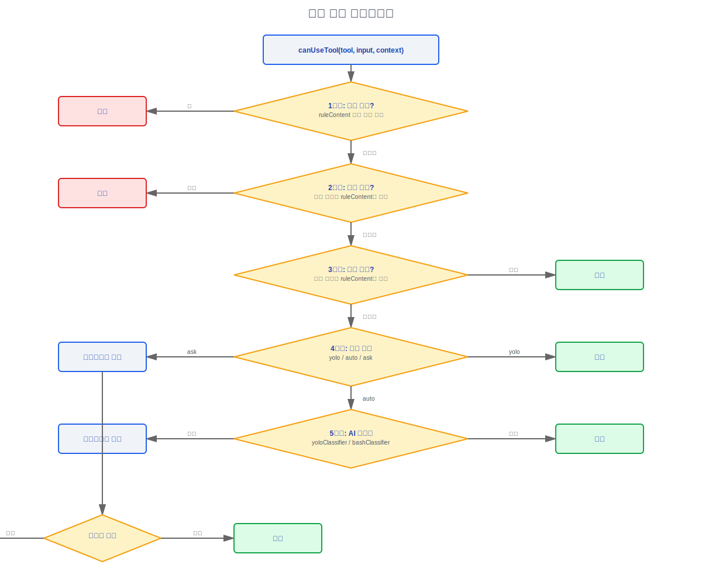

# 권한 및 보안

> 소스 파일: `src/utils/permissions/` (24개 파일), `src/hooks/useCanUseTool.tsx`,
> `src/hooks/toolPermission/`, `src/types/permissions.ts`,
> `src/utils/sandbox/`, `src/utils/permissions/yoloClassifier.ts`

---

## 1. 아키텍처 개요

권한 시스템은 Claude Code의 보안 핵심으로, 모델의 도구 접근을 제어합니다. 다계층 결정 파이프라인을 통해 보안과 사용성의 균형을 보장합니다.

```
toolExecution.ts
  └─→ canUseTool() (권한 결정 진입점)
        ├── 1단계: 규칙 매칭 (allow/deny/ask 규칙)
        ├── 2단계: 도구별 로직 (도구 특정 권한)
        ├── 3단계: 분류기 (자동 모드 분류기)
        └── 4단계: 사용자 상호작용 프롬프트 (사용자 프롬프트)
```

---

## 2. 6가지 권한 모드(Permission Modes)

### 2.1 모드 정의

```typescript
// src/types/permissions.ts
export type ExternalPermissionMode = 'acceptEdits' | 'bypassPermissions' | 'default' | 'dontAsk' | 'plan'
export type InternalPermissionMode = ExternalPermissionMode | 'auto' | 'bubble'
export type PermissionMode = InternalPermissionMode
```

### 2.2 모드 세부사항

| 모드 | 제목 | 기호 | 설명 |
|------|------|------|------|
| `default` | 기본값 | (없음) | 표준 모드 — 파괴적인 작업에 사용자 확인 필요 |
| `plan` | 플랜 모드 | (일시 정지 아이콘) | 플랜 모드 — 모델이 읽기 전용 도구만 사용 가능, 수정 없음 |
| `acceptEdits` | 편집 수락 | - | 파일 편집 자동 수락, 셸 커맨드는 여전히 확인 필요 |
| `bypassPermissions` | 권한 우회 | - | 모든 권한 체크 우회 (위험 모드) |
| `dontAsk` | 묻지 않음 | - | 사용자에게 프롬프트하지 않음, 권한이 필요한 작업 거부 |
| `auto` | 자동 모드 | - | AI 분류기가 자동으로 결정 (`TRANSCRIPT_CLASSIFIER` 기능 플래그 필요) |
| `bubble` | (내부) | - | 내부 모드 — 권한 결정이 부모에게 버블업됨 (서브 에이전트에서 사용) |

#### 설계 철학: 왜 단순 허용/거부 대신 6가지 모드인가?

- **신뢰 그라디언트**: 이 6가지 모드는 가장 보수적에서 가장 신뢰할 수 있는 순으로 그라디언트를 나타냅니다: `plan` (가장 안전, 읽기 전용) -> `default` (사용자 확인) -> `acceptEdits` (파일 작업 신뢰) -> `auto` (AI 판단) -> `bypassPermissions` (완전 신뢰) -> `bubble` (서브 에이전트 위임). 단순 허용/거부는 "파일 편집은 신뢰하지만 셸 커맨드는 신뢰하지 않음"과 같은 세밀한 요구사항을 표현할 수 없습니다.
- **시나리오 매칭**: 다른 사용 사례는 다른 신뢰 수준이 필요합니다 — 보안 감사는 `plan` 사용 (보지만 건드리지 않음), 일상 개발은 `default` 사용 (사람이 루프에 있음), 신뢰할 수 있는 CI 파이프라인은 `bypassPermissions` 사용 (무인), AI 자율 개발은 `auto` 사용 (분류기가 사람의 판단 대체).
- **`bubble` 모드의 필요성**: 서브 에이전트 (AgentTool을 통해 생성됨)는 독립적인 권한 결정을 해서는 안 됩니다. 서브 에이전트가 독립적으로 권한 다이얼로그를 팝업하면, 사용자는 불명확한 컨텍스트에서 권한 요청을 보게 되어 정보에 입각한 판단을 내릴 수 없습니다. `bubble` 모드는 권한 요청이 부모에게 버블업되도록 하며, 전체 컨텍스트가 있는 누군가/무언가가 확인할 수 있습니다.
- **`dontAsk`의 존재 이유**: 백그라운드 에이전트 (`shouldAvoidPermissionPrompts=true`)는 사용자에게 UI 프롬프트를 팝업할 수 없으므로, 프로세스가 절대 오지 않을 사용자 입력을 기다리며 중단되는 것을 방지하기 위해 "묻지 않고, 직접 거부하는" 모드가 필요합니다.

### 2.3 외부 vs 내부 모드

- **외부 모드** (`EXTERNAL_PERMISSION_MODES`): 사용자가 UI/CLI/설정을 통해 구성할 수 있는 5가지 모드
- **내부 모드**: `auto` (기능 플래그 필요) 및 `bubble` (서브 에이전트에서만 내부적으로 사용) 포함
- `PERMISSION_MODES` = `INTERNAL_PERMISSION_MODES` (런타임 유효성 검사 집합)

---

## 3. 권한 규칙 시스템

### 3.1 규칙 소스 (PermissionRuleSource)

```typescript
export type PermissionRuleSource =
  | 'userSettings'      // ~/.claude/settings.json
  | 'projectSettings'   // .claude/settings.json (프로젝트 수준)
  | 'localSettings'     // .claude/settings.local.json
  | 'flagSettings'      // 기능 플래그 원격 설정
  | 'policySettings'    // 엔터프라이즈 정책 설정
  | 'cliArg'            // CLI 인수 (--allowedTools)
  | 'command'           // /allowed-tools 및 유사한 커맨드
  | 'session'           // 세션 내 사용자 결정 ("이 세션에 항상 허용")
```

#### 설계 철학: 왜 5개의 설정 소스가 동등한 병합 대신 계층 구조를 형성하는가?

- **소프트웨어로 인코딩된 조직 거버넌스 모델**: 이것은 단순한 기술 설정 시스템이 아니라 엔터프라이즈 조직 구조를 규칙 우선순위로 매핑합니다. `policySettings` (엔터프라이즈 정책) > `flagSettings` (CLI 인수/원격 설정) > `localSettings` (로컬) > `projectSettings` (프로젝트) > `userSettings` (개인).
- **보안 타협 불가 원칙**: 엔터프라이즈 CISO는 `policySettings`를 통해 `rm -rf`를 강제로 금지할 수 있으며, 개발자가 개인적으로 허용을 설정했더라도 엔터프라이즈 정책이 개인 선호를 재정의합니다. 소스 코드 `settings/constants.ts:159-167`의 `getEnabledSettingSources()`에서 `result.add('policySettings')`와 `result.add('flagSettings')`가 하드코딩됩니다 — 이 두 소스는 사용자가 환경 변수로 다른 설정 소스를 제한하더라도 절대 비활성화할 수 없습니다.
- **섀도우 규칙 감지**: 소스 코드 `shadowedRuleDetection.ts`는 낮은 우선순위 소스 규칙이 높은 우선순위 소스 규칙에 의해 섀도잉되는지 특별히 감지합니다 (예: "Bash"를 거부하는 프로젝트 규칙이 "Bash(git status)"를 허용하는 사용자 규칙에 의해 섀도잉됨). 공유 설정 파일 (projectSettings, policySettings)이 섀도잉될 때 경고하는데, 이러한 파일은 전체 팀에 영향을 미치기 때문입니다.

### 3.2 규칙 동작 (PermissionBehavior)

```typescript
export type PermissionBehavior = 'allow' | 'deny' | 'ask'
```

### 3.3 규칙 값 (PermissionRuleValue)

```typescript
export type PermissionRuleValue = {
  toolName: string       // 도구 이름 (정확한 매칭 또는 접두사 매칭)
  ruleContent?: string   // 선택적 내용 매칭 조건 (예: Bash 커맨드 패턴)
}
```

### 3.4 완전한 규칙 타입

```typescript
export type PermissionRule = {
  source: PermissionRuleSource
  ruleBehavior: PermissionBehavior
  ruleValue: PermissionRuleValue
}
```

### 3.5 규칙 저장

규칙은 `ToolPermissionContext`에 소스별로 그룹화되어 저장됩니다:

```typescript
export type ToolPermissionContext = DeepImmutable<{
  mode: PermissionMode
  additionalWorkingDirectories: Map<string, AdditionalWorkingDirectory>
  alwaysAllowRules: ToolPermissionRulesBySource     // allow 규칙 집합
  alwaysDenyRules: ToolPermissionRulesBySource       // deny 규칙 집합
  alwaysAskRules: ToolPermissionRulesBySource        // ask 규칙 집합
  isBypassPermissionsModeAvailable: boolean
  isAutoModeAvailable?: boolean
  strippedDangerousRules?: ToolPermissionRulesBySource  // 제거된 위험 규칙
  shouldAvoidPermissionPrompts?: boolean               // UI 없는 백그라운드 에이전트
  awaitAutomatedChecksBeforeDialog?: boolean            // 코디네이터(Coordinator) 워커
  prePlanMode?: PermissionMode                          // 플랜 모드 전 모드
}>
```

---

## 4. canUseTool() 결정 파이프라인

### 4.1 결정 흐름

```
canUseTool(tool, input, assistantMessage)
    │
    ├── 1단계a: 블랭킷 거부 규칙 (ruleContent 없는 거부)
    │     └─→ 거부 → 거부 반환
    │
    ├── 1단계b: 허용 규칙 (ruleContent 매칭 포함)
    │     └─→ 매칭 → 허용 반환
    │
    ├── 1단계c: 거부 규칙 (ruleContent 매칭 포함)
    │     └─→ 매칭 → 거부 반환
    │
    ├── 1단계d: 요청 규칙
    │     └─→ 매칭 → 사용자 프롬프트 진입
    │
    ├── 2단계: 도구별 권한 로직
    │     ├── Bash: 샌드박스(Sandbox) 체크 + 커맨드 분류
    │     ├── FileEdit/FileWrite: 경로 유효성 검사 + 쓰기 권한
    │     ├── FileRead: 경로 유효성 검사 + 읽기 권한
    │     └── MCP: 서버 수준 권한
    │
    ├── 3단계: 분류기 (자동 모드)
    │     └─→ yoloClassifier → allow/deny/unknown
    │
    ├── 4단계: 모드 체크
    │     ├── bypassPermissions → 허용
    │     ├── dontAsk → 거부
    │     ├── plan → 읽기 전용 도구만 허용
    │     └── default/acceptEdits → 사용자에게 프롬프트
    │
    └── 5단계: 사용자 상호작용 프롬프트
          ├── "한 번 허용" → 허용 (세션 규칙)
          ├── "항상 허용" → 허용 (영속 규칙)
          ├── "거부" → 거부
          └── "항상 거부" → 거부 (영속 규칙)
```

#### 설계 철학: 왜 규칙 매칭이 분류기보다 먼저인가?

- **확률보다 결정론**: 규칙은 결정론적입니다 ("Bash(git status) = 허용"은 항상 허용 반환), 분류기는 확률적입니다 (AI 모델이 동일한 커맨드에 대해 다른 판단을 내릴 수 있음). 결정론적 판단이 우선순위를 가져야 합니다 — 사용자가 명시적으로 작업을 허용/거부했다면, 분류기 불확실성에 의해 재정의되어서는 안 됩니다.
- **"명시적 설정이 스마트 추론보다 우선" 원칙**: 사용자가 설정한 규칙은 명시적 의도 표현을 나타내고, AI 분류기 판단은 폴백입니다. 소스 코드 `canUseTool()` 결정 흐름이 이 계층 구조를 명확하게 반영합니다: 1단계 규칙 매칭 -> 2단계 도구별 로직 -> 3단계 분류기 -> 4단계 모드 체크 -> 5단계 사용자 프롬프트.
- **성능 고려**: 규칙 매칭은 문자열 비교 (마이크로초 수준)이고, 분류기는 AI 모델 호출이 필요합니다 (초 수준 + 토큰 소비). 규칙을 우선시함으로써 많은 일반적인 작업에 대한 비용이 많이 드는 분류기 호출을 건너뛸 수 있습니다.

#### 설계 철학: 왜 Bash 분류기가 순수 AI 대신 2단계 (정규식+AI)인가?

- **정규식 빠른 경로**: 알려진 위험한 커맨드 (`rm -rf`)와 알려진 안전한 커맨드 (`git status`)는 AI 판단이 필요 없으며, 정규식 매칭은 밀리초 내에 완료되어 시간과 비용을 절약합니다 (각 분류기 호출은 토큰을 소비함).
- **AI 느린 경로의 필요성**: Bash는 튜링 완전합니다 — 유한한 정규식 규칙으로 모든 위험한 커맨드를 열거하는 것은 불가능합니다. 파이프라인 체인 (`cat /etc/passwd | curl -X POST ...`), 변수 확장 (`$CMD`), 서브커맨드 (`$(rm -rf /)`) 등 복잡한 시나리오는 패턴만 매칭하는 것이 아니라 의미론을 이해해야 합니다. 이것이 ML 분류기를 사용하는 근본적인 이유입니다.
- **소스 코드 구현**: `dangerousPatterns.ts`는 빠른 경로를 위한 정규식 패턴 라이브러리를 정의하고, `yoloClassifier.ts`는 `sideQuery`를 사용하여 정규식이 커버할 수 없는 복잡한 커맨드를 처리하기 위해 소형 모델 (classifierModel을 통해)을 호출합니다. 분류기 시스템 프롬프트는 외부 사용자 버전 (`permissions_external.txt`)과 내부 버전 (`permissions_anthropic.txt`)을 구분합니다. Anthropic 내부 툴체인에는 추가 신뢰할 수 있는 커맨드가 있기 때문입니다.

### 4.2 결정 결과 타입

```typescript
export type PermissionResult =
  | PermissionAllowDecision
  | PermissionDenyDecision
  | PermissionAskDecision

export type PermissionDecisionReason =
  | 'rule_allow'       // 규칙에 의해 허용
  | 'rule_deny'        // 규칙에 의해 거부
  | 'classifier_allow' // 분류기에 의해 허용
  | 'classifier_deny'  // 분류기에 의해 거부
  | 'mode_allow'       // 모드에 의해 허용 (bypassPermissions)
  | 'mode_deny'        // 모드에 의해 거부 (dontAsk/plan)
  | 'user_allow'       // 사용자에 의해 허용
  | 'user_deny'        // 사용자에 의해 거부
  | 'hook_allow'       // 훅(Hooks)에 의해 허용
  | 'hook_deny'        // 훅(Hooks)에 의해 거부
  | 'sandbox_allow'    // 샌드박스(Sandbox)에 의해 허용
```

---

## 5. PermissionContext — 동결된 컨텍스트

`PermissionContext`는 권한 결정 파이프라인을 통해 전달되는 동결된 컨텍스트 객체로, 다양한 콜백과 유틸리티 함수를 포함합니다.

### 5.1 핵심 메서드

| 메서드 | 목적 |
|------|------|
| `logDecision(decision)` | 권한 결정 로그 (OTel + 분석) |
| `persistPermissions(updates)` | 권한 규칙을 디스크에 저장 |
| `tryClassifier(tool, input)` | 분류기 판단 시도 |
| `runHooks(hookType, params)` | 권한 관련 훅스 실행 |
| `buildAllow(reason)` | 허용 결정 빌드 |
| `buildDeny(reason, message)` | 거부 결정 빌드 |

### 5.2 OTel 소스 매핑

```typescript
// 규칙 소스 → OTel 로그 태그
'session' + allow → 'user_temporary'
'session' + deny  → 'user_reject'
'localSettings'/'userSettings' + allow → 'user_permanent'
'localSettings'/'userSettings' + deny  → 'user_reject'
others → 'config'
```

---

## 6. Bash 분류기 (yoloClassifier.ts)

### 6.1 개요

`yoloClassifier.ts`는 자동 모드의 핵심 분류 로직을 구현하며, AI 모델을 사용하여 Bash 커맨드가 안전한지 판단합니다.

### 6.2 2단계 분류

**1단계: 정규식 패턴 감지 (빠른 경로)**

`dangerousPatterns.ts`의 정규식 패턴을 기반으로 명백히 위험한 커맨드를 빠르게 감지합니다:
- 알려진 안전한 커맨드 화이트리스트 (git status, ls, cat 등)
- 알려진 위험한 커맨드 블랙리스트 (rm -rf, chmod 777 등)

**2단계: AI 분류기 (느린 경로)**

```typescript
// 분류를 위해 sideQuery를 사용하여 소형 모델 호출
const result = await sideQuery({
  systemPrompt: BASE_PROMPT + PERMISSIONS_TEMPLATE,
  messages: transcriptContext,
  model: classifierModel,
  // ...
})
```

분류기 프롬프트 템플릿:
- `auto_mode_system_prompt.txt` — 기본 시스템 프롬프트
- `permissions_external.txt` — 외부 사용자 권한 템플릿
- `permissions_anthropic.txt` — Anthropic 내부 권한 템플릿 (ant 전용)

### 6.3 분류 결과

```typescript
export type YoloClassifierResult = {
  decision: 'allow' | 'deny' | 'unknown'
  reasoning?: string
  usage?: ClassifierUsage
}
```

### 6.4 캐싱 및 최적화

- `getLastClassifierRequests` / `setLastClassifierRequests` — 최근 분류기 요청 캐싱
- `getCacheControl()`을 사용하여 분류기 시스템 프롬프트 캐싱
- 분류기 기간 추적: `addToTurnClassifierDuration`

---

## 7. 샌드박스(Sandbox) 시스템

### 7.1 샌드박스 설정 스키마 (11개 필드)

```typescript
// 샌드박스 설정에서 추론
type SandboxConfig = {
  enabled: boolean                    // 샌드박스 활성화 여부
  type: 'macos-sandbox' | 'linux-namespace' | 'docker'  // 샌드박스 타입
  allowedDirectories: string[]        // 허용된 접근 디렉터리
  deniedDirectories: string[]         // 거부된 디렉터리
  allowNetwork: boolean               // 네트워크 허용 여부
  allowSubprocesses: boolean          // 서브프로세스 허용 여부
  timeout: number                     // 타임아웃 (ms)
  maxMemory: number                   // 최대 메모리
  maxFileSize: number                 // 최대 파일 크기
  readOnlyDirectories: string[]       // 읽기 전용 디렉터리
  environmentVariables: Record<string, string>  // 환경 변수
}
```

### 7.2 샌드박스 실행

```typescript
// utils/sandbox/sandbox-adapter.ts
export class SandboxManager {
  // shouldUseSandbox() — 샌드박스를 사용해야 하는지 결정
  // execute() — 샌드박스 내에서 커맨드 실행
  // validateViolation() — 샌드박스 위반 체크
}
```

### 7.3 샌드박스 결정 통합

`shouldUseSandbox()`가 true를 반환할 때:
1. Bash 커맨드가 샌드박스 환경에서 실행됨
2. 샌드박스가 파일시스템 격리를 제공함
3. 위반이 감지되고 보고됨
4. 권한 결정이 `sandbox_allow`가 될 수 있음

---

## 8. 경로 유효성 검사

### 8.1 경로 안전성 체크 (pathValidation.ts)

```
pathValidation.ts
  ├── 절대 경로 vs 상대 경로 유효성 검사
  ├── 허용된 디렉터리 체크 (CWD + additionalWorkingDirectories)
  ├── 심볼릭 링크 해결 및 유효성 검사
  └── UNC 경로 안전성 (Windows)
```

### 8.2 체크 규칙

1. **절대 경로**: 허용된 디렉터리 범위 내에 있어야 함
2. **상대 경로**: 절대 경로로 해결 후 체크
3. **심볼릭 링크**: 최종 대상으로 해결 후 대상 경로 유효성 검사
4. **UNC 경로** (Windows `\\server\share`): 특수 보안 처리
5. **경로 탐색**: `../` 이스케이프 감지

### 8.3 허용된 디렉터리

- 현재 작업 디렉터리 (CWD)
- `additionalWorkingDirectories` (/add-dir 커맨드로 추가됨)
- 시스템 임시 디렉터리 (특정 작업)
- 사용자 홈 디렉터리 아래의 설정 파일

---

## 9. 고위험 작업 감지

### 9.1 위험 패턴 (dangerousPatterns.ts)

시스템은 빠른 경로 분류를 위한 위험한 작업 패턴 라이브러리를 유지합니다:

#### 대량 삭제
- `rm -rf /`
- `find . -delete`
- `git clean -fdx`

#### 인프라 작업
- `terraform destroy`
- `kubectl delete`
- `docker rm -f`

#### 자격 증명 작업
- `cat ~/.ssh/id_rsa`
- `echo $API_KEY`
- `.env` 파일 읽기

#### Git 강제 작업
- `git push --force`
- `git reset --hard`
- `git branch -D`

#### 시스템 수정
- `chmod 777`
- `chown root`
- `sudo` 작업

### 9.2 셸 규칙 매칭 (shellRuleMatching.ts)

Bash 커맨드 파싱 및 패턴 매칭:
- 커맨드 파싱 (shell-quote)
- 파이프라인 체인 감지
- 리디렉션 감지
- 환경 변수 확장 (제한적)
- 서브커맨드 감지 (`$(...)`, 백틱)

---

## 10. 파일시스템 권한

### 10.1 읽기 권한 체크

```typescript
checkReadPermissionForTool(filePath, toolUseContext)
```

- 파일이 허용된 디렉터리 내에 있는지
- 파일이 `.gitignore`에 의해 제외되는지 (특정 모드에서 고려됨)
- 파일 크기가 제한 내에 있는지 (`fileReadingLimits`)

### 10.2 쓰기 권한 체크

```typescript
checkWritePermissionForTool(filePath, toolUseContext)
```

- 파일이 허용된 쓰기 디렉터리 내에 있는지
- 경로 유효성 검사 (절대 경로, 심볼릭 링크, UNC)
- 파일이 보호된 파일인지 (설정 파일, 자격 증명 등)

### 10.3 팀 메모리 키 보호

팀 메모리 파일에 대한 특수 보호:
- 민감한 정보가 포함된 팀 메모리 쓰기 방지
- 키 패턴 감지 (API 키 패턴, 토큰 패턴)
- 비밀 정보가 포함될 수 있는 콘텐츠 쓰기 거부

---

## 11. 거부 추적 (denialTracking.ts)

### 11.1 DenialTrackingState

```typescript
export type DenialTrackingState = {
  consecutiveDenials: number    // 연속 거부 횟수
  lastDenialTimestamp: number   // 마지막 거부 타임스탬프
  lastDeniedTool: string        // 마지막으로 거부된 도구
}
```

### 11.2 목적

- 연속 거부가 임계값에 도달하면 사용자 프롬프트로 폴백 (자동 모드에서도)
- 분류기가 계속해서 잘못된 결정을 내리는 것 방지
- 서브 에이전트는 `localDenialTracking` 사용 (setAppState가 no-op이기 때문)

#### 설계 철학: 왜 거부 추적이 존재하는가?

- **AI 분류기 오류 수정 메커니즘**: 분류기는 확률적이며 계속해서 잘못된 판단을 내릴 수 있습니다 (예: 사용자가 진정으로 실행해야 하는 커맨드를 반복적으로 거부). 소스 코드 `permissions.ts:490-498`에서 `consecutiveDenials > 0`이고 도구가 성공적으로 허용될 때 `recordSuccess()`를 호출하여 거부 횟수를 재설정합니다. 연속 거부가 `DENIAL_LIMITS.maxConsecutive` (소스 코드 `denialTracking.ts:42`)에 도달하면 시스템이 사용자 프롬프트로 폴백하여 사람이 결정하도록 합니다.
- **서브 에이전트에 대한 독립 추적**: 소스 코드 `permissions.ts:553-558` 주석 설명: "Use local denial tracking for async subagents (whose setAppState is a no-op), otherwise read from appState as before." 서브 에이전트의 `setAppState`는 빈 작업 (부모 상태를 수정할 수 없음)이므로, 독립 로컬 상태로 `localDenialTracking`이 필요합니다. `forkedAgent.ts:420-421`이 서브 에이전트 생성 시 `localDenialTracking`을 초기화합니다.
- **허용 재설정 메커니즘**: 모든 성공적인 도구 사용 (규칙에 의해 허용되든 분류기에 의해 허용되든)은 거부 횟수를 재설정합니다 (소스 코드 `permissions.ts:483-500`). 이렇게 하면 거부 추적이 "연속적인" 거부에만 트리거되고, 가끔의 거부는 누적되지 않습니다.

---

## 12. 권한 규칙 파싱 및 저장

### 12.1 규칙 형식

설정 파일의 규칙 형식:

```json
{
  "permissions": {
    "allow": [
      "Bash(git status)",
      "Bash(npm test)",
      "FileRead",
      "mcp__server"
    ],
    "deny": [
      "Bash(rm -rf)",
      "Bash(sudo *)"
    ]
  }
}
```

### 12.2 규칙 파싱

```typescript
// permissionRuleParser.ts
permissionRuleValueFromString("Bash(git status)")
// → { toolName: "Bash", ruleContent: "git status" }

permissionRuleValueFromString("FileRead")
// → { toolName: "FileRead", ruleContent: undefined }

permissionRuleValueFromString("mcp__server")
// → { toolName: "mcp__server", ruleContent: undefined }
```

### 12.3 규칙 저장

```typescript
// PermissionUpdate.ts
applyPermissionUpdate(update, settingsPath)
applyPermissionUpdates(updates[], settingsPath)
persistPermissionUpdates(updates[], destination)

type PermissionUpdateDestination = 'user' | 'project' | 'local'
```

### 12.4 섀도우 규칙 감지

```typescript
// shadowedRuleDetection.ts
// 낮은 우선순위 소스 규칙이 높은 우선순위 소스 규칙에 의해 섀도잉되는지 감지
// 예: "Bash"를 거부하는 프로젝트 규칙이 "Bash(git status)"를 허용하는 사용자 규칙에 의해 섀도잉됨
```

---

## 13. 완전한 권한 결정 데이터 흐름



---

## 엔지니어링 실천 가이드

### 새 권한 규칙 소스 추가

새로운 설정 소스를 도입해야 한다면 (예: 새 원격 서비스에서 규칙 로딩):

1. **`PermissionRuleSource` 타입에 새 값 추가** — `src/types/permissions.ts`의 `PermissionRuleSource` 유니온 타입 수정
2. **`settings/constants.ts`의 `SETTING_SOURCES`에 등록** — `getEnabledSettingSources()`가 새 소스를 포함하도록 보장
3. **로딩 로직 구현** — `utils/settings/`에 설정 로딩 함수 구현, 언제 로드할지 결정 (시작 시? 신뢰 후? 온디맨드?)
4. **우선순위 결정** — 규칙 계층 구조에서 새 소스의 위치가 다른 소스 규칙을 재정의/재정의될 수 있는지 결정
5. **섀도우 규칙 감지 업데이트** — `shadowedRuleDetection.ts`가 새 소스의 우선순위 관계를 알아야 함

**주요 제약사항**:
- `policySettings`와 `flagSettings`는 절대 비활성화할 수 없습니다 (`getEnabledSettingSources()`에 하드코딩된 `result.add()`)
- 새 소스가 공유 (전체 팀에 영향)된다면 섀도잉 시 경고해야 합니다

### 새 권한 모드 추가

1. **`PermissionMode` 타입에 추가** — `src/types/permissions.ts` 수정
2. **`canUseTool` 파이프라인에 해당 분기 추가** — 4단계 (모드 체크)에서 새 모드의 기본 동작 처리
3. **UI 모드 선택기 업데이트** — 외부에서 사용 가능한 모드라면 `EXTERNAL_PERMISSION_MODES`에 추가; 내부 모드라면 `INTERNAL_PERMISSION_MODES`에만 추가
4. **테스트 추가** — 다양한 규칙 조합에서 새 모드의 동작을 커버

### 권한 거부 디버깅

도구 실행이 권한 시스템에 의해 거부될 때:

1. **`--debug` 활성화** — `canUseTool()`의 완전한 결정 체인 확인:
   - 어떤 규칙이 매칭되었는가? (`rule_allow` / `rule_deny`)
   - 어떤 소스에서? (`userSettings` / `projectSettings` / `policySettings`)
   - 분류기의 판단은? (`classifier_allow` / `classifier_deny`)
   - 최종 결정 이유는? (`PermissionDecisionReason`)
2. **규칙 우선순위 확인** — 거부 규칙에서 블랭킷 거부 (`ruleContent` 없음)는 모든 허용 규칙보다 먼저 체크됩니다. `deny: ["Bash"]` (내용 없음)를 설정하면 더 구체적인 허용 규칙이 있더라도 모든 Bash 커맨드가 거부됩니다
3. **섀도잉된 규칙 확인** — 낮은 우선순위 소스 허용 규칙이 높은 우선순위 소스 거부 규칙에 의해 섀도잉될 수 있음
4. **OTel 로그** — 권한 결정이 `logDecision()`을 통해 OTel에 로그됩니다. 텔레메트리 대시보드에서 과거 결정 패턴을 추적할 수 있음

### Bash 분류기 디버깅

자동 모드의 Bash 커맨드 분류 결과가 기대와 다를 때:

1. **AI 분류기 비활성화** — `CLAUDE_CODE_DISABLE_BASH_CLASSIFIER=true` 설정, 정규식 빠른 경로만 사용하여 문제가 AI 분류기에 있는지 확인
2. **정규식 패턴 확인** — `dangerousPatterns.ts`의 정규식 패턴이 빠른 경로 판단 기준, 커맨드가 패턴에 매칭되는지 확인
3. **분류기 캐시 확인** — `getLastClassifierRequests()`가 최근 분류기 요청과 결과를 반환
4. **분류기 프롬프트 템플릿 확인** — `auto_mode_system_prompt.txt` + `permissions_external.txt` (또는 `permissions_anthropic.txt`)가 분류기의 시스템 프롬프트를 구성

### 위험 패턴 감지 추가

`dangerousPatterns.ts`에 새 정규식 패턴을 추가할 때:

1. **정규식 작성** — 대상 위험 커맨드 패턴 매칭
2. **테스트 케이스 추가** — 양성 매칭 (감지되어야 하는 커맨드)과 음성 매칭 (거짓 양성이 없어야 하는 커맨드)
3. **변형 고려** — 셸 커맨드는 다양한 변형 표기가 있습니다 (짧은/긴 옵션, 인용/비인용, 파이프라인 체인 등). 정규식이 일반적인 변형을 커버하는지 확인
4. **성능 주의** — 정규식 매칭은 모든 Bash 도구 실행 시 실행되므로, 지나치게 복잡한 정규식 (예: 과도한 역추적)은 피하십시오

### 샌드박스 디버깅

1. **`shouldUseSandbox()` 반환값 확인** — 샌드박스를 활성화해야 하는지 확인
2. **샌드박스 타입 확인** — `macos-sandbox` / `linux-namespace` / `docker`, 플랫폼에 따라 다른 샌드박스 구현 사용
3. **위반 감지 확인** — `SandboxManager.validateViolation()`이 샌드박스 위반을 감지; 커맨드가 샌드박스 내에서 실패하지만 외부에서 성공한다면, 샌드박스 설정의 `allowedDirectories` 또는 `allowNetwork` 제한이 너무 엄격할 수 있음
4. **bypassPermissions 샌드박스 보호** — 비샌드박스 환경에서 네트워크 접근이 있는 `bypassPermissions` 모드는 `setup.ts`에 의해 거부됩니다 (보안 유효성 검사 11단계). 이것은 제한 없는 모드가 안전하지 않은 환경에서 실행되는 것을 방지하는 마지막 방어선입니다

### 일반적인 함정

1. **`policySettings`는 절대 비활성화할 수 없습니다** — 테스트 중에 엔터프라이즈 정책 설정을 우회하려 하지 마십시오. `getEnabledSettingSources()`의 `policySettings`와 `flagSettings`는 하드코딩된 추가이며, 환경 변수나 설정으로 제외할 수 없습니다

2. **거부 규칙이 허용 규칙보다 우선합니다 (같은 수준에 둘 다 있을 때)** — `projectSettings`에 `allow: ["Bash(git *)"]`와 `deny: ["Bash"]`가 모두 있다면, 블랭킷 거부가 허용 매칭보다 먼저 효력을 발휘합니다

3. **MCP 도구 권한은 `mcp__server` 접두사를 사용합니다** — 권한 규칙에서 MCP 도구를 매칭할 때, 도구의 원래 이름이 아닌 `mcp__serverName__toolName` 형식을 사용하십시오. `filterToolsByDenyRules()`는 MCP 도구에 대해 특수 접두사 매칭을 수행합니다

4. **자동 모드 분류기 결과를 최종 결정으로 보지 마십시오** — 분류기는 확률적이며, 거부 추적 (`denialTracking.ts`)은 연속 거부가 임계값에 도달하면 사용자 프롬프트로 폴백합니다. 분류기의 `allow`/`deny`가 번복 불가능하다고 가정하지 마십시오

5. **서브 에이전트 권한은 `bubble` 모드를 사용합니다** — 서브 에이전트 (AgentTool을 통해 생성됨)는 독립적인 권한 결정을 내려서는 안 됩니다. `bubble` 모드는 권한 요청이 부모에게 버블업되도록 합니다. 서브 에이전트에서 예상치 못한 권한 동작이 보인다면 `bubble` 모드가 올바르게 설정되었는지 확인하십시오


---

[← 도구 시스템](../05-工具系统/tool-system-ko.md) | [색인](../README_KO.md) | [컨텍스트 관리 →](../07-上下文管理/context-management-ko.md)
