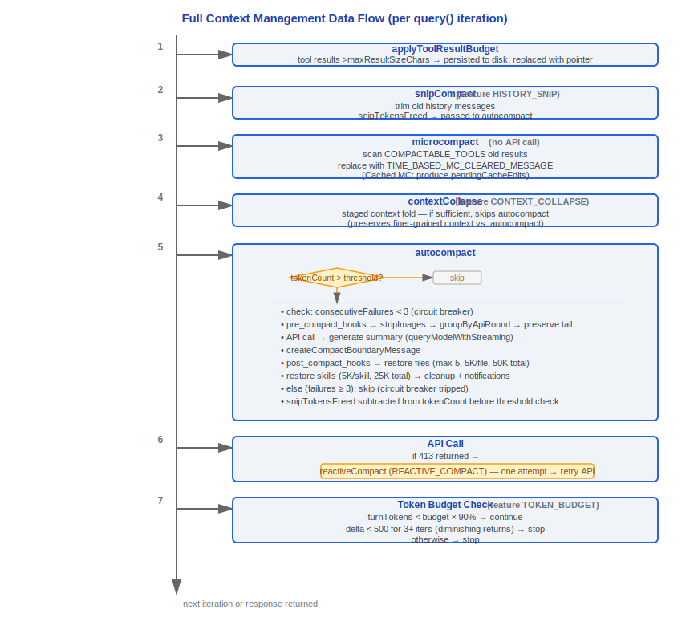

# Context Management

> Source files: `src/services/compact/` (11 files), `src/query/tokenBudget.ts`,
> `src/services/api/claude.ts` (getCacheControl), `src/utils/context.ts`,
> `src/utils/tokens.ts`

---

## 1. Architecture Overview

Claude Code's context management system ensures conversations always operate within the model's context window limits. It works through a three-layer compaction pipeline, token budget tracking, and prompt caching coordination.


---

## 2. Three-Layer Compaction Pipeline

### Design Philosophy

#### Why 3 layers instead of 1?

The three-layer compaction pipeline design is analogous to CPU cache hierarchies (L1/L2/L3) or JVM GC generations (young/old/permanent) — different layers handle different time scales and cost levels:

- **Microcompact (free, runs every iteration)**: Cleans up old tool results, replacing outdated content with `[Old tool result content cleared]`, with almost no computational cost
- **Autocompact (API call, threshold-triggered)**: Calls Claude to generate summaries replacing entire conversation history segments, consuming API call quota
- **Reactive (emergency, 413-triggered)**: Last safety net, only triggered when API returns `prompt_too_long` error

What if there was only one layer?

| Single-layer approach | Consequence |
|---------|------|
| Only microcompact | Context still explodes after 20-30 rounds — microcompact only replaces tool results, doesn't compress conversation itself |
| Only autocompact | Wastes API calls every round — source code shows `AUTOCOMPACT_BUFFER_TOKENS = 13_000` (`autoCompact.ts:62`) is precisely to avoid frequent triggering |
| Only reactive | Triggers 413 error every time then recovers, poor user experience, and `hasAttemptedReactiveCompact` flag limits to one attempt per loop (`query.ts`) |

The three-layer progressive design lets 90% of cases be handled by free microcompact, the remainder caught by autocompact, with reactive only as the final safety net.

#### Why AUTOCOMPACT_BUFFER = 13,000 tokens?

```typescript
// autoCompact.ts:62
export const AUTOCOMPACT_BUFFER_TOKENS = 13_000
```

This value is a balance point between performance and safety:

- **Too small (5K)**: Triggers autocompact frequently, each time an API call, wasting cost and latency
- **Too large (30K)**: Too far from hard limit, large amounts of available context space wasted
- **13K**: For 200K context window (effective 180K), threshold is 167K, approximately **93% utilization** — fully utilizes window while leaving safety margin to avoid triggering 413

#### Why restore at most 5 files after compression?

```typescript
// compact.ts:122-124
export const POST_COMPACT_MAX_FILES_TO_RESTORE = 5
export const POST_COMPACT_TOKEN_BUDGET = 50_000
export const POST_COMPACT_MAX_TOKENS_PER_FILE = 5_000
```

Compression loses file content, but the model may be editing these files. Restoring recently read/edited files prevents the model from "forgetting" ongoing work. 5 files + 50K tokens is an empirical threshold — restoring too many files would counteract compression effects, causing post-compression context to re-inflate.

#### Why is the circuit breaker set to 3 consecutive failures?

```typescript
// autoCompact.ts:67-70
// BQ 2026-03-10: 1,279 sessions had 50+ consecutive failures (up to 3,272)
// in a single session, wasting ~250K API calls/day globally.
const MAX_CONSECUTIVE_AUTOCOMPACT_FAILURES = 3
```

From production data: discovered 1,279 sessions with 50+ consecutive autocompact failures (up to 3,272), globally wasting approximately 250K API calls/day. 3 failures indicates context structurally exceeds model's summarization capability, continuing retries is pointless. Source code comment (`autoCompact.ts:345`) explicitly records warning log when circuit breaker trips.

#### Why is snipTokensFreed passed to autocompact?

```typescript
// query.ts:397-399
// snipTokensFreed is plumbed to autocompact so its threshold check reflects
// what snip removed; tokenCountWithEstimation alone can't see it (reads usage
// from the protected-tail assistant, which survives snip unchanged).
```

After snip trimming, `tokenCountWithEstimation` still reads old values from the `usage` field of preserved tail assistant messages, overestimating current size. Without passing `snipTokensFreed`, autocompact would still mistrigger when snip has already reduced context below threshold, wasting API calls. Source code `autoCompact.ts:225` with `tokenCount = tokenCountWithEstimation(messages) - snipTokensFreed` confirms this correction.

---

### 2.1 Layer One: Microcompact — Local Compression Without API Calls

#### File Location

`src/services/compact/microCompact.ts`

#### Core Mechanism

Microcompact reduces context size without calling APIs. It operates on tool result content, replacing old, no-longer-relevant results with placeholders.

#### COMPACTABLE_TOOLS Set

Only results from the following tools are microcompacted:

```typescript
const COMPACTABLE_TOOLS = new Set<string>([
  FILE_READ_TOOL_NAME,      // FileRead
  ...SHELL_TOOL_NAMES,      // Bash, PowerShell
  GREP_TOOL_NAME,           // Grep
  GLOB_TOOL_NAME,           // Glob
  WEB_SEARCH_TOOL_NAME,     // WebSearch
  WEB_FETCH_TOOL_NAME,      // WebFetch
  FILE_EDIT_TOOL_NAME,      // FileEdit
  FILE_WRITE_TOOL_NAME,     // FileWrite
])
```

#### Cleared Message

```typescript
export const TIME_BASED_MC_CLEARED_MESSAGE = '[Old tool result content cleared]'
```

When old tool results are cleared, content is replaced with this placeholder message.

#### Image Handling

```typescript
const IMAGE_MAX_TOKEN_SIZE = 2000
```

Image content has a separate token size estimation cap.

#### Cached Microcompact (ant-only)

When feature flag `CACHED_MICROCOMPACT` is enabled, microcompact results are cached:

```typescript
// Cache edit blocks — sent as cache_edits in API requests
export function consumePendingCacheEdits(): CacheEditsBlock | null
export function getPinnedCacheEdits(): PinnedCacheEdits[]
```

This allows reusing previous microcompact results without recomputation.

#### Time-Based MC Configuration

```typescript
// timeBasedMCConfig.ts
export type TimeBasedMCConfig = {
  enabled: boolean
  maxAge: number        // Maximum age (ms)
  // ...
}
```

#### Execution Timing

Microcompact runs in the `query.ts` loop before autocompact:

```typescript
const microcompactResult = await deps.microcompact(
  messagesForQuery,
  toolUseContext,
  querySource,
)
messagesForQuery = microcompactResult.messages
```

---

### 2.2 Layer Two: Autocompact — API-Called Automatic Compression

#### File Location

`src/services/compact/autoCompact.ts`

#### Core Constants

```typescript
export const AUTOCOMPACT_BUFFER_TOKENS = 13_000       // Compression buffer
export const WARNING_THRESHOLD_BUFFER_TOKENS = 20_000  // Warning threshold buffer
export const ERROR_THRESHOLD_BUFFER_TOKENS = 20_000    // Error threshold buffer
export const MANUAL_COMPACT_BUFFER_TOKENS = 3_000      // Manual compression buffer
```

#### Effective Context Window Calculation

```typescript
// autoCompact.ts, line 33
export function getEffectiveContextWindowSize(model: string): number {
  const reservedTokensForSummary = Math.min(
    getMaxOutputTokensForModel(model),
    MAX_OUTPUT_TOKENS_FOR_SUMMARY,     // 20,000
  )
  let contextWindow = getContextWindowForModel(model, getSdkBetas())

  // Environment variable override
  const autoCompactWindow = process.env.CLAUDE_CODE_AUTO_COMPACT_WINDOW
  if (autoCompactWindow) {
    contextWindow = Math.min(contextWindow, parseInt(autoCompactWindow, 10))
  }

  return contextWindow - reservedTokensForSummary
}
```

**Formula**: `effectiveContextWindow = contextWindow - min(maxOutput, 20000)`

**Example**: 200K context → effective 180K (reserves 20K for compression summary output)

#### Auto-Compact Threshold

```typescript
export function getAutoCompactThreshold(model: string): number {
  return getEffectiveContextWindowSize(model) - AUTOCOMPACT_BUFFER_TOKENS
  // e.g.: 180,000 - 13,000 = 167,000 tokens
}
```

#### Tracking State

```typescript
export type AutoCompactTrackingState = {
  compacted: boolean         // Whether compression has occurred
  turnCounter: number        // Turn counter after compression
  turnId: string             // Unique turn ID
  consecutiveFailures?: number  // Consecutive failure count
}
```

#### Circuit Breaker: Maximum Consecutive Failures

```typescript
const MAX_CONSECUTIVE_AUTOCOMPACT_FAILURES = 3
```

When consecutive failures reach 3, stop attempting autocompact. This is because analysis found 1,279 sessions with 50+ consecutive failures (up to 3,272), wasting approximately 250K API calls/day.

#### Token Warning State

```typescript
export function calculateTokenWarningState(
  tokenCount: number,
  model: string,
): 'normal' | 'warning' | 'error'
```

- **normal**: tokenCount < (threshold - WARNING_THRESHOLD_BUFFER)
- **warning**: tokenCount < (threshold - ERROR_THRESHOLD_BUFFER) but exceeds warning
- **error**: tokenCount >= (threshold - ERROR_THRESHOLD_BUFFER)

#### Execution Flow

```typescript
const { compactionResult, consecutiveFailures } = await deps.autocompact(
  messagesForQuery,
  toolUseContext,
  {
    systemPrompt,
    userContext,
    systemContext,
    toolUseContext,
    forkContextMessages: messagesForQuery,
  },
  querySource,
  tracking,
  snipTokensFreed,
)
```

---

### 2.3 Layer Three: Reactive Compact — Emergency Compression Triggered by 413

#### Feature Gate

```typescript
const reactiveCompact = feature('REACTIVE_COMPACT')
  ? require('./services/compact/reactiveCompact.js')
  : null
```

#### Trigger Condition

Triggered when API returns 413 (prompt_too_long) error.

#### Limitations

- Only one attempt per loop iteration (`hasAttemptedReactiveCompact`)
- If still 413 after compression, terminate loop (`reason: 'prompt_too_long'`)

#### Location in query.ts

```typescript
// In API call error handling
if (isPromptTooLong && !hasAttemptedReactiveCompact && reactiveCompact) {
  // Attempt compression
  const result = await reactiveCompact.compactOnPromptTooLong(...)
  if (result.success) {
    state = { ...state, hasAttemptedReactiveCompact: true, messages: result.messages }
    continue  // Retry API call
  }
}
```

---

## 3. Compaction Core Implementation (compact.ts)

### 3.1 File Location

`src/services/compact/compact.ts`

### 3.2 Core Constants

```typescript
export const POST_COMPACT_MAX_FILES_TO_RESTORE = 5         // Max files to restore after compression
export const POST_COMPACT_TOKEN_BUDGET = 50_000             // Token budget after compression
export const POST_COMPACT_MAX_TOKENS_PER_FILE = 5_000       // Max tokens per file
export const POST_COMPACT_MAX_TOKENS_PER_SKILL = 5_000      // Max tokens per skill
export const POST_COMPACT_SKILLS_TOKEN_BUDGET = 25_000       // Total skill token budget
const MAX_COMPACT_STREAMING_RETRIES = 2                      // Compression streaming retry count
```

### 3.3 Compaction Flow


### 3.4 CompactionResult Type

```typescript
export type CompactionResult = {
  summaryMessages: Message[]           // Summary messages
  attachments: AttachmentMessage[]     // Attachment messages (restored files/skills)
  hookResults: HookResultMessage[]     // Hook results
  preCompactTokenCount: number         // Token count before compression
  postCompactTokenCount: number        // Token count after compression
  truePostCompactTokenCount: number    // True token count after compression
  compactionUsage: BetaUsage | null    // Compression API usage
}
```

### 3.5 buildPostCompactMessages()

```typescript
export function buildPostCompactMessages(result: CompactionResult): Message[]
```

Assembles complete message list after compression:
1. Compression boundary message (marker point)
2. Summary messages (AI-generated conversation summary)
3. Attachment messages (restored files and skill content)
4. Hook result messages

---

## 4. Token Budget Tracking

### 4.1 BudgetTracker

See `query-engine.md` Section 8 for details. Key points:

```typescript
export type BudgetTracker = {
  continuationCount: number       // Number of continuations
  lastDeltaTokens: number         // Last delta
  lastGlobalTurnTokens: number    // Last global turn token count
  startedAt: number               // Start timestamp
}
```

### 4.2 Decision Logic

```
COMPLETION_THRESHOLD = 0.9 (90%)
DIMINISHING_THRESHOLD = 500 tokens

if (agentId || budget === null) → stop
if (!isDiminishing && turnTokens < budget * 90%) → continue
if (continuationCount >= 3 && delta < 500 for 2 consecutive) → stop (diminishing returns)
```

### 4.3 Difference from Task Budget

| Dimension | Token Budget | Task Budget |
|------|-------------|-------------|
| Source | Client configuration | API output_config.task_budget |
| Controls | Auto-continue behavior | Server-side token allocation |
| Across compression | Independent tracking | Requires remaining calculation |
| Sub-agents | Skip | Pass to sub-agents |

---

## 5. Context Collapse

### 5.1 Feature Gate

```typescript
const contextCollapse = feature('CONTEXT_COLLAPSE')
  ? require('./services/contextCollapse/index.js')
  : null
```

### 5.2 Staged Collapse

Context collapse is a pre-step to autocompact, reducing context without calling APIs:

```typescript
if (feature('CONTEXT_COLLAPSE') && contextCollapse) {
  const collapseResult = await contextCollapse.applyCollapsesIfNeeded(
    messagesForQuery,
    toolUseContext,
    querySource,
  )
  messagesForQuery = collapseResult.messages
}
```

### 5.3 Design Features

- **Read-time projection**: Collapse view is projected at read time, doesn't modify original messages
- **Commit log**: Collapse operations recorded as commit log, `projectView()` replays at each entry
- **Cross-turn persistence**: Collapse results passed through `state.messages` at continue sites
- **Relationship with autocompact**: If collapse is sufficient to reduce below autocompact threshold, autocompact doesn't trigger, preserving more fine-grained context

### 5.4 Draining on Prompt-Too-Long

When prompt_too_long error occurs, context collapse can perform more aggressive collapse (drain) operations.

---

## 6. Prompt Caching

### 6.1 getCacheControl()

```typescript
// services/api/claude.ts
export function getCacheControl(
  scope?: CacheScope,
): { type: 'ephemeral'; ttl?: number } | undefined
```

### 6.2 TTL Strategy

- **Base**: `{ type: 'ephemeral' }` — Default short-term cache
- **TTL extension**: `{ type: 'ephemeral', ttl: 3600 }` — 1 hour TTL
  - Condition: `isFirstPartyAnthropicBaseUrl()` and not third-party gateway
  - Enabled for eligible users

### 6.3 Cache Scope

```typescript
export type CacheScope = 'global' | undefined
```

- **global**: Cross-user cache (available when system prompt is consistent across users)
- **undefined**: Default session-level cache

### 6.4 Global Cache Strategy

```typescript
export type GlobalCacheStrategy = 'tool_based' | 'system_prompt' | 'none'
```

| Strategy | Location | Effect |
|------|------|------|
| `tool_based` | cache_control on tool definitions | Tool definitions are cached |
| `system_prompt` | Last block of system prompt | System prompt is cached |
| `none` | Not set | No cache control |

### 6.5 Cache Break Detection

```typescript
// promptCacheBreakDetection.ts
notifyCompaction()       // Notify when compression occurs
notifyCacheDeletion()    // Notify when microcompact deletes content
```

These notifications are used to track cache hit rate changes.

---

## 7. Snip Compact — History Trimming

### 7.1 Feature Gate

```typescript
const snipModule = feature('HISTORY_SNIP')
  ? require('./services/compact/snipCompact.js')
  : null
```

### 7.2 Execution Location

Runs before microcompact (both are not mutually exclusive, can run simultaneously):

```typescript
if (feature('HISTORY_SNIP')) {
  const snipResult = snipModule!.snipCompactIfNeeded(messagesForQuery)
  messagesForQuery = snipResult.messages
  snipTokensFreed = snipResult.tokensFreed
  if (snipResult.boundaryMessage) {
    yield snipResult.boundaryMessage
  }
}
```

### 7.3 Relationship with Other Compression

`snipTokensFreed` is passed to autocompact, making threshold checks reflect content removed by snip. Otherwise, stale `tokenCountWithEstimation` (read from usage in preserved tail assistant messages) would report pre-compression size, causing false positive blocking.

---

## 8. Message Grouping (grouping.ts)

```typescript
// compact/grouping.ts
export function groupMessagesByApiRound(messages: Message[]): MessageGroup[]
```

Groups messages by API round:
- One "round" = user message + assistant message + tool results
- Grouping used during compression to decide which rounds can be summarized

---

## 9. Compression Warning System

### 9.1 Compression Warning Hook

```typescript
// compactWarningHook.ts
// Shows warnings when context approaches limits
```

### 9.2 Warning Suppression

```typescript
// compactWarningState.ts
suppressCompactWarning()       // Temporarily suppress warning
clearCompactWarningSuppression() // Clear suppression
```

When auto-compact succeeds, warnings are suppressed (because context has been compressed).

---

## 10. Complete Context Management Data Flow



---

## 11. Configuration and Environment Variables

| Variable | Default | Purpose |
|------|--------|------|
| `CLAUDE_CODE_AUTO_COMPACT_WINDOW` | (none) | Override context window size |
| `CLAUDE_AUTOCOMPACT_PCT_OVERRIDE` | (none) | Override auto-compact percentage threshold |
| `CLAUDE_CODE_MAX_OUTPUT_TOKENS` | (model default) | Override max output tokens |
| `CLAUDE_CODE_DISABLE_AUTO_COMPACT` | false | Disable auto-compact |

---

## 12. Key Design Decisions

1. **Three-layer progression**: microcompact (free) → autocompact (API call) → reactive (emergency), used in order of increasing cost
2. **Circuit breaker**: Stop autocompact after 3 consecutive failures, avoiding wasted API calls
3. **Reserve output space**: Always reserve min(maxOutput, 20K) for compression summary output
4. **File restoration priority**: Re-inject most important files after compression (max 5, 50K budget)
5. **Skill restoration**: Skill content re-injected after compression (25K budget), front section most critical
6. **Cache awareness**: Compression/microcompact operations notify cache system, tracking cache hit rate impact
7. **Snip → MC → Collapse → AC order**: First trim, then microcompact, then collapse, finally full compression

---

## Engineering Practice Guide

### Diagnosing Context Inflation

When suspecting conversation consumes too many tokens, follow these troubleshooting steps:

1. **View raw message size**: Set environment variable `CLAUDE_CODE_DISABLE_AUTO_COMPACT=true` to disable auto-compact, observe token count growth rate after each conversation round. This exposes which tool results consume most tokens.
2. **Check tool result proportion**: Focus on tools in the COMPACTABLE_TOOLS set like `Bash`, `FileRead`, `Grep` — their outputs are typically the main source of context inflation.
3. **Use `/context` command**: Run `/context` to view current context usage, including token warning state (normal/warning/error).
4. **Check token warning state**: When `calculateTokenWarningState()` returns `'warning'`, it indicates approaching threshold (less than 20K from autocompact threshold), `'error'` indicates extremely close.

### Adjusting Compression Thresholds

| Environment Variable | Effect | Example |
|---------|------|------|
| `CLAUDE_AUTOCOMPACT_PCT_OVERRIDE` | Override auto-compact percentage threshold, value is 0-100 integer | `CLAUDE_AUTOCOMPACT_PCT_OVERRIDE=80` triggers at 80% |
| `CLAUDE_CODE_AUTO_COMPACT_WINDOW` | Override context window size (token count), used to test compression behavior under smaller windows | `CLAUDE_CODE_AUTO_COMPACT_WINDOW=50000` simulates 50K window |
| `CLAUDE_CODE_DISABLE_AUTO_COMPACT` | Completely disable auto-compact | `CLAUDE_CODE_DISABLE_AUTO_COMPACT=true` |

Adjustment steps:
1. First use `CLAUDE_CODE_DISABLE_AUTO_COMPACT=true` to observe natural inflation rate
2. Choose appropriate percentage based on work mode: short conversations can set high (90%), long conversations set low (70-80%)
3. To test compression logic, use `CLAUDE_CODE_AUTO_COMPACT_WINDOW` to set small window to quickly trigger compression

### Customizing Compression Behavior

Inject custom logic through `pre_compact` / `post_compact` hooks:

```json
// settings.json
{
  "hooks": {
    "PreCompact": [
      {
        "type": "bash",
        "command": "echo 'About to compress, current time: $(date)' >> /tmp/compact.log"
      }
    ],
    "PostCompact": [
      {
        "type": "bash",
        "command": "echo 'Compression complete' >> /tmp/compact.log"
      }
    ]
  }
}
```

Typical uses:
- **PreCompact**: Save key context information to external storage (like project notes file) before compression
- **PostCompact**: Re-inject key instructions or check summary quality after compression

Source code `compact.ts:408` executes `executePreCompactHooks()`, `compact.ts:721` executes `executePostCompactHooks()`, hook results are attached to post-compression messages as `HookResultMessage`.

### Adding New COMPACTABLE_TOOLS

If developing a new tool with large output results, need to add to microcompact scope:

1. Open `src/services/compact/microCompact.ts`
2. Add tool name constant to `COMPACTABLE_TOOLS` set:
   ```typescript
   const COMPACTABLE_TOOLS = new Set<string>([
     FILE_READ_TOOL_NAME,
     ...SHELL_TOOL_NAMES,
     // ... existing tools
     YOUR_NEW_TOOL_NAME,  // new addition
   ])
   ```
3. Also check if corresponding set in `apiMicrocompact.ts` needs updating (API-level microcompact has independent tool list, includes additional tools like `NOTEBOOK_EDIT_TOOL_NAME`)
4. Ensure tool's `tool_result` content format is compatible with `collectCompactableToolIds()` traversal logic

### Common Pitfalls

> **Autocompact calling API = costs money**
> Each autocompact trigger is an API call, consuming cost and adding latency. Don't set threshold too low (like 50%), otherwise triggers frequently. Default value `AUTOCOMPACT_BUFFER_TOKENS = 13,000` corresponds to approximately 93% utilization in 200K window, a validated balance point.

> **Circuit breaker stops after 3 failures**
> Source code `autoCompact.ts:67-70` comment records real production data: 1,279 sessions had 50+ consecutive autocompact failures (up to 3,272), globally wasting approximately 250K API calls/day. After circuit breaker trips (`consecutiveFailures >= 3`), this session no longer attempts autocompact. If encountering circuit breaker trip, check if context structurally exceeds model's summarization capability — may need manual `/compact` or start new session.

> **Compression loses file content**
> After compression, system restores at most `POST_COMPACT_MAX_FILES_TO_RESTORE = 5` recently read/edited files, each file max 5K tokens, total budget 50K tokens. File content beyond this range is lost. If editing multiple files, model may "forget" some files after compression — need to re-Read relevant files at this point.

> **snipTokensFreed must be correctly passed**
> If modifying snip or autocompact related logic, must ensure `snipTokensFreed` is passed from snipCompact to autocompact (`query.ts:397-399`). Otherwise autocompact's threshold check will be based on outdated token count, causing unnecessary API calls.

> **Reactive compact only attempts once**
> `hasAttemptedReactiveCompact` flag limits to one emergency compression attempt per loop iteration. If still 413 after compression, loop terminates (`reason: 'prompt_too_long'`). Don't rely on reactive compact as regular compression method.


---

[← Permission & Security](../06-权限与安全/permission-security-en.md) | [Index](../README_EN.md) | [MCP Integration →](../08-MCP集成/mcp-integration-en.md)
