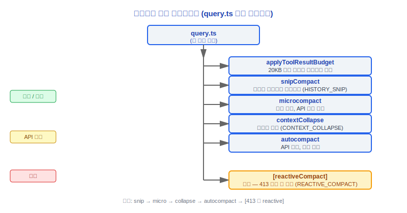
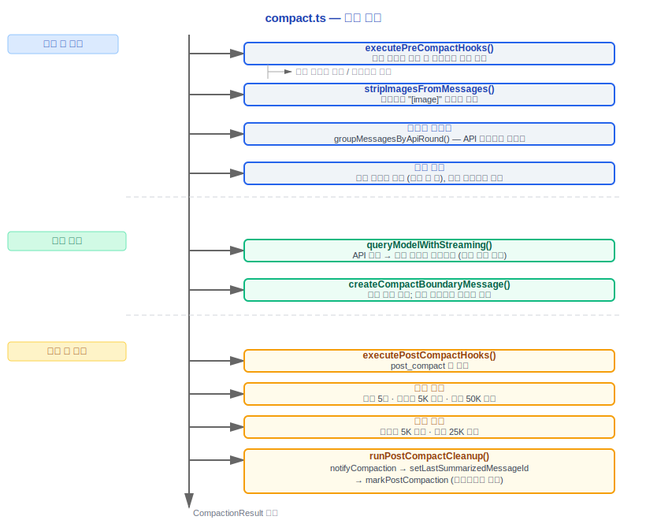
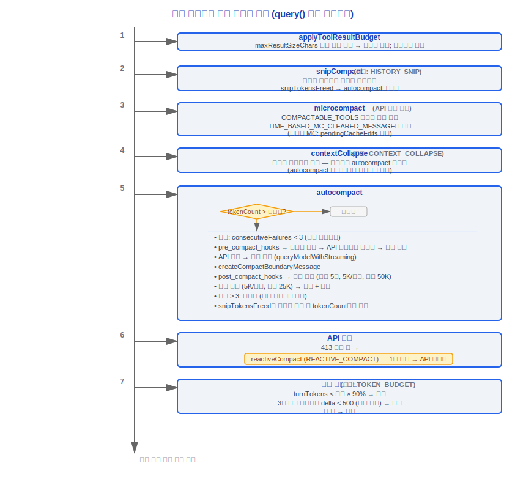

# 컨텍스트 관리(Context Management)

> 소스 파일: `src/services/compact/` (11개 파일), `src/query/tokenBudget.ts`,
> `src/services/api/claude.ts` (getCacheControl), `src/utils/context.ts`,
> `src/utils/tokens.ts`

---

## 1. 아키텍처 개요

Claude Code의 컨텍스트 관리(Context Management) 시스템은 대화가 항상 모델의 컨텍스트 윈도우 한도 내에서 동작하도록 보장합니다. 3단계 압축 파이프라인(Compaction Pipeline), 토큰 예산 추적(Token Budget Tracking), 프롬프트 캐싱(Prompt Caching) 조율을 통해 작동합니다.



---

## 2. 3단계 압축 파이프라인

### 설계 철학

#### 왜 1단계가 아닌 3단계인가?

3단계 압축 파이프라인 설계는 CPU 캐시 계층(L1/L2/L3)이나 JVM GC 세대(young/old/permanent)에 비유할 수 있습니다. 각 단계는 서로 다른 시간 스케일과 비용 수준을 처리합니다.

- **마이크로컴팩트(Microcompact, 무료, 매 이터레이션 실행)**: 오래된 도구 결과를 정리하고 오래된 내용을 `[Old tool result content cleared]`로 대체하며, 계산 비용이 거의 없습니다.
- **오토컴팩트(Autocompact, API 호출, 임계값 트리거)**: Claude를 호출하여 전체 대화 기록 세그먼트를 대체하는 요약을 생성하며, API 호출 할당량을 소비합니다.
- **리액티브(Reactive, 긴급, 413 트리거)**: 마지막 안전망으로, API가 `prompt_too_long` 오류를 반환할 때만 트리거됩니다.

단일 레이어만 사용한다면?

| 단일 레이어 방식 | 결과 |
|---------|------|
| 마이크로컴팩트만 사용 | 20~30라운드 후에도 컨텍스트 폭발 — 마이크로컴팩트는 도구 결과만 대체하고 대화 자체는 압축하지 않음 |
| 오토컴팩트만 사용 | 매 라운드 API 호출 낭비 — 소스 코드에서 `AUTOCOMPACT_BUFFER_TOKENS = 13_000` (`autoCompact.ts:62`)은 빈번한 트리거를 방지하기 위한 것 |
| 리액티브만 사용 | 매번 413 오류 트리거 후 복구하는 방식으로 사용자 경험이 나쁘고, `hasAttemptedReactiveCompact` 플래그가 루프당 한 번으로 제한(`query.ts`) |

3단계 점진적 설계를 통해 90%의 케이스는 무료 마이크로컴팩트로 처리하고, 나머지는 오토컴팩트로 처리하며, 리액티브는 최후의 안전망으로만 사용합니다.

#### AUTOCOMPACT_BUFFER = 13,000 토큰인 이유는?

```typescript
// autoCompact.ts:62
export const AUTOCOMPACT_BUFFER_TOKENS = 13_000
```

이 값은 성능과 안전성 사이의 균형점입니다.

- **너무 작은 경우 (5K)**: 오토컴팩트가 자주 트리거되어 매번 API 호출이 발생하고 비용과 지연이 낭비됩니다.
- **너무 큰 경우 (30K)**: 하드 한도와 너무 멀어지고, 사용 가능한 컨텍스트 공간이 많이 낭비됩니다.
- **13K**: 200K 컨텍스트 윈도우(실효 180K) 기준 임계값은 167K이며, 약 **93% 활용률**에 해당합니다. 윈도우를 충분히 활용하면서 413 트리거를 방지하는 안전 마진을 남깁니다.

#### 압축 후 최대 5개 파일만 복원하는 이유는?

```typescript
// compact.ts:122-124
export const POST_COMPACT_MAX_FILES_TO_RESTORE = 5
export const POST_COMPACT_TOKEN_BUDGET = 50_000
export const POST_COMPACT_MAX_TOKENS_PER_FILE = 5_000
```

압축은 파일 내용을 잃게 하지만, 모델이 이 파일을 편집 중일 수 있습니다. 최근 읽기/편집한 파일을 복원하면 모델이 진행 중인 작업을 "잊는" 것을 방지합니다. 5개 파일 + 50K 토큰은 경험적 임계값입니다. 너무 많은 파일을 복원하면 압축 효과가 상쇄되어 압축 후 컨텍스트가 다시 부풀어오릅니다.

#### 서킷 브레이커가 연속 3번 실패로 설정된 이유는?

```typescript
// autoCompact.ts:67-70
// BQ 2026-03-10: 1,279개의 세션에서 50회 이상의 연속 실패(최대 3,272회)가
// 단일 세션에서 발생하여 전 세계적으로 하루 약 25만 건의 API 호출을 낭비함.
const MAX_CONSECUTIVE_AUTOCOMPACT_FAILURES = 3
```

프로덕션 데이터에서 1,279개의 세션에서 오토컴팩트가 50회 이상 연속으로 실패(최대 3,272회)하여 전 세계적으로 하루 약 25만 건의 API 호출을 낭비한 것이 확인되었습니다. 3번의 실패는 컨텍스트가 구조적으로 모델의 요약 능력을 초과했음을 의미하며, 계속 재시도하는 것은 의미가 없습니다. 소스 코드 주석(`autoCompact.ts:345`)에는 서킷 브레이커가 동작할 때 경고 로그를 명시적으로 기록합니다.

#### snipTokensFreed를 오토컴팩트에 전달하는 이유는?

```typescript
// query.ts:397-399
// snipTokensFreed는 오토컴팩트에 전달되어 임계값 검사가 snip이 제거한 내용을 반영함.
// tokenCountWithEstimation만으로는 확인 불가 (보호된 테일 어시스턴트에서 usage를 읽으며,
// snip 이후에도 변경되지 않음).
```

snip 트리밍 후에도 `tokenCountWithEstimation`은 보존된 테일 어시스턴트 메시지의 `usage` 필드에서 오래된 값을 읽어 현재 크기를 과대 추정합니다. `snipTokensFreed`를 전달하지 않으면, snip이 이미 컨텍스트를 임계값 아래로 줄였음에도 오토컴팩트가 잘못 트리거되어 API 호출을 낭비합니다. 소스 코드 `autoCompact.ts:225`에서 `tokenCount = tokenCountWithEstimation(messages) - snipTokensFreed`로 이 보정을 확인할 수 있습니다.

---

### 2.1 1단계: 마이크로컴팩트(Microcompact) — API 호출 없는 로컬 압축

#### 파일 위치

`src/services/compact/microCompact.ts`

#### 핵심 메커니즘

마이크로컴팩트는 API를 호출하지 않고 컨텍스트 크기를 줄입니다. 도구 결과 내용을 대상으로 오래되어 더 이상 관련 없는 결과를 플레이스홀더로 대체합니다.

#### COMPACTABLE_TOOLS 집합

다음 도구의 결과만 마이크로컴팩트 처리됩니다.

```typescript
const COMPACTABLE_TOOLS = new Set<string>([
  FILE_READ_TOOL_NAME,      // FileRead
  ...SHELL_TOOL_NAMES,      // Bash, PowerShell
  GREP_TOOL_NAME,           // Grep
  GLOB_TOOL_NAME,           // Glob
  WEB_SEARCH_TOOL_NAME,     // WebSearch
  WEB_FETCH_TOOL_NAME,      // WebFetch
  FILE_EDIT_TOOL_NAME,      // FileEdit
  FILE_WRITE_TOOL_NAME,     // FileWrite
])
```

#### 제거된 메시지

```typescript
export const TIME_BASED_MC_CLEARED_MESSAGE = '[Old tool result content cleared]'
```

오래된 도구 결과가 제거될 때 내용이 이 플레이스홀더 메시지로 대체됩니다.

#### 이미지 처리

```typescript
const IMAGE_MAX_TOKEN_SIZE = 2000
```

이미지 콘텐츠에는 별도의 토큰 크기 추정 한도가 있습니다.

#### 캐시된 마이크로컴팩트 (ant 전용)

기능 플래그 `CACHED_MICROCOMPACT`가 활성화된 경우, 마이크로컴팩트 결과가 캐시됩니다.

```typescript
// 캐시 편집 블록 — API 요청 시 cache_edits로 전송됨
export function consumePendingCacheEdits(): CacheEditsBlock | null
export function getPinnedCacheEdits(): PinnedCacheEdits[]
```

이를 통해 재계산 없이 이전 마이크로컴팩트 결과를 재사용할 수 있습니다.

#### 시간 기반 MC 설정

```typescript
// timeBasedMCConfig.ts
export type TimeBasedMCConfig = {
  enabled: boolean
  maxAge: number        // 최대 연령(ms)
  // ...
}
```

#### 실행 타이밍

마이크로컴팩트는 `query.ts` 루프에서 오토컴팩트 이전에 실행됩니다.

```typescript
const microcompactResult = await deps.microcompact(
  messagesForQuery,
  toolUseContext,
  querySource,
)
messagesForQuery = microcompactResult.messages
```

---

### 2.2 2단계: 오토컴팩트(Autocompact) — API 호출 자동 압축

#### 파일 위치

`src/services/compact/autoCompact.ts`

#### 핵심 상수

```typescript
export const AUTOCOMPACT_BUFFER_TOKENS = 13_000       // 압축 버퍼
export const WARNING_THRESHOLD_BUFFER_TOKENS = 20_000  // 경고 임계값 버퍼
export const ERROR_THRESHOLD_BUFFER_TOKENS = 20_000    // 오류 임계값 버퍼
export const MANUAL_COMPACT_BUFFER_TOKENS = 3_000      // 수동 압축 버퍼
```

#### 실효 컨텍스트 윈도우 계산

```typescript
// autoCompact.ts, 33번 줄
export function getEffectiveContextWindowSize(model: string): number {
  const reservedTokensForSummary = Math.min(
    getMaxOutputTokensForModel(model),
    MAX_OUTPUT_TOKENS_FOR_SUMMARY,     // 20,000
  )
  let contextWindow = getContextWindowForModel(model, getSdkBetas())

  // 환경 변수 오버라이드
  const autoCompactWindow = process.env.CLAUDE_CODE_AUTO_COMPACT_WINDOW
  if (autoCompactWindow) {
    contextWindow = Math.min(contextWindow, parseInt(autoCompactWindow, 10))
  }

  return contextWindow - reservedTokensForSummary
}
```

**공식**: `effectiveContextWindow = contextWindow - min(maxOutput, 20000)`

**예시**: 200K 컨텍스트 → 실효 180K (압축 요약 출력을 위해 20K 예약)

#### 오토컴팩트 임계값

```typescript
export function getAutoCompactThreshold(model: string): number {
  return getEffectiveContextWindowSize(model) - AUTOCOMPACT_BUFFER_TOKENS
  // 예: 180,000 - 13,000 = 167,000 토큰
}
```

#### 추적 상태

```typescript
export type AutoCompactTrackingState = {
  compacted: boolean         // 압축 여부
  turnCounter: number        // 압축 후 턴 카운터
  turnId: string             // 고유 턴 ID
  consecutiveFailures?: number  // 연속 실패 횟수
}
```

#### 서킷 브레이커: 최대 연속 실패 횟수

```typescript
const MAX_CONSECUTIVE_AUTOCOMPACT_FAILURES = 3
```

연속 실패가 3회에 도달하면 오토컴팩트 시도를 중지합니다. 분석 결과 1,279개의 세션에서 50회 이상의 연속 실패(최대 3,272회)가 발생하여 하루 약 25만 건의 API 호출을 낭비한 것으로 확인되었습니다.

#### 토큰 경고 상태

```typescript
export function calculateTokenWarningState(
  tokenCount: number,
  model: string,
): 'normal' | 'warning' | 'error'
```

- **normal**: tokenCount < (임계값 - WARNING_THRESHOLD_BUFFER)
- **warning**: tokenCount < (임계값 - ERROR_THRESHOLD_BUFFER)이지만 경고 초과
- **error**: tokenCount >= (임계값 - ERROR_THRESHOLD_BUFFER)

#### 실행 흐름

```typescript
const { compactionResult, consecutiveFailures } = await deps.autocompact(
  messagesForQuery,
  toolUseContext,
  {
    systemPrompt,
    userContext,
    systemContext,
    toolUseContext,
    forkContextMessages: messagesForQuery,
  },
  querySource,
  tracking,
  snipTokensFreed,
)
```

---

### 2.3 3단계: 리액티브 컴팩트(Reactive Compact) — 413으로 트리거되는 긴급 압축

#### 기능 게이트

```typescript
const reactiveCompact = feature('REACTIVE_COMPACT')
  ? require('./services/compact/reactiveCompact.js')
  : null
```

#### 트리거 조건

API가 413(prompt_too_long) 오류를 반환할 때 트리거됩니다.

#### 제한 사항

- 루프 이터레이션당 한 번만 시도 (`hasAttemptedReactiveCompact`)
- 압축 후에도 여전히 413이면 루프 종료 (`reason: 'prompt_too_long'`)

#### query.ts 내 위치

```typescript
// API 호출 오류 처리 중
if (isPromptTooLong && !hasAttemptedReactiveCompact && reactiveCompact) {
  // 압축 시도
  const result = await reactiveCompact.compactOnPromptTooLong(...)
  if (result.success) {
    state = { ...state, hasAttemptedReactiveCompact: true, messages: result.messages }
    continue  // API 호출 재시도
  }
}
```

---

## 3. 압축 핵심 구현 (compact.ts)

### 3.1 파일 위치

`src/services/compact/compact.ts`

### 3.2 핵심 상수

```typescript
export const POST_COMPACT_MAX_FILES_TO_RESTORE = 5         // 압축 후 복원 최대 파일 수
export const POST_COMPACT_TOKEN_BUDGET = 50_000             // 압축 후 토큰 예산
export const POST_COMPACT_MAX_TOKENS_PER_FILE = 5_000       // 파일당 최대 토큰
export const POST_COMPACT_MAX_TOKENS_PER_SKILL = 5_000      // 스킬당 최대 토큰
export const POST_COMPACT_SKILLS_TOKEN_BUDGET = 25_000       // 총 스킬 토큰 예산
const MAX_COMPACT_STREAMING_RETRIES = 2                      // 압축 스트리밍 재시도 횟수
```

### 3.3 압축 흐름



### 3.4 CompactionResult 타입

```typescript
export type CompactionResult = {
  summaryMessages: Message[]           // 요약 메시지
  attachments: AttachmentMessage[]     // 첨부 메시지 (복원된 파일/스킬)
  hookResults: HookResultMessage[]     // 훅 결과
  preCompactTokenCount: number         // 압축 전 토큰 수
  postCompactTokenCount: number        // 압축 후 토큰 수
  truePostCompactTokenCount: number    // 압축 후 실제 토큰 수
  compactionUsage: BetaUsage | null    // 압축 API 사용량
}
```

### 3.5 buildPostCompactMessages()

```typescript
export function buildPostCompactMessages(result: CompactionResult): Message[]
```

압축 후 전체 메시지 목록을 조립합니다.
1. 압축 경계 메시지 (마커 포인트)
2. 요약 메시지 (AI가 생성한 대화 요약)
3. 첨부 메시지 (복원된 파일 및 스킬 내용)
4. 훅 결과 메시지

---

## 4. 토큰 예산 추적

### 4.1 BudgetTracker

자세한 내용은 `query-engine.md` 섹션 8을 참조하십시오. 핵심 사항:

```typescript
export type BudgetTracker = {
  continuationCount: number       // 계속 횟수
  lastDeltaTokens: number         // 마지막 델타
  lastGlobalTurnTokens: number    // 마지막 글로벌 턴 토큰 수
  startedAt: number               // 시작 타임스탬프
}
```

### 4.2 결정 로직

```
COMPLETION_THRESHOLD = 0.9 (90%)
DIMINISHING_THRESHOLD = 500 토큰

if (agentId || budget === null) → 중지
if (!isDiminishing && turnTokens < budget * 90%) → 계속
if (continuationCount >= 3 && delta < 500 for 2 consecutive) → 중지 (수익 체감)
```

### 4.3 태스크 예산과의 차이

| 차원 | 토큰 예산 | 태스크 예산 |
|------|-------------|-------------|
| 출처 | 클라이언트 설정 | API output_config.task_budget |
| 제어 | 자동 계속 동작 | 서버 측 토큰 할당 |
| 압축 간 | 독립적 추적 | 잔여 계산 필요 |
| 서브 에이전트 | 건너뜀 | 서브 에이전트에 전달 |

---

## 5. 컨텍스트 콜랩스(Context Collapse)

### 5.1 기능 게이트

```typescript
const contextCollapse = feature('CONTEXT_COLLAPSE')
  ? require('./services/contextCollapse/index.js')
  : null
```

### 5.2 단계적 콜랩스

컨텍스트 콜랩스는 오토컴팩트의 사전 단계로, API 호출 없이 컨텍스트를 줄입니다.

```typescript
if (feature('CONTEXT_COLLAPSE') && contextCollapse) {
  const collapseResult = await contextCollapse.applyCollapsesIfNeeded(
    messagesForQuery,
    toolUseContext,
    querySource,
  )
  messagesForQuery = collapseResult.messages
}
```

### 5.3 설계 특징

- **읽기 시점 프로젝션**: 콜랩스 뷰는 읽기 시점에 프로젝션되며 원본 메시지를 수정하지 않음
- **커밋 로그**: 콜랩스 작업이 커밋 로그로 기록되고, `projectView()`가 각 항목에서 재실행
- **턴 간 지속성**: 콜랩스 결과가 계속 사이트에서 `state.messages`를 통해 전달됨
- **오토컴팩트와의 관계**: 콜랩스가 오토컴팩트 임계값 아래로 충분히 줄이면 오토컴팩트가 트리거되지 않아 더 세밀한 컨텍스트 보존 가능

### 5.4 Prompt-Too-Long 시 드레이닝

prompt_too_long 오류 발생 시 컨텍스트 콜랩스는 더 공격적인 콜랩스(드레인) 작업을 수행할 수 있습니다.

---

## 6. 프롬프트 캐싱(Prompt Caching)

### 6.1 getCacheControl()

```typescript
// services/api/claude.ts
export function getCacheControl(
  scope?: CacheScope,
): { type: 'ephemeral'; ttl?: number } | undefined
```

### 6.2 TTL 전략

- **기본**: `{ type: 'ephemeral' }` — 기본 단기 캐시
- **TTL 연장**: `{ type: 'ephemeral', ttl: 3600 }` — 1시간 TTL
  - 조건: `isFirstPartyAnthropicBaseUrl()`이고 서드파티 게이트웨이가 아닌 경우
  - 적격 사용자에게 활성화됨

### 6.3 캐시 스코프

```typescript
export type CacheScope = 'global' | undefined
```

- **global**: 사용자 간 캐시 (시스템 프롬프트가 사용자 간에 일관될 때 사용 가능)
- **undefined**: 기본 세션 수준 캐시

### 6.4 글로벌 캐시 전략

```typescript
export type GlobalCacheStrategy = 'tool_based' | 'system_prompt' | 'none'
```

| 전략 | 위치 | 효과 |
|------|------|------|
| `tool_based` | 도구 정의의 cache_control | 도구 정의가 캐시됨 |
| `system_prompt` | 시스템 프롬프트의 마지막 블록 | 시스템 프롬프트가 캐시됨 |
| `none` | 설정하지 않음 | 캐시 제어 없음 |

### 6.5 캐시 브레이크 감지

```typescript
// promptCacheBreakDetection.ts
notifyCompaction()       // 압축 발생 시 알림
notifyCacheDeletion()    // 마이크로컴팩트가 내용 삭제 시 알림
```

이 알림은 캐시 히트율 변화를 추적하는 데 사용됩니다.

---

## 7. 스닙 컴팩트(Snip Compact) — 기록 트리밍

### 7.1 기능 게이트

```typescript
const snipModule = feature('HISTORY_SNIP')
  ? require('./services/compact/snipCompact.js')
  : null
```

### 7.2 실행 위치

마이크로컴팩트 이전에 실행됩니다 (둘 다 상호 배타적이지 않으며 동시에 실행 가능):

```typescript
if (feature('HISTORY_SNIP')) {
  const snipResult = snipModule!.snipCompactIfNeeded(messagesForQuery)
  messagesForQuery = snipResult.messages
  snipTokensFreed = snipResult.tokensFreed
  if (snipResult.boundaryMessage) {
    yield snipResult.boundaryMessage
  }
}
```

### 7.3 다른 압축과의 관계

`snipTokensFreed`는 오토컴팩트에 전달되어 임계값 검사가 snip이 제거한 내용을 반영하도록 합니다. 그렇지 않으면 오래된 `tokenCountWithEstimation`(보존된 테일 어시스턴트 메시지의 usage에서 읽음)이 압축 전 크기를 보고하여 거짓 양성 차단이 발생합니다.

---

## 8. 메시지 그룹핑 (grouping.ts)

```typescript
// compact/grouping.ts
export function groupMessagesByApiRound(messages: Message[]): MessageGroup[]
```

메시지를 API 라운드별로 그룹핑합니다.
- "라운드" 하나 = 사용자 메시지 + 어시스턴트 메시지 + 도구 결과
- 그룹핑은 압축 중 어떤 라운드를 요약할 수 있는지 결정하는 데 사용됩니다.

---

## 9. 압축 경고 시스템

### 9.1 압축 경고 훅

```typescript
// compactWarningHook.ts
// 컨텍스트가 한도에 가까워질 때 경고를 표시함
```

### 9.2 경고 억제

```typescript
// compactWarningState.ts
suppressCompactWarning()       // 경고 일시 억제
clearCompactWarningSuppression() // 억제 해제
```

오토컴팩트가 성공하면 경고가 억제됩니다 (컨텍스트가 압축되었기 때문).

---

## 10. 완전한 컨텍스트 관리 데이터 흐름



---

## 11. 설정 및 환경 변수

| 변수 | 기본값 | 목적 |
|------|--------|------|
| `CLAUDE_CODE_AUTO_COMPACT_WINDOW` | (없음) | 컨텍스트 윈도우 크기 오버라이드 |
| `CLAUDE_AUTOCOMPACT_PCT_OVERRIDE` | (없음) | 오토컴팩트 백분율 임계값 오버라이드 |
| `CLAUDE_CODE_MAX_OUTPUT_TOKENS` | (모델 기본값) | 최대 출력 토큰 오버라이드 |
| `CLAUDE_CODE_DISABLE_AUTO_COMPACT` | false | 오토컴팩트 비활성화 |

---

## 12. 핵심 설계 결정

1. **3단계 점진적 구조**: 마이크로컴팩트(무료) → 오토컴팩트(API 호출) → 리액티브(긴급), 비용이 증가하는 순서로 사용
2. **서킷 브레이커**: 3번의 연속 실패 후 오토컴팩트 중지, API 호출 낭비 방지
3. **출력 공간 예약**: 압축 요약 출력을 위해 항상 min(maxOutput, 20K) 예약
4. **파일 복원 우선순위**: 압축 후 가장 중요한 파일 재주입 (최대 5개, 50K 예산)
5. **스킬 복원**: 압축 후 스킬 내용 재주입 (25K 예산), 앞부분이 가장 중요
6. **캐시 인식**: 압축/마이크로컴팩트 작업이 캐시 시스템에 알림을 보내 캐시 히트율 영향 추적
7. **Snip → MC → Collapse → AC 순서**: 먼저 트리밍, 그 다음 마이크로컴팩트, 그 다음 콜랩스, 마지막으로 전체 압축

---

## 엔지니어링 실전 가이드

### 컨텍스트 팽창 진단

대화가 너무 많은 토큰을 소비하는 것으로 의심될 때 다음 트러블슈팅 단계를 따르십시오.

1. **원시 메시지 크기 확인**: 환경 변수 `CLAUDE_CODE_DISABLE_AUTO_COMPACT=true`를 설정하여 오토컴팩트를 비활성화하고, 각 대화 라운드 후 토큰 수 증가율을 관찰하십시오. 이를 통해 어떤 도구 결과가 가장 많은 토큰을 소비하는지 파악할 수 있습니다.
2. **도구 결과 비율 확인**: COMPACTABLE_TOOLS 집합의 `Bash`, `FileRead`, `Grep` 등의 도구에 집중하십시오. 이들의 출력이 일반적으로 컨텍스트 팽창의 주요 원인입니다.
3. **`/context` 명령어 사용**: `/context`를 실행하여 토큰 경고 상태(normal/warning/error)를 포함한 현재 컨텍스트 사용량을 확인하십시오.
4. **토큰 경고 상태 확인**: `calculateTokenWarningState()`가 `'warning'`을 반환하면 임계값에 가까워졌음을 나타냅니다(오토컴팩트 임계값에서 20K 미만), `'error'`는 매우 가깝다는 것을 나타냅니다.

### 압축 임계값 조정

| 환경 변수 | 효과 | 예시 |
|---------|------|------|
| `CLAUDE_AUTOCOMPACT_PCT_OVERRIDE` | 오토컴팩트 백분율 임계값 오버라이드, 값은 0-100 정수 | `CLAUDE_AUTOCOMPACT_PCT_OVERRIDE=80`은 80%에서 트리거 |
| `CLAUDE_CODE_AUTO_COMPACT_WINDOW` | 컨텍스트 윈도우 크기(토큰 수) 오버라이드, 더 작은 윈도우에서 압축 동작 테스트에 사용 | `CLAUDE_CODE_AUTO_COMPACT_WINDOW=50000`은 50K 윈도우 시뮬레이션 |
| `CLAUDE_CODE_DISABLE_AUTO_COMPACT` | 오토컴팩트 완전 비활성화 | `CLAUDE_CODE_DISABLE_AUTO_COMPACT=true` |

조정 단계:
1. 먼저 `CLAUDE_CODE_DISABLE_AUTO_COMPACT=true`를 사용하여 자연스러운 팽창률 관찰
2. 작업 모드에 따라 적절한 백분율 선택: 짧은 대화는 높게(90%), 긴 대화는 낮게(70-80%) 설정
3. 압축 로직 테스트를 위해 `CLAUDE_CODE_AUTO_COMPACT_WINDOW`를 사용하여 작은 윈도우로 설정해 압축을 빠르게 트리거

### 압축 동작 사용자 정의

`pre_compact` / `post_compact` 훅(Hooks)을 통해 사용자 정의 로직을 주입할 수 있습니다.

```json
// settings.json
{
  "hooks": {
    "PreCompact": [
      {
        "type": "bash",
        "command": "echo '압축 시작, 현재 시간: $(date)' >> /tmp/compact.log"
      }
    ],
    "PostCompact": [
      {
        "type": "bash",
        "command": "echo '압축 완료' >> /tmp/compact.log"
      }
    ]
  }
}
```

일반적인 사용 사례:
- **PreCompact**: 압축 전 외부 저장소(예: 프로젝트 메모 파일)에 핵심 컨텍스트 정보 저장
- **PostCompact**: 압축 후 핵심 지침 재주입 또는 요약 품질 확인

소스 코드 `compact.ts:408`에서 `executePreCompactHooks()`를 실행하고, `compact.ts:721`에서 `executePostCompactHooks()`를 실행하며, 훅 결과는 압축 후 메시지에 `HookResultMessage`로 첨부됩니다.

### 새로운 COMPACTABLE_TOOLS 추가

출력 결과가 큰 새 도구를 개발하는 경우 마이크로컴팩트 스코프에 추가해야 합니다.

1. `src/services/compact/microCompact.ts`를 엽니다.
2. `COMPACTABLE_TOOLS` 집합에 도구 이름 상수를 추가합니다.
   ```typescript
   const COMPACTABLE_TOOLS = new Set<string>([
     FILE_READ_TOOL_NAME,
     ...SHELL_TOOL_NAMES,
     // ... 기존 도구
     YOUR_NEW_TOOL_NAME,  // 새로 추가
   ])
   ```
3. `apiMicrocompact.ts`의 해당 집합도 업데이트해야 하는지 확인하십시오 (API 수준 마이크로컴팩트는 독립적인 도구 목록을 가지며, `NOTEBOOK_EDIT_TOOL_NAME` 등 추가 도구 포함).
4. 도구의 `tool_result` 내용 형식이 `collectCompactableToolIds()` 순회 로직과 호환되는지 확인하십시오.

### 일반적인 함정

> **오토컴팩트가 API를 호출하면 비용이 발생합니다**
> 오토컴팩트가 트리거될 때마다 API 호출이 발생하여 비용과 지연이 추가됩니다. 임계값을 너무 낮게(예: 50%) 설정하지 마십시오. 기본값 `AUTOCOMPACT_BUFFER_TOKENS = 13,000`은 200K 윈도우에서 약 93% 활용률에 해당하며, 검증된 균형점입니다.

> **서킷 브레이커는 3번 실패 후 중지합니다**
> 소스 코드 `autoCompact.ts:67-70` 주석에는 실제 프로덕션 데이터가 기록되어 있습니다: 1,279개의 세션에서 50회 이상의 연속 오토컴팩트 실패(최대 3,272회)가 발생하여 전 세계적으로 하루 약 25만 건의 API 호출을 낭비했습니다. 서킷 브레이커가 동작하면(`consecutiveFailures >= 3`), 이 세션은 더 이상 오토컴팩트를 시도하지 않습니다. 서킷 브레이커가 동작하는 경우, 컨텍스트가 구조적으로 모델의 요약 능력을 초과했는지 확인하십시오. 수동 `/compact` 또는 새 세션 시작이 필요할 수 있습니다.

> **압축은 파일 내용을 잃게 합니다**
> 압축 후 시스템은 최근 읽기/편집한 파일을 최대 `POST_COMPACT_MAX_FILES_TO_RESTORE = 5`개 복원하며, 각 파일은 최대 5K 토큰, 총 예산은 50K 토큰입니다. 이 범위를 초과하는 파일 내용은 손실됩니다. 여러 파일을 편집 중인 경우 압축 후 모델이 일부 파일을 "잊을" 수 있으므로, 이 시점에서 관련 파일을 다시 Read해야 합니다.

> **snipTokensFreed는 반드시 올바르게 전달해야 합니다**
> snip 또는 오토컴팩트 관련 로직을 수정하는 경우, `snipTokensFreed`가 snipCompact에서 오토컴팩트로 전달되는지(`query.ts:397-399`) 반드시 확인하십시오. 그렇지 않으면 오토컴팩트의 임계값 검사가 오래된 토큰 수를 기준으로 하여 불필요한 API 호출이 발생합니다.

> **리액티브 컴팩트는 한 번만 시도합니다**
> `hasAttemptedReactiveCompact` 플래그는 루프 이터레이션당 긴급 압축 시도를 한 번으로 제한합니다. 압축 후에도 여전히 413이면 루프가 종료됩니다(`reason: 'prompt_too_long'`). 리액티브 컴팩트를 일반적인 압축 방법으로 사용하지 마십시오.


---

[← 권한 및 보안](../06-权限与安全/permission-security-ko.md) | [인덱스](../README_KO.md) | [MCP 통합 →](../08-MCP集成/mcp-integration-ko.md)
