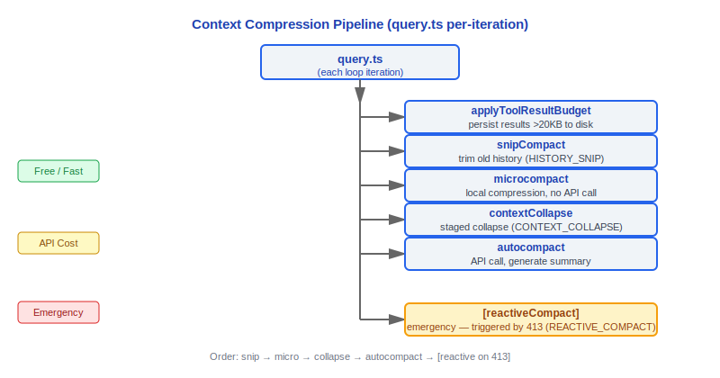
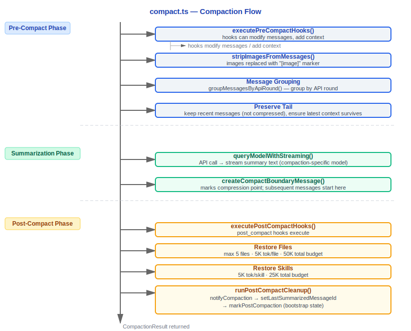

# 上下文管理 - Context Management

> 源文件: `src/services/compact/` (11 文件), `src/query/tokenBudget.ts`,
> `src/services/api/claude.ts` (getCacheControl), `src/utils/context.ts`,
> `src/utils/tokens.ts`

---

## 1. 架构概览

Claude Code 的上下文管理系统确保对话始终在模型的上下文窗口限制内运行。它通过三层压缩管线、Token 预算追踪和提示缓存协同工作。



---

## 2. 三层压缩管线

### 设计理念

#### 为什么3层而不是1层？

三层压缩管线的设计类比 CPU 缓存层级（L1/L2/L3）或 JVM GC 分代（young/old/permanent）——不同层级处理不同时间尺度和成本级别的问题：

- **Microcompact（免费，每次迭代运行）**: 清理旧工具结果，将过时内容替换为 `[Old tool result content cleared]`，几乎无计算成本
- **Autocompact（API 调用，阈值触发）**: 调用 Claude 生成摘要替换整段对话历史，需要消耗 API 调用额度
- **Reactive（应急，413 触发）**: 最后的安全网，只在 API 返回 `prompt_too_long` 错误时触发

如果只有一层会怎样？

| 单层方案 | 后果 |
|---------|------|
| 只用 microcompact | 20-30 轮后 context 仍然爆炸——microcompact 只替换工具结果，不压缩对话本身 |
| 只用 autocompact | 每轮都浪费 API 调用——源码显示 `AUTOCOMPACT_BUFFER_TOKENS = 13_000`（`autoCompact.ts:62`）正是为了避免频繁触发 |
| 只用 reactive | 每次都触发 413 错误再恢复，用户体验差，且 `hasAttemptedReactiveCompact` 标志限制每次循环仅尝试一次（`query.ts`） |

三层递进设计让 90% 的情况由免费的 microcompact 处理，剩余由 autocompact 兜底，reactive 仅作最终安全网。

#### 为什么 AUTOCOMPACT_BUFFER = 13,000 tokens？

```typescript
// autoCompact.ts:62
export const AUTOCOMPACT_BUFFER_TOKENS = 13_000
```

这个值是性能与安全的平衡点：

- **太小（5K）**: 频繁触发 autocompact，每次都是 API 调用，浪费费用和延迟
- **太大（30K）**: 距离硬限制太远，大量可用上下文空间被浪费
- **13K**: 对于 200K context window（有效 180K），阈值为 167K，约 **93% 利用率**——既充分利用窗口，又留出安全余量不触发 413

#### 为什么压缩后最多恢复 5 个文件？

```typescript
// compact.ts:122-124
export const POST_COMPACT_MAX_FILES_TO_RESTORE = 5
export const POST_COMPACT_TOKEN_BUDGET = 50_000
export const POST_COMPACT_MAX_TOKENS_PER_FILE = 5_000
```

压缩会丢失文件内容，但模型可能正在编辑这些文件。恢复最近读取/编辑的文件让模型不会"失忆"正在进行的工作。5 个文件 + 50K token 是经验阈值——恢复太多文件会抵消压缩效果，使压缩后的 context 重新膨胀。

#### 为什么断路器设为 3 次连续失败？

```typescript
// autoCompact.ts:67-70
// BQ 2026-03-10: 1,279 sessions had 50+ consecutive failures (up to 3,272)
// in a single session, wasting ~250K API calls/day globally.
const MAX_CONSECUTIVE_AUTOCOMPACT_FAILURES = 3
```

来自生产数据：发现 1,279 个会话有 50+ 次连续 autocompact 失败（最高 3,272 次），全局浪费约 250K API 调用/天。3 次失败说明上下文结构性地超出模型摘要能力，继续重试没有意义。源码注释（`autoCompact.ts:345`）明确记录了断路器跳闸时的警告日志。

#### 为什么 snipTokensFreed 要传递给 autocompact？

```typescript
// query.ts:397-399
// snipTokensFreed is plumbed to autocompact so its threshold check reflects
// what snip removed; tokenCountWithEstimation alone can't see it (reads usage
// from the protected-tail assistant, which survives snip unchanged).
```

Snip 裁剪后，`tokenCountWithEstimation` 仍然从保留尾部助手消息的 `usage` 字段读取旧值，会高估当前大小。如果不传递 `snipTokensFreed`，autocompact 会在 snip 已经将 context 降到阈值以下时仍然误触发，浪费 API 调用。源码中 `autoCompact.ts:225` 的 `tokenCount = tokenCountWithEstimation(messages) - snipTokensFreed` 证实了这一修正。

---

### 2.1 第一层: Microcompact — 无 API 调用的本地压缩

#### 文件位置

`src/services/compact/microCompact.ts`

#### 核心机制

Microcompact 在不调用 API 的情况下缩减上下文大小。它操作工具结果内容，将旧的、不再相关的结果替换为占位符。

#### COMPACTABLE_TOOLS 集合

只有以下工具的结果会被微压缩：

```typescript
const COMPACTABLE_TOOLS = new Set<string>([
  FILE_READ_TOOL_NAME,      // FileRead
  ...SHELL_TOOL_NAMES,      // Bash, PowerShell
  GREP_TOOL_NAME,           // Grep
  GLOB_TOOL_NAME,           // Glob
  WEB_SEARCH_TOOL_NAME,     // WebSearch
  WEB_FETCH_TOOL_NAME,      // WebFetch
  FILE_EDIT_TOOL_NAME,      // FileEdit
  FILE_WRITE_TOOL_NAME,     // FileWrite
])
```

#### 清除消息

```typescript
export const TIME_BASED_MC_CLEARED_MESSAGE = '[Old tool result content cleared]'
```

当旧工具结果被清除时，内容被替换为此占位符消息。

#### 图像处理

```typescript
const IMAGE_MAX_TOKEN_SIZE = 2000
```

图像内容有独立的 token 大小估算上限。

#### 缓存微压缩 (Cached Microcompact, ant-only)

Feature flag `CACHED_MICROCOMPACT` 启用时，微压缩结果会被缓存：

```typescript
// 缓存编辑块 — 在 API 请求中作为 cache_edits 发送
export function consumePendingCacheEdits(): CacheEditsBlock | null
export function getPinnedCacheEdits(): PinnedCacheEdits[]
```

这允许在不重新计算的情况下重用之前的微压缩结果。

#### 时间基础 MC 配置

```typescript
// timeBasedMCConfig.ts
export type TimeBasedMCConfig = {
  enabled: boolean
  maxAge: number        // 最大年龄 (ms)
  // ...
}
```

#### 执行时机

微压缩在 `query.ts` 循环中 autocompact 之前运行：

```typescript
const microcompactResult = await deps.microcompact(
  messagesForQuery,
  toolUseContext,
  querySource,
)
messagesForQuery = microcompactResult.messages
```

---

### 2.2 第二层: Autocompact — API 调用的自动压缩

#### 文件位置

`src/services/compact/autoCompact.ts`

#### 核心常量

```typescript
export const AUTOCOMPACT_BUFFER_TOKENS = 13_000       // 压缩缓冲区
export const WARNING_THRESHOLD_BUFFER_TOKENS = 20_000  // 警告阈值缓冲区
export const ERROR_THRESHOLD_BUFFER_TOKENS = 20_000    // 错误阈值缓冲区
export const MANUAL_COMPACT_BUFFER_TOKENS = 3_000      // 手动压缩缓冲区
```

#### 有效上下文窗口计算

```typescript
// autoCompact.ts, line 33
export function getEffectiveContextWindowSize(model: string): number {
  const reservedTokensForSummary = Math.min(
    getMaxOutputTokensForModel(model),
    MAX_OUTPUT_TOKENS_FOR_SUMMARY,     // 20,000
  )
  let contextWindow = getContextWindowForModel(model, getSdkBetas())

  // 环境变量覆盖
  const autoCompactWindow = process.env.CLAUDE_CODE_AUTO_COMPACT_WINDOW
  if (autoCompactWindow) {
    contextWindow = Math.min(contextWindow, parseInt(autoCompactWindow, 10))
  }

  return contextWindow - reservedTokensForSummary
}
```

**公式**: `effectiveContextWindow = contextWindow - min(maxOutput, 20000)`

**示例**: 200K 上下文 → 有效 180K（预留 20K 给压缩摘要输出）

#### 自动压缩阈值

```typescript
export function getAutoCompactThreshold(model: string): number {
  return getEffectiveContextWindowSize(model) - AUTOCOMPACT_BUFFER_TOKENS
  // 例: 180,000 - 13,000 = 167,000 tokens
}
```

#### 追踪状态

```typescript
export type AutoCompactTrackingState = {
  compacted: boolean         // 是否已发生压缩
  turnCounter: number        // 压缩后的轮次计数
  turnId: string             // 唯一轮次 ID
  consecutiveFailures?: number  // 连续失败次数
}
```

#### 断路器: 最大连续失败

```typescript
const MAX_CONSECUTIVE_AUTOCOMPACT_FAILURES = 3
```

当连续失败达到 3 次时，停止尝试 autocompact。这是因为在分析中发现 1,279 个会话有 50+ 次连续失败（最高 3,272 次），浪费了约 250K API 调用/天。

#### Token 警告状态

```typescript
export function calculateTokenWarningState(
  tokenCount: number,
  model: string,
): 'normal' | 'warning' | 'error'
```

- **normal**: tokenCount < (threshold - WARNING_THRESHOLD_BUFFER)
- **warning**: tokenCount < (threshold - ERROR_THRESHOLD_BUFFER) 但超过 warning
- **error**: tokenCount >= (threshold - ERROR_THRESHOLD_BUFFER)

#### 执行流程

```typescript
const { compactionResult, consecutiveFailures } = await deps.autocompact(
  messagesForQuery,
  toolUseContext,
  {
    systemPrompt,
    userContext,
    systemContext,
    toolUseContext,
    forkContextMessages: messagesForQuery,
  },
  querySource,
  tracking,
  snipTokensFreed,
)
```

---

### 2.3 第三层: Reactive Compact — 413 触发的应急压缩

#### Feature Gate

```typescript
const reactiveCompact = feature('REACTIVE_COMPACT')
  ? require('./services/compact/reactiveCompact.js')
  : null
```

#### 触发条件

当 API 返回 413 (prompt_too_long) 错误时触发。

#### 限制

- 每次循环迭代仅尝试一次 (`hasAttemptedReactiveCompact`)
- 如果压缩后仍然 413，终止循环 (`reason: 'prompt_too_long'`)

#### 在 query.ts 中的位置

```typescript
// 在 API 调用错误处理中
if (isPromptTooLong && !hasAttemptedReactiveCompact && reactiveCompact) {
  // 尝试压缩
  const result = await reactiveCompact.compactOnPromptTooLong(...)
  if (result.success) {
    state = { ...state, hasAttemptedReactiveCompact: true, messages: result.messages }
    continue  // 重试 API 调用
  }
}
```

---

## 3. 压缩核心实现 (compact.ts)

### 3.1 文件位置

`src/services/compact/compact.ts`

### 3.2 核心常量

```typescript
export const POST_COMPACT_MAX_FILES_TO_RESTORE = 5         // 压缩后最多恢复的文件数
export const POST_COMPACT_TOKEN_BUDGET = 50_000             // 压缩后 token 预算
export const POST_COMPACT_MAX_TOKENS_PER_FILE = 5_000       // 每个文件最大 token
export const POST_COMPACT_MAX_TOKENS_PER_SKILL = 5_000      // 每个技能最大 token
export const POST_COMPACT_SKILLS_TOKEN_BUDGET = 25_000       // 技能总 token 预算
const MAX_COMPACT_STREAMING_RETRIES = 2                      // 压缩流式重试次数
```

### 3.3 压缩流程



### 3.4 CompactionResult 类型

```typescript
export type CompactionResult = {
  summaryMessages: Message[]           // 摘要消息
  attachments: AttachmentMessage[]     // 附件消息（恢复的文件/技能）
  hookResults: HookResultMessage[]     // 钩子结果
  preCompactTokenCount: number         // 压缩前 token 数
  postCompactTokenCount: number        // 压缩后 token 数
  truePostCompactTokenCount: number    // 真实压缩后 token 数
  compactionUsage: BetaUsage | null    // 压缩 API 使用量
}
```

### 3.5 buildPostCompactMessages()

```typescript
export function buildPostCompactMessages(result: CompactionResult): Message[]
```

组装压缩后的完整消息列表：
1. 压缩边界消息（标记点）
2. 摘要消息（AI 生成的对话摘要）
3. 附件消息（恢复的文件和技能内容）
4. 钩子结果消息

---

## 4. Token 预算追踪

### 4.1 BudgetTracker

详见 `query-engine.md` 第 8 节。核心要点：

```typescript
export type BudgetTracker = {
  continuationCount: number       // 已继续次数
  lastDeltaTokens: number         // 上次 delta
  lastGlobalTurnTokens: number    // 上次全局轮次 token 数
  startedAt: number               // 开始时间戳
}
```

### 4.2 决策逻辑

```
COMPLETION_THRESHOLD = 0.9 (90%)
DIMINISHING_THRESHOLD = 500 tokens

if (agentId || budget === null) → stop
if (!isDiminishing && turnTokens < budget * 90%) → continue
if (continuationCount >= 3 && delta < 500 for 2 consecutive) → stop (diminishing returns)
```

### 4.3 与 Task Budget 的区别

| 维度 | Token Budget | Task Budget |
|------|-------------|-------------|
| 来源 | 客户端配置 | API output_config.task_budget |
| 控制对象 | 自动继续行为 | 服务端 token 分配 |
| 跨压缩 | 独立追踪 | 需要 remaining 计算 |
| 子代理 | 跳过 | 传递到子代理 |

---

## 5. 上下文折叠 (Context Collapse)

### 5.1 Feature Gate

```typescript
const contextCollapse = feature('CONTEXT_COLLAPSE')
  ? require('./services/contextCollapse/index.js')
  : null
```

### 5.2 分阶段折叠

上下文折叠是 autocompact 的前置步骤，它在不调用 API 的情况下缩减上下文：

```typescript
if (feature('CONTEXT_COLLAPSE') && contextCollapse) {
  const collapseResult = await contextCollapse.applyCollapsesIfNeeded(
    messagesForQuery,
    toolUseContext,
    querySource,
  )
  messagesForQuery = collapseResult.messages
}
```

### 5.3 设计特点

- **读时投影**: 折叠视图是在读取时投射的，不修改原始消息
- **提交日志**: 折叠操作作为 commit log 记录，`projectView()` 在每次入口处重放
- **跨轮次持久化**: 折叠结果通过 `state.messages` 在 continue 站点传递
- **与 autocompact 的关系**: 如果折叠足以降到 autocompact 阈值以下，则 autocompact 不触发，保留更细粒度的上下文

### 5.4 Prompt-Too-Long 时的排空

当 prompt_too_long 错误发生时，context collapse 可以执行更激进的折叠（drain）操作。

---

## 6. 提示缓存 (Prompt Caching)

### 6.1 getCacheControl()

```typescript
// services/api/claude.ts
export function getCacheControl(
  scope?: CacheScope,
): { type: 'ephemeral'; ttl?: number } | undefined
```

### 6.2 TTL 策略

- **基础**: `{ type: 'ephemeral' }` — 默认短期缓存
- **TTL 扩展**: `{ type: 'ephemeral', ttl: 3600 }` — 1 小时 TTL
  - 条件: `isFirstPartyAnthropicBaseUrl()` 且非第三方网关
  - 对符合条件的用户启用

### 6.3 缓存范围

```typescript
export type CacheScope = 'global' | undefined
```

- **global**: 跨用户缓存（系统提示在用户间一致时可用）
- **undefined**: 默认会话级缓存

### 6.4 全局缓存策略

```typescript
export type GlobalCacheStrategy = 'tool_based' | 'system_prompt' | 'none'
```

| 策略 | 位置 | 效果 |
|------|------|------|
| `tool_based` | 工具定义上的 cache_control | 工具定义被缓存 |
| `system_prompt` | 系统提示最后一个 block | 系统提示被缓存 |
| `none` | 不设置 | 无缓存控制 |

### 6.5 缓存中断检测

```typescript
// promptCacheBreakDetection.ts
notifyCompaction()       // 压缩发生时通知
notifyCacheDeletion()    // 微压缩删除内容时通知
```

这些通知用于追踪缓存命中率变化。

---

## 7. Snip Compact — 历史裁剪

### 7.1 Feature Gate

```typescript
const snipModule = feature('HISTORY_SNIP')
  ? require('./services/compact/snipCompact.js')
  : null
```

### 7.2 执行位置

在 microcompact 之前运行（两者不互斥，可以同时运行）：

```typescript
if (feature('HISTORY_SNIP')) {
  const snipResult = snipModule!.snipCompactIfNeeded(messagesForQuery)
  messagesForQuery = snipResult.messages
  snipTokensFreed = snipResult.tokensFreed
  if (snipResult.boundaryMessage) {
    yield snipResult.boundaryMessage
  }
}
```

### 7.3 与其他压缩的关系

`snipTokensFreed` 被传递到 autocompact，使阈值检查反映 snip 移除的内容。否则，stale 的 `tokenCountWithEstimation`（从保留尾部助手消息的 usage 中读取）会报告压缩前的大小，导致误报阻塞。

---

## 8. 消息分组 (grouping.ts)

```typescript
// compact/grouping.ts
export function groupMessagesByApiRound(messages: Message[]): MessageGroup[]
```

将消息按 API 轮次分组：
- 一个 "轮次" = user message + assistant message + tool results
- 分组用于压缩时决定哪些轮次可以被摘要化

---

## 9. 压缩警告系统

### 9.1 压缩警告钩子

```typescript
// compactWarningHook.ts
// 在上下文接近限制时显示警告
```

### 9.2 警告抑制

```typescript
// compactWarningState.ts
suppressCompactWarning()       // 暂时抑制警告
clearCompactWarningSuppression() // 清除抑制
```

当 auto-compact 成功后，警告被抑制（因为上下文已被压缩）。

---

## 10. 完整上下文管理数据流


---

## 11. 配置与环境变量

| 变量 | 默认值 | 用途 |
|------|--------|------|
| `CLAUDE_CODE_AUTO_COMPACT_WINDOW` | (none) | 覆盖上下文窗口大小 |
| `CLAUDE_AUTOCOMPACT_PCT_OVERRIDE` | (none) | 覆盖自动压缩百分比阈值 |
| `CLAUDE_CODE_MAX_OUTPUT_TOKENS` | (model default) | 覆盖最大输出 token |
| `CLAUDE_CODE_DISABLE_AUTO_COMPACT` | false | 禁用自动压缩 |

---

## 12. 关键设计决策

1. **三层递进**: microcompact (免费) → autocompact (API 调用) → reactive (应急)，按成本递增使用
2. **断路器**: 3 次连续失败后停止 autocompact，避免浪费 API 调用
3. **预留输出空间**: 总是预留 min(maxOutput, 20K) 给压缩摘要输出
4. **文件恢复优先**: 压缩后重新注入最重要的文件（最多 5 个，50K budget）
5. **技能恢复**: 技能内容在压缩后重新注入（25K budget），前置部分最关键
6. **缓存感知**: 压缩/微压缩操作通知缓存系统，追踪缓存命中率影响
7. **Snip → MC → Collapse → AC 顺序**: 先裁剪、再微压缩、再折叠、最后全量压缩

---

## 工程实践指南

### 诊断上下文膨胀

当怀疑对话消耗过多 token 时，按以下步骤排查：

1. **查看裸消息大小**：设置环境变量 `CLAUDE_CODE_DISABLE_AUTO_COMPACT=true` 禁用自动压缩，观察每轮对话后 token 计数的增长速度。这能暴露哪种工具结果消耗最多 token。
2. **检查工具结果占比**：重点关注 `Bash`、`FileRead`、`Grep` 等 COMPACTABLE_TOOLS 集合中的工具——它们的输出通常是上下文膨胀的主要来源。
3. **使用 `/context` 命令**：运行 `/context` 查看当前上下文使用情况，包括 token 警告状态（normal/warning/error）。
4. **检查 token 警告状态**：`calculateTokenWarningState()` 返回 `'warning'` 时表示接近阈值（距 autocompact 阈值不到 20K），`'error'` 表示极度接近。

### 调整压缩阈值

| 环境变量 | 作用 | 示例 |
|---------|------|------|
| `CLAUDE_AUTOCOMPACT_PCT_OVERRIDE` | 覆盖自动压缩百分比阈值，值为 0-100 的整数 | `CLAUDE_AUTOCOMPACT_PCT_OVERRIDE=80` 在 80% 时触发 |
| `CLAUDE_CODE_AUTO_COMPACT_WINDOW` | 覆盖上下文窗口大小（token 数），用于测试较小窗口下的压缩行为 | `CLAUDE_CODE_AUTO_COMPACT_WINDOW=50000` 模拟 50K 窗口 |
| `CLAUDE_CODE_DISABLE_AUTO_COMPACT` | 完全禁用自动压缩 | `CLAUDE_CODE_DISABLE_AUTO_COMPACT=true` |

调整步骤：
1. 先用 `CLAUDE_CODE_DISABLE_AUTO_COMPACT=true` 观察自然膨胀速率
2. 根据工作模式选择合适的百分比：短对话可设高（90%），长对话设低（70-80%）
3. 如需测试压缩逻辑，用 `CLAUDE_CODE_AUTO_COMPACT_WINDOW` 设小窗口快速触发压缩

### 自定义压缩行为

通过 `pre_compact` / `post_compact` 钩子注入自定义逻辑：

```json
// settings.json
{
  "hooks": {
    "PreCompact": [
      {
        "type": "bash",
        "command": "echo '即将压缩，当前时间: $(date)' >> /tmp/compact.log"
      }
    ],
    "PostCompact": [
      {
        "type": "bash",
        "command": "echo '压缩完成' >> /tmp/compact.log"
      }
    ]
  }
}
```

典型用途：
- **PreCompact**: 在压缩前保存关键上下文信息到外部存储（如项目笔记文件）
- **PostCompact**: 压缩后重新注入关键指令或检查摘要质量

源码中 `compact.ts:408` 执行 `executePreCompactHooks()`，`compact.ts:721` 执行 `executePostCompactHooks()`，钩子结果会作为 `HookResultMessage` 附加到压缩后消息中。

### 添加新的 COMPACTABLE_TOOLS

如果开发了新工具且其输出结果较大，需要加入微压缩范围：

1. 打开 `src/services/compact/microCompact.ts`
2. 在 `COMPACTABLE_TOOLS` 集合中添加工具名常量：
   ```typescript
   const COMPACTABLE_TOOLS = new Set<string>([
     FILE_READ_TOOL_NAME,
     ...SHELL_TOOL_NAMES,
     // ... 已有工具
     YOUR_NEW_TOOL_NAME,  // 新增
   ])
   ```
3. 同时检查 `apiMicrocompact.ts` 中的对应集合是否也需要更新（API 级微压缩有独立的工具列表，包含 `NOTEBOOK_EDIT_TOOL_NAME` 等额外工具）
4. 确保工具的 `tool_result` 内容格式与 `collectCompactableToolIds()` 的遍历逻辑兼容

### 常见陷阱

> **Autocompact 调用 API = 花钱**
> 每次 autocompact 触发都是一次 API 调用，会消耗费用和增加延迟。不要将阈值设得过低（如 50%），否则频繁触发。`AUTOCOMPACT_BUFFER_TOKENS = 13,000` 的默认值在 200K 窗口下对应约 93% 利用率，是经过验证的平衡点。

> **断路器 3 次失败后停止**
> 源码 `autoCompact.ts:67-70` 注释记录了真实生产数据：1,279 个会话出现过 50+ 次连续 autocompact 失败（最高 3,272 次），全局浪费约 250K API 调用/天。断路器触发后（`consecutiveFailures >= 3`），本会话不再尝试 autocompact。如果遇到断路器跳闸，检查上下文是否结构性地超出模型摘要能力——可能需要手动 `/compact` 或开始新会话。

> **压缩会丢失文件内容**
> 压缩后系统最多恢复 `POST_COMPACT_MAX_FILES_TO_RESTORE = 5` 个最近读取/编辑的文件，每个文件最大 5K tokens，总预算 50K tokens。超出此范围的文件内容会丢失。如果正在编辑多个文件，压缩后模型可能"失忆"部分文件——此时需要重新 Read 相关文件。

> **snipTokensFreed 必须正确传递**
> 如果修改了 snip 或 autocompact 相关逻辑，务必确保 `snipTokensFreed` 从 snipCompact 传递到 autocompact（`query.ts:397-399`）。否则 autocompact 的阈值检查会基于过时的 token 计数，导致不必要的 API 调用。

> **Reactive compact 仅尝试一次**
> `hasAttemptedReactiveCompact` 标志限制每次循环迭代仅尝试一次应急压缩。如果压缩后仍然 413，循环终止（`reason: 'prompt_too_long'`）。不要依赖 reactive compact 作为常规压缩手段。


---

[← 权限与安全](../06-权限与安全/permission-security.md) | [目录](../README.md) | [MCP 集成 →](../08-MCP集成/mcp-integration.md)
