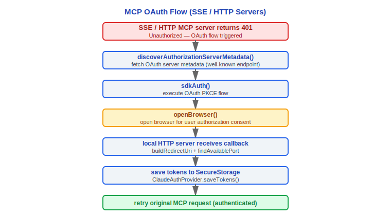

# MCP Integration

> Model Context Protocol integration in Claude Code v2.1.88: configuration loading, transport layers, tool wrapping, authentication, resource system.

---

## 1. Configuration Loading — Three-Tier Sources

MCP server configurations are merged from three levels, managed uniformly by `getAllMcpConfigs()` / `getClaudeCodeMcpConfigs()` in `src/services/mcp/config.ts`:

### 1.1 User Level (user / local)

- **~/.claude.json** `mcpServers` field — `scope: 'user'`
- **~/.claude/settings.json** `mcpServers` field — `scope: 'local'` (legacy path compatibility)

### 1.2 Project Level (project)

- **.mcp.json** — standalone MCP configuration file in project root — `scope: 'project'`
- **.claude/settings.json** `mcpServers` field — `scope: 'project'`

Project-level MCP servers require explicit user approval (`handleMcpjsonServerApprovals`). Unapproved servers will not connect.

#### Why do project-level MCP servers require explicit user approval?

Project `.mcp.json` files can be modified by malicious code (supply chain attacks). Unapproved MCP servers could execute arbitrary code. The `handleMcpjsonServerApprovals()` function in `mcpServerApproval.tsx:15` intercepts project-level configurations at startup and requires user confirmation. User-level configurations (`~/.claude.json`) don't require approval because users have complete control over their home directory configuration files—different attack surfaces require different security policies.

### 1.3 Enterprise / Managed Level (enterprise / managed / claudeai)

- **managed-mcp.json** — path returned by `getEnterpriseMcpFilePath()` — `scope: 'enterprise'`
- **Remote managed settings** — `scope: 'managed'` — distributed via `remoteManagedSettings`
- **Claude.ai MCP** — `fetchClaudeAIMcpConfigsIfEligible()` — `scope: 'claudeai'`

### Configuration Merging

```typescript
function addScopeToServers(
  servers: Record<string, McpServerConfig> | undefined,
  scope: ConfigScope
): Record<string, ScopedMcpServerConfig>
```

`ConfigScope` enum values: `'local' | 'user' | 'project' | 'dynamic' | 'enterprise' | 'claudeai' | 'managed'`

When enterprise MCP configuration exists, `areMcpConfigsAllowedWithEnterpriseMcpConfig()` can restrict configurations from other sources. `filterMcpServersByPolicy()` filters by policy.

---

## 2. getAllMcpConfigs and Connection Management

### 2.1 useManageMCPConnections Hook

`src/services/mcp/useManageMCPConnections.ts` is the React Hook for MCP connection management, responsible for:

1. Calling `getMcpToolsCommandsAndResources()` to fetch tools/commands/resources from all MCP servers
2. Listening to `ToolListChangedNotification` / `PromptListChangedNotification` / `ResourceListChangedNotification`
3. Fetching MCP skills on demand (`feature('MCP_SKILLS')` gated)
4. Maintaining `MCPServerConnection` state and updating AppState

### 2.2 Connection Lifecycle


`clearServerCache()` clears all cached server connections. `reconnectMcpServerImpl()` handles single-server reconnection.

---

## 3. Four Transport Layers

`src/services/mcp/types.ts` defines the transport type enum:

```typescript
export const TransportSchema = z.enum(['stdio', 'sse', 'sse-ide', 'http', 'ws', 'sdk'])
```

### Design Philosophy

#### Why 4+ transports instead of a unified protocol?

Different deployment environments have fundamentally different constraints. No single transport can satisfy all scenarios:

| Transport | Characteristics | Use Cases |
|-----------|----------------|-----------|
| **stdio** | Local subprocess, zero network latency, simplest | Built-in tools, local SDK servers |
| **SSE** | Unidirectional server push, firewall-friendly | Monitoring tools that only need reads, HTTP/1.1 compatible environments |
| **HTTP** (Streamable) | Stateless request/response, easy load balancing | Cloud functions/serverless architectures |
| **WebSocket** | Full-duplex bidirectional streaming | Complex tools requiring real-time interaction |

The `TransportSchema` in the source code (`types.ts:23`) also includes `sse-ide` (IDE extension-specific) and `sdk` (Agent SDK built-in) internal transports, indicating that the transport layer needs to continuously expand with integration scenarios. Enterprise firewalls may not allow WebSocket upgrades, and local development doesn't need network overhead—a unified protocol would become an obstacle in certain scenarios.

---

### 3.1 stdio Transport

```typescript
// McpStdioServerConfig
{
  type: 'stdio',        // optional (backward compatible)
  command: string,       // executable command
  args: string[],        // command arguments
  env?: Record<string, string>  // environment variables
}
```

Uses `StdioClientTransport` (from `@modelcontextprotocol/sdk/client/stdio.js`), communicating via subprocess stdin/stdout. Environment variables support `${VAR}` syntax expansion through `expandEnvVarsInString()`.

### 3.2 SSE Transport

```typescript
// McpSSEServerConfig
{
  type: 'sse',
  url: string,
  headers?: Record<string, string>,
  headersHelper?: string,    // external command to generate dynamic headers
  oauth?: McpOAuthConfig     // OAuth configuration
}
```

Uses `SSEClientTransport` (from `@modelcontextprotocol/sdk/client/sse.js`), supporting proxy configuration and custom headers.

### 3.3 HTTP (Streamable HTTP) Transport

```typescript
// McpHTTPServerConfig
{
  type: 'http',
  url: string,
  headers?: Record<string, string>,
  headersHelper?: string,
  oauth?: McpOAuthConfig
}
```

Uses `StreamableHTTPClientTransport` (from `@modelcontextprotocol/sdk/client/streamableHttp.js`), supporting the same OAuth and proxy configuration as SSE.

### 3.4 WebSocket Transport

```typescript
// McpWebSocketServerConfig
{
  type: 'ws',
  url: string,
  headers?: Record<string, string>,
  headersHelper?: string,
  oauth?: McpOAuthConfig
}
```

Uses custom-implemented `WebSocketTransport` (`src/utils/mcpWebSocketTransport.ts`), supporting mTLS (`getWebSocketTLSOptions`) and proxy (`getWebSocketProxyAgent` / `getWebSocketProxyUrl`).

### 3.5 Internal Transports

- **sse-ide** — IDE extension-specific SSE transport (`McpSSEIDEServerConfig`), carrying `ideName` field
- **sdk** — SDK control transport (`SdkControlTransport`), used for Agent SDK built-in MCP
- **InProcessTransport** — In-process transport (`src/services/mcp/InProcessTransport.ts`), used for embedded MCP

---

## 4. getMcpToolsCommandsAndResources

Core function in `src/services/mcp/client.ts`, orchestrating parallel connection and data fetching for all MCP servers:

```typescript
export async function getMcpToolsCommandsAndResources(
  configs: Record<string, ScopedMcpServerConfig>,
  ...
): Promise<{
  tools: Tool[],
  commands: Command[],
  resources: ServerResource[],
  serverConnections: MCPServerConnection[]
}>
```

For each server:
1. Create `Client` instance (`@modelcontextprotocol/sdk/client`)
2. Establish transport connection
3. Call `tools/list`, `prompts/list`, `resources/list` in parallel
4. Wrap MCP tools as `MCPTool`, wrap prompts as `Command`
5. Detect code indexing servers (`detectCodeIndexingFromMcpServerName`)

---

## 5. MCPTool Wrapper

`src/tools/MCPTool/MCPTool.ts` adapts MCP tool protocol to Claude Code's `Tool` interface:

### Tool Naming Convention

```
mcp__<server_name>__<tool_name>
```

Examples: `mcp__github__create_issue`, `mcp__filesystem__read_file`

Special characters in server names and tool names are normalized through `mcpStringUtils.ts`.

### MCPTool Features

- **Input validation** — Converts MCP tool's `inputSchema` to Zod schema for validation
- **Progress reporting** — `MCPProgress` type tracks tool execution progress
- **Content transformation** — MCP response content (text/image/resource_link) converted to Anthropic `ContentBlockParam`
- **Image processing** — Automatically scales oversized images via `maybeResizeAndDownsampleImageBuffer()`
- **Binary content** — Persists binary data via `persistBinaryContent()`, returns saved path
- **Truncation protection** — `mcpContentNeedsTruncation()` / `truncateMcpContentIfNeeded()` prevents excessively long output

---

## 6. Lazy Loading — ToolSearchTool

To avoid injecting complete schemas of all MCP tools into the system prompt (consuming significant tokens), Claude Code adopts a **lazy loading** strategy:

1. System prompt only includes a list of MCP tool names
2. When the model needs to use a specific tool, it searches by name or keyword via `ToolSearchTool`
3. ToolSearchTool returns the complete JSON Schema definition of matching tools
4. The returned schema is injected into the `<functions>` block, allowing the model to call it normally

This design significantly reduces context consumption in MCP tool-intensive scenarios.

### Design Philosophy

#### Why lazy loading (ToolSearch) instead of loading all MCP tools at startup?

Each MCP tool's JSONSchema can be several KB. 10 MCP servers x 20 tools = consuming 5K-20K tokens in the system prompt. Context window is a scarce resource—injecting all schemas in full means significantly reduced effective conversation space for users.

Comments in the source code at `main.tsx:2688-2689` reveal the specific implementation:

```
// Print-mode MCP: per-server incremental push into headlessStore.
// Mirrors useManageMCPConnections — push pending first (so ToolSearch's
// pending-check at ToolSearchTool.ts:334 sees them), then replace with
// connected/failed as each server settles.
```

ToolSearch adds one extra model round-trip (search first, then call), but most sessions only use a few tools—the context space saved far exceeds this cost. This is why `commands/clear/caches.ts:132` specifically has logic to clear ToolSearch description cache (comment notes "~500KB for 50 MCP tools").

---

## 7. MCP Authentication

`src/services/mcp/auth.ts` implements the complete MCP OAuth authentication flow:

### 7.1 ClaudeAuthProvider

Custom `OAuthClientProvider` implementation with core methods:

- `clientInformation()` — Read client registration information from secure storage
- `tokens()` — Read OAuth tokens from secure storage
- `saveTokens()` — Write tokens to secure storage (SecureStorage)
- `redirectUrl()` — Build local callback URL (`buildRedirectUri` + `findAvailablePort`)

### 7.2 OAuth Flow



### 7.3 Step-up Authentication

For operations requiring additional permissions, MCP servers can return a step-up challenge:

```typescript
type MCPRefreshFailureReason =
  | 'metadata_discovery_failed'
  | 'no_client_info'
  | 'no_tokens_returned'
  | 'invalid_grant'
  | 'transient_retries_exhausted'
  | 'request_failed'
```

### 7.4 Token Refresh


### 7.5 Cross-App Access (XAA)

`xaaIdpLogin.ts` implements the Cross-App Access protocol (SEP-990):

- `isXaaEnabled()` — Check if XAA is enabled
- `acquireIdpIdToken()` — Obtain ID Token from IdP
- `performCrossAppAccess()` — Use ID Token for cross-app token exchange

XAA configuration is located at `settings.xaaIdp` (configure once, shared by all XAA servers).

---

## 8. MCP Resources

### 8.1 ListMcpResourcesTool

`src/tools/ListMcpResourcesTool/ListMcpResourcesTool.ts` — Lists all resources exposed by connected MCP servers.

### 8.2 ReadMcpResourceTool

`src/tools/ReadMcpResourceTool/ReadMcpResourceTool.ts` — Reads MCP resource content for a specified URI.

Resources are prefetched during connection via `fetchResourcesForClient()` and batch-loaded at startup via `prefetchAllMcpResources()`.

---

## 9. MCP Instructions Delta

MCP servers can provide system prompt supplements via the `instructions` field during initialization. These instructions are injected into the conversation context as `system-reminder` messages:

```xml
<system-reminder>
# MCP Server Instructions

The following MCP servers have provided instructions for how to use their tools and resources:

## server-name
Instructions text from the server...
</system-reminder>
```

Instructions are updated each time an MCP server connects/reconnects.

### Design Philosophy

#### Why are MCP Instructions injected as system-reminder?

MCP servers need to tell the model how to use their tools, but these instructions should not be confused with the user's system prompt. Both `prompts.ts:599` and `messages.ts:4220` in the source code inject instructions wrapped in `<system-reminder>` tags with the `# MCP Server Instructions` heading. This allows the model to distinguish between "core system instructions" and "MCP server instructions"—the latter has lower priority and can be safely removed when the server disconnects. The comment in `mcpInstructionsDelta.ts:30` further explains the relationship between this design and caching: delta mode avoids cache invalidation caused by rebuilding the system prompt every round.

---

## 10. Channel Permissions

`src/services/mcp/channelPermissions.ts` manages the permission model for MCP server channels:

- **Channel Allowlist** — `src/services/mcp/channelAllowlist.ts` maintains the list of allowed channels
- **ChannelPermissionCallbacks** — Permission callback interface handling channel-level authorization requests
- **Channel Notification** — `src/services/mcp/channelNotification.ts` handles channel event notifications
- **Elicitation Handler** — `src/services/mcp/elicitationHandler.ts` handles interactive requests from MCP servers (`ElicitRequestSchema`)

Channel permissions are configured via Bootstrap State's `allowedChannels: ChannelEntry[]`:

```typescript
type ChannelEntry =
  | { kind: 'plugin'; name: string; marketplace: string; dev?: boolean }
  | { kind: 'server'; name: string; dev?: boolean }
```

The `--channels` flag and `--dangerously-load-development-channels` flag control channel access policy. Entries with `dev: true` can bypass allowlist checks.

---

## Engineering Practice Guide

### Adding a New MCP Server

**Checklist:**

1. Add server definition in configuration file (choose appropriate level):
   - **User level**: Edit `mcpServers` field in `~/.claude.json`
   - **Project level**: Edit `.mcp.json` in project root
   - **Enterprise level**: Via `/etc/claude/managed-mcp.json` or MDM distribution

2. Configuration example (stdio transport):
   ```json
   {
     "mcpServers": {
       "my-server": {
         "type": "stdio",
         "command": "node",
         "args": ["/path/to/my-mcp-server.js"],
         "env": {
           "API_KEY": "${MY_API_KEY}"
         }
       }
     }
   }
   ```

3. Restart Claude Code or execute `/mcp reconnect` to apply configuration
4. Use `/mcp` command to check server connection status

### Debugging MCP Connections

Troubleshoot connection issues in the following order:

1. **Check transport type is correct**: Confirm `type` field matches the server's actual protocol (`stdio`/`sse`/`http`/`ws`). If `type` is omitted, defaults to `stdio`.
2. **Check process startup** (stdio transport):
   - Confirm `command` executable path is correct
   - Confirm `args` parameters are correct
   - Environment variables support `${VAR}` syntax expansion (`expandEnvVarsInString()`)
3. **Check network connection** (SSE/HTTP/WS transport):
   - Confirm `url` is reachable
   - Check if proxy configuration blocks connection
   - WebSocket transport supports mTLS (`getWebSocketTLSOptions`) and proxy (`getWebSocketProxyAgent`)
4. **Check authentication status** (servers requiring OAuth):
   - OAuth tokens are stored in `SecureStorage`
   - If 401 errors loop, try deleting cached tokens and re-authenticating
5. **Review source code comments**: `client.ts:1427` notes that `StdioClientTransport.close()` only sends abort signal, many MCP servers may not gracefully shut down—need to wait for process exit

### Creating Custom MCP Tools

1. Implement `Tool` interface using MCP SDK, define `inputSchema` (JSON Schema format)
2. Expose service via stdio or HTTP transport
3. Configure server connection in Claude Code
4. Tool naming format in Claude Code is `mcp__<server_name>__<tool_name>` (`mcpStringUtils.ts` normalizes special characters)
5. MCPTool wrapper automatically handles:
   - Input validation (MCP inputSchema → Zod schema conversion)
   - Progress reporting (`MCPProgress` type)
   - Automatic image scaling (`maybeResizeAndDownsampleImageBuffer()`)
   - Truncation of excessively long output (`mcpContentNeedsTruncation()` / `truncateMcpContentIfNeeded()`)

### OAuth Authentication Debugging

When MCP servers require OAuth authentication:

1. **Check tokens in SecureStorage**: Tokens are written to secure storage via `ClaudeAuthProvider.saveTokens()`
2. **Manually trigger refresh**: If access_token expires, `sdkRefreshAuthorization()` uses refresh_token to obtain new token
3. **Check PKCE parameters**: OAuth flow uses PKCE (`sdkAuth()`), confirm callback URL and port are available (`findAvailablePort`)
4. **Refresh failure reason classification**:
   - `invalid_grant` → re-execute full OAuth flow
   - `transient_retries_exhausted` → network issues, retry max 3 times
   - `metadata_discovery_failed` → OAuth server metadata endpoint unreachable
5. **XAA (Cross-App Access)**: If using `xaaIdp` configuration, check `isXaaEnabled()` and IdP ID Token acquisition flow. Source code `xaa.ts:133` notes mix-up protection validation (pending upstream SDK integration)

### Performance Optimization

- **Use ToolSearch lazy loading**: Avoid injecting complete schemas of all MCP tools into system prompt. 10 MCP servers x 20 tools can consume 5K-20K tokens. ToolSearch allows the model to search tool definitions on demand. Source code comment at `commands/clear/caches.ts:132` notes description cache for 50 MCP tools is approximately 500KB.
- **Batch prefetch resources**: `prefetchAllMcpResources()` batch-loads MCP resources at startup, avoiding runtime latency.
- **Connection reuse**: `clearServerCache()` disconnects all connections when clearing cache, `reconnectMcpServerImpl()` handles single-server reconnection—avoid unnecessary full reconnections.

### Common Pitfalls

> **Project-level MCP requires user approval**
> Project-level servers defined in `.mcp.json` must be approved via `handleMcpjsonServerApprovals()`. Unapproved servers will not connect. This is a security design—project files can be maliciously modified (supply chain attacks). User-level configurations (`~/.claude.json`) don't require approval.

> **MCP tool name format is `mcp__server__tool`**
> Double underscores as separators. Special characters in server names and tool names are normalized by `mcpStringUtils.ts`. When referencing MCP tools in hooks or permission rules, you must use the full `mcp__<server>__<tool>` format.

> **Instructions injection consumes context**
> MCP servers can inject system prompt supplements via the `instructions` field. These instructions are injected into context as `<system-reminder>` tags (`prompts.ts:599`), continuously consuming token budget. Instructions from multiple MCP servers can accumulate and significantly consume context. `mcpInstructionsDelta.ts:30` uses delta mode to avoid cache invalidation caused by rebuilding the system prompt every round.

> **SSE transport fetch doesn't use global proxy**
> Source code comment at `client.ts:643` notes: SSE transport's `eventSourceInit` must use fetch that doesn't go through the global proxy—this is an easily overlooked detail.

> **MCP server memoization adds complexity**
> TODO comment in source code at `client.ts:589` notes: MCP client memoization significantly increases code complexity, and performance benefits are uncertain. When modifying MCP connection logic, be aware of cache state consistency issues.


---

[← Context Management](../07-上下文管理/context-management-en.md) | [Index](../README_EN.md) | [Hooks System →](../09-Hooks系统/hooks-system-en.md)
