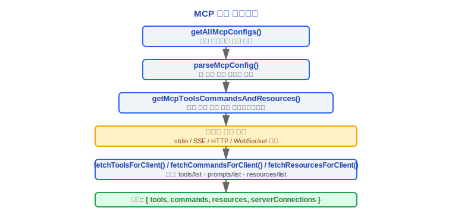
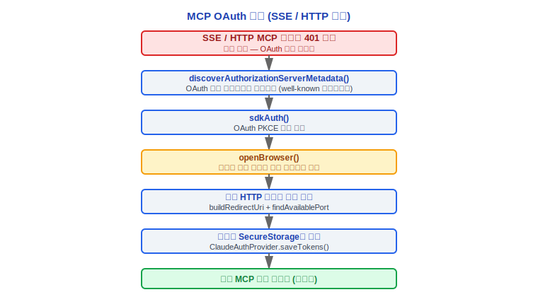
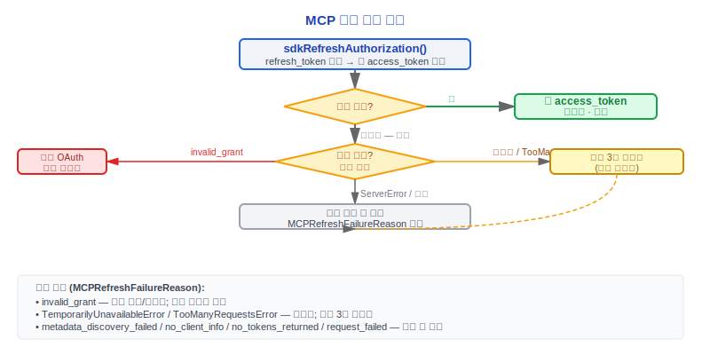

# MCP 통합(MCP Integration)

> Claude Code v2.1.88의 MCP(Model Context Protocol) 통합: 설정 로딩, 전송 레이어, 도구 래핑, 인증, 리소스 시스템.

---

## 1. 설정 로딩 — 3단계 소스

MCP(Model Context Protocol) 서버 설정은 세 가지 수준에서 병합되며, `src/services/mcp/config.ts`의 `getAllMcpConfigs()` / `getClaudeCodeMcpConfigs()`에 의해 통합 관리됩니다.

### 1.1 사용자 수준 (user / local)

- **~/.claude.json** `mcpServers` 필드 — `scope: 'user'`
- **~/.claude/settings.json** `mcpServers` 필드 — `scope: 'local'` (레거시 경로 호환성)

### 1.2 프로젝트 수준 (project)

- **.mcp.json** — 프로젝트 루트의 독립 MCP 설정 파일 — `scope: 'project'`
- **.claude/settings.json** `mcpServers` 필드 — `scope: 'project'`

프로젝트 수준 MCP 서버는 명시적인 사용자 승인이 필요합니다(`handleMcpjsonServerApprovals`). 미승인 서버는 연결되지 않습니다.

#### 프로젝트 수준 MCP 서버에 명시적 사용자 승인이 필요한 이유는?

프로젝트 `.mcp.json` 파일은 악성 코드(공급망 공격)에 의해 수정될 수 있습니다. 미승인 MCP 서버는 임의의 코드를 실행할 수 있습니다. `mcpServerApproval.tsx:15`의 `handleMcpjsonServerApprovals()` 함수는 시작 시 프로젝트 수준 설정을 가로채고 사용자 확인을 요구합니다. 사용자 수준 설정(`~/.claude.json`)은 사용자가 홈 디렉토리 설정 파일을 완전히 제어하기 때문에 승인이 필요하지 않습니다. 서로 다른 공격 표면에는 서로 다른 보안 정책이 필요합니다.

### 1.3 엔터프라이즈 / 관리 수준 (enterprise / managed / claudeai)

- **managed-mcp.json** — `getEnterpriseMcpFilePath()`가 반환하는 경로 — `scope: 'enterprise'`
- **원격 관리 설정** — `scope: 'managed'` — `remoteManagedSettings`를 통해 배포
- **Claude.ai MCP** — `fetchClaudeAIMcpConfigsIfEligible()` — `scope: 'claudeai'`

### 설정 병합

```typescript
function addScopeToServers(
  servers: Record<string, McpServerConfig> | undefined,
  scope: ConfigScope
): Record<string, ScopedMcpServerConfig>
```

`ConfigScope` 열거형 값: `'local' | 'user' | 'project' | 'dynamic' | 'enterprise' | 'claudeai' | 'managed'`

엔터프라이즈 MCP 설정이 존재하면 `areMcpConfigsAllowedWithEnterpriseMcpConfig()`가 다른 소스의 설정을 제한할 수 있습니다. `filterMcpServersByPolicy()`는 정책에 따라 필터링합니다.

---

## 2. getAllMcpConfigs와 연결 관리

### 2.1 useManageMCPConnections 훅

`src/services/mcp/useManageMCPConnections.ts`는 MCP 연결 관리를 위한 React 훅(Hook)으로 다음을 담당합니다.

1. `getMcpToolsCommandsAndResources()`를 호출하여 모든 MCP 서버에서 도구/명령/리소스를 가져옴
2. `ToolListChangedNotification` / `PromptListChangedNotification` / `ResourceListChangedNotification` 수신
3. 요청 시 MCP 스킬(Skills) 가져오기 (`feature('MCP_SKILLS')` 게이트)
4. `MCPServerConnection` 상태 유지 및 AppState 업데이트

### 2.2 연결 수명주기



`clearServerCache()`는 캐시된 모든 서버 연결을 지웁니다. `reconnectMcpServerImpl()`은 단일 서버 재연결을 처리합니다.

---

## 3. 4가지 전송 레이어

`src/services/mcp/types.ts`에서 전송 타입 열거형을 정의합니다.

```typescript
export const TransportSchema = z.enum(['stdio', 'sse', 'sse-ide', 'http', 'ws', 'sdk'])
```

### 설계 철학

#### 통합 프로토콜 대신 4가지 이상의 전송이 필요한 이유는?

다양한 배포 환경에는 근본적으로 다른 제약이 있습니다. 단일 전송으로는 모든 시나리오를 충족할 수 없습니다.

| 전송 | 특징 | 사용 사례 |
|-----------|----------------|-----------|
| **stdio** | 로컬 서브프로세스, 제로 네트워크 지연, 가장 단순 | 내장 도구, 로컬 SDK 서버 |
| **SSE** | 단방향 서버 푸시, 방화벽 친화적 | 읽기만 필요한 모니터링 도구, HTTP/1.1 호환 환경 |
| **HTTP** (Streamable) | 상태 없는 요청/응답, 로드 밸런싱 용이 | 클라우드 함수/서버리스 아키텍처 |
| **WebSocket** | 전이중 양방향 스트리밍 | 실시간 인터랙션이 필요한 복잡한 도구 |

소스 코드의 `TransportSchema`(`types.ts:23`)에는 `sse-ide`(IDE 확장 전용)와 `sdk`(에이전트 SDK 내장) 내부 전송도 포함되어 있어, 전송 레이어가 통합 시나리오에 따라 계속 확장되어야 함을 나타냅니다. 엔터프라이즈 방화벽은 WebSocket 업그레이드를 허용하지 않을 수 있고, 로컬 개발에는 네트워크 오버헤드가 필요하지 않습니다. 통합 프로토콜은 특정 시나리오에서 장애물이 될 수 있습니다.

---

### 3.1 stdio 전송

```typescript
// McpStdioServerConfig
{
  type: 'stdio',        // 선택사항 (하위 호환)
  command: string,       // 실행 명령어
  args: string[],        // 명령어 인수
  env?: Record<string, string>  // 환경 변수
}
```

`StdioClientTransport`(`@modelcontextprotocol/sdk/client/stdio.js`)를 사용하며, 서브프로세스 stdin/stdout을 통해 통신합니다. 환경 변수는 `expandEnvVarsInString()`을 통해 `${VAR}` 구문 확장을 지원합니다.

### 3.2 SSE 전송

```typescript
// McpSSEServerConfig
{
  type: 'sse',
  url: string,
  headers?: Record<string, string>,
  headersHelper?: string,    // 동적 헤더를 생성하는 외부 명령어
  oauth?: McpOAuthConfig     // OAuth 설정
}
```

`SSEClientTransport`(`@modelcontextprotocol/sdk/client/sse.js`)를 사용하며, 프록시 설정과 사용자 정의 헤더를 지원합니다.

### 3.3 HTTP (Streamable HTTP) 전송

```typescript
// McpHTTPServerConfig
{
  type: 'http',
  url: string,
  headers?: Record<string, string>,
  headersHelper?: string,
  oauth?: McpOAuthConfig
}
```

`StreamableHTTPClientTransport`(`@modelcontextprotocol/sdk/client/streamableHttp.js`)를 사용하며, SSE와 동일한 OAuth 및 프록시 설정을 지원합니다.

### 3.4 WebSocket 전송

```typescript
// McpWebSocketServerConfig
{
  type: 'ws',
  url: string,
  headers?: Record<string, string>,
  headersHelper?: string,
  oauth?: McpOAuthConfig
}
```

사용자 정의 구현 `WebSocketTransport`(`src/utils/mcpWebSocketTransport.ts`)를 사용하며, mTLS(`getWebSocketTLSOptions`)와 프록시(`getWebSocketProxyAgent` / `getWebSocketProxyUrl`)를 지원합니다.

### 3.5 내부 전송

- **sse-ide** — IDE 확장 전용 SSE 전송(`McpSSEIDEServerConfig`), `ideName` 필드 포함
- **sdk** — SDK 제어 전송(`SdkControlTransport`), 에이전트 SDK 내장 MCP에 사용
- **InProcessTransport** — 인프로세스 전송(`src/services/mcp/InProcessTransport.ts`), 임베디드 MCP에 사용

---

## 4. getMcpToolsCommandsAndResources

`src/services/mcp/client.ts`의 핵심 함수로, 모든 MCP 서버에 대한 병렬 연결 및 데이터 가져오기를 조율합니다.

```typescript
export async function getMcpToolsCommandsAndResources(
  configs: Record<string, ScopedMcpServerConfig>,
  ...
): Promise<{
  tools: Tool[],
  commands: Command[],
  resources: ServerResource[],
  serverConnections: MCPServerConnection[]
}>
```

각 서버에 대해:
1. `Client` 인스턴스 생성(`@modelcontextprotocol/sdk/client`)
2. 전송 연결 수립
3. `tools/list`, `prompts/list`, `resources/list` 병렬 호출
4. MCP 도구를 `MCPTool`로 래핑, 프롬프트를 `Command`로 래핑
5. 코드 인덱싱 서버 감지(`detectCodeIndexingFromMcpServerName`)

---

## 5. MCPTool 래퍼

`src/tools/MCPTool/MCPTool.ts`는 MCP 도구 프로토콜을 Claude Code의 `Tool` 인터페이스에 적응시킵니다.

### 도구 명명 규칙

```
mcp__<서버명>__<도구명>
```

예시: `mcp__github__create_issue`, `mcp__filesystem__read_file`

서버 이름과 도구 이름의 특수 문자는 `mcpStringUtils.ts`를 통해 정규화됩니다.

### MCPTool 기능

- **입력 검증** — MCP 도구의 `inputSchema`를 Zod 스키마로 변환하여 검증
- **진행 보고** — `MCPProgress` 타입으로 도구 실행 진행 상황 추적
- **콘텐츠 변환** — MCP 응답 콘텐츠(text/image/resource_link)를 Anthropic `ContentBlockParam`으로 변환
- **이미지 처리** — `maybeResizeAndDownsampleImageBuffer()`를 통해 큰 이미지 자동 스케일링
- **바이너리 콘텐츠** — `persistBinaryContent()`로 바이너리 데이터를 저장하고 저장 경로 반환
- **잘림 보호** — `mcpContentNeedsTruncation()` / `truncateMcpContentIfNeeded()`로 과도하게 긴 출력 방지

---

## 6. 지연 로딩(Lazy Loading) — ToolSearchTool

모든 MCP 도구의 완전한 스키마를 시스템 프롬프트에 주입하는 것(상당한 토큰 소비)을 방지하기 위해, Claude Code는 **지연 로딩** 전략을 채택합니다.

1. 시스템 프롬프트에는 MCP 도구 이름 목록만 포함
2. 모델이 특정 도구를 사용해야 할 때 `ToolSearchTool`을 통해 이름 또는 키워드로 검색
3. ToolSearchTool이 매칭되는 도구의 완전한 JSON Schema 정의를 반환
4. 반환된 스키마가 `<functions>` 블록에 주입되어 모델이 정상적으로 호출 가능

이 설계는 MCP 도구 집약적 시나리오에서 컨텍스트 소비를 크게 줄입니다.

### 설계 철학

#### 시작 시 모든 MCP 도구를 로딩하는 대신 지연 로딩(ToolSearch)을 사용하는 이유는?

각 MCP 도구의 JSONSchema는 수 KB가 될 수 있습니다. 10개의 MCP 서버 x 20개의 도구 = 시스템 프롬프트에서 5K~20K 토큰 소비. 컨텍스트 윈도우는 희소 자원으로, 모든 스키마를 완전히 주입하면 사용자의 실효 대화 공간이 크게 줄어듭니다.

소스 코드 `main.tsx:2688-2689`의 주석은 구체적인 구현을 보여줍니다.

```
// 프린트 모드 MCP: 서버별 점진적 푸시를 headlessStore로.
// useManageMCPConnections를 반영 — pending을 먼저 푸시(ToolSearch의
// ToolSearchTool.ts:334의 pending-check가 볼 수 있도록),
// 그 다음 각 서버가 정착할 때 connected/failed로 교체.
```

ToolSearch는 추가 모델 라운드트립(먼저 검색, 그 다음 호출)을 추가하지만, 대부분의 세션은 몇 가지 도구만 사용합니다. 절약된 컨텍스트 공간이 이 비용을 훨씬 초과합니다. 이것이 `commands/clear/caches.ts:132`에 ToolSearch 설명 캐시를 지우는 로직이 있는 이유입니다(주석에 "50개의 MCP 도구에 대해 ~500KB"라고 명시).

---

## 7. MCP 인증

`src/services/mcp/auth.ts`는 완전한 MCP OAuth 인증 흐름을 구현합니다.

### 7.1 ClaudeAuthProvider

핵심 메서드를 포함한 사용자 정의 `OAuthClientProvider` 구현:

- `clientInformation()` — 보안 저장소에서 클라이언트 등록 정보 읽기
- `tokens()` — 보안 저장소에서 OAuth 토큰 읽기
- `saveTokens()` — 보안 저장소(SecureStorage)에 토큰 쓰기
- `redirectUrl()` — 로컬 콜백 URL 구성(`buildRedirectUri` + `findAvailablePort`)

### 7.2 OAuth 흐름



### 7.3 스텝업 인증(Step-up Authentication)

추가 권한이 필요한 작업의 경우 MCP 서버는 스텝업 챌린지를 반환할 수 있습니다.

```typescript
type MCPRefreshFailureReason =
  | 'metadata_discovery_failed'
  | 'no_client_info'
  | 'no_tokens_returned'
  | 'invalid_grant'
  | 'transient_retries_exhausted'
  | 'request_failed'
```

### 7.4 토큰 갱신



### 7.5 크로스 앱 접근(XAA)

`xaaIdpLogin.ts`는 크로스 앱 접근(Cross-App Access) 프로토콜(SEP-990)을 구현합니다.

- `isXaaEnabled()` — XAA 활성화 여부 확인
- `acquireIdpIdToken()` — IdP에서 ID 토큰 획득
- `performCrossAppAccess()` — ID 토큰을 이용한 크로스 앱 토큰 교환

XAA 설정은 `settings.xaaIdp`에 위치합니다(한 번 설정하면 모든 XAA 서버에서 공유됨).

---

## 8. MCP 리소스

### 8.1 ListMcpResourcesTool

`src/tools/ListMcpResourcesTool/ListMcpResourcesTool.ts` — 연결된 MCP 서버가 노출한 모든 리소스를 나열합니다.

### 8.2 ReadMcpResourceTool

`src/tools/ReadMcpResourceTool/ReadMcpResourceTool.ts` — 지정된 URI의 MCP 리소스 내용을 읽습니다.

리소스는 연결 중에 `fetchResourcesForClient()`를 통해 미리 가져오고, 시작 시 `prefetchAllMcpResources()`를 통해 일괄 로드됩니다.

---

## 9. MCP 지침 델타(MCP Instructions Delta)

MCP 서버는 초기화 중에 `instructions` 필드를 통해 시스템 프롬프트 보완을 제공할 수 있습니다. 이 지침은 `system-reminder` 메시지로 대화 컨텍스트에 주입됩니다.

```xml
<system-reminder>
# MCP Server Instructions

The following MCP servers have provided instructions for how to use their tools and resources:

## server-name
Instructions text from the server...
</system-reminder>
```

지침은 MCP 서버가 연결/재연결될 때마다 업데이트됩니다.

### 설계 철학

#### MCP 지침이 system-reminder로 주입되는 이유는?

MCP 서버는 모델에게 도구 사용 방법을 알려야 하지만, 이 지침은 사용자의 시스템 프롬프트와 혼동되어서는 안 됩니다. 소스 코드의 `prompts.ts:599`와 `messages.ts:4220` 모두 `# MCP Server Instructions` 헤딩과 함께 `<system-reminder>` 태그로 지침을 래핑하여 주입합니다. 이를 통해 모델은 "핵심 시스템 지침"과 "MCP 서버 지침"을 구분할 수 있습니다. 후자는 우선순위가 낮으며 서버가 연결 해제되면 안전하게 제거할 수 있습니다. `mcpInstructionsDelta.ts:30`의 주석은 이 설계와 캐싱의 관계를 추가로 설명합니다: 델타 모드는 매 라운드 시스템 프롬프트를 재구성할 때 발생하는 캐시 무효화를 방지합니다.

---

## 10. 채널 권한(Channel Permissions)

`src/services/mcp/channelPermissions.ts`는 MCP 서버 채널의 권한 모델(Permission Model)을 관리합니다.

- **채널 허용 목록** — `src/services/mcp/channelAllowlist.ts`는 허용된 채널 목록을 유지
- **ChannelPermissionCallbacks** — 채널 수준 인증 요청을 처리하는 권한 콜백 인터페이스
- **채널 알림** — `src/services/mcp/channelNotification.ts`는 채널 이벤트 알림을 처리
- **엘리시테이션 핸들러** — `src/services/mcp/elicitationHandler.ts`는 MCP 서버의 인터랙티브 요청(`ElicitRequestSchema`)을 처리

채널 권한은 Bootstrap State의 `allowedChannels: ChannelEntry[]`를 통해 설정됩니다.

```typescript
type ChannelEntry =
  | { kind: 'plugin'; name: string; marketplace: string; dev?: boolean }
  | { kind: 'server'; name: string; dev?: boolean }
```

`--channels` 플래그와 `--dangerously-load-development-channels` 플래그가 채널 접근 정책을 제어합니다. `dev: true`인 항목은 허용 목록 검사를 우회할 수 있습니다.

---

## 엔지니어링 실전 가이드

### 새 MCP 서버 추가

**체크리스트:**

1. 설정 파일에 서버 정의를 추가합니다(적절한 수준 선택):
   - **사용자 수준**: `~/.claude.json`의 `mcpServers` 필드 편집
   - **프로젝트 수준**: 프로젝트 루트의 `.mcp.json` 편집
   - **엔터프라이즈 수준**: `/etc/claude/managed-mcp.json` 또는 MDM 배포를 통해

2. 설정 예시(stdio 전송):
   ```json
   {
     "mcpServers": {
       "my-server": {
         "type": "stdio",
         "command": "node",
         "args": ["/path/to/my-mcp-server.js"],
         "env": {
           "API_KEY": "${MY_API_KEY}"
         }
       }
     }
   }
   ```

3. Claude Code를 재시작하거나 `/mcp reconnect`를 실행하여 설정을 적용합니다.
4. `/mcp` 명령어를 사용하여 서버 연결 상태를 확인합니다.

### MCP 연결 디버깅

다음 순서로 연결 문제를 해결하십시오.

1. **전송 유형이 올바른지 확인**: `type` 필드가 서버의 실제 프로토콜(`stdio`/`sse`/`http`/`ws`)과 일치하는지 확인하십시오. `type`이 생략된 경우 기본값은 `stdio`입니다.
2. **프로세스 시작 확인** (stdio 전송):
   - `command` 실행 파일 경로가 올바른지 확인
   - `args` 파라미터가 올바른지 확인
   - 환경 변수는 `${VAR}` 구문 확장 지원(`expandEnvVarsInString()`)
3. **네트워크 연결 확인** (SSE/HTTP/WS 전송):
   - `url`에 접근 가능한지 확인
   - 프록시 설정이 연결을 차단하는지 확인
   - WebSocket 전송은 mTLS(`getWebSocketTLSOptions`)와 프록시(`getWebSocketProxyAgent`) 지원
4. **인증 상태 확인** (OAuth가 필요한 서버):
   - OAuth 토큰은 `SecureStorage`에 저장됨
   - 401 오류가 반복되면 캐시된 토큰 삭제 후 재인증 시도
5. **소스 코드 주석 검토**: `client.ts:1427`에 `StdioClientTransport.close()`는 중단 신호만 전송하며, 많은 MCP 서버가 정상적으로 종료되지 않을 수 있다고 명시되어 있습니다. 프로세스 종료를 기다려야 합니다.

### 사용자 정의 MCP 도구 생성

1. MCP SDK를 사용하여 `Tool` 인터페이스 구현, `inputSchema`(JSON Schema 형식) 정의
2. stdio 또는 HTTP 전송으로 서비스 노출
3. Claude Code에서 서버 연결 설정
4. Claude Code에서 도구 명명 형식은 `mcp__<서버명>__<도구명>`(`mcpStringUtils.ts`가 특수 문자 정규화)
5. MCPTool 래퍼가 자동으로 처리합니다:
   - 입력 검증 (MCP inputSchema → Zod 스키마 변환)
   - 진행 보고 (`MCPProgress` 타입)
   - 이미지 자동 스케일링 (`maybeResizeAndDownsampleImageBuffer()`)
   - 과도하게 긴 출력 잘림 (`mcpContentNeedsTruncation()` / `truncateMcpContentIfNeeded()`)

### OAuth 인증 디버깅

MCP 서버에 OAuth 인증이 필요한 경우:

1. **SecureStorage의 토큰 확인**: 토큰은 `ClaudeAuthProvider.saveTokens()`를 통해 보안 저장소에 기록됨
2. **수동 갱신 트리거**: access_token이 만료된 경우 `sdkRefreshAuthorization()`이 refresh_token을 사용하여 새 토큰 획득
3. **PKCE 파라미터 확인**: OAuth 흐름은 PKCE(`sdkAuth()`)를 사용하며, 콜백 URL과 포트가 사용 가능한지 확인(`findAvailablePort`)
4. **갱신 실패 이유 분류**:
   - `invalid_grant` → 전체 OAuth 흐름 재실행
   - `transient_retries_exhausted` → 네트워크 문제, 최대 3회 재시도
   - `metadata_discovery_failed` → OAuth 서버 메타데이터 엔드포인트에 접근 불가
5. **XAA (크로스 앱 접근)**: `xaaIdp` 설정을 사용하는 경우 `isXaaEnabled()`와 IdP ID 토큰 획득 흐름 확인. 소스 코드 `xaa.ts:133`에 mix-up 보호 검증이 명시되어 있습니다(업스트림 SDK 통합 대기 중).

### 성능 최적화

- **ToolSearch 지연 로딩 사용**: 모든 MCP 도구의 완전한 스키마를 시스템 프롬프트에 주입하지 마십시오. 10개의 MCP 서버 x 20개의 도구는 5K~20K 토큰을 소비할 수 있습니다. ToolSearch를 통해 모델이 필요 시 도구 정의를 검색할 수 있습니다. 소스 코드 `commands/clear/caches.ts:132`의 주석에는 50개의 MCP 도구에 대한 설명 캐시가 약 500KB라고 명시되어 있습니다.
- **리소스 일괄 프리페치**: `prefetchAllMcpResources()`는 시작 시 MCP 리소스를 일괄 로드하여 런타임 지연을 방지합니다.
- **연결 재사용**: `clearServerCache()`는 캐시를 지울 때 모든 연결을 끊고, `reconnectMcpServerImpl()`은 단일 서버 재연결을 처리합니다. 불필요한 전체 재연결을 피하십시오.

### 일반적인 함정

> **프로젝트 수준 MCP는 사용자 승인이 필요합니다**
> `.mcp.json`에 정의된 프로젝트 수준 서버는 `handleMcpjsonServerApprovals()`를 통해 승인을 받아야 합니다. 미승인 서버는 연결되지 않습니다. 이것은 보안 설계로, 프로젝트 파일은 악의적으로 수정될 수 있습니다(공급망 공격). 사용자 수준 설정(`~/.claude.json`)은 승인이 필요하지 않습니다.

> **MCP 도구 이름 형식은 `mcp__서버__도구`입니다**
> 이중 밑줄이 구분자입니다. 서버 이름과 도구 이름의 특수 문자는 `mcpStringUtils.ts`에 의해 정규화됩니다. 훅(Hooks)이나 권한 규칙에서 MCP 도구를 참조할 때는 전체 `mcp__<서버>__<도구>` 형식을 사용해야 합니다.

> **지침 주입은 컨텍스트를 소비합니다**
> MCP 서버는 `instructions` 필드를 통해 시스템 프롬프트 보완을 주입할 수 있습니다. 이 지침은 `<system-reminder>` 태그로 컨텍스트에 주입되며(`prompts.ts:599`), 지속적으로 토큰 예산을 소비합니다. 여러 MCP 서버의 지침이 누적되면 컨텍스트를 상당히 소비할 수 있습니다. `mcpInstructionsDelta.ts:30`은 매 라운드 시스템 프롬프트를 재구성할 때 발생하는 캐시 무효화를 방지하기 위해 델타 모드를 사용합니다.

> **SSE 전송 fetch는 전역 프록시를 사용하지 않습니다**
> 소스 코드 `client.ts:643`의 주석에는 SSE 전송의 `eventSourceInit`이 전역 프록시를 통하지 않는 fetch를 사용해야 한다고 명시되어 있습니다. 이것은 놓치기 쉬운 세부 사항입니다.

> **MCP 서버 메모이제이션은 복잡성을 증가시킵니다**
> 소스 코드 `client.ts:589`의 TODO 주석에는 MCP 클라이언트 메모이제이션이 코드 복잡성을 크게 증가시키며 성능 이점이 불확실하다고 명시되어 있습니다. MCP 연결 로직을 수정할 때 캐시 상태 일관성 문제에 주의하십시오.


---

[← 컨텍스트 관리](../07-上下文管理/context-management-ko.md) | [인덱스](../README_KO.md) | [훅 시스템 →](../09-Hooks系统/hooks-system-ko.md)
