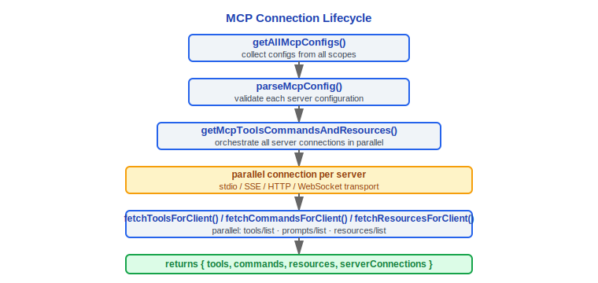
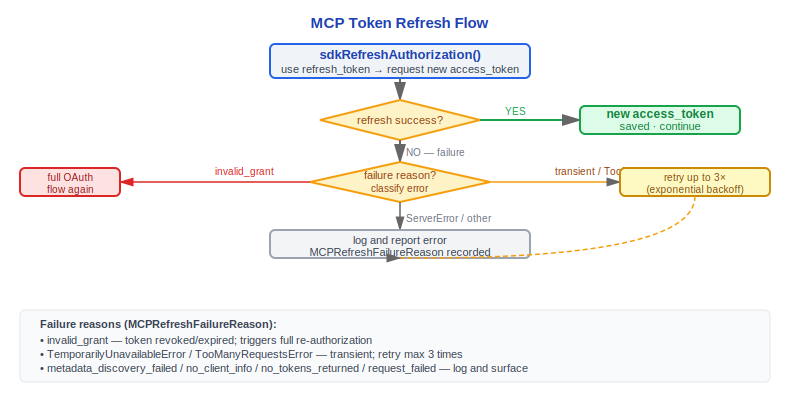

# MCP 集成

> Claude Code v2.1.88 的 Model Context Protocol 集成：配置加载、传输层、工具包装、认证、资源系统。

---

## 1. 配置加载 — 三层来源

MCP 服务器配置从三个层级合并，由 `src/services/mcp/config.ts` 中的 `getAllMcpConfigs()` / `getClaudeCodeMcpConfigs()` 统一管理：

### 1.1 用户级 (user / local)

- **~/.claude.json** 的 `mcpServers` 字段 — `scope: 'user'`
- **~/.claude/settings.json** 的 `mcpServers` 字段 — `scope: 'local'`（旧路径兼容）

### 1.2 项目级 (project)

- **.mcp.json** — 项目根目录的独立 MCP 配置文件 — `scope: 'project'`
- **.claude/settings.json** 的 `mcpServers` 字段 — `scope: 'project'`

项目级 MCP 服务器需要用户显式批准（`handleMcpjsonServerApprovals`），未批准的服务器不会连接。

#### 为什么项目级 MCP 需要用户显式批准？

项目的 `.mcp.json` 可以被恶意代码修改（供应链攻击），未批准的 MCP 服务器可能执行任意代码。源码中 `mcpServerApproval.tsx:15` 的 `handleMcpjsonServerApprovals()` 在启动时拦截项目级配置，要求用户确认。而用户级配置（`~/.claude.json`）不需要批准，因为用户完全控制自己的 home 目录配置文件——攻击面不同，安全策略也不同。

### 1.3 企业级 / 托管 (enterprise / managed / claudeai)

- **managed-mcp.json** — `getEnterpriseMcpFilePath()` 返回的路径 — `scope: 'enterprise'`
- **远程托管设置** — `scope: 'managed'` — 由 `remoteManagedSettings` 下发
- **Claude.ai MCP** — `fetchClaudeAIMcpConfigsIfEligible()` — `scope: 'claudeai'`

### 配置合并

```typescript
function addScopeToServers(
  servers: Record<string, McpServerConfig> | undefined,
  scope: ConfigScope
): Record<string, ScopedMcpServerConfig>
```

`ConfigScope` 枚举值：`'local' | 'user' | 'project' | 'dynamic' | 'enterprise' | 'claudeai' | 'managed'`

企业级 MCP 配置存在时可通过 `areMcpConfigsAllowedWithEnterpriseMcpConfig()` 限制其他来源的配置，`filterMcpServersByPolicy()` 按策略过滤。

---

## 2. getAllMcpConfigs 与连接管理

### 2.1 useManageMCPConnections Hook

`src/services/mcp/useManageMCPConnections.ts` 是 MCP 连接管理的 React Hook，负责：

1. 调用 `getMcpToolsCommandsAndResources()` 获取所有 MCP 服务器的工具/命令/资源
2. 监听 `ToolListChangedNotification` / `PromptListChangedNotification` / `ResourceListChangedNotification`
3. 按需获取 MCP skills（`feature('MCP_SKILLS')` 门控）
4. 维护 `MCPServerConnection` 状态并更新 AppState

### 2.2 连接生命周期



`clearServerCache()` 清除所有缓存的服务器连接，`reconnectMcpServerImpl()` 处理单服务器重连。

---

## 3. 四种传输层

`src/services/mcp/types.ts` 定义了传输类型枚举：

```typescript
export const TransportSchema = z.enum(['stdio', 'sse', 'sse-ide', 'http', 'ws', 'sdk'])
```

### 设计理念

#### 为什么需要 4+ 种传输而不是统一协议？

不同部署环境有根本不同的约束，没有一种传输能满足所有场景：

| 传输 | 特点 | 适用场景 |
|------|------|---------|
| **stdio** | 本地子进程，零网络延迟，最简单 | 内置工具、本地 SDK 服务器 |
| **SSE** | 单向服务器推送，防火墙友好 | 只需读取的监控型工具，HTTP/1.1 兼容环境 |
| **HTTP** (Streamable) | 无状态请求/响应，容易负载均衡 | 云函数/无服务器架构 |
| **WebSocket** | 全双工双向流式 | 需要实时交互的复杂工具 |

源码中 `TransportSchema`（`types.ts:23`）还包含 `sse-ide`（IDE 扩展专用）和 `sdk`（Agent SDK 内置）两种内部传输，说明传输层需要随集成场景持续扩展。企业防火墙可能不允许 WebSocket 升级，本地开发不需要网络开销——统一协议会在某些场景下成为障碍。

---

### 3.1 stdio 传输

```typescript
// McpStdioServerConfig
{
  type: 'stdio',        // 可省略（向后兼容）
  command: string,       // 可执行命令
  args: string[],        // 命令参数
  env?: Record<string, string>  // 环境变量
}
```

使用 `StdioClientTransport`（来自 `@modelcontextprotocol/sdk/client/stdio.js`），通过子进程 stdin/stdout 通信。环境变量通过 `expandEnvVarsInString()` 支持 `${VAR}` 语法展开。

### 3.2 SSE 传输

```typescript
// McpSSEServerConfig
{
  type: 'sse',
  url: string,
  headers?: Record<string, string>,
  headersHelper?: string,    // 外部命令生成动态 headers
  oauth?: McpOAuthConfig     // OAuth 配置
}
```

使用 `SSEClientTransport`（来自 `@modelcontextprotocol/sdk/client/sse.js`），支持代理配置和自定义 headers。

### 3.3 HTTP（Streamable HTTP）传输

```typescript
// McpHTTPServerConfig
{
  type: 'http',
  url: string,
  headers?: Record<string, string>,
  headersHelper?: string,
  oauth?: McpOAuthConfig
}
```

使用 `StreamableHTTPClientTransport`（来自 `@modelcontextprotocol/sdk/client/streamableHttp.js`），支持与 SSE 相同的 OAuth 和代理配置。

### 3.4 WebSocket 传输

```typescript
// McpWebSocketServerConfig
{
  type: 'ws',
  url: string,
  headers?: Record<string, string>,
  headersHelper?: string,
  oauth?: McpOAuthConfig
}
```

使用自实现的 `WebSocketTransport`（`src/utils/mcpWebSocketTransport.ts`），支持 mTLS（`getWebSocketTLSOptions`）和代理（`getWebSocketProxyAgent` / `getWebSocketProxyUrl`）。

### 3.5 内部传输

- **sse-ide** — IDE 扩展专用 SSE 传输（`McpSSEIDEServerConfig`），携带 `ideName` 字段
- **sdk** — SDK 控制传输（`SdkControlTransport`），用于 Agent SDK 内置 MCP
- **InProcessTransport** — 进程内传输（`src/services/mcp/InProcessTransport.ts`），用于嵌入式 MCP

---

## 4. getMcpToolsCommandsAndResources

`src/services/mcp/client.ts` 中的核心函数，编排所有 MCP 服务器的并行连接和数据获取：

```typescript
export async function getMcpToolsCommandsAndResources(
  configs: Record<string, ScopedMcpServerConfig>,
  ...
): Promise<{
  tools: Tool[],
  commands: Command[],
  resources: ServerResource[],
  serverConnections: MCPServerConnection[]
}>
```

对每个服务器：
1. 创建 `Client` 实例（`@modelcontextprotocol/sdk/client`）
2. 建立传输连接
3. 并行调用 `tools/list`、`prompts/list`、`resources/list`
4. 将 MCP 工具包装为 `MCPTool`，将 prompts 包装为 `Command`
5. 检测代码索引服务器（`detectCodeIndexingFromMcpServerName`）

---

## 5. MCPTool 包装器

`src/tools/MCPTool/MCPTool.ts` 将 MCP 工具协议适配为 Claude Code 的 `Tool` 接口：

### 工具命名约定

```
mcp__<server_name>__<tool_name>
```

例如：`mcp__github__create_issue`、`mcp__filesystem__read_file`

服务器名和工具名中的特殊字符通过 `mcpStringUtils.ts` 进行规范化处理。

### MCPTool 特性

- **输入验证** — 将 MCP tool 的 `inputSchema` 转换为 Zod schema 进行验证
- **进度报告** — `MCPProgress` 类型跟踪工具执行进度
- **内容转换** — MCP 响应内容（text/image/resource_link）转换为 Anthropic `ContentBlockParam`
- **图片处理** — 通过 `maybeResizeAndDownsampleImageBuffer()` 自动缩放过大图片
- **二进制内容** — 通过 `persistBinaryContent()` 持久化二进制数据，返回保存路径
- **截断保护** — `mcpContentNeedsTruncation()` / `truncateMcpContentIfNeeded()` 防止超长输出

---

## 6. 延迟加载 — ToolSearchTool

为避免在系统提示中注入所有 MCP 工具的完整 schema（消耗大量 token），Claude Code 采用 **延迟加载** 策略：

1. 系统提示中仅包含 MCP 工具的名称列表
2. 模型需要使用特定工具时，通过 `ToolSearchTool` 按名称或关键词搜索
3. ToolSearchTool 返回匹配工具的完整 JSON Schema 定义
4. 返回的 schema 注入到 `<functions>` 块中，模型即可正常调用

这种设计显著减少了 MCP 工具密集场景下的上下文消耗。

### 设计理念

#### 为什么延迟加载（ToolSearch）而不是启动时加载所有 MCP 工具？

每个 MCP 工具的 JSONSchema 可能有几 KB，10 个 MCP 服务器 x 20 个工具 = 在系统提示中消耗 5K-20K tokens。上下文窗口是稀缺资源——全量注入所有 schema 意味着用户有效对话空间显著缩小。

源码中 `main.tsx:2688-2689` 的注释揭示了具体实现：

```
// Print-mode MCP: per-server incremental push into headlessStore.
// Mirrors useManageMCPConnections — push pending first (so ToolSearch's
// pending-check at ToolSearchTool.ts:334 sees them), then replace with
// connected/failed as each server settles.
```

ToolSearch 增加一次额外模型往返（先搜索再调用），但大部分会话只使用少数几个工具——节省的 context 空间远超这个成本。这也是为什么 `commands/clear/caches.ts:132` 专门有清除 ToolSearch 描述缓存的逻辑（注释标注 "~500KB for 50 MCP tools"）。

---

## 7. MCP 认证

`src/services/mcp/auth.ts` 实现了完整的 MCP OAuth 认证流程：

### 7.1 ClaudeAuthProvider

自定义 `OAuthClientProvider` 实现，核心方法：

- `clientInformation()` — 从安全存储读取客户端注册信息
- `tokens()` — 从安全存储读取 OAuth tokens
- `saveTokens()` — 将 tokens 写入安全存储（SecureStorage）
- `redirectUrl()` — 构建本地回调 URL（`buildRedirectUri` + `findAvailablePort`）

### 7.2 OAuth 流程


### 7.3 Step-up 认证

对于需要额外权限的操作，MCP 服务器可返回 step-up challenge：

```typescript
type MCPRefreshFailureReason =
  | 'metadata_discovery_failed'
  | 'no_client_info'
  | 'no_tokens_returned'
  | 'invalid_grant'
  | 'transient_retries_exhausted'
  | 'request_failed'
```

### 7.4 Token 刷新



### 7.5 Cross-App Access (XAA)

`xaaIdpLogin.ts` 实现了跨应用访问协议（SEP-990）：

- `isXaaEnabled()` — 检查 XAA 是否启用
- `acquireIdpIdToken()` — 从 IdP 获取 ID Token
- `performCrossAppAccess()` — 使用 ID Token 进行跨应用 token 交换

XAA 配置位于 `settings.xaaIdp`（一次配置，所有 XAA 服务器共享）。

---

## 8. MCP 资源

### 8.1 ListMcpResourcesTool

`src/tools/ListMcpResourcesTool/ListMcpResourcesTool.ts` — 列出所有已连接 MCP 服务器暴露的资源。

### 8.2 ReadMcpResourceTool

`src/tools/ReadMcpResourceTool/ReadMcpResourceTool.ts` — 读取指定 URI 的 MCP 资源内容。

资源通过 `fetchResourcesForClient()` 在连接时预取，并通过 `prefetchAllMcpResources()` 在启动时批量加载。

---

## 9. MCP Instructions Delta

MCP 服务器可通过 `instructions` 字段在初始化时提供系统提示补充。这些指令作为 `system-reminder` 消息注入到对话上下文中：

```xml
<system-reminder>
# MCP Server Instructions

The following MCP servers have provided instructions for how to use their tools and resources:

## server-name
Instructions text from the server...
</system-reminder>
```

指令在每次 MCP 服务器连接/重连时更新。

### 设计理念

#### 为什么 MCP Instructions 注入为 system-reminder？

MCP 服务器需要告诉模型如何使用它的工具，但这些指令不应该与用户的系统提示混淆。源码中 `prompts.ts:599` 和 `messages.ts:4220` 都使用 `# MCP Server Instructions` 标题包裹在 `<system-reminder>` 标签内注入。这让模型可以区分"核心系统指令"和"MCP 服务器指令"——后者优先级更低，且在服务器断开后可以安全移除。`mcpInstructionsDelta.ts:30` 的注释进一步说明了这种设计与缓存的关系：delta 模式避免了每轮重建系统提示导致的缓存失效。

---

## 10. Channel 权限

`src/services/mcp/channelPermissions.ts` 管理 MCP 服务器通道的权限模型：

- **Channel Allowlist** — `src/services/mcp/channelAllowlist.ts` 维护允许的通道列表
- **ChannelPermissionCallbacks** — 权限回调接口，处理通道级别的授权请求
- **Channel Notification** — `src/services/mcp/channelNotification.ts` 处理通道事件通知
- **Elicitation Handler** — `src/services/mcp/elicitationHandler.ts` 处理 MCP 服务器的交互式请求（`ElicitRequestSchema`）

通道权限通过 Bootstrap State 的 `allowedChannels: ChannelEntry[]` 配置：

```typescript
type ChannelEntry =
  | { kind: 'plugin'; name: string; marketplace: string; dev?: boolean }
  | { kind: 'server'; name: string; dev?: boolean }
```

`--channels` 标志和 `--dangerously-load-development-channels` 标志控制通道接入策略。`dev: true` 的条目可绕过 allowlist 检查。

---

## 工程实践指南

### 添加新 MCP 服务器

**步骤清单：**

1. 在配置文件中添加服务器定义（选择适合的层级）：
   - **用户级**：编辑 `~/.claude.json` 的 `mcpServers` 字段
   - **项目级**：编辑项目根目录的 `.mcp.json`
   - **企业级**：通过 `/etc/claude/managed-mcp.json` 或 MDM 下发

2. 配置示例（stdio 传输）：
   ```json
   {
     "mcpServers": {
       "my-server": {
         "type": "stdio",
         "command": "node",
         "args": ["/path/to/my-mcp-server.js"],
         "env": {
           "API_KEY": "${MY_API_KEY}"
         }
       }
     }
   }
   ```

3. 重启 Claude Code 或执行 `/mcp reconnect` 使配置生效
4. 使用 `/mcp` 命令检查服务器连接状态

### 调试 MCP 连接

按以下顺序排查连接问题：

1. **检查传输类型是否正确**：确认 `type` 字段匹配服务器实际协议（`stdio`/`sse`/`http`/`ws`）。如果省略 `type`，默认为 `stdio`。
2. **检查进程是否启动**（stdio 传输）：
   - 确认 `command` 可执行文件路径正确
   - 确认 `args` 参数无误
   - 环境变量支持 `${VAR}` 语法展开（`expandEnvVarsInString()`）
3. **检查网络连接**（SSE/HTTP/WS 传输）：
   - 确认 `url` 可达
   - 检查代理配置是否阻止连接
   - WebSocket 传输支持 mTLS（`getWebSocketTLSOptions`）和代理（`getWebSocketProxyAgent`）
4. **检查认证状态**（需要 OAuth 的服务器）：
   - OAuth tokens 存储在 `SecureStorage` 中
   - 如果 401 错误循环出现，尝试删除缓存的 tokens 重新认证
5. **查看源码注释**：`client.ts:1427` 指出 `StdioClientTransport.close()` 仅发送 abort 信号，许多 MCP 服务器可能不会优雅关闭——需要等待进程退出

### 创建自定义 MCP 工具

1. 使用 MCP SDK 实现 `Tool` 接口，定义 `inputSchema`（JSON Schema 格式）
2. 通过 stdio 或 HTTP 传输暴露服务
3. 在 Claude Code 中配置服务器连接
4. 工具在 Claude Code 中的命名格式为 `mcp__<server_name>__<tool_name>`（`mcpStringUtils.ts` 规范化特殊字符）
5. MCPTool 包装器自动处理：
   - 输入验证（MCP inputSchema → Zod schema 转换）
   - 进度报告（`MCPProgress` 类型）
   - 图片自动缩放（`maybeResizeAndDownsampleImageBuffer()`）
   - 过长输出截断（`mcpContentNeedsTruncation()` / `truncateMcpContentIfNeeded()`）

### OAuth 认证调试

当 MCP 服务器需要 OAuth 认证时：

1. **检查 SecureStorage 中的 token**：tokens 通过 `ClaudeAuthProvider.saveTokens()` 写入安全存储
2. **手动触发刷新**：如果 access_token 过期，`sdkRefreshAuthorization()` 使用 refresh_token 获取新 token
3. **检查 PKCE 参数**：OAuth 流程使用 PKCE（`sdkAuth()`），确认回调 URL 和端口可用（`findAvailablePort`）
4. **刷新失败原因分类**：
   - `invalid_grant` → 重新执行完整 OAuth 流程
   - `transient_retries_exhausted` → 网络问题，重试最多 3 次
   - `metadata_discovery_failed` → OAuth 服务器元数据端点不可达
5. **XAA（跨应用访问）**：如果使用 `xaaIdp` 配置，检查 `isXaaEnabled()` 和 IdP ID Token 获取流程。源码 `xaa.ts:133` 标注了 mix-up protection 验证（待上游 SDK 集成）

### 性能优化

- **使用 ToolSearch 延迟加载**：避免在系统提示中注入所有 MCP 工具的完整 schema。10 个 MCP 服务器 x 20 个工具可能消耗 5K-20K tokens。ToolSearch 让模型按需搜索工具定义，源码 `commands/clear/caches.ts:132` 注释标注 50 个 MCP 工具的描述缓存约 500KB。
- **批量 prefetch 资源**：`prefetchAllMcpResources()` 在启动时批量加载 MCP 资源，避免运行时延迟。
- **连接复用**：`clearServerCache()` 清除缓存时会断开所有连接，`reconnectMcpServerImpl()` 处理单服务器重连——避免不必要的全量重连。

### 常见陷阱

> **项目级 MCP 需要用户批准**
> `.mcp.json` 中定义的项目级服务器必须经过 `handleMcpjsonServerApprovals()` 审批。未批准的服务器不会连接。这是安全设计——项目文件可能被恶意修改（供应链攻击）。用户级配置（`~/.claude.json`）不需要批准。

> **MCP 工具名格式是 `mcp__server__tool`**
> 双下划线分隔。服务器名和工具名中的特殊字符会被 `mcpStringUtils.ts` 规范化。在 hooks 或权限规则中引用 MCP 工具时必须使用完整的 `mcp__<server>__<tool>` 格式。

> **Instructions 注入占用 context**
> MCP 服务器可通过 `instructions` 字段注入系统提示补充。这些指令作为 `<system-reminder>` 标签注入上下文（`prompts.ts:599`），会持续占用 token 预算。多个 MCP 服务器的 instructions 累加可能显著消耗 context。`mcpInstructionsDelta.ts:30` 使用 delta 模式避免每轮重建系统提示导致的缓存失效。

> **SSE 传输的 fetch 不使用全局代理**
> 源码 `client.ts:643` 的注释标注：SSE 传输的 `eventSourceInit` 必须使用不经过全局代理的 fetch——这是一个容易被忽略的细节。

> **MCP 服务器 memoization 增加复杂性**
> 源码 `client.ts:589` 的 TODO 注释指出：MCP 客户端的 memoization 显著增加了代码复杂度，且性能收益不确定。修改 MCP 连接逻辑时要注意缓存状态一致性问题。


---

[← 上下文管理](../07-上下文管理/context-management.md) | [目录](../README.md) | [Hooks 系统 →](../09-Hooks系统/hooks-system.md)
