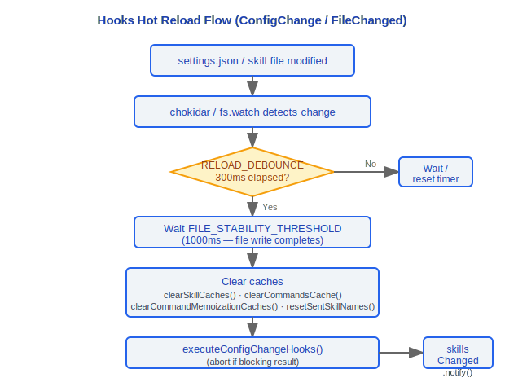

# Hooks System Architecture Documentation

> Claude Code v2.1.88 Hooks System Complete Technical Reference

---

## User-Configured Event Hooks (28 Types)

Configured through the `hooks` field in `settings.json`, supporting custom logic injection at different lifecycle points.

### Design Philosophy

#### Why 28 Event Hook Types?

The source code `coreSchemas.ts:355-383` defines the complete `HOOK_EVENTS` array, containing 28 event types. Each event corresponds to a critical decision point in the tool/query lifecycle:

- **PreToolUse / PostToolUse / PostToolUseFailure**: Intercept before/after/on failure of tool execution—security auditing, parameter modification, logging, error recovery
- **Stop / StopFailure / SubagentStart / SubagentStop**: Agent lifecycle control—memory extraction, task completion notification, subagent coordination
- **PreCompact / PostCompact**: Before/after context compression—allows external systems to save/restore critical information
- **PermissionRequest / PermissionDenied**: Permission events—custom approval workflows
- **ConfigChange / InstructionsLoaded / CwdChanged / FileChanged**: Environment change events—configuration hot reload, skill updates
- **WorktreeCreate / WorktreeRemove**: Git worktree lifecycle—multi-branch parallel workflows



Design goal: Allow external systems to intervene at **any** critical decision point without modifying core code. Each new system capability (such as worktree, elicitation) corresponds to new hook events, maintaining extensibility.

### Tool Lifecycle Hooks

| Hook Name | Trigger Timing | Return Value/Behavior |
|----------|---------|------------|
| **PreToolUse** | Before tool execution | Can block/modify input, returns `proceed` / `block` / `modify` |
| **PostToolUse** | After tool execution | Can attach feedback/trigger subsequent operations |

### Session Lifecycle Hooks

| Hook Name | Trigger Timing | Purpose |
|----------|---------|------|
| **SessionStart** | Session startup | Initialize environment, load context |
| **SessionEnd** | Session end | Clean up resources, save state |
| **UserPromptSubmit** | Before user prompt submission | Preprocess/validate user input |

### Agent Control Hooks

| Hook Name | Trigger Timing | Return Value/Behavior |
|----------|---------|------------|
| **Stop** | Agent stop signal | `blockingErrors` → inject message retry; `preventContinuation` → terminate |
| **SubagentStop** | Subagent termination | Processing after subagent execution ends |

### Context Management Hooks

| Hook Name | Trigger Timing | Purpose |
|----------|---------|------|
| **PreCompact** | Before context compression | Preprocessing before compression |
| **PostCompact** | After context compression | Post-processing after compression |

### System Event Hooks

| Hook Name | Trigger Timing | Purpose |
|----------|---------|------|
| **Notification** | System notification | Custom notification handling |
| **TeammateIdle** | Teammate idle detection | Detect idle in multi-agent collaboration |
| **TaskCreated** | Task creation event | Custom processing after task creation |
| **TaskCompleted** | Task completion event | Custom processing after task completion |

---

## Hook Command Types (schemas/hooks.ts)

Hooks support multiple command types, defined through Schema:

### BashCommandHook
Executes bash commands with access to environment variables and context information.

### PromptHook
Prompt injection type that injects additional prompt text into the conversation flow.

### HttpHook
HTTP request type, supports sending HTTP requests to external services.

### AgentHook
Agent invocation type, triggers another agent to execute tasks.

### HookMatcherSchema
Conditional matcher based on `IfConditionSchema` implementation for conditional judgment, determining whether hooks should trigger.

---

## Hook Execution Pipeline

### PreToolUse Pipeline
```
runPreToolUseHooks(toolName, input, context) → HookResult
```
- Called before tool execution
- Returns `HookResult` to decide whether to continue execution, block, or modify input

### PostToolUse Pipeline
```
runPostToolUseHooks(toolName, input, output, context)
```
- Called after successful tool execution
- Can attach feedback information or trigger subsequent operations

### PostToolUse Failure Pipeline
```
runPostToolUseFailureHooks(toolName, input, error)
```
- Called after tool execution failure
- Used for error handling and recovery

### Permission Decision Impact
```
resolveHookPermissionDecision()
```
- Hooks can influence permission system decision results
- Implement custom permission logic

### Post-Sampling Hooks
```
executePostSamplingHooks()
```
- Executed after API sampling completes
- Registered hooks include:
  - **SessionMemory**: Session memory management
  - **extractMemories**: Memory extraction
  - **PromptSuggestion**: Prompt suggestion generation
  - **MagicDocs**: Automatic document processing
  - Other registered post-sampling processors

---

## 70+ React Hooks (src/hooks/)

### Design Philosophy

#### Why 70+ React Hooks Instead of Traditional State Management?

Claude Code's `src/hooks/` directory contains 80+ hook files, each encapsulating an independent concern (input processing, permissions, IDE integration, voice, multi-agent, etc.). Choosing React hooks over traditional centralized state management (like Redux) has the following reasons:

1. **Composability**: React hooks allow local encapsulation of state and side effects—`useVoice` doesn't need to know about `useIDEIntegration`'s existence. Traditional Redux requires defining all actions in a centralized reducer, and 80+ concerns would lead to explosive reducer growth.

2. **Incremental Extension**: New features only require adding a new hook file (like `useSwarmInitialization.ts`, `useTeleportResume.tsx`), without needing to modify global store definitions. This is crucial for rapidly iterating CLI tools.

3. **Lifecycle Binding**: Many hooks manage external resources (file watchers, WebSocket connections, timers), and React hooks' cleanup mechanism (`useEffect` return) is naturally suited for these scenarios.

4. **Conditional Loading**: Through feature flags and `isEnabled` checks, hooks can be completely skipped when conditions aren't met, not consuming runtime resources.

Complete list organized by functionality:

### Input/Navigation
| Hook | Purpose |
|------|------|
| `useArrowKeyHistory` | Arrow key history navigation |
| `useHistorySearch` | History search |
| `useTypeahead` | Auto-completion (212KB) |
| `useInputBuffer` | Input buffer management |
| `useTextInput` | Text input processing |
| `usePasteHandler` | Paste handling |
| `useCopyOnSelect` | Copy on select |
| `useSearchInput` | Search input |

### Permissions/Tools
| Hook | Purpose |
|------|------|
| `useCanUseTool` | Tool availability check |
| `useToolPermissionUpdate` | Tool permission update |
| `useToolPermissionFeedback` | Tool permission feedback |

### IDE Integration
| Hook | Purpose |
|------|------|
| `useIDEIntegration` | IDE integration main entry |
| `useIdeSelection` | IDE selection sync |
| `useIdeAtMentioned` | IDE @mention |
| `useIdeConnectionStatus` | IDE connection status |
| `useDiffInIDE` | IDE diff view |

### Voice
| Hook | Purpose |
|------|------|
| `useVoice` | Voice core |
| `useVoiceEnabled` | Voice enabled state |
| `useVoiceIntegration` | Voice integration |

### Multi-Agent
| Hook | Purpose |
|------|------|
| `useSwarmInitialization` | Swarm initialization |
| `useSwarmPermissionPoller` | Swarm permission polling |
| `useTeammateViewAutoExit` | Teammate view auto-exit |
| `useMailboxBridge` | Mailbox bridge |

### State/Configuration
| Hook | Purpose |
|------|------|
| `useMainLoopModel` | Main loop model management |
| `useSettings` | Settings reading |
| `useSettingsChange` | Settings change listener |
| `useDynamicConfig` | Dynamic configuration |
| `useTerminalSize` | Terminal size |

### Notifications/Display
| Hook | Purpose |
|------|------|
| `useNotifyAfterTimeout` | Timeout notification |
| `useUpdateNotification` | Update notification |
| `useBlink` | Blink effect |
| `useElapsedTime` | Elapsed time |
| `useMinDisplayTime` | Minimum display time |

### API/Network
| Hook | Purpose |
|------|------|
| `useApiKeyVerification` | API key verification |
| `useDirectConnect` | Direct connection management |
| `useSessionToken` | Session token |

### Plugins
| Hook | Purpose |
|------|------|
| `useManagePlugins` | Plugin management |
| `useLspPluginRecommendation` | LSP plugin recommendation |
| `useOfficialMarketplaceNotification` | Official marketplace notification |

### Suggestions
| Hook | Purpose |
|------|------|
| `usePromptSuggestion` | Prompt suggestion |
| `useClaudeCodeHintRecommendation` | Claude Code hint recommendation |
| `fileSuggestions` | File suggestions |
| `unifiedSuggestions` | Unified suggestions |

### Tasks
| Hook | Purpose |
|------|------|
| `useTaskListWatcher` | Task list monitoring |
| `useTasksV2` | Tasks V2 |
| `useScheduledTasks` | Scheduled tasks |
| `useBackgroundTaskNavigation` | Background task navigation |

### History
| Hook | Purpose |
|------|------|
| `useHistorySearch` | History search |
| `useAssistantHistory` | Assistant history |

### Files
| Hook | Purpose |
|------|------|
| `useFileHistorySnapshotInit` | File history snapshot initialization |
| `useClipboardImageHint` | Clipboard image hint |

### Sessions
| Hook | Purpose |
|------|------|
| `useSessionBackgrounding` | Session backgrounding |
| `useTeleportResume` | Teleport resume |

### Rendering
| Hook | Purpose |
|------|------|
| `useVirtualScroll` | Virtual scrolling |
| `renderPlaceholder` | Placeholder rendering |

### Logging
| Hook | Purpose |
|------|------|
| `useLogMessages` | Log messages |
| `useDeferredHookMessages` | Deferred hook messages |
| `useDiffData` | Diff data |

---

## Permission Hook Subsystem (hooks/toolPermission/)

### PermissionContext.ts

`createPermissionContext()` returns a frozen context object containing the following methods:

#### Decision and Logging
- `logDecision`: Log permission decisions
- `persistPermissions`: Persist permission settings

#### Lifecycle Control
- `resolveIfAborted`: Resolve when aborted
- `cancelAndAbort`: Cancel and abort

#### Classification and Hooks
- `tryClassifier`: Try permission classifier
- `runHooks`: Execute permission-related hooks

#### Build Decisions
- `buildAllow`: Build allow decision
- `buildDeny`: Build deny decision

#### User/Hook Handling
- `handleUserAllow`: Handle user allow operation
- `handleHookAllow`: Handle hook allow operation

#### Queue Management
- `pushToQueue`: Push to permission request queue
- `removeFromQueue`: Remove from queue
- `updateQueueItem`: Update queue item

### createPermissionQueueOps()
Creates React state-backed permission request queue operations, providing React state-based queue management.

### createResolveOnce\<T\>()
Atomic resolve tracking mechanism to prevent race conditions. Ensures each permission request is resolved only once.

### handlers/ Directory
Contains permission request handlers for each tool, with corresponding processing logic for each tool type.

---

## Engineering Practice Guide

### Creating Custom Event Hooks

Define hook configuration in the `hooks` field of `settings.json`:

```json
{
  "hooks": {
    "PreToolUse": [
      {
        "type": "bash",
        "command": "echo 'Tool: $TOOL_NAME, Input: $TOOL_INPUT' >> /tmp/tool-audit.log",
        "if": { "tool": "Bash" }
      }
    ],
    "Stop": [
      {
        "type": "bash",
        "command": "echo 'Task completed' | notify-send 'Claude Code'"
      }
    ],
    "PostToolUse": [
      {
        "type": "prompt",
        "prompt": "Please check if the results of the previous operation meet expectations"
      }
    ]
  }
}
```

**Checklist:**
1. Choose the appropriate event type (28 options available, defined in the `HOOK_EVENTS` array in `coreSchemas.ts:355-383`)
2. Choose command type: `bash` (Shell command), `prompt` (prompt injection), `http` (HTTP request), `agent` (agent invocation)
3. Use `if` conditions (`HookMatcherSchema` / `IfConditionSchema`) to control trigger timing
4. Test hook execution: Takes effect immediately after modifying settings (hot reload), observe if hooks trigger correctly

### Debugging Hook Execution

1. **Check hook timeout**: Hook execution exceeding 500ms will display a timer in the UI (`HookProgress` component). If hooks frequently timeout, optimize command execution speed.
2. **Check return value format**:
   - `PreToolUse` hooks return `HookResult`, which can be `proceed` (continue), `block` (block), `modify` (modify input)
   - `Stop` hooks inject messages to trigger retry when returning `blockingErrors`, terminate when `preventContinuation`
3. **Check environment variables**: Bash-type hooks can access preset environment variables (`$TOOL_NAME`, `$TOOL_INPUT`, etc.)
4. **View Bootstrap State**: `state.registeredHooks` contains the list of all registered hooks, can be used to confirm if hooks are loaded correctly

### Creating New React Hooks

Create new React Hooks in the `src/hooks/` directory:

**Checklist:**
1. Create `useXxx.ts` (or `.tsx`) file
2. Consume context from appropriate Provider (like `AppStoreContext`, `ModalContext`, `NotificationsContext`)
3. Use `useSyncExternalStore` to subscribe to external store (rather than direct `useContext`) for better performance
4. Pay attention to cleanup logic—release external resources (file watchers, WebSocket, timers) in the return of `useEffect`
5. If conditional enabling is needed, control through `feature()` checks or `isEnabled` flags

**Example Template:**
```typescript
import { useEffect, useCallback } from 'react'
import { useAppState } from '../state/AppState.js'

export function useMyFeature() {
  const [state, setState] = useAppState(s => s.myField)

  useEffect(() => {
    // Initialization logic
    const cleanup = setupSomething()
    return () => {
      // Must cleanup!
      cleanup()
    }
  }, []) // Dependency array must be correct

  return { state, doSomething: useCallback(() => { /* ... */ }, []) }
}
```

### Common Pitfalls

> **Event hooks are synchronously blocking**
> Hooks execute synchronously in the query loop. Long-running hook commands will block the entire query loop—the model cannot continue responding until the hook completes. If time-consuming operations are necessary, use background processes in hooks (`command &`) and return immediately.

> **React Hook dependency arrays must be correct**
> Incorrect dependency arrays will cause:
> - Missing dependencies → closure captures stale values, producing stale data bugs
> - Excessive dependencies → unnecessary re-execution, affecting performance
> - Multiple TODO comments in the source code (like `useBackgroundTaskNavigation.ts:245`) mark ongoing `onKeyDown-migration`, need to pay attention to migration status when modifying related hooks

> **Permission hook's resolveOnce mechanism**
> `createResolveOnce<T>()` ensures each permission request is resolved only once, preventing race conditions. If introducing asynchronous logic in the permission handling flow, must protect through resolveOnce to avoid unpredictable behavior from multiple resolves.

> **NOTE(keybindings) marked escape handler**
> The escape handlers in `useTextInput.ts:122` and `useVimInput.ts:189` in the source code are explicitly marked as "intentionally NOT migrated to the keybindings system"—these are deliberately not migrated, do not move them into the keybindings system when modifying.


---

[← MCP Integration](../08-MCP集成/mcp-integration-en.md) | [Index](../README_EN.md) | [Skills System →](../10-Skills系统/skills-system-en.md)
