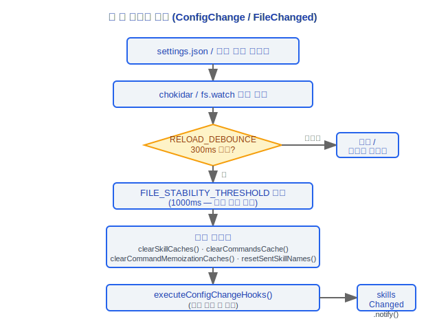

# 훅 시스템(Hooks System) 아키텍처 문서

> Claude Code v2.1.88 훅 시스템(Hooks System) 완전 기술 레퍼런스

---

## 사용자 설정 이벤트 훅(Hooks) (28가지 유형)

`settings.json`의 `hooks` 필드를 통해 설정하며, 다양한 수명주기 지점에서 사용자 정의 로직 주입을 지원합니다.

### 설계 철학

#### 이벤트 훅 유형이 28가지인 이유는?

소스 코드 `coreSchemas.ts:355-383`에서 28가지 이벤트 유형을 포함하는 완전한 `HOOK_EVENTS` 배열을 정의합니다. 각 이벤트는 도구/쿼리 수명주기의 중요한 결정 지점에 해당합니다.

- **PreToolUse / PostToolUse / PostToolUseFailure**: 도구 실행 전/후/실패 시 가로채기 — 보안 감사, 파라미터 수정, 로깅, 오류 복구
- **Stop / StopFailure / SubagentStart / SubagentStop**: 에이전트 수명주기 제어 — 메모리 추출, 태스크 완료 알림, 서브 에이전트 조율
- **PreCompact / PostCompact**: 컨텍스트 압축 전/후 — 외부 시스템이 중요한 정보를 저장/복원할 수 있음
- **PermissionRequest / PermissionDenied**: 권한 이벤트 — 사용자 정의 승인 워크플로우
- **ConfigChange / InstructionsLoaded / CwdChanged / FileChanged**: 환경 변경 이벤트 — 설정 핫 리로드, 스킬(Skills) 업데이트
- **WorktreeCreate / WorktreeRemove**: Git 워크트리 수명주기 — 멀티 브랜치 병렬 워크플로우



설계 목표: 핵심 코드를 수정하지 않고 **모든** 중요한 결정 지점에서 외부 시스템이 개입할 수 있도록 합니다. 새로운 시스템 기능(예: 워크트리, 엘리시테이션)이 추가될 때마다 새로운 훅 이벤트가 대응되어 확장성을 유지합니다.

### 도구 수명주기 훅

| 훅 이름 | 트리거 시점 | 반환값/동작 |
|----------|---------|------------|
| **PreToolUse** | 도구 실행 전 | 차단/수정 가능, `proceed` / `block` / `modify` 반환 |
| **PostToolUse** | 도구 실행 후 | 피드백 첨부/후속 작업 트리거 가능 |

### 세션 수명주기 훅

| 훅 이름 | 트리거 시점 | 목적 |
|----------|---------|------|
| **SessionStart** | 세션 시작 | 환경 초기화, 컨텍스트 로드 |
| **SessionEnd** | 세션 종료 | 리소스 정리, 상태 저장 |
| **UserPromptSubmit** | 사용자 프롬프트 제출 전 | 사용자 입력 전처리/검증 |

### 에이전트 제어 훅

| 훅 이름 | 트리거 시점 | 반환값/동작 |
|----------|---------|------------|
| **Stop** | 에이전트 중지 신호 | `blockingErrors` → 메시지 주입 후 재시도; `preventContinuation` → 종료 |
| **SubagentStop** | 서브 에이전트 종료 | 서브 에이전트 실행 종료 후 처리 |

### 컨텍스트 관리 훅

| 훅 이름 | 트리거 시점 | 목적 |
|----------|---------|------|
| **PreCompact** | 컨텍스트 압축 전 | 압축 전 전처리 |
| **PostCompact** | 컨텍스트 압축 후 | 압축 후 후처리 |

### 시스템 이벤트 훅

| 훅 이름 | 트리거 시점 | 목적 |
|----------|---------|------|
| **Notification** | 시스템 알림 | 사용자 정의 알림 처리 |
| **TeammateIdle** | 팀원 유휴 감지 | 멀티 에이전트 협업에서 유휴 감지 |
| **TaskCreated** | 태스크 생성 이벤트 | 태스크 생성 후 사용자 정의 처리 |
| **TaskCompleted** | 태스크 완료 이벤트 | 태스크 완료 후 사용자 정의 처리 |

---

## 훅 명령 유형 (schemas/hooks.ts)

훅은 스키마를 통해 정의된 여러 명령 유형을 지원합니다.

### BashCommandHook
환경 변수와 컨텍스트 정보에 접근하여 bash 명령을 실행합니다.

### PromptHook
대화 흐름에 추가 프롬프트 텍스트를 주입하는 프롬프트 주입 유형입니다.

### HttpHook
외부 서비스로 HTTP 요청을 보낼 수 있는 HTTP 요청 유형입니다.

### AgentHook
다른 에이전트를 트리거하여 태스크를 실행하는 에이전트 호출 유형입니다.

### HookMatcherSchema
조건부 판단을 위한 `IfConditionSchema` 구현 기반의 조건부 매처로, 훅이 트리거되어야 하는지를 결정합니다.

---

## 훅 실행 파이프라인

### PreToolUse 파이프라인
```
runPreToolUseHooks(toolName, input, context) → HookResult
```
- 도구 실행 전에 호출됨
- 실행 계속, 차단, 또는 입력 수정 여부를 결정하는 `HookResult` 반환

### PostToolUse 파이프라인
```
runPostToolUseHooks(toolName, input, output, context)
```
- 도구 실행 성공 후 호출됨
- 피드백 정보 첨부 또는 후속 작업 트리거 가능

### PostToolUse 실패 파이프라인
```
runPostToolUseFailureHooks(toolName, input, error)
```
- 도구 실행 실패 후 호출됨
- 오류 처리 및 복구에 사용

### 권한 결정 영향
```
resolveHookPermissionDecision()
```
- 훅이 권한 시스템 결정 결과에 영향을 줄 수 있음
- 사용자 정의 권한 로직 구현

### 포스트 샘플링 훅
```
executePostSamplingHooks()
```
- API 샘플링 완료 후 실행됨
- 등록된 훅 포함:
  - **SessionMemory**: 세션 메모리 관리
  - **extractMemories**: 메모리 추출
  - **PromptSuggestion**: 프롬프트 제안 생성
  - **MagicDocs**: 자동 문서 처리
  - 기타 등록된 포스트 샘플링 프로세서

---

## 70개 이상의 React 훅 (src/hooks/)

### 설계 철학

#### 전통적인 상태 관리 대신 70개 이상의 React 훅을 사용하는 이유는?

Claude Code의 `src/hooks/` 디렉토리에는 80개 이상의 훅 파일이 있으며, 각각 독립적인 관심사(입력 처리, 권한, IDE 통합, 음성, 멀티 에이전트 등)를 캡슐화합니다. React 훅을 전통적인 중앙 집중식 상태 관리(Redux 등) 대신 선택한 이유는 다음과 같습니다.

1. **합성 가능성**: React 훅은 상태와 사이드 이펙트의 로컬 캡슐화를 허용합니다. `useVoice`는 `useIDEIntegration`의 존재를 알 필요가 없습니다. 전통적인 Redux는 중앙 집중식 리듀서에서 모든 액션을 정의해야 하며, 80개 이상의 관심사는 리듀서의 폭발적 성장을 초래합니다.

2. **점진적 확장**: 새 기능은 새 훅 파일 추가만으로 충분합니다(`useSwarmInitialization.ts`, `useTeleportResume.tsx` 등). 글로벌 스토어 정의를 수정할 필요가 없습니다. 빠르게 반복하는 CLI 도구에 매우 중요합니다.

3. **수명주기 바인딩**: 많은 훅이 외부 리소스(파일 와처, WebSocket 연결, 타이머)를 관리하며, React 훅의 클린업 메커니즘(`useEffect` 반환)이 이런 시나리오에 자연스럽게 적합합니다.

4. **조건부 로딩**: 기능 플래그와 `isEnabled` 검사를 통해 조건이 충족되지 않을 때 훅을 완전히 건너뛸 수 있어 런타임 리소스를 소비하지 않습니다.

기능별로 정리된 전체 목록:

### 입력/탐색
| 훅 | 목적 |
|------|------|
| `useArrowKeyHistory` | 화살표 키 기록 탐색 |
| `useHistorySearch` | 기록 검색 |
| `useTypeahead` | 자동 완성 (212KB) |
| `useInputBuffer` | 입력 버퍼 관리 |
| `useTextInput` | 텍스트 입력 처리 |
| `usePasteHandler` | 붙여넣기 처리 |
| `useCopyOnSelect` | 선택 시 복사 |
| `useSearchInput` | 검색 입력 |

### 권한/도구
| 훅 | 목적 |
|------|------|
| `useCanUseTool` | 도구 사용 가능 여부 확인 |
| `useToolPermissionUpdate` | 도구 권한 업데이트 |
| `useToolPermissionFeedback` | 도구 권한 피드백 |

### IDE 통합
| 훅 | 목적 |
|------|------|
| `useIDEIntegration` | IDE 통합 메인 엔트리 |
| `useIdeSelection` | IDE 선택 동기화 |
| `useIdeAtMentioned` | IDE @멘션 |
| `useIdeConnectionStatus` | IDE 연결 상태 |
| `useDiffInIDE` | IDE 다이프 뷰 |

### 음성
| 훅 | 목적 |
|------|------|
| `useVoice` | 음성 코어 |
| `useVoiceEnabled` | 음성 활성화 상태 |
| `useVoiceIntegration` | 음성 통합 |

### 멀티 에이전트
| 훅 | 목적 |
|------|------|
| `useSwarmInitialization` | 스웜 초기화 |
| `useSwarmPermissionPoller` | 스웜 권한 폴링 |
| `useTeammateViewAutoExit` | 팀원 뷰 자동 종료 |
| `useMailboxBridge` | 메일박스 브리지 |

### 상태/설정
| 훅 | 목적 |
|------|------|
| `useMainLoopModel` | 메인 루프 모델 관리 |
| `useSettings` | 설정 읽기 |
| `useSettingsChange` | 설정 변경 리스너 |
| `useDynamicConfig` | 동적 설정 |
| `useTerminalSize` | 터미널 크기 |

### 알림/표시
| 훅 | 목적 |
|------|------|
| `useNotifyAfterTimeout` | 타임아웃 알림 |
| `useUpdateNotification` | 업데이트 알림 |
| `useBlink` | 블링크 효과 |
| `useElapsedTime` | 경과 시간 |
| `useMinDisplayTime` | 최소 표시 시간 |

### API/네트워크
| 훅 | 목적 |
|------|------|
| `useApiKeyVerification` | API 키 검증 |
| `useDirectConnect` | 직접 연결 관리 |
| `useSessionToken` | 세션 토큰 |

### 플러그인
| 훅 | 목적 |
|------|------|
| `useManagePlugins` | 플러그인(Plugin) 관리 |
| `useLspPluginRecommendation` | LSP 플러그인 추천 |
| `useOfficialMarketplaceNotification` | 공식 마켓플레이스 알림 |

### 제안
| 훅 | 목적 |
|------|------|
| `usePromptSuggestion` | 프롬프트 제안 |
| `useClaudeCodeHintRecommendation` | Claude Code 힌트 추천 |
| `fileSuggestions` | 파일 제안 |
| `unifiedSuggestions` | 통합 제안 |

### 태스크
| 훅 | 목적 |
|------|------|
| `useTaskListWatcher` | 태스크 목록 모니터링 |
| `useTasksV2` | 태스크 V2 |
| `useScheduledTasks` | 예약 태스크 |
| `useBackgroundTaskNavigation` | 백그라운드 태스크 탐색 |

### 기록
| 훅 | 목적 |
|------|------|
| `useHistorySearch` | 기록 검색 |
| `useAssistantHistory` | 어시스턴트 기록 |

### 파일
| 훅 | 목적 |
|------|------|
| `useFileHistorySnapshotInit` | 파일 기록 스냅샷 초기화 |
| `useClipboardImageHint` | 클립보드 이미지 힌트 |

### 세션
| 훅 | 목적 |
|------|------|
| `useSessionBackgrounding` | 세션 백그라운딩 |
| `useTeleportResume` | 텔레포트 재개 |

### 렌더링
| 훅 | 목적 |
|------|------|
| `useVirtualScroll` | 가상 스크롤 |
| `renderPlaceholder` | 플레이스홀더 렌더링 |

### 로깅
| 훅 | 목적 |
|------|------|
| `useLogMessages` | 로그 메시지 |
| `useDeferredHookMessages` | 지연 훅 메시지 |
| `useDiffData` | 다이프 데이터 |

---

## 권한 훅 서브시스템 (hooks/toolPermission/)

### PermissionContext.ts

`createPermissionContext()`는 다음 메서드를 포함하는 동결된 컨텍스트 객체를 반환합니다.

#### 결정 및 로깅
- `logDecision`: 권한 결정 로그 기록
- `persistPermissions`: 권한 설정 지속화

#### 수명주기 제어
- `resolveIfAborted`: 중단 시 해결
- `cancelAndAbort`: 취소 및 중단

#### 분류 및 훅
- `tryClassifier`: 권한 분류기 시도
- `runHooks`: 권한 관련 훅 실행

#### 결정 빌드
- `buildAllow`: 허용 결정 빌드
- `buildDeny`: 거부 결정 빌드

#### 사용자/훅 처리
- `handleUserAllow`: 사용자 허용 작업 처리
- `handleHookAllow`: 훅 허용 작업 처리

#### 큐 관리
- `pushToQueue`: 권한 요청 큐에 추가
- `removeFromQueue`: 큐에서 제거
- `updateQueueItem`: 큐 항목 업데이트

### createPermissionQueueOps()
React 상태 기반 권한 요청 큐 작업을 생성하며, React 상태 기반 큐 관리를 제공합니다.

### createResolveOnce\<T\>()
경쟁 조건을 방지하기 위한 원자적 해결 추적 메커니즘입니다. 각 권한 요청이 한 번만 해결되도록 보장합니다.

### handlers/ 디렉토리
각 도구에 대한 권한 요청 핸들러를 포함하며, 각 도구 유형에 해당하는 처리 로직이 있습니다.

---

## 엔지니어링 실전 가이드

### 사용자 정의 이벤트 훅 생성

`settings.json`의 `hooks` 필드에 훅 설정을 정의합니다.

```json
{
  "hooks": {
    "PreToolUse": [
      {
        "type": "bash",
        "command": "echo '도구: $TOOL_NAME, 입력: $TOOL_INPUT' >> /tmp/tool-audit.log",
        "if": { "tool": "Bash" }
      }
    ],
    "Stop": [
      {
        "type": "bash",
        "command": "echo '태스크 완료' | notify-send 'Claude Code'"
      }
    ],
    "PostToolUse": [
      {
        "type": "prompt",
        "prompt": "이전 작업 결과가 기대에 맞는지 확인해 주세요"
      }
    ]
  }
}
```

**체크리스트:**
1. 적절한 이벤트 유형 선택 (28가지 옵션, `coreSchemas.ts:355-383`의 `HOOK_EVENTS` 배열에 정의됨)
2. 명령 유형 선택: `bash`(셸 명령), `prompt`(프롬프트 주입), `http`(HTTP 요청), `agent`(에이전트 호출)
3. `if` 조건(`HookMatcherSchema` / `IfConditionSchema`)을 사용하여 트리거 시점 제어
4. 훅 실행 테스트: 설정 수정 후 즉시 적용됨(핫 리로드), 훅이 올바르게 트리거되는지 관찰

### 훅 실행 디버깅

1. **훅 타임아웃 확인**: 훅 실행이 500ms를 초과하면 UI에 타이머가 표시됩니다(`HookProgress` 컴포넌트). 훅이 자주 타임아웃되면 명령 실행 속도를 최적화하십시오.
2. **반환값 형식 확인**:
   - `PreToolUse` 훅은 `HookResult`를 반환하며, `proceed`(계속), `block`(차단), `modify`(입력 수정) 중 하나
   - `Stop` 훅은 `blockingErrors`를 반환하면 메시지를 주입하여 재시도를 트리거하고, `preventContinuation`이면 종료
3. **환경 변수 확인**: Bash 유형 훅은 사전 설정된 환경 변수(`$TOOL_NAME`, `$TOOL_INPUT` 등)에 접근 가능
4. **Bootstrap State 확인**: `state.registeredHooks`에는 등록된 모든 훅 목록이 포함되어 있어 훅이 올바르게 로드되었는지 확인 가능

### 새 React 훅 생성

`src/hooks/` 디렉토리에 새 React 훅을 생성합니다.

**체크리스트:**
1. `useXxx.ts` (또는 `.tsx`) 파일 생성
2. 적절한 Provider에서 컨텍스트 소비(예: `AppStoreContext`, `ModalContext`, `NotificationsContext`)
3. 더 나은 성능을 위해 직접 `useContext` 대신 `useSyncExternalStore`를 사용하여 외부 스토어 구독
4. 클린업 로직에 주의 — `useEffect`의 반환에서 외부 리소스(파일 와처, WebSocket, 타이머)를 해제
5. 조건부 활성화가 필요한 경우 `feature()` 검사 또는 `isEnabled` 플래그를 통해 제어

**예시 템플릿:**
```typescript
import { useEffect, useCallback } from 'react'
import { useAppState } from '../state/AppState.js'

export function useMyFeature() {
  const [state, setState] = useAppState(s => s.myField)

  useEffect(() => {
    // 초기화 로직
    const cleanup = setupSomething()
    return () => {
      // 반드시 클린업!
      cleanup()
    }
  }, []) // 의존성 배열은 반드시 올바르게 작성

  return { state, doSomething: useCallback(() => { /* ... */ }, []) }
}
```

### 일반적인 함정

> **이벤트 훅은 동기적으로 차단합니다**
> 훅은 쿼리 루프에서 동기적으로 실행됩니다. 오래 실행되는 훅 명령은 전체 쿼리 루프를 차단합니다. 훅이 완료될 때까지 모델이 응답을 계속할 수 없습니다. 시간이 많이 걸리는 작업이 필요한 경우 훅에서 백그라운드 프로세스(`command &`)를 사용하고 즉시 반환하십시오.

> **React 훅 의존성 배열은 반드시 올바르게 작성해야 합니다**
> 잘못된 의존성 배열은 다음을 초래합니다.
> - 누락된 의존성 → 클로저가 오래된 값을 캡처하여 오래된 데이터 버그 발생
> - 과도한 의존성 → 불필요한 재실행, 성능에 영향
> - 소스 코드의 여러 TODO 주석(예: `useBackgroundTaskNavigation.ts:245`)은 진행 중인 `onKeyDown-migration`을 표시하며, 관련 훅을 수정할 때 마이그레이션 상태에 주의해야 합니다.

> **권한 훅의 resolveOnce 메커니즘**
> `createResolveOnce<T>()`는 각 권한 요청이 한 번만 해결되도록 보장하여 경쟁 조건을 방지합니다. 권한 처리 흐름에 비동기 로직을 도입하는 경우, 여러 번 해결로 인한 예측 불가능한 동작을 방지하기 위해 resolveOnce를 통해 보호해야 합니다.

> **NOTE(keybindings) 표시된 이스케이프 핸들러**
> 소스 코드의 `useTextInput.ts:122`와 `useVimInput.ts:189`의 이스케이프 핸들러는 "의도적으로 키바인딩 시스템으로 마이그레이션하지 않음"으로 명시적으로 표시되어 있습니다. 이것은 의도적으로 마이그레이션하지 않은 것이므로, 수정 시 키바인딩 시스템으로 옮기지 마십시오.


---

[← MCP 통합](../08-MCP集成/mcp-integration-ko.md) | [인덱스](../README_KO.md) | [스킬 시스템 →](../10-Skills系统/skills-system-ko.md)
