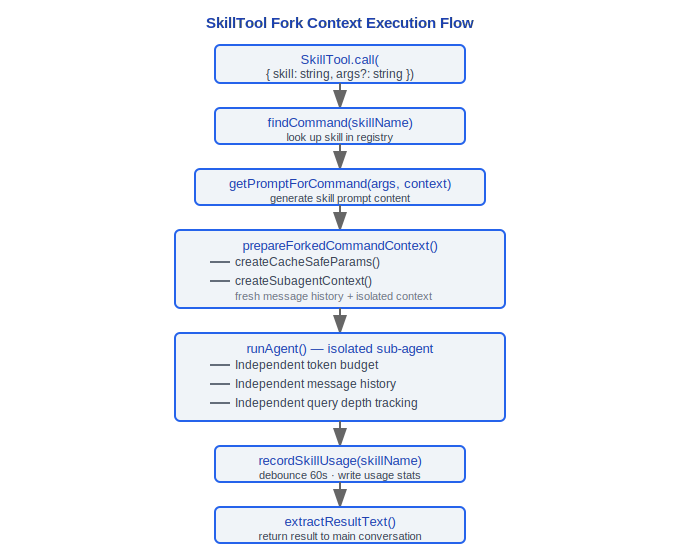

# Skills System

> Claude Code v2.1.88 skill system: bundled skill definitions, discovery mechanism, execution model, change detection, usage tracking.

---

## 1. BundledSkillDefinition Type

### Design Philosophy

#### Why are Skills separated from Tools?

In Claude Code, Tools and Skills are abstractions at two different levels:

| Dimension | Tools | Skills |
|------|-------|--------|
| Granularity | Atomic operations (read file, execute command) | High-level "recipes" — combine multiple tool calls to complete complex tasks |
| Definition Method | TypeScript code (`src/tools/`) | Can be defined with Markdown + frontmatter (user-creatable) |
| Caller | Called directly by model | Called indirectly through `SkillTool` wrapper |
| Execution Mode | Executed synchronously in current query loop | Supports `inline` (inject into current conversation) or `fork` (independent sub-agent) |

This separation allows users to define custom skills with Markdown (in project `.claude/skills/` directory) without writing TypeScript code. The `source: 'bundled'` field in `bundledSkills.ts:88` coexists with the Markdown loading mechanism in `loadSkillsDir.ts`, confirming this dual-track design.

#### Why is Skill execution forked rather than in the same query loop?

The comment in `SkillTool.ts:119-121` explicitly states:

```typescript
/**
 * Executes a skill in a forked sub-agent context.
 * This runs the skill prompt in an isolated agent with its own token budget.
 */
```

Fork mode (`command.context === 'fork'`, `SkillTool.ts:622`) creates an independent context with three key advantages:

1. **Isolation**: Skill intermediate messages don't pollute the main conversation — `prepareForkedCommandContext()` creates a fresh message history
2. **Custom prompt**: Forked sub-agents can have completely different system prompts, defined via `agentDefinition`
3. **Independent cancellation**: Skill failures don't affect the main loop, sub-agents have independent token budgets and query depth tracking

The output schema in `SkillTool.ts:302-325` clearly distinguishes between `inline` (status: 'inline') and `forked` (status: 'forked') execution results, further confirming the deliberate dual-mode design.

---

`src/skills/bundledSkills.ts` defines the core type for bundled skills:

```typescript
type BundledSkillDefinition = {
  name: string                    // Skill name (i.e., /command name)
  description: string             // Skill description, shown in help and search
  aliases?: string[]              // Alias list (e.g., /co as alias for /commit)
  whenToUse?: string              // Tells model when to use this skill
  argumentHint?: string           // Argument hint text
  allowedTools?: string[]         // Whitelist of tools available during skill execution
  model?: string                  // Model override (e.g., 'sonnet', 'opus')
  disableModelInvocation?: boolean // Disable automatic model invocation (user-only)
  userInvocable?: boolean         // Whether user can directly invoke (default true)
  isEnabled?: () => boolean       // Dynamic enable condition
  hooks?: HooksSettings           // Skill-level hooks configuration
  context?: 'inline' | 'fork'    // Execution context mode
  agent?: string                  // Associated agent type
  files?: Record<string, string>  // Reference files (extracted to disk on demand)
  getPromptForCommand: (          // Core: generate skill prompt content
    args: string,
    context: ToolUseContext
  ) => Promise<ContentBlockParam[]>
}
```

### context Modes

- **`inline`** — Skill prompt is directly injected into current conversation context, no sub-agent created
- **`fork`** — Skill executes in an isolated forked sub-agent with independent token budget

### files Mechanism

When the `files` field is non-empty:
1. Files are extracted to `getBundledSkillsRoot()/<skillName>/` directory on first invocation
2. Secure write using O_NOFOLLOW | O_EXCL (prevents symlink attacks)
3. Extraction operations are deduplicated via Promise (concurrent calls share single extraction)
4. Adds `"Base directory for this skill: <dir>"` to prompt prefix so model can access via Read/Grep

### Registration Mechanism

```typescript
export function registerBundledSkill(definition: BundledSkillDefinition): void
```

Registered skills are stored as `Command` objects in internal registry with `source: 'bundled'`. In main.tsx, `initBundledSkills()` must be called before `getCommands()`.

---

## 2. 17 Bundled Skills

Bundled skills in the `src/skills/bundled/` directory:

| Skill | File | Description |
|---|---|---|
| batch | batch.ts | Batch operations |
| claude-api | claudeApi.ts | Claude API / Anthropic SDK usage guidance |
| claude-api-content | claudeApiContent.ts | Claude API content generation |
| claude-in-chrome | claudeInChrome.ts | Chrome browser integration |
| debug | debug.ts | Debugging assistance |
| keybindings | keybindings.ts | Keybinding help |
| loop | loop.ts | Loop execution (scheduled prompt/command triggers) |
| lorem-ipsum | loremIpsum.ts | Lorem Ipsum generation |
| remember | remember.ts | Memory management |
| schedule | scheduleRemoteAgents.ts | Remote Agent scheduling |
| simplify | simplify.ts | Code simplification review |
| skillify | skillify.ts | Skill creation assistance |
| stuck | stuck.ts | Recovery from stuck state |
| update-config | updateConfig.ts | Configuration updates |
| verify | verify.ts | Verification checks |
| verify-content | verifyContent.ts | Content verification |
| index | index.ts | Registration entry point (initBundledSkills) |

---

## 3. Skill Discovery

Skills are discovered and loaded through three paths:

### 3.1 Project-level (project/.claude/skills/)

`src/skills/loadSkillsDir.ts` scans the following directory hierarchy:

```
<project-root>/.claude/skills/          # Project skills
<parent-dir>/.claude/skills/            # Traverse up to user home directory
~/.claude/skills/                       # User-level skills
```

Each subdirectory contains a Markdown file as the skill definition, supporting frontmatter configuration:

```yaml
---
description: "Skill description"
model: "sonnet"
allowedTools: ["Read", "Edit", "Bash"]
context: fork
agent: worker
---
```

### 3.2 User-level Configuration

- **~/.claude/skills/** — Global user skills directory
- **Additional directories** — Extra directories specified with `--add-dir` flag also have their `.claude/skills/` scanned

### 3.3 MCP Skills

When `feature('MCP_SKILLS')` is enabled:
- `src/skills/mcpSkillBuilders.ts` converts MCP prompts to skills
- `fetchMcpSkillsForClient()` fetches available prompts from MCP servers
- MCP skills have their `source` marked as the corresponding MCP server name

### Loading Flow

```typescript
// loadSkillsDir.ts
getSkillsPath()              // Get all skill directory paths
loadMarkdownFilesForSubdir() // Scan Markdown files
parseFrontmatter()           // Parse frontmatter
clearSkillCaches()           // Clear cache for hot reload
onDynamicSkillsLoaded()      // Dynamic skills loaded callback
```

---

## 4. SkillTool Execution

`src/tools/SkillTool/SkillTool.ts` is the tool entry point for skill invocation:

### 4.1 Fork Context Execution

When skill's `context === 'fork'`:



### 4.2 Isolated Token Budget

Sub-agents in fork mode have independent token budgets that don't consume the main conversation's context window. This is crucial for large skill operations (like code review, documentation generation).

### 4.3 Query Depth Tracking

Nested skill invocations track current query depth via `getAgentContext()` to prevent infinite recursion.

### 4.4 Model Resolution

Skills can specify model overrides, resolution priority:

```
Skill frontmatter model > Agent definition model > Parent model > Default main loop model
```

Implemented via `resolveSkillModelOverride()`.

### 4.5 Permission Checks

SkillTool checks permission rules via `getRuleByContentsForTool()` before execution. Plugin-sourced skills verify official marketplace status via `parsePluginIdentifier()`.

### 4.6 Invoked Skills Tracking

Skill invocations are recorded in Bootstrap State's `invokedSkills` Map:

```typescript
invokedSkills: Map<string, {
  skillName: string
  skillPath: string
  content: string
  invokedAt: number
  agentId: string | null
}>
```

Key format is `${agentId ?? ''}:${skillName}`, preventing cross-agent overwrites. These records are preserved after compression, ensuring skill context isn't lost.

---

## 5. skillChangeDetector

`src/utils/skills/skillChangeDetector.ts` implements skill hot reload via filesystem watching:

### 5.1 Core Constants

```typescript
const FILE_STABILITY_THRESHOLD_MS = 1000    // File write stability wait time
const FILE_STABILITY_POLL_INTERVAL_MS = 500 // File stability polling interval
const RELOAD_DEBOUNCE_MS = 300              // Fast change event debounce
const POLLING_INTERVAL_MS = 2000            // chokidar polling interval (USE_POLLING mode)
```

### 5.2 Chokidar Watching

```typescript
const USE_POLLING = typeof Bun !== 'undefined'
// Bun's fs.watch() has PathWatcherManager deadlock issues (oven-sh/bun#27469, #26385)
// Use stat() polling instead in Bun environment
```

Watching flow:


### 5.3 Signal Mechanism

```typescript
const skillsChanged = createSignal()
// External listeners via skillsChanged.subscribe()
```

Cleanup is registered via `registerCleanup()`, ensuring watcher closes on process exit.

---

## 6. skillUsageTracking

`src/utils/suggestions/skillUsageTracking.ts` implements exponential decay-based skill usage ranking:

### 6.1 Recording Usage

```typescript
export function recordSkillUsage(skillName: string): void {
  // SKILL_USAGE_DEBOUNCE_MS = 60_000 (repeated calls within 1 minute not recorded)
  // Writes to globalConfig.skillUsage[skillName] = { usageCount, lastUsedAt }
}
```

### 6.2 Score Calculation

```typescript
export function getSkillUsageScore(skillName: string): number {
  const usage = config.skillUsage?.[skillName]
  if (!usage) return 0

  // 7-day half-life exponential decay
  const daysSinceUse = (Date.now() - usage.lastUsedAt) / (1000 * 60 * 60 * 24)
  const recencyFactor = Math.pow(0.5, daysSinceUse / 7)

  // Minimum decay factor 0.1 (high-frequency but long-unused skills don't disappear completely)
  return usage.usageCount * Math.max(recencyFactor, 0.1)
}
```

### Scoring Model

```
score = usageCount * max(0.5^(daysSinceUse / 7), 0.1)

Examples:
- Used 10 times today: score = 10 * 1.0 = 10.0
- Used 10 times 7 days ago: score = 10 * 0.5 = 5.0
- Used 10 times 14 days ago: score = 10 * 0.25 = 2.5
- Used 10 times 30 days ago: score = 10 * 0.1 = 1.0 (floor)
```

This score is used for skill suggestion sorting in `commandSuggestions.ts`, prioritizing recently high-frequency skills.

---

## Engineering Practice Guide

### Creating Custom Skills

Define custom skills by creating Markdown files in the `.claude/skills/` directory:

**Checklist:**

1. Create directory and file:
   ```
   .claude/skills/my-skill/my-skill.md
   ```

2. Write frontmatter configuration:
   ```yaml
   ---
   description: "My custom skill description"
   model: "sonnet"
   allowedTools: ["Read", "Edit", "Bash", "Grep"]
   context: fork
   agent: worker
   ---
   ```

3. Body is the skill prompt — describe what the skill should do:
   ```markdown
   You are a code review assistant. Check the current project for the following issues:
   1. Unused imports
   2. Unhandled errors
   3. Hardcoded configuration values

   Report issues file-by-file and provide fix suggestions.
   ```

4. Skill is automatically discovered (`skillChangeDetector` watches `.claude/skills/` directory changes, hot reloads after 300ms debounce + 1000ms stability wait)

**Skill directory scan paths (priority high to low):**
- `<project-root>/.claude/skills/` — Project-level skills
- `<parent-dir>/.claude/skills/` — Traverse up to user home directory
- `~/.claude/skills/` — User-level global skills
- Additional directories specified with `--add-dir`

### Debugging Skill Execution

1. **Check if skill is discovered**: Run `/skills` command to view loaded skills list
2. **Check fork agent message history**: Fork mode skills execute in independent sub-agents (`SkillTool.ts:119-121`) with separate message history and token budget
3. **Check skill discovery paths**: Confirm Markdown file is in correct `.claude/skills/` subdirectory
4. **Check frontmatter parsing**: `parseFrontmatter()` parses YAML frontmatter, format errors cause skill loading failure
5. **Check Chokidar watching**: In Bun environment uses stat() polling instead of fs.watch() (due to PathWatcherManager deadlock issue, oven-sh/bun#27469), polling interval 2000ms

### Skills and Commands Collaboration

- Skills automatically become `/` command triggers after registration (`registerBundledSkill()` registers skills as `Command` objects with `source: 'bundled'`)
- Users invoke via `/skill-name`, model invokes via `SkillTool` tool
- Skill aliases (`aliases`) also register as command triggers (e.g., `/co` as alias for `/commit`)
- When `disableModelInvocation: true`, only user can invoke via `/` command, model cannot auto-trigger

### Skill Model Override

Skills can specify different models, resolution priority:
```
Skill frontmatter model > Agent definition model > Parent model > Default main loop model
```
Implemented via `resolveSkillModelOverride()`. Use cases:
- Simple tasks use `haiku` to save costs
- Complex reasoning tasks use `opus` for higher quality

### Common Pitfalls

> **Skill fork independent context — won't see main conversation file modifications**
> Fork mode skills (`context: 'fork'`) create fresh message history (`prepareForkedCommandContext()` creates independent context). Sub-agents cannot see file content already read/modified in main conversation — they must Read files themselves. This is the cost of isolation.

> **Skill token consumption counts toward total cost**
> Although fork skills have independent token budgets, their API call consumption still counts toward session total cost (`totalCostUSD`). Frequent large skill invocations significantly increase costs. `recordSkillUsage()` has 60-second debounce (`SKILL_USAGE_DEBOUNCE_MS = 60_000`), but this only debounces usage recording, not actual API calls.

> **initBundledSkills() must be called before getCommands()**
> Source code comments explicitly require `initBundledSkills()` to be called before `getCommands()` in `main.tsx`. If order is reversed, bundled skills won't appear in command list.

> **Secure write for skill files**
> File extraction for `files` field uses `O_NOFOLLOW | O_EXCL` flags (prevents symlink attacks), and deduplicates via Promise to avoid concurrent extraction. Don't manually modify extracted files in `getBundledSkillsRoot()/<skillName>/` directory — they may be overwritten.

> **Exponential decay ranking for skill usage**
> `getSkillUsageScore()` uses 7-day half-life exponential decay (`Math.pow(0.5, daysSinceUse / 7)`), minimum factor 0.1. Long-unused skills hit floor but don't zero out — maintain minimum visibility in suggestion list.


---

[← Hooks System](../09-Hooks系统/hooks-system-en.md) | [Index](../README_EN.md) | [Multi-Agent →](../11-多智能体/multi-agent-en.md)
