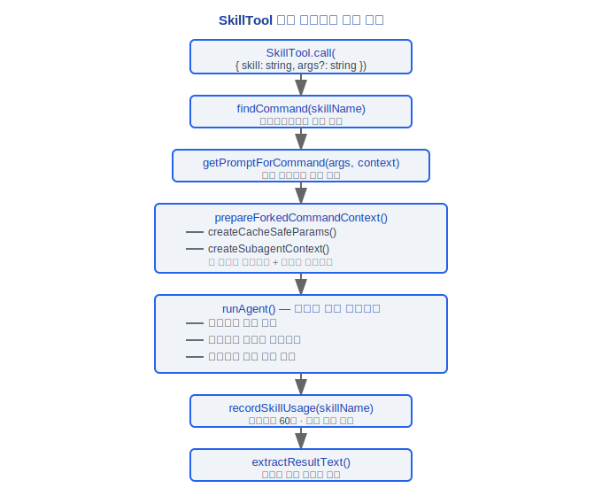
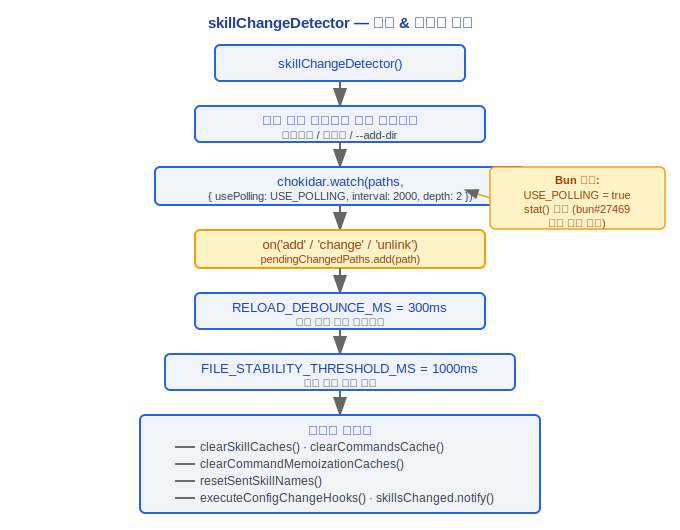

# 스킬 시스템(Skills System)

> Claude Code v2.1.88 스킬 시스템(Skills System): 번들 스킬 정의, 발견 메커니즘, 실행 모델, 변경 감지, 사용량 추적.

---

## 1. BundledSkillDefinition 타입

### 설계 철학

#### 스킬(Skills)이 도구(Tools)와 분리되는 이유는?

Claude Code에서 도구 시스템(Tool System)과 스킬(Skills)은 서로 다른 수준의 추상화입니다.

| 차원 | 도구(Tools) | 스킬(Skills) |
|------|-------|--------|
| 세분성 | 원자적 작업 (파일 읽기, 명령 실행) | 고수준 "레시피" — 복잡한 태스크를 완료하기 위한 여러 도구 호출 조합 |
| 정의 방법 | TypeScript 코드 (`src/tools/`) | Markdown + frontmatter로 정의 가능 (사용자 생성 가능) |
| 호출자 | 모델이 직접 호출 | `SkillTool` 래퍼를 통해 간접 호출 |
| 실행 모드 | 현재 쿼리 루프에서 동기적으로 실행 | `inline`(현재 대화에 주입) 또는 `fork`(독립 서브 에이전트) 지원 |

이 분리를 통해 사용자는 TypeScript 코드를 작성하지 않고 Markdown으로 사용자 정의 스킬을 정의할 수 있습니다(프로젝트 `.claude/skills/` 디렉토리). `bundledSkills.ts:88`의 `source: 'bundled'` 필드가 `loadSkillsDir.ts`의 Markdown 로딩 메커니즘과 공존하며 이 이중 트랙 설계를 확인합니다.

#### 스킬 실행이 동일한 쿼리 루프가 아닌 포크(fork)로 실행되는 이유는?

`SkillTool.ts:119-121`의 주석에 다음과 같이 명시되어 있습니다.

```typescript
/**
 * 포크된 서브 에이전트 컨텍스트에서 스킬을 실행합니다.
 * 이것은 독립적인 토큰 예산을 가진 격리된 에이전트에서 스킬 프롬프트를 실행합니다.
 */
```

포크 모드(`command.context === 'fork'`, `SkillTool.ts:622`)는 세 가지 핵심 이점과 함께 독립적인 컨텍스트를 생성합니다.

1. **격리**: 스킬 중간 메시지가 메인 대화를 오염시키지 않음 — `prepareForkedCommandContext()`가 새로운 메시지 기록 생성
2. **사용자 정의 프롬프트**: 포크된 서브 에이전트는 `agentDefinition`을 통해 정의된 완전히 다른 시스템 프롬프트를 가질 수 있음
3. **독립적 취소**: 스킬 실패가 메인 루프에 영향을 미치지 않으며, 서브 에이전트는 독립적인 토큰 예산과 쿼리 깊이 추적을 가짐

`SkillTool.ts:302-325`의 출력 스키마는 `inline`(status: 'inline')과 `forked`(status: 'forked') 실행 결과를 명확히 구분하여 의도적인 이중 모드 설계를 확인합니다.

---

`src/skills/bundledSkills.ts`는 번들 스킬의 핵심 타입을 정의합니다.

```typescript
type BundledSkillDefinition = {
  name: string                    // 스킬 이름 (즉, /command 이름)
  description: string             // 스킬 설명, 도움말 및 검색에 표시됨
  aliases?: string[]              // 별칭 목록 (예: /co를 /commit의 별칭으로)
  whenToUse?: string              // 모델에게 이 스킬을 사용할 시점 알림
  argumentHint?: string           // 인수 힌트 텍스트
  allowedTools?: string[]         // 스킬 실행 중 사용 가능한 도구 허용 목록
  model?: string                  // 모델 오버라이드 (예: 'sonnet', 'opus')
  disableModelInvocation?: boolean // 자동 모델 호출 비활성화 (사용자 전용)
  userInvocable?: boolean         // 사용자가 직접 호출 가능 여부 (기본값 true)
  isEnabled?: () => boolean       // 동적 활성화 조건
  hooks?: HooksSettings           // 스킬 수준 훅(Hooks) 설정
  context?: 'inline' | 'fork'    // 실행 컨텍스트 모드
  agent?: string                  // 연관된 에이전트 유형
  files?: Record<string, string>  // 참조 파일 (요청 시 디스크에 추출)
  getPromptForCommand: (          // 핵심: 스킬 프롬프트 내용 생성
    args: string,
    context: ToolUseContext
  ) => Promise<ContentBlockParam[]>
}
```

### context 모드

- **`inline`** — 스킬 프롬프트가 현재 대화 컨텍스트에 직접 주입되며, 서브 에이전트가 생성되지 않음
- **`fork`** — 스킬이 독립적인 토큰 예산을 가진 격리된 포크 서브 에이전트에서 실행됨

### files 메커니즘

`files` 필드가 비어 있지 않은 경우:
1. 첫 번째 호출 시 파일이 `getBundledSkillsRoot()/<skillName>/` 디렉토리에 추출됨
2. O_NOFOLLOW | O_EXCL를 사용한 보안 쓰기 (심볼릭 링크 공격 방지)
3. 추출 작업은 Promise를 통해 중복 제거됨 (동시 호출이 단일 추출을 공유)
4. 프롬프트 접두사에 `"Base directory for this skill: <dir>"` 추가하여 모델이 Read/Grep으로 접근 가능

### 등록 메커니즘

```typescript
export function registerBundledSkill(definition: BundledSkillDefinition): void
```

등록된 스킬은 `source: 'bundled'`와 함께 `Command` 객체로 내부 레지스트리에 저장됩니다. main.tsx에서 `getCommands()` 전에 `initBundledSkills()`를 호출해야 합니다.

---

## 2. 17가지 번들 스킬

`src/skills/bundled/` 디렉토리의 번들 스킬:

| 스킬 | 파일 | 설명 |
|---|---|---|
| batch | batch.ts | 일괄 작업 |
| claude-api | claudeApi.ts | Claude API / Anthropic SDK 사용 가이드 |
| claude-api-content | claudeApiContent.ts | Claude API 콘텐츠 생성 |
| claude-in-chrome | claudeInChrome.ts | Chrome 브라우저 통합 |
| debug | debug.ts | 디버깅 지원 |
| keybindings | keybindings.ts | 키바인딩 도움말 |
| loop | loop.ts | 루프 실행 (예약 프롬프트/명령 트리거) |
| lorem-ipsum | loremIpsum.ts | Lorem Ipsum 생성 |
| remember | remember.ts | 메모리 관리 |
| schedule | scheduleRemoteAgents.ts | 원격 에이전트 예약 |
| simplify | simplify.ts | 코드 단순화 검토 |
| skillify | skillify.ts | 스킬 생성 지원 |
| stuck | stuck.ts | 막힌 상태에서의 복구 |
| update-config | updateConfig.ts | 설정 업데이트 |
| verify | verify.ts | 검증 검사 |
| verify-content | verifyContent.ts | 콘텐츠 검증 |
| index | index.ts | 등록 엔트리 포인트 (initBundledSkills) |

---

## 3. 스킬 발견

스킬은 세 가지 경로를 통해 발견되고 로드됩니다.

### 3.1 프로젝트 수준 (project/.claude/skills/)

`src/skills/loadSkillsDir.ts`는 다음 디렉토리 계층을 스캔합니다.

```
<project-root>/.claude/skills/          # 프로젝트 스킬
<parent-dir>/.claude/skills/            # 사용자 홈 디렉토리까지 상위 순회
~/.claude/skills/                       # 사용자 수준 스킬
```

각 서브디렉토리에는 frontmatter 설정을 지원하는 Markdown 파일이 스킬 정의로 포함됩니다.

```yaml
---
description: "스킬 설명"
model: "sonnet"
allowedTools: ["Read", "Edit", "Bash"]
context: fork
agent: worker
---
```

### 3.2 사용자 수준 설정

- **~/.claude/skills/** — 글로벌 사용자 스킬 디렉토리
- **추가 디렉토리** — `--add-dir` 플래그로 지정된 추가 디렉토리도 `.claude/skills/`가 스캔됨

### 3.3 MCP 스킬

`feature('MCP_SKILLS')`가 활성화된 경우:
- `src/skills/mcpSkillBuilders.ts`가 MCP 프롬프트를 스킬로 변환
- `fetchMcpSkillsForClient()`가 MCP 서버에서 사용 가능한 프롬프트를 가져옴
- MCP 스킬은 해당 MCP 서버 이름으로 `source`가 표시됨

### 로딩 흐름

```typescript
// loadSkillsDir.ts
getSkillsPath()              // 모든 스킬 디렉토리 경로 가져오기
loadMarkdownFilesForSubdir() // Markdown 파일 스캔
parseFrontmatter()           // frontmatter 파싱
clearSkillCaches()           // 핫 리로드를 위한 캐시 지우기
onDynamicSkillsLoaded()      // 동적 스킬 로드 콜백
```

---

## 4. SkillTool 실행

`src/tools/SkillTool/SkillTool.ts`는 스킬 호출을 위한 도구 엔트리 포인트입니다.

### 4.1 포크 컨텍스트 실행

스킬의 `context === 'fork'`인 경우:



### 4.2 격리된 토큰 예산

포크 모드의 서브 에이전트는 메인 대화의 컨텍스트 윈도우를 소비하지 않는 독립적인 토큰 예산을 가집니다. 이것은 대규모 스킬 작업(예: 코드 검토, 문서 생성)에 매우 중요합니다.

### 4.3 쿼리 깊이 추적

중첩된 스킬 호출은 `getAgentContext()`를 통해 현재 쿼리 깊이를 추적하여 무한 재귀를 방지합니다.

### 4.4 모델 해결

스킬은 모델 오버라이드를 지정할 수 있으며, 해결 우선순위는 다음과 같습니다.

```
스킬 frontmatter 모델 > 에이전트 정의 모델 > 부모 모델 > 기본 메인 루프 모델
```

`resolveSkillModelOverride()`를 통해 구현됩니다.

### 4.5 권한 확인

SkillTool은 실행 전 `getRuleByContentsForTool()`을 통해 권한 규칙을 확인합니다. 플러그인(Plugin) 출처의 스킬은 `parsePluginIdentifier()`를 통해 공식 마켓플레이스 상태를 확인합니다.

### 4.6 호출된 스킬 추적

스킬 호출은 Bootstrap State의 `invokedSkills` Map에 기록됩니다.

```typescript
invokedSkills: Map<string, {
  skillName: string
  skillPath: string
  content: string
  invokedAt: number
  agentId: string | null
}>
```

키 형식은 `${agentId ?? ''}:${skillName}`으로, 에이전트 간 덮어쓰기를 방지합니다. 이 기록은 압축 후에도 보존되어 스킬 컨텍스트가 손실되지 않습니다.

---

## 5. skillChangeDetector

`src/utils/skills/skillChangeDetector.ts`는 파일시스템 와칭을 통해 스킬 핫 리로드를 구현합니다.

### 5.1 핵심 상수

```typescript
const FILE_STABILITY_THRESHOLD_MS = 1000    // 파일 쓰기 안정성 대기 시간
const FILE_STABILITY_POLL_INTERVAL_MS = 500 // 파일 안정성 폴링 간격
const RELOAD_DEBOUNCE_MS = 300              // 빠른 변경 이벤트 디바운스
const POLLING_INTERVAL_MS = 2000            // chokidar 폴링 간격 (USE_POLLING 모드)
```

### 5.2 Chokidar 와칭

```typescript
const USE_POLLING = typeof Bun !== 'undefined'
// Bun의 fs.watch()는 PathWatcherManager 데드락 문제가 있음 (oven-sh/bun#27469, #26385)
// Bun 환경에서는 대신 stat() 폴링 사용
```

와칭 흐름:



### 5.3 신호 메커니즘

```typescript
const skillsChanged = createSignal()
// skillsChanged.subscribe()를 통한 외부 리스너
```

클린업은 `registerCleanup()`을 통해 등록되어 프로세스 종료 시 와처가 닫힙니다.

---

## 6. skillUsageTracking

`src/utils/suggestions/skillUsageTracking.ts`는 지수 감쇠 기반 스킬 사용량 랭킹을 구현합니다.

### 6.1 사용량 기록

```typescript
export function recordSkillUsage(skillName: string): void {
  // SKILL_USAGE_DEBOUNCE_MS = 60_000 (1분 내 반복 호출은 기록되지 않음)
  // globalConfig.skillUsage[skillName] = { usageCount, lastUsedAt }에 씀
}
```

### 6.2 점수 계산

```typescript
export function getSkillUsageScore(skillName: string): number {
  const usage = config.skillUsage?.[skillName]
  if (!usage) return 0

  // 7일 반감기 지수 감쇠
  const daysSinceUse = (Date.now() - usage.lastUsedAt) / (1000 * 60 * 60 * 24)
  const recencyFactor = Math.pow(0.5, daysSinceUse / 7)

  // 최소 감쇠 계수 0.1 (고빈도지만 오래 사용하지 않은 스킬이 완전히 사라지지 않음)
  return usage.usageCount * Math.max(recencyFactor, 0.1)
}
```

### 점수 모델

```
score = usageCount * max(0.5^(daysSinceUse / 7), 0.1)

예시:
- 오늘 10번 사용: score = 10 * 1.0 = 10.0
- 7일 전 10번 사용: score = 10 * 0.5 = 5.0
- 14일 전 10번 사용: score = 10 * 0.25 = 2.5
- 30일 전 10번 사용: score = 10 * 0.1 = 1.0 (하한)
```

이 점수는 `commandSuggestions.ts`의 스킬 제안 정렬에 사용되며, 최근 고빈도 스킬을 우선순위로 합니다.

---

## 엔지니어링 실전 가이드

### 사용자 정의 스킬 생성

`.claude/skills/` 디렉토리에 Markdown 파일을 생성하여 사용자 정의 스킬을 정의합니다.

**체크리스트:**

1. 디렉토리 및 파일 생성:
   ```
   .claude/skills/my-skill/my-skill.md
   ```

2. frontmatter 설정 작성:
   ```yaml
   ---
   description: "나의 사용자 정의 스킬 설명"
   model: "sonnet"
   allowedTools: ["Read", "Edit", "Bash", "Grep"]
   context: fork
   agent: worker
   ---
   ```

3. 본문은 스킬 프롬프트입니다 — 스킬이 수행해야 할 작업을 설명합니다:
   ```markdown
   당신은 코드 검토 어시스턴트입니다. 현재 프로젝트에서 다음 문제를 확인하십시오:
   1. 사용하지 않는 임포트
   2. 처리되지 않은 오류
   3. 하드코딩된 설정 값

   파일별로 문제를 보고하고 수정 제안을 제공하십시오.
   ```

4. 스킬이 자동으로 발견됩니다(`skillChangeDetector`가 `.claude/skills/` 디렉토리 변경을 와칭하고, 300ms 디바운스 + 1000ms 안정성 대기 후 핫 리로드)

**스킬 디렉토리 스캔 경로 (우선순위 높음에서 낮음):**
- `<project-root>/.claude/skills/` — 프로젝트 수준 스킬
- `<parent-dir>/.claude/skills/` — 사용자 홈 디렉토리까지 상위 순회
- `~/.claude/skills/` — 사용자 수준 글로벌 스킬
- `--add-dir`로 지정된 추가 디렉토리

### 스킬 실행 디버깅

1. **스킬이 발견되는지 확인**: `/skills` 명령어를 실행하여 로드된 스킬 목록 확인
2. **포크 에이전트 메시지 기록 확인**: 포크 모드 스킬은 독립적인 서브 에이전트에서 실행됨(`SkillTool.ts:119-121`). 별도의 메시지 기록과 토큰 예산을 가짐
3. **스킬 발견 경로 확인**: Markdown 파일이 올바른 `.claude/skills/` 서브디렉토리에 있는지 확인
4. **frontmatter 파싱 확인**: `parseFrontmatter()`가 YAML frontmatter를 파싱하며, 형식 오류는 스킬 로딩 실패를 초래
5. **Chokidar 와칭 확인**: Bun 환경에서는 fs.watch() 대신 stat() 폴링을 사용함(PathWatcherManager 데드락 문제, oven-sh/bun#27469), 폴링 간격은 2000ms

### 스킬과 명령 협업

- 스킬은 등록 후 자동으로 `/` 명령어 트리거가 됩니다(`registerBundledSkill()`은 스킬을 `source: 'bundled'`와 함께 `Command` 객체로 등록)
- 사용자는 `/skill-name`으로 호출하고, 모델은 `SkillTool` 도구를 통해 호출
- 스킬 별칭(`aliases`)도 명령어 트리거로 등록됨(예: `/co`를 `/commit`의 별칭으로)
- `disableModelInvocation: true`인 경우 사용자만 `/` 명령어로 호출 가능하며, 모델은 자동 트리거 불가

### 스킬 모델 오버라이드

스킬은 서로 다른 모델을 지정할 수 있으며, 해결 우선순위는 다음과 같습니다.
```
스킬 frontmatter 모델 > 에이전트 정의 모델 > 부모 모델 > 기본 메인 루프 모델
```
`resolveSkillModelOverride()`를 통해 구현됩니다. 사용 사례:
- 단순 태스크는 `haiku`를 사용하여 비용 절약
- 복잡한 추론 태스크는 `opus`를 사용하여 높은 품질

### 일반적인 함정

> **스킬 포크 독립 컨텍스트 — 메인 대화의 파일 수정을 볼 수 없음**
> 포크 모드 스킬(`context: 'fork'`)은 새로운 메시지 기록을 생성합니다(`prepareForkedCommandContext()`가 독립 컨텍스트를 생성). 서브 에이전트는 메인 대화에서 이미 읽기/수정된 파일 내용을 볼 수 없습니다. 파일을 직접 Read해야 합니다. 이것은 격리의 비용입니다.

> **스킬 토큰 소비는 총 비용에 포함됩니다**
> 포크 스킬은 독립적인 토큰 예산을 가지지만, API 호출 소비는 세션 총 비용(`totalCostUSD`)에 포함됩니다. 빈번한 대규모 스킬 호출은 비용을 크게 증가시킵니다. `recordSkillUsage()`에는 60초 디바운스(`SKILL_USAGE_DEBOUNCE_MS = 60_000`)가 있지만, 이것은 사용량 기록만 디바운스하며 실제 API 호출은 디바운스하지 않습니다.

> **initBundledSkills()는 getCommands() 전에 호출해야 합니다**
> 소스 코드 주석에서 `main.tsx`에서 `getCommands()` 전에 `initBundledSkills()`를 호출해야 한다고 명시적으로 요구합니다. 순서가 바뀌면 번들 스킬이 명령 목록에 나타나지 않습니다.

> **스킬 파일의 보안 쓰기**
> `files` 필드의 파일 추출은 `O_NOFOLLOW | O_EXCL` 플래그를 사용하며(심볼릭 링크 공격 방지), Promise를 통해 중복 추출을 방지합니다. `getBundledSkillsRoot()/<skillName>/` 디렉토리의 추출된 파일을 수동으로 수정하지 마십시오. 덮어쓰일 수 있습니다.

> **스킬 사용량의 지수 감쇠 랭킹**
> `getSkillUsageScore()`는 7일 반감기 지수 감쇠(`Math.pow(0.5, daysSinceUse / 7)`)를 사용하며, 최소 계수는 0.1입니다. 오래 사용하지 않은 스킬은 하한에 도달하지만 완전히 사라지지 않아 제안 목록에서 최소한의 가시성을 유지합니다.


---

[← 훅 시스템](../09-Hooks系统/hooks-system-ko.md) | [인덱스](../README_KO.md) | [멀티 에이전트 →](../11-多智能体/multi-agent-ko.md)
