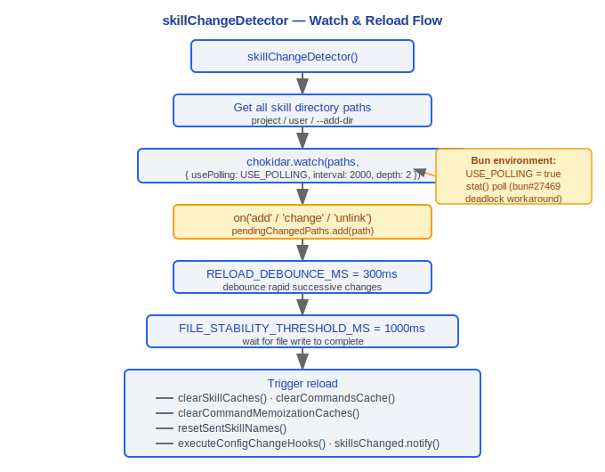

# Skills 系统

> Claude Code v2.1.88 的技能系统：内置技能定义、发现机制、执行模型、变更检测、使用量跟踪。

---

## 1. BundledSkillDefinition 类型

### 设计理念

#### 为什么 Skills 与 Tools 分离？

Claude Code 中 Tools 和 Skills 是两个不同层级的抽象：

| 维度 | Tools | Skills |
|------|-------|--------|
| 粒度 | 原子操作（读文件、执行命令） | 高层"配方"——组合多个 tool 调用完成复杂任务 |
| 定义方式 | TypeScript 代码（`src/tools/`） | 可用 Markdown + frontmatter 定义（用户可创建） |
| 调用者 | 模型直接调用 | 通过 `SkillTool` 包装器间接调用 |
| 执行模式 | 在当前 query 循环中同步执行 | 支持 `inline`（注入当前对话）或 `fork`（独立子 agent） |

这种分离让用户可以用 Markdown 定义自定义技能（项目 `.claude/skills/` 目录），而不需要编写 TypeScript 代码。源码中 `bundledSkills.ts:88` 的 `source: 'bundled'` 字段与 `loadSkillsDir.ts` 的 Markdown 加载机制共存，证实了这种双轨设计。

#### 为什么 Skill 执行是 fork 而不是在同一 query 循环中？

源码 `SkillTool.ts:119-121` 的注释明确说明：

```typescript
/**
 * Executes a skill in a forked sub-agent context.
 * This runs the skill prompt in an isolated agent with its own token budget.
 */
```

Fork 模式（`command.context === 'fork'`，`SkillTool.ts:622`）创建独立上下文有三个关键优势：

1. **隔离性**: 技能的中间消息不污染主对话——`prepareForkedCommandContext()` 创建全新的消息历史
2. **自定义 prompt**: fork 的子 agent 可以有完全不同的系统提示，通过 `agentDefinition` 定义
3. **独立取消**: 技能失败不影响主循环，子 agent 有独立的 token 预算和 query depth 追踪

源码中 `SkillTool.ts:302-325` 的 output schema 清晰区分了 `inline`（status: 'inline'）和 `forked`（status: 'forked'）两种执行结果，进一步证实了双模式设计的刻意性。

---

`src/skills/bundledSkills.ts` 定义了内置技能的核心类型：

```typescript
type BundledSkillDefinition = {
  name: string                    // 技能名称（即 /command 名称）
  description: string             // 技能描述，展示在帮助和搜索中
  aliases?: string[]              // 别名列表（如 /commit 的别名 /co）
  whenToUse?: string              // 向模型说明何时应使用此技能
  argumentHint?: string           // 参数提示文本
  allowedTools?: string[]         // 技能执行时可用的工具白名单
  model?: string                  // 模型覆盖（如 'sonnet'、'opus'）
  disableModelInvocation?: boolean // 禁止模型自动调用（仅用户可调用）
  userInvocable?: boolean         // 用户是否可直接调用（默认 true）
  isEnabled?: () => boolean       // 动态启用条件
  hooks?: HooksSettings           // 技能级 hooks 配置
  context?: 'inline' | 'fork'    // 执行上下文模式
  agent?: string                  // 关联的 agent 类型
  files?: Record<string, string>  // 附带的参考文件（按需提取到磁盘）
  getPromptForCommand: (          // 核心：生成技能提示内容
    args: string,
    context: ToolUseContext
  ) => Promise<ContentBlockParam[]>
}
```

### context 模式

- **`inline`** — 技能提示直接注入当前对话上下文，不创建子 agent
- **`fork`** — 技能在隔离的 forked 子 agent 中执行，拥有独立的 token 预算

### files 机制

当 `files` 字段非空时：
1. 首次调用时将文件提取到 `getBundledSkillsRoot()/<skillName>/` 目录
2. 使用 O_NOFOLLOW | O_EXCL 安全写入（防止符号链接攻击）
3. 提取操作通过 Promise 去重（并发调用共享同一次提取）
4. 在提示前缀添加 `"Base directory for this skill: <dir>"` 让模型可通过 Read/Grep 访问

### 注册机制

```typescript
export function registerBundledSkill(definition: BundledSkillDefinition): void
```

注册后的技能作为 `Command` 对象存入内部 registry，`source: 'bundled'`。在 main.tsx 中 `initBundledSkills()` 必须在 `getCommands()` 之前调用。

---

## 2. 17 个内置技能

`src/skills/bundled/` 目录下的内置技能：

| 技能 | 文件 | 说明 |
|---|---|---|
| batch | batch.ts | 批量操作 |
| claude-api | claudeApi.ts | Claude API / Anthropic SDK 使用指导 |
| claude-api-content | claudeApiContent.ts | Claude API 内容生成 |
| claude-in-chrome | claudeInChrome.ts | Chrome 浏览器集成 |
| debug | debug.ts | 调试辅助 |
| keybindings | keybindings.ts | 键绑定帮助 |
| loop | loop.ts | 循环执行（定时触发 prompt/命令） |
| lorem-ipsum | loremIpsum.ts | Lorem Ipsum 生成 |
| remember | remember.ts | 记忆管理 |
| schedule | scheduleRemoteAgents.ts | 远程 Agent 调度 |
| simplify | simplify.ts | 代码简化审查 |
| skillify | skillify.ts | 技能创建辅助 |
| stuck | stuck.ts | 卡住恢复 |
| update-config | updateConfig.ts | 配置更新 |
| verify | verify.ts | 验证检查 |
| verify-content | verifyContent.ts | 内容验证 |
| index | index.ts | 注册入口（initBundledSkills） |

---

## 3. 技能发现

技能通过三条路径被发现和加载：

### 3.1 项目级 (project/.claude/skills/)

`src/skills/loadSkillsDir.ts` 扫描以下目录层级：

```
<project-root>/.claude/skills/          # 项目技能
<parent-dir>/.claude/skills/            # 向上遍历到用户主目录
~/.claude/skills/                       # 用户级技能
```

每个子目录包含一个 Markdown 文件作为技能定义，支持 frontmatter 配置：

```yaml
---
description: "技能描述"
model: "sonnet"
allowedTools: ["Read", "Edit", "Bash"]
context: fork
agent: worker
---
```

### 3.2 用户级配置

- **~/.claude/skills/** — 全局用户技能目录
- **附加目录** — `--add-dir` 标志指定的额外目录也会扫描其 `.claude/skills/`

### 3.3 MCP 技能

当 `feature('MCP_SKILLS')` 启用时：
- `src/skills/mcpSkillBuilders.ts` 将 MCP prompts 转换为技能
- `fetchMcpSkillsForClient()` 从 MCP 服务器获取可用 prompts
- MCP 技能的 `source` 标记为对应的 MCP 服务器名

### 加载流程

```typescript
// loadSkillsDir.ts
getSkillsPath()              // 获取所有技能目录路径
loadMarkdownFilesForSubdir() // 扫描 Markdown 文件
parseFrontmatter()           // 解析 frontmatter
clearSkillCaches()           // 清除缓存用于热重载
onDynamicSkillsLoaded()      // 动态技能加载完成回调
```

---

## 4. SkillTool 执行

`src/tools/SkillTool/SkillTool.ts` 是技能调用的工具入口：

### 4.1 Fork Context 执行

当技能的 `context === 'fork'` 时：


### 4.2 Isolated Token Budget

Fork 模式下的子 agent 拥有独立的 token 预算，不会消耗主对话的上下文窗口。这对于大型技能操作（如代码审查、文档生成）至关重要。

### 4.3 Query Depth Tracking

嵌套的技能调用通过 `getAgentContext()` 追踪当前查询深度，防止无限递归。

### 4.4 Model Resolution

技能可指定模型覆盖，解析优先级：

```
技能 frontmatter model > Agent 定义 model > 父级模型 > 默认主循环模型
```

通过 `resolveSkillModelOverride()` 实现。

### 4.5 权限检查

SkillTool 执行前通过 `getRuleByContentsForTool()` 检查权限规则。插件来源的技能通过 `parsePluginIdentifier()` 验证是否为官方市场插件。

### 4.6 Invoked Skills 追踪

技能调用记录在 Bootstrap State 的 `invokedSkills` Map 中：

```typescript
invokedSkills: Map<string, {
  skillName: string
  skillPath: string
  content: string
  invokedAt: number
  agentId: string | null
}>
```

Key 格式为 `${agentId ?? ''}:${skillName}`，防止跨 agent 覆盖。这些记录在压缩后保留，确保技能上下文不丢失。

---

## 5. skillChangeDetector

`src/utils/skills/skillChangeDetector.ts` 通过文件系统监听实现技能热重载：

### 5.1 核心常量

```typescript
const FILE_STABILITY_THRESHOLD_MS = 1000    // 文件写入稳定等待时间
const FILE_STABILITY_POLL_INTERVAL_MS = 500 // 文件稳定性轮询间隔
const RELOAD_DEBOUNCE_MS = 300              // 快速变更事件去抖动
const POLLING_INTERVAL_MS = 2000            // chokidar 轮询间隔（USE_POLLING 模式）
```

### 5.2 Chokidar 监听

```typescript
const USE_POLLING = typeof Bun !== 'undefined'
// Bun 的 fs.watch() 存在 PathWatcherManager 死锁问题（oven-sh/bun#27469, #26385）
// 在 Bun 环境下使用 stat() 轮询替代
```

监听流程：



### 5.3 信号机制

```typescript
const skillsChanged = createSignal()
// 外部通过 skillsChanged.subscribe() 监听变更
```

清理通过 `registerCleanup()` 注册，确保进程退出时关闭 watcher。

---

## 6. skillUsageTracking

`src/utils/suggestions/skillUsageTracking.ts` 实现基于指数衰减的技能使用量排名：

### 6.1 记录使用

```typescript
export function recordSkillUsage(skillName: string): void {
  // SKILL_USAGE_DEBOUNCE_MS = 60_000（1分钟内重复调用不记录）
  // 写入 globalConfig.skillUsage[skillName] = { usageCount, lastUsedAt }
}
```

### 6.2 计算评分

```typescript
export function getSkillUsageScore(skillName: string): number {
  const usage = config.skillUsage?.[skillName]
  if (!usage) return 0

  // 7 天半衰期指数衰减
  const daysSinceUse = (Date.now() - usage.lastUsedAt) / (1000 * 60 * 60 * 24)
  const recencyFactor = Math.pow(0.5, daysSinceUse / 7)

  // 最低衰减因子 0.1（高频但长期未用的技能不会完全消失）
  return usage.usageCount * Math.max(recencyFactor, 0.1)
}
```

### 评分模型

```
score = usageCount * max(0.5^(daysSinceUse / 7), 0.1)

示例：
- 今天使用 10 次：score = 10 * 1.0 = 10.0
- 7 天前使用 10 次：score = 10 * 0.5 = 5.0
- 14 天前使用 10 次：score = 10 * 0.25 = 2.5
- 30 天前使用 10 次：score = 10 * 0.1 = 1.0（触底）
```

该评分用于 `commandSuggestions.ts` 中技能建议的排序，使最近高频使用的技能优先展示。

---

## 工程实践指南

### 创建自定义技能

在 `.claude/skills/` 目录中创建 Markdown 文件即可定义自定义技能：

**步骤清单：**

1. 创建目录和文件：
   ```
   .claude/skills/my-skill/my-skill.md
   ```

2. 编写 frontmatter 配置：
   ```yaml
   ---
   description: "我的自定义技能描述"
   model: "sonnet"
   allowedTools: ["Read", "Edit", "Bash", "Grep"]
   context: fork
   agent: worker
   ---
   ```

3. 正文即技能 prompt——描述技能应该做什么：
   ```markdown
   你是一个代码审查助手。请检查当前项目中的以下问题：
   1. 未使用的导入
   2. 未处理的错误
   3. 硬编码的配置值

   逐文件报告问题并给出修复建议。
   ```

4. 技能自动被发现（`skillChangeDetector` 监听 `.claude/skills/` 目录变更，300ms 去抖动 + 1000ms 稳定等待后热重载）

**技能目录扫描路径（优先级从高到低）：**
- `<project-root>/.claude/skills/` — 项目级技能
- `<parent-dir>/.claude/skills/` — 向上遍历到用户主目录
- `~/.claude/skills/` — 用户级全局技能
- `--add-dir` 指定的额外目录

### 调试技能执行

1. **检查技能是否被发现**：运行 `/skills` 命令查看已加载的技能列表
2. **检查 fork agent 的消息历史**：fork 模式的技能在独立子 agent 中执行（`SkillTool.ts:119-121`），有独立的消息历史和 token 预算
3. **检查技能发现路径**：确认 Markdown 文件在正确的 `.claude/skills/` 子目录中
4. **检查 frontmatter 解析**：`parseFrontmatter()` 解析 YAML frontmatter，格式错误会导致技能加载失败
5. **检查 Chokidar 监听**：在 Bun 环境下使用 stat() 轮询替代 fs.watch()（因为 PathWatcherManager 死锁问题，oven-sh/bun#27469），轮询间隔 2000ms

### 技能与命令的协作

- 技能注册后自动成为 `/` 命令触发器（`registerBundledSkill()` 将技能注册为 `Command` 对象，`source: 'bundled'`）
- 用户通过 `/skill-name` 调用，模型通过 `SkillTool` 工具调用
- 技能的别名（`aliases`）也注册为命令触发器（如 `/commit` 的别名 `/co`）
- `disableModelInvocation: true` 时只允许用户通过 `/` 命令调用，模型不可自动触发

### 技能的模型覆盖

技能可指定使用不同的模型，解析优先级：
```
技能 frontmatter model > Agent 定义 model > 父级模型 > 默认主循环模型
```
通过 `resolveSkillModelOverride()` 实现。适用场景：
- 简单任务使用 `haiku` 节省成本
- 复杂推理任务使用 `opus` 提高质量

### 常见陷阱

> **技能 fork 独立 context——不会看到主对话的文件修改**
> fork 模式的技能（`context: 'fork'`）创建全新的消息历史（`prepareForkedCommandContext()` 创建独立上下文）。子 agent 无法看到主对话中已经读取/修改的文件内容——它必须自己重新 Read 文件。这是隔离性的代价。

> **技能的 token 消耗计入总费用**
> 虽然 fork 技能有独立的 token 预算，但其 API 调用消耗仍计入会话总费用（`totalCostUSD`）。频繁调用大型技能会显著增加成本。`recordSkillUsage()` 有 60 秒去抖动（`SKILL_USAGE_DEBOUNCE_MS = 60_000`），但这只是使用量记录的去抖动，不影响实际 API 调用。

> **initBundledSkills() 必须在 getCommands() 之前调用**
> 源码注释明确要求在 `main.tsx` 中 `initBundledSkills()` 必须先于 `getCommands()` 调用。如果顺序颠倒，内置技能不会出现在命令列表中。

> **技能文件的安全写入**
> `files` 字段的文件提取使用 `O_NOFOLLOW | O_EXCL` 标志（防止符号链接攻击），且通过 Promise 去重避免并发提取。不要手动修改 `getBundledSkillsRoot()/<skillName>/` 目录下的提取文件——它们可能被覆盖。

> **技能使用量的指数衰减排名**
> `getSkillUsageScore()` 使用 7 天半衰期的指数衰减（`Math.pow(0.5, daysSinceUse / 7)`），最低因子 0.1。长期未用的技能评分触底但不会归零——在建议列表中始终保持最低可见性。


---

[← Hooks 系统](../09-Hooks系统/hooks-system.md) | [目录](../README.md) | [多智能体 →](../11-多智能体/multi-agent.md)
