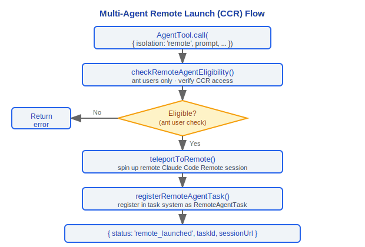
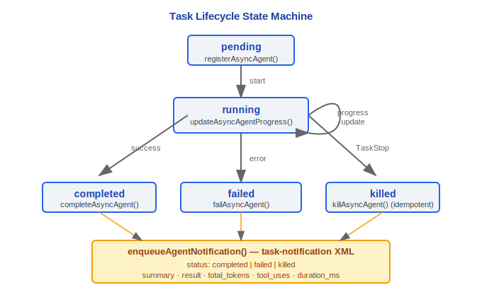

# Multi-Agent System

> Claude Code v2.1.88 multi-agent architecture: AgentTool, auto-backgrounding, worktree isolation, remote launch, coordinator mode, SendMessageTool, task system.

---

## 1. AgentTool

`src/tools/AgentTool/AgentTool.tsx` is the core tool of the multi-agent system.

### 1.1 Input Schema

```typescript
// baseInputSchema
{
  description: string          // 3-5 word task description
  prompt: string               // Task content
  subagent_type?: string       // Specialized agent type
  model?: 'sonnet' | 'opus' | 'haiku'  // Model override
  run_in_background?: boolean  // Background run flag
}

// fullInputSchema (with multi-agent parameters)
{
  ...base,
  name?: string                // Agent name (addressable via SendMessage)
  team_name?: string           // Team name
  mode?: PermissionMode        // Permission mode (e.g., 'plan')
  isolation?: 'worktree' | 'remote'  // Isolation mode
  cwd?: string                 // Working directory override (mutually exclusive with worktree)
}
```

Schema is lazily built via `lazySchema()`. When `CLAUDE_CODE_DISABLE_BACKGROUND_TASKS` is enabled or fork sub-agent mode is active, the `run_in_background` field is removed from the schema (`.omit()`), making it invisible to the model. The `cwd` field is only exposed when `feature('KAIROS')` is enabled.

### Design Philosophy

#### Why does AgentTool recursively create query() instances?

Sub-agents are essentially brand new "conversations" — with independent message history, toolset, and system prompts. In the source code `runAgent.ts`, you can see `for await (const message of query({...}))` directly reusing the main query engine. This recursive design means sub-agents naturally inherit the same capabilities as the main conversation (streaming, error recovery, tool execution) without needing to maintain a separate "agent runtime". Code reuse is extremely high — AgentTool itself only handles parameter assembly and result processing, with all core conversation logic handled by `query()`.

#### Why is the sub-agent's setAppState a no-op?

Sub-agents run in isolated contexts and should not affect main UI state. In the source code, `agentToolUtils.ts` distinguishes between `rootSetAppState` (for task registration/progress and other state that must be visible to the main UI) and the sub-agent's own `setAppState` (not propagated to the UI layer). If sub-agents could arbitrarily modify AppState, multiple concurrent agents would interfere with each other, leading to unpredictable UI state.

#### Why is bubble permission mode needed?

Sub-agents don't have their own user interaction interface — they run in the background and cannot display permission dialogs to users. Therefore, permission requests must "bubble" up to the parent that has UI to handle them. In the source code, `resumeAgent.ts` shows that worker permission mode defaults to `'acceptEdits'`, controlled by the parent's `toolPermissionContext`. This ensures security: sub-agents cannot make permission decisions themselves to bypass user authorization.

#### Why does queryTracking depth increment?

In the source code `query.ts:347-350`, `depth` increments each time the query loop is entered: `depth: toolUseContext.queryTracking.depth + 1`. This is used for telemetry analysis — a user request may trigger a 3-4 level nested agent call chain (user → coordinator → worker → sub-tool agent). `depth` is recorded along with `chainId` in analytics events (`queryDepth: queryTracking.depth`), helping the team understand actual call chain depth in use and discover over-nesting or performance issues.

### 1.2 Output — Discriminated Union

```typescript
// outputSchema distinguishes four result types
type AgentToolOutput =
  | { status: 'completed'; result: string; prompt: string }           // Synchronous completion
  | { status: 'async_launched'; agentId: string; description: string; prompt: string }  // Async launch
  | { status: 'teammate_spawned'; agentId: string; name: string }     // Teammate spawned
  | { status: 'remote_launched'; taskId: string; sessionUrl: string } // Remote launch
```

---

## 2. Auto-backgrounding

```typescript
function getAutoBackgroundMs(): number {
  if (isEnvTruthy(process.env.CLAUDE_AUTO_BACKGROUND_TASKS)
    || getFeatureValue_CACHED_MAY_BE_STALE('tengu_auto_background_agents', false)) {
    return 120_000  // 120 second threshold
  }
  return 0  // Disabled
}
```

When an Agent runs for more than 120 seconds without completion, it automatically converts to a background task. Users see a background hint in the REPL (`BackgroundHint` component displays after 2 seconds) and can continue interacting with the main session.

Key constants:
- `PROGRESS_THRESHOLD_MS = 2000` — Delay before showing background hint
- `getAutoBackgroundMs() = 120_000` — Auto-backgrounding threshold

---

## 3. Worktree Isolation

When `isolation: 'worktree'`, AgentTool creates an independent git worktree for the sub-agent:


File operations in the worktree don't affect the main repository; the coordinator decides how to merge changes after the agent completes.

---

## 4. Remote Launch (CCR)

When `isolation: 'remote'` (available only to ant users), the Agent runs in a remote Claude Code Remote environment:



Remote agents always run in the background; accessible URLs are retrieved via `getRemoteTaskSessionUrl()`.

---

## 5. Coordinator Mode

`src/coordinator/coordinatorMode.ts` defines the coordinator mode's system prompt and toolset.

### 5.1 Enable Conditions

```typescript
export function isCoordinatorMode(): boolean {
  if (feature('COORDINATOR_MODE')) {
    return isEnvTruthy(process.env.CLAUDE_CODE_COORDINATOR_MODE)
  }
  return false
}
```

### 5.2 getCoordinatorSystemPrompt

The coordinator's system prompt defines the following roles:

```
You are Claude Code, an AI assistant that orchestrates software engineering tasks across multiple workers.

Roles:
- Help users achieve their goals
- Direct workers to research, implement, and validate code changes
- Synthesize results and communicate with users
- Do not delegate questions you can answer directly

Available tools:
- Agent — spawn new workers
- SendMessage — send follow-up messages to existing workers
- TaskStop — stop running workers
- subscribe_pr_activity / unsubscribe_pr_activity (if available)
```

### 5.3 INTERNAL_WORKER_TOOLS

Internal toolset in coordinator mode, excluded from workers' available tool list:

```typescript
const INTERNAL_WORKER_TOOLS = new Set([
  TEAM_CREATE_TOOL_NAME,     // TeamCreate
  TEAM_DELETE_TOOL_NAME,     // TeamDelete
  SEND_MESSAGE_TOOL_NAME,    // SendMessage
  SYNTHETIC_OUTPUT_TOOL_NAME // SyntheticOutput
])
```

Workers' tool list is injected via `getCoordinatorUserContext()`, including:
- Standard tools (Bash, Read, Edit, etc.)
- MCP tools (list of connected MCP server names)
- Scratchpad directory path (if enabled)

### 5.4 Session Mode Restoration

`matchSessionMode()` automatically switches to coordinator mode when restoring a session:

```typescript
export function matchSessionMode(
  sessionMode: 'coordinator' | 'normal' | undefined
): string | undefined
// If the restored session is in coordinator mode but the current session is not, automatically switch
```

---

## 6. SendMessageTool

`src/tools/SendMessageTool/SendMessageTool.ts` implements inter-agent communication.

### 6.1 Input Schema

```typescript
{
  to: string       // Recipient: teammate name | "*" (broadcast) | "uds:<socket-path>" | "bridge:<session-id>"
  summary?: string  // 5-10 word UI preview summary
  message: string | StructuredMessage  // Message content
}
```

### 6.2 Structured Message Types

```typescript
const StructuredMessage = z.discriminatedUnion('type', [
  // Shutdown request
  z.object({
    type: z.literal('shutdown_request'),
    reason: z.string().optional()
  }),

  // Shutdown response
  z.object({
    type: z.literal('shutdown_response'),
    request_id: z.string(),
    approve: boolean,           // semanticBoolean()
    reason: z.string().optional()
  }),

  // Plan approval response
  z.object({
    type: z.literal('plan_approval_response'),
    request_id: z.string(),
    approve: boolean,
    feedback: z.string().optional()
  })
])
```

### 6.3 Message Routing

| `to` format | Routing target | Transport |
|---|---|---|
| Teammate name | In-process teammate | `queuePendingMessage()` → in-memory queue |
| `"*"` | All teammates | Broadcast `writeToMailbox()` |
| `uds:<path>` | Local Unix domain socket peer | UDS messaging |
| `bridge:<id>` | Remote control peer | Bridge WebSocket |

The `TEAM_LEAD_NAME` constant identifies the team leader; `isTeamLead()` / `isTeammate()` determine the current role.

---

## 7. Task System

### 7.1 Seven Task Types

`src/tasks/types.ts` defines the discriminated union of task states:

```typescript
type TaskState =
  | LocalShellTaskState           // Local shell command
  | LocalAgentTaskState           // Local agent
  | RemoteAgentTaskState          // Remote agent (CCR)
  | InProcessTeammateTaskState    // In-process teammate
  | LocalWorkflowTaskState        // Local workflow
  | MonitorMcpTaskState           // MCP monitor
  | DreamTaskState                // Memory consolidation (autoDream)
```

Implementations for each task type are located in corresponding directories under `src/tasks/`.

### 7.2 Task Lifecycle



```
State transition API (using LocalAgentTask as example):
  registerAsyncAgent()           // pending
  updateAsyncAgentProgress()     // running (update progress)
  completeAsyncAgent()           // completed
  failAsyncAgent()               // failed
  killAsyncAgent()               // killed
```

### 7.3 Background Task Determination

```typescript
function isBackgroundTask(task: TaskState): task is BackgroundTaskState {
  if (task.status !== 'running' && task.status !== 'pending') return false
  if ('isBackgrounded' in task && task.isBackgrounded === false) return false
  return true
}
```

Foreground tasks (`isBackgrounded === false`) are not counted as background tasks.

### 7.4 Progress Tracking

```
createProgressTracker()          // Create progress tracker
updateProgressFromMessage()      // Update progress from message
getProgressUpdate()              // Get current progress
getTokenCountFromTracker()       // Get token usage
createActivityDescriptionResolver()  // Create activity description resolver
enqueueAgentNotification()       // Queue task completion notification
```

### 7.5 Task Notification Format

In coordinator mode, a `<task-notification>` XML is generated when an agent completes:

```xml
<task-notification>
  <task-id>{agentId}</task-id>
  <status>completed|failed|killed</status>
  <summary>{status summary}</summary>
  <result>{agent's final text response}</result>
  <usage>
    <total_tokens>N</total_tokens>
    <tool_uses>N</tool_uses>
    <duration_ms>N</duration_ms>
  </usage>
</task-notification>
```

---

## 8. Agent Execution Core

### 8.1 runAgent

`src/tools/AgentTool/runAgent.ts` is the agent's actual execution engine. Core flow:

1. Build system prompt (`getSystemPrompt` + `enhanceSystemPromptWithEnvDetails`)
2. Assemble available tool pool (`assembleToolPool`)
3. Execute query loop (reusing main query engine `query.ts`)
4. Handle results or errors

### 8.2 Agent Colors

`src/tools/AgentTool/agentColorManager.ts` assigns a unique color to each agent for UI distinction:

```typescript
// Bootstrap State
agentColorMap: Map<string, AgentColorName>
agentColorIndex: number
```

### 8.3 Agent Type System

`src/tools/AgentTool/loadAgentsDir.ts` manages agent definitions:

```typescript
getAgentDefinitionsWithOverrides()  // Get all agent definitions (with overrides)
getActiveAgentsFromList()           // Get active agent list
isBuiltInAgent()                    // Check if it's a built-in agent
isCustomAgent()                     // Check if it's a custom agent
parseAgentsFromJson()               // Parse agent definitions from JSON
filterAgentsByMcpRequirements()     // Filter by MCP requirements
```

Built-in agent type definitions are in the `src/tools/AgentTool/built-in/` directory. `GENERAL_PURPOSE_AGENT` is the default general-purpose agent. `ONE_SHOT_BUILTIN_AGENT_TYPES` contains built-in agent types that execute once.

### 8.4 Fork Sub-Agent

`src/tools/AgentTool/forkSubagent.ts` implements fork-mode sub-agents:

```typescript
isForkSubagentEnabled()        // Check if fork sub-agent is enabled
isInForkChild()                // Check if currently in a fork child process
buildForkedMessages()          // Build messages for fork context
buildWorktreeNotice()          // Build worktree notice
FORK_AGENT                     // Fork agent constant
```

Fork sub-agents share the prompt cache with the parent agent; `createCacheSafeParams()` ensures cache safety.

---

## Engineering Practice Guide

### Creating Sub-agents

Complete steps for creating sub-agents via `AgentTool`:

1. **Specify task description and prompt**:
   ```typescript
   {
     description: "Code Review",       // 3-5 word task description (for UI display)
     prompt: "Review type safety of all .ts files under src/",  // Detailed task content
     subagent_type: "explore",      // Optional: use a specific agent type
     model: "sonnet",               // Optional: model override
     run_in_background: true        // Optional: run in background
   }
   ```

2. **Choose isolation mode** (in multi-agent mode):
   - No isolation (default): Sub-agent runs in the same working directory
   - `isolation: 'worktree'`: Creates an independent git worktree; file operations don't affect the main repo
   - `isolation: 'remote'`: Runs in a remote Claude Code Remote environment (ant users only)

3. **Choose permission mode**:
   - Default: inherits parent permission mode
   - `mode: 'plan'`: Read-only/planning mode
   - Agent definitions can specify `permissionMode`, but won't override when parent is `bypassPermissions`/`acceptEdits`/`auto`

4. **Handle return result** (one of 4 status types):
   - `completed`: Synchronously completed, includes `result` text
   - `async_launched`: Converted to background task, includes `agentId`
   - `teammate_spawned`: Teammate spawned, includes `name`
   - `remote_launched`: Remote launch, includes `taskId` and `sessionUrl`

### Debugging Sub-agents

1. **Check nesting level**: `queryTracking.depth` records current query depth (+1 per level). In source `query.ts:347-350`, depth increments for telemetry analysis to help discover over-nesting.
2. **Check message history**: Sub-agent message history is independent of the main loop. Use `/tasks` to view background task status and progress.
3. **Check auto-backgrounding**: Agent running over 120 seconds (`getAutoBackgroundMs() = 120_000`) automatically converts to a background task. `BackgroundHint` component displays after 2 seconds.
4. **Check agent color assignment**: `agentColorManager.ts` assigns a unique color to each agent, tracked via `agentColorMap`.
5. **Check worktree status**: If using worktree isolation, `hasWorktreeChanges()` checks whether there are unmerged changes in the worktree.

### Permission Propagation

Sub-agent permission propagation follows the bubble pattern:


- **bubble mode** (`agentPermissionMode === 'bubble'`): Permission requests always bubble up to the parent terminal that has UI
- **acceptEdits mode**: Worker default permission mode (`resumeAgent.ts`), automatically accepts edit operations
- **canShowPermissionPrompts**: Controlled by bubble mode or explicit configuration — sub-agents don't have their own user interaction interface
- Source `runAgent.ts:438-457` defines the permission display logic under bubble mode in detail

### Using Coordinator Mode

Enable coordinator mode:
1. Ensure `feature('COORDINATOR_MODE')` is enabled
2. Set environment variable `CLAUDE_CODE_COORDINATOR_MODE=true`
3. The coordinator's system prompt defines the orchestration role — directing workers to research, implement, and validate
4. Available tools: `Agent` (spawn workers), `SendMessage` (send messages to workers), `TaskStop` (stop workers)
5. Workers' tool list excludes internal tools (`INTERNAL_WORKER_TOOLS`: TeamCreate, TeamDelete, SendMessage, SyntheticOutput)

### Task Notification Format

In coordinator mode, an XML notification is generated when an agent completes (for queuing into the coordinator's message stream):
```xml
<task-notification>
  <task-id>{agentId}</task-id>
  <status>completed|failed|killed</status>
  <summary>{status summary}</summary>
  <result>{agent's final text response}</result>
  <usage>
    <total_tokens>N</total_tokens>
    <tool_uses>N</tool_uses>
    <duration_ms>N</duration_ms>
  </usage>
</task-notification>
```

### Common Pitfalls

> **Sub-agent's setAppState is a no-op**
> Source `AgentTool.tsx:257` and `resumeAgent.ts:57` explicitly comment: in-process teammates receive a no-op `setAppState`. Sub-agents should not affect main UI state. `agentToolUtils.ts` distinguishes between `rootSetAppState` (for task registration/progress and other state that must be visible to the main UI) and the sub-agent's own `setAppState` (not propagated to the UI layer). If multiple concurrent agents could all modify AppState, UI state would become unpredictable.

> **Sub-agents do not inherit the main loop's message history**
> Sub-agents create a brand new `query()` instance via `runAgent.ts` — independent message history, toolset, and system prompt. This means sub-agents don't know what has already been discussed in the main conversation. If you need to pass context, you must explicitly describe it through the `prompt` parameter.

> **Security warning: sub-agents may violate security policies**
> Source `agentToolUtils.ts:476` checks security classifier results after sub-agent execution completes: if behavior that may violate security policies is detected, a `SECURITY WARNING` message is appended. Pay attention to this warning when reviewing sub-agent operations.

> **killAsyncAgent is idempotent**
> `agentToolUtils.ts:641` comments: `killAsyncAgent` is a no-op after `TaskStop` has already set `status='killed'` — it will not terminate again.

> **IMPORTANT: Preserve cliArg rules**
> Source `runAgent.ts:466` notes: sub-agents must preserve `--allowedTools` rules from the SDK (cliArg rules). These are security constraints that cannot be overridden by the sub-agent's tool configuration.


---

[← Skills System](../10-Skills系统/skills-system-en.md) | [Index](../README_EN.md) | [UI Rendering →](../12-UI渲染/ui-rendering-en.md)
