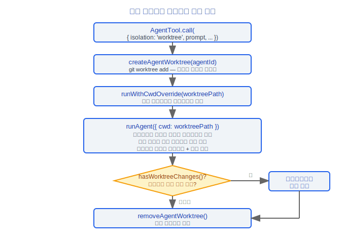
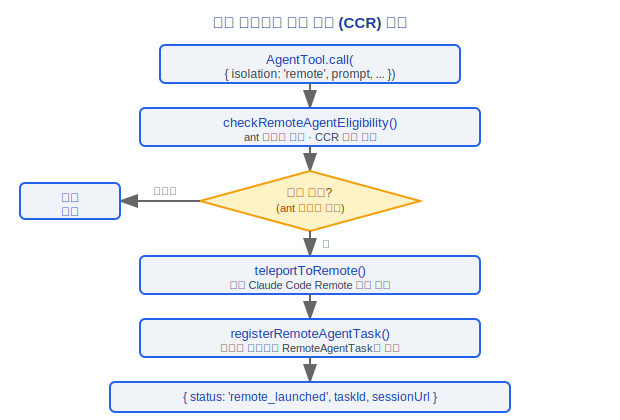
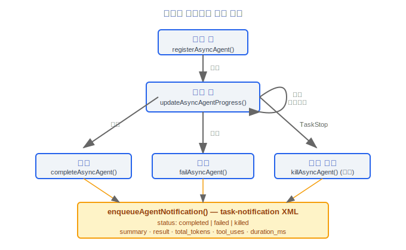
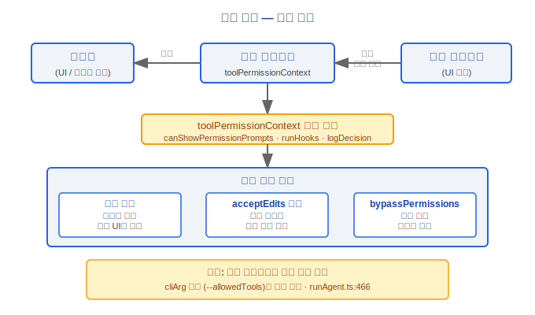

# 멀티 에이전트(Multi-Agent) 시스템

> Claude Code v2.1.88 멀티 에이전트(Multi-Agent) 아키텍처: AgentTool, 자동 백그라운드, 워크트리 격리, 원격 실행, 코디네이터 모드, SendMessageTool, 태스크 시스템.

---

## 1. AgentTool

`src/tools/AgentTool/AgentTool.tsx`는 멀티 에이전트 시스템의 핵심 도구입니다.

### 1.1 입력 스키마

```typescript
// baseInputSchema
{
  description: string          // 3~5단어 태스크 설명
  prompt: string               // 태스크 내용
  subagent_type?: string       // 특화 에이전트 유형
  model?: 'sonnet' | 'opus' | 'haiku'  // 모델 오버라이드
  run_in_background?: boolean  // 백그라운드 실행 플래그
}

// fullInputSchema (멀티 에이전트 파라미터 포함)
{
  ...base,
  name?: string                // 에이전트 이름 (SendMessage로 주소 지정 가능)
  team_name?: string           // 팀 이름
  mode?: PermissionMode        // 권한 모드 (예: 'plan')
  isolation?: 'worktree' | 'remote'  // 격리 모드
  cwd?: string                 // 작업 디렉토리 오버라이드 (worktree와 상호 배타적)
}
```

스키마는 `lazySchema()`를 통해 지연 빌드됩니다. `CLAUDE_CODE_DISABLE_BACKGROUND_TASKS`가 활성화되거나 포크 서브 에이전트 모드가 활성화되면, `run_in_background` 필드가 스키마에서 제거(`.omit()`)되어 모델에게 보이지 않습니다. `cwd` 필드는 `feature('KAIROS')`가 활성화된 경우에만 노출됩니다.

### 설계 철학

#### AgentTool이 재귀적으로 query() 인스턴스를 생성하는 이유는?

서브 에이전트는 본질적으로 완전히 새로운 "대화"입니다. 독립적인 메시지 기록, 도구 집합, 시스템 프롬프트를 가집니다. 소스 코드 `runAgent.ts`에서 `for await (const message of query({...}))`가 메인 쿼리 엔진을 직접 재사용하는 것을 볼 수 있습니다. 이 재귀적 설계는 서브 에이전트가 메인 대화와 동일한 기능(스트리밍, 오류 복구, 도구 실행)을 자연스럽게 상속하도록 합니다. 별도의 "에이전트 런타임"을 유지할 필요가 없습니다. 코드 재사용률이 매우 높습니다. AgentTool 자체는 파라미터 조립과 결과 처리만 담당하며, 모든 핵심 대화 로직은 `query()`가 처리합니다.

#### 서브 에이전트의 setAppState가 no-op인 이유는?

서브 에이전트는 격리된 컨텍스트에서 실행되며 메인 UI 상태에 영향을 미쳐서는 안 됩니다. 소스 코드에서 `agentToolUtils.ts`는 `rootSetAppState`(태스크 등록/진행 및 메인 UI에 표시되어야 하는 상태)와 서브 에이전트 자신의 `setAppState`(UI 레이어에 전파되지 않음)를 구분합니다. 서브 에이전트가 임의로 AppState를 수정할 수 있다면, 여러 동시 에이전트가 서로 간섭하여 예측 불가능한 UI 상태를 초래합니다.

#### 버블 권한 모드가 필요한 이유는?

서브 에이전트는 자체 사용자 인터랙션 인터페이스가 없습니다. 백그라운드에서 실행되며 사용자에게 권한 다이얼로그를 표시할 수 없습니다. 따라서 권한 요청은 UI가 있는 부모에게 "버블업"되어야 합니다. 소스 코드 `resumeAgent.ts`에서 워커 권한 모드는 기본적으로 `'acceptEdits'`이며, 부모의 `toolPermissionContext`에 의해 제어됩니다. 이것은 보안을 보장합니다: 서브 에이전트는 스스로 권한 결정을 내려 사용자 승인을 우회할 수 없습니다.

#### queryTracking 깊이가 증가하는 이유는?

소스 코드 `query.ts:347-350`에서 `depth`는 쿼리 루프에 진입할 때마다 증가합니다: `depth: toolUseContext.queryTracking.depth + 1`. 이것은 텔레메트리 분석에 사용됩니다. 사용자 요청은 3~4단계의 중첩된 에이전트 호출 체인(사용자 → 코디네이터 → 워커 → 서브 도구 에이전트)을 트리거할 수 있습니다. `depth`는 분석 이벤트(`queryDepth: queryTracking.depth`)에서 `chainId`와 함께 기록되어 팀이 실제 사용 중인 호출 체인 깊이를 이해하고 과도한 중첩이나 성능 문제를 발견하는 데 도움이 됩니다.

### 1.2 출력 — 판별 유니온

```typescript
// outputSchema는 네 가지 결과 유형을 구분함
type AgentToolOutput =
  | { status: 'completed'; result: string; prompt: string }           // 동기 완료
  | { status: 'async_launched'; agentId: string; description: string; prompt: string }  // 비동기 실행
  | { status: 'teammate_spawned'; agentId: string; name: string }     // 팀원 생성
  | { status: 'remote_launched'; taskId: string; sessionUrl: string } // 원격 실행
```

---

## 2. 자동 백그라운드

```typescript
function getAutoBackgroundMs(): number {
  if (isEnvTruthy(process.env.CLAUDE_AUTO_BACKGROUND_TASKS)
    || getFeatureValue_CACHED_MAY_BE_STALE('tengu_auto_background_agents', false)) {
    return 120_000  // 120초 임계값
  }
  return 0  // 비활성화
}
```

에이전트가 120초 이상 실행되고 완료되지 않으면, 자동으로 백그라운드 태스크로 전환됩니다. 사용자는 REPL에서 백그라운드 힌트를 볼 수 있으며(`BackgroundHint` 컴포넌트는 2초 후에 표시), 메인 세션과 계속 인터랙션할 수 있습니다.

핵심 상수:
- `PROGRESS_THRESHOLD_MS = 2000` — 백그라운드 힌트 표시 전 지연
- `getAutoBackgroundMs() = 120_000` — 자동 백그라운드 임계값

---

## 3. 워크트리 격리

`isolation: 'worktree'`인 경우, AgentTool은 서브 에이전트를 위한 독립적인 git 워크트리를 생성합니다.



워크트리에서의 파일 작업은 메인 저장소에 영향을 미치지 않습니다. 에이전트가 완료된 후 코디네이터가 변경 사항을 병합하는 방법을 결정합니다.

---

## 4. 원격 실행 (CCR)

`isolation: 'remote'`(ant 사용자에게만 사용 가능)인 경우, 에이전트는 원격 Claude Code Remote 환경에서 실행됩니다.



원격 에이전트는 항상 백그라운드에서 실행되며, 접근 가능한 URL은 `getRemoteTaskSessionUrl()`을 통해 가져옵니다.

---

## 5. 코디네이터 모드(Coordinator Mode)

`src/coordinator/coordinatorMode.ts`는 코디네이터 모드의 시스템 프롬프트와 도구 집합을 정의합니다.

### 5.1 활성화 조건

```typescript
export function isCoordinatorMode(): boolean {
  if (feature('COORDINATOR_MODE')) {
    return isEnvTruthy(process.env.CLAUDE_CODE_COORDINATOR_MODE)
  }
  return false
}
```

### 5.2 getCoordinatorSystemPrompt

코디네이터의 시스템 프롬프트는 다음 역할을 정의합니다.

```
당신은 Claude Code입니다. 여러 워커에 걸쳐 소프트웨어 엔지니어링 태스크를 조율하는 AI 어시스턴트입니다.

역할:
- 사용자가 목표를 달성하도록 도움
- 워커에게 코드 변경 사항 연구, 구현, 검증 지시
- 결과 종합 및 사용자와 소통
- 직접 답할 수 있는 질문은 위임하지 않음

사용 가능한 도구:
- Agent — 새 워커 생성
- SendMessage — 기존 워커에 후속 메시지 전송
- TaskStop — 실행 중인 워커 중지
- subscribe_pr_activity / unsubscribe_pr_activity (사용 가능한 경우)
```

### 5.3 INTERNAL_WORKER_TOOLS

코디네이터 모드의 내부 도구 집합으로, 워커의 사용 가능한 도구 목록에서 제외됩니다.

```typescript
const INTERNAL_WORKER_TOOLS = new Set([
  TEAM_CREATE_TOOL_NAME,     // TeamCreate
  TEAM_DELETE_TOOL_NAME,     // TeamDelete
  SEND_MESSAGE_TOOL_NAME,    // SendMessage
  SYNTHETIC_OUTPUT_TOOL_NAME // SyntheticOutput
])
```

워커의 도구 목록은 `getCoordinatorUserContext()`를 통해 주입되며 다음을 포함합니다.
- 표준 도구 (Bash, Read, Edit 등)
- MCP 도구 (연결된 MCP 서버 이름 목록)
- 스크래치패드 디렉토리 경로 (활성화된 경우)

### 5.4 세션 모드 복원

`matchSessionMode()`는 세션 복원 시 자동으로 코디네이터 모드로 전환합니다.

```typescript
export function matchSessionMode(
  sessionMode: 'coordinator' | 'normal' | undefined
): string | undefined
// 복원된 세션이 코디네이터 모드이지만 현재 세션이 아닌 경우 자동 전환
```

---

## 6. SendMessageTool

`src/tools/SendMessageTool/SendMessageTool.ts`는 에이전트 간 통신을 구현합니다.

### 6.1 입력 스키마

```typescript
{
  to: string       // 수신자: 팀원 이름 | "*" (브로드캐스트) | "uds:<소켓 경로>" | "bridge:<세션 ID>"
  summary?: string  // 5~10단어 UI 미리보기 요약
  message: string | StructuredMessage  // 메시지 내용
}
```

### 6.2 구조화된 메시지 유형

```typescript
const StructuredMessage = z.discriminatedUnion('type', [
  // 종료 요청
  z.object({
    type: z.literal('shutdown_request'),
    reason: z.string().optional()
  }),

  // 종료 응답
  z.object({
    type: z.literal('shutdown_response'),
    request_id: z.string(),
    approve: boolean,           // semanticBoolean()
    reason: z.string().optional()
  }),

  // 플랜 승인 응답
  z.object({
    type: z.literal('plan_approval_response'),
    request_id: z.string(),
    approve: boolean,
    feedback: z.string().optional()
  })
])
```

### 6.3 메시지 라우팅

| `to` 형식 | 라우팅 대상 | 전송 |
|---|---|---|
| 팀원 이름 | 인프로세스 팀원 | `queuePendingMessage()` → 인메모리 큐 |
| `"*"` | 모든 팀원 | 브로드캐스트 `writeToMailbox()` |
| `uds:<경로>` | 로컬 Unix 도메인 소켓 피어 | UDS 메시징 |
| `bridge:<id>` | 원격 제어 피어 | 브리지 WebSocket |

`TEAM_LEAD_NAME` 상수는 팀 리더를 식별하며, `isTeamLead()` / `isTeammate()`는 현재 역할을 결정합니다.

---

## 7. 태스크 시스템

### 7.1 7가지 태스크 유형

`src/tasks/types.ts`는 태스크 상태의 판별 유니온을 정의합니다.

```typescript
type TaskState =
  | LocalShellTaskState           // 로컬 셸 명령
  | LocalAgentTaskState           // 로컬 에이전트
  | RemoteAgentTaskState          // 원격 에이전트 (CCR)
  | InProcessTeammateTaskState    // 인프로세스 팀원
  | LocalWorkflowTaskState        // 로컬 워크플로우
  | MonitorMcpTaskState           // MCP 모니터
  | DreamTaskState                // 메모리 통합 (autoDream)
```

각 태스크 유형의 구현은 `src/tasks/`의 해당 디렉토리에 위치합니다.

### 7.2 태스크 수명주기



```
상태 전환 API (LocalAgentTask를 예시로):
  registerAsyncAgent()           // pending
  updateAsyncAgentProgress()     // running (진행 상황 업데이트)
  completeAsyncAgent()           // completed
  failAsyncAgent()               // failed
  killAsyncAgent()               // killed
```

### 7.3 백그라운드 태스크 판별

```typescript
function isBackgroundTask(task: TaskState): task is BackgroundTaskState {
  if (task.status !== 'running' && task.status !== 'pending') return false
  if ('isBackgrounded' in task && task.isBackgrounded === false) return false
  return true
}
```

포그라운드 태스크(`isBackgrounded === false`)는 백그라운드 태스크로 계산되지 않습니다.

### 7.4 진행 추적

```
createProgressTracker()          // 진행 추적기 생성
updateProgressFromMessage()      // 메시지에서 진행 상황 업데이트
getProgressUpdate()              // 현재 진행 상황 가져오기
getTokenCountFromTracker()       // 토큰 사용량 가져오기
createActivityDescriptionResolver()  // 활동 설명 리졸버 생성
enqueueAgentNotification()       // 태스크 완료 알림 큐에 추가
```

### 7.5 태스크 알림 형식

코디네이터 모드에서 에이전트가 완료되면 `<task-notification>` XML이 생성됩니다.

```xml
<task-notification>
  <task-id>{agentId}</task-id>
  <status>completed|failed|killed</status>
  <summary>{상태 요약}</summary>
  <result>{에이전트의 최종 텍스트 응답}</result>
  <usage>
    <total_tokens>N</total_tokens>
    <tool_uses>N</tool_uses>
    <duration_ms>N</duration_ms>
  </usage>
</task-notification>
```

---

## 8. 에이전트 실행 코어

### 8.1 runAgent

`src/tools/AgentTool/runAgent.ts`는 에이전트의 실제 실행 엔진입니다. 핵심 흐름:

1. 시스템 프롬프트 빌드(`getSystemPrompt` + `enhanceSystemPromptWithEnvDetails`)
2. 사용 가능한 도구 풀 조립(`assembleToolPool`)
3. 쿼리 루프 실행 (메인 쿼리 엔진 `query.ts` 재사용)
4. 결과 또는 오류 처리

### 8.2 에이전트 색상

`src/tools/AgentTool/agentColorManager.ts`는 UI 구분을 위해 각 에이전트에 고유한 색상을 할당합니다.

```typescript
// Bootstrap State
agentColorMap: Map<string, AgentColorName>
agentColorIndex: number
```

### 8.3 에이전트 유형 시스템

`src/tools/AgentTool/loadAgentsDir.ts`는 에이전트 정의를 관리합니다.

```typescript
getAgentDefinitionsWithOverrides()  // 모든 에이전트 정의 가져오기 (오버라이드 포함)
getActiveAgentsFromList()           // 활성 에이전트 목록 가져오기
isBuiltInAgent()                    // 내장 에이전트 여부 확인
isCustomAgent()                     // 사용자 정의 에이전트 여부 확인
parseAgentsFromJson()               // JSON에서 에이전트 정의 파싱
filterAgentsByMcpRequirements()     // MCP 요구 사항에 따라 필터링
```

내장 에이전트 유형 정의는 `src/tools/AgentTool/built-in/` 디렉토리에 있습니다. `GENERAL_PURPOSE_AGENT`는 기본 범용 에이전트입니다. `ONE_SHOT_BUILTIN_AGENT_TYPES`는 한 번 실행되는 내장 에이전트 유형을 포함합니다.

### 8.4 포크 서브 에이전트

`src/tools/AgentTool/forkSubagent.ts`는 포크 모드 서브 에이전트를 구현합니다.

```typescript
isForkSubagentEnabled()        // 포크 서브 에이전트 활성화 여부 확인
isInForkChild()                // 현재 포크 자식 프로세스에 있는지 확인
buildForkedMessages()          // 포크 컨텍스트에 대한 메시지 빌드
buildWorktreeNotice()          // 워크트리 알림 빌드
FORK_AGENT                     // 포크 에이전트 상수
```

포크 서브 에이전트는 부모 에이전트와 프롬프트 캐시를 공유하며, `createCacheSafeParams()`가 캐시 안전성을 보장합니다.

---

## 엔지니어링 실전 가이드

### 서브 에이전트 생성

`AgentTool`을 통해 서브 에이전트를 생성하는 전체 단계:

1. **태스크 설명 및 프롬프트 지정**:
   ```typescript
   {
     description: "코드 검토",       // 3~5단어 태스크 설명 (UI 표시용)
     prompt: "src/ 아래 모든 .ts 파일의 타입 안전성 검토",  // 상세 태스크 내용
     subagent_type: "explore",      // 선택사항: 특정 에이전트 유형 사용
     model: "sonnet",               // 선택사항: 모델 오버라이드
     run_in_background: true        // 선택사항: 백그라운드 실행
   }
   ```

2. **격리 모드 선택** (멀티 에이전트 모드에서):
   - 격리 없음 (기본값): 서브 에이전트가 동일한 작업 디렉토리에서 실행
   - `isolation: 'worktree'`: 독립적인 git 워크트리 생성; 파일 작업이 메인 저장소에 영향 없음
   - `isolation: 'remote'`: 원격 Claude Code Remote 환경에서 실행 (ant 사용자 전용)

3. **권한 모드 선택**:
   - 기본값: 부모 권한 모드 상속
   - `mode: 'plan'`: 읽기 전용/계획 모드
   - 에이전트 정의에서 `permissionMode`를 지정할 수 있지만, 부모가 `bypassPermissions`/`acceptEdits`/`auto`인 경우 오버라이드되지 않음

4. **반환 결과 처리** (4가지 status 유형 중 하나):
   - `completed`: 동기적으로 완료, `result` 텍스트 포함
   - `async_launched`: 백그라운드 태스크로 전환, `agentId` 포함
   - `teammate_spawned`: 팀원 생성, `name` 포함
   - `remote_launched`: 원격 실행, `taskId`와 `sessionUrl` 포함

### 서브 에이전트 디버깅

1. **중첩 수준 확인**: `queryTracking.depth`가 현재 쿼리 깊이를 기록합니다(레벨당 +1). 소스 `query.ts:347-350`에서 깊이는 텔레메트리 분석을 위해 증가하여 과도한 중첩을 발견하는 데 도움이 됩니다.
2. **메시지 기록 확인**: 서브 에이전트 메시지 기록은 메인 루프와 독립적입니다. `/tasks`를 사용하여 백그라운드 태스크 상태와 진행 상황을 확인하십시오.
3. **자동 백그라운드 확인**: 120초 이상 실행된 에이전트(`getAutoBackgroundMs() = 120_000`)는 자동으로 백그라운드 태스크로 전환됩니다. `BackgroundHint` 컴포넌트는 2초 후에 표시됩니다.
4. **에이전트 색상 할당 확인**: `agentColorManager.ts`는 각 에이전트에 고유한 색상을 할당하며 `agentColorMap`을 통해 추적됩니다.
5. **워크트리 상태 확인**: 워크트리 격리를 사용하는 경우, `hasWorktreeChanges()`가 워크트리에 병합되지 않은 변경 사항이 있는지 확인합니다.

### 권한 전파

서브 에이전트 권한 전파는 버블 패턴을 따릅니다.



- **버블 모드** (`agentPermissionMode === 'bubble'`): 권한 요청은 항상 UI가 있는 부모 터미널로 버블업됨
- **acceptEdits 모드**: 워커 기본 권한 모드(`resumeAgent.ts`), 편집 작업 자동 수락
- **canShowPermissionPrompts**: 버블 모드 또는 명시적 설정에 의해 제어 — 서브 에이전트는 자체 사용자 인터랙션 인터페이스가 없음
- 소스 `runAgent.ts:438-457`에서 버블 모드의 권한 표시 로직을 상세히 정의

### 코디네이터 모드 사용

코디네이터 모드 활성화:
1. `feature('COORDINATOR_MODE')`가 활성화되어 있는지 확인
2. 환경 변수 `CLAUDE_CODE_COORDINATOR_MODE=true` 설정
3. 코디네이터의 시스템 프롬프트는 오케스트레이션 역할을 정의합니다. 워커에게 연구, 구현, 검증 지시
4. 사용 가능한 도구: `Agent`(워커 생성), `SendMessage`(워커에게 메시지 전송), `TaskStop`(워커 중지)
5. 워커의 도구 목록에서 내부 도구 제외(`INTERNAL_WORKER_TOOLS`: TeamCreate, TeamDelete, SendMessage, SyntheticOutput)

### 태스크 알림 형식

코디네이터 모드에서 에이전트가 완료되면 XML 알림이 생성됩니다(코디네이터의 메시지 스트림에 큐잉됨).
```xml
<task-notification>
  <task-id>{agentId}</task-id>
  <status>completed|failed|killed</status>
  <summary>{상태 요약}</summary>
  <result>{에이전트의 최종 텍스트 응답}</result>
  <usage>
    <total_tokens>N</total_tokens>
    <tool_uses>N</tool_uses>
    <duration_ms>N</duration_ms>
  </usage>
</task-notification>
```

### 일반적인 함정

> **서브 에이전트의 setAppState는 no-op입니다**
> 소스 `AgentTool.tsx:257`와 `resumeAgent.ts:57`에 명시적으로 주석이 달려 있습니다: 인프로세스 팀원은 no-op `setAppState`를 받습니다. 서브 에이전트는 메인 UI 상태에 영향을 미쳐서는 안 됩니다. `agentToolUtils.ts`는 `rootSetAppState`(태스크 등록/진행 및 메인 UI에 표시되어야 하는 상태)와 서브 에이전트 자신의 `setAppState`(UI 레이어에 전파되지 않음)를 구분합니다. 여러 동시 에이전트가 모두 AppState를 수정할 수 있다면, UI 상태는 예측 불가능해집니다.

> **서브 에이전트는 메인 루프의 메시지 기록을 상속하지 않습니다**
> 서브 에이전트는 `runAgent.ts`를 통해 완전히 새로운 `query()` 인스턴스를 생성합니다. 독립적인 메시지 기록, 도구 집합, 시스템 프롬프트를 가집니다. 이것은 서브 에이전트가 메인 대화에서 이미 논의된 것을 모른다는 것을 의미합니다. 컨텍스트를 전달해야 한다면 `prompt` 파라미터를 통해 명시적으로 설명해야 합니다.

> **보안 경고: 서브 에이전트가 보안 정책을 위반할 수 있습니다**
> 소스 `agentToolUtils.ts:476`은 서브 에이전트 실행 완료 후 보안 분류기 결과를 확인합니다: 보안 정책을 위반할 수 있는 동작이 감지되면 `SECURITY WARNING` 메시지가 추가됩니다. 서브 에이전트 작업을 검토할 때 이 경고에 주의하십시오.

> **killAsyncAgent는 멱등적입니다**
> `agentToolUtils.ts:641` 주석: `killAsyncAgent`는 `TaskStop`이 이미 `status='killed'`를 설정한 후에는 no-op입니다. 다시 종료되지 않습니다.

> **중요: cliArg 규칙 보존**
> 소스 `runAgent.ts:466` 참고: 서브 에이전트는 SDK의 `--allowedTools` 규칙(cliArg 규칙)을 보존해야 합니다. 이것은 서브 에이전트의 도구 설정으로 오버라이드할 수 없는 보안 제약입니다.


---

[← 스킬 시스템](../10-Skills系统/skills-system-ko.md) | [인덱스](../README_KO.md) | [UI 렌더링 →](../12-UI渲染/ui-rendering-ko.md)
