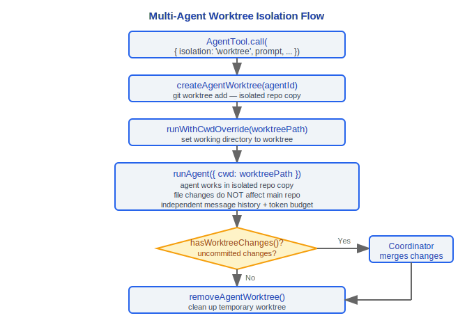
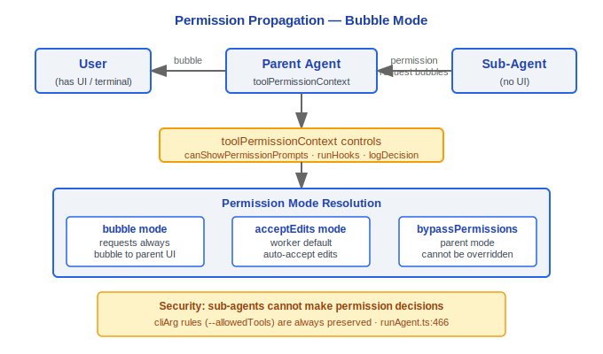

# 多智能体系统

> Claude Code v2.1.88 的多智能体架构：AgentTool、自动后台化、worktree 隔离、远程启动、协调器模式、SendMessageTool、任务系统。

---

## 1. AgentTool

`src/tools/AgentTool/AgentTool.tsx` 是多智能体系统的核心工具。

### 1.1 输入 Schema

```typescript
// baseInputSchema
{
  description: string          // 3-5 字任务描述
  prompt: string               // 任务内容
  subagent_type?: string       // 专用 agent 类型
  model?: 'sonnet' | 'opus' | 'haiku'  // 模型覆盖
  run_in_background?: boolean  // 后台运行标志
}

// fullInputSchema（含多智能体参数）
{
  ...base,
  name?: string                // Agent 名称（可通过 SendMessage 寻址）
  team_name?: string           // 团队名称
  mode?: PermissionMode        // 权限模式（如 'plan'）
  isolation?: 'worktree' | 'remote'  // 隔离模式
  cwd?: string                 // 工作目录覆盖（与 worktree 互斥）
}
```

Schema 通过 `lazySchema()` 延迟构建。当 `CLAUDE_CODE_DISABLE_BACKGROUND_TASKS` 启用或 fork 子 agent 模式激活时，`run_in_background` 字段从 schema 中移除（`.omit()`），使模型不可见。`cwd` 字段仅在 `feature('KAIROS')` 启用时暴露。

### 设计理念

#### 为什么AgentTool递归创建query()实例？

子代理本质上是一个全新的"对话"——有独立的消息历史、工具集、系统提示。源码 `runAgent.ts` 中可以看到 `for await (const message of query({...}))` 直接复用主查询引擎。这种递归设计意味着子代理天然获得与主对话相同的能力（流式处理、错误恢复、工具执行），而不需要维护一个独立的"agent 运行时"。代码复用率极高——AgentTool 本身只负责组装参数和处理结果，核心对话逻辑全部由 `query()` 承担。

#### 为什么子代理的setAppState是no-op？

子代理在独立上下文中运行，不应影响主 UI 状态。源码中 `agentToolUtils.ts` 区分了 `rootSetAppState`（用于任务注册/进度等必须对主 UI 可见的状态）和子代理自身的 `setAppState`（不传播到 UI 层）。如果子代理可以任意修改 AppState，多个并发 agent 会互相干扰，导致 UI 状态不可预测。

#### 为什么需要bubble权限模式？

子代理没有自己的用户交互界面——它运行在后台，无法向用户展示权限对话框。因此权限请求必须"冒泡"（bubble）到拥有 UI 的父级来处理。源码中 `resumeAgent.ts` 显示 worker 的权限模式默认为 `'acceptEdits'`，由父级的 `toolPermissionContext` 控制。这确保了安全性：子代理不能自己做权限决策来绕过用户授权。

#### 为什么queryTracking的depth递增？

源码 `query.ts:347-350` 中，每次进入查询循环时 `depth` 自增：`depth: toolUseContext.queryTracking.depth + 1`。这用于遥测分析——一个用户请求可能触发 3-4 层嵌套代理调用链（用户→协调器→worker→子工具agent）。`depth` 与 `chainId` 一起记录到分析事件（`queryDepth: queryTracking.depth`），帮助团队理解实际使用中的调用链深度，发现过度嵌套或性能问题。

### 1.2 输出 — 判别联合 (Discriminated Union)

```typescript
// outputSchema 根据状态区分四种结果
type AgentToolOutput =
  | { status: 'completed'; result: string; prompt: string }           // 同步完成
  | { status: 'async_launched'; agentId: string; description: string; prompt: string }  // 异步启动
  | { status: 'teammate_spawned'; agentId: string; name: string }     // 队友已生成
  | { status: 'remote_launched'; taskId: string; sessionUrl: string } // 远程启动
```

---

## 2. 自动后台化 (Auto-backgrounding)

```typescript
function getAutoBackgroundMs(): number {
  if (isEnvTruthy(process.env.CLAUDE_AUTO_BACKGROUND_TASKS)
    || getFeatureValue_CACHED_MAY_BE_STALE('tengu_auto_background_agents', false)) {
    return 120_000  // 120 秒阈值
  }
  return 0  // 禁用
}
```

当 Agent 运行超过 120 秒且未完成时，自动转为后台任务。用户在 REPL 中看到后台提示（`BackgroundHint` 组件在 2 秒后显示），可继续与主会话交互。

关键常量：
- `PROGRESS_THRESHOLD_MS = 2000` — 显示后台提示的延迟
- `getAutoBackgroundMs() = 120_000` — 自动后台化阈值

---

## 3. Worktree 隔离

当 `isolation: 'worktree'` 时，AgentTool 为子 agent 创建独立的 git worktree：



Worktree 中的文件操作不影响主仓库，agent 完成后由协调器决定如何合并变更。

---

## 4. 远程启动 (CCR)

当 `isolation: 'remote'` 时（仅 ant 用户可用），Agent 在远程 Claude Code Remote 环境中运行：


远程 agent 始终在后台运行，通过 `getRemoteTaskSessionUrl()` 获取可访问的 URL。

---

## 5. 协调器模式

`src/coordinator/coordinatorMode.ts` 定义了协调器模式的系统提示和工具集。

### 5.1 启用条件

```typescript
export function isCoordinatorMode(): boolean {
  if (feature('COORDINATOR_MODE')) {
    return isEnvTruthy(process.env.CLAUDE_CODE_COORDINATOR_MODE)
  }
  return false
}
```

### 5.2 getCoordinatorSystemPrompt

协调器的系统提示定义了以下角色：

```
你是 Claude Code，一个跨多个 worker 编排软件工程任务的 AI 助手。

角色：
- 帮助用户实现目标
- 指挥 worker 研究、实现和验证代码变更
- 综合结果并与用户沟通
- 能直接回答的问题不委派

可用工具：
- Agent — 生成新 worker
- SendMessage — 向已有 worker 发送后续消息
- TaskStop — 停止运行中的 worker
- subscribe_pr_activity / unsubscribe_pr_activity（如可用）
```

### 5.3 INTERNAL_WORKER_TOOLS

协调器模式下的内部工具集，从 worker 的可用工具列表中排除：

```typescript
const INTERNAL_WORKER_TOOLS = new Set([
  TEAM_CREATE_TOOL_NAME,     // TeamCreate
  TEAM_DELETE_TOOL_NAME,     // TeamDelete
  SEND_MESSAGE_TOOL_NAME,    // SendMessage
  SYNTHETIC_OUTPUT_TOOL_NAME // SyntheticOutput
])
```

Worker 的工具列表通过 `getCoordinatorUserContext()` 注入，包含：
- 标准工具（Bash、Read、Edit 等）
- MCP 工具（连接的 MCP 服务器名称列表）
- Scratchpad 目录路径（如启用）

### 5.4 会话模式恢复

`matchSessionMode()` 在恢复会话时自动切换协调器模式：

```typescript
export function matchSessionMode(
  sessionMode: 'coordinator' | 'normal' | undefined
): string | undefined
// 如果恢复的会话是协调器模式但当前不是，自动切换
```

---

## 6. SendMessageTool

`src/tools/SendMessageTool/SendMessageTool.ts` 实现智能体间通信。

### 6.1 输入 Schema

```typescript
{
  to: string       // 收件人：队友名称 | "*"（广播） | "uds:<socket-path>" | "bridge:<session-id>"
  summary?: string  // 5-10 字 UI 预览摘要
  message: string | StructuredMessage  // 消息内容
}
```

### 6.2 结构化消息类型

```typescript
const StructuredMessage = z.discriminatedUnion('type', [
  // 关机请求
  z.object({
    type: z.literal('shutdown_request'),
    reason: z.string().optional()
  }),

  // 关机响应
  z.object({
    type: z.literal('shutdown_response'),
    request_id: z.string(),
    approve: boolean,           // semanticBoolean()
    reason: z.string().optional()
  }),

  // 计划审批响应
  z.object({
    type: z.literal('plan_approval_response'),
    request_id: z.string(),
    approve: boolean,
    feedback: z.string().optional()
  })
])
```

### 6.3 消息路由

| `to` 格式 | 路由目标 | 传输方式 |
|---|---|---|
| 队友名称 | 同进程队友 | `queuePendingMessage()` → 内存队列 |
| `"*"` | 所有队友 | 广播 `writeToMailbox()` |
| `uds:<path>` | 本地 Unix 域套接字对等体 | UDS 消息传递 |
| `bridge:<id>` | 远程控制对等体 | Bridge WebSocket |

`TEAM_LEAD_NAME` 常量标识团队领导者，`isTeamLead()` / `isTeammate()` 判断当前角色。

---

## 7. 任务系统

### 7.1 七种任务类型

`src/tasks/types.ts` 定义了任务状态的判别联合：

```typescript
type TaskState =
  | LocalShellTaskState           // 本地 Shell 命令
  | LocalAgentTaskState           // 本地 Agent
  | RemoteAgentTaskState          // 远程 Agent (CCR)
  | InProcessTeammateTaskState    // 同进程队友
  | LocalWorkflowTaskState        // 本地工作流
  | MonitorMcpTaskState           // MCP 监控
  | DreamTaskState                // 记忆整合（autoDream）
```

各任务类型实现位于 `src/tasks/` 下的对应目录。

### 7.2 任务生命周期


```
状态转换 API（以 LocalAgentTask 为例）：
  registerAsyncAgent()           // pending
  updateAsyncAgentProgress()     // running（更新进度）
  completeAsyncAgent()           // completed
  failAsyncAgent()               // failed
  killAsyncAgent()               // killed
```

### 7.3 后台任务判定

```typescript
function isBackgroundTask(task: TaskState): task is BackgroundTaskState {
  if (task.status !== 'running' && task.status !== 'pending') return false
  if ('isBackgrounded' in task && task.isBackgrounded === false) return false
  return true
}
```

前台任务（`isBackgrounded === false`）不计为后台任务。

### 7.4 进度追踪

```
createProgressTracker()          // 创建进度追踪器
updateProgressFromMessage()      // 从消息更新进度
getProgressUpdate()              // 获取当前进度
getTokenCountFromTracker()       // 获取 token 使用量
createActivityDescriptionResolver()  // 创建活动描述解析器
enqueueAgentNotification()       // 任务完成通知排入队列
```

### 7.5 任务通知格式

协调器模式下，agent 完成时生成 `<task-notification>` XML：

```xml
<task-notification>
  <task-id>{agentId}</task-id>
  <status>completed|failed|killed</status>
  <summary>{状态摘要}</summary>
  <result>{agent 的最终文本响应}</result>
  <usage>
    <total_tokens>N</total_tokens>
    <tool_uses>N</tool_uses>
    <duration_ms>N</duration_ms>
  </usage>
</task-notification>
```

---

## 8. Agent 运行核心

### 8.1 runAgent

`src/tools/AgentTool/runAgent.ts` 是 agent 的实际执行引擎，核心流程：

1. 构建系统提示（`getSystemPrompt` + `enhanceSystemPromptWithEnvDetails`）
2. 组装可用工具池（`assembleToolPool`）
3. 执行查询循环（复用主查询引擎 `query.ts`）
4. 处理结果或错误

### 8.2 Agent 颜色

`src/tools/AgentTool/agentColorManager.ts` 为每个 agent 分配唯一颜色，用于 UI 区分：

```typescript
// Bootstrap State
agentColorMap: Map<string, AgentColorName>
agentColorIndex: number
```

### 8.3 Agent 类型系统

`src/tools/AgentTool/loadAgentsDir.ts` 管理 agent 定义：

```typescript
getAgentDefinitionsWithOverrides()  // 获取所有 agent 定义（含覆盖）
getActiveAgentsFromList()           // 获取活跃 agent 列表
isBuiltInAgent()                    // 是否为内置 agent
isCustomAgent()                     // 是否为自定义 agent
parseAgentsFromJson()               // 从 JSON 解析 agent 定义
filterAgentsByMcpRequirements()     // 按 MCP 需求过滤
```

内置 agent 类型定义在 `src/tools/AgentTool/built-in/` 目录下，`GENERAL_PURPOSE_AGENT` 是默认的通用 agent。`ONE_SHOT_BUILTIN_AGENT_TYPES` 包含一次性执行的内置 agent 类型。

### 8.4 Fork 子 Agent

`src/tools/AgentTool/forkSubagent.ts` 实现了 fork 模式的子 agent：

```typescript
isForkSubagentEnabled()        // 是否启用 fork 子 agent
isInForkChild()                // 当前是否在 fork 子进程中
buildForkedMessages()          // 构建 fork 上下文的消息
buildWorktreeNotice()          // 构建 worktree 提示
FORK_AGENT                     // fork agent 常量
```

Fork 子 agent 与父 agent 共享 prompt cache，通过 `createCacheSafeParams()` 确保缓存安全。

---

## 工程实践指南

### 创建子代理

通过 `AgentTool` 创建子代理的完整步骤：

1. **指定任务描述和提示**：
   ```typescript
   {
     description: "代码审查",       // 3-5 字任务描述（用于 UI 显示）
     prompt: "审查 src/ 下所有 .ts 文件的类型安全性",  // 详细任务内容
     subagent_type: "explore",      // 可选：使用特定 agent 类型
     model: "sonnet",               // 可选：模型覆盖
     run_in_background: true        // 可选：后台运行
   }
   ```

2. **选择隔离模式**（多智能体模式下）：
   - 无隔离（默认）：子代理在同一工作目录运行
   - `isolation: 'worktree'`：创建独立 git worktree，文件操作不影响主仓库
   - `isolation: 'remote'`：在远程 Claude Code Remote 环境中运行（仅 ant 用户）

3. **选择权限模式**：
   - 默认继承父级权限模式
   - `mode: 'plan'`：只读/规划模式
   - Agent 定义可指定 `permissionMode`，但父级为 `bypassPermissions`/`acceptEdits`/`auto` 时不被覆盖

4. **处理返回结果**（4 种状态之一）：
   - `completed`：同步完成，包含 `result` 文本
   - `async_launched`：已转为后台任务，包含 `agentId`
   - `teammate_spawned`：队友已生成，包含 `name`
   - `remote_launched`：远程启动，包含 `taskId` 和 `sessionUrl`

### 调试子代理

1. **检查嵌套层级**：`queryTracking.depth` 记录当前查询深度（每层 +1）。源码 `query.ts:347-350` 中 depth 自增用于遥测分析，帮助发现过度嵌套。
2. **检查消息历史**：子代理的消息历史独立于主循环。使用 `/tasks` 查看后台任务状态和进度。
3. **检查自动后台化**：agent 运行超过 120 秒（`getAutoBackgroundMs() = 120_000`）自动转为后台任务。`BackgroundHint` 组件在 2 秒后显示。
4. **检查 agent 颜色分配**：`agentColorManager.ts` 为每个 agent 分配唯一颜色，通过 `agentColorMap` 追踪。
5. **检查 worktree 状态**：如果使用 worktree 隔离，`hasWorktreeChanges()` 检查 worktree 中是否有未合并的变更。

### 权限传递

子代理的权限传递遵循 bubble 模式：



- **bubble 模式**（`agentPermissionMode === 'bubble'`）：权限请求始终冒泡到拥有 UI 的父级终端
- **acceptEdits 模式**：worker 默认权限模式（`resumeAgent.ts`），自动接受编辑操作
- **canShowPermissionPrompts**：由 bubble 模式或显式配置控制——子代理自身没有用户交互界面
- 源码 `runAgent.ts:438-457` 详细定义了 bubble 模式下的权限显示逻辑

### 协调器模式使用

启用协调器模式：
1. 确保 `feature('COORDINATOR_MODE')` 开启
2. 设置环境变量 `CLAUDE_CODE_COORDINATOR_MODE=true`
3. 协调器的系统提示定义了编排角色——指挥 worker 研究、实现和验证
4. 可用工具：`Agent`（生成 worker）、`SendMessage`（向 worker 发送消息）、`TaskStop`（停止 worker）
5. Worker 的工具列表排除内部工具（`INTERNAL_WORKER_TOOLS`：TeamCreate、TeamDelete、SendMessage、SyntheticOutput）

### 任务通知格式

协调器模式下 agent 完成时生成 XML 通知（用于排入协调器的消息流）：
```xml
<task-notification>
  <task-id>{agentId}</task-id>
  <status>completed|failed|killed</status>
  <summary>{状态摘要}</summary>
  <result>{agent 的最终文本响应}</result>
  <usage>
    <total_tokens>N</total_tokens>
    <tool_uses>N</tool_uses>
    <duration_ms>N</duration_ms>
  </usage>
</task-notification>
```

### 常见陷阱

> **子代理的 setAppState 是 no-op**
> 源码 `AgentTool.tsx:257` 和 `resumeAgent.ts:57` 明确注释：in-process teammates 获得 no-op 的 `setAppState`。子代理不应影响主 UI 状态。`agentToolUtils.ts` 区分了 `rootSetAppState`（用于任务注册/进度等必须对主 UI 可见的状态）和子代理自身的 `setAppState`（不传播到 UI 层）。如果多个并发 agent 都能修改 AppState，UI 状态会变得不可预测。

> **子代理不继承主循环的 message history**
> 子代理通过 `runAgent.ts` 创建全新的 `query()` 实例——独立的消息历史、工具集、系统提示。这意味着子代理不知道主对话中已经讨论过什么。如果需要传递上下文，必须通过 `prompt` 参数显式描述。

> **安全警告：子代理可能违反安全策略**
> 源码 `agentToolUtils.ts:476` 在子代理执行完成后检查安全分类器结果：如果检测到可能违反安全策略的行为，会附加 `SECURITY WARNING` 消息。审查子代理的操作时要注意此警告。

> **killAsyncAgent 是幂等的**
> `agentToolUtils.ts:641` 注释：`killAsyncAgent` 在 `TaskStop` 已经设置 `status='killed'` 后是 no-op——不会重复终止。

> **IMPORTANT: 保留 cliArg 规则**
> 源码 `runAgent.ts:466` 标注：子代理必须保留来自 SDK 的 `--allowedTools` 规则（cliArg rules），这些是安全约束，不能被子代理的工具集配置覆盖。


---

[← Skills 系统](../10-Skills系统/skills-system.md) | [目录](../README.md) | [UI 渲染 →](../12-UI渲染/ui-rendering.md)
