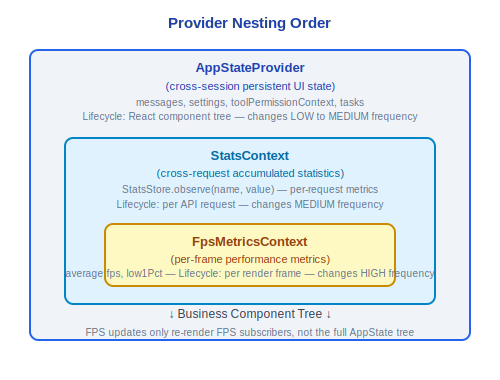

# UI Rendering System

> Claude Code v2.1.88's custom Ink engine, terminal support, component tree, permission dialogs, message components, design system, Diff system, and Spinner system.

---

## 1. Custom Ink Engine (src/ink/)

Claude Code uses a deeply customized Ink engine rather than the official Ink library. The `src/ink/` directory contains a complete React-to-Terminal rendering pipeline:

### 1.1 Core Modules

| Module | File | Responsibility |
|---|---|---|
| **Reconciler** | reconciler.ts | React Fiber reconciler that maps React elements to custom DOM nodes |
| **Layout / Yoga** | layout/ | Yoga-based Flexbox layout engine |
| **Render to Screen** | render-to-screen.ts | Renders layout results as terminal escape sequences |
| **Screen Buffer** | screen.ts | Screen buffer management with differential update support |
| **Terminal I/O** | termio/, termio.ts | Low-level terminal input/output operations |
| **Selection** | selection.ts | Text selection support (mouse drag selection) |
| **Focus** | focus.ts | Focus management system |
| **Hit Test** | hit-test.ts | Mouse click hit testing |

### Design Philosophy

#### Why use React/Ink for CLI instead of traditional ncurses/blessed?

Because Claude Code's interface isn't a static text stream—it's multi-region dynamic updates (message stream + tool progress + input box + status bar + permission dialogs all coexisting and refreshing independently). React's declarative model is better suited for this complexity than imperative redrawing: components only need to describe "what the current state should look like," and the Reconciler automatically handles incremental updates. Traditional ncurses/blessed requires manually managing the redraw timing and order of each region, which becomes nearly unmaintainable when 40+ tools are concurrently producing output.

#### Why use character interning (character pool)?

The `CharPool` class in `screen.ts` assigns a numeric ID to each character (`intern(char: string): number`), and subsequent rendering compares integers rather than strings. The comment explicitly states: *"With a shared pool, interned char IDs are valid across screens, so blitRegion can copy IDs directly (no re-interning) and diffEach can compare IDs as integers (no string lookup)"*. For a 200x120 screen, each frame needs to compare 24,000 characters—integer comparison is an order of magnitude faster than string comparison, significantly reducing GC pressure. Cell data is even stored compactly in `Int32Array`, with each cell occupying only 2 Int32s.

#### Why nest Providers 3 layers deep (AppState -> Stats -> FpsMetrics)?

Each layer focuses on different lifecycles—`AppState` stores cross-session persistent UI state (message list, settings, permission mode), `StatsContext` stores cross-request accumulated statistics (collected via `StatsStore.observe(name, value)`), and `FpsMetricsContext` stores per-frame updated performance metrics (frame rate, low percentiles). The benefit of layering: when FPS changes every frame, it only triggers re-rendering of components subscribed to FPS, without affecting the entire AppState subscriber tree.

### 1.2 Rendering Pipeline


### 1.3 Rendering Optimizations

- **log-update.ts** — Incremental terminal updates, only rewriting changed lines
- **optimizer.ts** — Output sequence optimization, merging consecutive text with the same style
- **frame.ts** — Frame rate control, avoiding excessive rendering
- **node-cache.ts** — Node caching, reducing redundant layout calculations
- **line-width-cache.ts** — Line width caching

---

## 2. Terminal Support

### 2.1 Keyboard Protocol

**Kitty Keyboard Protocol** — `src/ink/parse-keypress.ts` supports Kitty terminal's enhanced keyboard input protocol, providing:
- Precise modifier key detection (Ctrl/Alt/Shift/Super)
- Key press/release/repeat event differentiation
- Unicode code point level key recognition

### 2.2 Terminal Detection

- **iTerm2 Detection** — Supports iTerm2 proprietary features (inline image display, etc.)
- **tmux Detection** — Special handling in tmux environments
- **Terminal Capability Query** — `terminal-querier.ts` dynamically queries terminal capabilities
- **Terminal Focus State** — `terminal-focus-state.ts` tracks window focus changes
- **Synchronized Output** — `isSynchronizedOutputSupported()` detects synchronized output support

### 2.3 ANSI Escape Sequences

The `src/ink/termio/` directory contains low-level terminal control:

| File | Description |
|---|---|
| `dec.ts` | DEC private mode control (cursor visibility `SHOW_CURSOR`, alternate screen, etc.) |
| `csi.ts` | CSI (Control Sequence Introducer) sequences |
| `osc.ts` | OSC (Operating System Command) sequences (hyperlinks, window title, etc.) |

- **Ansi.tsx** — React component wrapper for ANSI escape sequences
- **colorize.ts** — Color processing (supports true color)
- **bidi.ts** — Bidirectional text (RTL) support
- **wrapAnsi.ts** / **wrap-text.ts** — ANSI-aware text wrapping

---

## 3. Component Tree


---

## 4. PromptInput

The main input component, one of the most complex UI components in the system (1200+ lines):

### Core Features

- **History Navigation** — Up/down arrows to browse input history, with search filtering support
- **Command Suggestions** — Triggers skill/command suggestions when typing `/` (`ContextSuggestions.tsx`), sorted by `skillUsageTracking`
- **Image Paste** — Detects image data in clipboard, automatically converts to inline image messages
- **Emoji Support** — Emoji rendering and width calculation
- **IDE Selection Integration** — Receives text selection regions sent by IDE extensions
- **Mode Switching** — Supports permission mode cycle switching (default → acceptEdits → bypassPermissions → plan → auto)
- **Multi-line Input** — Shift+Enter for newline, Enter to submit
- **Early Input Capture** — `seedEarlyInput()` captures keystrokes during startup, replayed when REPL is ready

### Related Components

- **BaseTextInput** (`components/BaseTextInput.tsx`) — Low-level text input
- **ConfigurableShortcutHint** (`components/ConfigurableShortcutHint.tsx`) — Configurable shortcut key hints
- **CtrlOToExpand** (`components/CtrlOToExpand.tsx`) — Expand prompt

---

## 5. Permission Request Components

Dedicated permission dialogs for different tool types (approximately 10 types):

| Tool Type | Dialog Component | Description |
|---|---|---|
| Bash | BashPermission | Shell command execution permission |
| FileEdit | FileEditToolDiff | File editing permission (with Diff preview) |
| FileWrite | FileWritePermission | File write permission |
| MCP Tool | McpToolPermission | MCP tool call permission |
| Agent | AgentPermission | Agent launch permission |
| Worktree | WorktreePermission | Worktree creation permission |
| Bypass | BypassPermissionsModeDialog | Dangerous mode confirmation |
| Auto Mode | AutoModeOptInDialog | Auto mode enable confirmation |
| Cost Threshold | CostThresholdDialog | Cost threshold confirmation |
| Channel | ChannelDowngradeDialog | Channel downgrade confirmation |

---

## 6. Message Components

### 6.1 Assistant Messages

- **Text blocks** — Markdown rendering (`HighlightedCode.tsx` provides syntax highlighting)
- **Tool call blocks** — Each tool has corresponding `renderToolUseMessage` / `renderToolResultMessage` / `renderToolUseRejectedMessage`
- **Thinking blocks** — Collapsible/expandable display of extended thinking content
- **Progress blocks** — Progress indicators during tool execution

### 6.2 User Messages

- **Text messages** — Plain text input from users
- **Bash output** — Output results from shell commands
- **Tool results** — Return values from tool calls

### 6.3 System Messages

- **CompactSummary** (`CompactSummary.tsx`) — Compact summary display
- **Hook progress** — Hook execution status
- **Plan approval** — Approval requests in plan mode

### 6.4 Agent Messages

- **AgentProgressLine** (`AgentProgressLine.tsx`) — Agent progress line
- **CoordinatorAgentStatus** (`CoordinatorAgentStatus.tsx`) — Agent status under coordinator

---

## 7. Design System

### 7.1 Basic Components

| Component | File | Description |
|---|---|---|
| **Box** | ink/components/Box.tsx | Flexbox container (margin/padding/border) |
| **Text** | ink/components/Text.tsx | Text rendering (color/bold/italic/underline) |
| **Spacer** | ink/components/Spacer.tsx | Flexible space |
| **Newline** | ink/components/Newline.tsx | Line break |
| **Link** | ink/components/Link.tsx | Clickable hyperlinks (OSC 8) |
| **RawAnsi** | ink/components/RawAnsi.tsx | Raw ANSI output |
| **ScrollBox** | ink/components/ScrollBox.tsx | Scrollable container |

### 7.2 Business Components

| Component | Description |
|---|---|
| **Dialog** | Modal dialog (managed by modalContext.tsx) |
| **Pane** | Panel container |
| **ThemedBox / ThemedText** | Themed container/text |
| **FuzzyPicker** | Fuzzy search selector |
| **ProgressBar** | Progress bar |
| **Tabs** | Tab switching |
| **CustomSelect** | Custom dropdown selection (components/CustomSelect/) |
| **FullscreenLayout** | Fullscreen layout |

### 7.3 Context System

| Context | File | Description |
|---|---|---|
| **AppStoreContext** | state/AppState.tsx | Application state |
| **StdinContext** | ink/components/StdinContext.ts | Standard input stream |
| **ClockContext** | ink/components/ClockContext.tsx | Clock/timer |
| **CursorDeclarationContext** | ink/components/CursorDeclarationContext.ts | Cursor state |
| **TerminalFocusContext** | ink/components/TerminalFocusContext.tsx | Terminal focus |
| **TerminalSizeContext** | ink/components/TerminalSizeContext.tsx | Terminal dimensions |

---

## 8. Diff System

Used to display code differences in the file editing permission dialog:

### 8.1 Core Components

- **FileEditToolDiff** (`components/FileEditToolDiff.tsx`) — Diff rendering for file editing tools
- **FileEditToolUpdatedMessage** (`components/FileEditToolUpdatedMessage.tsx`) — Update message after editing is complete

### 8.2 Diff Features

- **Side-by-side comparison** — Syntax-highlighted comparison of old vs. new content
- **Inline diff annotation** — Precise character-level diff annotation for changed lines
- **File list** — File list navigation for multi-file edits
- **Context folding** — Smart folding of unchanged regions

---

## 9. Spinner System

Loading indicator system providing multiple visual feedback styles:

### 9.1 Components

| Component | Description |
|---|---|
| **FlashingChar** | Flashing character (cursor style) |
| **GlimmerMessage** | Glimmering message (gradient text effect) |
| **ShimmerChar** | Shimmer character (single character gradient) |
| **SpinnerGlyph** | Rotating glyph (classic spinner pattern) |

### 9.2 Spinner Tips

Spinners can include contextual tip text:

```typescript
// spinnerTip field in AppState
spinnerTip?: string  // Current spinner tip text
```

Tip text comes from `src/services/tips/tipRegistry.ts`, retrieved via `getRelevantTips()` to get tips relevant to the current operation.

### 9.3 FPS Tracking

`src/utils/fpsTracker.ts` tracks UI frame rate:

```typescript
type FpsMetrics = {
  average: number
  low1Pct: number
}
```

`src/context/fpsMetrics.tsx` provides a React Context for FPS metrics. Frame rate data is recorded in the `tengu_exit` event when the session exits (`lastFpsAverage`, `lastFpsLow1Pct`).

---

## 10. Render Options

`getBaseRenderOptions()` in `src/utils/renderOptions.ts` provides rendering configuration:

```typescript
type RenderOptions = {
  // Ink Root configuration
  stdout: NodeJS.WriteStream
  stderr: NodeJS.WriteStream
  stdin: NodeJS.ReadStream
  // Terminal capabilities
  patchConsole: boolean      // Intercepts console.log/error
  exitOnCtrlC: boolean
}
```

Special environment handling:
- **Non-interactive mode** — Disables all UI rendering, outputs text directly
- **tmux environment** — Adjusts terminal control sequence compatibility
- **Windows terminal** — Downgrades certain terminal features (no Kitty keyboard protocol)

---

## Engineering Practice Guide

### Adding New UI Components

**Step checklist:**

1. Create a React component file in the `src/components/` directory
2. Build layout using Ink primitives:
   ```tsx
   import { Box, Text } from '../ink/components/index.js'

   export function MyComponent({ title, content }: Props) {
     return (
       <Box flexDirection="column" paddingX={1}>
         <Text bold color="cyan">{title}</Text>
         <Box marginTop={1}>
           <Text>{content}</Text>
         </Box>
       </Box>
     )
   }
   ```
3. Connect state via hooks:
   - `useAppState(selector)` — Read data from AppState
   - `useContext(ModalContext)` — Modal dialog management
   - `useContext(TerminalSizeContext)` — Get terminal dimensions
4. Mount in the component tree (refer to the `<REPL>` component structure)

**Available basic components:**
| Component | Purpose |
|------|------|
| `Box` | Flexbox container (flexDirection/alignItems/justifyContent/margin/padding/border) |
| `Text` | Text rendering (color/bold/italic/underline/strikethrough) |
| `Spacer` | Flexible space fill |
| `Link` | Clickable hyperlinks (OSC 8 terminal sequence) |
| `ScrollBox` | Scrollable container |
| `RawAnsi` | Raw ANSI escape sequence output |

### Debugging Rendering Issues

1. **Check FPS metrics**: `FpsMetricsContext` provides frame rate data (`average` and `low1Pct`). Frame rates below 15fps may cause UI stuttering. Frame rate data is recorded in the `tengu_exit` event when the session exits.
2. **Check layout**: `Box`'s `flexDirection` (default `row`), `alignItems`, `justifyContent` control layout. Only a subset of Flexbox is supported in terminal environments—CSS properties like Grid, Position are not supported.
3. **Check terminal compatibility**:
   - `isSynchronizedOutputSupported()` — Detect synchronized output support
   - `terminal-querier.ts` — Dynamically query terminal capabilities
   - Windows terminals do not support the Kitty keyboard protocol
   - tmux environments require special handling (escape sequence wrapping)
4. **Check character width**: Width calculation for wide characters such as CJK characters and Emoji may cause layout misalignment. `bidi.ts` handles bidirectional text.
5. **Check Screen Buffer**: `CharPool` in `screen.ts` uses character interning (integer IDs instead of string comparisons), and `Cell` data is stored compactly in `Int32Array`. If rendering shows garbled characters, check whether interning is correct.

### Performance Optimization

- **Virtualize large message lists**: The `useVirtualScroll` hook implements virtual scrolling, rendering only visible messages
- **Avoid creating new objects in render**: Use `React.memo()`, `useMemo()`, `useCallback()` to avoid unnecessary re-renders
- **Incremental terminal updates**: `log-update.ts` only rewrites changed lines; `optimizer.ts` merges consecutive text with the same style
- **Frame rate control**: `frame.ts` controls rendering frequency to avoid excessive rendering. High-frequency state updates (like spinner animations) should use throttling mechanisms like `requestAnimationFrame`
- **Node caching**: `node-cache.ts` and `line-width-cache.ts` reduce redundant layout calculations

### Provider Nesting Order

Providers are nested 3 layers deep in the component tree, and the order is intentional:



Layering benefit: When FPS changes every frame, it only triggers re-rendering of components subscribed to FPS, without affecting the entire AppState subscriber tree. When adding new Providers, consider their update frequency—high-frequency update Providers should be placed in inner layers.

### Common Pitfalls

> **Ink does not support all CSS properties**
> The terminal rendering engine is based on Yoga Flexbox, and only supports a subset of Flexbox layout. CSS Grid, position absolute/fixed, float, z-index, and similar properties are not supported. Layout can only use properties like `flexDirection`, `alignItems`, `justifyContent`, `flexGrow`/`flexShrink`, `margin`/`padding`, `border`.

> **Terminal width changes require listening to resize events**
> `TerminalSizeContext` (`ink/components/TerminalSizeContext.tsx`) provides a terminal dimensions context. Components need to respond to terminal size changes through this context rather than assuming a fixed width. The `useTerminalSize` hook wraps resize event listening.

> **clickCount in App.tsx does not reset on release**
> Source code comment at `ink/components/App.tsx:611`: Unlike the older release-based detection, in the current implementation `clickCount` is not reset on release events—be aware of this behavioral difference when modifying mouse event handling.

> **Synchronized output avoids tearing**
> Terminals that support synchronized output (detected via `isSynchronizedOutputSupported()`) can atomically update all content within a single frame, avoiding rendering tearing. Terminals without this support update line by line, which may produce flickering during rapid refreshes.

> **Early input capture**
> `seedEarlyInput()` captures and buffers user keystrokes before the REPL is fully ready, replaying them when ready. When adding new input handling logic, ensure compatibility with early input.


---

[← Multi-Agent](../11-多智能体/multi-agent-en.md) | [Index](../README_EN.md) | [Config System →](../13-配置体系/config-system-en.md)
