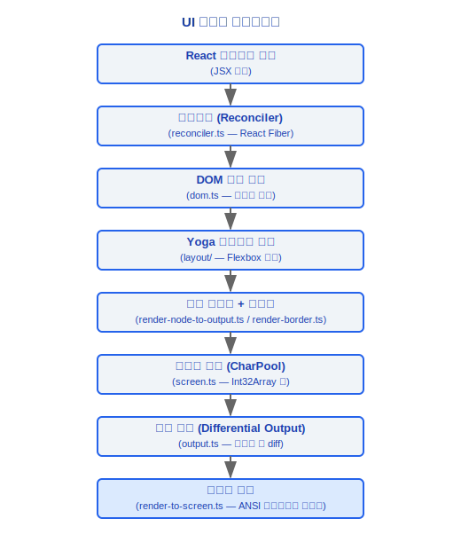
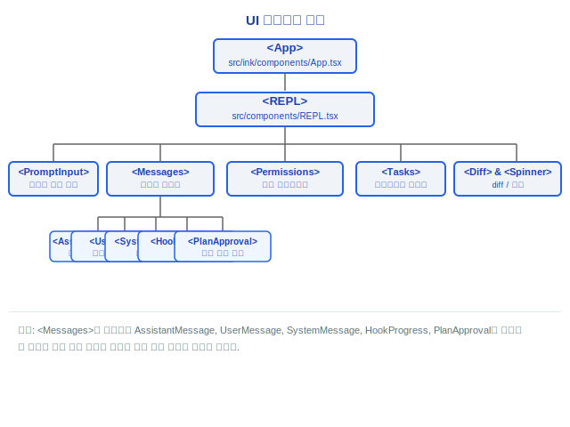
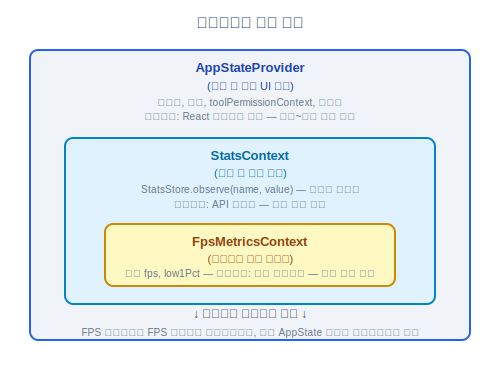

# UI 렌더링(UI Rendering) 시스템

> Claude Code v2.1.88의 사용자 정의 Ink 엔진, 터미널 지원, 컴포넌트 트리, 권한 다이얼로그, 메시지 컴포넌트, 디자인 시스템, Diff 시스템, 스피너 시스템.

---

## 1. 사용자 정의 Ink 엔진 (src/ink/)

Claude Code는 공식 Ink 라이브러리 대신 깊이 커스터마이징된 Ink 엔진을 사용합니다. `src/ink/` 디렉토리에는 완전한 React-to-Terminal 렌더링 파이프라인이 포함되어 있습니다.

### 1.1 핵심 모듈

| 모듈 | 파일 | 책임 |
|---|---|---|
| **리콘실러(Reconciler)** | reconciler.ts | React 엘리먼트를 사용자 정의 DOM 노드에 매핑하는 React Fiber 리콘실러 |
| **레이아웃 / Yoga** | layout/ | Yoga 기반 Flexbox 레이아웃 엔진 |
| **스크린 렌더링** | render-to-screen.ts | 레이아웃 결과를 터미널 이스케이프 시퀀스로 렌더링 |
| **스크린 버퍼** | screen.ts | 차등 업데이트를 지원하는 스크린 버퍼 관리 |
| **터미널 I/O** | termio/, termio.ts | 저수준 터미널 입출력 작업 |
| **선택** | selection.ts | 텍스트 선택 지원 (마우스 드래그 선택) |
| **포커스** | focus.ts | 포커스 관리 시스템 |
| **히트 테스트** | hit-test.ts | 마우스 클릭 히트 테스트 |

### 설계 철학

#### 전통적인 ncurses/blessed 대신 React/Ink를 CLI에 사용하는 이유는?

Claude Code의 인터페이스는 정적 텍스트 스트림이 아니기 때문입니다. 메시지 스트림 + 도구 진행 상황 + 입력 박스 + 상태 표시줄 + 권한 다이얼로그가 모두 공존하며 독립적으로 새로 고침되는 멀티 리전 동적 업데이트입니다. React의 선언적 모델은 이러한 복잡성에 명령형 리드로잉보다 더 적합합니다: 컴포넌트는 "현재 상태가 어떻게 보여야 하는지"만 설명하면 되고, 리콘실러가 증분 업데이트를 자동으로 처리합니다. 전통적인 ncurses/blessed는 각 리전의 리드로우 타이밍과 순서를 수동으로 관리해야 하며, 40개 이상의 도구가 동시에 출력을 생성할 때 거의 유지 불가능해집니다.

#### 문자 인터닝(캐릭터 풀)을 사용하는 이유는?

`screen.ts`의 `CharPool` 클래스는 각 문자에 숫자 ID를 할당하며(`intern(char: string): number`), 이후 렌더링은 문자열 대신 정수를 비교합니다. 주석에 명시적으로 다음과 같이 기재되어 있습니다: *"공유 풀을 사용하면 인터닝된 문자 ID가 스크린 간에 유효하므로, blitRegion이 ID를 직접 복사(재인터닝 없이)하고 diffEach가 ID를 정수로 비교(문자열 조회 없이)할 수 있습니다"*. 200x120 스크린의 경우 매 프레임마다 24,000개의 문자를 비교해야 합니다. 정수 비교는 문자열 비교보다 한 자릿수 빠르며 GC 압력을 크게 줄입니다. 셀 데이터는 `Int32Array`에 컴팩트하게 저장되며, 각 셀은 2개의 Int32만 차지합니다.

#### Provider를 3단계로 중첩하는 이유는 (AppState -> Stats -> FpsMetrics)?

각 레이어는 서로 다른 수명주기에 집중합니다. `AppState`는 세션 간 지속적인 UI 상태(메시지 목록, 설정, 권한 모드)를 저장하고, `StatsContext`는 요청 간 누적된 통계(`StatsStore.observe(name, value)`로 수집)를 저장하며, `FpsMetricsContext`는 프레임별로 업데이트되는 성능 메트릭(프레임율, 낮은 백분위수)을 저장합니다. 레이어링의 이점: FPS가 매 프레임마다 변경될 때 FPS를 구독하는 컴포넌트만 재렌더링을 트리거하고, 전체 AppState 구독자 트리에 영향을 미치지 않습니다.

### 1.2 렌더링 파이프라인



### 1.3 렌더링 최적화

- **log-update.ts** — 증분 터미널 업데이트, 변경된 줄만 재작성
- **optimizer.ts** — 출력 시퀀스 최적화, 동일 스타일의 연속 텍스트 병합
- **frame.ts** — 프레임율 제어, 과도한 렌더링 방지
- **node-cache.ts** — 노드 캐싱, 중복 레이아웃 계산 감소
- **line-width-cache.ts** — 줄 너비 캐싱

---

## 2. 터미널 지원

### 2.1 키보드 프로토콜

**Kitty 키보드 프로토콜** — `src/ink/parse-keypress.ts`는 Kitty 터미널의 향상된 키보드 입력 프로토콜을 지원합니다.
- 정밀한 수정자 키 감지 (Ctrl/Alt/Shift/Super)
- 키 누름/해제/반복 이벤트 구분
- 유니코드 코드 포인트 수준 키 인식

### 2.2 터미널 감지

- **iTerm2 감지** — iTerm2 독점 기능 지원 (인라인 이미지 표시 등)
- **tmux 감지** — tmux 환경에서의 특별 처리
- **터미널 기능 쿼리** — `terminal-querier.ts`가 터미널 기능을 동적으로 쿼리
- **터미널 포커스 상태** — `terminal-focus-state.ts`가 윈도우 포커스 변경을 추적
- **동기화 출력** — `isSynchronizedOutputSupported()`가 동기화 출력 지원을 감지

### 2.3 ANSI 이스케이프 시퀀스

`src/ink/termio/` 디렉토리에는 저수준 터미널 제어가 포함되어 있습니다.

| 파일 | 설명 |
|---|---|
| `dec.ts` | DEC 프라이빗 모드 제어 (커서 가시성 `SHOW_CURSOR`, 대체 화면 등) |
| `csi.ts` | CSI(Control Sequence Introducer) 시퀀스 |
| `osc.ts` | OSC(Operating System Command) 시퀀스 (하이퍼링크, 윈도우 타이틀 등) |

- **Ansi.tsx** — ANSI 이스케이프 시퀀스용 React 컴포넌트 래퍼
- **colorize.ts** — 색상 처리 (트루 컬러 지원)
- **bidi.ts** — 양방향 텍스트(RTL) 지원
- **wrapAnsi.ts** / **wrap-text.ts** — ANSI 인식 텍스트 줄 바꿈

---

## 3. 컴포넌트 트리



---

## 4. PromptInput

메인 입력 컴포넌트로, 시스템에서 가장 복잡한 UI 컴포넌트 중 하나입니다 (1200줄 이상).

### 핵심 기능

- **기록 탐색** — 위/아래 화살표로 입력 기록 탐색, 검색 필터링 지원
- **명령어 제안** — `/` 입력 시 스킬/명령어 제안 트리거(`ContextSuggestions.tsx`), `skillUsageTracking`으로 정렬
- **이미지 붙여넣기** — 클립보드의 이미지 데이터 감지, 자동으로 인라인 이미지 메시지로 변환
- **이모지 지원** — 이모지 렌더링 및 너비 계산
- **IDE 선택 통합** — IDE 확장이 전송한 텍스트 선택 영역 수신
- **모드 전환** — 권한 모드 순환 전환 지원 (default → acceptEdits → bypassPermissions → plan → auto)
- **멀티라인 입력** — Shift+Enter로 줄 바꿈, Enter로 제출
- **조기 입력 캡처** — `seedEarlyInput()`이 시작 중 키스트로크를 캡처하고 REPL 준비 시 재생

### 관련 컴포넌트

- **BaseTextInput** (`components/BaseTextInput.tsx`) — 저수준 텍스트 입력
- **ConfigurableShortcutHint** (`components/ConfigurableShortcutHint.tsx`) — 설정 가능한 단축키 힌트
- **CtrlOToExpand** (`components/CtrlOToExpand.tsx`) — 프롬프트 확장

---

## 5. 권한 요청 컴포넌트

다양한 도구 유형을 위한 전용 권한 다이얼로그 (약 10가지):

| 도구 유형 | 다이얼로그 컴포넌트 | 설명 |
|---|---|---|
| Bash | BashPermission | 셸 명령 실행 권한 |
| FileEdit | FileEditToolDiff | 파일 편집 권한 (Diff 미리보기 포함) |
| FileWrite | FileWritePermission | 파일 쓰기 권한 |
| MCP 도구 | McpToolPermission | MCP 도구 호출 권한 |
| Agent | AgentPermission | 에이전트 실행 권한 |
| Worktree | WorktreePermission | 워크트리 생성 권한 |
| Bypass | BypassPermissionsModeDialog | 위험 모드 확인 |
| Auto 모드 | AutoModeOptInDialog | 자동 모드 활성화 확인 |
| 비용 임계값 | CostThresholdDialog | 비용 임계값 확인 |
| 채널 | ChannelDowngradeDialog | 채널 다운그레이드 확인 |

---

## 6. 메시지 컴포넌트

### 6.1 어시스턴트 메시지

- **텍스트 블록** — Markdown 렌더링 (`HighlightedCode.tsx`가 구문 하이라이팅 제공)
- **도구 호출 블록** — 각 도구는 해당하는 `renderToolUseMessage` / `renderToolResultMessage` / `renderToolUseRejectedMessage`를 가짐
- **사고 블록** — 확장된 사고 내용을 접기/펼치기 가능하게 표시
- **진행 블록** — 도구 실행 중 진행 표시기

### 6.2 사용자 메시지

- **텍스트 메시지** — 사용자의 일반 텍스트 입력
- **Bash 출력** — 셸 명령의 출력 결과
- **도구 결과** — 도구 호출의 반환값

### 6.3 시스템 메시지

- **CompactSummary** (`CompactSummary.tsx`) — 압축 요약 표시
- **훅 진행 상황** — 훅 실행 상태
- **플랜 승인** — 플랜 모드에서의 승인 요청

### 6.4 에이전트 메시지

- **AgentProgressLine** (`AgentProgressLine.tsx`) — 에이전트 진행 라인
- **CoordinatorAgentStatus** (`CoordinatorAgentStatus.tsx`) — 코디네이터 아래의 에이전트 상태

---

## 7. 디자인 시스템

### 7.1 기본 컴포넌트

| 컴포넌트 | 파일 | 설명 |
|---|---|---|
| **Box** | ink/components/Box.tsx | Flexbox 컨테이너 (margin/padding/border) |
| **Text** | ink/components/Text.tsx | 텍스트 렌더링 (color/bold/italic/underline) |
| **Spacer** | ink/components/Spacer.tsx | 유연한 공간 |
| **Newline** | ink/components/Newline.tsx | 줄 바꿈 |
| **Link** | ink/components/Link.tsx | 클릭 가능한 하이퍼링크 (OSC 8) |
| **RawAnsi** | ink/components/RawAnsi.tsx | 원시 ANSI 출력 |
| **ScrollBox** | ink/components/ScrollBox.tsx | 스크롤 가능한 컨테이너 |

### 7.2 비즈니스 컴포넌트

| 컴포넌트 | 설명 |
|---|---|
| **Dialog** | 모달 다이얼로그 (modalContext.tsx로 관리) |
| **Pane** | 패널 컨테이너 |
| **ThemedBox / ThemedText** | 테마 적용 컨테이너/텍스트 |
| **FuzzyPicker** | 퍼지 검색 선택기 |
| **ProgressBar** | 진행 표시줄 |
| **Tabs** | 탭 전환 |
| **CustomSelect** | 사용자 정의 드롭다운 선택 (components/CustomSelect/) |
| **FullscreenLayout** | 전체 화면 레이아웃 |

### 7.3 컨텍스트 시스템

| 컨텍스트 | 파일 | 설명 |
|---|---|---|
| **AppStoreContext** | state/AppState.tsx | 애플리케이션 상태 |
| **StdinContext** | ink/components/StdinContext.ts | 표준 입력 스트림 |
| **ClockContext** | ink/components/ClockContext.tsx | 시계/타이머 |
| **CursorDeclarationContext** | ink/components/CursorDeclarationContext.ts | 커서 상태 |
| **TerminalFocusContext** | ink/components/TerminalFocusContext.tsx | 터미널 포커스 |
| **TerminalSizeContext** | ink/components/TerminalSizeContext.tsx | 터미널 크기 |

---

## 8. Diff 시스템

파일 편집 권한 다이얼로그에서 코드 차이를 표시하는 데 사용됩니다.

### 8.1 핵심 컴포넌트

- **FileEditToolDiff** (`components/FileEditToolDiff.tsx`) — 파일 편집 도구의 Diff 렌더링
- **FileEditToolUpdatedMessage** (`components/FileEditToolUpdatedMessage.tsx`) — 편집 완료 후 업데이트 메시지

### 8.2 Diff 기능

- **나란히 비교** — 구문 하이라이팅이 적용된 이전/새 내용 비교
- **인라인 Diff 주석** — 변경된 줄에 대한 정밀한 문자 수준 Diff 주석
- **파일 목록** — 멀티 파일 편집을 위한 파일 목록 탐색
- **컨텍스트 접기** — 변경되지 않은 영역의 스마트 접기

---

## 9. 스피너 시스템

여러 시각적 피드백 스타일을 제공하는 로딩 표시기 시스템입니다.

### 9.1 컴포넌트

| 컴포넌트 | 설명 |
|---|---|
| **FlashingChar** | 깜박이는 문자 (커서 스타일) |
| **GlimmerMessage** | 반짝이는 메시지 (그라디언트 텍스트 효과) |
| **ShimmerChar** | 시머 문자 (단일 문자 그라디언트) |
| **SpinnerGlyph** | 회전하는 글리프 (클래식 스피너 패턴) |

### 9.2 스피너 팁

스피너는 컨텍스트 팁 텍스트를 포함할 수 있습니다.

```typescript
// AppState의 spinnerTip 필드
spinnerTip?: string  // 현재 스피너 팁 텍스트
```

팁 텍스트는 `src/services/tips/tipRegistry.ts`에서 제공되며, `getRelevantTips()`를 통해 현재 작업과 관련된 팁을 가져옵니다.

### 9.3 FPS 추적

`src/utils/fpsTracker.ts`는 UI 프레임율을 추적합니다.

```typescript
type FpsMetrics = {
  average: number
  low1Pct: number
}
```

`src/context/fpsMetrics.tsx`는 FPS 메트릭을 위한 React Context를 제공합니다. 프레임율 데이터는 세션 종료 시 `tengu_exit` 이벤트에 기록됩니다(`lastFpsAverage`, `lastFpsLow1Pct`).

---

## 10. 렌더링 옵션

`src/utils/renderOptions.ts`의 `getBaseRenderOptions()`는 렌더링 설정을 제공합니다.

```typescript
type RenderOptions = {
  // Ink Root 설정
  stdout: NodeJS.WriteStream
  stderr: NodeJS.WriteStream
  stdin: NodeJS.ReadStream
  // 터미널 기능
  patchConsole: boolean      // console.log/error를 인터셉트
  exitOnCtrlC: boolean
}
```

특별 환경 처리:
- **비인터랙티브 모드** — 모든 UI 렌더링 비활성화, 텍스트 직접 출력
- **tmux 환경** — 터미널 제어 시퀀스 호환성 조정
- **Windows 터미널** — 특정 터미널 기능 다운그레이드 (Kitty 키보드 프로토콜 없음)

---

## 엔지니어링 실전 가이드

### 새 UI 컴포넌트 추가

**단계 체크리스트:**

1. `src/components/` 디렉토리에 React 컴포넌트 파일 생성
2. Ink 기본 요소를 사용하여 레이아웃 구성:
   ```tsx
   import { Box, Text } from '../ink/components/index.js'

   export function MyComponent({ title, content }: Props) {
     return (
       <Box flexDirection="column" paddingX={1}>
         <Text bold color="cyan">{title}</Text>
         <Box marginTop={1}>
           <Text>{content}</Text>
         </Box>
       </Box>
     )
   }
   ```
3. 훅을 통해 상태(State Management) 연결:
   - `useAppState(selector)` — AppState에서 데이터 읽기
   - `useContext(ModalContext)` — 모달 다이얼로그 관리
   - `useContext(TerminalSizeContext)` — 터미널 크기 가져오기
4. 컴포넌트 트리에 마운트(`<REPL>` 컴포넌트 구조 참조)

**사용 가능한 기본 컴포넌트:**
| 컴포넌트 | 목적 |
|------|------|
| `Box` | Flexbox 컨테이너 (flexDirection/alignItems/justifyContent/margin/padding/border) |
| `Text` | 텍스트 렌더링 (color/bold/italic/underline/strikethrough) |
| `Spacer` | 유연한 공간 채우기 |
| `Link` | 클릭 가능한 하이퍼링크 (OSC 8 터미널 시퀀스) |
| `ScrollBox` | 스크롤 가능한 컨테이너 |
| `RawAnsi` | 원시 ANSI 이스케이프 시퀀스 출력 |

### 렌더링 문제 디버깅

1. **FPS 메트릭 확인**: `FpsMetricsContext`는 프레임율 데이터를 제공합니다(`average`와 `low1Pct`). 15fps 미만의 프레임율은 UI 끊김을 유발할 수 있습니다. 프레임율 데이터는 세션 종료 시 `tengu_exit` 이벤트에 기록됩니다.
2. **레이아웃 확인**: `Box`의 `flexDirection`(기본값 `row`), `alignItems`, `justifyContent`가 레이아웃을 제어합니다. 터미널 환경에서는 Flexbox의 일부만 지원됩니다. CSS Grid, Position 등의 속성은 지원되지 않습니다.
3. **터미널 호환성 확인**:
   - `isSynchronizedOutputSupported()` — 동기화 출력 지원 감지
   - `terminal-querier.ts` — 터미널 기능 동적 쿼리
   - Windows 터미널은 Kitty 키보드 프로토콜을 지원하지 않음
   - tmux 환경은 특별 처리 필요 (이스케이프 시퀀스 래핑)
4. **문자 너비 확인**: CJK 문자, 이모지 등 와이드 문자의 너비 계산이 레이아웃 불일치를 초래할 수 있습니다. `bidi.ts`가 양방향 텍스트를 처리합니다.
5. **스크린 버퍼 확인**: `screen.ts`의 `CharPool`은 문자 인터닝(정수 ID 대신 문자열 비교)을 사용하며, `Cell` 데이터는 `Int32Array`에 컴팩트하게 저장됩니다. 렌더링에서 깨진 문자가 표시되면 인터닝이 올바른지 확인하십시오.

### 성능 최적화

- **큰 메시지 목록 가상화**: `useVirtualScroll` 훅이 가상 스크롤을 구현하여 보이는 메시지만 렌더링
- **렌더링에서 새 객체 생성 방지**: `React.memo()`, `useMemo()`, `useCallback()`을 사용하여 불필요한 재렌더링 방지
- **증분 터미널 업데이트**: `log-update.ts`는 변경된 줄만 재작성하며, `optimizer.ts`는 동일 스타일의 연속 텍스트를 병합
- **프레임율 제어**: `frame.ts`가 렌더링 빈도를 제어하여 과도한 렌더링 방지. 고빈도 상태 업데이트(예: 스피너 애니메이션)는 `requestAnimationFrame`과 같은 스로틀링 메커니즘을 사용해야 함
- **노드 캐싱**: `node-cache.ts`와 `line-width-cache.ts`가 중복 레이아웃 계산을 줄임

### Provider 중첩 순서

Provider는 컴포넌트 트리에서 3단계로 중첩되며, 순서는 의도적입니다.



레이어링 이점: FPS가 매 프레임마다 변경될 때 FPS를 구독하는 컴포넌트만 재렌더링을 트리거하고, 전체 AppState 구독자 트리에 영향을 미치지 않습니다. 새 Provider를 추가할 때 업데이트 빈도를 고려하십시오. 고빈도 업데이트 Provider는 내부 레이어에 배치해야 합니다.

### 일반적인 함정

> **Ink는 모든 CSS 속성을 지원하지 않습니다**
> 터미널 렌더링 엔진은 Yoga Flexbox 기반으로, Flexbox 레이아웃의 일부만 지원합니다. CSS Grid, position absolute/fixed, float, z-index 등의 속성은 지원되지 않습니다. 레이아웃은 `flexDirection`, `alignItems`, `justifyContent`, `flexGrow`/`flexShrink`, `margin`/`padding`, `border`와 같은 속성만 사용할 수 있습니다.

> **터미널 너비 변경 시 리사이즈 이벤트를 수신해야 합니다**
> `TerminalSizeContext`(`ink/components/TerminalSizeContext.tsx`)는 터미널 크기 컨텍스트를 제공합니다. 컴포넌트는 고정 너비를 가정하지 않고 이 컨텍스트를 통해 터미널 크기 변경에 응답해야 합니다. `useTerminalSize` 훅이 리사이즈 이벤트 수신을 래핑합니다.

> **App.tsx의 clickCount는 해제 시 초기화되지 않습니다**
> 소스 코드 `ink/components/App.tsx:611`의 주석: 이전 해제 기반 감지와 달리, 현재 구현에서 `clickCount`는 해제 이벤트에서 초기화되지 않습니다. 마우스 이벤트 처리를 수정할 때 이 동작 차이에 주의하십시오.

> **동기화 출력은 티어링을 방지합니다**
> 동기화 출력을 지원하는 터미널(`isSynchronizedOutputSupported()`로 감지)은 단일 프레임 내의 모든 내용을 원자적으로 업데이트하여 렌더링 티어링을 방지합니다. 이 기능이 없는 터미널은 줄별로 업데이트하여 빠른 새로 고침 중에 깜박임이 발생할 수 있습니다.

> **조기 입력 캡처**
> `seedEarlyInput()`은 REPL이 완전히 준비되기 전에 사용자 키스트로크를 캡처하고 버퍼링하며, 준비가 완료되면 재생합니다. 새 입력 처리 로직을 추가할 때 조기 입력과의 호환성을 확인하십시오.


---

[← 멀티 에이전트](../11-多智能体/multi-agent-ko.md) | [인덱스](../README_KO.md) | [설정 체계 →](../13-配置体系/config-system-ko.md)
