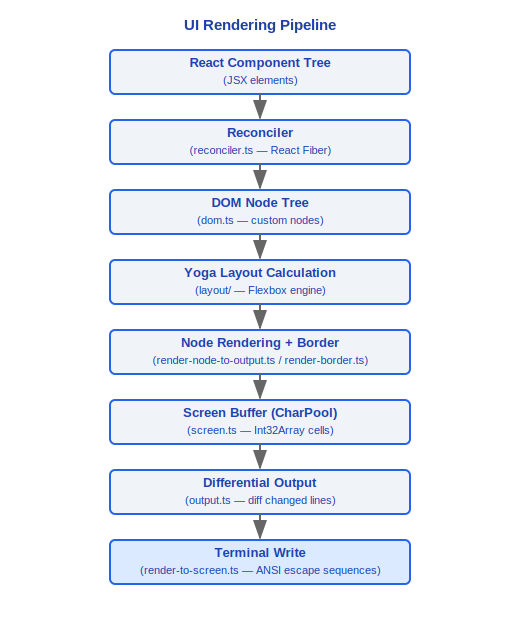
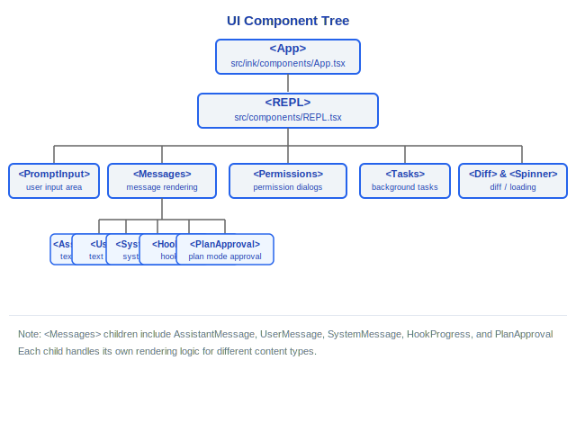

# UI 渲染系统

> Claude Code v2.1.88 的自定义 Ink 引擎、终端支持、组件树、权限对话框、消息组件、设计系统、Diff 系统、Spinner 系统。

---

## 1. 自定义 Ink 引擎 (src/ink/)

Claude Code 使用深度定制的 Ink 引擎，而非官方 Ink 库。`src/ink/` 目录包含完整的 React-to-Terminal 渲染管线：

### 1.1 核心模块

| 模块 | 文件 | 职责 |
|---|---|---|
| **Reconciler** | reconciler.ts | React Fiber 协调器，将 React 元素映射到自定义 DOM 节点 |
| **Layout / Yoga** | layout/ | 基于 Yoga 的 Flexbox 布局引擎 |
| **Render to Screen** | render-to-screen.ts | 将布局结果渲染为终端转义序列 |
| **Screen Buffer** | screen.ts | 屏幕缓冲区管理，支持差分更新 |
| **Terminal I/O** | termio/, termio.ts | 终端输入/输出底层操作 |
| **Selection** | selection.ts | 文本选择支持（鼠标拖选） |
| **Focus** | focus.ts | 焦点管理系统 |
| **Hit Test** | hit-test.ts | 鼠标点击命中测试 |

### 设计理念

#### 为什么CLI用React/Ink而不是传统ncurses/blessed？

因为 Claude Code 的界面不是静态文本流——它是多区域动态更新的（消息流 + 工具进度 + 输入框 + 状态栏 + 权限对话框同时存在并独立刷新）。React 的声明式模型比命令式重绘更适合这种复杂度：组件只需描述"当前状态应该长什么样"，Reconciler 自动处理增量更新。传统 ncurses/blessed 需要手动管理每个区域的重绘时机和顺序，在 40+ 工具并发产出输出时几乎不可维护。

#### 为什么使用character interning（字符池）？

源码 `screen.ts` 中 `CharPool` 类为每个字符分配数字 ID（`intern(char: string): number`），后续渲染比较整数而非字符串。注释明确说明：*"With a shared pool, interned char IDs are valid across screens, so blitRegion can copy IDs directly (no re-interning) and diffEach can compare IDs as integers (no string lookup)"*。对于一个 200x120 的屏幕，每帧需要比较 24,000 个字符——整数比较比字符串比较快一个数量级，显著减少 GC 压力。Cell 数据甚至以 `Int32Array` 紧凑存储，每个 cell 只占 2 个 Int32。

#### 为什么Provider嵌套3层(AppState -> Stats -> FpsMetrics)？

每层关注不同的生命周期——`AppState` 存储跨会话持久的 UI 状态（消息列表、设置、权限模式），`StatsContext` 存储跨请求累积的统计数据（通过 `StatsStore.observe(name, value)` 收集），`FpsMetricsContext` 存储每帧更新的性能指标（帧率、低百分位数）。分层的好处是：FPS 每帧变化时只触发订阅了 FPS 的组件重渲染，不会波及整个 AppState 订阅者树。

### 1.2 渲染管线



### 1.3 渲染优化

- **log-update.ts** — 增量终端更新，仅重写变更的行
- **optimizer.ts** — 输出序列优化，合并连续相同样式的文本
- **frame.ts** — 帧率控制，避免过度渲染
- **node-cache.ts** — 节点缓存，减少重复布局计算
- **line-width-cache.ts** — 行宽缓存

---

## 2. 终端支持

### 2.1 键盘协议

**Kitty 键盘协议** — `src/ink/parse-keypress.ts` 支持 Kitty 终端的增强键盘输入协议，提供：
- 精确的修饰键检测（Ctrl/Alt/Shift/Super）
- 键按下/释放/重复事件区分
- Unicode 码点级别的按键识别

### 2.2 终端检测

- **iTerm2 检测** — 支持 iTerm2 专有功能（图片内联显示等）
- **tmux 检测** — 在 tmux 环境下的特殊处理
- **终端能力查询** — `terminal-querier.ts` 动态查询终端能力
- **终端焦点状态** — `terminal-focus-state.ts` 追踪窗口焦点变化
- **同步输出** — `isSynchronizedOutputSupported()` 检测同步输出支持

### 2.3 ANSI 转义序列

`src/ink/termio/` 目录包含底层终端控制：

| 文件 | 说明 |
|---|---|
| `dec.ts` | DEC 私有模式控制（光标显隐 `SHOW_CURSOR`、替代屏幕等） |
| `csi.ts` | CSI（Control Sequence Introducer）序列 |
| `osc.ts` | OSC（Operating System Command）序列（超链接、窗口标题等） |

- **Ansi.tsx** — ANSI 转义序列的 React 组件包装
- **colorize.ts** — 颜色处理（支持真彩色）
- **bidi.ts** — 双向文本（RTL）支持
- **wrapAnsi.ts** / **wrap-text.ts** — ANSI 感知的文本换行

---

## 3. 组件树



---

## 4. PromptInput

主输入组件，是系统中最复杂的 UI 组件之一（1200+ 行）：

### 核心功能

- **历史导航** — 上下箭头浏览输入历史，支持搜索过滤
- **命令建议** — 输入 `/` 时触发技能/命令建议（`ContextSuggestions.tsx`），基于 `skillUsageTracking` 排序
- **图片粘贴** — 检测剪贴板中的图片数据，自动转换为内联图片消息
- **Emoji 支持** — Emoji 渲染和宽度计算
- **IDE 选择集成** — 接收 IDE 扩展发送的文本选择区域
- **模式切换** — 支持权限模式循环切换（default → acceptEdits → bypassPermissions → plan → auto）
- **多行输入** — Shift+Enter 换行，Enter 提交
- **早期输入捕获** — `seedEarlyInput()` 捕获启动期间的击键，REPL 就绪后回放

### 相关组件

- **BaseTextInput** (`components/BaseTextInput.tsx`) — 底层文本输入
- **ConfigurableShortcutHint** (`components/ConfigurableShortcutHint.tsx`) — 可配置快捷键提示
- **CtrlOToExpand** (`components/CtrlOToExpand.tsx`) — 展开提示

---

## 5. 权限请求组件

针对不同工具类型的专用权限对话框（约 10 种）：

| 工具类型 | 对话框组件 | 说明 |
|---|---|---|
| Bash | BashPermission | Shell 命令执行权限 |
| FileEdit | FileEditToolDiff | 文件编辑权限（含 Diff 预览） |
| FileWrite | FileWritePermission | 文件写入权限 |
| MCP Tool | McpToolPermission | MCP 工具调用权限 |
| Agent | AgentPermission | Agent 启动权限 |
| Worktree | WorktreePermission | Worktree 创建权限 |
| Bypass | BypassPermissionsModeDialog | 危险模式确认 |
| Auto Mode | AutoModeOptInDialog | 自动模式开启确认 |
| Cost Threshold | CostThresholdDialog | 费用阈值确认 |
| Channel | ChannelDowngradeDialog | 通道降级确认 |

---

## 6. 消息组件

### 6.1 Assistant 消息

- **文本块** — Markdown 渲染（`HighlightedCode.tsx` 提供语法高亮）
- **工具调用块** — 每种工具有对应的 `renderToolUseMessage` / `renderToolResultMessage` / `renderToolUseRejectedMessage`
- **思考块** — 扩展思考内容的折叠/展开显示
- **进度块** — 工具执行中的进度指示

### 6.2 User 消息

- **文本消息** — 用户输入的纯文本
- **Bash 输出** — Shell 命令的输出结果
- **工具结果** — 工具调用的返回值

### 6.3 System 消息

- **CompactSummary** (`CompactSummary.tsx`) — 压缩摘要显示
- **Hook 进度** — Hook 执行状态
- **计划审批** — 计划模式下的审批请求

### 6.4 Agent 消息

- **AgentProgressLine** (`AgentProgressLine.tsx`) — Agent 进度行
- **CoordinatorAgentStatus** (`CoordinatorAgentStatus.tsx`) — 协调器下的 Agent 状态

---

## 7. 设计系统

### 7.1 基础组件

| 组件 | 文件 | 说明 |
|---|---|---|
| **Box** | ink/components/Box.tsx | Flexbox 容器（margin/padding/border） |
| **Text** | ink/components/Text.tsx | 文本渲染（颜色/粗体/斜体/下划线） |
| **Spacer** | ink/components/Spacer.tsx | 弹性空间 |
| **Newline** | ink/components/Newline.tsx | 换行 |
| **Link** | ink/components/Link.tsx | 可点击超链接（OSC 8） |
| **RawAnsi** | ink/components/RawAnsi.tsx | 原始 ANSI 输出 |
| **ScrollBox** | ink/components/ScrollBox.tsx | 可滚动容器 |

### 7.2 业务组件

| 组件 | 说明 |
|---|---|
| **Dialog** | 模态对话框（modalContext.tsx 管理） |
| **Pane** | 面板容器 |
| **ThemedBox / ThemedText** | 主题化容器/文本 |
| **FuzzyPicker** | 模糊搜索选择器 |
| **ProgressBar** | 进度条 |
| **Tabs** | 标签页切换 |
| **CustomSelect** | 自定义下拉选择（components/CustomSelect/） |
| **FullscreenLayout** | 全屏布局 |

### 7.3 上下文系统

| Context | 文件 | 说明 |
|---|---|---|
| **AppStoreContext** | state/AppState.tsx | 应用状态 |
| **StdinContext** | ink/components/StdinContext.ts | 标准输入流 |
| **ClockContext** | ink/components/ClockContext.tsx | 时钟/计时器 |
| **CursorDeclarationContext** | ink/components/CursorDeclarationContext.ts | 光标状态 |
| **TerminalFocusContext** | ink/components/TerminalFocusContext.tsx | 终端焦点 |
| **TerminalSizeContext** | ink/components/TerminalSizeContext.tsx | 终端尺寸 |

---

## 8. Diff 系统

用于文件编辑权限对话框中展示代码差异：

### 8.1 核心组件

- **FileEditToolDiff** (`components/FileEditToolDiff.tsx`) — 文件编辑工具的 Diff 渲染
- **FileEditToolUpdatedMessage** (`components/FileEditToolUpdatedMessage.tsx`) — 编辑完成后的更新消息

### 8.2 Diff 功能

- **并排对比** — 旧内容 vs 新内容的语法高亮对比
- **行内差异标注** — 变更行的精确字符级差异标注
- **文件列表** — 多文件编辑时的文件列表导航
- **上下文折叠** — 未变更区域的智能折叠

---

## 9. Spinner 系统

加载指示器系统，提供多种视觉反馈样式：

### 9.1 组件

| 组件 | 说明 |
|---|---|
| **FlashingChar** | 闪烁字符（光标样式） |
| **GlimmerMessage** | 闪烁消息（渐变文字效果） |
| **ShimmerChar** | 微光字符（单字符渐变） |
| **SpinnerGlyph** | 旋转字形（经典 spinner 图案） |

### 9.2 Spinner 提示

Spinner 可附带上下文提示文本：

```typescript
// AppState 中的 spinnerTip 字段
spinnerTip?: string  // 当前 spinner 提示文本
```

提示文本来源于 `src/services/tips/tipRegistry.ts`，通过 `getRelevantTips()` 获取与当前操作相关的提示。

### 9.3 FPS 追踪

`src/utils/fpsTracker.ts` 追踪 UI 帧率：

```typescript
type FpsMetrics = {
  average: number
  low1Pct: number
}
```

`src/context/fpsMetrics.tsx` 提供 FPS 指标的 React Context。帧率数据在会话退出时记录到 `tengu_exit` 事件中（`lastFpsAverage`、`lastFpsLow1Pct`）。

---

## 10. 渲染选项

`src/utils/renderOptions.ts` 中的 `getBaseRenderOptions()` 提供渲染配置：

```typescript
type RenderOptions = {
  // Ink Root 配置
  stdout: NodeJS.WriteStream
  stderr: NodeJS.WriteStream
  stdin: NodeJS.ReadStream
  // 终端能力
  patchConsole: boolean      // 拦截 console.log/error
  exitOnCtrlC: boolean
}
```

特殊环境处理：
- **非交互模式** — 禁用所有 UI 渲染，直接输出文本
- **tmux 环境** — 调整终端控制序列兼容性
- **Windows 终端** — 降级某些终端特性（无 Kitty 键盘协议）

---

## 工程实践指南

### 添加新 UI 组件

**步骤清单：**

1. 在 `src/components/` 目录创建 React 组件文件
2. 使用 Ink 原语构建布局：
   ```tsx
   import { Box, Text } from '../ink/components/index.js'

   export function MyComponent({ title, content }: Props) {
     return (
       <Box flexDirection="column" paddingX={1}>
         <Text bold color="cyan">{title}</Text>
         <Box marginTop={1}>
           <Text>{content}</Text>
         </Box>
       </Box>
     )
   }
   ```
3. 通过 hooks 连接状态：
   - `useAppState(selector)` — 从 AppState 读取数据
   - `useContext(ModalContext)` — 模态对话框管理
   - `useContext(TerminalSizeContext)` — 获取终端尺寸
4. 在组件树中挂载（参考 `<REPL>` 组件结构）

**可用的基础组件：**
| 组件 | 用途 |
|------|------|
| `Box` | Flexbox 容器（flexDirection/alignItems/justifyContent/margin/padding/border） |
| `Text` | 文本渲染（color/bold/italic/underline/strikethrough） |
| `Spacer` | 弹性空间填充 |
| `Link` | 可点击超链接（OSC 8 终端序列） |
| `ScrollBox` | 可滚动容器 |
| `RawAnsi` | 原始 ANSI 转义序列输出 |

### 调试渲染问题

1. **检查 FPS 指标**：`FpsMetricsContext` 提供帧率数据（`average` 和 `low1Pct`）。帧率低于 15fps 可能导致 UI 卡顿。帧率数据在会话退出时记录到 `tengu_exit` 事件。
2. **检查布局**：`Box` 的 `flexDirection`（默认 `row`）、`alignItems`、`justifyContent` 控制布局。终端环境下只支持 Flexbox 子集——不支持 Grid、Position 等 CSS 属性。
3. **检查终端兼容性**：
   - `isSynchronizedOutputSupported()` — 检测同步输出支持
   - `terminal-querier.ts` — 动态查询终端能力
   - Windows 终端不支持 Kitty 键盘协议
   - tmux 环境需要特殊处理（转义序列包装）
4. **检查字符宽度**：CJK 字符、Emoji 等宽字符的宽度计算可能导致布局错位。`bidi.ts` 处理双向文本。
5. **检查 Screen Buffer**：`screen.ts` 的 `CharPool` 使用字符 interning（整数 ID 替代字符串比较），`Cell` 数据以 `Int32Array` 紧凑存储。如果渲染出现乱码，检查 interning 是否正确。

### 性能优化

- **虚拟化大消息列表**：`useVirtualScroll` hook 实现虚拟滚动，只渲染可见区域的消息
- **避免在 render 中创建新对象**：使用 `React.memo()`、`useMemo()`、`useCallback()` 避免不必要的重渲染
- **增量终端更新**：`log-update.ts` 仅重写变更的行；`optimizer.ts` 合并连续相同样式的文本
- **帧率控制**：`frame.ts` 控制渲染频率，避免过度渲染。高频状态更新（如 spinner 动画）应使用 `requestAnimationFrame` 等节流机制
- **节点缓存**：`node-cache.ts` 和 `line-width-cache.ts` 减少重复布局计算

### Provider 嵌套顺序

组件树中 Provider 嵌套 3 层，顺序有意义：


分层好处：FPS 每帧变化时只触发订阅了 FPS 的组件重渲染，不会波及整个 AppState 订阅者树。添加新 Provider 时要考虑其更新频率——高频更新的 Provider 放在内层。

### 常见陷阱

> **Ink 不支持所有 CSS 属性**
> 终端渲染引擎基于 Yoga Flexbox，只支持 Flexbox 布局的子集。不支持 CSS Grid、position absolute/fixed、float、z-index 等。布局只能用 `flexDirection`、`alignItems`、`justifyContent`、`flexGrow`/`flexShrink`、`margin`/`padding`、`border` 等属性。

> **终端宽度变化需要监听 resize 事件**
> `TerminalSizeContext`（`ink/components/TerminalSizeContext.tsx`）提供终端尺寸 context。组件需要通过此 context 响应终端大小变化，而不是假设固定宽度。`useTerminalSize` hook 封装了 resize 监听。

> **App.tsx 中的 clickCount 不随 release 重置**
> 源码 `ink/components/App.tsx:611` 注释：与旧版基于 release 的检测不同，当前实现中 `clickCount` 不在 release 事件时重置——修改鼠标事件处理时注意此行为差异。

> **同步输出避免撕裂**
> 支持同步输出的终端（通过 `isSynchronizedOutputSupported()` 检测）可以在一帧内原子更新所有内容，避免渲染撕裂。不支持的终端会逐行更新，快速刷新时可能出现闪烁。

> **早期输入捕获**
> `seedEarlyInput()` 在 REPL 完全就绪前捕获用户击键并缓存，就绪后回放。添加新的输入处理逻辑时要确保与早期输入兼容。


---

[← 多智能体](../11-多智能体/multi-agent.md) | [目录](../README.md) | [配置体系 →](../13-配置体系/config-system.md)
