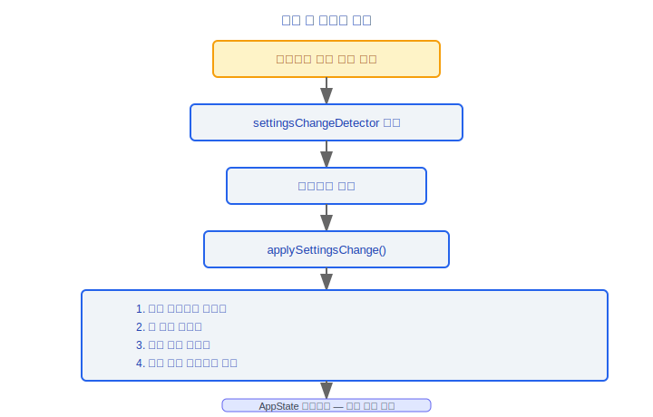

# 설정(Config) 시스템 아키텍처 문서

> Claude Code v2.1.88 설정(Config) 시스템 완전 기술 참조서

---

## 5단계 설정 우선순위 (낮음 → 높음)

설정은 낮은 우선순위에서 높은 우선순위 순으로 로드되며, 높은 우선순위가 낮은 우선순위를 덮어씁니다.

| 우선순위 | 소스 이름 | 경로 | 설명 |
|----------|-----------|------|------|
| 1 (가장 낮음) | **policySettings** | `/etc/claude/managed-settings.json` + `/etc/claude/managed-settings.d/*.json` | 기업 정책 설정, `managed-settings.d/` 하위 파일은 알파벳 순으로 로드됨 |
| 2 | **userSettings** | `~/.claude/settings.json` 또는 `~/.claude/cowork_settings.json` | 사용자 수준 설정, `--cowork` 플래그 사용 시 cowork 변형 사용 |
| 3 | **projectSettings** | `./.claude/settings.json` | 프로젝트 수준 설정, 버전 관리에 커밋됨 |
| 4 | **localSettings** | `./.claude/settings.local.json` | 로컬 설정, gitignore 처리되어 커밋되지 않음 |
| 5 (가장 높음) | **flagSettings** | `--settings` 플래그 | 커맨드라인 오버라이드, 경로 또는 인라인 JSON 지원 |

### 설계 철학

#### 왜 5단계 우선순위인가?

조직 거버넌스를 소프트웨어로 인코딩한 결과입니다. `policySettings`(기업 보안 정책, CISO 집행) > `flagSettings`(CLI 플래그, 운영 오버라이드) > `localSettings`(개인 로컬 설정(Config), gitignore 처리) > `projectSettings`(팀 규약, 버전 관리 커밋) > `userSettings`(개인 선호도) 순입니다. 각 단계는 현실 세계의 의사결정 역할과 범위에 대응합니다. 기업은 `/etc/claude/managed-settings.json`을 통해 모든 개발자에게 보안 기준선을 강제할 수 있으며, 개발자는 이 기준선 위에서 자신의 선호도를 커스터마이징할 수 있습니다.

#### 왜 policySettings는 비활성화할 수 없는가?

보안은 타협할 수 없는 원칙입니다. 소스 코드에서 `allowedSettingSources`는 초기화(`bootstrap/state.ts`) 시 항상 `'policySettings'`를 포함하며, 기업 정책 설정은 MDM과 `/etc/claude/managed-settings.json`을 통해 로드되어 사용자 조작의 영향을 받지 않습니다. 개발자가 기업 보안 정책(예: 코드 리뷰 규칙 비활성화 또는 비인가 MCP 서버 허용)을 우회할 수 있다면, 전체 보안 모델이 붕괴됩니다. 이는 "심층 방어"를 구현한 것입니다.

#### 왜 핫 리로드(Hot Reload)를 지원하는가?

사용자가 세션 중 설정을 수정한 후 재시작할 필요가 없어야 한다는 것은 CLI 도구의 기본적인 UX 요구사항입니다. 소스 코드에서 `settingsChangeDetector`는 모든 설정 파일의 변경을 모니터링하고 `applySettingsChange()`를 통해 권한 컨텍스트 리로드, 훅(Hooks) 설정(Config) 리로드, 환경 변수 리로드 등 일련의 업데이트를 트리거합니다. 디바운스(debounce) 메커니즘을 사용하여 빈번한 리로드를 방지합니다. 개발자는 한 터미널에서 `.claude/settings.json`을 편집하면 다른 터미널의 Claude Code에 즉시 적용됩니다.

---

## 병합 전략

- `mergeWith()` + `settingsMergeCustomizer`를 사용하여 깊은 병합(deep merge) 수행
- 높은 우선순위가 같은 이름의 낮은 우선순위 필드를 덮어씀
- **권한 규칙 특별 필터링**: `allow` / `soft_deny` / `environment` 유형의 권한 규칙은 독립적인 필터링 및 병합 로직을 가짐

---

## 핵심 함수 (src/utils/settings/settings.ts)

### 메인 로딩 진입점
```
getInitialSettings(): Settings
```
메인 로딩 함수로, 우선순위 순서대로 모든 설정(Config) 소스를 로드하고 병합합니다.

### 파서
```
parseSettingsFile(path): ParsedSettings       // 핵심 파서 (캐시 포함)
parseSettingsFileUncached(path): ParsedSettings // 파일 읽기 + JSON 파싱 + Zod 유효성 검사
```

### 정책 설정
```
loadManagedFileSettings(): ManagedSettings
```
`/etc/claude/` 하위의 정책 설정 파일을 로드합니다.

### 경로 및 소스
```
getSettingsFilePathForSource(source): string   // 각 소스의 파일 경로 반환
getSettingsForSource(source): Settings         // 단일 소스의 설정 가져오기
```

### 오류 처리
```
getSettingsWithErrors(): { settings, errors }
```
설정(Config) 객체와 유효성 검사 오류 목록을 반환합니다.

### 캐시 관리
```
resetSettingsCache(): void
```
캐시를 무효화하고, 다음 설정 조회 시 파일에서 강제로 리로드합니다.

---

## 설정 스키마(Schema) (src/utils/settings/types.ts)

### EnvironmentVariablesSchema
환경 변수 선언 스키마(Schema)로, 설정(Config)에서 선언할 수 있는 환경 변수를 정의합니다.

### PermissionsSchema
권한 규칙 및 패턴 정의를 포함합니다:
- 허용 규칙(allow)
- 소프트 거부 규칙(soft_deny)
- 환경 규칙(environment)

### ExtraKnownMarketplaceSchema
추가 알려진 마켓플레이스 소스 정의입니다.

### AllowedMcpServerEntrySchema
기업 MCP(Model Context Protocol) 화이트리스트 항목 스키마(Schema)로, 허용된 MCP(Model Context Protocol) 서버를 제어합니다.

### HooksSchema
`schemas/hooks.ts`에서 가져온 훅(Hooks) 설정(Config) 스키마(Schema)입니다.

---

## 핫 리로드(Hot Reload) (changeDetector.ts)

### 파일 모니터링
- 모든 설정 파일의 변경을 모니터링
- 디바운스 메커니즘을 사용하여 리스너에 알림을 보내며 빈번한 리로드를 방지

### 업데이트 적용
```
applySettingsChange() → AppState 업데이트
```
설정 변경 시 트리거되는 업데이트 프로세스:
1. 권한 컨텍스트 리로드
2. 훅(Hooks) 설정(Config) 리로드
3. 환경 변수 리로드
4. 설정에 의존하는 다른 컴포넌트 새로고침

---

## MDM 통합 (settings/mdm/)

### rawRead.ts
원시 MDM(Mobile Device Management) 설정 읽기 모듈로, 기업 모바일 기기 관리 시나리오에서의 설정(Config) 검색을 지원합니다.

---

## 유효성 검사

### validation.ts
스키마(Schema) 유효성 검사 모듈로, Zod Schema를 사용하여 설정 파일의 구조와 타입을 검증합니다.

### permissionValidation.ts
권한 규칙 특화 유효성 검사로, 권한 설정(Config)의 의미론적 정확성을 보장합니다.

### validationTips.ts
사용자 친화적인 안내 메시지로, 유효성 검사 실패 시 읽기 쉬운 오류 설명과 수정 제안을 제공합니다.

---

## 전역 설정(Config) (utils/config.ts)

### 전역 설정(Config) 파일
```
~/.claude/config.json
```
전역 설정(Config) 정보를 저장합니다.

### 프로젝트 수준 설정(Config) 파일
```
.claude.json
```
프로젝트 루트 디렉터리의 설정(Config) 파일로, MCP(Model Context Protocol) 서버 정의 등 프로젝트 수준 설정을 포함합니다.

### 핵심 함수
```
saveGlobalConfig(config): void    // 전역 설정(Config) 저장
readProjectConfig(): ProjectConfig // 프로젝트 수준 설정(Config) 읽기
```

---

## 엔지니어링 실천 가이드

### 새 설정(Config) 항목 추가

**체크리스트:**

1. **스키마(Schema)에 정의**: `src/utils/settings/types.ts`의 해당 Schema에 필드 정의 추가 (Zod 사용)
2. **병합 로직에 등록**: 새 필드에 특별한 병합 동작(예: 오버라이드 대신 배열 추가)이 있는 경우, `settingsMergeCustomizer`에 처리 로직 추가
3. **관련 코드에서 읽기**: `getInitialSettings()` 또는 `getSettingsForSource()`를 통해 설정 값 가져오기
4. **유효성 검사 팁 추가**: `validationTips.ts`에 사용자 친화적인 오류 팁을 추가하여 사용자가 설정(Config) 형식 오류를 빠르게 수정할 수 있도록 지원
5. **핫 리로드 테스트**: 설정 파일 수정 후 즉시 적용되는지 확인 — `settingsChangeDetector`가 파일 변경을 모니터링하고 `applySettingsChange()`를 통해 업데이트를 트리거함

**설정(Config) 파일 경로 개요:**
| 수준 | 경로 | 목적 |
|------|------|------|
| 기업 정책 | `/etc/claude/managed-settings.json` + `managed-settings.d/*.json` | 보안 기준선, 우회 불가 |
| 사용자 설정 | `~/.claude/settings.json` | 개인 선호도 |
| 프로젝트 설정 | `.claude/settings.json` | 팀 규약, VCS에 커밋됨 |
| 로컬 설정 | `.claude/settings.local.json` | 개인 로컬 설정(Config), gitignore 처리 |
| CLI 오버라이드 | `--settings <경로-또는-json>` | 런타임 오버라이드 |

### 설정(Config) 우선순위 디버깅

1. **`claude config list` 사용**: 모든 유효한 설정(Config)과 출처를 확인하고, 어느 수준의 설정(Config)이 적용되는지 신속하게 파악
2. **병합 결과 확인**: `getSettingsWithErrors()`는 병합된 설정(Config)과 유효성 검사 오류 목록을 반환
3. **단일 레이어 설정 확인**: `getSettingsForSource('projectSettings')`로 특정 소스의 설정(Config) 값을 가져오고 충돌 위치 파악
4. **유효성 검사 실패 진단**: `parseSettingsFileUncached()`는 JSON 파싱 + Zod Schema 유효성 검사를 수행하며, 설정 형식이 잘못된 경우 `validationTips.ts`가 읽기 쉬운 수정 제안 제공
5. **캐시 확인**: `resetSettingsCache()`로 캐시 무효화를 강제하고 캐시 오래됨(staleness) 문제 제거

**우선순위 기억법 (낮음→높음)**: `기업 정책 < 사용자 설정 < 프로젝트 설정 < 로컬 설정 < CLI 플래그`

> 참고: 기업 정책은 우선순위 번호가 가장 낮지만, `policySettings`는 항상 `allowedSettingSources`에 포함되어 비활성화할 수 없습니다 — 이는 다른 메커니즘(우선순위 방식이 아닌 강제 오버라이드)을 통해 보안 정책이 적용되도록 보장합니다.

### 기업 정책 설정(Config)

기업 관리자는 다음 방법으로 설정(Config)을 배포할 수 있습니다:

1. **파일 방식**: `/etc/claude/managed-settings.json` 또는 `/etc/claude/managed-settings.d/*.json`에 정책 작성 (알파벳 순으로 로드)
2. **MDM 방식**: MDM API(`settings/mdm/rawRead.ts`)를 통해 설정(Config) 배포
3. **원격 호스팅**: `remoteManagedSettings`를 통해 배포 (`scope: 'managed'`)

정책 제어 기능:
- `areMcpConfigsAllowedWithEnterpriseMcpConfig()` — 사용자가 추가한 MCP(Model Context Protocol) 서버 제한
- `filterMcpServersByPolicy()` — 정책에 따라 MCP(Model Context Protocol) 서버 필터링
- `allow`/`soft_deny`/`environment` 유형의 권한 규칙은 독립적인 필터링 및 병합 로직을 가짐

### 핫 리로드(Hot Reload) 구현

설정(Config) 파일 변경 후 업데이트 프로세스:



한 터미널에서 `.claude/settings.json`을 편집하면, 다른 터미널의 Claude Code에 즉시 적용됩니다.

### 일반적인 함정

> **프로젝트 설정은 git으로 추적됩니다 — 민감한 정보를 넣지 마십시오**
> `.claude/settings.json`은 프로젝트 수준 설정(Config)으로, 일반적으로 버전 관리에 커밋됩니다. API 키, 인증 토큰, 개인 경로 또는 기타 민감한 정보를 넣지 마십시오. 이러한 정보는 `.claude/settings.local.json`(gitignore 처리)에 저장하거나 환경 변수를 통해 전달해야 합니다.

> **로컬 설정(.local.json)은 gitignore 처리됩니다**
> `.claude/settings.local.json` 파일은 버전 관리에 커밋되지 않습니다. 개인 로컬 설정(Config)(예: 로컬 프록시 설정, 개인 API 키 경로 등)을 저장하는 데 사용됩니다.

> **settings.json 편집 후 유효성 검사**
> 소스 `validateEditTool.ts:39`는 도구를 통해 settings.json을 편집할 때마다 Zod Schema 유효성 검사를 수행합니다. 유효성 검사 실패 시 완전한 스키마(Schema)를 포함한 오류 메시지가 생성됩니다. 수동 편집 시에도 JSON 형식을 확인하는 것이 권장됩니다.

> **--cowork 플래그는 사용자 설정 파일을 전환합니다**
> `--cowork` 플래그 사용 시, 사용자 설정은 `~/.claude/settings.json`에서 `~/.claude/cowork_settings.json`으로 전환됩니다 — 이를 통해 팀 협업 모드에서 다른 개인 설정을 사용할 수 있습니다.

> **policySettings는 절대 비활성화할 수 없습니다**
> `allowedSettingSources`는 초기화(`bootstrap/state.ts`) 시 항상 `'policySettings'`를 포함하며, 사용자 조작의 영향을 받지 않습니다. 이것은 보안 설계입니다 — 개발자가 기업 보안 정책을 우회하는 것을 방지합니다.


---

[← UI 렌더링](../12-UI渲染/ui-rendering-ko.md) | [인덱스](../README_KO.md) | [상태 관리(State Management) →](../14-状态管理/state-management-ko.md)
