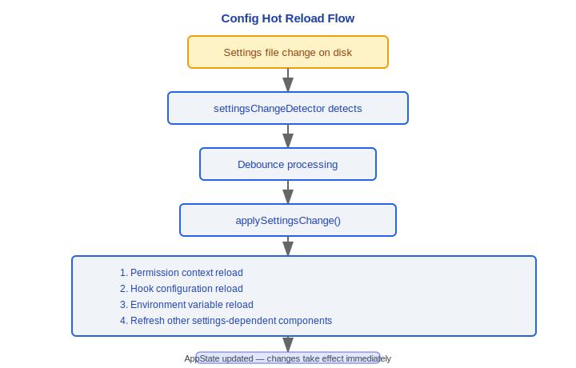

# 配置体系架构文档

> Claude Code v2.1.88 配置系统完整技术参考

---

## 5级配置优先级 (低 → 高)

配置按优先级从低到高加载，高优先级覆盖低优先级：

| 优先级 | 源名称 | 路径 | 说明 |
|--------|--------|------|------|
| 1 (最低) | **policySettings** | `/etc/claude/managed-settings.json` + `/etc/claude/managed-settings.d/*.json` | 企业策略设置，`managed-settings.d/` 下文件按字母排序加载 |
| 2 | **userSettings** | `~/.claude/settings.json` 或 `~/.claude/cowork_settings.json` | 用户级设置，`--cowork` 标志时使用 cowork 变体 |
| 3 | **projectSettings** | `./.claude/settings.json` | 项目级设置，提交到版本控制 |
| 4 | **localSettings** | `./.claude/settings.local.json` | 本地设置，gitignored，不提交 |
| 5 (最高) | **flagSettings** | `--settings` 标志 | 命令行覆盖，支持路径或内联 JSON |

### 设计理念

#### 为什么5级优先级？

这是将组织治理编码为软件：`policySettings`（企业安全策略，CISO 强制执行）> `flagSettings`（CLI 标志，运维覆盖）> `localSettings`（个人本机配置，gitignored）> `projectSettings`（团队约定，提交到版本控制）> `userSettings`（个人偏好）。每一级对应一个现实中的决策角色和作用域。企业可以通过 `/etc/claude/managed-settings.json` 强制所有开发者遵守安全基线，而开发者仍能在此基线上自定义自己的偏好。

#### 为什么policySettings永远不能被禁用？

安全不可妥协原则。源码中 `allowedSettingSources` 初始化时始终包含 `'policySettings'`（`bootstrap/state.ts`），且企业策略设置通过 MDM 和 `/etc/claude/managed-settings.json` 加载，不受用户操作影响。如果开发者可以绕过企业安全策略（例如禁用代码审查规则或允许未经授权的 MCP 服务器），整个安全模型就会崩塌。这是"防御深度"的体现。

#### 为什么支持热重载？

用户在会话中修改 settings 后不应需要重启——这是 CLI 工具的 UX 基本要求。源码中 `settingsChangeDetector` 监控所有设置文件的变更，通过 `applySettingsChange()` 触发权限上下文重载、Hook 配置重载、环境变量重载等一系列更新，使用防抖机制避免频繁重载。开发者可以在一个终端编辑 `.claude/settings.json`，另一个终端中的 Claude Code 立刻生效。

---

## 合并策略

- 使用 `mergeWith()` + `settingsMergeCustomizer` 进行深度合并
- 高优先级覆盖低优先级的同名字段
- **权限规则特殊过滤**: `allow` / `soft_deny` / `environment` 类型的权限规则有独立的过滤和合并逻辑

---

## 核心函数 (src/utils/settings/settings.ts)

### 主加载入口
```
getInitialSettings(): Settings
```
主加载函数，按优先级顺序加载所有配置源并合并。

### 解析器
```
parseSettingsFile(path): ParsedSettings       // 核心解析器（带缓存）
parseSettingsFileUncached(path): ParsedSettings // 文件读取 + JSON解析 + Zod验证
```

### 策略设置
```
loadManagedFileSettings(): ManagedSettings
```
加载 `/etc/claude/` 下的策略设置文件。

### 路径与源
```
getSettingsFilePathForSource(source): string   // 返回各源的文件路径
getSettingsForSource(source): Settings         // 获取单个源的设置
```

### 错误处理
```
getSettingsWithErrors(): { settings, errors }
```
返回设置对象和验证错误列表。

### 缓存管理
```
resetSettingsCache(): void
```
使缓存失效，下次获取设置时重新从文件加载。

---

## 设置Schema (src/utils/settings/types.ts)

### EnvironmentVariablesSchema
环境变量声明 Schema，定义可在设置中声明的环境变量。

### PermissionsSchema
权限规则和模式定义，包括：
- 允许规则 (allow)
- 软拒绝规则 (soft_deny)
- 环境规则 (environment)

### ExtraKnownMarketplaceSchema
额外已知的市场源定义。

### AllowedMcpServerEntrySchema
企业 MCP 白名单条目 Schema，控制允许使用的 MCP 服务器。

### HooksSchema
从 `schemas/hooks.ts` 导入的钩子配置 Schema。

---

## 热重载 (changeDetector.ts)

### 文件监控
- 监控所有设置文件的变更
- 使用防抖机制通知监听器，避免频繁重载

### 应用更新
```
applySettingsChange() → AppState更新
```
设置变更时触发的更新流程：
1. 权限上下文重载
2. 钩子配置重载
3. 环境变量重载
4. 其他依赖设置的组件刷新

---

## MDM集成 (settings/mdm/)

### rawRead.ts
原始 MDM (Mobile Device Management) 设置读取模块，支持企业移动设备管理场景下的配置获取。

---

## 验证

### validation.ts
Schema 验证模块，使用 Zod Schema 验证设置文件的结构和类型。

### permissionValidation.ts
权限规则专用验证，确保权限配置的语义正确性。

### validationTips.ts
用户友好的提示信息，在验证失败时提供可读的错误说明和修复建议。

---

## 全局配置 (utils/config.ts)

### 全局配置文件
```
~/.claude/config.json
```
存储全局配置信息。

### 项目级配置文件
```
.claude.json
```
项目根目录下的配置文件，包含 MCP 服务器定义等项目级配置。

### 核心函数
```
saveGlobalConfig(config): void    // 保存全局配置
readProjectConfig(): ProjectConfig // 读取项目级配置
```

---

## 工程实践指南

### 添加新配置项

**步骤清单：**

1. **在 Schema 中定义**：在 `src/utils/settings/types.ts` 的对应 Schema 中添加字段定义（使用 Zod）
2. **注册到合并逻辑**：如果新字段有特殊的合并行为（如数组追加而非覆盖），在 `settingsMergeCustomizer` 中添加处理
3. **在相关代码中读取**：通过 `getInitialSettings()` 或 `getSettingsForSource()` 获取配置值
4. **添加验证提示**：在 `validationTips.ts` 中添加用户友好的错误提示，帮助用户在配置格式错误时快速修复
5. **测试热重载**：修改 settings 文件后确认配置立即生效——`settingsChangeDetector` 监控文件变更并通过 `applySettingsChange()` 触发更新

**配置文件路径一览：**
| 层级 | 路径 | 用途 |
|------|------|------|
| 企业策略 | `/etc/claude/managed-settings.json` + `managed-settings.d/*.json` | 安全基线，不可绕过 |
| 用户设置 | `~/.claude/settings.json` | 个人偏好 |
| 项目设置 | `.claude/settings.json` | 团队约定，提交到 VCS |
| 本地设置 | `.claude/settings.local.json` | 个人本机配置，gitignored |
| CLI 覆盖 | `--settings <path-or-json>` | 运行时覆盖 |

### 调试配置优先级

1. **使用 `claude config list`**：查看所有生效配置及其来源，快速定位哪个层级的配置生效
2. **检查合并结果**：`getSettingsWithErrors()` 返回合并后的配置和验证错误列表
3. **检查单层配置**：`getSettingsForSource('projectSettings')` 获取特定来源的配置值，定位冲突
4. **验证失败诊断**：`parseSettingsFileUncached()` 执行 JSON 解析 + Zod Schema 验证。如果 settings 格式有误，`validationTips.ts` 提供可读的修复建议
5. **检查缓存**：`resetSettingsCache()` 强制使缓存失效，排除缓存过期问题

**优先级记忆口诀（低→高）**：`企业策略 < 用户设置 < 项目设置 < 本地设置 < CLI标志`

> 注意：虽然企业策略优先级最低，但 `policySettings` 始终包含在 `allowedSettingSources` 中且不可被禁用——它通过不同的机制（强制覆盖而非优先级）确保安全策略生效。

### 企业策略配置

企业管理员可通过以下方式下发配置：

1. **文件方式**：将策略写入 `/etc/claude/managed-settings.json` 或 `/etc/claude/managed-settings.d/*.json`（按字母排序加载）
2. **MDM 方式**：通过 MDM API（`settings/mdm/rawRead.ts`）下发配置
3. **远程托管**：通过 `remoteManagedSettings` 下发（`scope: 'managed'`）

策略约束能力：
- `areMcpConfigsAllowedWithEnterpriseMcpConfig()` — 限制用户添加的 MCP 服务器
- `filterMcpServersByPolicy()` — 按策略过滤 MCP 服务器
- 权限规则的 `allow`/`soft_deny`/`environment` 类型有独立的过滤和合并逻辑

### 热重载实现

配置文件变更后的更新流程：



在一个终端编辑 `.claude/settings.json`，另一个终端中的 Claude Code 立刻生效。

### 常见陷阱

> **project settings 会被 git 追踪——不要放敏感信息**
> `.claude/settings.json` 是项目级配置，通常提交到版本控制。不要在其中放置 API 密钥、认证 token、个人路径等敏感信息。这些应放入 `.claude/settings.local.json`（被 gitignore）或通过环境变量传递。

> **local settings（.local.json）被 gitignore**
> `.claude/settings.local.json` 文件不会被提交到版本控制。用于存放个人本机配置（如本地代理设置、个人 API 密钥路径等）。

> **settings.json 编辑后的验证**
> 源码 `validateEditTool.ts:39` 在每次通过工具编辑 settings.json 后执行 Zod Schema 验证。如果验证失败，会生成包含完整 schema 的错误消息。手动编辑时也建议先验证 JSON 格式。

> **--cowork 标志切换用户设置文件**
> 使用 `--cowork` 标志时，用户设置从 `~/.claude/settings.json` 切换为 `~/.claude/cowork_settings.json`——这允许在团队协作模式下使用不同的个人配置。

> **policySettings 永远不能被禁用**
> `allowedSettingSources` 初始化时始终包含 `'policySettings'`（`bootstrap/state.ts`），且不受用户操作影响。这是安全设计——防止开发者绕过企业安全策略。


---

[← UI 渲染](../12-UI渲染/ui-rendering.md) | [目录](../README.md) | [状态管理 →](../14-状态管理/state-management.md)
