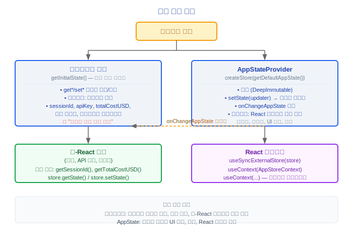

# 상태 관리(State Management)

> Claude Code v2.1.88의 이중 레이어 상태 아키텍처: 부트스트랩 상태(Bootstrap State, 전역 싱글턴)와 AppState(Zustand 유사 스토어), 그리고 React Context 프로바이더.

---

## 1. 부트스트랩 상태(Bootstrap State) (src/bootstrap/state.ts)

전체 프로세스 생명주기 동안 지속되는 전역 싱글턴 상태입니다. 모듈 헤더에는 다음과 같은 경고가 포함되어 있습니다: **"DO NOT ADD MORE STATE HERE - BE JUDICIOUS WITH GLOBAL STATE"**.

### 1.1 상태 타입 — 전체 필드 목록

#### 디렉터리 및 세션

| 필드 | 타입 | 설명 |
|---|---|---|
| `originalCwd` | `string` | 원래 작업 디렉터리 |
| `projectRoot` | `string` | 안정적인 프로젝트 루트 디렉터리 (시작 시 설정되며 EnterWorktreeTool로 변경되지 않음) |
| `cwd` | `string` | 현재 작업 디렉터리 |
| `sessionId` | `SessionId` | 현재 세션 ID (`randomUUID()`) |
| `parentSessionId` | `SessionId \| undefined` | 부모 세션 ID (플랜 모드 → 구현 계보 추적) |
| `sessionProjectDir` | `string \| null` | 세션 `.jsonl` 파일을 포함하는 디렉터리 |

#### 비용 및 사용량

| 필드 | 타입 | 설명 |
|---|---|---|
| `totalCostUSD` | `number` | 누적 비용 (USD) |
| `totalAPIDuration` | `number` | 누적 API 지속 시간 |
| `totalAPIDurationWithoutRetries` | `number` | 재시도 제외 API 지속 시간 |
| `totalToolDuration` | `number` | 누적 도구 실행 지속 시간 |
| `totalLinesAdded` | `number` | 누적 추가된 줄 수 |
| `totalLinesRemoved` | `number` | 누적 제거된 줄 수 |
| `hasUnknownModelCost` | `boolean` | 알 수 없는 모델로 인한 비용 여부 |
| `modelUsage` | `{ [modelName: string]: ModelUsage }` | 모델별 사용량 분류 |

#### 성능 메트릭

| 필드 | 타입 | 설명 |
|---|---|---|
| `startTime` | `number` | 프로세스 시작 시간 |
| `lastInteractionTime` | `number` | 마지막 상호작용 시간 |
| `turnHookDurationMs` | `number` | 현재 턴의 훅(Hooks) 지속 시간 |
| `turnToolDurationMs` | `number` | 현재 턴의 도구 지속 시간 |
| `turnClassifierDurationMs` | `number` | 현재 턴의 분류기 지속 시간 |
| `turnToolCount` | `number` | 현재 턴의 도구 호출 횟수 |
| `turnHookCount` | `number` | 현재 턴의 훅(Hooks) 호출 횟수 |
| `turnClassifierCount` | `number` | 현재 턴의 분류기 호출 횟수 |
| `slowOperations` | `Array<{ operation, durationMs, timestamp }>` | 느린 작업 추적 (개발 바) |

#### 인증 및 보안

| 필드 | 타입 | 설명 |
|---|---|---|
| `sessionIngressToken` | `string \| null \| undefined` | 세션 인그레스 인증 토큰 |
| `oauthTokenFromFd` | `string \| null \| undefined` | FD에서 읽은 OAuth 토큰 |
| `apiKeyFromFd` | `string \| null \| undefined` | FD에서 읽은 API 키 |
| `sessionBypassPermissionsMode` | `boolean` | 세션 수준 권한 우회 모드 플래그 |
| `sessionTrustAccepted` | `boolean` | 세션 수준 신뢰 플래그 (홈 디렉터리 시나리오, 영속화되지 않음) |

#### 텔레메트리(Telemetry)

| 필드 | 타입 | 설명 |
|---|---|---|
| `meter` | `Meter \| null` | OpenTelemetry Meter |
| `sessionCounter` | `AttributedCounter \| null` | 세션 카운터 |
| `locCounter` | `AttributedCounter \| null` | 코드 줄 수 카운터 |
| `prCounter` | `AttributedCounter \| null` | PR 카운터 |
| `commitCounter` | `AttributedCounter \| null` | 커밋 카운터 |
| `costCounter` | `AttributedCounter \| null` | 비용 카운터 |
| `tokenCounter` | `AttributedCounter \| null` | 토큰 카운터 |
| `codeEditToolDecisionCounter` | `AttributedCounter \| null` | 편집 도구 결정 카운터 |
| `activeTimeCounter` | `AttributedCounter \| null` | 활성 시간 카운터 |
| `statsStore` | `{ observe(name, value): void } \| null` | 통계 스토어 |
| `loggerProvider` | `LoggerProvider \| null` | 로거 프로바이더 |
| `eventLogger` | `ReturnType<typeof logs.getLogger> \| null` | 이벤트 로거 |
| `meterProvider` | `MeterProvider \| null` | Meter 프로바이더 |
| `tracerProvider` | `BasicTracerProvider \| null` | 트레이서 프로바이더 |
| `promptId` | `string \| null` | 현재 프롬프트의 UUID |

#### 훅(Hooks)

| 필드 | 타입 | 설명 |
|---|---|---|
| `registeredHooks` | `Partial<Record<HookEvent, RegisteredHookMatcher[]>> \| null` | 등록된 훅(Hooks) |

#### 코디네이터(Coordinator) 및 에이전트

| 필드 | 타입 | 설명 |
|---|---|---|
| `agentColorMap` | `Map<string, AgentColorName>` | 에이전트 색상 할당 매핑 |
| `agentColorIndex` | `number` | 다음 사용 가능한 색상 인덱스 |
| `mainThreadAgentType` | `string \| undefined` | 메인 스레드 에이전트 타입 |

#### 설정(Config) 및 런타임

| 필드 | 타입 | 설명 |
|---|---|---|
| `mainLoopModelOverride` | `ModelSetting \| undefined` | 메인 루프 모델 오버라이드 |
| `initialMainLoopModel` | `ModelSetting` | 초기 메인 루프 모델 |
| `modelStrings` | `ModelStrings \| null` | 모델 표시 문자열 |
| `isInteractive` | `boolean` | 대화형 모드 여부 |
| `kairosActive` | `boolean` | Kairos 어시스턴트 모드 활성화 여부 |
| `strictToolResultPairing` | `boolean` | 엄격한 도구 결과 쌍 매칭 (HFI 모드) |
| `userMsgOptIn` | `boolean` | 사용자 메시지 옵트인 |
| `clientType` | `string` | 클라이언트 타입 |
| `sessionSource` | `string \| undefined` | 세션 소스 |
| `flagSettingsPath` | `string \| undefined` | --settings 플래그 경로 |
| `flagSettingsInline` | `Record<string, unknown> \| null` | 인라인 설정(Config) |
| `allowedSettingSources` | `SettingSource[]` | 허용된 설정(Config) 소스 목록 |

#### 베타 기능 및 캐시

| 필드 | 타입 | 설명 |
|---|---|---|
| `sdkBetas` | `string[] \| undefined` | SDK가 제공하는 베타 |
| `promptCache1hAllowlist` | `string[] \| null` | 1시간 캐시 TTL 허용 목록 |
| `promptCache1hEligible` | `boolean \| null` | 1시간 캐시 적격성 (세션 안정, 첫 번째 평가 후 잠김) |
| `afkModeHeaderLatched` | `boolean \| null` | AFK 모드 헤더 래치 플래그 |
| `fastModeHeaderLatched` | `boolean \| null` | 빠른 모드 헤더 래치 플래그 |
| `cacheEditingHeaderLatched` | `boolean \| null` | 캐시 편집 헤더 래치 플래그 |
| `thinkingClearLatched` | `boolean \| null` | 사고 지우기 래치 플래그 |
| `pendingPostCompaction` | `boolean` | 컴팩트(Compact) 후 플래그 (첫 번째 컴팩트(Compact) 후 API 호출 표시) |
| `lastApiCompletionTimestamp` | `number \| null` | 마지막 API 완료 타임스탬프 |
| `lastMainRequestId` | `string \| undefined` | 마지막 메인 요청 ID |

#### 스킬(Skills) 및 메모리

| 필드 | 타입 | 설명 |
|---|---|---|
| `invokedSkills` | `Map<string, { skillName, skillPath, content, invokedAt, agentId }>` | 호출된 스킬(Skills) 추적 |
| `teleportedSessionInfo` | `{ isTeleported, hasLoggedFirstMessage, sessionId } \| null` | 텔레포트된 세션 정보 |
| `planSlugCache` | `Map<string, string>` | 플랜 슬러그 캐시 |

#### 권한 및 세션

| 필드 | 타입 | 설명 |
|---|---|---|
| `hasExitedPlanMode` | `boolean` | 플랜 모드 종료 여부 |
| `needsPlanModeExitAttachment` | `boolean` | 플랜 모드 종료 첨부 플래그 |
| `needsAutoModeExitAttachment` | `boolean` | 자동 모드 종료 첨부 플래그 |
| `sessionPersistenceDisabled` | `boolean` | 세션 영속화 비활성화 플래그 |
| `scheduledTasksEnabled` | `boolean` | 예약 작업 활성화 플래그 |
| `sessionCronTasks` | `SessionCronTask[]` | 세션 수준 크론 작업 (비영속적) |
| `sessionCreatedTeams` | `Set<string>` | 세션에서 생성된 팀 (gracefulShutdown 시 정리됨) |

### 설계 철학

#### 왜 부트스트랩 싱글턴(Bootstrap Singleton) + Zustand 이중 트랙인가?

부트스트랩 상태(Bootstrap State)는 시작 시 결정되어 생명주기 동안 변경되지 않거나 드물게 변경되는 프로세스 초기화 상태(`sessionId`, `apiKey`, `totalCostUSD`, 기능 플래그, 텔레메트리(Telemetry) 프로바이더)를 저장합니다. AppState (Zustand 유사 스토어)는 런타임 고빈도 UI 상태(메시지 목록, 도구 진행 상황, 권한 모드, 스피너 텍스트)를 저장합니다. 소스 코드 `state.ts` 헤더는 명시적으로 **"DO NOT ADD MORE STATE HERE - BE JUDICIOUS WITH GLOBAL STATE"**라고 경고합니다 — 전역 가변 싱글턴은 동시성 시나리오에서 문제를 일으킬 수 있기 때문입니다. 분리의 장점은: 초기화 로직(bootstrap)과 런타임 렌더링 로직(React 컴포넌트 트리)이 서로 얽히지 않으며, 비-React 코드(도구 실행, API 호출)가 컴포넌트 트리를 순회하지 않고 부트스트랩 상태(Bootstrap State)에 직접 읽기/쓰기를 할 수 있습니다.

#### 왜 Redux가 아닌가?

Zustand는 더 가볍고 action/reducer 보일러플레이트가 필요 없습니다. 소스의 `createStore` 구현은 약 20줄에 불과합니다 — 참조 동일성 건너뛰기와 함께 직접 `setState(updater)`를 사용합니다. 40개 이상의 도구가 동시에 상태를 업데이트하는 시나리오에서, Zustand의 직접 `set()`은 `dispatch(action) → reducer → newState`보다 더 효율적이며, 비-React 코드에서도 더 쉽게 사용할 수 있습니다(`store.getState() / store.setState()`). Redux의 미들웨어와 devtools는 CLI 시나리오에서 가치가 없습니다.

#### 왜 AppState에 그렇게 많은 필드가 있는가?

Claude Code는 "리치 클라이언트"입니다 — 동시에 대화(메시지), 도구 실행(작업), 파일 상태, 권한(toolPermissionContext), UI 모드(expandedView, footerSelection), 성능 메트릭(speculation), 원격 연결(replBridge*)을 관리합니다. 이러한 상태들은 서로 연결되어 있어(예: 권한 모드가 도구 가용성에 영향을 미치고, 작업 상태가 UI 레이아웃에 영향을 미침), 동일한 스토어에 배치하고 `DeepImmutable<>`로 래핑하여 불변성을 보장하는 것이 여러 독립 스토어로 분리하는 것보다 일관성을 보장하기 더 쉽습니다.

### 1.2 getInitialState()

```typescript
function getInitialState(): State {
  let resolvedCwd = ''
  // 심볼릭 링크를 해석하여 shell.ts setCwd의 동작과 일치시킴
  const rawCwd = cwd()
  resolvedCwd = realpathSync(rawCwd).normalize('NFC')

  return {
    originalCwd: resolvedCwd,
    projectRoot: resolvedCwd,
    totalCostUSD: 0,
    sessionId: randomUUID() as SessionId,
    isInteractive: false,
    clientType: 'cli',
    allowedSettingSources: ['userSettings', 'projectSettings', 'localSettings', 'flagSettings', 'policySettings'],
    // ... 모든 필드가 영값/null/빈 컬렉션으로 초기화됨
  }
}
```

### 1.3 getSessionId() / regenerateSessionId()

```typescript
export function getSessionId(): SessionId {
  return state.sessionId
}

export function regenerateSessionId(): void {
  state.sessionId = randomUUID() as SessionId
}

export function switchSession(newSessionId: SessionId): void {
  state.sessionId = newSessionId
}
```

---

## 2. AppState (src/state/)

커스텀 Zustand 유사 스토어 구현을 통해 관리되는 React 기반 UI 상태입니다.

### 2.1 스토어 구현 (src/state/store.ts)

미니멀리스트 반응형 스토어:

```typescript
type Store<T> = {
  getState: () => T
  setState: (updater: (prev: T) => T) => void
  subscribe: (listener: Listener) => () => void
}

function createStore<T>(initialState: T, onChange?: OnChange<T>): Store<T> {
  let state = initialState
  const listeners = new Set<Listener>()
  return {
    getState: () => state,
    setState: (updater) => {
      const prev = state
      const next = updater(prev)
      if (Object.is(next, prev)) return  // 참조가 동일하면 건너뜀
      state = next
      onChange?.({ newState: next, oldState: prev })
      for (const listener of listeners) listener()
    },
    subscribe: (listener) => {
      listeners.add(listener)
      return () => listeners.delete(listener)
    }
  }
}
```

### 2.2 AppStateStore 형태 (src/state/AppStateStore.ts)

`AppState`는 불변성을 보장하기 위해 `DeepImmutable<>`로 래핑됩니다. 핵심 필드 그룹:

#### UI 상태

```typescript
{
  verbose: boolean
  statusLineText: string | undefined
  expandedView: 'none' | 'tasks' | 'teammates'
  isBriefOnly: boolean
  showTeammateMessagePreview?: boolean    // ENABLE_AGENT_SWARMS에 의해 게이팅됨
  selectedIPAgentIndex: number
  coordinatorTaskIndex: number
  viewSelectionMode: 'none' | 'selecting-agent' | 'viewing-agent'
  footerSelection: FooterItem | null      // 'tasks' | 'tmux' | 'bagel' | 'teams' | 'bridge' | 'companion'
  spinnerTip?: string
  agent: string | undefined
  kairosEnabled: boolean
}
```

#### 모델 및 권한

```typescript
{
  settings: SettingsJson
  mainLoopModel: ModelSetting
  mainLoopModelForSession: ModelSetting
  toolPermissionContext: ToolPermissionContext
}
```

#### 작업

```typescript
{
  tasks: Map<string, TaskState>
}
```

#### 메시지 및 히스토리

```typescript
{
  messages: Message[]
  // ...(쿼리 엔진(Query Engine)이 관리하는 메시지 관련 필드)
}
```

#### 설정(Config)

```typescript
{
  settings: SettingsJson
  replBridgeEnabled: boolean
  replBridgeExplicit: boolean
  replBridgeOutboundOnly: boolean
  replBridgeConnected: boolean
  replBridgeSessionActive: boolean
  replBridgeReconnecting: boolean
  replBridgeConnectUrl: string | undefined
  replBridgeSessionUrl: string | undefined
  replBridgeEnvironmentId: string | undefined
}
```

#### 에이전트 / 팀원

```typescript
{
  remoteSessionUrl: string | undefined
  remoteConnectionStatus: 'connecting' | 'connected' | 'reconnecting' | 'disconnected'
  remoteBackgroundTaskCount: number
}
```

#### 투기적 실행(Speculative Execution)

```typescript
type SpeculationState =
  | { status: 'idle' }
  | {
      status: 'active'
      id: string
      abort: () => void
      startTime: number
      messagesRef: { current: Message[] }
      writtenPathsRef: { current: Set<string> }
      boundary: CompletionBoundary | null
      suggestionLength: number
      toolUseCount: number
      isPipelined: boolean
      contextRef: { current: REPLHookContext }
      pipelinedSuggestion?: { text, promptId, generationRequestId } | null
    }
```

### 2.3 AppStateProvider (src/state/AppState.tsx)

중첩을 방지하는 React Context Provider:

```typescript
export function AppStateProvider({ children, initialState, onChangeAppState }) {
  const hasAppStateContext = useContext(HasAppStateContext)
  if (hasAppStateContext) {
    throw new Error("AppStateProvider can not be nested within another AppStateProvider")
  }
  const [store] = useState(() => createStore(initialState ?? getDefaultAppState(), onChangeAppState))
  // ...
}

export const AppStoreContext = React.createContext<AppStateStore | null>(null)
```

### 2.4 onChangeAppState 콜백

`src/state/onChangeAppState.ts` — AppState 변경 시 콜백을 등록하며, 다음 용도로 사용됩니다:

- 상태 변경을 부트스트랩 상태(Bootstrap State)에 동기화
- 사이드 이펙트 트리거 (예: 설정(Config) 변경 알림)
- 상태 영속화

### 2.5 셀렉터(Selectors)

`src/state/selectors.ts` — AppState에서 파생 데이터를 추출하는 셀렉터 함수로, 불필요한 리렌더링을 방지합니다.

---

## 3. React Context 프로바이더 (src/context/)

### 핵심 Context 목록

| Context | 파일 | 설명 |
|---|---|---|
| **NotificationsContext** | notifications.tsx | 알림 관리 (에이전트 완료, 오류 등) |
| **StatsContext** | stats.tsx | 통계 데이터 (StatsStore: observe/name/value) |
| **ModalContext** | modalContext.tsx | 모달 다이얼로그 관리 (열기/닫기/스태킹) |
| **OverlayContext** | overlayContext.tsx | 오버레이 관리 (전체화면 오버레이) |
| **PromptOverlayContext** | promptOverlayContext.tsx | 입력 영역 오버레이 |
| **QueuedMessageContext** | QueuedMessageContext.tsx | 대기 중인 메시지 관리 |
| **VoiceContext** | voice.tsx | 음성 입력/출력 (ant 전용, `feature('VOICE_MODE')`에 의해 게이팅됨) |
| **MailboxContext** | mailbox.tsx | 팀원 메일박스 (메시지 전송/수신) |
| **FpsMetricsContext** | fpsMetrics.tsx | 프레임 레이트 메트릭 |

### VoiceProvider 조건부 로딩

```typescript
const VoiceProvider = feature('VOICE_MODE')
  ? require('../context/voice.js').VoiceProvider
  : ({ children }) => children  // 외부 빌드는 패스스루 사용
```

### 알림 타입

```typescript
type Notification = {
  // 에이전트 완료 알림, 오류 알림, 시스템 알림 등
  // REPL 메시지 스트림에 큐잉되어 표시됨
}
```

### StatsStore

```typescript
type StatsStore = {
  observe(name: string, value: number): void
}
```

`createStatsStore()`를 통해 생성되고, `setStatsStore()`를 통해 부트스트랩 상태(Bootstrap State)에 주입됩니다. `interactiveHelpers.tsx`에서 초기화됩니다.

---

## 4. 상태 흐름 개요



---

## 엔지니어링 실천 가이드

### 새 AppState 필드 추가

**체크리스트:**

1. **AppState 타입에 필드 추가**: `src/state/AppStateStore.ts` 편집, AppState 타입 정의에 새 필드 추가 (불변성 보장을 위해 `DeepImmutable<>`로 래핑)
2. **getDefaultAppState에서 초기화**: 합리적인 기본값 제공 (영값/null/빈 컬렉션)
3. **관련 훅에서 사용**:
   ```typescript
   // 읽기
   const myField = useAppState(s => s.myField)
   // 업데이트 (setState 함수형 업데이트를 통해)
   store.setState(prev => ({ ...prev, myField: newValue }))
   ```
4. **셀렉터 추가** (선택 사항): `src/state/selectors.ts`에 셀렉터 함수를 추가하여 파생 데이터를 추출하고 불필요한 리렌더링 방지
5. **부트스트랩 상태(Bootstrap State)에 동기화** (필요한 경우): `onChangeAppState.ts`에 콜백 등록

### 상태 문제 디버깅

1. **Zustand 스토어의 현재 값 확인**: 비-React 코드에서 `store.getState()`를 통해 현재 AppState 확인
2. **부트스트랩 상태(Bootstrap State)와 AppState의 차이점 주의**:
   | 차원 | 부트스트랩 상태(Bootstrap State) | AppState |
   |------|----------------|----------|
   | 구현 | 전역 가변 싱글턴 | Zustand 유사 스토어 + DeepImmutable |
   | 생명주기 | 프로세스 수준 | React 컴포넌트 트리 수준 |
   | 변경 빈도 | 저빈도 / 초기화 시 | 고빈도 (메시지, 도구 진행 상황, 권한 등) |
   | 접근 방법 | `getXxx()` / `setXxx()` 함수 | `store.getState()` / `store.setState()` |
   | 비-React 코드에서 | 직접 접근 | 스토어 인스턴스를 통해 접근 |
3. **리스너가 올바르게 트리거되는지 확인**: `store.setState()`는 `Object.is()` 참조 동일성 검사를 사용합니다 — 동일한 참조가 반환되면 리스너가 트리거되지 않음
4. **onChangeAppState 사이드 이펙트 확인**: `onChangeAppState.ts`에 등록된 콜백은 모든 AppState 변경 시 실행됩니다; 콜백의 오류는 상태 동기화에 영향을 미침

### 상태 업데이트 모범 사례

1. **함수형 업데이트 사용**:
   ```typescript
   // 올바름: 함수형 업데이트, 최신 prev 상태 기반
   store.setState(prev => ({ ...prev, counter: prev.counter + 1 }))

   // 잘못됨: 직접 값 전달은 동시 업데이트를 덮어쓸 수 있음
   const current = store.getState()
   store.setState(_ => ({ ...current, counter: current.counter + 1 }))
   ```

2. **불필요한 리렌더링을 방지하기 위해 셀렉터(Selectors) 사용**:
   ```typescript
   // 올바름: 필요한 필드만 구독
   const messages = useAppState(s => s.messages)

   // 권장하지 않음: 전체 상태 구독은 어떤 필드 변경에도 리렌더링을 트리거함
   const state = useAppState(s => s)
   ```

3. **비-React 코드에서의 상태 접근**:
   - 부트스트랩 상태(Bootstrap State): 내보낸 함수 직접 사용 (`getSessionId()`, `getTotalCostUSD()` 등)
   - AppState: `store.getState()`로 읽기, `store.setState()`로 업데이트

### 부트스트랩 상태(Bootstrap State) 필드 분류

부트스트랩 상태(Bootstrap State) 필드는 다음과 같이 목적별로 분류됩니다 (새 상태 추가 전 부트스트랩 범위에 속하는지 확인):

| 카테고리 | 예시 필드 | 특성 |
|------|---------|------|
| 디렉터리 및 세션 | `sessionId`, `cwd`, `projectRoot` | 프로세스 시작 시 결정됨 |
| 비용 및 사용량 | `totalCostUSD`, `modelUsage` | 전체 생명주기 동안 누적됨 |
| 인증 및 보안 | `sessionIngressToken`, `oauthTokenFromFd` | 초기화 후 드물게 변경됨 |
| 텔레메트리(Telemetry) | `meter`, `statsStore`, `eventLogger` | 프로바이더 인스턴스 |
| 설정(Config) 및 런타임 | `mainLoopModelOverride`, `isInteractive` | 설정(Config) 수준 |

**결정 기준**: 프로세스 초기화 후 드물게 변경되고 비-React 코드에서 접근해야 하는 상태는 부트스트랩 상태(Bootstrap State)에, 자주 변경되고 주로 UI 렌더링을 구동하는 상태는 AppState에 넣으십시오.

### 일반적인 함정

> **절대 상태 객체를 직접 수정하지 마십시오 — 반드시 set 함수를 사용해야 합니다**
> AppState는 불변성을 보장하기 위해 `DeepImmutable<>`로 래핑됩니다. 상태 객체를 직접 수정하면(예: `state.messages.push(msg)`) 리스너가 트리거되지 않고 불변성 계약을 위반합니다. 항상 `store.setState(prev => ...)`를 사용하여 새 객체를 생성하십시오.

> **부트스트랩 상태(Bootstrap State)는 초기화 후 신중하게 수정해야 합니다**
> 소스 코드 `state.ts` 헤더는 명시적으로 **"DO NOT ADD MORE STATE HERE - BE JUDICIOUS WITH GLOBAL STATE"**라고 경고합니다. 전역 가변 싱글턴은 동시성 시나리오(여러 에이전트가 동시에 읽기/쓰기)에서 문제를 일으킬 수 있습니다. 진정으로 프로세스 수준 전역 상태가 필요한 경우에만 부트스트랩 상태(Bootstrap State)를 사용하십시오.

> **AppStateProvider는 중첩될 수 없습니다**
> 소스 코드 `AppState.tsx`에서 `AppStateProvider`는 중첩을 감지하고 오류를 발생시킵니다: `"AppStateProvider can not be nested within another AppStateProvider"`. 이것은 의도적인 설계입니다 — 전역적으로 하나의 AppState 스토어 인스턴스만 존재하도록 보장합니다.

> **TODO: DeepImmutable의 대안**
> `AppStateStore.ts:172`의 TODO 주석은 현재 `DeepImmutable` 구현을 대체하기 위해 `utility-types`의 `DeepReadonly` 사용을 고려하고 있다고 언급합니다 — 타입 정의가 향후 변경될 수 있습니다.

> **store.subscribe는 구독 취소 함수를 반환합니다**
> `store.subscribe(listener)`는 구독 취소 함수를 반환합니다. React 컴포넌트에서 사용할 때 메모리 누수와 유령 업데이트를 방지하기 위해 정리 단계에서 반드시 구독 취소를 호출하십시오.


---

[← 설정(Config) 시스템](../13-配置体系/config-system-ko.md) | [인덱스](../README_KO.md) | [명령(Command) 시스템 →](../15-命令体系/command-system-ko.md)
