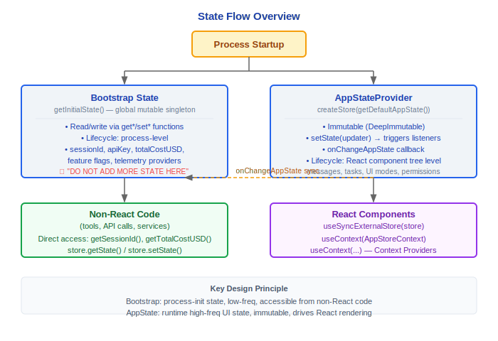

# 状态管理

> Claude Code v2.1.88 的双层状态架构：Bootstrap State（全局单例）与 AppState（Zustand-like Store），以及 React Context 提供者。

---

## 1. Bootstrap State (src/bootstrap/state.ts)

全局单例状态，贯穿整个进程生命周期。模块顶部标注了 **"DO NOT ADD MORE STATE HERE - BE JUDICIOUS WITH GLOBAL STATE"** 的警告。

### 1.1 State 类型 — 完整字段清单

#### 目录与会话

| 字段 | 类型 | 说明 |
|---|---|---|
| `originalCwd` | `string` | 原始工作目录 |
| `projectRoot` | `string` | 稳定的项目根目录（启动时设置，不随 EnterWorktreeTool 变化） |
| `cwd` | `string` | 当前工作目录 |
| `sessionId` | `SessionId` | 当前会话 ID（`randomUUID()`） |
| `parentSessionId` | `SessionId \| undefined` | 父会话 ID（计划模式 → 实现的谱系追踪） |
| `sessionProjectDir` | `string \| null` | 会话 `.jsonl` 文件所在目录 |

#### 成本与使用量

| 字段 | 类型 | 说明 |
|---|---|---|
| `totalCostUSD` | `number` | 累计成本（美元） |
| `totalAPIDuration` | `number` | 累计 API 耗时 |
| `totalAPIDurationWithoutRetries` | `number` | 不含重试的 API 耗时 |
| `totalToolDuration` | `number` | 累计工具执行耗时 |
| `totalLinesAdded` | `number` | 累计新增行数 |
| `totalLinesRemoved` | `number` | 累计删除行数 |
| `hasUnknownModelCost` | `boolean` | 是否存在未知模型的成本 |
| `modelUsage` | `{ [modelName: string]: ModelUsage }` | 按模型分列的使用量 |

#### 性能指标

| 字段 | 类型 | 说明 |
|---|---|---|
| `startTime` | `number` | 进程启动时间 |
| `lastInteractionTime` | `number` | 最后交互时间 |
| `turnHookDurationMs` | `number` | 本轮 Hook 耗时 |
| `turnToolDurationMs` | `number` | 本轮工具耗时 |
| `turnClassifierDurationMs` | `number` | 本轮分类器耗时 |
| `turnToolCount` | `number` | 本轮工具调用次数 |
| `turnHookCount` | `number` | 本轮 Hook 调用次数 |
| `turnClassifierCount` | `number` | 本轮分类器调用次数 |
| `slowOperations` | `Array<{ operation, durationMs, timestamp }>` | 慢操作追踪（dev bar） |

#### 认证与安全

| 字段 | 类型 | 说明 |
|---|---|---|
| `sessionIngressToken` | `string \| null \| undefined` | 会话入口认证令牌 |
| `oauthTokenFromFd` | `string \| null \| undefined` | 从 FD 读取的 OAuth token |
| `apiKeyFromFd` | `string \| null \| undefined` | 从 FD 读取的 API key |
| `sessionBypassPermissionsMode` | `boolean` | 会话级绕过权限模式标志 |
| `sessionTrustAccepted` | `boolean` | 会话级信任标志（家目录场景，不持久化） |

#### 遥测

| 字段 | 类型 | 说明 |
|---|---|---|
| `meter` | `Meter \| null` | OpenTelemetry Meter |
| `sessionCounter` | `AttributedCounter \| null` | 会话计数器 |
| `locCounter` | `AttributedCounter \| null` | 代码行计数器 |
| `prCounter` | `AttributedCounter \| null` | PR 计数器 |
| `commitCounter` | `AttributedCounter \| null` | Commit 计数器 |
| `costCounter` | `AttributedCounter \| null` | 成本计数器 |
| `tokenCounter` | `AttributedCounter \| null` | Token 计数器 |
| `codeEditToolDecisionCounter` | `AttributedCounter \| null` | 编辑工具决策计数器 |
| `activeTimeCounter` | `AttributedCounter \| null` | 活跃时间计数器 |
| `statsStore` | `{ observe(name, value): void } \| null` | 统计存储 |
| `loggerProvider` | `LoggerProvider \| null` | 日志提供者 |
| `eventLogger` | `ReturnType<typeof logs.getLogger> \| null` | 事件日志器 |
| `meterProvider` | `MeterProvider \| null` | Meter 提供者 |
| `tracerProvider` | `BasicTracerProvider \| null` | Tracer 提供者 |
| `promptId` | `string \| null` | 当前 prompt 的 UUID |

#### Hooks

| 字段 | 类型 | 说明 |
|---|---|---|
| `registeredHooks` | `Partial<Record<HookEvent, RegisteredHookMatcher[]>> \| null` | 注册的 hooks |

#### 协调器与 Agent

| 字段 | 类型 | 说明 |
|---|---|---|
| `agentColorMap` | `Map<string, AgentColorName>` | Agent 颜色分配映射 |
| `agentColorIndex` | `number` | 下一个可用颜色索引 |
| `mainThreadAgentType` | `string \| undefined` | 主线程 Agent 类型 |

#### 设置与运行时

| 字段 | 类型 | 说明 |
|---|---|---|
| `mainLoopModelOverride` | `ModelSetting \| undefined` | 主循环模型覆盖 |
| `initialMainLoopModel` | `ModelSetting` | 初始主循环模型 |
| `modelStrings` | `ModelStrings \| null` | 模型显示字符串 |
| `isInteractive` | `boolean` | 是否交互模式 |
| `kairosActive` | `boolean` | Kairos 助手模式是否激活 |
| `strictToolResultPairing` | `boolean` | 严格工具结果配对（HFI 模式） |
| `userMsgOptIn` | `boolean` | 用户消息 opt-in |
| `clientType` | `string` | 客户端类型 |
| `sessionSource` | `string \| undefined` | 会话来源 |
| `flagSettingsPath` | `string \| undefined` | --settings 标志路径 |
| `flagSettingsInline` | `Record<string, unknown> \| null` | 内联设置 |
| `allowedSettingSources` | `SettingSource[]` | 允许的设置源列表 |

#### Beta 特性与缓存

| 字段 | 类型 | 说明 |
|---|---|---|
| `sdkBetas` | `string[] \| undefined` | SDK 提供的 betas |
| `promptCache1hAllowlist` | `string[] \| null` | 1h 缓存 TTL 白名单 |
| `promptCache1hEligible` | `boolean \| null` | 1h 缓存资格（会话稳定，首次评估后锁定） |
| `afkModeHeaderLatched` | `boolean \| null` | AFK 模式 header 锁定标志 |
| `fastModeHeaderLatched` | `boolean \| null` | 快速模式 header 锁定标志 |
| `cacheEditingHeaderLatched` | `boolean \| null` | 缓存编辑 header 锁定标志 |
| `thinkingClearLatched` | `boolean \| null` | thinking 清除锁定标志 |
| `pendingPostCompaction` | `boolean` | 压缩后标志（标记首次 post-compaction API 调用） |
| `lastApiCompletionTimestamp` | `number \| null` | 最后 API 完成时间 |
| `lastMainRequestId` | `string \| undefined` | 最后主请求 ID |

#### Skills 与 Memories

| 字段 | 类型 | 说明 |
|---|---|---|
| `invokedSkills` | `Map<string, { skillName, skillPath, content, invokedAt, agentId }>` | 已调用技能追踪 |
| `teleportedSessionInfo` | `{ isTeleported, hasLoggedFirstMessage, sessionId } \| null` | 传送会话信息 |
| `planSlugCache` | `Map<string, string>` | 计划 slug 缓存 |

#### 权限与会话

| 字段 | 类型 | 说明 |
|---|---|---|
| `hasExitedPlanMode` | `boolean` | 是否已退出计划模式 |
| `needsPlanModeExitAttachment` | `boolean` | 计划模式退出附件标志 |
| `needsAutoModeExitAttachment` | `boolean` | 自动模式退出附件标志 |
| `sessionPersistenceDisabled` | `boolean` | 会话持久化禁用标志 |
| `scheduledTasksEnabled` | `boolean` | 定时任务启用标志 |
| `sessionCronTasks` | `SessionCronTask[]` | 会话级 cron 任务（非持久化） |
| `sessionCreatedTeams` | `Set<string>` | 会话创建的团队（gracefulShutdown 时清理） |

### 设计理念

#### 为什么Bootstrap单例+Zustand双轨？

Bootstrap State 存储进程初始化时确定的、整个生命周期不变或低频变化的状态（`sessionId`、`apiKey`、`totalCostUSD`、feature flags、遥测 provider），AppState（Zustand-like Store）存储运行时高频变化的 UI 状态（消息列表、工具进度、权限模式、spinner 文本）。源码 `state.ts` 顶部明确警告 **"DO NOT ADD MORE STATE HERE - BE JUDICIOUS WITH GLOBAL STATE"**——因为全局可变单例在并发场景下容易出问题。分开的好处是：初始化逻辑（bootstrap）和运行时渲染逻辑（React 组件树）不互相纠缠，非 React 代码（工具执行、API 调用）可以直接读写 Bootstrap State 而无需穿越组件树。

#### 为什么不用Redux？

Zustand 更轻量，不需要 action/reducer 样板代码。源码中 `createStore` 的实现仅约 20 行——直接 `setState(updater)` 加引用相等跳过。对于 40+ 工具并发更新状态的场景，Zustand 的直接 `set()` 比 `dispatch(action) → reducer → newState` 更高效，也更容易在非 React 代码中使用（`store.getState() / store.setState()`）。Redux 的中间件和 devtools 在 CLI 场景中没有价值。

#### 为什么AppState包含这么多字段？

Claude Code 是一个"富客户端"——同时管理对话（messages）、工具执行（tasks）、文件状态、权限（toolPermissionContext）、UI 模式（expandedView, footerSelection）、性能指标（speculation）、远程连接（replBridge*）。这些状态彼此关联（例如权限模式影响工具可用性，任务状态影响 UI 布局），放在同一个 Store 中通过 `DeepImmutable<>` 包装确保不可变性，比拆分成多个独立 Store 更容易保证一致性。

### 1.2 getInitialState()

```typescript
function getInitialState(): State {
  let resolvedCwd = ''
  // 解析符号链接以匹配 shell.ts setCwd 的行为
  const rawCwd = cwd()
  resolvedCwd = realpathSync(rawCwd).normalize('NFC')
  
  return {
    originalCwd: resolvedCwd,
    projectRoot: resolvedCwd,
    totalCostUSD: 0,
    sessionId: randomUUID() as SessionId,
    isInteractive: false,
    clientType: 'cli',
    allowedSettingSources: ['userSettings', 'projectSettings', 'localSettings', 'flagSettings', 'policySettings'],
    // ... 所有字段初始化为零值/null/空集合
  }
}
```

### 1.3 getSessionId() / regenerateSessionId()

```typescript
export function getSessionId(): SessionId {
  return state.sessionId
}

export function regenerateSessionId(): void {
  state.sessionId = randomUUID() as SessionId
}

export function switchSession(newSessionId: SessionId): void {
  state.sessionId = newSessionId
}
```

---

## 2. AppState (src/state/)

React 驱动的 UI 状态，通过自实现的 Zustand-like Store 管理。

### 2.1 Store 实现 (src/state/store.ts)

极简的响应式 Store：

```typescript
type Store<T> = {
  getState: () => T
  setState: (updater: (prev: T) => T) => void
  subscribe: (listener: Listener) => () => void
}

function createStore<T>(initialState: T, onChange?: OnChange<T>): Store<T> {
  let state = initialState
  const listeners = new Set<Listener>()
  return {
    getState: () => state,
    setState: (updater) => {
      const prev = state
      const next = updater(prev)
      if (Object.is(next, prev)) return  // 引用相等则跳过
      state = next
      onChange?.({ newState: next, oldState: prev })
      for (const listener of listeners) listener()
    },
    subscribe: (listener) => {
      listeners.add(listener)
      return () => listeners.delete(listener)
    }
  }
}
```

### 2.2 AppStateStore 形状 (src/state/AppStateStore.ts)

`AppState` 通过 `DeepImmutable<>` 包装确保不可变性。核心字段分组：

#### UI 状态

```typescript
{
  verbose: boolean
  statusLineText: string | undefined
  expandedView: 'none' | 'tasks' | 'teammates'
  isBriefOnly: boolean
  showTeammateMessagePreview?: boolean    // ENABLE_AGENT_SWARMS 门控
  selectedIPAgentIndex: number
  coordinatorTaskIndex: number
  viewSelectionMode: 'none' | 'selecting-agent' | 'viewing-agent'
  footerSelection: FooterItem | null      // 'tasks' | 'tmux' | 'bagel' | 'teams' | 'bridge' | 'companion'
  spinnerTip?: string
  agent: string | undefined
  kairosEnabled: boolean
}
```

#### 模型与权限

```typescript
{
  settings: SettingsJson
  mainLoopModel: ModelSetting
  mainLoopModelForSession: ModelSetting
  toolPermissionContext: ToolPermissionContext
}
```

#### 任务

```typescript
{
  tasks: Map<string, TaskState>
}
```

#### 消息与历史

```typescript
{
  messages: Message[]
  // ...（消息相关字段由查询引擎管理）
}
```

#### 配置

```typescript
{
  settings: SettingsJson
  replBridgeEnabled: boolean
  replBridgeExplicit: boolean
  replBridgeOutboundOnly: boolean
  replBridgeConnected: boolean
  replBridgeSessionActive: boolean
  replBridgeReconnecting: boolean
  replBridgeConnectUrl: string | undefined
  replBridgeSessionUrl: string | undefined
  replBridgeEnvironmentId: string | undefined
}
```

#### Agent / Teammate

```typescript
{
  remoteSessionUrl: string | undefined
  remoteConnectionStatus: 'connecting' | 'connected' | 'reconnecting' | 'disconnected'
  remoteBackgroundTaskCount: number
}
```

#### 推测执行

```typescript
type SpeculationState =
  | { status: 'idle' }
  | {
      status: 'active'
      id: string
      abort: () => void
      startTime: number
      messagesRef: { current: Message[] }
      writtenPathsRef: { current: Set<string> }
      boundary: CompletionBoundary | null
      suggestionLength: number
      toolUseCount: number
      isPipelined: boolean
      contextRef: { current: REPLHookContext }
      pipelinedSuggestion?: { text, promptId, generationRequestId } | null
    }
```

### 2.3 AppStateProvider (src/state/AppState.tsx)

React Context Provider，防止嵌套：

```typescript
export function AppStateProvider({ children, initialState, onChangeAppState }) {
  const hasAppStateContext = useContext(HasAppStateContext)
  if (hasAppStateContext) {
    throw new Error("AppStateProvider can not be nested within another AppStateProvider")
  }
  const [store] = useState(() => createStore(initialState ?? getDefaultAppState(), onChangeAppState))
  // ...
}

export const AppStoreContext = React.createContext<AppStateStore | null>(null)
```

### 2.4 onChangeAppState 回调

`src/state/onChangeAppState.ts` — 注册 AppState 变更时的回调，用于：

- 将状态变更同步到 Bootstrap State
- 触发副作用（如设置变更通知）
- 状态持久化

### 2.5 Selectors

`src/state/selectors.ts` — 选择器函数，从 AppState 中提取派生数据，避免不必要的重渲染。

---

## 3. React Context 提供者 (src/context/)

### 核心 Context 列表

| Context | 文件 | 说明 |
|---|---|---|
| **NotificationsContext** | notifications.tsx | 通知管理（Agent 完成、错误等） |
| **StatsContext** | stats.tsx | 统计数据（StatsStore：observe/name/value） |
| **ModalContext** | modalContext.tsx | 模态对话框管理（打开/关闭/堆叠） |
| **OverlayContext** | overlayContext.tsx | 覆盖层管理（全屏覆盖） |
| **PromptOverlayContext** | promptOverlayContext.tsx | 输入区域覆盖层 |
| **QueuedMessageContext** | QueuedMessageContext.tsx | 排队消息管理 |
| **VoiceContext** | voice.tsx | 语音输入/输出（ant-only，`feature('VOICE_MODE')` 门控） |
| **MailboxContext** | mailbox.tsx | 队友邮箱（消息收发） |
| **FpsMetricsContext** | fpsMetrics.tsx | 帧率指标 |

### VoiceProvider 条件加载

```typescript
const VoiceProvider = feature('VOICE_MODE')
  ? require('../context/voice.js').VoiceProvider
  : ({ children }) => children  // 外部构建使用透传
```

### Notification 类型

```typescript
type Notification = {
  // Agent 完成通知、错误通知、系统通知等
  // 排入队列后在 REPL 消息流中显示
}
```

### StatsStore

```typescript
type StatsStore = {
  observe(name: string, value: number): void
}
```

通过 `createStatsStore()` 创建，`setStatsStore()` 注入 Bootstrap State。在 `interactiveHelpers.tsx` 中初始化。

---

## 4. 状态流转全景



---

## 工程实践指南

### 添加新的 AppState 字段

**步骤清单：**

1. **在 AppState 类型中添加字段**：编辑 `src/state/AppStateStore.ts`，在 AppState 类型定义中添加新字段（使用 `DeepImmutable<>` 包装确保不可变性）
2. **在 getDefaultAppState 中初始化**：提供合理的默认值（零值/null/空集合）
3. **在相关 hook 中使用**：
   ```typescript
   // 读取
   const myField = useAppState(s => s.myField)
   // 更新（通过 setState 函数式更新）
   store.setState(prev => ({ ...prev, myField: newValue }))
   ```
4. **添加 selector**（可选）：在 `src/state/selectors.ts` 中添加选择器函数，提取派生数据，避免不必要的重渲染
5. **同步到 Bootstrap State**（如需要）：在 `onChangeAppState.ts` 中注册回调

### 调试状态问题

1. **检查 Zustand store 的当前值**：在非 React 代码中通过 `store.getState()` 查看当前 AppState
2. **注意 Bootstrap State vs AppState 的区别**：
   | 维度 | Bootstrap State | AppState |
   |------|----------------|----------|
   | 实现 | 全局可变单例 | Zustand-like Store + DeepImmutable |
   | 生命周期 | 进程级 | React 组件树级 |
   | 变更频率 | 低频/初始化时 | 高频（消息、工具进度、权限等） |
   | 访问方式 | `getXxx()` / `setXxx()` 函数 | `store.getState()` / `store.setState()` |
   | 在非 React 代码中 | 直接访问 | 通过 store 实例访问 |
3. **检查 listeners 是否正确触发**：`store.setState()` 使用 `Object.is()` 引用相等检查——如果返回同一个引用，listeners 不会触发
4. **检查 onChangeAppState 副作用**：`onChangeAppState.ts` 注册的回调在每次 AppState 变更时执行，如果回调中有错误会影响状态同步

### 状态更新的最佳实践

1. **使用函数式更新**：
   ```typescript
   // 正确：函数式更新，基于最新 prev state
   store.setState(prev => ({ ...prev, counter: prev.counter + 1 }))
   
   // 错误：直接传值可能覆盖并发更新
   const current = store.getState()
   store.setState(_ => ({ ...current, counter: current.counter + 1 }))
   ```

2. **使用 Selector 避免不必要重渲染**：
   ```typescript
   // 正确：只订阅需要的字段
   const messages = useAppState(s => s.messages)
   
   // 不推荐：订阅整个 state，任何字段变化都会触发重渲染
   const state = useAppState(s => s)
   ```

3. **非 React 代码中的状态访问**：
   - Bootstrap State：直接使用导出函数（`getSessionId()`、`getTotalCostUSD()` 等）
   - AppState：通过 `store.getState()` 读取，`store.setState()` 更新

### Bootstrap State 字段分类

Bootstrap State 字段按用途分为以下几类（添加新状态时先确认是否属于 Bootstrap 范畴）：

| 分类 | 示例字段 | 特点 |
|------|---------|------|
| 目录与会话 | `sessionId`, `cwd`, `projectRoot` | 进程启动时确定 |
| 成本与使用量 | `totalCostUSD`, `modelUsage` | 全生命周期累积 |
| 认证与安全 | `sessionIngressToken`, `oauthTokenFromFd` | 初始化后低频变化 |
| 遥测 | `meter`, `statsStore`, `eventLogger` | provider 实例 |
| 设置与运行时 | `mainLoopModelOverride`, `isInteractive` | 配置级别 |

**判断标准**：如果状态在进程初始化后很少变化，且需要在非 React 代码中访问，放入 Bootstrap State；如果状态高频变化且主要驱动 UI 渲染，放入 AppState。

### 常见陷阱

> **不要直接修改 state 对象——必须通过 set 函数**
> AppState 通过 `DeepImmutable<>` 包装确保不可变性。直接修改 state 对象（如 `state.messages.push(msg)`）不会触发 listeners，也违反了不可变性契约。始终使用 `store.setState(prev => ...)` 创建新对象。

> **Bootstrap State 初始化后应谨慎修改**
> 源码 `state.ts` 顶部明确警告 **"DO NOT ADD MORE STATE HERE - BE JUDICIOUS WITH GLOBAL STATE"**。全局可变单例在并发场景下容易出问题（多个 agent 同时读写）。仅在确实需要进程级全局状态时才使用 Bootstrap State。

> **AppStateProvider 不能嵌套**
> 源码 `AppState.tsx` 中 `AppStateProvider` 检测嵌套并抛出错误：`"AppStateProvider can not be nested within another AppStateProvider"`。这是刻意的设计——确保全局只有一个 AppState store 实例。

> **TODO: DeepImmutable 的替代方案**
> 源码 `AppStateStore.ts:172` 的 TODO 注释提到考虑使用 `utility-types` 的 `DeepReadonly` 替代当前的 `DeepImmutable` 实现——未来可能有类型定义变更。

> **store.subscribe 返回 unsubscribe 函数**
> `store.subscribe(listener)` 返回取消订阅函数。在 React 组件中使用时，务必在 cleanup 阶段调用取消订阅，避免内存泄漏和幽灵更新。


---

[← 配置体系](../13-配置体系/config-system.md) | [目录](../README.md) | [命令体系 →](../15-命令体系/command-system.md)
