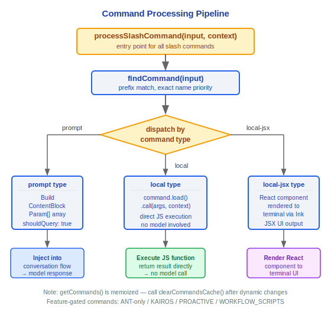

# Command System Architecture Documentation

> Claude Code v2.1.88 Command System Complete Technical Reference

---

## Command Registration (src/commands.ts)

### Command Types

| Type | Description |
|------|------|
| `'prompt'` | Skill command, injects prompt into conversation flow |
| `'local'` | Local command, directly executes JS/TS function |
| `'local-jsx'` | JSX command, renders React component |

### Core Functions

#### getCommands(cwd)
Returns all available commands (memoized), internally filters availability and enabled status.

#### builtInCommandNames()
Returns memoized set of built-in command names.

#### meetsAvailabilityRequirement()
Checks command availability in current environment (claude-ai or console).

#### getSkillToolCommands()
Gets all skill commands callable by the model.

#### getSlashCommandToolSkills()
Gets skill commands with `description` or `whenToUse` fields.

### Design Philosophy

#### Why register 87+ commands instead of hardcoding?

The registration pattern (dynamically collected via `getCommands()`) gives the system extensibility: MCP servers can dynamically add commands, skills can register their own triggers, and plugins can contribute new commands. The source code uses `feature()` gate conditional imports (ANT-only, KAIROS, PROACTIVE, WORKFLOW_SCRIPTS, etc.), so different environments and users see different command sets. Hardcoding means every new command requires modifying core dispatch logic, while the registration pattern only requires declaring command definitions in new modules—separation of concerns.

#### Why separate commands and tools?

Commands are directly input by users (starting with `/`), while tools are selected by the model (via tool_use block). The triggers and trust models are completely different: commands are initiated by users with implicit user intent; tools are selected by the model during reasoning and require permission checks. In the source code, `processSlashCommand()` injects `prompt` type commands into the conversation flow (building `ContentBlockParam[]`, setting `shouldQuery: true`), while `local` type commands directly execute JS functions without going through the model. Separation allows the same underlying capability (like file editing) to have both a user interface (`/edit`) and a model interface (`FileEditTool`), each with appropriate interaction methods.

### Safe Command Sets

#### REMOTE_SAFE_COMMANDS
Set of safe commands allowed in remote mode.

#### BRIDGE_SAFE_COMMANDS
Set of safe commands allowed in Bridge mode.

### Feature-gated Conditional Imports
Some commands are conditionally imported via feature flags:
- **ANT-only**: Only available internally at Anthropic
- **KAIROS**: Kairos feature related
- **PROACTIVE**: Proactive features
- **WORKFLOW_SCRIPTS**: Workflow scripts

---

## Complete List of 87+ Commands

### Workflow Commands
| Command | Purpose |
|------|------|
| `/plan` | Create/manage execution plans |
| `/commit` | Generate Git commits |
| `/diff` | View differences |
| `/review` | Code review |
| `/branch` | Branch management |
| `/rewind` | Revert operations |
| `/session` | Session management |

### Information/Analysis Commands
| Command | Purpose |
|------|------|
| `/help` | Help information |
| `/context` | Context information |
| `/stats` | Statistics |
| `/cost` | Cost information |
| `/summary` | Session summary |
| `/memory` | Memory management |
| `/brief` | Brief mode |

### Configuration Commands
| Command | Purpose |
|------|------|
| `/config` | Configuration management |
| `/permissions` | Permission settings |
| `/keybindings` | Key bindings |
| `/theme` | Theme settings |
| `/model` | Model selection |
| `/effort` | Reasoning effort level |
| `/privacy-settings` | Privacy settings |
| `/output-style` | Output style |

### Tool Management Commands
| Command | Purpose |
|------|------|
| `/mcp` | MCP server management |
| `/skills` | Skills management |
| `/plugin` | Plugin management |
| `/reload-plugins` | Reload plugins |

### Development Commands
| Command | Purpose |
|------|------|
| `/init` | Project initialization |
| `/doctor` | Diagnostic tool |
| `/debug-tool-call` | Debug tool calls |
| `/teleport` | Teleport |
| `/files` | File management |
| `/hooks` | Hook management |

### IDE/Environment Commands
| Command | Purpose |
|------|------|
| `/ide` | IDE integration |
| `/mobile` | Mobile |
| `/chrome` | Chrome integration |
| `/desktop` | Desktop application |
| `/remote-setup` | Remote setup |
| `/terminalSetup` | Terminal setup |

### Experimental Commands (Feature-gated)
| Command | Feature Flag | Purpose |
|------|---------|------|
| `/bridge` | BRIDGE_MODE | Bridge mode |
| `/voice` | VOICE_MODE | Voice mode |
| `/workflows` | WORKFLOW_SCRIPTS | Workflow scripts |
| `/ultraplan` | ULTRAPLAN | Ultra planning |
| `/assistant` | KAIROS | Assistant features |
| `/fork` | FORK_SUBAGENT | Fork sub-agent |
| `/agents` | - | Multi-agent management |
| `/proactive` | PROACTIVE | Proactive features |

### Other Commands
| Command | Purpose |
|------|------|
| `/clear` | Clear screen |
| `/compact` | Compact context |
| `/color` | Color settings |
| `/copy` | Copy content |
| `/export` | Export session |
| `/fast` | Fast mode |
| `/feedback` | Feedback |
| `/good-claude` | Positive feedback |
| `/login` | Login |
| `/logout` | Logout |
| `/rename` | Rename session |
| `/resume` | Resume session |
| `/sandbox-toggle` | Sandbox toggle |
| `/share` | Share |
| `/stickers` | Stickers |
| `/tag` | Tag management |
| `/tasks` | Task management |
| `/upgrade` | Upgrade |
| `/usage` | Usage view |
| `/vim` | Vim mode |
| `/env` | Environment variables |
| `/extra-usage` | Extra usage |
| `/rate-limit-options` | Rate limit options |
| `/release-notes` | Release notes |
| `/status` | Status information |
| `/add-dir` | Add directory |

---

## Command Processing Flow

### processSlashCommand()



### Command Lookup
`findCommand()` supports prefix matching, with exact name matching taking priority when command names conflict.

### Skill Command Processing
Skill type (`prompt`) commands inject built content blocks as user messages into the conversation, and set `shouldQuery=true` to trigger model response generation.

### Local Command Processing
Local type (`local` / `local-jsx`) commands are loaded via dynamic import (`command.load()`) and called directly without going through the model.

---

## Engineering Practice Guide

### Adding New Slash Commands

**Step Checklist:**

1. **Create directory under `src/commands/`**:
   ```
   src/commands/my-command/
   ├── index.ts        // Command registration entry
   └── my-command.ts   // Command implementation (optional separate file)
   ```

2. **Implement command definition** (`index.ts`):
   ```typescript
   import type { Command } from '../types.js'

   const command: Command = {
     name: 'my-command',
     type: 'local',           // 'prompt' | 'local' | 'local-jsx'
     description: 'My command description',
     aliases: ['mc'],          // Optional aliases
     isEnabled: () => true,    // Dynamic enable condition
     isHidden: false,          // Whether hidden from help
     load: () => import('./my-command.js'),
   }

   export default command
   ```

3. **Implement command logic** (`my-command.ts`):
   ```typescript
   export async function call(args: string, context: CommandContext) {
     // Command execution logic
     // local type: execute directly, without going through model
     // prompt type: return ContentBlockParam[] to inject into conversation
   }
   ```

4. **Register in commands.ts**: Add the new command to the command import list in `src/commands.ts`. For feature-gated commands, use conditional imports:
   ```typescript
   if (feature('MY_FEATURE')) {
     commands.push(require('./commands/my-command/index.js').default)
   }
   ```

### Command Type Selection

| Type | Use Case | Execution Method |
|------|---------|---------|
| `prompt` | Tasks requiring model participation (skills, code generation) | Build `ContentBlockParam[]` injected into conversation, `shouldQuery: true` triggers model response |
| `local` | Pure JS/TS logic (config changes, status viewing) | `command.load().call(args, context)` direct execution |
| `local-jsx` | Operations requiring UI rendering (dialogs, settings interfaces) | React component rendered to terminal |

### Relationship Between Commands and Tools

The same underlying capability can provide two entry points simultaneously:


- **Commands** are the user interface (starting with `/`), implying user intent
- **Tools** are the model interface (via tool_use block), requiring permission checks
- Separation allows the same feature to have interaction methods suitable for different trigger actors

### Debugging Invisible Commands

If a command is not visible in `/` autocomplete, investigate in this order:

1. **Check `isEnabled()` return value**: Many commands dynamically control availability via `isEnabled()`. For example:
   - `bridge` command requires `feature('BRIDGE_MODE')` to be enabled (`commands/bridge/index.ts:5-6`)
   - `chrome` command requires non-headless mode (`commands/chrome/index.ts:8`)
   - `compact` command requires `DISABLE_COMPACT` environment variable to be unset (`commands/compact/index.ts:9`)
   - `doctor` command requires `DISABLE_DOCTOR_COMMAND` to be unset (`commands/doctor/index.ts:7`)
2. **Check feature gate**: Some commands are conditionally imported via `feature()` gate—if the corresponding feature flag is not enabled, the command will not be registered
3. **Check `isHidden` flag**: Commands with `isHidden: true` are not shown in the help list, but can still be typed directly
4. **Check availability requirements**: `meetsAvailabilityRequirement()` filters commands based on environment (claude-ai or console)
5. **Check safe command sets**: Only `REMOTE_SAFE_COMMANDS` are allowed in remote mode, only `BRIDGE_SAFE_COMMANDS` in Bridge mode

### Command Lookup Mechanism

`findCommand()` supports prefix matching:
- Typing `/co` may match `/commit`, `/compact`, `/config`, `/copy`, etc.
- Exact name match takes priority
- Behavior on conflict depends on specific implementation—recommend using a long enough prefix to avoid ambiguity

### Common Pitfalls

> **Do not let command names conflict with built-in commands**
> `builtInCommandNames()` returns the set of all built-in command names. If a custom command name duplicates a built-in command, it will cause unpredictable behavior. Use `/skills` or `/help` to view existing command names.

> **Command execute can be async but should not block for a long time**
> The `call()` function of `local` type commands can be async, but it executes on the main thread. Long blocking will freeze the UI and query loop. If you need to perform time-consuming operations, consider:
> - Using `prompt` type to let the model handle it in the query loop
> - Launching background tasks (`AgentTool` + `run_in_background`)
> - Using progress indicators (`spinnerTip`) to provide visual feedback

> **The role of stub commands**
> Multiple command directories in the source code contain `index.js` exporting `{ isEnabled: () => false, isHidden: true, name: 'stub' }` (such as `autofix-pr`, `ant-trace`, `bughunter`, etc.). These are placeholders—they keep module references valid but have functionality disabled. They may be stand-ins for ANT-only features in public builds.

> **MCP command hack**
> The TODO comment at `commands/mcp/mcp.tsx:10` in the source code acknowledges: the way to get context values from `toggleMcpServer` is a hack (because `useContext` is only available in components). Be aware of this technical debt when modifying MCP command logic.

> **getCommands() is memoized**
> `getCommands(cwd)` returns a cached command list. If new commands are dynamically added (such as MCP skills or plugins), the cache needs to be cleared (`clearCommandsCache()`, `clearCommandMemoizationCaches()`) to see the new commands.


---

[← State Management](../14-状态管理/state-management-en.md) | [Index](../README_EN.md) | [Memory System →](../16-记忆系统/memory-system-en.md)
