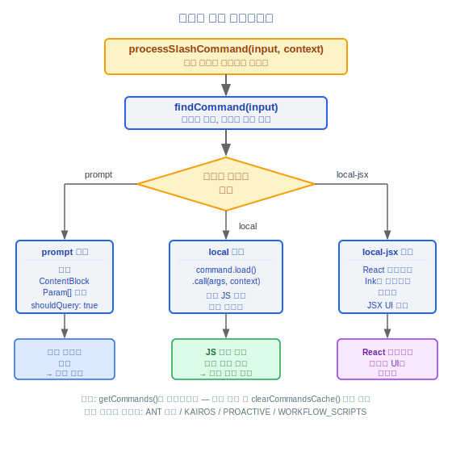
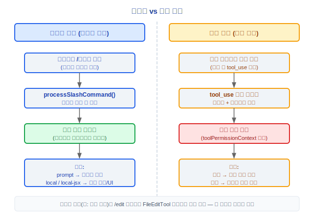

# 명령(Command) 시스템 아키텍처 문서

> Claude Code v2.1.88 명령(Command) 시스템 완전 기술 참조서

---

## 명령 등록 (src/commands.ts)

### 명령 타입

| 타입 | 설명 |
|------|------|
| `'prompt'` | 스킬(Skills) 명령, 대화 흐름에 프롬프트를 주입함 |
| `'local'` | 로컬 명령, JS/TS 함수를 직접 실행함 |
| `'local-jsx'` | JSX 명령, React 컴포넌트를 렌더링함 |

### 핵심 함수

#### getCommands(cwd)
사용 가능한 모든 명령을 반환합니다(메모이제이션), 내부적으로 가용성과 활성화 상태를 필터링합니다.

#### builtInCommandNames()
내장 명령 이름의 메모이제이션된 집합을 반환합니다.

#### meetsAvailabilityRequirement()
현재 환경(claude-ai 또는 console)에서의 명령 가용성을 확인합니다.

#### getSkillToolCommands()
모델이 호출할 수 있는 모든 스킬(Skills) 명령을 가져옵니다.

#### getSlashCommandToolSkills()
`description` 또는 `whenToUse` 필드가 있는 스킬(Skills) 명령을 가져옵니다.

### 설계 철학

#### 왜 하드코딩 대신 87개 이상의 명령을 등록하는가?

등록 패턴(`getCommands()`를 통해 동적으로 수집)은 시스템에 확장성을 부여합니다: MCP(Model Context Protocol) 서버는 동적으로 명령을 추가할 수 있고, 스킬(Skills)은 자체 트리거를 등록할 수 있으며, 플러그인(Plugin)은 새 명령을 기여할 수 있습니다. 소스 코드는 `feature()` 게이트 조건부 임포트(ANT 전용, KAIROS, PROACTIVE, WORKFLOW_SCRIPTS 등)를 사용하므로 다른 환경과 사용자는 다른 명령 세트를 봅니다. 하드코딩은 새 명령마다 핵심 디스패치 로직을 수정해야 하지만, 등록 패턴은 새 모듈에서 명령 정의만 선언하면 됩니다 — 관심사 분리입니다.

#### 왜 명령과 도구를 분리하는가?

명령은 사용자가 직접 입력하는 것(`/`으로 시작)이고, 도구는 모델이 선택하는 것(tool_use 블록을 통해)입니다. 트리거와 신뢰 모델이 완전히 다릅니다: 명령은 암묵적인 사용자 의도로 사용자가 시작하고, 도구는 추론 중 모델이 선택하여 권한 확인이 필요합니다. 소스 코드에서 `processSlashCommand()`는 `prompt` 타입 명령을 대화 흐름에 주입하고(`ContentBlockParam[]`을 빌드하고 `shouldQuery: true`로 설정), `local` 타입 명령은 모델을 거치지 않고 JS 함수를 직접 실행합니다. 분리를 통해 동일한 기본 기능(파일 편집 등)이 사용자 인터페이스(`/edit`)와 모델 인터페이스(`FileEditTool`) 모두를 가질 수 있으며, 각각 적절한 상호작용 방법을 가집니다.

### 안전한 명령 집합

#### REMOTE_SAFE_COMMANDS
원격 모드에서 허용되는 안전한 명령 집합입니다.

#### BRIDGE_SAFE_COMMANDS
Bridge 모드에서 허용되는 안전한 명령 집합입니다.

### 기능 게이팅된 조건부 임포트
일부 명령은 기능 플래그를 통해 조건부로 임포트됩니다:
- **ANT 전용**: Anthropic 내부에서만 사용 가능
- **KAIROS**: Kairos 기능 관련
- **PROACTIVE**: 프로액티브 기능
- **WORKFLOW_SCRIPTS**: 워크플로우 스크립트

---

## 87개 이상 명령의 완전한 목록

### 워크플로우 명령
| 명령 | 목적 |
|------|------|
| `/plan` | 실행 계획 생성/관리 |
| `/commit` | Git 커밋 생성 |
| `/diff` | 차이점 보기 |
| `/review` | 코드 리뷰 |
| `/branch` | 브랜치 관리 |
| `/rewind` | 작업 되돌리기 |
| `/session` | 세션 관리 |

### 정보/분석 명령
| 명령 | 목적 |
|------|------|
| `/help` | 도움말 정보 |
| `/context` | 컨텍스트 정보 |
| `/stats` | 통계 |
| `/cost` | 비용 정보 |
| `/summary` | 세션 요약 |
| `/memory` | 메모리 시스템(Memory System) 관리 |
| `/brief` | 간략 모드 |

### 설정(Config) 명령
| 명령 | 목적 |
|------|------|
| `/config` | 설정(Config) 관리 |
| `/permissions` | 권한 설정 |
| `/keybindings` | 키 바인딩 |
| `/theme` | 테마 설정 |
| `/model` | 모델 선택 |
| `/effort` | 추론 노력 수준 |
| `/privacy-settings` | 개인 정보 설정 |
| `/output-style` | 출력 스타일 |

### 도구 관리 명령
| 명령 | 목적 |
|------|------|
| `/mcp` | MCP(Model Context Protocol) 서버 관리 |
| `/skills` | 스킬(Skills) 관리 |
| `/plugin` | 플러그인(Plugin) 관리 |
| `/reload-plugins` | 플러그인(Plugin) 다시 로드 |

### 개발 명령
| 명령 | 목적 |
|------|------|
| `/init` | 프로젝트 초기화 |
| `/doctor` | 진단 도구 |
| `/debug-tool-call` | 도구 호출 디버그 |
| `/teleport` | 텔레포트 |
| `/files` | 파일 관리 |
| `/hooks` | 훅(Hooks) 관리 |

### IDE/환경 명령
| 명령 | 목적 |
|------|------|
| `/ide` | IDE 통합 |
| `/mobile` | 모바일 |
| `/chrome` | Chrome 통합 |
| `/desktop` | 데스크톱 애플리케이션 |
| `/remote-setup` | 원격 설정 |
| `/terminalSetup` | 터미널 설정 |

### 실험적 명령 (기능 게이팅됨)
| 명령 | 기능 플래그 | 목적 |
|------|---------|------|
| `/bridge` | BRIDGE_MODE | Bridge 모드 |
| `/voice` | VOICE_MODE | 음성 모드 |
| `/workflows` | WORKFLOW_SCRIPTS | 워크플로우 스크립트 |
| `/ultraplan` | ULTRAPLAN | 울트라 플래닝 |
| `/assistant` | KAIROS | 어시스턴트 기능 |
| `/fork` | FORK_SUBAGENT | 포크 서브에이전트 |
| `/agents` | - | 멀티 에이전트 관리 |
| `/proactive` | PROACTIVE | 프로액티브 기능 |

### 기타 명령
| 명령 | 목적 |
|------|------|
| `/clear` | 화면 지우기 |
| `/compact` | 컨텍스트 컴팩트(Compact) |
| `/color` | 색상 설정 |
| `/copy` | 콘텐츠 복사 |
| `/export` | 세션 내보내기 |
| `/fast` | 빠른 모드 |
| `/feedback` | 피드백 |
| `/good-claude` | 긍정적 피드백 |
| `/login` | 로그인 |
| `/logout` | 로그아웃 |
| `/rename` | 세션 이름 변경 |
| `/resume` | 세션 재개 |
| `/sandbox-toggle` | 샌드박스(Sandbox) 토글 |
| `/share` | 공유 |
| `/stickers` | 스티커 |
| `/tag` | 태그 관리 |
| `/tasks` | 작업 관리 |
| `/upgrade` | 업그레이드 |
| `/usage` | 사용량 보기 |
| `/vim` | Vim 모드 |
| `/env` | 환경 변수 |
| `/extra-usage` | 추가 사용량 |
| `/rate-limit-options` | 속도 제한 옵션 |
| `/release-notes` | 릴리스 노트 |
| `/status` | 상태 정보 |
| `/add-dir` | 디렉터리 추가 |

---

## 명령 처리 흐름

### processSlashCommand()



### 명령 조회
`findCommand()`는 접두사 매칭을 지원하며, 명령 이름이 충돌할 경우 정확한 이름 매칭이 우선순위를 가집니다.

### 스킬(Skills) 명령 처리
스킬(Skills) 타입(`prompt`) 명령은 빌드된 콘텐츠 블록을 사용자 메시지로 대화에 주입하고, `shouldQuery=true`를 설정하여 모델 응답 생성을 트리거합니다.

### 로컬 명령 처리
로컬 타입(`local` / `local-jsx`) 명령은 동적 임포트(`command.load()`)를 통해 로드되고 모델을 거치지 않고 직접 호출됩니다.

---

## 엔지니어링 실천 가이드

### 새 슬래시 명령 추가

**단계 체크리스트:**

1. **`src/commands/` 하위에 디렉터리 생성**:
   ```
   src/commands/my-command/
   ├── index.ts        // 명령 등록 진입점
   └── my-command.ts   // 명령 구현 (선택적 별도 파일)
   ```

2. **명령 정의 구현** (`index.ts`):
   ```typescript
   import type { Command } from '../types.js'

   const command: Command = {
     name: 'my-command',
     type: 'local',           // 'prompt' | 'local' | 'local-jsx'
     description: '내 명령 설명',
     aliases: ['mc'],          // 선택적 별칭
     isEnabled: () => true,    // 동적 활성화 조건
     isHidden: false,          // 도움말에서 숨김 여부
     load: () => import('./my-command.js'),
   }

   export default command
   ```

3. **명령 로직 구현** (`my-command.ts`):
   ```typescript
   export async function call(args: string, context: CommandContext) {
     // 명령 실행 로직
     // local 타입: 직접 실행, 모델을 거치지 않음
     // prompt 타입: 대화에 주입할 ContentBlockParam[]을 반환
   }
   ```

4. **commands.ts에 등록**: `src/commands.ts`의 명령 임포트 목록에 새 명령을 추가합니다. 기능 게이팅된 명령의 경우 조건부 임포트를 사용합니다:
   ```typescript
   if (feature('MY_FEATURE')) {
     commands.push(require('./commands/my-command/index.js').default)
   }
   ```

### 명령 타입 선택

| 타입 | 사용 사례 | 실행 방법 |
|------|---------|---------|
| `prompt` | 모델 참여가 필요한 작업 (스킬(Skills), 코드 생성) | `ContentBlockParam[]`을 빌드하여 대화에 주입, `shouldQuery: true`가 모델 응답을 트리거함 |
| `local` | 순수 JS/TS 로직 (설정(Config) 변경, 상태 조회) | `command.load().call(args, context)` 직접 실행 |
| `local-jsx` | UI 렌더링이 필요한 작업 (다이얼로그, 설정(Config) 인터페이스) | 터미널에 렌더링되는 React 컴포넌트 |

### 명령과 도구의 관계

동일한 기본 기능이 두 가지 진입점을 동시에 제공할 수 있습니다:



- **명령**은 사용자 인터페이스(`/`로 시작), 사용자 의도를 내포함
- **도구**는 모델 인터페이스(tool_use 블록을 통해), 권한 확인이 필요함
- 분리를 통해 동일한 기능이 다른 트리거 주체에 적합한 상호작용 방법을 가질 수 있음

### 보이지 않는 명령 디버깅

명령이 `/` 자동완성에 표시되지 않는 경우, 다음 순서로 조사합니다:

1. **`isEnabled()` 반환값 확인**: 많은 명령이 `isEnabled()`를 통해 가용성을 동적으로 제어합니다. 예를 들어:
   - `bridge` 명령은 `feature('BRIDGE_MODE')` 활성화가 필요합니다 (`commands/bridge/index.ts:5-6`)
   - `chrome` 명령은 비헤드리스 모드가 필요합니다 (`commands/chrome/index.ts:8`)
   - `compact` 명령은 `DISABLE_COMPACT` 환경 변수가 설정되지 않아야 합니다 (`commands/compact/index.ts:9`)
   - `doctor` 명령은 `DISABLE_DOCTOR_COMMAND`가 설정되지 않아야 합니다 (`commands/doctor/index.ts:7`)
2. **기능 게이트 확인**: 일부 명령은 `feature()` 게이트를 통해 조건부로 임포트됩니다 — 해당 기능 플래그가 활성화되지 않으면 명령이 등록되지 않습니다
3. **`isHidden` 플래그 확인**: `isHidden: true`인 명령은 도움말 목록에 표시되지 않지만 직접 입력은 여전히 가능합니다
4. **가용성 요구사항 확인**: `meetsAvailabilityRequirement()`는 환경(claude-ai 또는 console)에 따라 명령을 필터링합니다
5. **안전한 명령 집합 확인**: 원격 모드에서는 `REMOTE_SAFE_COMMANDS`만 허용되고, Bridge 모드에서는 `BRIDGE_SAFE_COMMANDS`만 허용됩니다

### 명령 조회 메커니즘

`findCommand()`는 접두사 매칭을 지원합니다:
- `/co` 입력은 `/commit`, `/compact`, `/config`, `/copy` 등과 매칭될 수 있습니다
- 정확한 이름 매칭이 우선순위를 가집니다
- 충돌 시 동작은 구체적인 구현에 따라 다릅니다 — 모호함을 피하기 위해 충분히 긴 접두사를 사용하는 것을 권장합니다

### 일반적인 함정

> **명령 이름이 내장 명령과 충돌하지 않도록 하십시오**
> `builtInCommandNames()`는 모든 내장 명령 이름의 집합을 반환합니다. 커스텀 명령 이름이 내장 명령과 중복되면 예측할 수 없는 동작을 일으킵니다. `/skills` 또는 `/help`를 사용하여 기존 명령 이름을 확인하십시오.

> **명령 실행은 비동기일 수 있지만 오랜 시간 동안 블로킹해서는 안 됩니다**
> `local` 타입 명령의 `call()` 함수는 비동기일 수 있지만 메인 스레드에서 실행됩니다. 긴 블로킹은 UI와 쿼리 루프를 멈춥니다. 시간이 많이 걸리는 작업이 필요한 경우 다음을 고려하십시오:
> - `prompt` 타입을 사용하여 모델이 쿼리 루프에서 처리하도록 함
> - 백그라운드 작업 시작 (`AgentTool` + `run_in_background`)
> - 진행 표시기(`spinnerTip`)를 사용하여 시각적 피드백 제공

> **스텁(stub) 명령의 역할**
> 소스 코드의 여러 명령 디렉터리에는 `{ isEnabled: () => false, isHidden: true, name: 'stub' }`를 내보내는 `index.js`가 포함되어 있습니다(`autofix-pr`, `ant-trace`, `bughunter` 등). 이것들은 플레이스홀더입니다 — 모듈 참조는 유효하지만 기능이 비활성화되어 있습니다. 공개 빌드에서 ANT 전용 기능의 대리자일 수 있습니다.

> **MCP(Model Context Protocol) 명령 핵(hack)**
> 소스 코드의 `commands/mcp/mcp.tsx:10`에 있는 TODO 주석은 다음을 인정합니다: `toggleMcpServer`에서 컨텍스트 값을 가져오는 방법은 핵입니다(`useContext`는 컴포넌트에서만 사용 가능하기 때문에). MCP(Model Context Protocol) 명령 로직을 수정할 때 이 기술적 부채에 유의하십시오.

> **getCommands()는 메모이제이션됩니다**
> `getCommands(cwd)`는 캐시된 명령 목록을 반환합니다. 새 명령이 동적으로 추가되는 경우(MCP(Model Context Protocol) 스킬(Skills) 또는 플러그인(Plugin)처럼), 캐시를 지워야(`clearCommandsCache()`, `clearCommandMemoizationCaches()`) 새 명령을 볼 수 있습니다.


---

[← 상태 관리(State Management)](../14-状态管理/state-management-ko.md) | [인덱스](../README_KO.md) | [메모리 시스템(Memory System) →](../16-记忆系统/memory-system-ko.md)
