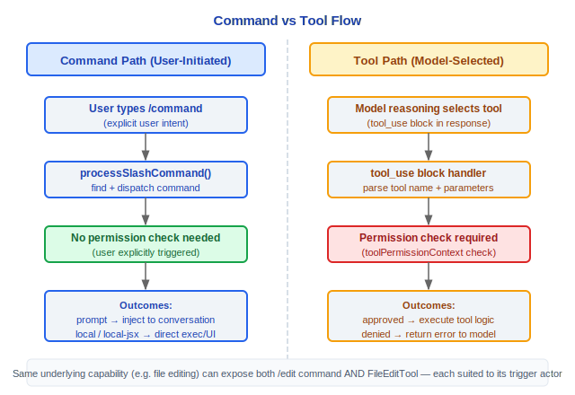

# 命令体系架构文档

> Claude Code v2.1.88 命令系统完整技术参考

---

## 命令注册 (src/commands.ts)

### 命令类型

| 类型 | 说明 |
|------|------|
| `'prompt'` | 技能命令，注入提示到对话流 |
| `'local'` | 本地命令，直接执行 JS/TS 函数 |
| `'local-jsx'` | JSX 命令，渲染 React 组件 |

### 核心函数

#### getCommands(cwd)
返回所有可用命令（memoized），内部过滤可用性和启用状态。

#### builtInCommandNames()
返回 memoized 的内置命令名集合。

#### meetsAvailabilityRequirement()
检查命令在当前环境（claude-ai 或 console）的可用性。

#### getSkillToolCommands()
获取所有模型可调用的技能命令。

#### getSlashCommandToolSkills()
获取有 `description` 或 `whenToUse` 字段的技能命令。

### 设计理念

#### 为什么87+个命令要注册而不是硬编码？

注册模式（通过 `getCommands()` 动态收集）让系统具备可扩展性：MCP 服务器可以动态添加命令，技能（skill）可以注册自己的触发器，插件可以贡献新命令。源码中通过 `feature()` 门控条件导入（ANT-only、KAIROS、PROACTIVE、WORKFLOW_SCRIPTS 等），不同环境和用户看到的命令集不同。硬编码意味着每次新增命令都要修改核心分发逻辑，而注册模式只需要在新模块中声明命令定义即可——关注点分离。

#### 为什么命令和工具分离？

命令是用户直接输入的（以 `/` 开头），工具是模型选择调用的（通过 tool_use block）。两者的触发者和信任模型完全不同：命令由用户主动发起，隐含用户意图；工具由模型在推理过程中选择，需要权限检查。源码中 `processSlashCommand()` 将 `prompt` 类型命令注入对话流（构建 `ContentBlockParam[]`，设置 `shouldQuery: true`），而 `local` 类型命令直接执行 JS 函数不经过模型。分离让同一底层能力（如文件编辑）可以同时有用户界面（`/edit`）和模型界面（`FileEditTool`），各自有适合的交互方式。

### 安全命令集

#### REMOTE_SAFE_COMMANDS
远程模式下允许执行的安全命令集合。

#### BRIDGE_SAFE_COMMANDS
Bridge 模式下允许执行的安全命令集合。

### Feature-gated 条件导入
部分命令通过功能开关条件导入：
- **ANT-only**: 仅 Anthropic 内部可用
- **KAIROS**: Kairos 功能相关
- **PROACTIVE**: 主动式功能
- **WORKFLOW_SCRIPTS**: 工作流脚本

---

## 87+ 命令完整清单

### 工作流命令
| 命令 | 用途 |
|------|------|
| `/plan` | 创建/管理执行计划 |
| `/commit` | 生成 Git 提交 |
| `/diff` | 查看差异 |
| `/review` | 代码审查 |
| `/branch` | 分支管理 |
| `/rewind` | 回退操作 |
| `/session` | 会话管理 |

### 信息/分析命令
| 命令 | 用途 |
|------|------|
| `/help` | 帮助信息 |
| `/context` | 上下文信息 |
| `/stats` | 统计信息 |
| `/cost` | 费用信息 |
| `/summary` | 会话摘要 |
| `/memory` | 记忆管理 |
| `/brief` | 简要模式 |

### 配置命令
| 命令 | 用途 |
|------|------|
| `/config` | 配置管理 |
| `/permissions` | 权限设置 |
| `/keybindings` | 键绑定 |
| `/theme` | 主题设置 |
| `/model` | 模型选择 |
| `/effort` | 推理努力级别 |
| `/privacy-settings` | 隐私设置 |
| `/output-style` | 输出风格 |

### 工具管理命令
| 命令 | 用途 |
|------|------|
| `/mcp` | MCP 服务器管理 |
| `/skills` | 技能管理 |
| `/plugin` | 插件管理 |
| `/reload-plugins` | 重载插件 |

### 开发命令
| 命令 | 用途 |
|------|------|
| `/init` | 项目初始化 |
| `/doctor` | 诊断工具 |
| `/debug-tool-call` | 调试工具调用 |
| `/teleport` | Teleport 传送 |
| `/files` | 文件管理 |
| `/hooks` | 钩子管理 |

### IDE/环境命令
| 命令 | 用途 |
|------|------|
| `/ide` | IDE 集成 |
| `/mobile` | 移动端 |
| `/chrome` | Chrome 集成 |
| `/desktop` | 桌面应用 |
| `/remote-setup` | 远程设置 |
| `/terminalSetup` | 终端设置 |

### 实验性命令 (Feature-gated)
| 命令 | 功能开关 | 用途 |
|------|---------|------|
| `/bridge` | BRIDGE_MODE | Bridge 模式 |
| `/voice` | VOICE_MODE | 语音模式 |
| `/workflows` | WORKFLOW_SCRIPTS | 工作流脚本 |
| `/ultraplan` | ULTRAPLAN | 超级计划 |
| `/assistant` | KAIROS | 助手功能 |
| `/fork` | FORK_SUBAGENT | 分叉子智能体 |
| `/agents` | - | 多智能体管理 |
| `/proactive` | PROACTIVE | 主动式功能 |

### 其他命令
| 命令 | 用途 |
|------|------|
| `/clear` | 清屏 |
| `/compact` | 压缩上下文 |
| `/color` | 颜色设置 |
| `/copy` | 复制内容 |
| `/export` | 导出会话 |
| `/fast` | 快速模式 |
| `/feedback` | 反馈 |
| `/good-claude` | 正面反馈 |
| `/login` | 登录 |
| `/logout` | 登出 |
| `/rename` | 重命名会话 |
| `/resume` | 恢复会话 |
| `/sandbox-toggle` | 沙箱切换 |
| `/share` | 分享 |
| `/stickers` | 贴纸 |
| `/tag` | 标签管理 |
| `/tasks` | 任务管理 |
| `/upgrade` | 升级 |
| `/usage` | 用量查看 |
| `/vim` | Vim 模式 |
| `/env` | 环境变量 |
| `/extra-usage` | 额外用量 |
| `/rate-limit-options` | 速率限制选项 |
| `/release-notes` | 发布说明 |
| `/status` | 状态信息 |
| `/add-dir` | 添加目录 |

---

## 命令处理流程

### processSlashCommand()


### 命令查找
`findCommand()` 支持前缀匹配，在命令名冲突时优先匹配精确名称。

### 技能命令处理
技能类型（prompt）命令将构建的内容块作为用户消息注入对话，并设置 `shouldQuery=true` 触发模型生成响应。

### 本地命令处理
本地类型（local / local-jsx）命令通过动态导入（`command.load()`）加载命令模块后直接调用，不经过模型。

---

## 工程实践指南

### 添加新 Slash 命令

**步骤清单：**

1. **在 `src/commands/` 下创建目录**：
   ```
   src/commands/my-command/
   ├── index.ts        // 命令注册入口
   └── my-command.ts   // 命令实现（可选独立文件）
   ```

2. **实现命令定义**（`index.ts`）：
   ```typescript
   import type { Command } from '../types.js'

   const command: Command = {
     name: 'my-command',
     type: 'local',           // 'prompt' | 'local' | 'local-jsx'
     description: '我的命令描述',
     aliases: ['mc'],          // 可选别名
     isEnabled: () => true,    // 动态启用条件
     isHidden: false,          // 是否在帮助中隐藏
     load: () => import('./my-command.js'),
   }

   export default command
   ```

3. **实现命令逻辑**（`my-command.ts`）：
   ```typescript
   export async function call(args: string, context: CommandContext) {
     // 命令执行逻辑
     // local 类型：直接执行，不经过模型
     // prompt 类型：返回 ContentBlockParam[] 注入对话
   }
   ```

4. **注册到 commands.ts**：在 `src/commands.ts` 的命令导入列表中添加新命令。如果是 Feature-gated 命令，使用条件导入：
   ```typescript
   if (feature('MY_FEATURE')) {
     commands.push(require('./commands/my-command/index.js').default)
   }
   ```

### 命令类型选择

| 类型 | 适用场景 | 执行方式 |
|------|---------|---------|
| `prompt` | 需要模型参与的任务（技能、代码生成） | 构建 `ContentBlockParam[]` 注入对话，`shouldQuery: true` 触发模型响应 |
| `local` | 纯 JS/TS 逻辑（配置修改、状态查看） | `command.load().call(args, context)` 直接执行 |
| `local-jsx` | 需要 UI 渲染的操作（对话框、设置界面） | React 组件渲染到终端 |

### 命令与工具的关系

同一底层能力可以同时提供两种入口：



- **命令**是用户界面（以 `/` 开头），隐含用户意图
- **工具**是模型界面（通过 tool_use block），需要权限检查
- 分离让同一功能有适合不同触发者的交互方式

### 调试命令不可见

如果命令在 `/` 自动补全中不可见，按以下顺序排查：

1. **检查 `isEnabled()` 返回值**：许多命令通过 `isEnabled()` 动态控制是否可用。例如：
   - `bridge` 命令需要 `feature('BRIDGE_MODE')` 开启（`commands/bridge/index.ts:5-6`）
   - `chrome` 命令需要非 headless 模式（`commands/chrome/index.ts:8`）
   - `compact` 命令需要 `DISABLE_COMPACT` 环境变量未设置（`commands/compact/index.ts:9`）
   - `doctor` 命令需要 `DISABLE_DOCTOR_COMMAND` 未设置（`commands/doctor/index.ts:7`）
2. **检查 feature gate**：部分命令通过 `feature()` 门控条件导入——如果对应的 feature flag 未开启，命令不会被注册
3. **检查 `isHidden` 标志**：`isHidden: true` 的命令不在帮助列表中显示，但仍可直接输入使用
4. **检查可用性要求**：`meetsAvailabilityRequirement()` 根据环境（claude-ai 或 console）过滤命令
5. **检查安全命令集**：远程模式下只允许 `REMOTE_SAFE_COMMANDS`，Bridge 模式下只允许 `BRIDGE_SAFE_COMMANDS`

### 命令查找机制

`findCommand()` 支持前缀匹配：
- 输入 `/co` 可能匹配 `/commit`、`/compact`、`/config`、`/copy` 等
- 精确名称优先匹配
- 冲突时的行为取决于具体实现——建议使用足够长的前缀避免歧义

### 常见陷阱

> **命令名不要与内置命令冲突**
> `builtInCommandNames()` 返回所有内置命令名集合。自定义命令名如果与内置命令重复，会导致不可预测的行为。使用 `/skills` 或 `/help` 查看已有命令名。

> **命令的 execute 可以是 async 但不要长时间阻塞**
> `local` 类型命令的 `call()` 函数可以是 async，但它在主线程中执行。长时间阻塞会冻结 UI 和查询循环。如果需要执行耗时操作，考虑：
> - 使用 `prompt` 类型让模型在查询循环中处理
> - 启动后台任务（`AgentTool` + `run_in_background`）
> - 使用进度指示器（`spinnerTip`）提供视觉反馈

> **stub 命令的作用**
> 源码中多个命令目录包含 `index.js` 导出 `{ isEnabled: () => false, isHidden: true, name: 'stub' }`（如 `autofix-pr`、`ant-trace`、`bughunter` 等）。这些是占位符——保持模块引用有效但功能禁用，可能是 ANT-only 功能在公共构建中的替身。

> **MCP 命令的 hack**
> 源码 `commands/mcp/mcp.tsx:10` 的 TODO 注释承认：从 `toggleMcpServer` 获取 context 值的方式是一个 hack（因为 `useContext` 只在组件中可用）。修改 MCP 命令逻辑时要注意这个技术债务。

> **getCommands() 是 memoized 的**
> `getCommands(cwd)` 返回缓存的命令列表。如果动态添加了新命令（如 MCP skills 或插件），需要清除缓存（`clearCommandsCache()`、`clearCommandMemoizationCaches()`）才能看到新命令。


---

[← 状态管理](../14-状态管理/state-management.md) | [目录](../README.md) | [记忆系统 →](../16-记忆系统/memory-system.md)
