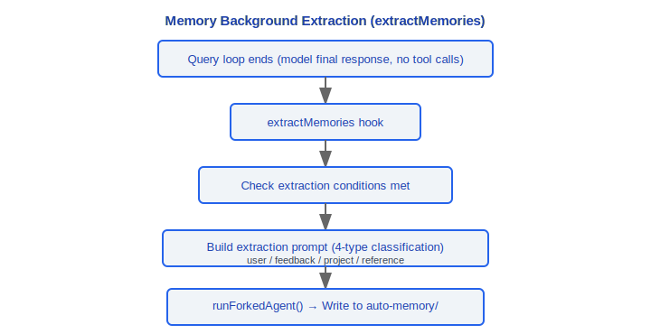
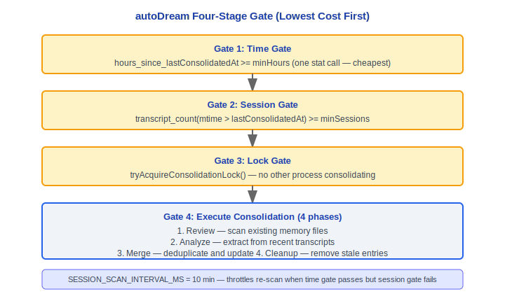
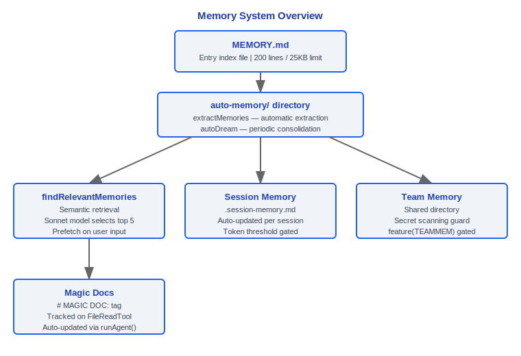

# Memory System

> Claude Code v2.1.88 memory architecture: MEMORY.md loading and truncation, memory types, semantic retrieval, team memory, session memory, automatic extraction, autoDream integration, Magic Docs.

---

## 1. Memdir — MEMORY.md Core (src/memdir/)

### 1.1 MEMORY.md Loading and Truncation

`src/memdir/memdir.ts` defines the core constants and loading logic for the memory entry file:

```typescript
export const ENTRYPOINT_NAME = 'MEMORY.md'
export const MAX_ENTRYPOINT_LINES = 200         // Maximum lines
export const MAX_ENTRYPOINT_BYTES = 25_000       // ~25KB maximum bytes (~125 chars/line * 200 lines)
```

#### Truncation Function

```typescript
export function truncateEntrypointContent(raw: string): EntrypointTruncation {
  // 1. Line truncation (natural boundary) → 2. Byte truncation (cut at last newline)
  // Two limits checked independently, warning message appended when triggered
}

type EntrypointTruncation = {
  content: string         // Truncated content
  lineCount: number       // Original line count
  byteCount: number       // Original byte count
  wasLineTruncated: boolean
  wasByteTruncated: boolean
}
```

Truncation warning example:
```
> WARNING: MEMORY.md is 350 lines and 42KB. Only part of it was loaded.
> Keep index entries to one line under ~200 chars; move detail into topic files.
```

### Design Philosophy

#### Why MEMORY.md instead of a database?

Text files (Markdown) can be tracked by git, read by humans, and processed by other tools. In the source code, `ENTRYPOINT_NAME = 'MEMORY.md'`, memories are stored as plain text in project and user directories. Databases are black boxes—developers cannot directly view, edit, or version control memory content. The Markdown format makes memory a "living document" for the project: team members can review memory changes in PRs, CI can check memory file formats, and you can even use grep to search within memories.

#### Why separate project-level and user-level memory?

Project-level memory (`.claude/MEMORY.md` or auto-memory directory) is shared team knowledge (architectural decisions, coding standards, API references) that should be committed to version control. User-level memory (under `~/.claude/`) is personal preferences (code style, common shortcuts, work habits). The four-type classification defined in `memoryTypes.ts` in the source code further refines this layering: `user` type is always private, `project` type defaults to team, `feedback` type is determined by context.

#### Why is automatic memory extraction (extractMemories) a stop hook?

In the source code `query.ts`, memory extraction is triggered via `handleStopHooks` at the end of each query loop (when the model produces a final response with no tool calls). This timing choice is carefully designed: automatic extraction after workflow completion doesn't interrupt the user's workflow. If extraction happened every conversation turn, it would waste API calls (most intermediate turns have no information worth persisting); if it required manual user triggering, most memories would be lost. Extraction is executed through a forked subagent, sharing the prompt cache to minimize additional cost.

### 1.2 Four Memory Types

`src/memdir/memoryTypes.ts` defines the four-type classification for memories:

```typescript
export const MEMORY_TYPES = ['user', 'feedback', 'project', 'reference'] as const
```

| Type | Meaning | Scope |
|---|---|---|
| **user** | About the user's role, goals, knowledge preferences | Always private |
| **feedback** | User feedback on working methods (should/shouldn't do) | Default private, can be team for project conventions |
| **project** | Project metadata (architectural decisions, dependencies) | Default team |
| **reference** | Reference materials (API docs, tool usage) | Determined by content |

Core principle: **Only save information that cannot be derived from the current project state**. Code patterns, architecture, git history, file structure, and other derivable content (via grep/git/CLAUDE.md) **should not** be saved as memories.

Each memory file uses frontmatter to annotate its type:

```yaml
---
type: feedback
---
# Memory Title
Memory content...
```

### 1.3 loadMemoryPrompt

The `buildMemoryPrompt()` function (in memdir.ts) constructs the memory section of the system prompt:

1. Read MEMORY.md (apply truncation)
2. Read file manifest from auto-memory directory
3. Build complete prompt including memory type descriptions, usage guidance, and trust recall section
4. Append team memory paths and prompts (if TEAMMEM feature is enabled)

The prompt contains the following constant sections:
- `TYPES_SECTION_INDIVIDUAL` — Type descriptions in individual mode
- `WHEN_TO_ACCESS_SECTION` — When to access memories
- `TRUSTING_RECALL_SECTION` — Trust recall guidance
- `WHAT_NOT_TO_SAVE_SECTION` — What not to save
- `MEMORY_FRONTMATTER_EXAMPLE` — Frontmatter example

### 1.4 findRelevantMemories — Semantic Retrieval

`src/memdir/findRelevantMemories.ts` implements LLM-based semantic memory retrieval:

```typescript
export async function findRelevantMemories(
  query: string,
  memoryDir: string,
  signal: AbortSignal,
  recentTools: readonly string[] = [],
  alreadySurfaced: ReadonlySet<string> = new Set()
): Promise<RelevantMemory[]>
```

Retrieval flow:


### 1.5 startRelevantMemoryPrefetch

Starts memory prefetch immediately after user input submission, executing in parallel with API calls to reduce perceived latency of memory retrieval.

### 1.6 memoryScan

`src/memdir/memoryScan.ts` provides memory file scanning and manifest formatting:

```typescript
type MemoryHeader = {
  filename: string
  filePath: string      // Absolute path
  description: string   // Description extracted from file header
  mtimeMs: number       // Last modified time
}

scanMemoryFiles(dir, signal): Promise<MemoryHeader[]>
formatMemoryManifest(memories): string   // Format as text manifest
```

---

## 2. Team Memory

### 2.1 teamMemPaths

`src/memdir/teamMemPaths.ts` (gated by `feature('TEAMMEM')`):

- Provides path resolution for team memory directories
- Team memory is stored in shared directories, visible to team members

### 2.2 teamMemPrompts

`src/memdir/teamMemPrompts.ts` — Constructs system prompt sections related to team memory.

### 2.3 Secret Scanning Guard

Team memory undergoes secret scanning before writing to prevent credentials, API keys, and other sensitive information from being stored in shared memory.

### 2.4 Team Memory Sync

`src/services/teamMemorySync/watcher.ts` — Team memory file sync watcher:

```
startTeamMemoryWatcher()
  └── Monitor file changes in team memory directory
       → Sync to local cache
```

Started via `feature('TEAMMEM')` gate in `setup.ts`.

---

## 3. Session Memory Service

`src/services/SessionMemory/sessionMemory.ts` — Automatically maintains a Markdown notes file for the current conversation.

### 3.1 initSessionMemory

```typescript
export function initSessionMemory(): void {
  // Synchronous operation — registers postSamplingHook
  // Gate check is lazily evaluated on first trigger
  registerPostSamplingHook(handleSessionMemoryHook)
}
```

Called in `setup.ts`, executed in non-bare mode.

### 3.2 shouldExtractMemory — Threshold Evaluation

Trigger conditions for session memory updates:

```
hasMetInitializationThreshold()   — First initialization threshold (starts extracting after conversation is long enough)
hasMetUpdateThreshold()           — Update interval threshold (enough new conversation between extractions)
getToolCallsBetweenUpdates()      — Number of tool calls between updates
```

Configuration managed via `SessionMemoryConfig`:

```typescript
type SessionMemoryConfig = {
  // Token thresholds for initialization and updates
  // Tool call counters
  // Extraction status flags
}

const DEFAULT_SESSION_MEMORY_CONFIG = { ... }
```

### 3.3 .session-memory.md

Session memory file is stored at the path returned by `getSessionMemoryDir()`:

```
~/.claude/projects/<project-hash>/.session-memory.md
```

Updates are executed through a forked subagent:
1. Read current session memory file
2. Build update prompt using `buildSessionMemoryUpdatePrompt()`
3. Execute update via `runForkedAgent()` (shared prompt cache)
4. Write updated Markdown file

---

## 4. extractMemories Service

`src/services/extractMemories/extractMemories.ts` — Automatically extracts persistent memories at the end of the query loop (when the model produces a final response with no tool calls).

### 4.1 Background Extraction

Triggered via `handleStopHooks` (`stopHooks.ts`), using the forked agent pattern:



### 4.2 Coalescing

Multiple rapid consecutive extraction triggers are coalesced to avoid redundant extraction from the same conversation segment.

### 4.3 Four-Type Classification Prompt

The extraction prompt requires the LLM to classify memories according to the four-type classification:
- `user` — User-related information
- `feedback` — Work feedback
- `project` — Project metadata
- `reference` — Reference materials

### 4.4 Tool Permissions

Tools available to the extraction agent are controlled by `createAutoMemCanUseTool()`:

```typescript
// Allowed tools:
BASH_TOOL_NAME         // Bash (restricted)
FILE_READ_TOOL_NAME    // Read file
FILE_EDIT_TOOL_NAME    // Edit file
FILE_WRITE_TOOL_NAME   // Write file
GLOB_TOOL_NAME         // Glob search
GREP_TOOL_NAME         // Grep search
REPL_TOOL_NAME         // REPL
```

Operations are restricted to auto-memory paths (`isAutoMemPath()`).

---

## 5. autoDream — Memory Consolidation

`src/services/autoDream/autoDream.ts` — Background memory consolidation, triggered after accumulating multiple sessions to consolidate and clean up memory files.

### 5.1 Consolidation Lock

`src/services/autoDream/consolidationLock.ts` — Prevents concurrent consolidation:

```typescript
readLastConsolidatedAt()       // Read last consolidation timestamp
listSessionsTouchedSince()     // List active sessions since a given time
tryAcquireConsolidationLock()  // Attempt to acquire consolidation lock
rollbackConsolidationLock()    // Roll back lock (when consolidation fails)
```

### 5.2 Four-Gate Control (Lowest Cost First)



### 5.3 Four-Phase Consolidation Prompt

`src/services/autoDream/consolidationPrompt.ts` — The consolidation prompt built by `buildConsolidationPrompt()` contains four phases:

1. **Review** — Scan existing memory files to understand the current memory store state
2. **Analyze** — Extract new information from recent session transcripts
3. **Merge** — Combine new information with existing memories, deduplicating and updating
4. **Cleanup** — Delete outdated, contradictory, or redundant memory entries

### 5.4 Consolidation Task

Consolidation is executed in the background via `DreamTask` (`src/tasks/DreamTask/`):

```typescript
registerDreamTask()    // Register consolidation task
addDreamTurn()         // Add consolidation turn
completeDreamTask()    // Complete consolidation
failDreamTask()        // Consolidation failure
isDreamTask()          // Check if it is a consolidation task
```

### 5.5 Configuration

`src/services/autoDream/config.ts`:

```typescript
type AutoDreamConfig = {
  minHours: number      // Minimum interval in hours
  minSessions: number   // Minimum number of sessions
}

isAutoDreamEnabled()    // Whether autoDream is enabled
```

---

## 6. Magic Docs

`src/services/MagicDocs/magicDocs.ts` — Automatically maintains Markdown documents marked with a special header.

### 6.1 MAGIC DOC Header

```typescript
const MAGIC_DOC_HEADER_PATTERN = /^#\s*MAGIC\s+DOC:\s*(.+)$/im
const ITALICS_PATTERN = /^[_*](.+?)[_*]\s*$/m   // Italics instruction on the line below the header
```

File format:
```markdown
# MAGIC DOC: API Reference
_Auto-update this document with new API endpoints as they are discovered_

## Endpoints
...
```

### 6.2 Detection and Tracking

```typescript
export function detectMagicDocHeader(content: string): { title: string; instructions?: string } | null
```

When `FileReadTool` reads a file, a listener registered via `registerFileReadListener()` detects the Magic Doc header:

```
FileReadTool reads file
  → detectMagicDocHeader(content)
    → If Magic Doc → trackedMagicDocs.set(path, info)
```

### 6.3 Auto-Update

Triggered via `postSamplingHook`, updated using a forked subagent:

```
Query loop ends (model response has no tool calls)
  → Magic Docs hook
      ├── Check if there are files in trackedMagicDocs
      ├── For each tracked doc:
      │    ├── Read current file content
      │    ├── buildMagicDocsUpdatePrompt()
      │    └── Execute update using runAgent() (non-forked, independent agent)
      └── Write updated content back to original file
```

Magic Docs uses `sequential()` wrapping to ensure updates to the same file don't execute concurrently.

### 6.4 Differences from the Memory System

| Feature | Memory System | Magic Docs |
|---|---|---|
| Trigger method | Automatic (background) | Automatic after file read |
| Storage location | ~/.claude/projects/\<hash\>/memory/ | Anywhere within the project |
| Content type | Structured memory (4-type classification) | Free-form Markdown |
| Identification | Directory convention | `# MAGIC DOC:` header |
| Execution mode | Forked subagent | Independent agent (`runAgent`) |
| Use case | Cross-session knowledge accumulation | Project documentation auto-maintenance |

---

## 7. Memory System Overview



---

## Engineering Practice Guide

### Debugging Memory Loading

**Checklist:**

1. **Confirm MEMORY.md path**: Check if `.claude/MEMORY.md` in the project root and `~/.claude/MEMORY.md` in the user directory exist
2. **Check truncation issues**: `MAX_ENTRYPOINT_LINES = 200` and `MAX_ENTRYPOINT_BYTES = 25_000` in `memdir.ts`; exceeding limits triggers truncation warning: `WARNING: MEMORY.md is X lines and XKB. Only part of it was loaded.`
3. **Verify frontmatter format**: Each memory file needs correct YAML frontmatter (`type: user|feedback|project|reference`); format errors prevent memory from being classified
4. **View memory retrieval logs**: `findRelevantMemories` calls Sonnet model to select up to 5 relevant memory files; if key memories are not retrieved, check if the file's header description is semantically related to the query
5. **Check feature gate**: Team memory is gated by `feature('TEAMMEM')`; confirm whether this feature is enabled

**Debugging command examples:**
```bash
# View memory file structure
ls -la ~/.claude/projects/<project-hash>/memory/
# Check MEMORY.md line count and size
wc -l .claude/MEMORY.md
wc -c .claude/MEMORY.md
```

### Customizing Memory Extraction

**extractMemories is a stop hook — it is automatically triggered at the end of the query loop (when the model produces a final response with no tool calls).**

- **Control extraction toggle**: Gated by `feature('EXTRACT_MEMORIES')` in `stopHooks.ts`. If this feature is not enabled, extraction will not execute
- **Extraction timing**: Triggered via `handleStopHooks` at the end of each complete query loop, not during intermediate tool call turns
- **Extraction tool permissions**: Extraction agent is only allowed to operate under `isAutoMemPath()` paths, can use Bash/FileRead/FileEdit/FileWrite/Glob/Grep/REPL
- **Coalescing mechanism**: Multiple rapid consecutive extractions are coalesced to avoid redundant extraction from the same conversation segment
- **Session memory thresholds**: `SessionMemoryConfig` has `minimumMessageTokensToInit` (first extraction token threshold) and `minimumTokensBetweenUpdate` (update interval threshold); won't trigger if the conversation isn't long enough

### Team Memory Sync

**Checklist:**

1. Include project-level `.claude/MEMORY.md` in git version control
2. Team members review memory changes in PRs
3. CI can check memory file format compliance
4. Team memory goes through `secretScanner`'s 30 gitleaks rule scan before writing
5. `teamMemorySync/watcher.ts` monitors team memory directory file changes and automatically syncs to local cache

**Team collaboration best practices:**
- Keep MEMORY.md as an index file, stay concise, move detailed content into topic files
- Use `project` type to mark team-shared architectural decisions and coding standards
- Use `user` type to mark personal preferences (not synced to team)

### Common Pitfalls

| Pitfall | Cause | Solution |
|------|------|----------|
| Memory files contain sensitive information | `.claude/MEMORY.md` is tracked by git, secrets may be committed | Use `user` type for personal sensitive preferences; team memory has secret scanner interception |
| MEMORY.md too large consuming context | Exceeding 200 lines/25KB causes truncation; even without truncation it consumes precious context window | Keep index entries to ~200 chars per line, move details to topic files |
| Memories not retrieved | `findRelevantMemories` uses Sonnet-based semantic matching; memories with unclear descriptions may be ignored | Ensure memory file header/description clearly reflects content theme |
| autoDream consolidation conflicts | Concurrent Claude Code instances running autoDream simultaneously | PID lock mechanism (60-minute timeout) prevents concurrency, but may need manual lock file cleanup after crashes |
| Only save information not derivable from project state | Code patterns, architecture, git history, and other derivable content should not be stored as memories | Follow the four-type classification, avoid storing information obtainable via grep/git/file structure |


---

[← Command System](../15-命令体系/command-system-en.md) | [Index](../README_EN.md) | [Error Recovery →](../17-错误恢复/error-recovery-en.md)
