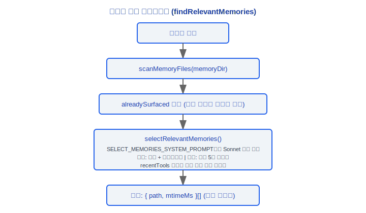
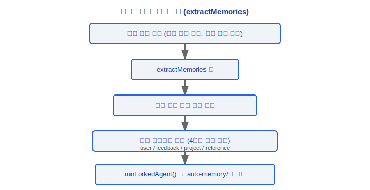
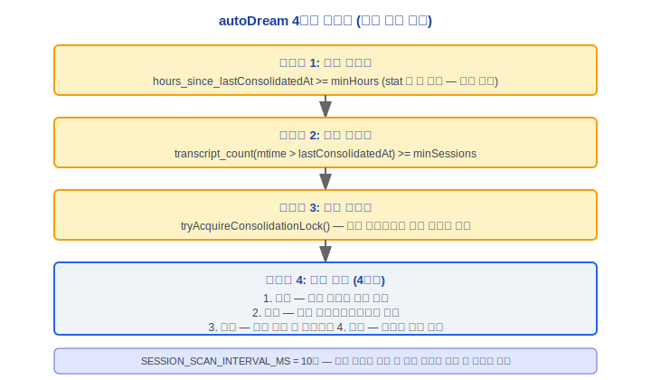
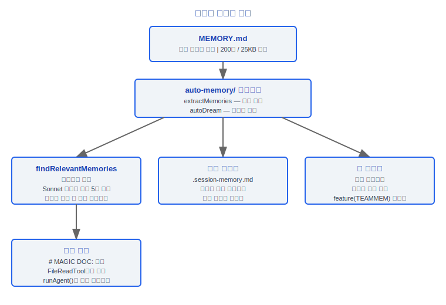

# 메모리 시스템(Memory System)

> Claude Code v2.1.88 메모리 아키텍처: MEMORY.md 로딩 및 잘라내기, 메모리 타입, 시맨틱 검색, 팀 메모리, 세션 메모리, 자동 추출, autoDream 통합, Magic Docs.

---

## 1. Memdir — MEMORY.md 핵심 (src/memdir/)

### 1.1 MEMORY.md 로딩 및 잘라내기

`src/memdir/memdir.ts`는 메모리 진입점 파일의 핵심 상수와 로딩 로직을 정의합니다:

```typescript
export const ENTRYPOINT_NAME = 'MEMORY.md'
export const MAX_ENTRYPOINT_LINES = 200         // 최대 줄 수
export const MAX_ENTRYPOINT_BYTES = 25_000       // 최대 바이트 수 약 25KB (~125자/줄 * 200줄)
```

#### 잘라내기 함수

```typescript
export function truncateEntrypointContent(raw: string): EntrypointTruncation {
  // 1. 줄 잘라내기 (자연 경계) → 2. 바이트 잘라내기 (마지막 줄바꿈에서 자름)
  // 두 제한이 독립적으로 검사되며, 트리거 시 경고 메시지가 추가됨
}

type EntrypointTruncation = {
  content: string         // 잘라낸 내용
  lineCount: number       // 원래 줄 수
  byteCount: number       // 원래 바이트 수
  wasLineTruncated: boolean
  wasByteTruncated: boolean
}
```

잘라내기 경고 예시:
```
> WARNING: MEMORY.md is 350 lines and 42KB. Only part of it was loaded.
> Keep index entries to one line under ~200 chars; move detail into topic files.
```

### 설계 철학

#### 왜 데이터베이스 대신 MEMORY.md인가?

텍스트 파일(Markdown)은 git으로 추적하고, 사람이 읽고, 다른 도구로 처리할 수 있습니다. 소스 코드에서 `ENTRYPOINT_NAME = 'MEMORY.md'`로, 메모리는 프로젝트와 사용자 디렉터리에 일반 텍스트로 저장됩니다. 데이터베이스는 블랙박스입니다 — 개발자가 메모리 내용을 직접 보거나 편집하거나 버전 관리할 수 없습니다. Markdown 형식은 메모리를 프로젝트의 "살아있는 문서"로 만듭니다: 팀원들은 PR에서 메모리 변경 사항을 검토할 수 있고, CI는 메모리 파일 형식을 확인할 수 있으며, grep을 사용하여 메모리 내에서 검색할 수도 있습니다.

#### 왜 프로젝트 수준과 사용자 수준 메모리를 분리하는가?

프로젝트 수준 메모리(`.claude/MEMORY.md` 또는 자동 메모리 디렉터리)는 공유 팀 지식(아키텍처 결정, 코딩 표준, API 레퍼런스)으로 버전 관리에 커밋되어야 합니다. 사용자 수준 메모리(`~/.claude/` 하위)는 개인 선호도(코드 스타일, 일반적인 단축키, 작업 습관)입니다. 소스 코드의 `memoryTypes.ts`에 정의된 4가지 타입 분류는 이 레이어링을 더욱 세분화합니다: `user` 타입은 항상 비공개이고, `project` 타입은 기본적으로 팀 공유이며, `feedback` 타입은 컨텍스트에 따라 결정됩니다.

#### 왜 자동 메모리 추출(extractMemories)이 중지 훅(stop hook)인가?

소스 코드 `query.ts`에서 메모리 추출은 각 쿼리 루프의 끝(모델이 도구 호출 없이 최종 응답을 생성할 때)에 `handleStopHooks`를 통해 트리거됩니다. 이 타이밍 선택은 신중하게 설계된 것입니다: 워크플로우 완료 후 자동 추출은 사용자의 워크플로우를 방해하지 않습니다. 매 대화 턴마다 추출이 발생하면 API 호출을 낭비합니다(대부분의 중간 턴에는 영속화할 가치 있는 정보가 없음); 수동 사용자 트리거가 필요하다면 대부분의 메모리가 손실됩니다. 추출은 포크된 서브에이전트를 통해 실행되어 프롬프트 캐시를 공유함으로써 추가 비용을 최소화합니다.

### 1.2 4가지 메모리 타입

`src/memdir/memoryTypes.ts`는 메모리의 4가지 타입 분류를 정의합니다:

```typescript
export const MEMORY_TYPES = ['user', 'feedback', 'project', 'reference'] as const
```

| 타입 | 의미 | 범위 |
|---|---|---|
| **user** | 사용자의 역할, 목표, 지식 선호도에 관한 것 | 항상 비공개 |
| **feedback** | 작업 방법에 대한 사용자 피드백 (해야 할 것/하지 말아야 할 것) | 기본 비공개, 프로젝트 규약의 경우 팀 공유 가능 |
| **project** | 프로젝트 메타데이터 (아키텍처 결정, 의존성) | 기본 팀 공유 |
| **reference** | 참조 자료 (API 문서, 도구 사용법) | 내용에 따라 결정 |

핵심 원칙: **현재 프로젝트 상태에서 파생할 수 없는 정보만 저장합니다**. 코드 패턴, 아키텍처, git 히스토리, 파일 구조 등 파생 가능한 내용(grep/git/CLAUDE.md를 통해) **은** 메모리로 저장하면 **안 됩니다**.

각 메모리 파일은 프론트매터(frontmatter)를 사용하여 타입을 주석으로 표시합니다:

```yaml
---
type: feedback
---
# 메모리 제목
메모리 내용...
```

### 1.3 loadMemoryPrompt

`buildMemoryPrompt()` 함수(memdir.ts 내)는 시스템 프롬프트의 메모리 섹션을 구성합니다:

1. MEMORY.md 읽기 (잘라내기 적용)
2. 자동 메모리 디렉터리에서 파일 매니페스트 읽기
3. 메모리 타입 설명, 사용 지침, 신뢰 회상 섹션을 포함한 완전한 프롬프트 빌드
4. 팀 메모리 경로 및 프롬프트 추가 (TEAMMEM 기능이 활성화된 경우)

프롬프트에는 다음 상수 섹션이 포함됩니다:
- `TYPES_SECTION_INDIVIDUAL` — 개인 모드에서의 타입 설명
- `WHEN_TO_ACCESS_SECTION` — 메모리에 접근할 때
- `TRUSTING_RECALL_SECTION` — 회상 신뢰 지침
- `WHAT_NOT_TO_SAVE_SECTION` — 저장하지 말아야 할 것
- `MEMORY_FRONTMATTER_EXAMPLE` — 프론트매터 예시

### 1.4 findRelevantMemories — 시맨틱 검색

`src/memdir/findRelevantMemories.ts`는 LLM 기반 시맨틱 메모리 검색을 구현합니다:

```typescript
export async function findRelevantMemories(
  query: string,
  memoryDir: string,
  signal: AbortSignal,
  recentTools: readonly string[] = [],
  alreadySurfaced: ReadonlySet<string> = new Set()
): Promise<RelevantMemory[]>
```

검색 흐름:



### 1.5 startRelevantMemoryPrefetch

사용자 입력 제출 직후 메모리 프리페치를 시작하여, API 호출과 병렬로 실행함으로써 메모리 검색의 지각된 지연을 줄입니다.

### 1.6 memoryScan

`src/memdir/memoryScan.ts`는 메모리 파일 스캔과 매니페스트 형식화를 제공합니다:

```typescript
type MemoryHeader = {
  filename: string
  filePath: string      // 절대 경로
  description: string   // 파일 헤더에서 추출된 설명
  mtimeMs: number       // 마지막 수정 시간
}

scanMemoryFiles(dir, signal): Promise<MemoryHeader[]>
formatMemoryManifest(memories): string   // 텍스트 매니페스트로 형식화
```

---

## 2. 팀 메모리

### 2.1 teamMemPaths

`src/memdir/teamMemPaths.ts` (`feature('TEAMMEM')`에 의해 게이팅됨):

- 팀 메모리 디렉터리의 경로 해석을 제공
- 팀 메모리는 공유 디렉터리에 저장되어 팀원에게 보임

### 2.2 teamMemPrompts

`src/memdir/teamMemPrompts.ts` — 팀 메모리와 관련된 시스템 프롬프트 섹션을 구성합니다.

### 2.3 시크릿 스캔 가드

팀 메모리는 자격 증명, API 키 및 기타 민감한 정보가 공유 메모리에 저장되지 않도록 쓰기 전에 시크릿 스캔을 거칩니다.

### 2.4 팀 메모리 동기화

`src/services/teamMemorySync/watcher.ts` — 팀 메모리 파일 동기화 감시자:

```
startTeamMemoryWatcher()
  └── 팀 메모리 디렉터리의 파일 변경 모니터링
       → 로컬 캐시에 동기화
```

`setup.ts`에서 `feature('TEAMMEM')` 게이트를 통해 시작됩니다.

---

## 3. 세션 메모리 서비스

`src/services/SessionMemory/sessionMemory.ts` — 현재 대화를 위한 Markdown 노트 파일을 자동으로 유지합니다.

### 3.1 initSessionMemory

```typescript
export function initSessionMemory(): void {
  // 동기 작업 — postSamplingHook을 등록
  // 게이트 확인은 첫 번째 트리거 시 지연 평가됨
  registerPostSamplingHook(handleSessionMemoryHook)
}
```

`setup.ts`에서 호출되며, 비-bare 모드에서 실행됩니다.

### 3.2 shouldExtractMemory — 임계값 평가

세션 메모리 업데이트를 위한 트리거 조건:

```
hasMetInitializationThreshold()   — 첫 번째 초기화 임계값 (대화가 충분히 길어진 후 추출 시작)
hasMetUpdateThreshold()           — 업데이트 간격 임계값 (추출 사이에 충분한 새 대화)
getToolCallsBetweenUpdates()      — 업데이트 사이의 도구 호출 수
```

설정(Config)은 `SessionMemoryConfig`를 통해 관리됩니다:

```typescript
type SessionMemoryConfig = {
  // 초기화 및 업데이트를 위한 토큰 임계값
  // 도구 호출 카운터
  // 추출 상태 플래그
}

const DEFAULT_SESSION_MEMORY_CONFIG = { ... }
```

### 3.3 .session-memory.md

세션 메모리 파일은 `getSessionMemoryDir()`이 반환하는 경로에 저장됩니다:

```
~/.claude/projects/<project-hash>/.session-memory.md
```

업데이트는 포크된 서브에이전트를 통해 실행됩니다:
1. 현재 세션 메모리 파일 읽기
2. `buildSessionMemoryUpdatePrompt()`를 사용하여 업데이트 프롬프트 빌드
3. `runForkedAgent()`를 통해 업데이트 실행 (공유 프롬프트 캐시)
4. 업데이트된 Markdown 파일 쓰기

---

## 4. extractMemories 서비스

`src/services/extractMemories/extractMemories.ts` — 쿼리 루프의 끝(모델이 도구 호출 없이 최종 응답을 생성할 때)에 영속적인 메모리를 자동으로 추출합니다.

### 4.1 백그라운드 추출

`handleStopHooks` (`stopHooks.ts`)를 통해 트리거되며, 포크된 에이전트 패턴을 사용합니다:



### 4.2 병합(Coalescing)

여러 빠른 연속 추출 트리거는 동일한 대화 세그먼트에서 중복 추출을 방지하기 위해 병합됩니다.

### 4.3 4가지 타입 분류 프롬프트

추출 프롬프트는 LLM이 4가지 타입 분류에 따라 메모리를 분류하도록 요구합니다:
- `user` — 사용자 관련 정보
- `feedback` — 작업 피드백
- `project` — 프로젝트 메타데이터
- `reference` — 참조 자료

### 4.4 도구 권한

추출 에이전트에서 사용 가능한 도구는 `createAutoMemCanUseTool()`에 의해 제어됩니다:

```typescript
// 허용된 도구:
BASH_TOOL_NAME         // Bash (제한됨)
FILE_READ_TOOL_NAME    // 파일 읽기
FILE_EDIT_TOOL_NAME    // 파일 편집
FILE_WRITE_TOOL_NAME   // 파일 쓰기
GLOB_TOOL_NAME         // Glob 검색
GREP_TOOL_NAME         // Grep 검색
REPL_TOOL_NAME         // REPL
```

작업은 자동 메모리 경로(`isAutoMemPath()`)로 제한됩니다.

---

## 5. autoDream — 메모리 통합

`src/services/autoDream/autoDream.ts` — 백그라운드 메모리 통합으로, 여러 세션 후 메모리 파일을 통합하고 정리하기 위해 트리거됩니다.

### 5.1 통합 잠금

`src/services/autoDream/consolidationLock.ts` — 동시 통합을 방지합니다:

```typescript
readLastConsolidatedAt()       // 마지막 통합 타임스탬프 읽기
listSessionsTouchedSince()     // 주어진 시간 이후 활성 세션 나열
tryAcquireConsolidationLock()  // 통합 잠금 획득 시도
rollbackConsolidationLock()    // 잠금 롤백 (통합 실패 시)
```

### 5.2 4단계 게이트 제어 (가장 낮은 비용 우선)



### 5.3 4단계 통합 프롬프트

`src/services/autoDream/consolidationPrompt.ts` — `buildConsolidationPrompt()`가 빌드하는 통합 프롬프트는 4단계를 포함합니다:

1. **검토(Review)** — 기존 메모리 파일을 스캔하여 현재 메모리 저장소 상태 이해
2. **분석(Analyze)** — 최근 세션 기록에서 새 정보 추출
3. **병합(Merge)** — 새 정보와 기존 메모리를 결합하여 중복 제거 및 업데이트
4. **정리(Cleanup)** — 오래되거나 모순되거나 중복된 메모리 항목 삭제

### 5.4 통합 작업

통합은 `DreamTask`(`src/tasks/DreamTask/`)를 통해 백그라운드에서 실행됩니다:

```typescript
registerDreamTask()    // 통합 작업 등록
addDreamTurn()         // 통합 턴 추가
completeDreamTask()    // 통합 완료
failDreamTask()        // 통합 실패
isDreamTask()          // 통합 작업인지 확인
```

### 5.5 설정(Config)

`src/services/autoDream/config.ts`:

```typescript
type AutoDreamConfig = {
  minHours: number      // 최소 간격 (시간)
  minSessions: number   // 최소 세션 수
}

isAutoDreamEnabled()    // autoDream 활성화 여부
```

---

## 6. Magic Docs

`src/services/MagicDocs/magicDocs.ts` — 특별한 헤더로 표시된 Markdown 문서를 자동으로 유지합니다.

### 6.1 MAGIC DOC 헤더

```typescript
const MAGIC_DOC_HEADER_PATTERN = /^#\s*MAGIC\s+DOC:\s*(.+)$/im
const ITALICS_PATTERN = /^[_*](.+?)[_*]\s*$/m   // 헤더 아래 줄의 이탤릭체 지침
```

파일 형식:
```markdown
# MAGIC DOC: API Reference
_Auto-update this document with new API endpoints as they are discovered_

## Endpoints
...
```

### 6.2 감지 및 추적

```typescript
export function detectMagicDocHeader(content: string): { title: string; instructions?: string } | null
```

`FileReadTool`이 파일을 읽을 때, `registerFileReadListener()`를 통해 등록된 리스너가 Magic Doc 헤더를 감지합니다:

```
FileReadTool이 파일을 읽음
  → detectMagicDocHeader(content)
    → Magic Doc이면 → trackedMagicDocs.set(path, info)
```

### 6.3 자동 업데이트

`postSamplingHook`을 통해 트리거되어, 포크된 서브에이전트를 사용하여 업데이트됩니다:

```
쿼리 루프 종료 (모델 응답에 도구 호출 없음)
  → Magic Docs 훅(hook)
      ├── trackedMagicDocs에 파일이 있는지 확인
      ├── 각 추적된 문서에 대해:
      │    ├── 현재 파일 내용 읽기
      │    ├── buildMagicDocsUpdatePrompt()
      │    └── runAgent()를 사용하여 업데이트 실행 (비포크, 독립 에이전트)
      └── 업데이트된 내용을 원래 파일에 다시 쓰기
```

Magic Docs는 동일 파일에 대한 업데이트가 동시에 실행되지 않도록 `sequential()` 래핑을 사용합니다.

### 6.4 메모리 시스템(Memory System)과의 차이점

| 기능 | 메모리 시스템(Memory System) | Magic Docs |
|---|---|---|
| 트리거 방법 | 자동 (백그라운드) | 파일 읽기 후 자동 |
| 저장 위치 | ~/.claude/projects/\<hash\>/memory/ | 프로젝트 내 어디든 |
| 내용 타입 | 구조화된 메모리 (4가지 타입 분류) | 자유형식 Markdown |
| 식별 방법 | 디렉터리 규약 | `# MAGIC DOC:` 헤더 |
| 실행 모드 | 포크된 서브에이전트 | 독립 에이전트 (`runAgent`) |
| 사용 사례 | 세션 간 지식 축적 | 프로젝트 문서 자동 유지 |

---

## 7. 메모리 시스템(Memory System) 개요



---

## 엔지니어링 실천 가이드

### 메모리 로딩 디버깅

**체크리스트:**

1. **MEMORY.md 경로 확인**: 프로젝트 루트의 `.claude/MEMORY.md`와 사용자 디렉터리의 `~/.claude/MEMORY.md`가 존재하는지 확인
2. **잘라내기 문제 확인**: `memdir.ts`의 `MAX_ENTRYPOINT_LINES = 200`과 `MAX_ENTRYPOINT_BYTES = 25_000`; 제한 초과 시 잘라내기 경고 트리거: `WARNING: MEMORY.md is X lines and XKB. Only part of it was loaded.`
3. **프론트매터 형식 확인**: 각 메모리 파일에는 올바른 YAML 프론트매터(`type: user|feedback|project|reference`)가 필요함; 형식 오류는 메모리 분류를 방해함
4. **메모리 검색 로그 확인**: `findRelevantMemories`는 Sonnet 모델을 호출하여 최대 5개의 관련 메모리 파일을 선택함; 주요 메모리가 검색되지 않는다면 파일의 헤더 설명이 쿼리와 의미론적으로 관련되어 있는지 확인
5. **기능 게이트 확인**: 팀 메모리는 `feature('TEAMMEM')`에 의해 게이팅됨; 이 기능이 활성화되어 있는지 확인

**디버깅 명령 예시:**
```bash
# 메모리 파일 구조 보기
ls -la ~/.claude/projects/<project-hash>/memory/
# MEMORY.md 줄 수와 크기 확인
wc -l .claude/MEMORY.md
wc -c .claude/MEMORY.md
```

### 메모리 추출 커스터마이징

**extractMemories는 중지 훅(stop hook)입니다 — 쿼리 루프의 끝(모델이 도구 호출 없이 최종 응답을 생성할 때)에 자동으로 트리거됩니다.**

- **추출 토글 제어**: `stopHooks.ts`에서 `feature('EXTRACT_MEMORIES')`에 의해 게이팅됨. 이 기능이 활성화되지 않으면 추출이 실행되지 않음
- **추출 타이밍**: 각 완전한 쿼리 루프의 끝에 `handleStopHooks`를 통해 트리거되며, 중간 도구 호출 턴 중에는 트리거되지 않음
- **추출 도구 권한**: 추출 에이전트는 `isAutoMemPath()` 경로에서만 작업이 허용되며, Bash/FileRead/FileEdit/FileWrite/Glob/Grep/REPL을 사용할 수 있음
- **병합 메커니즘**: 여러 빠른 연속 추출은 동일한 대화 세그먼트에서 중복 추출을 방지하기 위해 병합됨
- **세션 메모리 임계값**: `SessionMemoryConfig`에는 `minimumMessageTokensToInit`(첫 번째 추출 토큰 임계값)과 `minimumTokensBetweenUpdate`(업데이트 간격 임계값)가 있음; 대화가 충분히 길지 않으면 트리거되지 않음

### 팀 메모리 동기화

**체크리스트:**

1. 프로젝트 수준 `.claude/MEMORY.md`를 git 버전 관리에 포함
2. 팀원들이 PR에서 메모리 변경 사항을 검토
3. CI가 메모리 파일 형식 준수를 확인할 수 있음
4. 팀 메모리는 `secretScanner`의 30가지 gitleaks 규칙 스캔을 거친 후 작성됨
5. `teamMemorySync/watcher.ts`가 팀 메모리 디렉터리 파일 변경을 모니터링하고 자동으로 로컬 캐시에 동기화함

**팀 협업 모범 사례:**
- MEMORY.md를 인덱스 파일로 유지하고 간결하게 유지하며 상세 내용은 토픽 파일로 이동
- `project` 타입을 사용하여 팀 공유 아키텍처 결정과 코딩 표준 표시
- `user` 타입을 사용하여 개인 선호도 표시 (팀에 동기화되지 않음)

### 일반적인 함정

| 함정 | 원인 | 해결 방법 |
|------|------|----------|
| 메모리 파일에 민감한 정보 포함 | `.claude/MEMORY.md`는 git으로 추적되어 시크릿이 커밋될 수 있음 | 개인 민감 선호도에는 `user` 타입 사용; 팀 메모리에는 시크릿 스캐너 차단 있음 |
| MEMORY.md가 너무 커서 컨텍스트 소비 | 200줄/25KB 초과 시 잘라내기 발생; 잘라내기 없어도 소중한 컨텍스트 창 소비 | 인덱스 항목을 한 줄 약 200자로 유지하고 상세 내용은 토픽 파일로 이동 |
| 메모리가 검색되지 않음 | `findRelevantMemories`는 Sonnet 기반 시맨틱 매칭을 사용; 설명이 불명확한 메모리는 무시될 수 있음 | 메모리 파일 헤더/설명이 내용 주제를 명확하게 반영하도록 보장 |
| autoDream 통합 충돌 | 여러 Claude Code 인스턴스가 동시에 autoDream을 실행함 | PID 잠금 메커니즘(60분 타임아웃)이 동시성을 방지하지만 충돌 후 수동 잠금 파일 정리가 필요할 수 있음 |
| 프로젝트 상태에서 파생할 수 없는 정보만 저장 | 코드 패턴, 아키텍처, git 히스토리 등 파생 가능한 내용은 메모리로 저장하면 안 됨 | 4가지 타입 분류를 따르고, grep/git/파일 구조를 통해 얻을 수 있는 정보 저장 피하기 |


---

[← 명령(Command) 시스템](../15-命令体系/command-system-ko.md) | [인덱스](../README_KO.md) | [오류 복구(Error Recovery) →](../17-错误恢复/error-recovery-ko.md)
