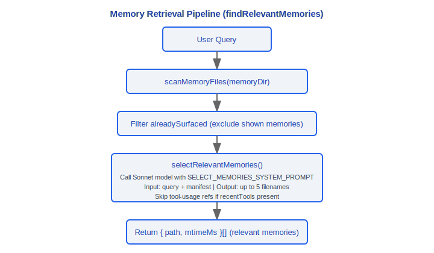

# 记忆系统

> Claude Code v2.1.88 的记忆架构：MEMORY.md 加载与截断、记忆类型、语义检索、团队记忆、会话记忆、自动提取、autoDream 整合、Magic Docs。

---

## 1. Memdir — MEMORY.md 核心 (src/memdir/)

### 1.1 MEMORY.md 加载与截断

`src/memdir/memdir.ts` 定义了记忆入口文件的核心常量和加载逻辑：

```typescript
export const ENTRYPOINT_NAME = 'MEMORY.md'
export const MAX_ENTRYPOINT_LINES = 200         // 最大行数
export const MAX_ENTRYPOINT_BYTES = 25_000       // ~25KB 最大字节数（~125字符/行 * 200行）
```

#### 截断函数

```typescript
export function truncateEntrypointContent(raw: string): EntrypointTruncation {
  // 1. 行截断（自然边界）→ 2. 字节截断（在最后一个换行处切割）
  // 两个限制独立检查，触发时追加警告消息
}

type EntrypointTruncation = {
  content: string         // 截断后的内容
  lineCount: number       // 原始行数
  byteCount: number       // 原始字节数
  wasLineTruncated: boolean
  wasByteTruncated: boolean
}
```

截断警告示例：
```
> WARNING: MEMORY.md is 350 lines and 42KB. Only part of it was loaded.
> Keep index entries to one line under ~200 chars; move detail into topic files.
```

### 设计理念

#### 为什么MEMORY.md而不是数据库？

文本文件（Markdown）可以被 git 跟踪、被人阅读、被其他工具处理。源码中 `ENTRYPOINT_NAME = 'MEMORY.md'`，记忆以纯文本形式存储在项目目录和用户目录下。数据库是黑箱——开发者无法直接查看、编辑、版本控制记忆内容。Markdown 格式让记忆成为项目的"活文档"：团队成员可以在 PR 中 review 记忆变更，CI 可以检查记忆文件的格式，甚至可以用 grep 在记忆中搜索。

#### 为什么记忆分项目级和用户级？

项目级记忆（`.claude/MEMORY.md` 或 auto-memory 目录）是团队共享知识（架构决策、编码规范、API 参考），应该提交到版本控制。用户级记忆（`~/.claude/` 下）是个人偏好（代码风格、常用快捷操作、工作习惯）。源码中 `memoryTypes.ts` 定义的四类分类法（user/feedback/project/reference）进一步细化了这个分层：`user` 类型始终 private，`project` 类型默认 team，`feedback` 类型按上下文决定。

#### 为什么自动提取记忆(extractMemories)是stop hook？

源码 `query.ts` 中通过 `handleStopHooks` 在每次查询循环结束后（模型产出最终响应，无工具调用时）触发记忆提取。这个时机选择是精心设计的：在工作流结束后自动提取，不打断用户的工作流。如果是每轮对话都提取，会浪费 API 调用（大部分中间轮次没有值得持久化的信息）；如果需要用户手动触发，大部分记忆会丢失。提取通过 forked subagent 执行，共享 prompt cache，最小化额外成本。

### 1.2 四种记忆类型

`src/memdir/memoryTypes.ts` 定义了记忆的四类分类法：

```typescript
export const MEMORY_TYPES = ['user', 'feedback', 'project', 'reference'] as const
```

| 类型 | 含义 | 作用域 |
|---|---|---|
| **user** | 关于用户的角色、目标、知识偏好 | 始终 private |
| **feedback** | 用户给出的工作方式反馈（该做/不该做） | 默认 private，项目级惯例可为 team |
| **project** | 项目元数据（架构决策、依赖关系） | 默认 team |
| **reference** | 参考资料（API 文档、工具用法） | 按内容决定 |

核心原则：**仅保存从当前项目状态不可推导的信息**。代码模式、架构、git 历史、文件结构等可推导的内容（通过 grep/git/CLAUDE.md）**不应**作为记忆保存。

每个记忆文件使用 frontmatter 标注类型：

```yaml
---
type: feedback
---
# 记忆标题
记忆内容...
```

### 1.3 loadMemoryPrompt

`buildMemoryPrompt()` 函数（在 memdir.ts 中）构建系统提示中的记忆部分：

1. 读取 MEMORY.md（应用截断）
2. 读取自动记忆目录下的文件清单
3. 构建包含记忆类型说明、使用指导、信任召回部分的完整提示
4. 附加团队记忆路径和提示（如果 TEAMMEM feature 启用）

提示包含以下常量节：
- `TYPES_SECTION_INDIVIDUAL` — 个人模式下的类型说明
- `WHEN_TO_ACCESS_SECTION` — 何时应该访问记忆
- `TRUSTING_RECALL_SECTION` — 信任召回指导
- `WHAT_NOT_TO_SAVE_SECTION` — 不应保存的内容
- `MEMORY_FRONTMATTER_EXAMPLE` — Frontmatter 示例

### 1.4 findRelevantMemories — 语义检索

`src/memdir/findRelevantMemories.ts` 实现了基于 LLM 的语义记忆检索：

```typescript
export async function findRelevantMemories(
  query: string,
  memoryDir: string,
  signal: AbortSignal,
  recentTools: readonly string[] = [],
  alreadySurfaced: ReadonlySet<string> = new Set()
): Promise<RelevantMemory[]>
```

检索流程：



### 1.5 startRelevantMemoryPrefetch

在用户输入提交后立即启动记忆预取，与 API 调用并行执行，减少记忆检索的感知延迟。

### 1.6 memoryScan

`src/memdir/memoryScan.ts` 提供记忆文件扫描和清单格式化：

```typescript
type MemoryHeader = {
  filename: string
  filePath: string      // 绝对路径
  description: string   // 从文件 header 提取的描述
  mtimeMs: number       // 最后修改时间
}

scanMemoryFiles(dir, signal): Promise<MemoryHeader[]>
formatMemoryManifest(memories): string   // 格式化为文本清单
```

---

## 2. 团队记忆

### 2.1 teamMemPaths

`src/memdir/teamMemPaths.ts`（`feature('TEAMMEM')` 门控）：

- 提供团队记忆目录的路径解析
- 团队记忆存储在共享目录中，团队成员间可见

### 2.2 teamMemPrompts

`src/memdir/teamMemPrompts.ts` — 构建团队记忆相关的系统提示节。

### 2.3 Secret Scanning Guard

团队记忆写入前进行秘密扫描，防止凭据、API Key 等敏感信息被存入共享记忆。

### 2.4 Team Memory Sync

`src/services/teamMemorySync/watcher.ts` — 团队记忆文件同步观察器：

```
startTeamMemoryWatcher()
  └── 监听团队记忆目录的文件变更
       → 同步到本地缓存
```

在 `setup.ts` 中通过 `feature('TEAMMEM')` 门控启动。

---

## 3. 会话记忆服务

`src/services/SessionMemory/sessionMemory.ts` — 自动维护当前对话的 Markdown 笔记文件。

### 3.1 initSessionMemory

```typescript
export function initSessionMemory(): void {
  // 同步操作 — 注册 postSamplingHook
  // gate 检查在首次触发时延迟执行
  registerPostSamplingHook(handleSessionMemoryHook)
}
```

在 `setup.ts` 中调用，非 bare 模式下执行。

### 3.2 shouldExtractMemory — 阈值判断

会话记忆更新的触发条件：

```
hasMetInitializationThreshold()   — 首次初始化阈值（对话足够长后开始提取）
hasMetUpdateThreshold()           — 更新间隔阈值（两次提取之间需要足够的新对话）
getToolCallsBetweenUpdates()      — 两次更新间的工具调用数
```

配置通过 `SessionMemoryConfig` 管理：

```typescript
type SessionMemoryConfig = {
  // 初始化和更新的 token 阈值
  // 工具调用计数器
  // 提取状态标志
}

const DEFAULT_SESSION_MEMORY_CONFIG = { ... }
```

### 3.3 .session-memory.md

会话记忆文件存储在 `getSessionMemoryDir()` 返回的路径下：

```
~/.claude/projects/<project-hash>/.session-memory.md
```

更新通过 forked subagent 执行：
1. 读取当前会话记忆文件
2. 使用 `buildSessionMemoryUpdatePrompt()` 构建更新提示
3. 通过 `runForkedAgent()` 执行更新（共享 prompt cache）
4. 写入更新后的 Markdown 文件

---

## 4. extractMemories 服务

`src/services/extractMemories/extractMemories.ts` — 在查询循环结束时（模型无工具调用的最终响应）自动提取持久记忆。

### 4.1 后台提取

通过 `handleStopHooks` 触发（`stopHooks.ts`），使用 forked agent 模式：


### 4.2 合并 (Coalescing)

多次快速连续的提取触发会被合并，避免对同一段对话重复提取。

### 4.3 四类分类提示

提取提示要求 LLM 按照四类分类法对记忆进行分类：
- `user` — 用户相关信息
- `feedback` — 工作反馈
- `project` — 项目元数据
- `reference` — 参考资料

### 4.4 工具权限

提取 agent 可使用的工具由 `createAutoMemCanUseTool()` 控制：

```typescript
// 允许的工具：
BASH_TOOL_NAME         // Bash（受限）
FILE_READ_TOOL_NAME    // 读文件
FILE_EDIT_TOOL_NAME    // 编辑文件
FILE_WRITE_TOOL_NAME   // 写文件
GLOB_TOOL_NAME         // Glob 搜索
GREP_TOOL_NAME         // Grep 搜索
REPL_TOOL_NAME         // REPL
```

仅限在 auto-memory 路径（`isAutoMemPath()`）下操作。

---

## 5. autoDream — 记忆整合

`src/services/autoDream/autoDream.ts` — 后台记忆整合，在多个会话积累后触发，整合和清理记忆文件。

### 5.1 整合锁

`src/services/autoDream/consolidationLock.ts` — 防止并发整合：

```typescript
readLastConsolidatedAt()       // 读取上次整合时间
listSessionsTouchedSince()     // 列出指定时间后的活跃会话
tryAcquireConsolidationLock()  // 尝试获取整合锁
rollbackConsolidationLock()    // 回滚锁（整合失败时）
```

### 5.2 四阶段门控（最低成本优先）


### 5.3 四阶段整合提示

`src/services/autoDream/consolidationPrompt.ts` — `buildConsolidationPrompt()` 构建的整合提示包含四个阶段：

1. **审查** — 扫描现有记忆文件，了解当前记忆库状态
2. **分析** — 从近期会话转录中提取新信息
3. **合并** — 将新信息与现有记忆合并，去重和更新
4. **清理** — 删除过时、矛盾或冗余的记忆条目

### 5.4 整合任务

整合通过 `DreamTask`（`src/tasks/DreamTask/`）在后台执行：

```typescript
registerDreamTask()    // 注册整合任务
addDreamTurn()         // 添加整合轮次
completeDreamTask()    // 完成整合
failDreamTask()        // 整合失败
isDreamTask()          // 判断是否为整合任务
```

### 5.5 配置

`src/services/autoDream/config.ts`：

```typescript
type AutoDreamConfig = {
  minHours: number      // 最小间隔小时数
  minSessions: number   // 最小会话数
}

isAutoDreamEnabled()    // 是否启用 autoDream
```

---

## 6. Magic Docs

`src/services/MagicDocs/magicDocs.ts` — 自动维护标记了特殊 header 的 Markdown 文档。

### 6.1 MAGIC DOC Header

```typescript
const MAGIC_DOC_HEADER_PATTERN = /^#\s*MAGIC\s+DOC:\s*(.+)$/im
const ITALICS_PATTERN = /^[_*](.+?)[_*]\s*$/m   // header 下一行的斜体指令
```

文件格式：
```markdown
# MAGIC DOC: API Reference
_Auto-update this document with new API endpoints as they are discovered_

## Endpoints
...
```

### 6.2 检测与追踪

```typescript
export function detectMagicDocHeader(content: string): { title: string; instructions?: string } | null
```

当 `FileReadTool` 读取文件时，通过 `registerFileReadListener()` 注册的监听器检测 Magic Doc header：

```
FileReadTool 读取文件
  → detectMagicDocHeader(content)
    → 如果是 Magic Doc → trackedMagicDocs.set(path, info)
```

### 6.3 自动更新

通过 `postSamplingHook` 触发，使用 forked subagent 更新：

```
查询循环结束（模型响应无工具调用）
  → Magic Docs hook
      ├── 检查 trackedMagicDocs 中是否有文件
      ├── 对每个 tracked doc：
      │    ├── 读取当前文件内容
      │    ├── buildMagicDocsUpdatePrompt()
      │    └── 使用 runAgent() 执行更新（非 forked，独立 agent）
      └── 更新后的内容写回原文件
```

Magic Docs 使用 `sequential()` 包装确保同一文件的更新不并发执行。

### 6.4 与记忆系统的区别

| 特性 | 记忆系统 | Magic Docs |
|---|---|---|
| 触发方式 | 自动（后台） | 文件读取后自动 |
| 存储位置 | ~/.claude/projects/\<hash\>/memory/ | 项目内任意位置 |
| 内容类型 | 结构化记忆（4类分类法） | 自由格式 Markdown |
| 识别方式 | 目录约定 | `# MAGIC DOC:` header |
| 执行模式 | forked subagent | 独立 agent（`runAgent`） |
| 适用场景 | 跨会话知识积累 | 项目文档自动维护 |

---

## 7. 记忆系统全景


---

## 工程实践指南

### 调试记忆加载

**步骤清单：**

1. **确认 MEMORY.md 路径**：检查项目根目录的 `.claude/MEMORY.md` 和用户目录 `~/.claude/MEMORY.md` 是否存在
2. **检查截断问题**：`memdir.ts` 中 `MAX_ENTRYPOINT_LINES = 200`、`MAX_ENTRYPOINT_BYTES = 25_000`，超出限制会触发截断警告：`WARNING: MEMORY.md is X lines and XKB. Only part of it was loaded.`
3. **验证 frontmatter 格式**：每个记忆文件需要正确的 YAML frontmatter（`type: user|feedback|project|reference`），格式错误会导致记忆无法被分类
4. **查看记忆检索日志**：`findRelevantMemories` 调用 Sonnet 模型选择最多 5 个相关记忆文件，如果关键记忆未被检索到，检查文件的 header 描述是否与查询语义相关
5. **检查 feature gate**：团队记忆受 `feature('TEAMMEM')` 门控，确认该特性是否启用

**调试命令示例：**
```bash
# 查看记忆文件结构
ls -la ~/.claude/projects/<project-hash>/memory/
# 检查 MEMORY.md 行数和大小
wc -l .claude/MEMORY.md
wc -c .claude/MEMORY.md
```

### 自定义记忆提取

**extractMemories 是 stop hook——在查询循环结束时（模型产出最终响应，无工具调用时）自动触发。**

- **控制提取开关**：源码 `stopHooks.ts` 中通过 `feature('EXTRACT_MEMORIES')` 门控。如果该特性未启用，提取不会执行
- **提取时机**：通过 `handleStopHooks` 在每次完整查询循环结束后触发，不会在工具调用的中间轮次触发
- **提取工具权限**：提取 agent 仅允许在 `isAutoMemPath()` 路径下操作，可使用 Bash/FileRead/FileEdit/FileWrite/Glob/Grep/REPL
- **合并机制**：多次快速连续的提取会被 coalescing（合并），避免重复提取同一段对话
- **会话记忆阈值**：`SessionMemoryConfig` 中有 `minimumMessageTokensToInit`（首次提取 token 阈值）和 `minimumTokensBetweenUpdate`（更新间隔阈值），对话不够长时不会触发

### 团队记忆同步

**步骤清单：**

1. 将项目级 `.claude/MEMORY.md` 纳入 git 版本控制
2. 团队成员在 PR 中 review 记忆变更
3. CI 可以检查记忆文件的格式规范
4. 团队记忆写入前会经过 `secretScanner` 的 30 条 gitleaks 规则扫描
5. `teamMemorySync/watcher.ts` 监听团队记忆目录文件变更，自动同步到本地缓存

**团队协作最佳实践：**
- MEMORY.md 作为索引文件，保持精简，详细内容放到 topic 文件中
- 使用 `project` 类型标记团队共享的架构决策和编码规范
- 使用 `user` 类型标记个人偏好（不会同步到团队）

### 常见陷阱

| 陷阱 | 原因 | 解决方案 |
|------|------|----------|
| 记忆文件包含敏感信息 | `.claude/MEMORY.md` 被 git 追踪，secrets 会被提交 | 使用 `user` 类型存个人敏感偏好；团队记忆有 secret scanner 拦截 |
| MEMORY.md 过大导致 context 消耗 | 超过 200 行/25KB 会被截断，即使未截断也占用宝贵的 context 窗口 | 保持索引条目一行不超过 ~200 字符，详情移到 topic 文件 |
| 记忆未被检索到 | `findRelevantMemories` 基于 Sonnet 的语义匹配，描述不清晰的记忆可能被忽略 | 确保记忆文件的 header/描述清晰反映内容主题 |
| autoDream 整合冲突 | 并发的 Claude Code 实例同时运行 autoDream | PID 锁机制（60 分钟超时）防止并发，但崩溃后可能需要手动清理锁文件 |
| 仅保存从项目状态不可推导的信息 | 代码模式、架构、git 历史等可推导内容不应作为记忆 | 遵循四类分类法，避免存储可以通过 grep/git/文件结构获取的信息 |


---

[← 命令体系](../15-命令体系/command-system.md) | [目录](../README.md) | [错误恢复 →](../17-错误恢复/error-recovery.md)
