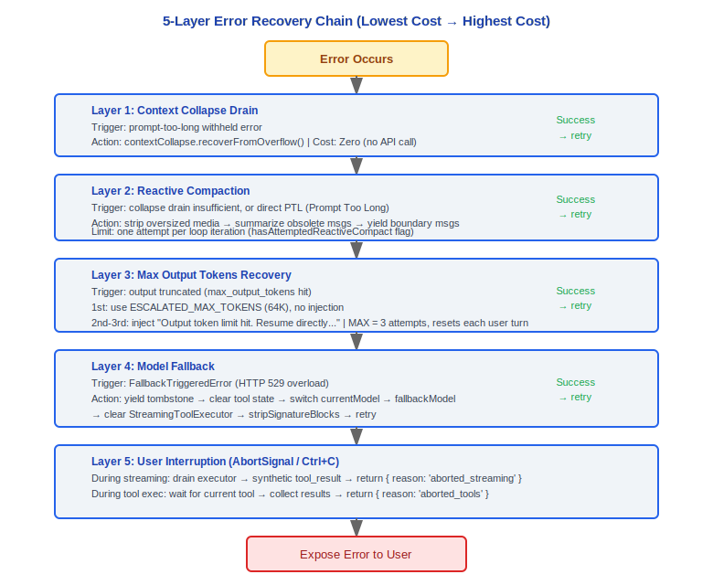

# Error Recovery Architecture Document

> Claude Code v2.1.88 Error Recovery System Complete Technical Reference

---

## 5-Layer Recovery Hierarchy (from lowest cost to highest cost)

The error recovery system adopts a layered strategy, starting with the lowest-cost approach and gradually escalating to more expensive recovery methods.



---

### Design Philosophy

#### Why 5-layer recovery instead of unified error handling?

Each layer handles a different failure domain — context collapse drain handles context overflow (zero cost), reactive compaction handles prompt-too-long (medium cost, requires summarization), MaxOutput recovery handles output truncation (resume generation), model fallback handles service overload (switch model), and user interruption handles unrecoverable scenarios (graceful exit). A unified try/catch cannot differentiate the recovery strategies and cost differences across these failure domains. The layered design lets the system start with the cheapest recovery approach and escalate to more expensive ones — the majority of errors are absorbed at lower layers.

#### Why does tool retry come before API retry?

Tool errors are the most common (file not found, process timeout, insufficient permissions) and cheapest to fix — they only require local retry with no network round-trip. API errors (network jitter, rate limiting, service overload) require HTTP retries, which are more costly and have higher latency. Placing cheaper recovery first avoids unnecessary wasted API calls. This also aligns with the "from lowest cost to highest cost" layering principle found in the source code.

#### Why is max_output_tokens recovery limited to 3 attempts?

The source code at `query.ts:164` explicitly defines `MAX_OUTPUT_TOKENS_RECOVERY_LIMIT = 3`, with a comment above warning: *"rules, ye will be punished with an entire day of debugging and hair pulling"*. Exceeding 3 attempts indicates the model cannot complete the task within the given space — continuing recovery only produces fragmented output. Each recovery injects the meta-message `"Output token limit hit. Resume directly..."`, requiring the model to continue from the breakpoint, but the context is filled with truncation markers and recovery instructions, causing output quality to degrade sharply. 3 is an empirical threshold: sufficient to handle normal long outputs (such as generating large files), while avoiding infinite loops. The counter resets on each new user turn.

### Layer 1: Context Collapse Drain

**Trigger condition**: `prompt-too-long` withheld error

**Action**:
```
contextCollapse.recoverFromOverflow()
```
Drains staged collapsed content to free up context space.

**Cost**: Extremely low -- no API calls, preserves granularity control

**Result**: Success → retry the same request (`continue`)

---

### Layer 2: Reactive Compaction

**Trigger condition**: Collapse drain insufficient, or direct PTL (Prompt Too Long)

**Action**:
```
reactiveCompact.recoverFromPromptTooLong()
```

**Processing steps**:
1. Strip oversized media content
2. Summarize and compress obsolete messages
3. yield boundary messages

**Limit**: Only one attempt allowed per loop iteration (`hasAttemptedReactiveCompact` flag prevents repetition)

**Result**: Success → retry the request; Failure → expose error to user

---

### Layer 3: Max Output Tokens Recovery

**First trigger**:
- Use `ESCALATED_MAX_TOKENS` (64K)
- No additional message injection

**Subsequent triggers**:
- Inject meta-message: `"Output token limit hit. Resume directly..."`

**Counter management**:
- Uses `maxOutputTokensRecoveryCount` counter
- Maximum of 3 recovery attempts allowed
- Counter resets on each new turn (after user message)
- After 3rd attempt: expose the withheld error

---

### Layer 4: Model Fallback

**Trigger condition**: `FallbackTriggeredError` (HTTP 529 overload)

**Action flow**:
1. yield tombstone message (marks orphaned assistantMessages)
2. Clear tool state (tool blocks / tool results)
3. Switch `currentModel` → `fallbackModel`
4. Clear `StreamingToolExecutor`, create a new instance
5. Strip thinking signatures (`stripSignatureBlocks`)
6. Retry the full request (`continue`)

**Logging**: Records the `tengu_model_fallback_triggered` event

---

### Layer 5: User Interruption

**Trigger condition**: `AbortSignal` (user presses Ctrl+C)

#### During streaming:
1. Drain `StreamingToolExecutor`
2. Generate synthetic `tool_result` (error type) for tools that are queued but not yet complete
3. Return `{ reason: 'aborted_streaming' }`

#### During tool execution:
1. Wait for the current tool to complete or time out
2. Collect completed tool results
3. Return `{ reason: 'aborted_tools' }`

---

## Withholding Strategy

Recoverable errors are withheld and not immediately exposed to the SDK/REPL, giving the recovery hierarchy a chance to attempt a fix.

### Withholdable Error Types

| Error Type | Detection Function |
|------------|--------------------|
| prompt-too-long | `reactiveCompact.isWithheldPromptTooLong()` |
| max-output-tokens | `isWithheldMaxOutputTokens()` |
| media size exceeded | `reactiveCompact.isWithheldMediaSizeError()` |

### Withholding Flow
1. When an error occurs, first check if it is recoverable
2. Recoverable → withhold the error, execute the recovery hierarchy
3. Recovery succeeds → error is absorbed, normal flow continues
4. Recovery fails → expose the original error to the user

---

## Error Classification (errors.ts, 1181 lines)

### Core Classification Functions

#### classifyAPIError()
Classifies API errors into predefined error categories.

#### parsePromptTooLongTokenCounts()
Extracts the actual token count and token limit from an error message.

#### getPromptTooLongTokenGap()
Calculates the number of tokens exceeding the limit.

#### isMediaSizeError()
Detects whether the error is a media size exceeded error.

#### getErrorMessageIfRefusal()
Detects and extracts refusal message content.

### Error Categories

| Category | Trigger Condition | Description |
|----------|-------------------|-------------|
| **API Error** | 4xx/5xx | Generic API error |
| **Rate Limit** | 429 | Request frequency too high |
| **Insufficient Capacity** | 529 | Service overloaded |
| **Connection Error** | timeout / ECONNRESET | Network connection issue |
| **Authentication Error** | 401 | Authentication failed / expired |
| **Validation Error** | - | Request parameter validation failed |
| **Content Policy** | - | Content moderation rejection |
| **Media Size** | - | Media file exceeds limit |
| **Prompt Too Long** | - | Context exceeds model limit |

---

## Engineering Practice Guide

### Debugging the Error Recovery Chain

**Identify which layer the error occurred in, then inspect the corresponding recovery logic:**

1. **Locate the error layer**:
   - **Tool layer**: Tool execution failure (file not found, process timeout, insufficient permissions) → check the tool's local retry logic
   - **API layer**: HTTP 4xx/5xx errors → check retry strategy and backoff configuration in `withRetry.ts`
   - **Context layer**: prompt-too-long → check Layer 1 (context collapse) and Layer 2 (reactive compaction)
   - **Session layer**: user interruption / unrecoverable → check Layer 5 abort handling

2. **Inspect critical state flags** (`query.ts`):
   ```
   hasAttemptedReactiveCompact  — whether reactive compaction has been attempted (one attempt per iteration)
   maxOutputTokensRecoveryCount — current max_output_tokens recovery count (limit: 3)
   ```

3. **Trace the recovery decision path**:
   ```
   Error occurs
     → classifyAPIError() classifies the error
     → isWithheldPromptTooLong() / isWithheldMaxOutputTokens() / isWithheldMediaSizeError() determine if withholdable
     → Withholdable → enter recovery hierarchy
     → Not withholdable → expose directly to user
   ```

### Custom Error Handling

- **Tool execution failure injection**: Inject custom logic on tool execution failure via the plugin hook system
- **API error interception**: The retry logic in `withRetry.ts` supports custom backoff strategies
- **Model fallback configuration**: Configure `fallbackModel` as the fallback target when a 529 overload occurs

### Testing Recovery Mechanisms

**Simulate a 413 error to test reactive compact:**
1. Construct an excessively long context (by reading many large files)
2. Observe whether the system triggers `reactiveCompact.recoverFromPromptTooLong()`
3. Check whether the following are correctly executed: strip oversized media → summarize obsolete messages → yield boundary messages

**Simulate 429 to test retry backoff:**
1. Send a large number of requests in a short time to trigger rate limiting
2. Observe whether the backoff strategy in `withRetry.ts` is correctly executed
3. Note the TODO comment at `withRetry.ts:94` in the source: keep-alive via `SystemAPIErrorMessage` yield is a stopgap (temporary solution)

**Simulate 529 to test model fallback:**
1. When the primary model returns `FallbackTriggeredError`
2. Check whether the following are correctly executed: yield tombstone message → clear tool state → switch model → strip thinking signatures → retry

### Common Pitfalls

| Pitfall | Details | Notes |
|---------|---------|-------|
| max_output_tokens recovery at most 3 times | `query.ts:164` defines `MAX_OUTPUT_TOKENS_RECOVERY_LIMIT = 3`; the comment above warns of consequences for violating this rule | Counter resets on each new user turn; exceeding 3 attempts means the model cannot complete the task in the given space |
| reactive compact only once per loop iteration | `hasAttemptedReactiveCompact` flag prevents repetition and avoids infinite compaction loops | If a single compaction is not enough, the error is exposed to the user rather than continuing to retry |
| Withheld errors may be silently swallowed | Recoverable errors are withheld and not exposed, but the original error must be exposed if recovery fails | When debugging, distinguish between "error was successfully recovered" and "error was silently swallowed" |
| State cleanup after model fallback | Fallback requires clearing `StreamingToolExecutor` and stripping thinking signatures | If output is abnormal after fallback, check whether `stripSignatureBlocks` was correctly executed |
| Abort signal handling | Interruption during streaming requires generating synthetic `tool_result` for incomplete tools | After interruption, check whether any residual tool state was left uncleaned |


---

[← Memory System](../16-记忆系统/memory-system-en.md) | [Index](../README_EN.md) | [Telemetry & Analytics →](../18-遥测分析/telemetry-system-en.md)
