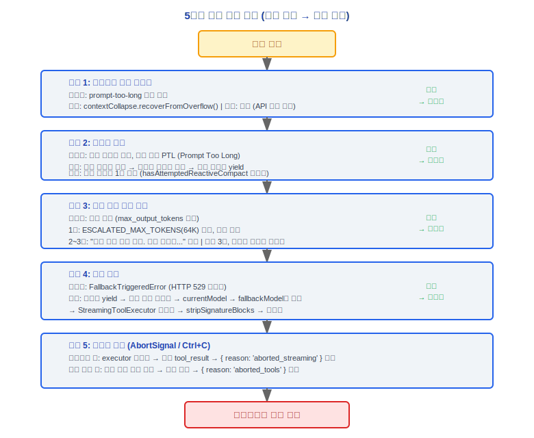

# 오류 복구(Error Recovery) 아키텍처 문서

> Claude Code v2.1.88 오류 복구(Error Recovery) 시스템 완전 기술 참조서

---

## 5계층 복구 계층 구조 (가장 낮은 비용에서 가장 높은 비용 순)

오류 복구(Error Recovery) 시스템은 계층화된 전략을 채택하여, 가장 낮은 비용의 접근법부터 시작하여 점진적으로 더 비싼 복구 방법으로 에스컬레이션합니다.



---

### 설계 철학

#### 왜 통합 오류 처리 대신 5계층 복구인가?

각 계층은 다른 실패 영역을 처리합니다 — 컨텍스트 붕괴 드레인은 컨텍스트 오버플로우를 처리하고(비용 없음), 반응형 컴팩트(Compact)는 프롬프트가 너무 긴 경우를 처리하며(중간 비용, 요약 필요), MaxOutput 복구는 출력 잘라내기를 처리하고(생성 재개), 모델 폴백은 서비스 과부하를 처리하며(모델 전환), 사용자 중단은 복구 불가능한 시나리오를 처리합니다(정상적인 종료). 통합 try/catch는 이러한 실패 영역 간의 복구 전략과 비용 차이를 구분할 수 없습니다. 계층화된 설계는 시스템이 가장 저렴한 복구 접근법부터 시작하여 더 비싼 것으로 에스컬레이션할 수 있게 합니다 — 대부분의 오류는 하위 계층에서 흡수됩니다.

#### 왜 API 재시도 전에 도구 재시도인가?

도구 오류는 가장 일반적(파일 없음, 프로세스 타임아웃, 권한 부족)이고 수정 비용이 가장 낮습니다 — 네트워크 왕복 없이 로컬 재시도만 필요합니다. API 오류(네트워크 지터, 속도 제한, 서비스 과부하)는 HTTP 재시도가 필요하여 더 비용이 많이 들고 지연이 높습니다. 더 저렴한 복구를 먼저 배치하면 불필요한 API 호출 낭비를 방지합니다. 이는 소스 코드에서 찾을 수 있는 "가장 낮은 비용에서 가장 높은 비용 순" 계층화 원칙과도 일치합니다.

#### 왜 max_output_tokens 복구는 3회로 제한되는가?

소스 코드 `query.ts:164`에서 `MAX_OUTPUT_TOKENS_RECOVERY_LIMIT = 3`을 명시적으로 정의하며, 위에 경고가 있습니다: *"rules, ye will be punished with an entire day of debugging and hair pulling"*. 3회를 초과한다는 것은 모델이 주어진 공간 내에서 작업을 완료할 수 없다는 것을 의미합니다 — 복구를 계속하면 단편화된 출력만 생성됩니다. 각 복구는 메타 메시지 `"Output token limit hit. Resume directly..."`를 주입하여 모델이 중단점부터 계속하도록 요구하지만, 컨텍스트는 잘라내기 마커와 복구 지침으로 채워져 출력 품질이 급격히 저하됩니다. 3은 경험적 임계값입니다: 일반적인 긴 출력(예: 대형 파일 생성)을 처리하기에 충분하면서, 무한 루프를 방지합니다. 카운터는 각 새 사용자 턴에서 재설정됩니다.

### 계층 1: 컨텍스트 붕괴 드레인

**트리거 조건**: `prompt-too-long` 보류 오류

**조치**:
```
contextCollapse.recoverFromOverflow()
```
컨텍스트 공간을 확보하기 위해 단계적으로 붕괴된 내용을 드레인합니다.

**비용**: 매우 낮음 -- API 호출 없음, 세분성 제어 유지

**결과**: 성공 → 동일한 요청 재시도 (`continue`)

---

### 계층 2: 반응형 컴팩트(Compact)

**트리거 조건**: 붕괴 드레인이 불충분하거나, 직접 PTL(Prompt Too Long)

**조치**:
```
reactiveCompact.recoverFromPromptTooLong()
```

**처리 단계**:
1. 너무 큰 미디어 콘텐츠 제거
2. 오래된 메시지 요약 및 압축
3. 경계 메시지 yield

**제한**: 루프 반복당 한 번만 허용 (`hasAttemptedReactiveCompact` 플래그가 반복을 방지)

**결과**: 성공 → 요청 재시도; 실패 → 사용자에게 오류 노출

---

### 계층 3: Max Output Tokens 복구

**첫 번째 트리거**:
- `ESCALATED_MAX_TOKENS` 사용 (64K)
- 추가 메시지 주입 없음

**이후 트리거**:
- 메타 메시지 주입: `"Output token limit hit. Resume directly..."`

**카운터 관리**:
- `maxOutputTokensRecoveryCount` 카운터 사용
- 최대 3회 복구 시도 허용
- 카운터는 각 새 턴(사용자 메시지 후)에 재설정
- 3번째 시도 후: 보류 오류 노출

---

### 계층 4: 모델 폴백

**트리거 조건**: `FallbackTriggeredError` (HTTP 529 과부하)

**조치 흐름**:
1. 툼스톤(tombstone) 메시지 yield (고아 assistantMessages 표시)
2. 도구 상태 지우기 (도구 블록 / 도구 결과)
3. `currentModel` → `fallbackModel`로 전환
4. `StreamingToolExecutor` 지우기, 새 인스턴스 생성
5. 사고 서명 제거 (`stripSignatureBlocks`)
6. 전체 요청 재시도 (`continue`)

**로깅**: `tengu_model_fallback_triggered` 이벤트를 기록

---

### 계층 5: 사용자 중단

**트리거 조건**: `AbortSignal` (사용자가 Ctrl+C를 누름)

#### 스트리밍(Streaming) 중:
1. `StreamingToolExecutor` 드레인
2. 대기 중이지만 아직 완료되지 않은 도구에 대해 합성 `tool_result`(오류 타입) 생성
3. `{ reason: 'aborted_streaming' }` 반환

#### 도구 실행 중:
1. 현재 도구가 완료되거나 타임아웃될 때까지 대기
2. 완료된 도구 결과 수집
3. `{ reason: 'aborted_tools' }` 반환

---

## 보류(Withholding) 전략

복구 가능한 오류는 보류되어 즉시 SDK/REPL에 노출되지 않으며, 복구 계층에 수정을 시도할 기회를 줍니다.

### 보류 가능한 오류 타입

| 오류 타입 | 감지 함수 |
|------------|--------------------|
| prompt-too-long | `reactiveCompact.isWithheldPromptTooLong()` |
| max-output-tokens | `isWithheldMaxOutputTokens()` |
| 미디어 크기 초과 | `reactiveCompact.isWithheldMediaSizeError()` |

### 보류 흐름
1. 오류 발생 시, 먼저 복구 가능한지 확인
2. 복구 가능 → 오류 보류, 복구 계층 실행
3. 복구 성공 → 오류 흡수, 정상 흐름 계속
4. 복구 실패 → 원래 오류를 사용자에게 노출

---

## 오류 분류 (errors.ts, 1181줄)

### 핵심 분류 함수

#### classifyAPIError()
API 오류를 미리 정의된 오류 카테고리로 분류합니다.

#### parsePromptTooLongTokenCounts()
오류 메시지에서 실제 토큰 수와 토큰 제한을 추출합니다.

#### getPromptTooLongTokenGap()
제한을 초과하는 토큰 수를 계산합니다.

#### isMediaSizeError()
오류가 미디어 크기 초과 오류인지 감지합니다.

#### getErrorMessageIfRefusal()
거부 메시지 내용을 감지하고 추출합니다.

### 오류 카테고리

| 카테고리 | 트리거 조건 | 설명 |
|----------|-------------------|-------------|
| **API 오류** | 4xx/5xx | 일반 API 오류 |
| **속도 제한** | 429 | 요청 빈도 너무 높음 |
| **용량 부족** | 529 | 서비스 과부하 |
| **연결 오류** | timeout / ECONNRESET | 네트워크 연결 문제 |
| **인증 오류** | 401 | 인증 실패 / 만료 |
| **유효성 검사 오류** | - | 요청 파라미터 유효성 검사 실패 |
| **콘텐츠 정책** | - | 콘텐츠 모더레이션 거부 |
| **미디어 크기** | - | 미디어 파일이 제한 초과 |
| **프롬프트 너무 긴 경우** | - | 컨텍스트가 모델 제한 초과 |

---

## 엔지니어링 실천 가이드

### 오류 복구(Error Recovery) 체인 디버깅

**오류가 발생한 계층을 파악하고 해당 복구 로직을 검사합니다:**

1. **오류 계층 파악**:
   - **도구 계층**: 도구 실행 실패 (파일 없음, 프로세스 타임아웃, 권한 부족) → 도구의 로컬 재시도 로직 확인
   - **API 계층**: HTTP 4xx/5xx 오류 → `withRetry.ts`의 재시도 전략 및 백오프 설정 확인
   - **컨텍스트 계층**: prompt-too-long → 계층 1 (컨텍스트 붕괴)과 계층 2 (반응형 컴팩트(Compact)) 확인
   - **세션 계층**: 사용자 중단 / 복구 불가능 → 계층 5 중단 처리 확인

2. **중요 상태 플래그 검사** (`query.ts`):
   ```
   hasAttemptedReactiveCompact  — 반응형 컴팩트(Compact)가 시도되었는지 여부 (반복당 한 번)
   maxOutputTokensRecoveryCount — 현재 max_output_tokens 복구 횟수 (제한: 3)
   ```

3. **복구 결정 경로 추적**:
   ```
   오류 발생
     → classifyAPIError()가 오류 분류
     → isWithheldPromptTooLong() / isWithheldMaxOutputTokens() / isWithheldMediaSizeError()가 보류 가능 여부 결정
     → 보류 가능 → 복구 계층 진입
     → 보류 불가 → 사용자에게 직접 노출
   ```

### 커스텀 오류 처리

- **도구 실행 실패 주입**: 플러그인(Plugin) 훅(hook) 시스템을 통해 도구 실행 실패 시 커스텀 로직 주입
- **API 오류 차단**: `withRetry.ts`의 재시도 로직은 커스텀 백오프 전략을 지원
- **모델 폴백 설정**: 529 과부하 발생 시 폴백 대상으로 `fallbackModel` 설정

### 복구 메커니즘 테스트

**413 오류를 시뮬레이션하여 반응형 컴팩트(Compact) 테스트:**
1. 과도하게 긴 컨텍스트 구성 (많은 대형 파일 읽기)
2. 시스템이 `reactiveCompact.recoverFromPromptTooLong()`을 트리거하는지 관찰
3. 다음이 올바르게 실행되는지 확인: 너무 큰 미디어 제거 → 오래된 메시지 요약 → 경계 메시지 yield

**429를 시뮬레이션하여 재시도 백오프 테스트:**
1. 짧은 시간 내에 많은 요청을 보내 속도 제한 트리거
2. `withRetry.ts`의 백오프 전략이 올바르게 실행되는지 관찰
3. 소스의 `withRetry.ts:94` TODO 주석을 주의: `SystemAPIErrorMessage` yield를 통한 연결 유지는 임시 해결책

**529를 시뮬레이션하여 모델 폴백 테스트:**
1. 기본 모델이 `FallbackTriggeredError`를 반환할 때
2. 다음이 올바르게 실행되는지 확인: 툼스톤(tombstone) 메시지 yield → 도구 상태 지우기 → 모델 전환 → 사고 서명 제거 → 재시도

### 일반적인 함정

| 함정 | 세부 정보 | 참고 |
|---------|---------|-------|
| max_output_tokens 복구는 최대 3회 | `query.ts:164`에서 `MAX_OUTPUT_TOKENS_RECOVERY_LIMIT = 3` 정의; 위의 주석은 이 규칙을 위반하면 어떤 결과가 생기는지 경고함 | 카운터는 각 새 사용자 턴에 재설정; 3회 초과는 모델이 주어진 공간에서 작업을 완료할 수 없음을 의미 |
| 반응형 컴팩트(Compact)는 루프 반복당 한 번만 | `hasAttemptedReactiveCompact` 플래그가 반복을 방지하고 무한 컴팩트(Compact) 루프를 피함 | 단일 컴팩트(Compact)가 충분하지 않으면 오류는 계속 재시도하는 대신 사용자에게 노출됨 |
| 보류된 오류는 조용히 삼켜질 수 있음 | 복구 가능한 오류는 보류되어 노출되지 않지만, 복구 실패 시 원래 오류를 반드시 노출해야 함 | 디버깅 시 "오류가 성공적으로 복구됨"과 "오류가 조용히 삼켜짐"을 구분 |
| 모델 폴백 후 상태 정리 | 폴백은 `StreamingToolExecutor`를 지우고 사고 서명을 제거해야 함 | 폴백 후 출력이 비정상적이면 `stripSignatureBlocks`가 올바르게 실행되었는지 확인 |
| 중단 신호 처리 | 스트리밍(Streaming) 중 중단은 불완전한 도구에 대해 합성 `tool_result`를 생성해야 함 | 중단 후 잔여 도구 상태가 정리되지 않았는지 확인 |


---

[← 메모리 시스템(Memory System)](../16-记忆系统/memory-system-ko.md) | [인덱스](../README_KO.md) | [텔레메트리(Telemetry) & 분석 →](../18-遥测分析/telemetry-system-ko.md)
