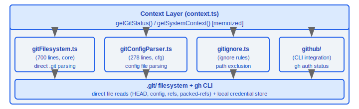
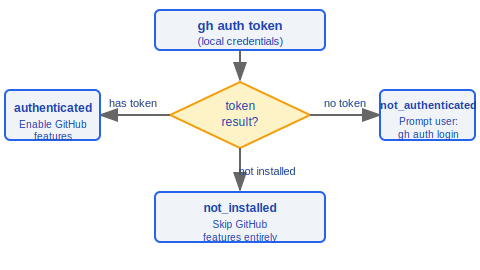
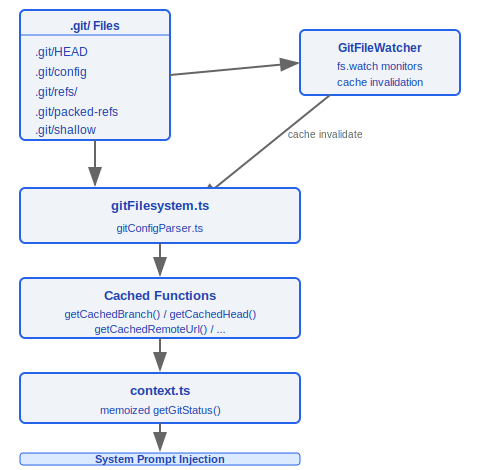

# Git and GitHub Integration

> Claude Code achieves high-performance Git state awareness by directly reading the `.git` filesystem, avoiding frequent `git` process forks. It also integrates the GitHub CLI for authentication detection and injects Git context into LLM conversations.

---

## Architecture Overview



---

## 1. Git Filesystem Parsing (gitFilesystem.ts, 700 lines)

This is the core module of the entire Git integration. It directly parses the `.git` directory structure instead of invoking `git` commands, achieving zero-process-overhead Git state reads.

### Design Philosophy

#### Why parse .gitignore directly instead of calling git commands?

Performance is the primary driver. Claude Code needs Git state information — current branch, HEAD SHA, remote URL, etc. — on every file operation (read, edit, search). If every request forked a `git` subprocess, the process creation overhead (~5–20 ms) multiplied by the frequency of operations would introduce significant latency. `gitFilesystem.ts` (700 lines) reads `.git/HEAD`, `.git/refs/`, `.git/config`, `.git/packed-refs`, and other files directly. Combined with `GitFileWatcher`'s `fs.watch` monitoring and cache invalidation strategy, this achieves near-zero overhead Git state reads. The `resolveGitDirCache` Map avoids repeated directory traversal, and exported functions like `getCachedBranch()` and `getCachedHead()` return results directly from cache. However, for complex operations such as `isPathGitignored`, the system still calls `git check-ignore` — making the right trade-off where accuracy is more important than performance.

### 1.1 Directory Resolution

```typescript
resolveGitDir(startDir: string): Promise<string | null>
```

- Searches upward from `startDir` for a `.git` directory or file
- **Worktree support**: When `.git` is a file, reads the `gitdir:` pointer inside and follows it to the actual `.git` directory
- **Submodule support**: Handles nested structures under `.git/modules/`

### 1.2 Security Validation Functions

| Function | Purpose | Validation Rules |
|----------|---------|-----------------|
| `isSafeRefName(ref)` | Ref name safety check | Blocks path traversal (`../`), argument injection (`--`), shell metacharacters (`` ` `` `$` `\|`) |
| `isValidGitSha(sha)` | SHA hash validation | SHA-1: 40-character hex; SHA-256: 64-character hex |

```typescript
function isSafeRefName(ref: string): boolean {
  // Blocks: path traversal, argument injection, shell metacharacters
  if (ref.includes('..') || ref.startsWith('-')) return false;
  if (/[`$|;&<>(){}[\]!~*?\\]/.test(ref)) return false;
  return /^[a-zA-Z0-9/_.-]+$/.test(ref);
}

function isValidGitSha(sha: string): boolean {
  return /^[0-9a-f]{40}$/.test(sha) || /^[0-9a-f]{64}$/.test(sha);
}
```

### 1.3 HEAD Parsing

```typescript
readGitHead(gitDir: string): Promise<
  | { type: 'branch'; name: string }
  | { type: 'detached'; sha: string }
  | null
>
```

- Reads the contents of the `.git/HEAD` file
- `ref: refs/heads/main` → branch mode
- `abc123...` (hex) → detached HEAD mode

### 1.4 Ref Resolution

```typescript
resolveRef(gitDir: string, ref: string): Promise<string | null>
```

Resolution priority:

1. **Loose refs** — read directly from `.git/refs/heads/<ref>` file
2. **Packed refs** — scan `.git/packed-refs` file line by line for a match

### 1.5 GitFileWatcher Class

A filesystem watcher that monitors Git state changes in real time:

```typescript
class GitFileWatcher {
  // Monitored targets:
  //   .git/HEAD         — current branch/commit
  //   .git/config       — remote URL / default branch
  //   .git/refs/heads/  — branch ref changes
  //   dirty flag cache  — working tree modification state

  watch(gitDir: string): void
  dispose(): void
}
```

**Cache invalidation strategy**: When a file changes, the corresponding cache key is cleared; the next access re-reads from the filesystem.

### 1.6 Exported Cache Interface

| Exported Function | Data Source | Description |
|-------------------|-------------|-------------|
| `getCachedBranch()` | `.git/HEAD` + refs | Current branch name |
| `getCachedHead()` | `.git/HEAD` | SHA pointed to by HEAD |
| `getCachedRemoteUrl()` | `.git/config` | origin remote URL |
| `getCachedDefaultBranch()` | `.git/refs/remotes/` | Default branch (main/master) |
| `isShallowClone()` | `.git/shallow` | Whether the repo is a shallow clone |
| `getWorktreeCountFromFs()` | `.git/worktrees/` | Number of worktrees |

---

## 2. Git Config Parsing (gitConfigParser.ts, 278 lines)

A complete implementation for parsing the Git configuration file format, supporting both `.git/config` and `~/.gitconfig`.

### 2.1 Core Function

```typescript
parseGitConfigValue(
  content: string,
  section: string,
  subsection: string | null,
  key: string
): string | null
```

### 2.2 Parsing Capabilities

**Escape sequence handling**:

| Escape | Output | Description |
|--------|--------|-------------|
| `\n` | newline | newline character |
| `\t` | tab | tab character |
| `\b` | backspace | backspace character |
| `\\` | `\` | literal backslash |
| `\"` | `"` | double quote |

**Subsection handling**:

```ini
[remote "origin"]           ; subsection = "origin" (quoted)
    url = git@github.com:...
    fetch = +refs/heads/*:refs/remotes/origin/*

[branch "main"]             ; subsection = "main"
    remote = origin
    merge = refs/heads/main
```

**Inline comments**: Content after `#` or `;` at the end of a line is ignored (except inside quotes).

---

## 3. Gitignore Management (gitignore.ts)

### 3.1 Path Ignore Check

```typescript
isPathGitignored(filePath: string): Promise<boolean>
```

- Internally calls the `git check-ignore` command
- Used to determine whether a file should be excluded from tool operations

### 3.2 Global Gitignore

```typescript
getGlobalGitignorePath(): string
// Default: ~/.config/git/ignore
// Also checks: core.excludesfile configuration
```

### 3.3 Rule Addition

```typescript
addFileGlobRuleToGitignore(
  gitignorePath: string,
  globPattern: string
): Promise<void>
```

- Appends a new ignore rule to the specified gitignore file
- Automatically handles trailing newlines
- Used by commands such as `/add-ignore`

---

## 4. GitHub CLI Integration (utils/github/)

### 4.1 Authentication Status Detection

```typescript
type GhAuthStatus = 'authenticated' | 'not_authenticated' | 'not_installed'

async function getGhAuthStatus(): Promise<GhAuthStatus>
```

**Implementation details**:

- Uses the `gh auth token` command to detect — **no network calls**, only reads the local credential store
- Three-state determination:
  - Command succeeds and produces output → `'authenticated'`
  - Command succeeds but no token → `'not_authenticated'`
  - Command not found → `'not_installed'`

### 4.2 Usage



#### Why integrate with gh CLI?

GitHub API operations (creating PRs, viewing issues, managing releases) are safer via the `gh` CLI than through direct HTTP calls — `gh` manages its own authentication credential store (`gh auth token` reads local credentials with no network call), so Claude Code never needs to obtain or store the user's GitHub token. The comment in `ghAuthStatus.ts` explains: *"Uses `auth token` instead of `auth status` to detect auth"* — `auth token` is a purely local operation that produces no network requests and does not trigger GitHub API rate limits. The three states (`authenticated` / `not_authenticated` / `not_installed`) allow the system to degrade gracefully: without the gh CLI, GitHub features are skipped entirely rather than raising an error.

---

## 5. Context Injection (context.ts)

Injects Git state information into the LLM system prompt so the model is aware of the current repository state.

### 5.1 Core Functions

```typescript
// Both functions are memoized to avoid redundant computation
function getGitStatus(): Promise<string>
function getSystemContext(): Promise<string>
```

### 5.2 Injected Content


### 5.3 Truncation Strategy

- **Hard limit**: 2000 characters
- When exceeded, the `status` and `recentCommits` sections are truncated
- Ensures the LLM context window is not dominated by Git information

---

## Data Flow Overview



---

## Engineering Practice Guide

### Debugging Git Parsing

**Troubleshooting steps:**

1. **Check the .git directory structure**:
   - `resolveGitDir()` searches upward from the current directory for a `.git` directory or file
   - **Worktree support**: When `.git` is a file, reads the `gitdir:` pointer and follows it to the actual directory
   - **Submodule support**: Handles nested structures under `.git/modules/`
2. **Check cache state**:
   - The `resolveGitDirCache` Map avoids repeated directory traversal
   - `getCachedBranch()`, `getCachedHead()`, `getCachedRemoteUrl()`, etc. return results from cache
   - `GitFileWatcher` monitors file changes via `fs.watch` and triggers cache invalidation
3. **Confirm gitignore rules are parsed correctly**:
   - `isPathGitignored()` internally calls `git check-ignore` (a scenario where accuracy takes priority over performance)
   - Global gitignore path: `~/.config/git/ignore` or the `core.excludesfile` configuration
4. **Verify security**:
   - `isSafeRefName()` blocks path traversal (`../`), argument injection (`--`), and shell metacharacters
   - `isValidGitSha()` validates SHA-1 (40-character hex) or SHA-256 (64-character hex)

**Key performance design**: `gitFilesystem.ts` (700 lines) reads `.git/HEAD`, `.git/refs/`, `.git/config`, and `.git/packed-refs` directly, combined with `GitFileWatcher`'s `fs.watch` monitoring and cache invalidation, achieving near-zero overhead Git state reads.

### GitHub Operations

**Integrated via `gh` CLI — ensure gh is authenticated:**

1. **Check gh authentication status**: `getGhAuthStatus()` uses `gh auth token` for detection (purely local operation, no network calls)
   ```
   authenticated     → enable GitHub features (PR, Issues)
   not_authenticated → prompt gh auth login
   not_installed     → skip GitHub features
   ```
2. **No GitHub token required**: Claude Code does not store GitHub credentials — the `gh` CLI manages its own authentication
3. **Graceful degradation**: Without the gh CLI, GitHub features are skipped entirely rather than raising an error

### Context Injection Configuration

**Git state information injected into the LLM system prompt:**
- Injected fields: branch, defaultBranch, status, recentCommits, gitUser
- **Hard limit of 2000 characters**: When exceeded, the status and recentCommits sections are truncated
- `getGitStatus()` and `getSystemContext()` are both memoized to avoid redundant computation

### Adding gitignore Rules

```typescript
addFileGlobRuleToGitignore(gitignorePath, globPattern)
// Appends a new rule to the gitignore file, automatically handling trailing newlines
// Used by commands such as /add-ignore
```

### Common Pitfalls

| Pitfall | Details | Solution |
|---------|---------|----------|
| Git operations on large repos can be slow | Direct filesystem reads are already optimized for most cases, but `git check-ignore` still requires a process fork | Use cached functions (e.g., `getCachedBranch()`) for high-frequency operations; call git commands only for low-frequency ones |
| gitignore parsing is cached | Changes to gitignore may not take effect immediately | `GitFileWatcher` monitors file changes to trigger cache invalidation, but a brief inconsistency window exists |
| packed-refs parsing | Loose refs take priority over packed-refs, but after `git gc` refs may only exist in packed-refs | `resolveRef()` checks loose refs first, then packed-refs in priority order |
| Shallow clone detection | `isShallowClone()` checks for the existence of `.git/shallow` | Shallow clones have an incomplete git history, which may affect the recentCommits injection |
| Git config parsing | `gitConfigParser.ts` fully handles escape sequences, subsections, and inline comments | Non-standard git config formats may cause parsing errors |
| Worktree support | `.git` may be a file rather than a directory | `resolveGitDir()` handles this automatically, but custom scripts should be aware of this case |


---

[← Sandbox System](../24-沙箱系统/sandbox-system-en.md) | [Index](../README_EN.md) | [Session Management →](../26-会话管理/session-management-en.md)
