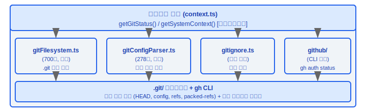
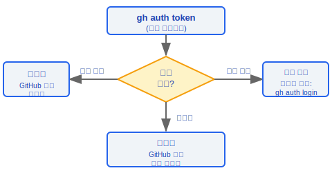
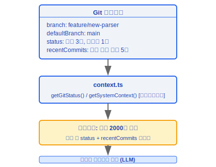
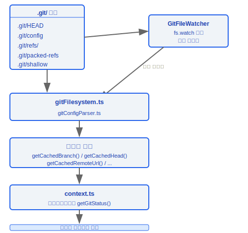

# Git 및 GitHub 통합

> Claude Code는 `.git` 파일 시스템을 직접 읽어 고성능 Git 상태 인식을 구현하며, 빈번한 `git` 프로세스 포크를 방지합니다. 또한 GitHub CLI를 통합하여 인증 감지를 수행하고, Git 컨텍스트를 LLM 대화에 주입합니다.

---

## 아키텍처 개요



---

## 1. Git 파일 시스템 파싱 (gitFilesystem.ts, 700줄)

이 모듈은 전체 Git 통합의 핵심입니다. `git` 명령어를 호출하는 대신 `.git` 디렉터리 구조를 직접 파싱하여 프로세스 오버헤드 없이 Git 상태를 읽어냅니다.

### 설계 철학

#### 왜 git 명령어 대신 .gitignore를 직접 파싱하는가?

성능이 주된 이유입니다. Claude Code는 매 파일 작업(읽기, 편집, 검색)마다 Git 상태 정보—현재 브랜치, HEAD SHA, 원격 URL 등—를 필요로 합니다. 매 요청마다 `git` 서브프로세스를 포크한다면, 프로세스 생성 오버헤드(~5–20ms)가 작업 빈도에 곱해져 상당한 지연을 초래합니다. `gitFilesystem.ts`(700줄)는 `.git/HEAD`, `.git/refs/`, `.git/config`, `.git/packed-refs` 등의 파일을 직접 읽습니다. `GitFileWatcher`의 `fs.watch` 모니터링 및 캐시 무효화 전략과 결합하여 거의 제로에 가까운 오버헤드로 Git 상태를 읽습니다. `resolveGitDirCache` Map은 반복적인 디렉터리 탐색을 방지하며, `getCachedBranch()`와 `getCachedHead()` 같은 내보낸 함수들은 캐시에서 결과를 직접 반환합니다. 단, `isPathGitignored`와 같이 복잡한 작업은 여전히 `git check-ignore`를 호출하는데, 이는 성능보다 정확성이 중요한 경우에 올바른 트레이드오프입니다.

### 1.1 디렉터리 해석

```typescript
resolveGitDir(startDir: string): Promise<string | null>
```

- `startDir`에서 위로 탐색하여 `.git` 디렉터리 또는 파일을 찾습니다
- **워크트리 지원**: `.git`이 파일인 경우, 내부의 `gitdir:` 포인터를 읽어 실제 `.git` 디렉터리를 따라갑니다
- **서브모듈 지원**: `.git/modules/` 아래의 중첩 구조를 처리합니다

### 1.2 보안 검증 함수

| 함수 | 목적 | 검증 규칙 |
|------|------|----------|
| `isSafeRefName(ref)` | ref 이름 안전성 확인 | 경로 탐색(`../`), 인수 주입(`--`), 셸 메타문자(`` ` `` `$` `\|`) 차단 |
| `isValidGitSha(sha)` | SHA 해시 검증 | SHA-1: 40자 16진수; SHA-256: 64자 16진수 |

```typescript
function isSafeRefName(ref: string): boolean {
  // 차단 대상: 경로 탐색, 인수 주입, 셸 메타문자
  if (ref.includes('..') || ref.startsWith('-')) return false;
  if (/[`$|;&<>(){}[\]!~*?\\]/.test(ref)) return false;
  return /^[a-zA-Z0-9/_.-]+$/.test(ref);
}

function isValidGitSha(sha: string): boolean {
  return /^[0-9a-f]{40}$/.test(sha) || /^[0-9a-f]{64}$/.test(sha);
}
```

### 1.3 HEAD 파싱

```typescript
readGitHead(gitDir: string): Promise<
  | { type: 'branch'; name: string }
  | { type: 'detached'; sha: string }
  | null
>
```

- `.git/HEAD` 파일의 내용을 읽습니다
- `ref: refs/heads/main` → 브랜치 모드
- `abc123...` (16진수) → 분리된 HEAD 모드

### 1.4 Ref 해석

```typescript
resolveRef(gitDir: string, ref: string): Promise<string | null>
```

해석 우선순위:

1. **느슨한 ref** — `.git/refs/heads/<ref>` 파일에서 직접 읽기
2. **패킹된 ref** — `.git/packed-refs` 파일을 한 줄씩 스캔하여 일치 항목 찾기

### 1.5 GitFileWatcher 클래스

Git 상태 변경을 실시간으로 모니터링하는 파일 시스템 감시자:

```typescript
class GitFileWatcher {
  // 모니터링 대상:
  //   .git/HEAD         — 현재 브랜치/커밋
  //   .git/config       — 원격 URL / 기본 브랜치
  //   .git/refs/heads/  — 브랜치 ref 변경
  //   dirty flag 캐시   — 작업 트리 수정 상태

  watch(gitDir: string): void
  dispose(): void
}
```

**캐시 무효화 전략**: 파일이 변경되면 해당 캐시 키가 지워지고, 다음 접근 시 파일 시스템에서 다시 읽습니다.

### 1.6 내보낸 캐시 인터페이스

| 내보낸 함수 | 데이터 소스 | 설명 |
|------------|------------|------|
| `getCachedBranch()` | `.git/HEAD` + refs | 현재 브랜치 이름 |
| `getCachedHead()` | `.git/HEAD` | HEAD가 가리키는 SHA |
| `getCachedRemoteUrl()` | `.git/config` | origin 원격 URL |
| `getCachedDefaultBranch()` | `.git/refs/remotes/` | 기본 브랜치 (main/master) |
| `isShallowClone()` | `.git/shallow` | 얕은 클론 여부 |
| `getWorktreeCountFromFs()` | `.git/worktrees/` | 워크트리 수 |

---

## 2. Git 설정 파싱 (gitConfigParser.ts, 278줄)

Git 설정 파일 형식을 파싱하는 완전한 구현체로, `.git/config`와 `~/.gitconfig` 모두를 지원합니다.

### 2.1 핵심 함수

```typescript
parseGitConfigValue(
  content: string,
  section: string,
  subsection: string | null,
  key: string
): string | null
```

### 2.2 파싱 기능

**이스케이프 시퀀스 처리**:

| 이스케이프 | 출력 | 설명 |
|-----------|------|------|
| `\n` | 개행 | 개행 문자 |
| `\t` | 탭 | 탭 문자 |
| `\b` | 백스페이스 | 백스페이스 문자 |
| `\\` | `\` | 리터럴 백슬래시 |
| `\"` | `"` | 큰따옴표 |

**서브섹션 처리**:

```ini
[remote "origin"]           ; 서브섹션 = "origin" (따옴표 포함)
    url = git@github.com:...
    fetch = +refs/heads/*:refs/remotes/origin/*

[branch "main"]             ; 서브섹션 = "main"
    remote = origin
    merge = refs/heads/main
```

**인라인 주석**: 줄 끝에서 `#` 또는 `;` 이후의 내용은 무시됩니다 (따옴표 안의 경우 제외).

---

## 3. Gitignore 관리 (gitignore.ts)

### 3.1 경로 무시 확인

```typescript
isPathGitignored(filePath: string): Promise<boolean>
```

- 내부적으로 `git check-ignore` 명령어를 호출합니다
- 파일이 도구 작업에서 제외되어야 하는지 결정하는 데 사용됩니다

### 3.2 전역 Gitignore

```typescript
getGlobalGitignorePath(): string
// 기본값: ~/.config/git/ignore
// core.excludesfile 설정도 확인합니다
```

### 3.3 규칙 추가

```typescript
addFileGlobRuleToGitignore(
  gitignorePath: string,
  globPattern: string
): Promise<void>
```

- 지정된 gitignore 파일에 새 무시 규칙을 추가합니다
- 후행 개행을 자동으로 처리합니다
- `/add-ignore`와 같은 명령어에서 사용됩니다

---

## 4. GitHub CLI 통합 (utils/github/)

### 4.1 인증 상태 감지

```typescript
type GhAuthStatus = 'authenticated' | 'not_authenticated' | 'not_installed'

async function getGhAuthStatus(): Promise<GhAuthStatus>
```

**구현 세부사항**:

- `gh auth token` 명령어로 감지 — **네트워크 호출 없이**, 로컬 자격증명 저장소만 읽음
- 세 가지 상태 결정:
  - 명령어 성공 및 출력 존재 → `'authenticated'`
  - 명령어 성공했지만 토큰 없음 → `'not_authenticated'`
  - 명령어 없음 → `'not_installed'`

### 4.2 사용법



#### 왜 gh CLI와 통합하는가?

GitHub API 작업(PR 생성, 이슈 보기, 릴리스 관리)은 직접 HTTP 호출보다 `gh` CLI를 통하는 것이 더 안전합니다. `gh`는 자체 인증 자격증명 저장소를 관리(`gh auth token`은 네트워크 호출 없이 로컬 자격증명을 읽음)하므로, Claude Code는 사용자의 GitHub 토큰을 얻거나 저장할 필요가 없습니다. `ghAuthStatus.ts`의 주석에는 *"인증 감지에 `auth status` 대신 `auth token`을 사용합니다"*라고 설명되어 있습니다. `auth token`은 순수한 로컬 작업으로 네트워크 요청이 없고 GitHub API 속도 제한을 유발하지 않습니다. 세 가지 상태(`authenticated` / `not_authenticated` / `not_installed`)를 통해 시스템은 우아하게 저하됩니다. gh CLI 없이는 오류를 발생시키는 대신 GitHub 기능을 완전히 건너뜁니다.

---

## 5. 컨텍스트 주입 (context.ts)

Git 상태 정보를 LLM 시스템 프롬프트에 주입하여 모델이 현재 저장소 상태를 인식할 수 있게 합니다.

### 5.1 핵심 함수

```typescript
// 두 함수 모두 중복 계산을 방지하기 위해 메모이제이션됩니다
function getGitStatus(): Promise<string>
function getSystemContext(): Promise<string>
```

### 5.2 주입되는 내용



### 5.3 잘라내기 전략

- **하드 제한**: 2000자
- 초과 시 `status`와 `recentCommits` 섹션이 잘립니다
- LLM 컨텍스트 윈도우가 Git 정보에 의해 지배받지 않도록 보장합니다

---

## 데이터 흐름 개요



---

## 엔지니어링 실천 가이드

### Git 파싱 디버깅

**문제 해결 단계:**

1. **.git 디렉터리 구조 확인**:
   - `resolveGitDir()`은 현재 디렉터리에서 위로 탐색하여 `.git` 디렉터리 또는 파일을 찾습니다
   - **워크트리 지원**: `.git`이 파일인 경우, `gitdir:` 포인터를 읽어 실제 디렉터리를 따라갑니다
   - **서브모듈 지원**: `.git/modules/` 아래의 중첩 구조를 처리합니다
2. **캐시 상태 확인**:
   - `resolveGitDirCache` Map은 반복적인 디렉터리 탐색을 방지합니다
   - `getCachedBranch()`, `getCachedHead()`, `getCachedRemoteUrl()` 등은 캐시에서 결과를 반환합니다
   - `GitFileWatcher`는 `fs.watch`로 파일 변경을 모니터링하고 캐시 무효화를 트리거합니다
3. **gitignore 규칙이 올바르게 파싱되는지 확인**:
   - `isPathGitignored()`는 내부적으로 `git check-ignore`를 호출합니다 (성능보다 정확성이 우선인 시나리오)
   - 전역 gitignore 경로: `~/.config/git/ignore` 또는 `core.excludesfile` 설정
4. **보안 검증**:
   - `isSafeRefName()`은 경로 탐색(`../`), 인수 주입(`--`), 셸 메타문자를 차단합니다
   - `isValidGitSha()`는 SHA-1 (40자 16진수) 또는 SHA-256 (64자 16진수)을 검증합니다

**핵심 성능 설계**: `gitFilesystem.ts`(700줄)는 `.git/HEAD`, `.git/refs/`, `.git/config`, `.git/packed-refs`를 직접 읽으며, `GitFileWatcher`의 `fs.watch` 모니터링 및 캐시 무효화와 결합하여 거의 제로에 가까운 오버헤드로 Git 상태를 읽습니다.

### GitHub 작업

**`gh` CLI를 통해 통합됩니다 — gh 인증 확인:**

1. **gh 인증 상태 확인**: `getGhAuthStatus()`는 `gh auth token`으로 감지합니다 (순수한 로컬 작업, 네트워크 호출 없음)
   ```
   authenticated     → GitHub 기능 활성화 (PR, 이슈)
   not_authenticated → gh auth login 프롬프트
   not_installed     → GitHub 기능 건너뜀
   ```
2. **GitHub 토큰 불필요**: Claude Code는 GitHub 자격증명을 저장하지 않습니다 — `gh` CLI가 자체 인증을 관리합니다
3. **우아한 저하**: gh CLI 없이는 오류 발생 대신 GitHub 기능을 완전히 건너뜁니다

### 컨텍스트 주입 설정

**LLM 시스템 프롬프트에 주입되는 Git 상태 정보:**
- 주입 필드: branch, defaultBranch, status, recentCommits, gitUser
- **2000자 하드 제한**: 초과 시 status와 recentCommits 섹션이 잘립니다
- `getGitStatus()`와 `getSystemContext()` 모두 메모이제이션되어 중복 계산을 방지합니다

### gitignore 규칙 추가

```typescript
addFileGlobRuleToGitignore(gitignorePath, globPattern)
// gitignore 파일에 새 규칙을 추가하며, 후행 개행을 자동으로 처리합니다
// /add-ignore 같은 명령어에서 사용됩니다
```

### 흔한 함정

| 함정 | 세부사항 | 해결책 |
|------|---------|--------|
| 대형 저장소에서 Git 작업이 느릴 수 있음 | 직접 파일 시스템 읽기는 대부분의 경우 이미 최적화되었지만, `git check-ignore`는 여전히 프로세스 포크가 필요 | 고빈도 작업에는 캐시 함수(예: `getCachedBranch()`) 사용; git 명령어는 저빈도 작업에만 호출 |
| gitignore 파싱이 캐시됨 | gitignore 변경 사항이 즉시 반영되지 않을 수 있음 | `GitFileWatcher`가 파일 변경을 모니터링하여 캐시 무효화를 트리거하지만, 짧은 불일치 창이 존재함 |
| packed-refs 파싱 | 느슨한 ref가 packed-refs보다 우선하지만, `git gc` 이후에는 ref가 packed-refs에만 존재할 수 있음 | `resolveRef()`는 느슨한 ref를 먼저 확인한 후 우선순위대로 packed-refs를 확인 |
| 얕은 클론 감지 | `isShallowClone()`은 `.git/shallow`의 존재를 확인 | 얕은 클론은 불완전한 git 히스토리를 가지며, recentCommits 주입에 영향을 줄 수 있음 |
| Git 설정 파싱 | `gitConfigParser.ts`는 이스케이프 시퀀스, 서브섹션, 인라인 주석을 완전히 처리 | 비표준 git 설정 형식은 파싱 오류를 일으킬 수 있음 |
| 워크트리 지원 | `.git`이 디렉터리가 아닌 파일일 수 있음 | `resolveGitDir()`이 자동으로 처리하지만, 커스텀 스크립트는 이 경우를 인식해야 함 |


---

[← 샌드박스 시스템](../24-沙箱系统/sandbox-system-ko.md) | [목차](../README_KO.md) | [세션 관리 →](../26-会话管理/session-management-ko.md)
