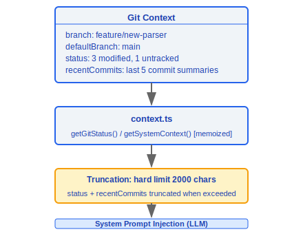

# Git 与 GitHub 集成

> Claude Code 通过直接读取 `.git` 文件系统实现高性能 Git 状态感知,避免频繁 fork `git` 进程。同时集成 GitHub CLI 提供认证检测,并将 Git 上下文注入到 LLM 对话中。

---

## 架构总览


---

## 1. Git 文件系统解析 (gitFilesystem.ts, 700行)

这是整个 Git 集成的核心模块,直接解析 `.git` 目录结构而非调用 `git` 命令,实现零进程开销的 Git 状态读取。

### 设计理念

#### 为什么解析 .gitignore 而不直接调 git 命令？

性能是核心驱动力。Claude Code 在每次文件操作（读取、编辑、搜索）时都需要 Git 状态信息——当前分支、HEAD SHA、远程 URL 等。如果每次都 fork `git` 子进程，进程创建开销（约 5-20ms）乘以高频操作次数会造成显著延迟。`gitFilesystem.ts`（700 行）直接读取 `.git/HEAD`、`.git/refs/`、`.git/config`、`.git/packed-refs` 等文件，配合 `GitFileWatcher` 的 `fs.watch` 监控和缓存失效策略，实现了近乎零开销的 Git 状态读取。`resolveGitDirCache` Map 避免重复的目录遍历，`getCachedBranch()`、`getCachedHead()` 等导出函数直接从缓存返回结果。不过对于复杂操作（如 `isPathGitignored`），系统仍然调用 `git check-ignore`——在准确性比性能更重要的场景做出正确的取舍。

### 1.1 目录解析

```typescript
resolveGitDir(startDir: string): Promise<string | null>
```

- 从 `startDir` 向上查找 `.git` 目录或文件
- **Worktree 支持**: 当 `.git` 是文件时,读取其中的 `gitdir:` 指针,跟随到实际 `.git` 目录
- **Submodule 支持**: 处理 `.git/modules/` 下的嵌套结构

### 1.2 安全验证函数

| 函数 | 用途 | 验证规则 |
|------|------|----------|
| `isSafeRefName(ref)` | 引用名安全检查 | 阻止路径穿越 (`../`), 参数注入 (`--`), shell 元字符 (`` ` `` `$` `\|`) |
| `isValidGitSha(sha)` | SHA 哈希验证 | SHA-1: 40位 hex; SHA-256: 64位 hex |

```typescript
function isSafeRefName(ref: string): boolean {
  // 阻止: 路径穿越, 参数注入, shell 元字符
  if (ref.includes('..') || ref.startsWith('-')) return false;
  if (/[`$|;&<>(){}[\]!~*?\\]/.test(ref)) return false;
  return /^[a-zA-Z0-9/_.-]+$/.test(ref);
}

function isValidGitSha(sha: string): boolean {
  return /^[0-9a-f]{40}$/.test(sha) || /^[0-9a-f]{64}$/.test(sha);
}
```

### 1.3 HEAD 解析

```typescript
readGitHead(gitDir: string): Promise<
  | { type: 'branch'; name: string }
  | { type: 'detached'; sha: string }
  | null
>
```

- 读取 `.git/HEAD` 文件内容
- `ref: refs/heads/main` → 分支模式
- `abc123...` (hex) → detached HEAD 模式

### 1.4 引用解析

```typescript
resolveRef(gitDir: string, ref: string): Promise<string | null>
```

解析优先级:

1. **松散引用** — `.git/refs/heads/<ref>` 文件直接读取
2. **Packed refs** — `.git/packed-refs` 文件逐行扫描匹配

### 1.5 GitFileWatcher 类

实时监控 Git 状态变化的文件系统观察器:

```typescript
class GitFileWatcher {
  // 监控目标:
  //   .git/HEAD         — 当前分支/提交
  //   .git/config       — 远程 URL / 默认分支
  //   .git/refs/heads/  — 分支引用变化
  //   dirty 标记缓存    — 工作区修改状态

  watch(gitDir: string): void
  dispose(): void
}
```

**缓存失效策略**: 文件变化时清除对应缓存键,下次访问时重新从文件系统读取。

### 1.6 导出的缓存接口

| 导出函数 | 数据来源 | 说明 |
|----------|----------|------|
| `getCachedBranch()` | `.git/HEAD` + refs | 当前分支名 |
| `getCachedHead()` | `.git/HEAD` | HEAD 指向的 SHA |
| `getCachedRemoteUrl()` | `.git/config` | origin 远程 URL |
| `getCachedDefaultBranch()` | `.git/refs/remotes/` | 默认分支 (main/master) |
| `isShallowClone()` | `.git/shallow` | 是否浅克隆 |
| `getWorktreeCountFromFs()` | `.git/worktrees/` | worktree 数量 |

---

## 2. Git 配置解析 (gitConfigParser.ts, 278行)

完整实现 Git 配置文件格式解析,支持 `.git/config` 和 `~/.gitconfig`。

### 2.1 核心函数

```typescript
parseGitConfigValue(
  content: string,
  section: string,
  subsection: string | null,
  key: string
): string | null
```

### 2.2 解析能力

**转义序列处理**:

| 转义 | 输出 | 说明 |
|------|------|------|
| `\n` | 换行符 | newline |
| `\t` | 制表符 | tab |
| `\b` | 退格符 | backspace |
| `\\` | `\` | 反斜杠本身 |
| `\"` | `"` | 双引号 |

**Subsection 处理**:

```ini
[remote "origin"]           ; subsection = "origin" (带引号)
    url = git@github.com:...
    fetch = +refs/heads/*:refs/remotes/origin/*

[branch "main"]             ; subsection = "main"
    remote = origin
    merge = refs/heads/main
```

**内联注释**: 以 `#` 或 `;` 开始的行尾内容被忽略 (引号内除外)。

---

## 3. Gitignore 管理 (gitignore.ts)

### 3.1 路径忽略检查

```typescript
isPathGitignored(filePath: string): Promise<boolean>
```

- 内部调用 `git check-ignore` 命令
- 用于判断文件是否应被排除在工具操作之外

### 3.2 全局 Gitignore

```typescript
getGlobalGitignorePath(): string
// 默认: ~/.config/git/ignore
// 也检查: core.excludesfile 配置
```

### 3.3 规则添加

```typescript
addFileGlobRuleToGitignore(
  gitignorePath: string,
  globPattern: string
): Promise<void>
```

- 将新的忽略规则追加到指定的 gitignore 文件
- 自动处理文件末尾换行
- 用于 `/add-ignore` 等命令场景

---

## 4. GitHub CLI 集成 (utils/github/)

### 4.1 认证状态检测

```typescript
type GhAuthStatus = 'authenticated' | 'not_authenticated' | 'not_installed'

async function getGhAuthStatus(): Promise<GhAuthStatus>
```

**实现细节**:

- 使用 `gh auth token` 命令检测 — **无网络调用**,仅读取本地凭证存储
- 三种状态判断:
  - 命令成功且有输出 → `'authenticated'`
  - 命令成功但无 token → `'not_authenticated'`
  - 命令不存在 → `'not_installed'`

### 4.2 用途


#### 为什么 gh CLI 集成？

GitHub API 操作（创建 PR、查看 issues、管理 releases）通过 `gh` CLI 比直接 HTTP 调用更安全——`gh` 管理自己的认证凭证存储（`gh auth token` 读取本地凭证，无需网络调用），Claude Code 不需要获取或存储用户的 GitHub token。源码 `ghAuthStatus.ts` 注释说明：*"Uses `auth token` instead of `auth status` to detect auth"*——`auth token` 是纯本地操作，不产生网络请求，不触发 GitHub API rate limit。三种状态（`authenticated` / `not_authenticated` / `not_installed`）让系统优雅降级：没有 gh CLI 时完全跳过 GitHub 功能，而非报错。

---

## 5. 上下文注入 (context.ts)

将 Git 状态信息注入到 LLM 系统提示中,让模型了解当前仓库状态。

### 5.1 核心函数

```typescript
// 两个函数均为 memoized, 避免重复计算
function getGitStatus(): Promise<string>
function getSystemContext(): Promise<string>
```

### 5.2 注入内容



### 5.3 截断策略

- **硬上限**: 2000 字符
- 超出时截断 `status` 和 `recentCommits` 部分
- 确保 LLM 上下文窗口不被 Git 信息过度占用

---

## 数据流总览


---

## 工程实践指南

### 调试 Git 解析

**排查步骤：**

1. **检查 .git 目录结构**：
   - `resolveGitDir()` 从当前目录向上查找 `.git` 目录或文件
   - **Worktree 支持**：当 `.git` 是文件时，读取 `gitdir:` 指针跟随到实际目录
   - **Submodule 支持**：处理 `.git/modules/` 下的嵌套结构
2. **检查缓存状态**：
   - `resolveGitDirCache` Map 避免重复目录遍历
   - `getCachedBranch()`、`getCachedHead()`、`getCachedRemoteUrl()` 等从缓存返回结果
   - `GitFileWatcher` 通过 `fs.watch` 监控文件变更，触发缓存失效
3. **确认 gitignore 规则是否正确解析**：
   - `isPathGitignored()` 内部调用 `git check-ignore` 命令（准确性优先于性能的场景）
   - 全局 gitignore 路径：`~/.config/git/ignore` 或 `core.excludesfile` 配置
4. **验证安全性**：
   - `isSafeRefName()` 阻止路径穿越（`../`）、参数注入（`--`）、shell 元字符
   - `isValidGitSha()` 验证 SHA-1（40 位 hex）或 SHA-256（64 位 hex）

**关键性能设计**：`gitFilesystem.ts`（700 行）直接读取 `.git/HEAD`、`.git/refs/`、`.git/config`、`.git/packed-refs`，配合 `GitFileWatcher` 的 `fs.watch` 监控和缓存失效，实现近零开销的 Git 状态读取。

### GitHub 操作

**通过 `gh` CLI 集成——确保 gh 已认证：**

1. **检查 gh 认证状态**：`getGhAuthStatus()` 使用 `gh auth token` 检测（纯本地操作，无网络调用）
   ```
   authenticated     → 启用 GitHub 功能（PR, Issues）
   not_authenticated → 提示 gh auth login
   not_installed     → 跳过 GitHub 功能
   ```
2. **不需要 GitHub token**：Claude Code 不存储 GitHub 凭证——`gh` CLI 管理自己的认证
3. **优雅降级**：没有 gh CLI 时完全跳过 GitHub 功能而非报错

### 上下文注入配置

**Git 状态信息注入到 LLM 系统提示中：**
- 注入内容：branch、defaultBranch、status、recentCommits、gitUser
- **硬上限 2000 字符**：超出时截断 status 和 recentCommits 部分
- `getGitStatus()` 和 `getSystemContext()` 均为 memoized，避免重复计算

### 添加 gitignore 规则

```typescript
addFileGlobRuleToGitignore(gitignorePath, globPattern)
// 将新规则追加到 gitignore 文件，自动处理末尾换行
// 用于 /add-ignore 等命令场景
```

### 常见陷阱

| 陷阱 | 详情 | 解决方案 |
|------|------|----------|
| 大仓库的 git 操作可能很慢 | 直接文件系统读取已优化大部分场景，但 `git check-ignore` 仍需 fork 进程 | 对高频操作使用缓存（`getCachedBranch()` 等），低频操作才调用 git 命令 |
| gitignore 解析有缓存 | 修改 gitignore 后可能不立即生效 | `GitFileWatcher` 监控文件变更触发缓存失效，但存在短暂的不一致窗口 |
| packed-refs 解析 | 松散引用优先于 packed-refs，但 git gc 后引用可能只在 packed-refs 中 | `resolveRef()` 按优先级先查松散引用再查 packed-refs |
| 浅克隆检测 | `isShallowClone()` 检查 `.git/shallow` 文件存在 | 浅克隆仓库的 git 历史不完整，可能影响 recentCommits 注入 |
| Git 配置解析 | `gitConfigParser.ts` 完整处理转义序列、subsection、内联注释 | 非标准 git 配置格式可能导致解析异常 |
| worktree 支持 | `.git` 可能是文件而非目录 | `resolveGitDir()` 自动处理，但自定义脚本需注意此情况 |


---

[← 沙箱系统](../24-沙箱系统/sandbox-system.md) | [目录](../README.md) | [会话管理 →](../26-会话管理/session-management.md)
