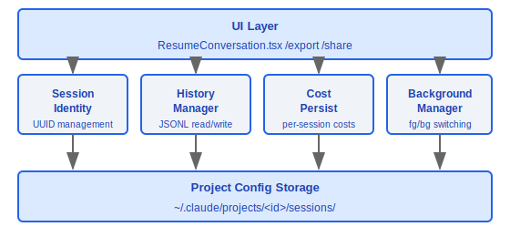
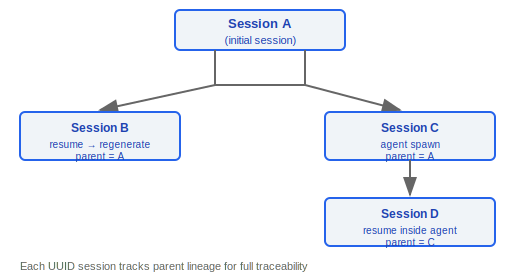
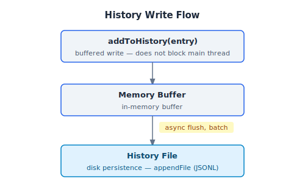
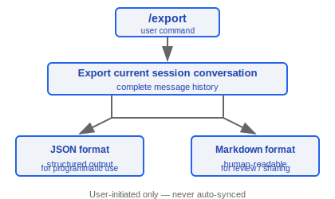
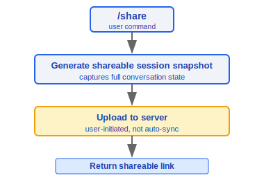
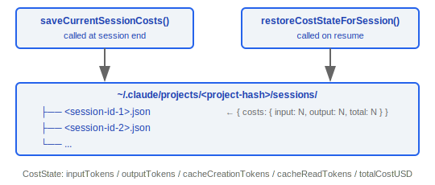
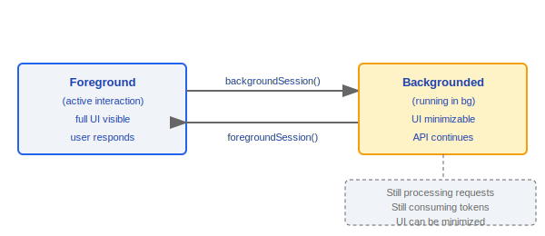

# Session Management

> Claude Code's session management system handles session identification, conversation history read/write, session resumption, export/sharing, cost persistence, and backgrounding. Each session is uniquely identified by a UUID and supports parent-child session tracking.

---

## Architecture Overview



---

## 1. Session Identity (bootstrap/state.ts)

### 1.1 Type Definition

```typescript
type SessionId = string  // UUID v4 format
```

### 1.2 Core Functions

```typescript
function getSessionId(): SessionId
// Returns the unique identifier for the current session

function regenerateSessionId(parentSessionId?: SessionId): SessionId
// Generates a new session ID
// Optional: records parentSessionId to track session derivation relationships
```

### 1.3 Session Hierarchy



---

## 2. History Management (history.ts)

The history management module handles persistent read/write of conversation messages, using an async buffer strategy to optimize write performance.

### 2.1 Constants

| Constant | Value | Purpose |
|----------|-------|---------|
| `MAX_HISTORY_ITEMS` | `100` | Maximum number of entries in the history list |
| `MAX_PASTED_CONTENT_LENGTH` | `1024` | Maximum length for pasted content references |

### 2.2 Read API

```typescript
function makeHistoryReader(): AsyncGenerator<HistoryEntry>
// async generator, reads history entries in reverse order
// Most recent conversations appear first

function getTimestampedHistory(): Promise<HistoryEntry[]>
// Returns a timestamped history list
// Automatically deduplicates (based on sessionId)
```

**Read Flow**:


### 2.3 Write API

```typescript
function addToHistory(entry: HistoryEntry): void
// Buffered write: first adds to in-memory buffer, async flush to disk
// Benefit: does not block main thread, batch writes reduce I/O

function removeLastFromHistory(): Promise<void>
// Removes the most recent history entry
```

**Write Flow**:



### 2.4 Pasted Content References

Handles large blocks of text or images pasted by the user, preventing history file bloat:

```typescript
function formatPastedTextRef(text: string): string
// When text exceeds MAX_PASTED_CONTENT_LENGTH (1024 chars)
// Generates a reference marker instead of storing inline

function formatImageRef(imagePath: string): string
// Images stored as path references

function expandPastedTextRefs(message: string): string
// Expands reference markers back to actual content upon resume
```

---

## 3. Session Resumption

### 3.1 ResumeConversation.tsx

React component responsible for restoring a session from history:

```typescript
// Resume flow:
// 1. Load message list from history file
// 2. Rebuild conversation context (messages array)
// 3. Restore cost state (costState)
// 4. Remount tool state
```

### 3.2 useTeleportResume Hook

```typescript
function useTeleportResume(): {
  canResume: boolean
  resumeSession: (sessionId: SessionId) => Promise<void>
}
```

- Handles session resumption triggered from other entry points (CLI flag `--resume`, UI selection)
- Ensures state consistency during the resume process

### 3.3 Resume Flow Diagram


---

## 4. Session Export and Sharing

### 4.1 /export Command



### 4.2 /share Command



---

## 5. Cost Persistence

### 5.1 Core Functions

```typescript
function saveCurrentSessionCosts(sessionId: SessionId): void
// Saves the API costs for the current session to the project config

function restoreCostStateForSession(sessionId: SessionId): CostState | null
// Restores the cost state for the specified session from the project config
```

### 5.2 Storage Structure



### 5.3 Cost State Data

```typescript
interface CostState {
  inputTokens: number
  outputTokens: number
  cacheCreationTokens: number
  cacheReadTokens: number
  totalCostUSD: number
}
```

- Stored in isolation by `sessionId`
- Automatically loaded when a session is resumed, ensuring cost counts are continuous

---

## 6. Session Backgrounding

### 6.1 useSessionBackgrounding Hook

```typescript
function useSessionBackgrounding(): {
  isBackgrounded: boolean
  backgroundSession: () => void
  foregroundSession: () => void
}
```

### 6.2 Backgrounding Lifecycle



- Backgrounding does not interrupt API requests; the session continues running
- State is synced when brought back to foreground
- Used for long-running tasks (large-scale refactoring, test execution, etc.)

---

## Key Design Decisions

| Decision | Rationale |
|----------|-----------|
| UUID as session ID | Globally unique, supports distributed scenarios |
| Async buffered history writes | Avoids I/O blocking the main thread |
| Pasted content referencing | Prevents history file bloat |
| Store costs by sessionId | Session isolation, precise restoration on resume |
| Parent-child session tracking | Supports tracing sessions derived from agents |

### Design Philosophy

#### Why is session data persisted locally rather than in the cloud?

Conversations may contain sensitive code, internal APIs, and business logic — local storage gives users complete control over where their data goes. Session data is stored under `~/.claude/projects/<project-hash>/sessions/` and is never automatically uploaded to any remote service. In the source code, `bootstrap/state.ts` provides a `--no-session-persistence` flag that allows disk writes to be completely disabled in print mode, further enhancing privacy control.

#### Why are session export and sharing supported?

Collaborative scenarios require sharing debugging processes with colleagues — the `/export` command supports both JSON (structured) and Markdown (human-readable) formats, and the `/share` command generates a shareable link. Export is a user-initiated action, not automatic syncing, ensuring users have complete control over where their data goes.

#### Why does session resumption use JSONL instead of JSON?

JSONL (one JSON object per line) supports append-only writes — each message appends a single line without needing to read, parse, modify, and rewrite the entire file. This provides two key advantages: (1) Write performance — the buffered write in `addToHistory` only needs `appendFile`, rather than rewriting the entire JSON file; (2) Crash recovery — a process crash loses at most the last unflushed message, whereas with JSON format a missing `]` at the end of the file causes the entire file to fail parsing. In the source code, `makeHistoryReader()` uses an async generator to parse JSONL line by line, so memory usage is independent of file size. Both `conversationRecovery.ts` and `cli/print.ts` explicitly support `.jsonl` paths as input for `--resume`.

---

## Engineering Practice Guide

### Session Resumption

**Resume methods:**

1. **Resume the most recent session**: Use the `--continue` or `-c` flag
   ```bash
   claude --continue          # Resume the most recent session
   ```
2. **Resume a specific session**: Use `--resume <id>` to specify the session ID
   ```bash
   claude --resume <session-id>   # Resume a specific session
   ```
3. **Resume from a JSONL file**: Specify the `.jsonl` path directly
   ```bash
   claude --resume /path/to/session.jsonl
   ```

**Resume flow (`ResumeConversation.tsx`):**
1. Load the message list from the history file
2. Rebuild the conversation context (messages array)
3. Restore the cost state (costState)
4. Remount tool state

**Note**: `--session-id` can only be used together with `--continue`/`--resume` when `--fork-session` is also specified (checked at `main.tsx:1279` in the source code)

### Debugging Session Loss

**Troubleshooting steps:**

1. **Check if the JSONL file exists**:
   ```bash
   ls -la ~/.claude/projects/<project-hash>/sessions/
   ```
2. **Check write permissions**: The directory and files require read/write permissions
3. **Check history.jsonl**: The main history file is located at `~/.claude/history.jsonl`
4. **Validate JSONL format**: Each line should be an independent JSON object; file corruption only loses the last entry
5. **Check sessionId**: UUID v4 format; `getSessionId()` returns the current session ID
6. **Check parent-child relationships**: `regenerateSessionId(parentSessionId?)` records session derivation relationships

**Async buffered write mechanism**:
- `addToHistory()` first adds to the in-memory buffer, then async flushes to disk
- Benefit: does not block the main thread, batch writes reduce I/O
- Risk: a process crash may lose data in the buffer that has not yet been flushed

### Session Export

**Export formats:**

| Command | Format | Purpose |
|---------|--------|---------|
| `/export` | JSON (structured) or Markdown (human-readable) | Save conversation locally |
| `/share` | Online snapshot + share link | Collaborative sharing |

**Export is a user-initiated action** — it does not sync automatically, ensuring users have complete control over where their data goes.

### Pasted Content Handling

- When text exceeds `MAX_PASTED_CONTENT_LENGTH` (1024 characters), a reference marker is generated instead of storing inline
- Images are stored as path references
- Upon resume, reference markers are expanded via `expandPastedTextRefs()`

### Session Backgrounding

- `useSessionBackgrounding()` supports moving a session to the background to continue running
- Backgrounding does not interrupt API requests — the session continues consuming tokens
- Suitable for long-running tasks (large-scale refactoring, test execution, etc.)
- State is synced when brought back to foreground

### Common Pitfalls

| Pitfall | Details | Solution |
|---------|---------|----------|
| JSONL append writes — file corruption only loses the last entry | A process crash loses at most the last unflushed message | Safer than JSON format (a missing `]` at the end makes the entire JSON file unparseable) |
| Large session files may slow startup | `makeHistoryReader()` uses an async generator for line-by-line parsing, but large files still have I/O overhead | `MAX_HISTORY_ITEMS = 100` limits the history list size |
| Cost state is isolated by sessionId | The corresponding cost state is automatically loaded when resuming a session | Ensure `saveCurrentSessionCosts()` is called when the session ends |
| `--no-session-persistence` | Completely disables disk writes in print mode | Suitable for high-privacy or one-off use scenarios |
| History deduplication | `getTimestampedHistory()` deduplicates based on sessionId | Multiple writes with the same sessionId only retain the most recent entry |


---

[← Git & GitHub](../25-Git与GitHub/git-github-en.md) | [Index](../README_EN.md) | [Keybindings & Input →](../27-键绑定与输入/keybinding-system-en.md)
