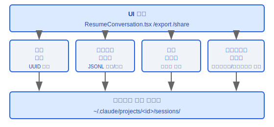
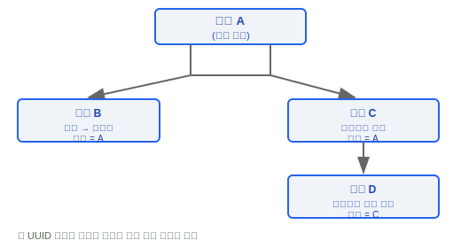
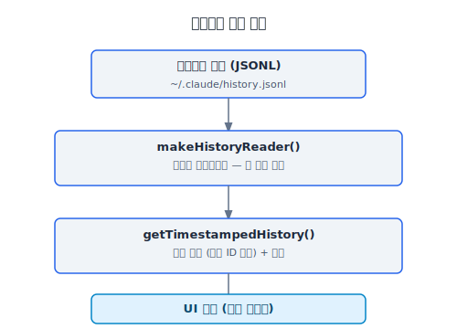
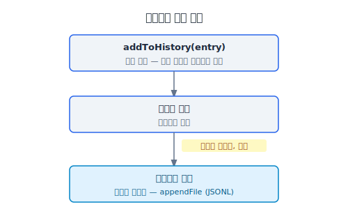
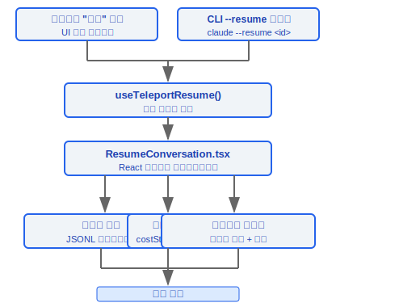
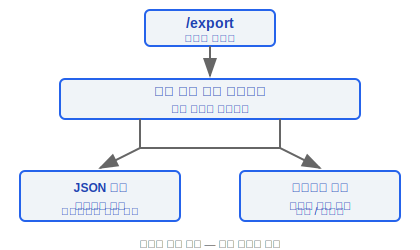
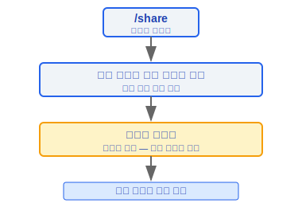
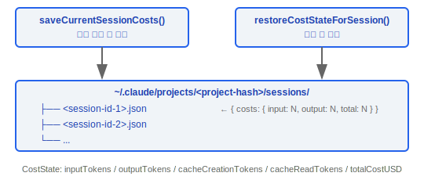
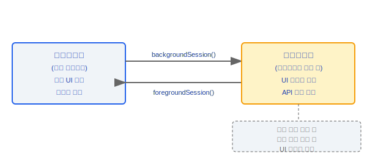

# 세션 관리(Session Management)

> Claude Code의 세션 관리(Session Management) 시스템은 세션 식별, 대화 히스토리 읽기/쓰기, 세션 재개, 내보내기/공유, 비용 지속성, 백그라운드 실행을 처리합니다. 각 세션(Session)은 UUID로 고유하게 식별되며, 부모-자식 세션 추적을 지원합니다.

---

## 아키텍처 개요



---

## 1. 세션 식별 (bootstrap/state.ts)

### 1.1 타입 정의

```typescript
type SessionId = string  // UUID v4 형식
```

### 1.2 핵심 함수

```typescript
function getSessionId(): SessionId
// 현재 세션의 고유 식별자를 반환합니다

function regenerateSessionId(parentSessionId?: SessionId): SessionId
// 새 세션 ID를 생성합니다
// 선택적: 세션 파생 관계 추적을 위해 parentSessionId를 기록합니다
```

### 1.3 세션 계층 구조



---

## 2. 히스토리 관리(History Management) (history.ts)

히스토리 관리 모듈은 대화 메시지의 영속적 읽기/쓰기를 처리하며, 비동기 버퍼 전략으로 쓰기 성능을 최적화합니다.

### 2.1 상수

| 상수 | 값 | 목적 |
|------|-----|------|
| `MAX_HISTORY_ITEMS` | `100` | 히스토리 목록의 최대 항목 수 |
| `MAX_PASTED_CONTENT_LENGTH` | `1024` | 붙여넣은 콘텐츠 참조의 최대 길이 |

### 2.2 읽기 API

```typescript
function makeHistoryReader(): AsyncGenerator<HistoryEntry>
// 비동기 제너레이터, 히스토리 항목을 역순으로 읽습니다
// 가장 최근 대화가 먼저 나타납니다

function getTimestampedHistory(): Promise<HistoryEntry[]>
// 타임스탬프가 있는 히스토리 목록을 반환합니다
// 자동으로 중복 제거됩니다 (sessionId 기반)
```

**읽기 흐름**:



### 2.3 쓰기 API

```typescript
function addToHistory(entry: HistoryEntry): void
// 버퍼링된 쓰기: 먼저 인메모리 버퍼에 추가하고, 비동기로 디스크에 플러시합니다
// 장점: 메인 스레드를 차단하지 않으며, 배치 쓰기로 I/O를 줄입니다

function removeLastFromHistory(): Promise<void>
// 가장 최근 히스토리 항목을 제거합니다
```

**쓰기 흐름**:



### 2.4 붙여넣은 콘텐츠 참조

사용자가 붙여넣은 대용량 텍스트나 이미지를 처리하여 히스토리 파일 비대화를 방지합니다:

```typescript
function formatPastedTextRef(text: string): string
// 텍스트가 MAX_PASTED_CONTENT_LENGTH(1024자)를 초과할 때
// 인라인으로 저장하는 대신 참조 마커를 생성합니다

function formatImageRef(imagePath: string): string
// 이미지를 경로 참조로 저장합니다

function expandPastedTextRefs(message: string): string
// 재개 시 참조 마커를 실제 콘텐츠로 확장합니다
```

---

## 3. 세션 재개

### 3.1 ResumeConversation.tsx

히스토리에서 세션을 복원하는 React 컴포넌트:

```typescript
// 재개 흐름:
// 1. 히스토리 파일에서 메시지 목록 로드
// 2. 대화 컨텍스트 재구성 (messages 배열)
// 3. 비용 상태(costState) 복원
// 4. 도구 상태 재마운트
```

### 3.2 useTeleportResume 훅(Hook)

```typescript
function useTeleportResume(): {
  canResume: boolean
  resumeSession: (sessionId: SessionId) => Promise<void>
}
```

- 다른 진입점(CLI 플래그 `--resume`, UI 선택)에서 트리거된 세션 재개를 처리합니다
- 재개 과정에서 상태 일관성을 보장합니다

### 3.3 재개 흐름 다이어그램



---

## 4. 세션 내보내기 및 공유

### 4.1 /export 명령어



### 4.2 /share 명령어



---

## 5. 비용 지속성

### 5.1 핵심 함수

```typescript
function saveCurrentSessionCosts(sessionId: SessionId): void
// 현재 세션의 API 비용을 프로젝트 설정에 저장합니다

function restoreCostStateForSession(sessionId: SessionId): CostState | null
// 프로젝트 설정에서 지정된 세션의 비용 상태를 복원합니다
```

### 5.2 저장 구조



### 5.3 비용 상태(Cost State) 데이터

```typescript
interface CostState {
  inputTokens: number
  outputTokens: number
  cacheCreationTokens: number
  cacheReadTokens: number
  totalCostUSD: number
}
```

- `sessionId`별로 격리하여 저장됩니다
- 세션 재개 시 자동으로 로드되어 비용 집계가 연속성을 유지합니다

---

## 6. 세션 백그라운드 실행

### 6.1 useSessionBackgrounding 훅(Hook)

```typescript
function useSessionBackgrounding(): {
  isBackgrounded: boolean
  backgroundSession: () => void
  foregroundSession: () => void
}
```

### 6.2 백그라운드 실행 생명주기



- 백그라운드 실행은 API 요청을 중단하지 않습니다; 세션이 계속 실행됩니다
- 포그라운드로 복귀 시 상태가 동기화됩니다
- 장시간 실행 작업(대규모 리팩터링, 테스트 실행 등)에 사용됩니다

---

## 핵심 설계 결정

| 결정 | 근거 |
|------|------|
| UUID를 세션 ID로 사용 | 전역적으로 고유하며 분산 시나리오를 지원 |
| 비동기 버퍼링된 히스토리 쓰기 | 메인 스레드의 I/O 차단 방지 |
| 붙여넣은 콘텐츠 참조 | 히스토리 파일 비대화 방지 |
| sessionId별 비용 저장 | 세션 격리, 재개 시 정확한 복원 |
| 부모-자식 세션 추적 | 에이전트에서 파생된 세션 추적 지원 |

### 설계 철학

#### 왜 세션 데이터를 클라우드가 아닌 로컬에 저장하는가?

대화에는 민감한 코드, 내부 API, 비즈니스 로직이 포함될 수 있습니다. 로컬 저장소는 사용자에게 데이터 이동에 대한 완전한 제어권을 줍니다. 세션 데이터는 `~/.claude/projects/<project-hash>/sessions/` 아래에 저장되며, 어떤 원격 서비스에도 자동으로 업로드되지 않습니다. 소스 코드에서 `bootstrap/state.ts`는 `--no-session-persistence` 플래그를 제공하여 출력 모드에서 디스크 쓰기를 완전히 비활성화할 수 있어 프라이버시 제어를 더욱 강화합니다.

#### 왜 세션 내보내기와 공유를 지원하는가?

협업 시나리오에서 동료와 디버깅 과정을 공유해야 합니다. `/export` 명령어는 JSON(구조화된) 및 마크다운(사람이 읽을 수 있는) 형식을 모두 지원하며, `/share` 명령어는 공유 가능한 링크를 생성합니다. 내보내기는 자동 동기화가 아닌 사용자가 시작하는 작업으로, 사용자가 데이터 이동에 대한 완전한 제어권을 갖습니다.

#### 왜 세션 재개에 JSON 대신 JSONL을 사용하는가?

JSONL (한 줄에 하나의 JSON 객체)은 추가 전용 쓰기를 지원합니다. 각 메시지는 전체 파일을 읽고, 파싱하고, 수정하고, 다시 쓰지 않고도 한 줄을 추가합니다. 이는 두 가지 핵심 장점을 제공합니다: (1) 쓰기 성능 — `addToHistory`의 버퍼링된 쓰기는 전체 JSON 파일을 다시 쓰는 대신 `appendFile`만 필요합니다; (2) 크래시 복구 — 프로세스 크래시 시 아직 플러시되지 않은 마지막 메시지만 손실되지만, JSON 형식에서는 파일 끝의 `]`가 없으면 전체 파일 파싱에 실패합니다. 소스 코드에서 `makeHistoryReader()`는 비동기 제너레이터를 사용하여 JSONL을 한 줄씩 파싱하므로, 메모리 사용량이 파일 크기와 무관합니다. `conversationRecovery.ts`와 `cli/print.ts` 모두 `--resume`의 입력으로 `.jsonl` 경로를 명시적으로 지원합니다.

---

## 엔지니어링 실천 가이드

### 세션 재개

**재개 방법:**

1. **가장 최근 세션 재개**: `--continue` 또는 `-c` 플래그 사용
   ```bash
   claude --continue          # 가장 최근 세션 재개
   ```
2. **특정 세션 재개**: `--resume <id>`로 세션 ID 지정
   ```bash
   claude --resume <session-id>   # 특정 세션 재개
   ```
3. **JSONL 파일에서 재개**: `.jsonl` 경로 직접 지정
   ```bash
   claude --resume /path/to/session.jsonl
   ```

**재개 흐름 (`ResumeConversation.tsx`):**
1. 히스토리 파일에서 메시지 목록 로드
2. 대화 컨텍스트 재구성 (messages 배열)
3. 비용 상태(costState) 복원
4. 도구 상태 재마운트

**참고**: `--session-id`는 `--fork-session`도 지정된 경우에만 `--continue`/`--resume`과 함께 사용할 수 있습니다 (소스 코드 `main.tsx:1279`에서 확인)

### 세션 손실 디버깅

**문제 해결 단계:**

1. **JSONL 파일 존재 여부 확인**:
   ```bash
   ls -la ~/.claude/projects/<project-hash>/sessions/
   ```
2. **쓰기 권한 확인**: 디렉터리와 파일에 읽기/쓰기 권한이 필요합니다
3. **history.jsonl 확인**: 메인 히스토리 파일은 `~/.claude/history.jsonl`에 있습니다
4. **JSONL 형식 검증**: 각 줄은 독립적인 JSON 객체여야 합니다; 파일 손상은 마지막 항목만 손실시킵니다
5. **sessionId 확인**: UUID v4 형식; `getSessionId()`가 현재 세션 ID를 반환합니다
6. **부모-자식 관계 확인**: `regenerateSessionId(parentSessionId?)`는 세션 파생 관계를 기록합니다

**비동기 버퍼링된 쓰기 메커니즘**:
- `addToHistory()`는 먼저 인메모리 버퍼에 추가한 후 비동기로 디스크에 플러시합니다
- 장점: 메인 스레드를 차단하지 않으며, 배치 쓰기로 I/O를 줄입니다
- 위험: 프로세스 크래시 시 아직 플러시되지 않은 버퍼의 데이터를 잃을 수 있습니다

### 세션 내보내기

**내보내기 형식:**

| 명령어 | 형식 | 목적 |
|--------|------|------|
| `/export` | JSON (구조화된) 또는 마크다운 (사람이 읽을 수 있는) | 대화를 로컬에 저장 |
| `/share` | 온라인 스냅샷 + 공유 링크 | 협업 공유 |

**내보내기는 사용자가 시작하는 작업**으로 자동 동기화되지 않아, 사용자가 데이터 이동에 대한 완전한 제어권을 유지합니다.

### 붙여넣은 콘텐츠 처리

- 텍스트가 `MAX_PASTED_CONTENT_LENGTH`(1024자)를 초과하면 인라인 저장 대신 참조 마커가 생성됩니다
- 이미지는 경로 참조로 저장됩니다
- 재개 시 `expandPastedTextRefs()`를 통해 참조 마커가 확장됩니다

### 세션 백그라운드 실행

- `useSessionBackgrounding()`은 세션을 백그라운드로 이동하여 계속 실행할 수 있도록 지원합니다
- 백그라운드 실행은 API 요청을 중단하지 않습니다 — 세션이 계속 토큰을 소비합니다
- 장시간 실행 작업(대규모 리팩터링, 테스트 실행 등)에 적합합니다
- 포그라운드로 복귀 시 상태가 동기화됩니다

### 흔한 함정

| 함정 | 세부사항 | 해결책 |
|------|---------|--------|
| JSONL 추가 쓰기 — 파일 손상 시 마지막 항목만 손실 | 프로세스 크래시 시 아직 플러시되지 않은 마지막 메시지만 손실 | JSON 형식보다 안전함 (끝의 `]`가 없으면 전체 JSON 파일을 파싱할 수 없음) |
| 대용량 세션 파일은 시작을 느리게 할 수 있음 | `makeHistoryReader()`는 비동기 제너레이터로 한 줄씩 파싱하지만, 대용량 파일은 여전히 I/O 오버헤드가 있음 | `MAX_HISTORY_ITEMS = 100`으로 히스토리 목록 크기를 제한함 |
| 비용 상태는 sessionId로 격리됨 | 세션 재개 시 해당 비용 상태가 자동으로 로드됨 | 세션 종료 시 `saveCurrentSessionCosts()`가 호출되는지 확인 |
| `--no-session-persistence` | 출력 모드에서 디스크 쓰기를 완전히 비활성화 | 고프라이버시 또는 일회성 사용 시나리오에 적합 |
| 히스토리 중복 제거 | `getTimestampedHistory()`는 sessionId 기반으로 중복을 제거 | 동일한 sessionId로 여러 번 쓰면 가장 최근 항목만 유지됨 |


---

[← Git & GitHub](../25-Git与GitHub/git-github-ko.md) | [목차](../README_KO.md) | [키바인딩 및 입력 →](../27-键绑定与输入/keybinding-system-ko.md)
