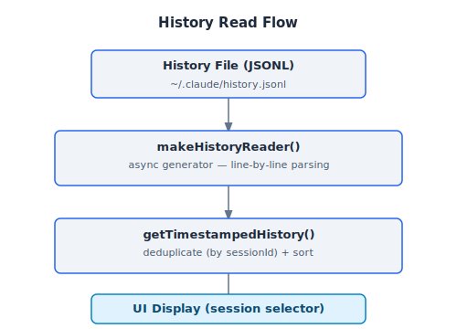
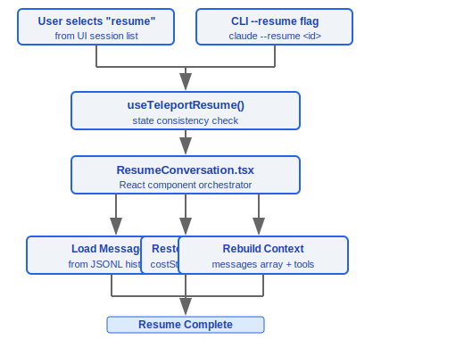

# 会话管理

> Claude Code 的会话管理系统负责会话标识、对话历史读写、会话恢复、导出分享、费用持久化和后台化。每个会话以 UUID 唯一标识,支持父子会话追踪。

---

## 架构总览


---

## 1. 会话标识 (bootstrap/state.ts)

### 1.1 类型定义

```typescript
type SessionId = string  // UUID v4 格式
```

### 1.2 核心函数

```typescript
function getSessionId(): SessionId
// 返回当前会话的唯一标识符

function regenerateSessionId(parentSessionId?: SessionId): SessionId
// 生成新的会话 ID
// 可选: 记录 parentSessionId 用于追踪会话衍生关系
```

### 1.3 会话层级关系


---

## 2. 历史管理 (history.ts)

历史管理模块负责对话消息的持久化读写,使用异步缓冲策略优化写入性能。

### 2.1 常量

| 常量 | 值 | 用途 |
|------|-----|------|
| `MAX_HISTORY_ITEMS` | `100` | 历史列表最大条目数 |
| `MAX_PASTED_CONTENT_LENGTH` | `1024` | 粘贴内容引用最大长度 |

### 2.2 读取 API

```typescript
function makeHistoryReader(): AsyncGenerator<HistoryEntry>
// async generator, 倒序读取历史条目
// 最新的对话排在最前面

function getTimestampedHistory(): Promise<HistoryEntry[]>
// 返回带时间戳的历史列表
// 自动去重 (基于 sessionId)
```

**读取流程**:



### 2.3 写入 API

```typescript
function addToHistory(entry: HistoryEntry): void
// 缓冲写入: 先加入内存缓冲区, 异步 flush 到磁盘
// 好处: 不阻塞主线程, 批量写入减少 I/O

function removeLastFromHistory(): Promise<void>
// 移除最近一条历史记录
```

**写入流程**:


### 2.4 粘贴内容引用

处理用户粘贴的大段文本或图片,避免历史记录膨胀:

```typescript
function formatPastedTextRef(text: string): string
// 当文本超过 MAX_PASTED_CONTENT_LENGTH (1024字符) 时
// 生成引用标记而非内联存储

function formatImageRef(imagePath: string): string
// 图片存为路径引用

function expandPastedTextRefs(message: string): string
// 恢复时展开引用标记为实际内容
```

---

## 3. 会话恢复

### 3.1 ResumeConversation.tsx

React 组件,负责从历史中恢复会话:

```typescript
// 恢复流程:
// 1. 从历史文件加载消息列表
// 2. 重建对话上下文 (messages array)
// 3. 恢复费用状态 (costState)
// 4. 重新挂载工具状态
```

### 3.2 useTeleportResume Hook

```typescript
function useTeleportResume(): {
  canResume: boolean
  resumeSession: (sessionId: SessionId) => Promise<void>
}
```

- 处理从其他入口 (CLI flag `--resume`, UI 选择) 触发的会话恢复
- 确保恢复过程中的状态一致性

### 3.3 恢复流程图



---

## 4. 会话导出与分享

### 4.1 /export 命令


### 4.2 /share 命令


---

## 5. 费用持久化

### 5.1 核心函数

```typescript
function saveCurrentSessionCosts(sessionId: SessionId): void
// 将当前会话的 API 费用保存到项目配置

function restoreCostStateForSession(sessionId: SessionId): CostState | null
// 从项目配置中恢复指定会话的费用状态
```

### 5.2 存储结构


### 5.3 费用状态数据

```typescript
interface CostState {
  inputTokens: number
  outputTokens: number
  cacheCreationTokens: number
  cacheReadTokens: number
  totalCostUSD: number
}
```

- 按 `sessionId` 隔离存储
- 恢复会话时自动加载,确保费用计数连续

---

## 6. 会话后台化

### 6.1 useSessionBackgrounding Hook

```typescript
function useSessionBackgrounding(): {
  isBackgrounded: boolean
  backgroundSession: () => void
  foregroundSession: () => void
}
```

### 6.2 后台化生命周期


- 后台化不中断 API 请求,会话继续运行
- 前台恢复时同步最新状态
- 用于长时间运行的任务 (大规模重构、测试执行等)

---

## 关键设计决策

| 决策 | 原因 |
|------|------|
| UUID 作为会话 ID | 全局唯一,支持分布式场景 |
| 异步缓冲写入历史 | 避免 I/O 阻塞主线程 |
| 粘贴内容引用化 | 防止历史文件膨胀 |
| 按 sessionId 存储费用 | 会话隔离,恢复时精确还原 |
| 父子会话追踪 | 支持 agent 衍生的会话溯源 |

### 设计理念

#### 为什么会话持久化到本地而不是云端？

对话可能包含敏感代码、内部 API、商业逻辑——本地存储让用户完全控制数据的去向。会话数据存储在 `~/.claude/projects/<project-hash>/sessions/` 目录下，不会自动上传到任何远端服务。源码中 `bootstrap/state.ts` 提供了 `--no-session-persistence` 标志，允许在 print 模式下完全禁用磁盘写入，进一步增强隐私控制。

#### 为什么支持会话导出和分享？

协作场景需要分享问题排查过程给同事——`/export` 命令支持 JSON（结构化）和 Markdown（可读）两种格式，`/share` 命令生成可分享链接。导出是用户主动触发的操作，而非自动同步，确保用户对数据流向有完全控制权。

#### 为什么会话恢复用 JSONL 而不是 JSON？

JSONL（每行一个 JSON 对象）支持追加写入——每条消息追加一行即可，不需要读取、解析、修改、重写整个文件。这带来两个关键优势：(1) 写入性能——`addToHistory` 的缓冲写入只需 `appendFile`，而非重写整个 JSON 文件；(2) 崩溃恢复——进程崩溃最多丢失最后一条未 flush 的消息，而 JSON 格式下文件末尾缺少 `]` 会导致整个文件解析失败。源码中 `makeHistoryReader()` 使用 async generator 逐行解析 JSONL，内存占用与文件大小无关。`conversationRecovery.ts` 和 `cli/print.ts` 中明确支持 `.jsonl` 路径作为 `--resume` 的输入。

---

## 工程实践指南

### 会话恢复

**恢复方式：**

1. **恢复最近会话**：使用 `--continue` 或 `-c` 标志
   ```bash
   claude --continue          # 恢复最近的会话
   ```
2. **恢复特定会话**：使用 `--resume <id>` 指定 session ID
   ```bash
   claude --resume <session-id>   # 恢复特定会话
   ```
3. **从 JSONL 文件恢复**：直接指定 `.jsonl` 路径
   ```bash
   claude --resume /path/to/session.jsonl
   ```

**恢复流程（`ResumeConversation.tsx`）：**
1. 从历史文件加载消息列表
2. 重建对话上下文（messages array）
3. 恢复费用状态（costState）
4. 重新挂载工具状态

**注意**：`--session-id` 仅在同时指定 `--fork-session` 时可与 `--continue`/`--resume` 一起使用（源码 `main.tsx:1279` 的检查）

### 调试会话丢失

**排查步骤：**

1. **检查 JSONL 文件是否存在**：
   ```bash
   ls -la ~/.claude/projects/<project-hash>/sessions/
   ```
2. **检查写入权限**：目录和文件需要读写权限
3. **检查 history.jsonl**：主历史文件位于 `~/.claude/history.jsonl`
4. **验证 JSONL 格式**：每行应是独立的 JSON 对象，文件损坏只丢最后一条
5. **检查 sessionId**：UUID v4 格式，`getSessionId()` 返回当前会话 ID
6. **检查父子关系**：`regenerateSessionId(parentSessionId?)` 记录会话衍生关系

**异步缓冲写入机制**：
- `addToHistory()` 先加入内存缓冲区，异步 flush 到磁盘
- 好处：不阻塞主线程，批量写入减少 I/O
- 风险：进程崩溃可能丢失缓冲区中未 flush 的数据

### 会话导出

**导出格式：**

| 命令 | 格式 | 用途 |
|------|------|------|
| `/export` | JSON（结构化）或 Markdown（可读） | 本地保存对话记录 |
| `/share` | 在线快照 + 分享链接 | 协作分享 |

**导出是用户主动触发的操作**——不会自动同步，确保用户对数据流向有完全控制权。

### 粘贴内容处理

- 文本超过 `MAX_PASTED_CONTENT_LENGTH`（1024 字符）时生成引用标记而非内联存储
- 图片存为路径引用
- 恢复时通过 `expandPastedTextRefs()` 展开引用标记

### 会话后台化

- `useSessionBackgrounding()` 支持将会话移到后台继续运行
- 后台化不中断 API 请求——会话继续消耗 tokens
- 适用于长时间运行任务（大规模重构、测试执行等）
- 前台恢复时同步最新状态

### 常见陷阱

| 陷阱 | 详情 | 解决方案 |
|------|------|----------|
| JSONL 追加写入——文件损坏只丢最后一条 | 进程崩溃最多丢失最后一条未 flush 的消息 | 比 JSON 格式更安全（JSON 末尾缺 `]` 会导致整个文件不可解析） |
| 大会话文件可能影响启动速度 | `makeHistoryReader()` 使用 async generator 逐行解析，但大文件仍有 I/O 开销 | `MAX_HISTORY_ITEMS = 100` 限制历史列表大小 |
| 费用状态按 sessionId 隔离 | 恢复会话时自动加载对应的费用状态 | 确保 `saveCurrentSessionCosts()` 在会话结束时被调用 |
| `--no-session-persistence` | print 模式下完全禁用磁盘写入 | 适合隐私要求高或一次性使用的场景 |
| 历史去重 | `getTimestampedHistory()` 基于 sessionId 去重 | 同一 sessionId 的多次写入只保留最新条目 |


---

[← Git 与 GitHub](../25-Git与GitHub/git-github.md) | [目录](../README.md) | [键绑定与输入 →](../27-键绑定与输入/keybinding-system.md)
