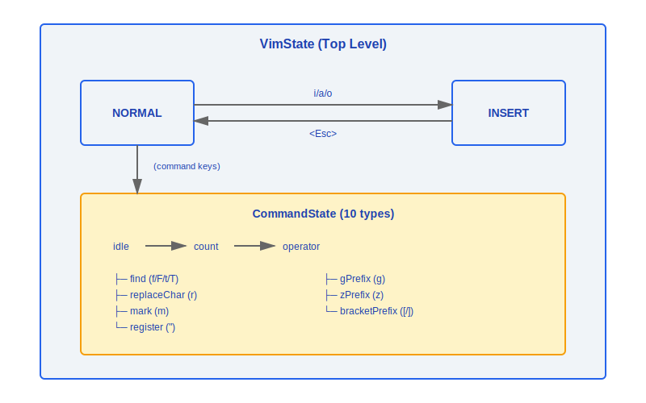
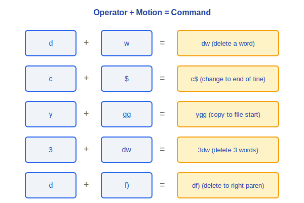
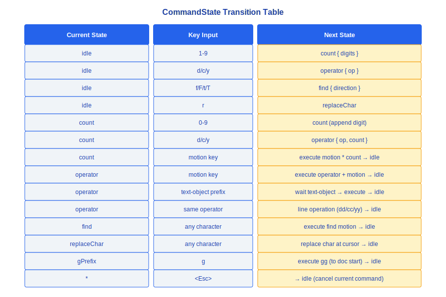
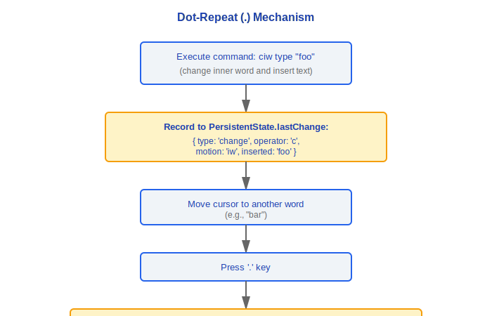
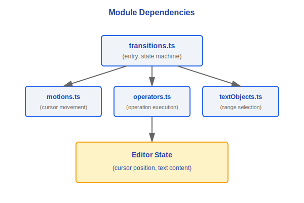

# Vim Mode

> Claude Code has a built-in lightweight Vim emulator that provides a Vim-style editing experience in the terminal input box. It uses a finite state machine architecture to implement mode switching and command parsing.

---

## State Machine Overview



### Design Philosophy

#### Why implement a full Vim state machine in a CLI?

Claude Code's target audience is developers, and the proportion of Vim users among developers is extremely high. The absence of a Vim mode would cause a fractured experience for these high-value users when typing long prompts — their muscle memory cannot be applied. More critically, **a half-baked Vim is more dangerous than no Vim at all**: a "Vim mode" that only supports `hjkl` movement but not `dw`/`ciw` makes Vim users feel like it's a "knock-off", producing more frustration than having no Vim mode at all. So the architectural choice is: either don't do it, or implement all three layers — motion/operator/text-object — completely.

#### Why implement all three layers: motion/operator/text-object?

These three layers are the core of Vim's composability. The comment at the top of `transitions.ts` in the source code states it plainly — "Vim State Transition Table: This is the scannable source of truth for state transitions". `d` + `w` = delete a word, `c` + `i"` = change content inside quotes, `y` + `gg` = yank to the beginning of the document. The orthogonal combination of operators and motions allows a small set of primitives to produce an exponential command space. Implementing just a few key bindings cannot cover this combinatorial explosion — once a user discovers that one of their habitual combinations doesn't work, trust collapses entirely.

#### Why is the Vim state machine an isolated module (vim/)?

The `vim/` directory in the source contains `transitions.ts`, `motions.ts`, `operators.ts`, `textObjects.ts`, and `types.ts`, forming a self-contained subsystem. This is a **complexity isolation** design — the correctness of the Vim state machine is completely independent of the core query loop, and the two can evolve and be tested independently. Mixing the logic of 10 CommandState types, motion calculations, and operator execution into the main input component would tangle two unrelated sources of complexity together.

---

## 1. Core Type Definitions

### 1.1 VimState

```typescript
type VimState = 'INSERT' | 'NORMAL'
```

- **INSERT**: Normal text input mode; keystrokes directly insert characters
- **NORMAL**: Command mode; keystrokes trigger Vim commands

### 1.2 CommandState (10 types)

```typescript
type CommandState =
  | { type: 'idle' }                              // Waiting for command input
  | { type: 'count'; digits: string }             // Numeric prefix (e.g., the 3 in 3dw)
  | { type: 'operator'; op: Operator; count?: number }  // Waiting for motion/text-object
  | { type: 'find'; direction: 'f'|'F'|'t'|'T' } // Find character
  | { type: 'replaceChar' }                       // Replace a single character
  | { type: 'mark' }                              // Set a mark
  | { type: 'register'; reg: string }             // Register selection
  | { type: 'gPrefix' }                           // g prefix commands (gg, gj, gk...)
  | { type: 'zPrefix' }                           // z prefix commands (zz, zt, zb...)
  | { type: 'bracketPrefix'; bracket: '['|']' }   // Bracket jump
```

### 1.3 PersistentState (persists across commands)

```typescript
interface PersistentState {
  lastChange: RecordedChange | null  // Record for dot-repeat (.)
  lastFind: {                         // Repeat for semicolon (;) and comma (,)
    direction: 'f' | 'F' | 't' | 'T'
    char: string
  } | null
  register: Record<string, string>    // Named registers
}
```

### 1.4 RecordedChange (discriminated union)

```typescript
type RecordedChange =
  | { type: 'delete'; operator: 'd'; motion: Motion; count?: number }
  | { type: 'change'; operator: 'c'; motion: Motion; count?: number; inserted: string }
  | { type: 'replace'; char: string }
  | { type: 'insert'; text: string; mode: 'i' | 'a' | 'o' | 'O' }
```

### 1.5 Safety Limit

```typescript
const MAX_VIM_COUNT = 10000
// Prevents performance issues from user input like 999999dw
// Counts exceeding this value are truncated
```

---

## 2. Motions (motions.ts)

A motion defines how the cursor moves, and can be used independently or combined with an operator.

### 2.1 Motion List

| Category | Key | Description | Example |
|----------|-----|-------------|---------|
| **Basic movement** | `h` | Move left one character | `3h` — move left 3 characters |
| | `j` | Move down one line | `5j` — move down 5 lines |
| | `k` | Move up one line | |
| | `l` | Move right one character | |
| **Word movement** | `w` | Next word start | `dw` — delete to end of word |
| | `b` | Previous word start | `cb` — change to previous word start |
| | `e` | Current word end | `de` — delete to word end |
| **Line movement** | `0` | Line start | `d0` — delete to line start |
| | `$` | Line end | `d$` — delete to line end |
| **Document movement** | `gg` | Document start | `dgg` — delete to document start |
| | `G` | Document end | `dG` — delete to document end |
| **Find movement** | `f{char}` | Find character to the right (inclusive) | `df)` — delete to `)` |
| | `F{char}` | Find character to the left (inclusive) | |
| | `t{char}` | Find character to the right (exclusive) | `ct"` — change up to `"` |
| | `T{char}` | Find character to the left (exclusive) | |
| **Match** | `%` | Jump to matching bracket | `d%` — delete bracket pair content |

---

## 3. Operators (operators.ts)

An operator defines the action to perform over the range covered by a motion, following the `{operator}{motion}` syntax.

### 3.1 Operator List

| Key | Action | Double-key behavior | Description |
|-----|--------|---------------------|-------------|
| `d` | Delete | `dd` — delete entire line | Deletes text covered by the motion |
| `c` | Change | `cc` — change entire line | Delete + enter INSERT mode |
| `y` | Yank | `yy` — yank entire line | Copy to register |

### 3.2 Combination Examples



---

## 4. Text Objects (textObjects.ts)

Text objects are used after an operator, prefixed with `i` (inner) or `a` (around).

### 4.1 Text Object List

| Key | Inner (i) | Around (a) |
|-----|-----------|------------|
| `w` | `iw` — inside word | `aw` — word + surrounding spaces |
| `"` | `i"` — inside double quotes | `a"` — including double quotes |
| `'` | `i'` — inside single quotes | `a'` — including single quotes |
| `` ` `` | `` i` `` — inside backticks | `` a` `` — including backticks |
| `(` / `)` | `i(` — inside parentheses | `a(` — including parentheses |
| `[` / `]` | `i[` — inside square brackets | `a[` — including square brackets |
| `{` / `}` | `i{` — inside curly braces | `a{` — including curly braces |

### 4.2 Examples

```
Text: const msg = "hello world"
Cursor is on 'w':

  ci"  → const msg = "|"          (change inside double quotes, enter INSERT)
  da"  → const msg = |            (delete including double quotes)
  diw  → const msg = "hello |"   (delete "world")
  yaw  → yank "world " to register
```

---

## 5. State Transitions (transitions.ts)

Defines the rules for how every keystroke triggers state machine transitions.

### 5.1 Mode Switching

```
NORMAL → INSERT:
  i   Insert before cursor
  a   Insert after cursor
  o   Insert on new line below
  O   Insert on new line above
  I   Insert at line start
  A   Insert at line end

INSERT → NORMAL:
  <Esc>    Exit insert mode
  Ctrl-[   Exit insert mode (equivalent to Esc)
```

### 5.2 CommandState Transition Table



### 5.3 Dot-Repeat (.) Mechanism



---

## Module Dependency Graph



---

## Engineering Practice Guide

### Enabling/Disabling Vim Mode

1. **Runtime toggle**: Type `/vim` in Claude Code to toggle between Vim mode and normal mode
2. **Configure default mode**: Set `vimMode: true` in user configuration to enable Vim mode by default, avoiding manual toggling each time
3. **Check current state**: The mode indicator on the left side of the input box shows whether the current mode is `NORMAL` or `INSERT`

### Debugging Vim Behavior

1. **Check current mode**: Confirm which VimState (`NORMAL`/`INSERT`) and which CommandState (10 types total) the state machine is in
2. **Troubleshoot motion/operator/text-object combinations**:
   - Confirm whether the operator correctly enters the `operator` state (check the transition table in `transitions.ts`)
   - Confirm whether the motion calculation correctly returns the target position (check the corresponding cursor calculation in `motions.ts`)
   - Confirm whether the `inner`/`around` range boundaries of the text-object are correct (check `textObjects.ts`)
3. **Troubleshoot dot-repeat issues**: Check whether the `RecordedChange` recorded in `PersistentState.lastChange` is complete — the `change` type must include the `inserted` text, and the `delete` type must include the correct `motion`
4. **Troubleshoot count prefixes**: Confirm whether `MAX_VIM_COUNT` (10000) has truncated the user's input number; check the digit accumulation logic in the `count` state

### Extending Vim Commands

1. **Add a new motion**: Define a new cursor movement function in `motions.ts` that returns the target position
2. **Add a new operator**: Define new operation logic in `operators.ts` that handles text within the motion range
3. **Add a new text-object**: Define a new range selection function in `textObjects.ts` that returns a `[start, end]` interval
4. **Register with the state machine**: Add the corresponding key mapping and state transition rules to the transition table in `transitions.ts`
5. **Test combinations**: Newly added motions/operators/text-objects need cross-testing — ensure that any operator + new motion and any new operator + any motion combination works correctly

### Common Pitfalls

> **Vim state machine tightly coupled with input system**: `transitions.ts` directly responds to key events and modifies editor state. When making changes, pay close attention to boundary conditions around mode switching — for example, after a `c` operator completes, it must automatically switch to `INSERT` mode, while a `d` operator stays in `NORMAL` mode after completion. Missing a mode switch will cause users to get "stuck" in the wrong mode.

> **System clipboard requires native support**: `y` (yank) and `p` (paste) operations involve system clipboard interaction. Vim's internal registers (`PersistentState.register`) are pure in-memory structures, but synchronization with the system clipboard depends on platform-native capabilities (such as `pbcopy`/`pbpaste` or `xclip`). When unavailable, operations can only work within Vim's internal registers.

> **Multiple meanings of `<Esc>`**: The Escape key is used both to switch from INSERT back to NORMAL, and to cancel an in-progress command (e.g., pressing `d` then Esc cancels the delete operation). If another global hotkey in the system intercepts Escape (such as a CGEventTap in Computer-Use), the Vim mode Esc may not work.


---

[← Keybindings & Input](../27-键绑定与输入/keybinding-system-en.md) | [Index](../README_EN.md) | [Voice System →](../29-语音系统/voice-system-en.md)
