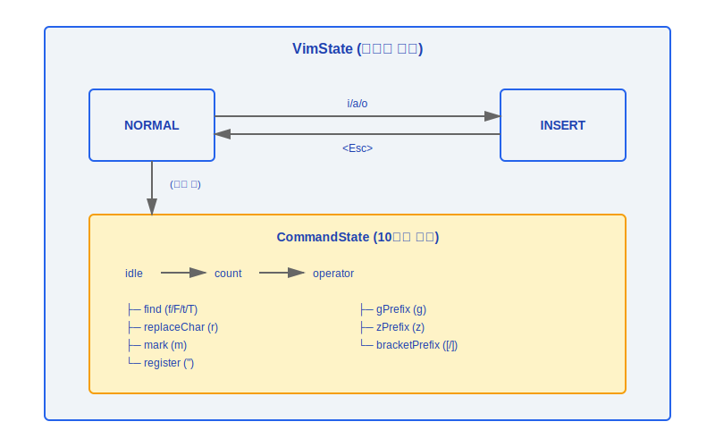
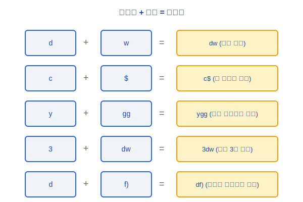
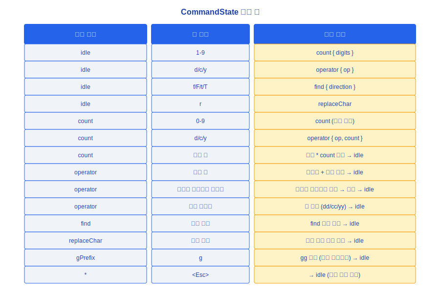
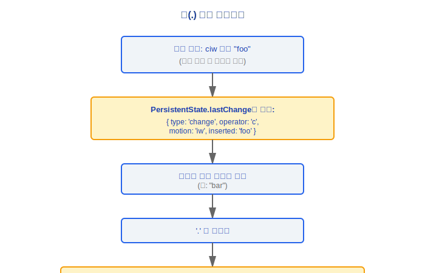
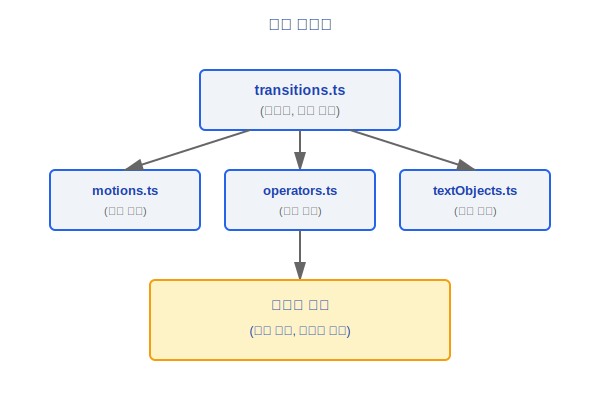

# Vim 모드

> Claude Code는 터미널 입력 박스에서 Vim 스타일의 편집 경험을 제공하는 경량 Vim 에뮬레이터를 내장하고 있습니다. 유한 상태 기계(Finite State Machine) 아키텍처를 사용하여 모드 전환과 명령 파싱을 구현합니다.

---

## 상태 기계 개요



### 설계 철학

#### 왜 CLI에서 완전한 Vim 상태 기계를 구현하는가?

Claude Code의 대상 사용자층은 개발자이며, 개발자 중 Vim 사용자 비율은 매우 높습니다. Vim 모드가 없다면 이 고가치 사용자들이 긴 프롬프트를 입력할 때 단절된 경험을 하게 됩니다. 자신의 근육 기억을 활용할 수 없기 때문입니다. 더 중요한 것은, **반쪽짜리 Vim은 Vim이 없는 것보다 더 위험합니다**: `hjkl` 이동만 지원하고 `dw`/`ciw`를 지원하지 않는 "Vim 모드"는 Vim 사용자들에게 "짝퉁"처럼 느껴져, Vim 모드가 없는 것보다 더 큰 좌절감을 줍니다. 따라서 아키텍처 선택은 이렇습니다: 하지 않거나, 모션(motion)/오퍼레이터(operator)/텍스트 객체(text-object) 세 레이어를 모두 완전하게 구현하거나.

#### 왜 모션/오퍼레이터/텍스트 객체 세 레이어를 모두 구현하는가?

이 세 레이어가 Vim의 조합성(composability)의 핵심입니다. 소스 코드의 `transitions.ts` 상단 주석은 명확하게 설명합니다 — "Vim 상태 전환 테이블: 이것이 상태 전환의 스캔 가능한 진실의 원천입니다". `d` + `w` = 단어 삭제, `c` + `i"` = 따옴표 안의 내용 변경, `y` + `gg` = 문서 시작까지 복사. 오퍼레이터와 모션의 직교적 조합은 소수의 기본 요소로 지수적인 명령 공간을 생성합니다. 몇 가지 키 바인딩만 구현해서는 이 조합의 폭발적인 증가를 커버할 수 없습니다. 사용자가 습관적인 조합 중 하나가 작동하지 않는 것을 발견하면 신뢰가 완전히 무너집니다.

#### 왜 Vim 상태 기계가 격리된 모듈(vim/)인가?

소스의 `vim/` 디렉터리에는 `transitions.ts`, `motions.ts`, `operators.ts`, `textObjects.ts`, `types.ts`가 있으며, 자기 완결적인 서브시스템을 형성합니다. 이것은 **복잡성 격리** 설계입니다. Vim 상태 기계의 정확성은 핵심 쿼리 루프와 완전히 독립적이며, 두 가지를 독립적으로 발전시키고 테스트할 수 있습니다. 10개의 CommandState 타입, 모션 계산, 오퍼레이터 실행의 로직을 메인 입력 컴포넌트에 혼합하면 두 가지 관련 없는 복잡성의 원천이 얽히게 됩니다.

---

## 1. 핵심 타입 정의

### 1.1 VimState

```typescript
type VimState = 'INSERT' | 'NORMAL'
```

- **INSERT**: 일반 텍스트 입력 모드; 키 입력이 직접 문자를 삽입합니다
- **NORMAL**: 명령 모드; 키 입력이 Vim 명령을 트리거합니다

### 1.2 CommandState (10가지 타입)

```typescript
type CommandState =
  | { type: 'idle' }                              // 명령 입력 대기
  | { type: 'count'; digits: string }             // 숫자 접두사 (예: 3dw의 3)
  | { type: 'operator'; op: Operator; count?: number }  // 모션/텍스트 객체 대기
  | { type: 'find'; direction: 'f'|'F'|'t'|'T' } // 문자 찾기
  | { type: 'replaceChar' }                       // 단일 문자 교체
  | { type: 'mark' }                              // 마크 설정
  | { type: 'register'; reg: string }             // 레지스터 선택
  | { type: 'gPrefix' }                           // g 접두사 명령 (gg, gj, gk...)
  | { type: 'zPrefix' }                           // z 접두사 명령 (zz, zt, zb...)
  | { type: 'bracketPrefix'; bracket: '['|']' }   // 괄호 점프
```

### 1.3 PersistentState (명령 간에 지속)

```typescript
interface PersistentState {
  lastChange: RecordedChange | null  // 도트 반복(.)을 위한 기록
  lastFind: {                         // 세미콜론(;)과 콤마(,) 반복을 위한 기록
    direction: 'f' | 'F' | 't' | 'T'
    char: string
  } | null
  register: Record<string, string>    // 명명된 레지스터
}
```

### 1.4 RecordedChange (판별 유니온)

```typescript
type RecordedChange =
  | { type: 'delete'; operator: 'd'; motion: Motion; count?: number }
  | { type: 'change'; operator: 'c'; motion: Motion; count?: number; inserted: string }
  | { type: 'replace'; char: string }
  | { type: 'insert'; text: string; mode: 'i' | 'a' | 'o' | 'O' }
```

### 1.5 안전 제한

```typescript
const MAX_VIM_COUNT = 10000
// 사용자가 999999dw 같이 입력할 경우 발생하는 성능 문제 방지
// 이 값을 초과하는 카운트는 잘립니다
```

---

## 2. 모션(Motions) (motions.ts)

모션은 커서가 이동하는 방식을 정의하며, 독립적으로 사용하거나 오퍼레이터와 조합할 수 있습니다.

### 2.1 모션 목록

| 카테고리 | 키 | 설명 | 예시 |
|---------|-----|------|------|
| **기본 이동** | `h` | 왼쪽으로 한 문자 이동 | `3h` — 3문자 왼쪽으로 이동 |
| | `j` | 아래로 한 줄 이동 | `5j` — 5줄 아래로 이동 |
| | `k` | 위로 한 줄 이동 | |
| | `l` | 오른쪽으로 한 문자 이동 | |
| **단어 이동** | `w` | 다음 단어 시작 | `dw` — 단어 끝까지 삭제 |
| | `b` | 이전 단어 시작 | `cb` — 이전 단어 시작까지 변경 |
| | `e` | 현재 단어 끝 | `de` — 단어 끝까지 삭제 |
| **줄 이동** | `0` | 줄 시작 | `d0` — 줄 시작까지 삭제 |
| | `$` | 줄 끝 | `d$` — 줄 끝까지 삭제 |
| **문서 이동** | `gg` | 문서 시작 | `dgg` — 문서 시작까지 삭제 |
| | `G` | 문서 끝 | `dG` — 문서 끝까지 삭제 |
| **찾기 이동** | `f{char}` | 오른쪽에서 문자 찾기 (포함) | `df)` — `)`까지 삭제 |
| | `F{char}` | 왼쪽에서 문자 찾기 (포함) | |
| | `t{char}` | 오른쪽에서 문자 찾기 (제외) | `ct"` — `"`까지 변경 |
| | `T{char}` | 왼쪽에서 문자 찾기 (제외) | |
| **매치** | `%` | 매칭 괄호로 점프 | `d%` — 괄호 쌍 내용 삭제 |

---

## 3. 오퍼레이터(Operators) (operators.ts)

오퍼레이터는 모션이 커버하는 범위에서 수행할 작업을 정의하며, `{오퍼레이터}{모션}` 구문을 따릅니다.

### 3.1 오퍼레이터 목록

| 키 | 액션 | 더블 키 동작 | 설명 |
|----|------|------------|------|
| `d` | 삭제 | `dd` — 전체 줄 삭제 | 모션이 커버하는 텍스트를 삭제 |
| `c` | 변경 | `cc` — 전체 줄 변경 | 삭제 + INSERT 모드 진입 |
| `y` | 복사 | `yy` — 전체 줄 복사 | 레지스터에 복사 |

### 3.2 조합 예시



---

## 4. 텍스트 객체(Text Objects) (textObjects.ts)

텍스트 객체는 오퍼레이터 뒤에 사용하며, `i` (내부) 또는 `a` (주변) 접두사를 붙입니다.

### 4.1 텍스트 객체 목록

| 키 | 내부 (i) | 주변 (a) |
|----|---------|---------|
| `w` | `iw` — 단어 안 | `aw` — 단어 + 주변 공백 |
| `"` | `i"` — 큰따옴표 안 | `a"` — 큰따옴표 포함 |
| `'` | `i'` — 작은따옴표 안 | `a'` — 작은따옴표 포함 |
| `` ` `` | `` i` `` — 백틱 안 | `` a` `` — 백틱 포함 |
| `(` / `)` | `i(` — 괄호 안 | `a(` — 괄호 포함 |
| `[` / `]` | `i[` — 대괄호 안 | `a[` — 대괄호 포함 |
| `{` / `}` | `i{` — 중괄호 안 | `a{` — 중괄호 포함 |

### 4.2 예시

```
텍스트: const msg = "hello world"
커서가 'w'에 있을 때:

  ci"  → const msg = "|"          (큰따옴표 안 변경, INSERT 모드 진입)
  da"  → const msg = |            (큰따옴표 포함 삭제)
  diw  → const msg = "hello |"   ("world" 삭제)
  yaw  → "world "를 레지스터에 복사
```

---

## 5. 상태 전환 (transitions.ts)

모든 키 입력이 상태 기계 전환을 트리거하는 방법에 대한 규칙을 정의합니다.

### 5.1 모드 전환

```
NORMAL → INSERT:
  i   커서 앞에 삽입
  a   커서 뒤에 삽입
  o   아래에 새 줄을 만들고 삽입
  O   위에 새 줄을 만들고 삽입
  I   줄 시작에 삽입
  A   줄 끝에 삽입

INSERT → NORMAL:
  <Esc>    삽입 모드 종료
  Ctrl-[   삽입 모드 종료 (Esc와 동일)
```

### 5.2 CommandState 전환 테이블



### 5.3 도트 반복(.) 메커니즘



---

## 모듈 의존성 그래프



---

## 엔지니어링 실천 가이드

### Vim 모드 활성화/비활성화

1. **런타임 토글**: Claude Code에서 `/vim`을 입력하여 Vim 모드와 일반 모드 간에 전환합니다
2. **기본 모드 설정**: 사용자 설정에서 `vimMode: true`를 설정하여 Vim 모드를 기본으로 활성화하고, 매번 수동으로 전환하지 않아도 됩니다
3. **현재 상태 확인**: 입력 박스 왼쪽의 모드 표시기가 현재 모드가 `NORMAL`인지 `INSERT`인지 보여줍니다

### Vim 동작 디버깅

1. **현재 모드 확인**: 상태 기계가 어떤 VimState(`NORMAL`/`INSERT`)와 어떤 CommandState(총 10가지)에 있는지 확인합니다
2. **모션/오퍼레이터/텍스트 객체 조합 문제 해결**:
   - 오퍼레이터가 올바르게 `operator` 상태에 진입하는지 확인 (`transitions.ts`의 전환 테이블 확인)
   - 모션 계산이 올바르게 대상 위치를 반환하는지 확인 (`motions.ts`의 해당 커서 계산 확인)
   - 텍스트 객체의 `inner`/`around` 범위 경계가 올바른지 확인 (`textObjects.ts` 확인)
3. **도트 반복 문제 해결**: `PersistentState.lastChange`에 기록된 `RecordedChange`가 완전한지 확인합니다 — `change` 타입에는 `inserted` 텍스트가 포함되어야 하고, `delete` 타입에는 올바른 `motion`이 포함되어야 합니다
4. **카운트 접두사 문제 해결**: `MAX_VIM_COUNT`(10000)가 사용자의 입력 숫자를 잘랐는지 확인하고; `count` 상태에서의 숫자 누적 로직을 확인합니다

### Vim 명령 확장

1. **새 모션 추가**: `motions.ts`에 새로운 커서 이동 함수를 정의하여 대상 위치를 반환합니다
2. **새 오퍼레이터 추가**: `operators.ts`에 모션 범위 내의 텍스트를 처리하는 새 작업 로직을 정의합니다
3. **새 텍스트 객체 추가**: `textObjects.ts`에 `[start, end]` 구간을 반환하는 새 범위 선택 함수를 정의합니다
4. **상태 기계에 등록**: `transitions.ts`의 전환 테이블에 해당 키 매핑과 상태 전환 규칙을 추가합니다
5. **조합 테스트**: 새로 추가된 모션/오퍼레이터/텍스트 객체는 교차 테스트가 필요합니다 — 모든 오퍼레이터 + 새 모션, 모든 새 오퍼레이터 + 모든 모션 조합이 올바르게 작동하는지 확인합니다

### 흔한 함정

> **Vim 상태 기계와 입력 시스템의 강한 결합**: `transitions.ts`는 키 이벤트에 직접 응답하고 편집기 상태를 수정합니다. 변경할 때는 모드 전환 주변의 경계 조건에 주의해야 합니다 — 예를 들어, `c` 오퍼레이터가 완료된 후에는 자동으로 `INSERT` 모드로 전환해야 하지만, `d` 오퍼레이터는 완료 후 `NORMAL` 모드에 머물러야 합니다. 모드 전환을 빠뜨리면 사용자가 잘못된 모드에 "갇히게" 됩니다.

> **시스템 클립보드는 네이티브 지원이 필요합니다**: `y` (복사)와 `p` (붙여넣기) 작업은 시스템 클립보드 상호작용을 포함합니다. Vim의 내부 레지스터(`PersistentState.register`)는 순수한 인메모리 구조이지만, 시스템 클립보드와의 동기화는 플랫폼 네이티브 기능(예: `pbcopy`/`pbpaste` 또는 `xclip`)에 의존합니다. 사용할 수 없을 때 작업은 Vim의 내부 레지스터 내에서만 작동할 수 있습니다.

> **`<Esc>`의 다중 의미**: Escape 키는 INSERT에서 NORMAL로 전환하는 데도 사용되고, 진행 중인 명령을 취소하는 데도 사용됩니다 (예: `d`를 누른 후 Esc를 누르면 삭제 작업이 취소됨). 시스템의 다른 전역 단축키가 Escape를 가로챈다면 (예: Computer Use의 CGEventTap), Vim 모드의 Esc가 작동하지 않을 수 있습니다.


---

[← 키바인딩 및 입력](../27-键绑定与输入/keybinding-system-ko.md) | [목차](../README_KO.md) | [음성 시스템 →](../29-语音系统/voice-system-ko.md)
