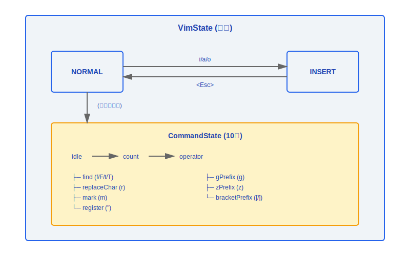
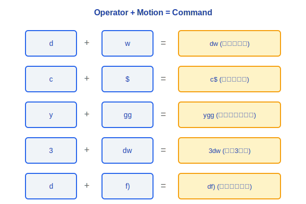
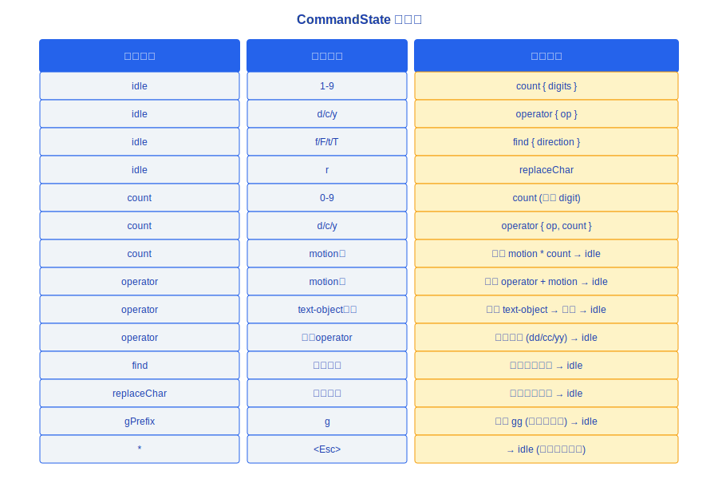
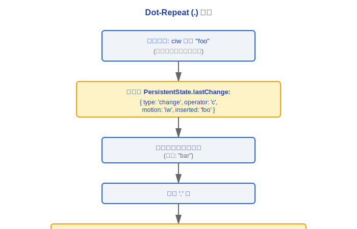
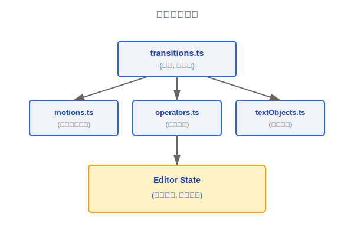

# Vim 模式

> Claude Code 内置了一个轻量级 Vim 模拟器,在终端输入框中提供 Vim 风格的编辑体验。采用有限状态机架构实现模式切换和命令解析。

---

## 状态机总览



### 设计理念

#### 为什么在 CLI 中实现完整 Vim 状态机?

Claude Code 的目标用户群是开发者,而开发者中 Vim 用户比例极高。缺少 Vim 模式会导致这部分高价值用户在输入长提示词时体验割裂——他们的肌肉记忆无法发挥作用。但更关键的是,**半成品的 Vim 比不做更危险**:一个只支持 `hjkl` 移动却不支持 `dw`/`ciw` 的"Vim 模式"会让 Vim 用户觉得是"山寨品",产生的挫败感比没有 Vim 模式更强。所以架构选择是:要么不做,要么做到 motion/operator/text-object 三层完整组合。

#### 为什么实现 motion/operator/text-object 三层?

这三层是 Vim 可组合性的核心。源码中 `transitions.ts` 的注释开宗明义——"Vim State Transition Table: This is the scannable source of truth for state transitions"。`d` + `w` = 删除单词,`c` + `i"` = 修改引号内内容,`y` + `gg` = 复制到文档开头。operator 和 motion 的正交组合让少量原语产生指数级命令空间。只实现几个快捷键绑定无法覆盖这种组合爆炸,用户一旦发现某个习惯组合不生效,信任就会崩塌。

#### 为什么 Vim 状态机是独立模块 (vim/)?

源码中 `vim/` 目录包含 `transitions.ts`、`motions.ts`、`operators.ts`、`textObjects.ts` 和 `types.ts`,形成一个自包含的子系统。这是**复杂度隔离**的设计——Vim 状态机的正确性与核心查询循环完全无关,两者可以独立演化和测试。将 10 种 CommandState、motion 计算、operator 执行等逻辑混入主输入组件会让两个不相关的复杂度纠缠在一起。

---

## 1. 核心类型定义

### 1.1 VimState

```typescript
type VimState = 'INSERT' | 'NORMAL'
```

- **INSERT**: 正常文本输入模式,按键直接插入字符
- **NORMAL**: 命令模式,按键触发 Vim 命令

### 1.2 CommandState (10 种状态)

```typescript
type CommandState =
  | { type: 'idle' }                              // 等待命令输入
  | { type: 'count'; digits: string }             // 数字前缀 (如 3dw 中的 3)
  | { type: 'operator'; op: Operator; count?: number }  // 等待 motion/text-object
  | { type: 'find'; direction: 'f'|'F'|'t'|'T' } // 查找字符
  | { type: 'replaceChar' }                       // 替换单个字符
  | { type: 'mark' }                              // 设置标记
  | { type: 'register'; reg: string }             // 寄存器选择
  | { type: 'gPrefix' }                           // g 前缀命令 (gg, gj, gk...)
  | { type: 'zPrefix' }                           // z 前缀命令 (zz, zt, zb...)
  | { type: 'bracketPrefix'; bracket: '['|']' }   // 括号跳转
```

### 1.3 PersistentState (跨命令持久)

```typescript
interface PersistentState {
  lastChange: RecordedChange | null  // dot-repeat (.) 的记录
  lastFind: {                         // 分号(;)和逗号(,)重复
    direction: 'f' | 'F' | 't' | 'T'
    char: string
  } | null
  register: Record<string, string>    // 命名寄存器
}
```

### 1.4 RecordedChange (判别联合)

```typescript
type RecordedChange =
  | { type: 'delete'; operator: 'd'; motion: Motion; count?: number }
  | { type: 'change'; operator: 'c'; motion: Motion; count?: number; inserted: string }
  | { type: 'replace'; char: string }
  | { type: 'insert'; text: string; mode: 'i' | 'a' | 'o' | 'O' }
```

### 1.5 安全限制

```typescript
const MAX_VIM_COUNT = 10000
// 防止用户输入 999999dw 导致性能问题
// 超出此值的 count 会被截断
```

---

## 2. Motions (motions.ts)

Motion 定义光标移动方式,既可独立使用也可与 operator 组合。

### 2.1 Motion 列表

| 分类 | 按键 | 说明 | 示例 |
|------|------|------|------|
| **基础移动** | `h` | 左移一字符 | `3h` — 左移3字符 |
| | `j` | 下移一行 | `5j` — 下移5行 |
| | `k` | 上移一行 | |
| | `l` | 右移一字符 | |
| **词移动** | `w` | 下一个词首 | `dw` — 删除到词尾 |
| | `b` | 上一个词首 | `cb` — 修改到上一词首 |
| | `e` | 当前词尾 | `de` — 删除到词尾 |
| **行移动** | `0` | 行首 | `d0` — 删除到行首 |
| | `$` | 行尾 | `d$` — 删除到行尾 |
| **文档移动** | `gg` | 文档开头 | `dgg` — 删除到文档开头 |
| | `G` | 文档末尾 | `dG` — 删除到末尾 |
| **查找移动** | `f{char}` | 向右查找字符 (含) | `df)` — 删除到 `)` |
| | `F{char}` | 向左查找字符 (含) | |
| | `t{char}` | 向右查找字符 (不含) | `ct"` — 修改到 `"` 前 |
| | `T{char}` | 向左查找字符 (不含) | |
| **匹配** | `%` | 匹配括号跳转 | `d%` — 删除括号对内容 |

---

## 3. Operators (operators.ts)

Operator 定义对 motion 范围执行的操作,遵循 `{operator}{motion}` 语法。

### 3.1 Operator 列表

| 按键 | 操作 | 双击行为 | 说明 |
|------|------|----------|------|
| `d` | 删除 (delete) | `dd` — 删除整行 | 删除 motion 覆盖的文本 |
| `c` | 修改 (change) | `cc` — 修改整行 | 删除 + 进入 INSERT 模式 |
| `y` | 复制 (yank) | `yy` — 复制整行 | 复制到寄存器 |

### 3.2 组合示例



---

## 4. Text Objects (textObjects.ts)

Text object 在 operator 之后使用,以 `i` (inner) 或 `a` (around) 为前缀。

### 4.1 Text Object 列表

| 按键 | Inner (i) | Around (a) |
|------|-----------|------------|
| `w` | `iw` — 词内部 | `aw` — 词 + 周围空格 |
| `"` | `i"` — 双引号内部 | `a"` — 含双引号 |
| `'` | `i'` — 单引号内部 | `a'` — 含单引号 |
| `` ` `` | `` i` `` — 反引号内部 | `` a` `` — 含反引号 |
| `(` / `)` | `i(` — 圆括号内部 | `a(` — 含圆括号 |
| `[` / `]` | `i[` — 方括号内部 | `a[` — 含方括号 |
| `{` / `}` | `i{` — 花括号内部 | `a{` — 含花括号 |

### 4.2 示例

```
文本: const msg = "hello world"
光标位于 'w' 上:

  ci"  → const msg = "|"          (修改双引号内部, 进入INSERT)
  da"  → const msg = |            (删除含双引号)
  diw  → const msg = "hello |"   (删除 "world")
  yaw  → 复制 "world " 到寄存器
```

---

## 5. 状态转换 (transitions.ts)

定义所有按键如何触发状态机转换的规则。

### 5.1 模式切换

```
NORMAL → INSERT:
  i   在光标前插入
  a   在光标后插入
  o   在下方新行插入
  O   在上方新行插入
  I   在行首插入
  A   在行尾插入

INSERT → NORMAL:
  <Esc>    退出插入模式
  Ctrl-[   退出插入模式 (等同 Esc)
```

### 5.2 CommandState 转换表



### 5.3 Dot-Repeat (.) 机制



---

## 模块依赖关系



---

## 工程实践指南

### 启用/禁用 Vim 模式

1. **运行时切换**: 在 Claude Code 中输入 `/vim` 即可在 Vim 模式和普通模式间切换
2. **配置默认模式**: 在用户配置中设置 `vimMode: true` 可使 Vim 模式默认启用,避免每次手动切换
3. **确认当前状态**: 输入框左侧的模式指示器显示当前处于 `NORMAL` 还是 `INSERT` 模式

### 调试 Vim 行为

1. **检查当前 mode**: 确认状态机处于哪个 VimState (`NORMAL`/`INSERT`) 和哪个 CommandState (共 10 种)
2. **排查 motion/operator/text-object 组合**:
   - 确认 operator 是否正确进入 `operator` 状态 (检查 `transitions.ts` 中的转换表)
   - 确认 motion 计算是否正确返回目标位置 (检查 `motions.ts` 中对应的光标计算)
   - 确认 text-object 的 `inner`/`around` 范围边界是否正确 (检查 `textObjects.ts`)
3. **排查 dot-repeat 问题**: 检查 `PersistentState.lastChange` 中记录的 `RecordedChange` 是否完整——`change` 类型必须包含 `inserted` 文本,`delete` 类型必须包含正确的 `motion`
4. **排查 count 前缀**: 确认 `MAX_VIM_COUNT` (10000) 是否截断了用户输入的数字;检查 `count` 状态的 digits 累积逻辑

### 扩展 Vim 命令

1. **添加新 motion**: 在 `motions.ts` 中定义新的光标移动函数,返回目标位置
2. **添加新 operator**: 在 `operators.ts` 中定义新的操作逻辑,处理 motion 范围内的文本
3. **添加新 text-object**: 在 `textObjects.ts` 中定义新的范围选择函数,返回 `[start, end]` 区间
4. **注册到状态机**: 在 `transitions.ts` 的转换表中添加对应的按键映射和状态转换规则
5. **测试组合**: 新增的 motion/operator/text-object 需要交叉测试——确保任意 operator + 新 motion 和新 operator + 任意 motion 的组合都能正常工作

### 常见陷阱

> **Vim 状态机与输入系统紧耦合**: `transitions.ts` 直接响应按键事件并修改编辑器状态。修改时务必注意模式切换的边界条件——例如 `c` operator 完成后必须自动切换到 `INSERT` 模式,而 `d` operator 完成后保持在 `NORMAL` 模式。遗漏模式切换会导致用户"卡"在错误的模式中。

> **系统剪贴板需要原生支持**: `y` (yank) 和 `p` (paste) 操作涉及系统剪贴板交互。Vim 内部的寄存器 (`PersistentState.register`) 是纯内存结构,但与系统剪贴板的同步依赖平台原生能力 (如 `pbcopy`/`pbpaste` 或 `xclip`),不可用时只能在 Vim 内部寄存器间操作。

> **`<Esc>` 的多重含义**: Escape 键既用于从 INSERT 切回 NORMAL,也用于取消正在进行的命令 (如输入 `d` 后按 Esc 取消删除操作)。如果系统中有其他全局热键拦截了 Escape (如 Computer-Use 的 CGEventTap),Vim 模式的 Esc 可能不生效。


---

[← 键绑定与输入](../27-键绑定与输入/keybinding-system.md) | [目录](../README.md) | [语音系统 →](../29-语音系统/voice-system.md)
