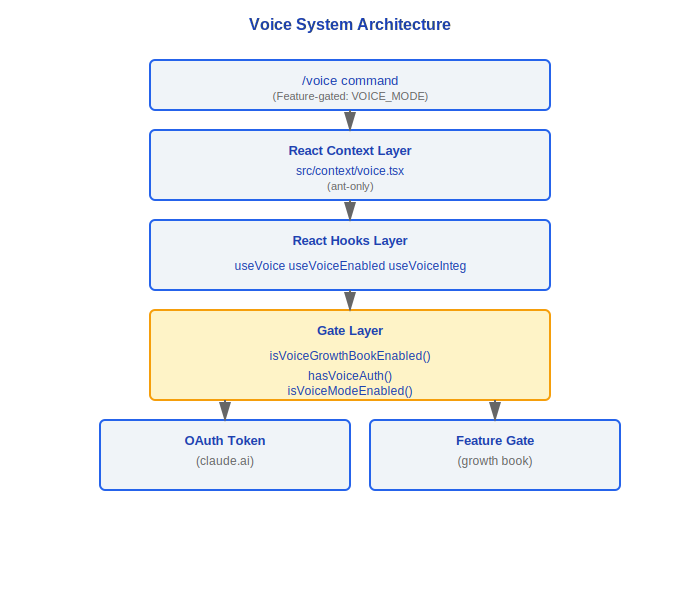
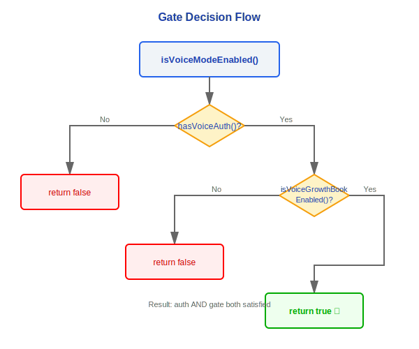
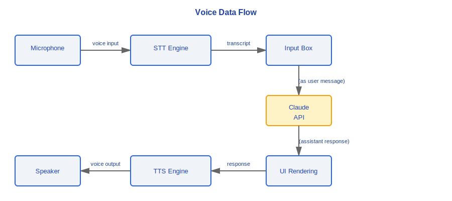

# Voice System

> Claude Code's voice system supports voice input and voice output, enabled only when all conditions are met through a multi-layer gate. The overall architecture consists of a Feature Gate Layer, a React Hooks Layer, and a React Context Layer.

---

## Architecture Overview



### Design Philosophy

#### Why Three-Layer Gating (OAuth + GrowthBook + FeatureGate)?

The voice feature involves two sensitive resources: server cost (each STT/TTS API call has real compute overhead) and privacy (microphone access). The three-layer gate ensures all three conditions are met simultaneously before the feature can be used: the user is authenticated (OAuth), the feature has not been emergency-disabled (GrowthBook kill-switch), and the platform build supports it (Feature Gate). The comment in `voiceModeEnabled.ts` explicitly states: "Use this for deciding whether voice mode should be *visible*" — the gate takes effect at the UI level rather than waiting until an API call fails to surface an error.

#### Why Inverted Naming (tengu_amber_quartz_disabled)?

The source comment reads: "Default `false` means a missing/stale disk cache reads as 'not killed'". The inverted logic of the `_disabled` suffix serves two purposes: first, security obfuscation — it prevents reverse-engineering to enable unreleased features by simply searching for the flag name; second, safe-by-default — when the flag does not exist it defaults to "not disabled" (i.e., the feature is available), so a fresh install can use voice normally without waiting for GrowthBook to initialize, yet in an emergency the flag can be set to `true` to immediately disable the feature network-wide.

#### Why Is It Only Available to OAuth Users (Not API Key Users)?

The source comment explains directly: "Voice mode requires Anthropic OAuth — it uses the voice_stream endpoint on claude.ai which is not available with API keys, Bedrock, Vertex, or Foundry". Voice requires STT/TTS backend services that are bound to the claude.ai account system. API keys are essentially stateless billing credentials with no session-level service endpoint associated with them.

#### Why Is VoiceContext ant-only?

Voice is an experimental feature that is first validated internally at Anthropic for stability and experience before being released to the public. The `ant-only` marker ensures that this code is completely excluded from open-source builds and external user binaries — it is not "disabled" but excluded at compile time.

---

## 1. Gate (voiceModeEnabled.ts)

The voice feature uses a three-layer gate; all layers must pass before it is enabled.

### 1.1 GrowthBook Gate

```typescript
function isVoiceGrowthBookEnabled(): boolean
```

- Checks the GrowthBook flag: `'tengu_amber_quartz_disabled'`
- **Inverted logic**: the flag name contains `_disabled`, therefore:
  - flag = `true` → feature **disabled**
  - flag = `false` / not set → feature **enabled**

> **Note**: This inverted naming convention is intentional obfuscation to prevent bypassing the gate by simply modifying the flag name.

### 1.2 Authentication Gate

```typescript
function hasVoiceAuth(): boolean
```

- Checks whether a valid OAuth token is present
- **claude.ai users only** — API key users cannot use voice
- Token source: obtained during the OAuth authentication flow

### 1.3 Combined Gate

```typescript
function isVoiceModeEnabled(): boolean {
  return hasVoiceAuth() && isVoiceGrowthBookEnabled()
}
```

Gate decision flow:



---

## 2. React Hooks

### 2.1 useVoice

```typescript
function useVoice(): {
  isListening: boolean
  startListening: () => void
  stopListening: () => void
  transcript: string
  speak: (text: string) => void
  isSpeaking: boolean
}
```

The core voice interaction hook, encapsulating:

| Capability | Description |
|------------|-------------|
| Voice Input (STT) | Microphone recording → text conversion |
| Voice Output (TTS) | Text → audio playback |
| State Management | `isListening` / `isSpeaking` |
| Transcription Text | `transcript` updated in real time |

### 2.2 useVoiceEnabled

```typescript
function useVoiceEnabled(): {
  isEnabled: boolean
  reason?: 'no_auth' | 'gate_disabled' | 'not_supported'
}
```

- Encapsulates gate-checking logic
- Provides a disable reason for the UI to display informational messages

### 2.3 useVoiceIntegration

```typescript
function useVoiceIntegration(): {
  // Complete interface combining useVoice + useVoiceEnabled
  isEnabled: boolean
  isListening: boolean
  transcript: string
  toggleVoice: () => void
  speakResponse: (text: string) => void
}
```

- **Full integration hook**: merges gate checking with voice capability
- Upper-level UI components only need to call this hook to obtain the complete voice capability
- Automatic handling: `toggleVoice` is a no-op when voice is not enabled

---

## 3. React Context

### 3.1 VoiceContext (src/context/voice.tsx)

```typescript
// ant-only: included only in Anthropic internal builds

const VoiceContext = React.createContext<VoiceContextValue | null>(null)

interface VoiceContextValue {
  voiceState: VoiceState
  dispatch: (action: VoiceAction) => void
}
```

- **ant-only marker**: this file is compiled only in internal builds; the open-source version does not include it
- Provides global voice state management
- Shares voice state throughout the component tree via Context

---

## 4. /voice Command

### 4.1 Command Definition

```typescript
{
  name: 'voice',
  description: 'Toggle voice input mode',
  featureGate: 'VOICE_MODE',  // Feature gate protection
  handler: async () => {
    // Toggle voice input mode
  }
}
```

### 4.2 Feature Gate

| Gate Name | Type | Description |
|-----------|------|-------------|
| `VOICE_MODE` | Feature Flag | Controls visibility of the /voice command |

- When the gate is closed, the `/voice` command does not appear in the command list
- Users cannot trigger it by typing `/voice`
- Independent from the GrowthBook gate — both must pass

---

## Data Flow



---

## Access Control Matrix

| User Type | OAuth Token | GrowthBook | Feature Gate | Available? |
|-----------|-------------|------------|--------------|------------|
| claude.ai user (internal) | Present | Enabled | Enabled | Yes |
| claude.ai user (external) | Present | Disabled | Enabled | No |
| API key user | Absent | N/A | N/A | No |
| Open-source build | Absent | N/A | N/A | No |

---

## Engineering Practice Guide

### Debugging Unavailable Voice

When the voice feature is not working, follow these steps to troubleshoot the three-layer gate one layer at a time:

1. **Check `hasVoiceAuth()`**: Has the user logged in to claude.ai via OAuth? API key users will always return `false`.
2. **Check `isVoiceGrowthBookEnabled()`**: Is the GrowthBook flag `tengu_amber_quartz_disabled` set to `true`? Note the **inverted logic** — a flag value of `true` means the feature is **disabled**.
3. **Check Feature Gate `VOICE_MODE`**: This gate controls whether the `/voice` command is visible in the command list, and is independent from the GrowthBook gate.

If all three layers pass but voice still does not work, check:
- Whether the browser/system has granted microphone permission
- Whether the STT/TTS backend service (claude.ai voice_stream endpoint) is reachable

### The reason Field in useVoiceEnabled

The `reason` field returned by the `useVoiceEnabled()` hook tells you directly why the feature is disabled:

| reason value | Meaning | Solution |
|--------------|---------|----------|
| `'no_auth'` | No valid OAuth token | Log in with a claude.ai account; API keys do not support voice |
| `'gate_disabled'` | GrowthBook kill-switch has been triggered | Wait for the server-side re-enable, or check the GrowthBook configuration |
| `'not_supported'` | Current platform/build does not support voice | Confirm you are using an internal build version that supports voice |

### Common Pitfalls

> **API key users cannot use voice**: This is not a bug but a design constraint. The voice feature depends on the `voice_stream` endpoint on claude.ai, which is bound to the OAuth account system; API key / Bedrock / Vertex / Foundry are all unsupported. Do not attempt to bypass the gate — even if the frontend check is bypassed, the backend will not respond.

> **The ant-only VoiceContext does not exist in open-source builds**: `src/context/voice.tsx` is marked `ant-only` and is excluded from the open-source version at compile time. If you reference `VoiceContext` in an open-source build you will get a compile error rather than a runtime error. Always perform null checks when writing code that depends on voice.

> **Caching of the GrowthBook flag**: The value of `tengu_amber_quartz_disabled` may be cached to local disk. If the server-side flag has been updated but the client still shows the old state, check whether the local GrowthBook cache has expired. The source code is designed so that "a missing cache defaults to not-disabled" — a fresh install will work normally before the cache synchronizes.


---

[← Vim Mode](../28-Vim模式/vim-mode-en.md) | [Index](../README_EN.md) | [Remote Session →](../30-远程会话/remote-session-en.md)
