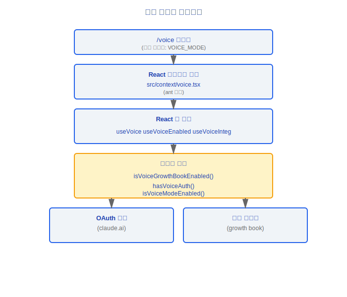
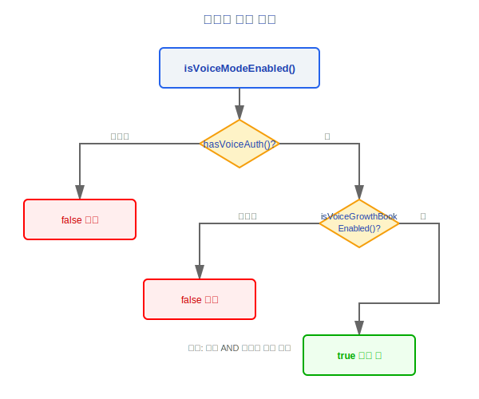
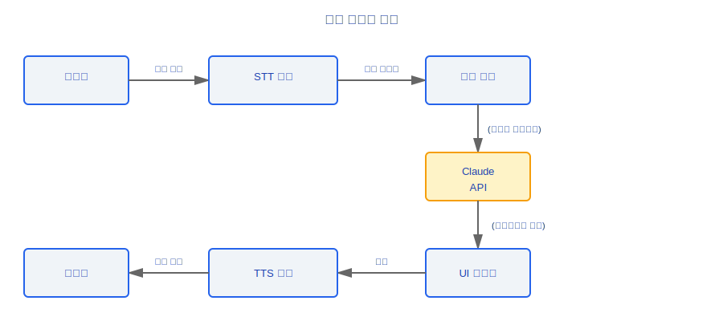

# 음성(Voice) 시스템

> Claude Code의 음성(Voice) 시스템은 음성 입력 및 음성 출력을 지원하며, 다층 게이트를 통해 모든 조건이 충족될 때만 활성화됩니다. 전체 아키텍처는 기능 게이트 레이어(Feature Gate Layer), React 훅(Hooks) 레이어, React 컨텍스트 레이어로 구성됩니다.

---

## 아키텍처 개요



### 설계 철학

#### 왜 3단계 게이팅 (OAuth + GrowthBook + FeatureGate)?

음성 기능은 두 가지 민감한 자원을 포함합니다: 서버 비용 (각 STT/TTS API 호출에는 실제 컴퓨팅 오버헤드가 있음)과 프라이버시 (마이크 접근). 3단계 게이트는 기능을 사용하기 전에 세 가지 조건이 모두 동시에 충족되도록 보장합니다: 사용자가 인증되었고 (OAuth), 기능이 긴급 비활성화되지 않았으며 (GrowthBook 킬 스위치), 플랫폼 빌드가 지원합니다 (Feature Gate). `voiceModeEnabled.ts`의 주석에는 명확히 설명되어 있습니다: "음성 모드가 *표시*되어야 하는지 결정할 때 이것을 사용하세요" — 게이트는 API 호출이 실패할 때 오류를 표면화하기를 기다리는 대신 UI 수준에서 적용됩니다.

#### 왜 역전된 명명 (tengu_amber_quartz_disabled)?

소스 주석에는 이렇게 적혀 있습니다: "기본 `false`는 없거나 오래된 디스크 캐시가 '차단되지 않음'으로 읽힌다는 것을 의미합니다". `_disabled` 접미사의 역전된 로직은 두 가지 목적을 제공합니다: 첫째, 보안 난독화 — 단순히 플래그 이름을 검색하여 미출시 기능을 활성화하는 리버스 엔지니어링을 방지합니다; 둘째, 기본 안전 — 플래그가 없을 때 "비활성화되지 않음" (즉, 기능 사용 가능)으로 기본 설정되므로, 새로 설치 시 GrowthBook이 초기화되기를 기다리지 않고 음성을 정상적으로 사용할 수 있지만, 긴급 시 플래그를 `true`로 설정하여 즉시 네트워크 전체에서 기능을 비활성화할 수 있습니다.

#### 왜 OAuth 사용자에게만 제공되는가 (API 키 사용자 제외)?

소스 주석에 직접 설명되어 있습니다: "음성 모드는 Anthropic OAuth가 필요합니다 — claude.ai의 voice_stream 엔드포인트를 사용하며, 이는 API 키, Bedrock, Vertex, 또는 Foundry에서는 사용할 수 없습니다". 음성에는 claude.ai 계정 시스템에 바인딩된 STT/TTS 백엔드 서비스가 필요합니다. API 키는 본질적으로 상태가 없는 청구 자격증명으로, 연결된 세션 수준 서비스 엔드포인트가 없습니다.

#### 왜 VoiceContext가 ant-only인가?

음성은 실험적인 기능으로, 공개 출시 전에 Anthropic 내부에서 먼저 안정성과 경험을 검증합니다. `ant-only` 마커는 이 코드가 오픈소스 빌드 및 외부 사용자 바이너리에서 완전히 제외되도록 보장합니다 — "비활성화"가 아니라 컴파일 시 제외됩니다.

---

## 1. 게이트 (voiceModeEnabled.ts)

음성 기능은 3단계 게이트를 사용하며, 모든 레이어를 통과해야 활성화됩니다.

### 1.1 GrowthBook 게이트

```typescript
function isVoiceGrowthBookEnabled(): boolean
```

- GrowthBook 플래그 확인: `'tengu_amber_quartz_disabled'`
- **역전된 로직**: 플래그 이름에 `_disabled`가 포함되어 있으므로:
  - 플래그 = `true` → 기능 **비활성화**
  - 플래그 = `false` / 미설정 → 기능 **활성화**

> **참고**: 이 역전된 명명 규칙은 플래그 이름을 수정하여 게이트를 우회하는 것을 방지하기 위한 의도적인 난독화입니다.

### 1.2 인증 게이트

```typescript
function hasVoiceAuth(): boolean
```

- 유효한 OAuth 토큰이 있는지 확인합니다
- **claude.ai 사용자 전용** — API 키 사용자는 음성을 사용할 수 없습니다
- 토큰 소스: OAuth 인증 흐름 중에 획득됩니다

### 1.3 통합 게이트

```typescript
function isVoiceModeEnabled(): boolean {
  return hasVoiceAuth() && isVoiceGrowthBookEnabled()
}
```

게이트 결정 흐름:



---

## 2. React 훅(Hooks)

### 2.1 useVoice

```typescript
function useVoice(): {
  isListening: boolean
  startListening: () => void
  stopListening: () => void
  transcript: string
  speak: (text: string) => void
  isSpeaking: boolean
}
```

핵심 음성 상호작용 훅(Hook)으로, 다음을 캡슐화합니다:

| 기능 | 설명 |
|------|------|
| 음성 입력 (STT) | 마이크 녹음 → 텍스트 변환 |
| 음성 출력 (TTS) | 텍스트 → 오디오 재생 |
| 상태 관리(State Management) | `isListening` / `isSpeaking` |
| 전사 텍스트 | 실시간으로 업데이트되는 `transcript` |

### 2.2 useVoiceEnabled

```typescript
function useVoiceEnabled(): {
  isEnabled: boolean
  reason?: 'no_auth' | 'gate_disabled' | 'not_supported'
}
```

- 게이트 확인 로직을 캡슐화합니다
- UI가 정보 메시지를 표시할 수 있도록 비활성화 이유를 제공합니다

### 2.3 useVoiceIntegration

```typescript
function useVoiceIntegration(): {
  // useVoice + useVoiceEnabled를 결합한 완전한 인터페이스
  isEnabled: boolean
  isListening: boolean
  transcript: string
  toggleVoice: () => void
  speakResponse: (text: string) => void
}
```

- **완전 통합 훅(Hook)**: 게이트 확인과 음성 기능을 병합합니다
- 상위 레벨 UI 컴포넌트는 이 훅(Hook)만 호출하면 완전한 음성 기능을 얻습니다
- 자동 처리: 음성이 활성화되지 않은 경우 `toggleVoice`는 아무 작업도 하지 않습니다

---

## 3. React 컨텍스트

### 3.1 VoiceContext (src/context/voice.tsx)

```typescript
// ant-only: Anthropic 내부 빌드에만 포함됩니다

const VoiceContext = React.createContext<VoiceContextValue | null>(null)

interface VoiceContextValue {
  voiceState: VoiceState
  dispatch: (action: VoiceAction) => void
}
```

- **ant-only 마커**: 이 파일은 내부 빌드에서만 컴파일됩니다; 오픈소스 버전에는 포함되지 않습니다
- 전역 음성 상태 관리(State Management)를 제공합니다
- 컨텍스트를 통해 컴포넌트 트리 전체에서 음성 상태를 공유합니다

---

## 4. /voice 명령어

### 4.1 명령어 정의

```typescript
{
  name: 'voice',
  description: '음성 입력 모드 토글',
  featureGate: 'VOICE_MODE',  // 기능 게이트 보호
  handler: async () => {
    // 음성 입력 모드 토글
  }
}
```

### 4.2 기능 게이트

| 게이트 이름 | 타입 | 설명 |
|-----------|------|------|
| `VOICE_MODE` | Feature Flag | /voice 명령어의 가시성 제어 |

- 게이트가 닫히면 `/voice` 명령어가 명령어 목록에 나타나지 않습니다
- 사용자가 `/voice`를 입력하여 트리거할 수 없습니다
- GrowthBook 게이트와 독립적입니다 — 두 가지 모두 통과해야 합니다

---

## 데이터 흐름



---

## 접근 제어 매트릭스

| 사용자 타입 | OAuth 토큰 | GrowthBook | Feature Gate | 사용 가능? |
|-----------|----------|------------|--------------|----------|
| claude.ai 사용자 (내부) | 있음 | 활성화됨 | 활성화됨 | 예 |
| claude.ai 사용자 (외부) | 있음 | 비활성화됨 | 활성화됨 | 아니오 |
| API 키 사용자 | 없음 | 해당 없음 | 해당 없음 | 아니오 |
| 오픈소스 빌드 | 없음 | 해당 없음 | 해당 없음 | 아니오 |

---

## 엔지니어링 실천 가이드

### 음성 기능 사용 불가 디버깅

음성 기능이 작동하지 않을 때 다음 단계에 따라 3단계 게이트를 하나씩 확인합니다:

1. **`hasVoiceAuth()` 확인**: 사용자가 OAuth를 통해 claude.ai에 로그인했나요? API 키 사용자는 항상 `false`를 반환합니다.
2. **`isVoiceGrowthBookEnabled()` 확인**: GrowthBook 플래그 `tengu_amber_quartz_disabled`가 `true`로 설정되어 있나요? **역전된 로직**에 주의하세요 — 플래그 값이 `true`이면 기능이 **비활성화**됨을 의미합니다.
3. **Feature Gate `VOICE_MODE` 확인**: 이 게이트는 `/voice` 명령어가 명령어 목록에 표시되는지 여부를 제어하며, GrowthBook 게이트와 독립적입니다.

세 레이어를 모두 통과했지만 음성이 여전히 작동하지 않는다면 다음을 확인합니다:
- 브라우저/시스템이 마이크 권한을 부여했는지
- STT/TTS 백엔드 서비스 (claude.ai voice_stream 엔드포인트)에 접근 가능한지

### useVoiceEnabled의 reason 필드

`useVoiceEnabled()` 훅(Hook)이 반환하는 `reason` 필드는 기능이 비활성화된 이유를 직접 알려줍니다:

| reason 값 | 의미 | 해결책 |
|----------|------|-------|
| `'no_auth'` | 유효한 OAuth 토큰 없음 | claude.ai 계정으로 로그인; API 키는 음성을 지원하지 않음 |
| `'gate_disabled'` | GrowthBook 킬 스위치가 트리거됨 | 서버 측 재활성화를 기다리거나 GrowthBook 설정 확인 |
| `'not_supported'` | 현재 플랫폼/빌드가 음성을 지원하지 않음 | 음성을 지원하는 내부 빌드 버전을 사용하고 있는지 확인 |

### 흔한 함정

> **API 키 사용자는 음성을 사용할 수 없습니다**: 이것은 버그가 아니라 설계 제약입니다. 음성 기능은 OAuth 계정 시스템에 바인딩된 claude.ai의 `voice_stream` 엔드포인트에 의존합니다; API 키 / Bedrock / Vertex / Foundry는 모두 지원되지 않습니다. 게이트를 우회하려고 시도하지 마세요 — 프론트엔드 확인을 우회해도 백엔드가 응답하지 않습니다.

> **오픈소스 빌드에서는 ant-only VoiceContext가 존재하지 않습니다**: `src/context/voice.tsx`는 `ant-only`로 표시되어 컴파일 시 오픈소스 버전에서 제외됩니다. 오픈소스 빌드에서 `VoiceContext`를 참조하면 런타임 오류가 아닌 컴파일 오류가 발생합니다. 음성에 의존하는 코드를 작성할 때는 항상 null 확인을 수행하세요.

> **GrowthBook 플래그 캐싱**: `tengu_amber_quartz_disabled`의 값은 로컬 디스크에 캐시될 수 있습니다. 서버 측 플래그가 업데이트되었지만 클라이언트가 여전히 이전 상태를 보여준다면, 로컬 GrowthBook 캐시가 만료되었는지 확인하세요. 소스 코드는 "캐시가 없으면 기본적으로 비활성화되지 않음"으로 설계되어 있습니다 — 새로 설치 시 캐시가 동기화되기 전에도 정상적으로 작동합니다.


---

[← Vim 모드](../28-Vim模式/vim-mode-ko.md) | [목차](../README_KO.md) | [원격 세션 →](../30-远程会话/remote-session-ko.md)
