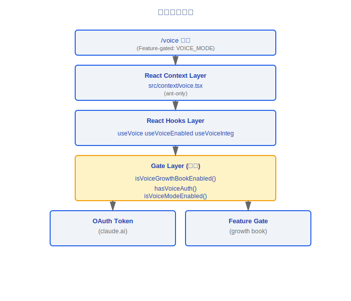
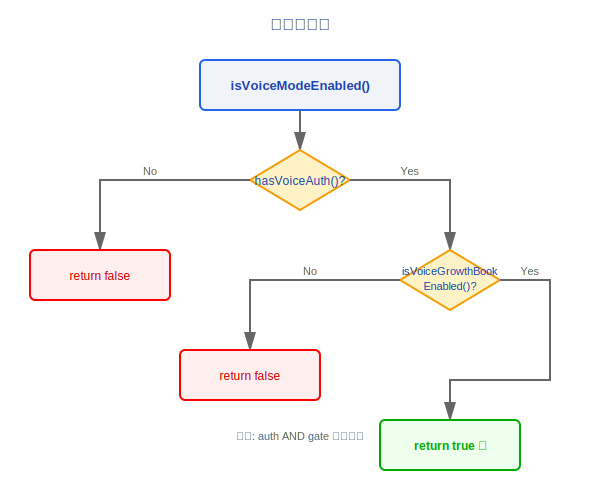
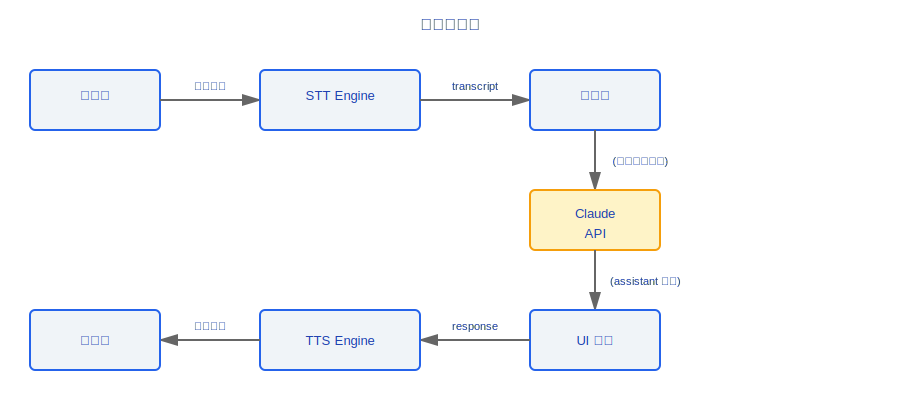

# 语音系统

> Claude Code 的语音系统支持语音输入和语音输出,通过多层门控确保仅在满足条件时启用。整体架构包括功能门控层、React Hooks 层和 React Context 层。

---

## 架构总览



### 设计理念

#### 为什么三层门控 (OAuth + GrowthBook + FeatureGate)?

语音功能涉及两个敏感资源:服务器成本 (每次 STT/TTS API 调用都有真实的计算开销) 和隐私 (麦克风访问)。三层门控确保同时满足三个条件才能使用:用户已认证 (OAuth)、功能未被紧急关闭 (GrowthBook kill-switch)、平台构建支持 (Feature Gate)。源码 `voiceModeEnabled.ts` 的注释明确写道:"Use this for deciding whether voice mode should be *visible*"——门控在 UI 层面就生效,而非等到调用失败才报错。

#### 为什么反转命名 (tengu_amber_quartz_disabled)?

源码注释写道:"Default `false` means a missing/stale disk cache reads as 'not killed'"。`_disabled` 后缀的反转逻辑有两层目的:一是安全混淆——防止通过简单搜索 flag 名称来逆向启用未发布功能;二是默认安全——flag 不存在时默认为"未禁用"(即功能可用),新安装不需要等待 GrowthBook 初始化就能正常使用语音,但紧急情况下可以通过将 flag 设为 `true` 立即关闭全网功能。

#### 为什么仅 OAuth 用户可用 (API key 用户不行)?

源码注释直接说明了原因:"Voice mode requires Anthropic OAuth — it uses the voice_stream endpoint on claude.ai which is not available with API keys, Bedrock, Vertex, or Foundry"。语音需要 STT/TTS 后端服务,这些服务绑定 claude.ai 账户体系。API key 本质上是无状态的计费凭证,没有与之关联的会话级服务端点。

#### 为什么 ant-only 的 VoiceContext?

语音是实验性功能,先在 Anthropic 内部验证稳定性和体验后再对外发布。`ant-only` 标记确保开源构建和外部用户的二进制中完全不包含这段代码——不是"禁用",而是编译期就被排除。

---

## 1. 门控 (voiceModeEnabled.ts)

语音功能使用三层门控逻辑,全部通过才启用。

### 1.1 Growth Book 门控

```typescript
function isVoiceGrowthBookEnabled(): boolean
```

- 检查 growth book flag: `'tengu_amber_quartz_disabled'`
- **反转逻辑**: flag 名包含 `_disabled`,因此:
  - flag = `true` → 功能 **禁用**
  - flag = `false` / 未设置 → 功能 **启用**

> **注意**: 这种反转命名约定是有意为之的混淆,用于防止通过简单修改 flag 名称来绕过门控。

### 1.2 认证门控

```typescript
function hasVoiceAuth(): boolean
```

- 检查是否存在有效的 OAuth 令牌
- **仅限 claude.ai 用户** — API key 用户无法使用语音
- 令牌来源: OAuth 认证流程中获取

### 1.3 组合门控

```typescript
function isVoiceModeEnabled(): boolean {
  return hasVoiceAuth() && isVoiceGrowthBookEnabled()
}
```

门控决策流:



---

## 2. React Hooks

### 2.1 useVoice

```typescript
function useVoice(): {
  isListening: boolean
  startListening: () => void
  stopListening: () => void
  transcript: string
  speak: (text: string) => void
  isSpeaking: boolean
}
```

核心语音交互 hook,封装:

| 能力 | 说明 |
|------|------|
| 语音输入 (STT) | 麦克风录音 → 转文字 |
| 语音输出 (TTS) | 文字 → 语音播放 |
| 状态管理 | `isListening` / `isSpeaking` |
| 转录文本 | `transcript` 实时更新 |

### 2.2 useVoiceEnabled

```typescript
function useVoiceEnabled(): {
  isEnabled: boolean
  reason?: 'no_auth' | 'gate_disabled' | 'not_supported'
}
```

- 封装门控检查逻辑
- 提供禁用原因,便于 UI 展示提示信息

### 2.3 useVoiceIntegration

```typescript
function useVoiceIntegration(): {
  // 组合 useVoice + useVoiceEnabled 的完整接口
  isEnabled: boolean
  isListening: boolean
  transcript: string
  toggleVoice: () => void
  speakResponse: (text: string) => void
}
```

- **完整集成 hook**: 将门控检查与语音能力合并
- 上层 UI 组件只需调用此 hook 即可获得完整语音能力
- 自动处理: 未启用时 `toggleVoice` 为 no-op

---

## 3. React Context

### 3.1 VoiceContext (src/context/voice.tsx)

```typescript
// ant-only: 仅在 Anthropic 内部构建中包含

const VoiceContext = React.createContext<VoiceContextValue | null>(null)

interface VoiceContextValue {
  voiceState: VoiceState
  dispatch: (action: VoiceAction) => void
}
```

- **ant-only 标记**: 该文件仅在内部构建中编译,开源版本不包含
- 提供全局语音状态管理
- 通过 Context 在组件树中共享语音状态

---

## 4. /voice 命令

### 4.1 命令定义

```typescript
{
  name: 'voice',
  description: 'Toggle voice input mode',
  featureGate: 'VOICE_MODE',  // Feature gate 保护
  handler: async () => {
    // 切换语音输入模式
  }
}
```

### 4.2 Feature Gate

| Gate 名称 | 类型 | 说明 |
|-----------|------|------|
| `VOICE_MODE` | Feature Flag | 控制 /voice 命令可见性 |

- 当 gate 关闭时, `/voice` 命令不出现在命令列表中
- 用户无法通过输入 `/voice` 触发
- 与 growth book gate 独立 — 两者都需要通过

---

## 数据流



---

## 访问控制矩阵

| 用户类型 | OAuth 令牌 | Growth Book | Feature Gate | 可用? |
|---------|-----------|-------------|-------------|-------|
| claude.ai 用户 (内部) | 有 | 启用 | 启用 | 可用 |
| claude.ai 用户 (外部) | 有 | 禁用 | 启用 | 不可用 |
| API key 用户 | 无 | N/A | N/A | 不可用 |
| 开源构建 | 无 | N/A | N/A | 不可用 |

---

## 工程实践指南

### 调试语音不可用

当语音功能不工作时,按以下步骤逐层排查三层门控:

1. **检查 `hasVoiceAuth()`**: 用户是否通过 OAuth 登录了 claude.ai? API key 用户永远返回 `false`
2. **检查 `isVoiceGrowthBookEnabled()`**: GrowthBook flag `tengu_amber_quartz_disabled` 是否为 `true`? 注意**反转逻辑**——flag 为 `true` 意味着功能被**禁用**
3. **检查 Feature Gate `VOICE_MODE`**: 此 gate 控制 `/voice` 命令是否在命令列表中可见,与 GrowthBook gate 独立

如果三层全部通过但语音仍不工作,检查:
- 浏览器/系统是否授予了麦克风权限
- STT/TTS 后端服务 (claude.ai voice_stream endpoint) 是否可达

### useVoiceEnabled 的 reason 字段

`useVoiceEnabled()` hook 返回的 `reason` 字段直接告诉你禁用原因:

| reason 值 | 含义 | 解决方案 |
|-----------|------|---------|
| `'no_auth'` | 没有有效的 OAuth 令牌 | 使用 claude.ai 账户登录,API key 不支持语音 |
| `'gate_disabled'` | GrowthBook kill-switch 已触发 | 等待服务端重新启用,或检查 GrowthBook 配置 |
| `'not_supported'` | 当前平台/构建不支持 | 确认使用的是支持语音的内部构建版本 |

### 常见陷阱

> **API key 用户无法使用语音**: 这不是 bug 而是设计限制。语音功能依赖 claude.ai 的 `voice_stream` 端点,该端点绑定 OAuth 账户体系,API key/Bedrock/Vertex/Foundry 均不可用。不要尝试通过修改门控绕过——即使绕过了前端检查,后端也不会响应。

> **ant-only 的 VoiceContext 在开源构建中不存在**: `src/context/voice.tsx` 被 `ant-only` 标记,编译期排除在开源版本之外。如果你在开源构建中引用 `VoiceContext`,会得到编译错误而非运行时错误。在编写依赖语音的代码时,始终做空值检查。

> **GrowthBook flag 的缓存**: `tengu_amber_quartz_disabled` 的值可能被本地磁盘缓存。如果服务端已更新 flag 但客户端仍然显示旧状态,检查本地 GrowthBook 缓存是否过期。源码设计为"缓存缺失时默认为未禁用"——新安装会在缓存同步前正常工作。


---

[← Vim 模式](../28-Vim模式/vim-mode.md) | [目录](../README.md) | [远程会话 →](../30-远程会话/remote-session.md)
